# 03-前端技术

## HTML4

### 知识体系


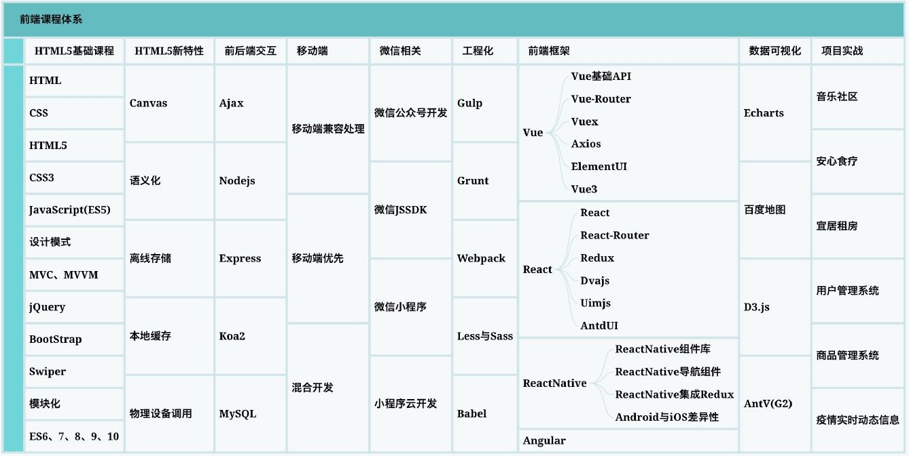

### 工具

#### 浏览器

浏览器是我们最重要的合作伙伴

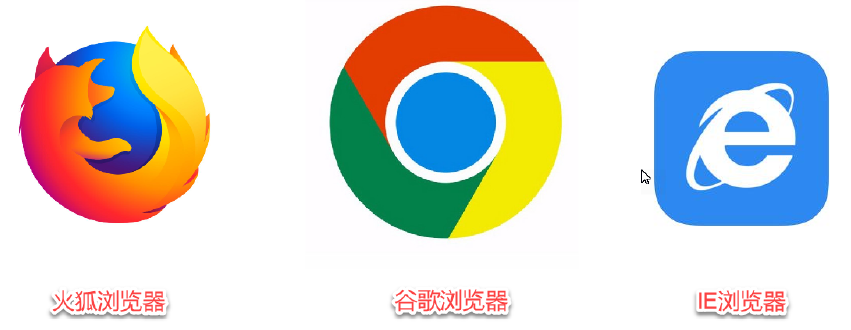

> **推荐选择**
>
> 我们推荐谷歌浏览器，有两点原因：
>
> 1. 简洁大方，打开响应速度快
> 2. 开发者调试工具

#### 开发工具

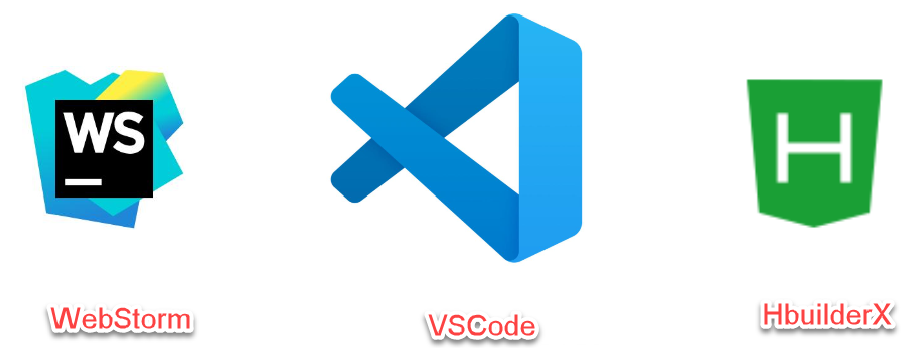

> **推荐选择**
>
> 我们推荐选择VSCode
>
> 1. 打开速度快
> 2. 使用方便

**VSCode中文语言包安装：**

扩展 → 搜索Chinese → 点击安装

**VSCode常用快捷键列表**

1. 代码格式化：`Shift+Alt+F`
2. 向上或向下移动一行：`Alt+Up 或 Alt+Down`
3. 快速复制一行代码：`Shift+Alt+Up 或 Shift+Alt+Down`
4. 快速保存：`Ctrl + S`
5. 快速查找：`Ctrl + F`
6. 快速替换：`Ctrl + H`

**VSCode插件**

快速打开浏览器

扩展 -> 搜索open in browser -> 点击安装

**Live Server 插件**

1. 可以更加方便的打开网页。
2. 打开网页的方式更贴近项目上线。
3. 代码出现改动后，可以自动刷新。
4. 根据自己的情况，去配置一下 VSCode 的自动保存。

> 注意1：务必使用VSCode打开的是文件夹，否则 Live Server 插件无法正常工作！

> 注意2：打开的网页必须是标准的HTML结构，否则无法自动刷新！

**开发者文档**

- W3C官网： www.w3c.org
- W3School： www.w3school.com.cn
- MDN： developer.mozilla.org —— 平时用的最多。

### 前序

#### 两位先驱

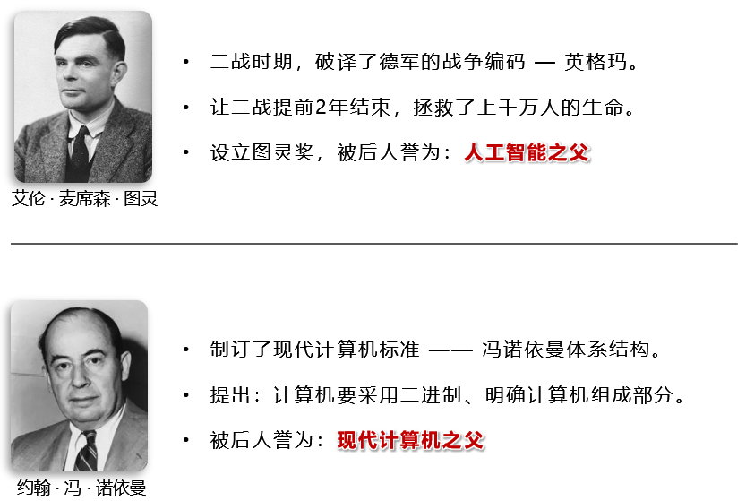

#### 基础知识

1. 计算机俗称电脑，是现代一种用于高速计算的电子计算机器，可以进行数值计算、逻辑计算，还具有存储记忆功能。
2. 计算机由 硬件 + 软件 成：
   硬件：看得见摸得着的物理部件。
   软件：可以指挥硬件工作的指令。
3. 软件的分类：
4. 系统软件：Windows、Linux、Android、Harmony 等。
5. 应用软件：微信、QQ、王者荣耀、PhotoShop 等。
6. 整体图示：

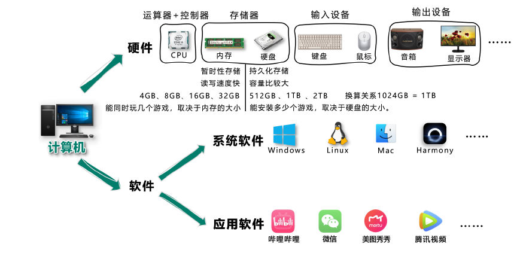

#### 两种架构

1. 上面提到的应用软件，又分为两大类：

- C/S架构，特点：需要安装、偶尔更新、不跨平台、开发更具针对性。
- B/S架构，特点：无需安装、无需更新、可跨平台、开发更具通用性。

> 名词解释：C => client（客户端）、B => browser（浏览器）、S => server（服务器）。
> 服务器 ：为软件提供数据的设备（在背后默默的付出）。

2. 前端工程师，主要负责编写 B/S架构中的网页（呈现界面、实现交互）。

> 备注：大前端时代，我们可以用前端的技术栈，做出一个C/S架构的应用、甚至搭建一个服务器😎。

#### 浏览器知识

浏览器是网页运行的平台，常见的浏览器有： 谷歌(Chrome) 、Safari 、IE 、火狐(Firefox) 、欧朋(Opera) 等，以上这些是常用的五大浏览器。

常见浏览器内核：

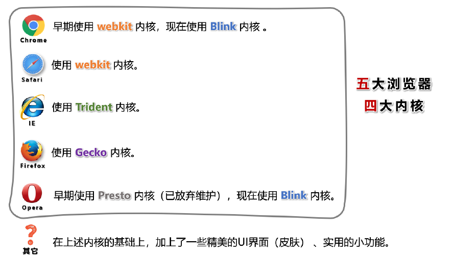

#### 网页概念

1. 网址：我们在浏览器中输入的地址。
2. 网页：浏览器所呈现的每一个页面。
3. 网站：多个网页构成了一个网站。
4. 网页标准：


### 简介

HTML5是用来描述网页的一种语言，被称为超文本标记语言。用HTML5编写的文件，后缀以`.html`结尾。HTML是一种标记语言，标记语言是一套标记标签。标签是由尖括号包围的关键字，例如：`<html>`

标签有两种表现形式：

1. 双标签，例如：`<html></html>`
2. 单标签，例如：``

> 超文本：暂且简单理解为 “超级的文本”，和普通文本比，内容更丰富。
> 标 记：文本要变成超文本，就需要用到各种标记符号。
> 语 言：每一个标记的写法、读音、使用规则，组成了一个标记语言。

#### 国际组织

1. IETF

> 全称：Internet Engineering Task Force（国际互联网工程任务组），成立于1985年底，是一个权威的互联网技术标准化组织，主要负责互联网相关技术规范的研发和制定，当前绝大多数国际互联网技术标准均出自IETF。官网： https://www.ietf.org

2. W3C

> 全称：World Wide Web Consortium（万维网联盟），创建于1994年，是目前Web技术领域，最具影响力的技术标准机构。共计发布了200多项技术标准和实施指南，对互联网技术的发展和应用起到了基础性和根本性的支撑作用，官网： https://www.w3.org

3. WHATWF

> 全称：Web Hypertext Application Technology Working Group（网页超文本应用技术工作小组）成立于2004年，是一个以推动网络HTML 5 标准为目的而成立的组织。由Opera、Mozilla基金会、苹果，等这些浏览器厂商组成。官网： https://whatwg.org/

#### 发展历史

从 HTML 1.0 开始发展，期间经历了很多版本，目前HTML的最新标准是：HMTL 5，具体发展史如图（了解即可）。

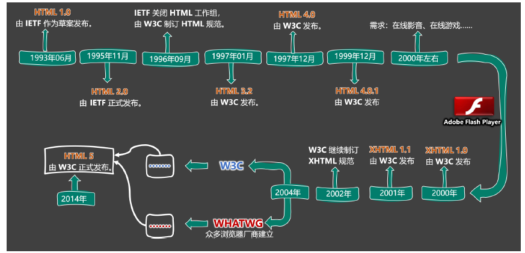

### 骨架

- 文档类型声明 (<!DOCTYPE html>)
- 根元素 (<html>)
- 头部信息 (<head>)
  - meta 标签 (charset, viewport, SEO)
  - title, link (CSS), script
  - base, style
- 主体内容 (<body>)

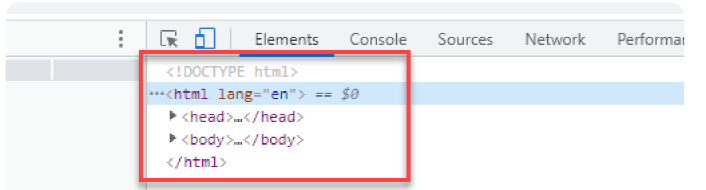

#### DOCTYPE声明

DOCTYPE是`document type` (文档类型) 的缩写。`<!DOCTYPE html >`是H5的声明位于文档的最前面，处于标签之前。他是网页必备的组成部分，避免浏览器的怪异模式。

```html
<!DOCTYPE html>
```

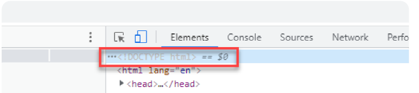

#### html标签

head标签用于定义文档的头部。文档的头部描述了文档的各种属性和信息，包括文档的标题、在 Web 中的位置以及和其他文档的关系等。绝大多数文档头部包含的数据都不会真正作为内容显示给读者。

```html
<!DOCTYPE html>
<html>
  <head> </head>
</html>
```

#### body标签

body 元素定义文档的主体。

body 元素包含文档的所有内容（比如文本、超链接、图像、表格和列表等等。）

它会直接在页面中显示出来，也就是用户可以直观看到的内容

```html
<!DOCTYPE html>
<html>
  <head> </head>
  <body>
    我会显示在浏览器中
  </body>
</html>
```

#### title标签

1. 可定义文档的标题。
2. 它显示在浏览器窗口的标题栏或状态栏上。
3. `<title>` 标签是 `<head>` 标签中唯一必须要求包含的东西，就是说写head一定要写title
4. `<title>`的增加有利于SEO优化

> SEO是搜索引擎优化的英文缩写。通过对网站内容调整，满足搜索引擎的排名需求

```html
<!DOCTYPE html>
<html>
  <head>
    <title>第一个页面</title>
  </head>
  <body>
    我会显示在浏览器中
  </body>
</html>
```

#### meta标签

meta标签用来描述一个HTML网页文档的属性，关键词等，例如：`charset="utf-8"`是说当前使用的是`utf-8`编码格式，在开发中我们经常会看到`utf-8`，或是`gbk`，这些都是编码格式，通常使用`utf-8`。

```html
<!DOCTYPE html>
<html lang="en">
  <head>
    <meta charset="UTF-8" />
    <title>itbaizhan</title>
  </head>
  <body></body>
</html>
```

### 注解

`<!--...-->` 注释标签用来在源文档中插入注释。注释不会在浏览器中显示。您可使用注释对您的代码进行解释，这样做有助于您在以后的时间对代码的编辑。特别是代码量很大的情况下很有用。

```html
<script type="text/javascript">
  <!--以下为注解部分
  function displayMsg() {
    alert("Hello World!");
  }
  //以上为注解部分-->
</script>
```

### 标签

> 1. 不同的标签，有不同的属性；也有一些通用属性（在任何标签内都能写，后面会详细
>    总结）。
> 2. 属性名、属性值不能乱写，都是W3C规定好的。
> 3. 属性名、属性值，都不区分大小写，但推荐小写。
> 4. 双引号，也可以写成单引号，甚至不写都行，但还是推荐写双引号。
> 5. 标签中不要出现同名属性，否则后写的会失效，例如：<input type="text" type="password">

#### 排版标签

##### 标题

标题（Heading）是通过 `<h1> - <h6> `标签进行定义的。

`<h1>`定义最大的标题 `<h6>`定义最小的标题

```html
<h1>一级标题</h1>
<h2>二级标题</h2>
<h3>三级标题</h3>
<h4>四级标题</h4>
<h5>五级标题</h5>
<h6>六级标题</h6>
```

> 生成h1~h6快捷键：h$*6

请确保将 HTML 标题标签只用于标题。不要仅仅是为了生成粗体或大号的文本而使用标题。

正确使用标题有益于SEO，应该将`< h1>` 用作主标题（最重要的），其后是 `<h2>`（次重要的），再其次是 `<h3>`，以此类推

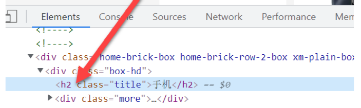

在标签中添加属性：`align="left | center | right"` 默认居左

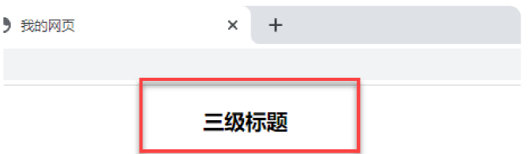

##### 段落与布局

|标签名 |标签含义 |单/双标签 |
|---|---|---|
|p |段落 |双 |
|div |没有任何含义，用于整体布局（生活中的包装袋） |双 |

> p 标签很特殊！它里面不能有： h1~h6 、p 、div 标签（暂时先这样记，后面会说规律）。

#### 换行水平线

##### 换行

如果您希望在不产生一个新段落的情况下进行换行（新行），请使用 `<br>`

`<br />` 元素是一个空的 HTML 元素。

```html
<p>这个<br />段落<br />演示了分行的效果</p>
```


##### 水平线

`<hr/>`标签在 HTML 页面中创建水平线

```html
<hr color="" width="" size="" align="" />
```

属性：

1. color：设置水平线的颜色
2. width：设置水平线的宽度
3. size：设置水平线的高度
4. align：设置水平线的对齐方式（默认居中），可取值left|right

#### 块级与行内元素

1. 块级元素：独占一行（排版标签都是块级元素）。
2. 行内元素：不独占一行（目前只学了： input ，稍后会学习更多）。
3. 使用原则：

> 1. 块级元素 中能写 行内元素 和 块级元素（简单记：块级元素中几乎什么都能写）。
> 2. 行内元素 中能写 行内元素，但不能写 块级元素。
> 3. 一些特殊的规则：
>    h1~h6 不能互相嵌套。p 中不要写块级元素。
>    备注： marquee 元素设计的初衷是：让文字有动画效果，但如今我们可以通过CSS 来实现
>    了，而且还可以实现的更加炫酷，所以marquee 标签已经：过时了（废弃了），不推荐使
>    用。我们只是在开篇的时候，用他做了一个引子而已，在后续的学习过程中，这些已经废弃
>    的标签，我们直接跳过。

#### 文本标签

1. 用于包裹：词汇、短语等。
2. 通常写在排版标签里面。
3. 排版标签更宏观（大段的文字），文本标签更微观（词汇、短语）。
4. 文本标签通常都是行内元素。

|标签 |描述 |
|:---:|:---:|
|`<em>` |定义着重文字 |
|`<b>` |定义粗体文本 |
|`<i>` |定义斜体字 |
|`<strong>` |定义加重语气 |
|`<del>` |定义删除字 |
|`<span>` |元素没有特定的含义 |

> **特别提示**
>
> 常用文本标签和段落是不同的，段落代表一段文本，而文本标签一般表示文本词汇。
>
> 生活中的例子： div 是大包装袋， span 是小包装袋。

#### 图片标签

##### 语法

网站中最多的元素毋庸置疑，一定是图片，`` 标签定义 HTML 页面中的图像

```html

```

> **注意事项**
>
> ``是单标签，不需要进行闭合操作
>
> 常见图像格式：GIF、PNG、JPEG

属性：

1. src：路径（图片地址与名字）
2. alt：规定图像的替代文本
3. width：规定图像的宽度
4. height：规定图像的高度
5. title：鼠标悬停在图片上给予提示

##### 路径

- 绝对路径

绝对路径是电脑的盘符存储与访问的具体地址

```html
E:\itbaizhanCode\1.jpg
```

```html

```

- 相对路径

两者相对关系，两者在同⼀路径下可以直接访问

1. 子级关系: `/`
2. 父级关系: `../`
3. 同级关系: `./`（可以省略）

- 网络路径

具体的⽹络地址: http://www.baidu.com/images/n1.png

- img属性

|属性 |属性值 |描述 |
|---|---|---|
|alt |文本 |图像不能显示时的替代文本 |
|title |文本 |鼠标指针悬停时显示的内容 |
|width |像素值 |设置图像的宽度 |
|height |像素值 |设置图像的高度 |

#### 超文本

##### 描述

HTML使用标签 `<a>`来设置超文本链接

超链接可以是一个字，一个词，或者一组词，也可以是一幅图像，您可以点击这些内容来跳转到新的文档

```html
<a href="url">链接文本</a>
```

##### 属性

在标签`<a> `中使用了`href`属性来描述链接的地址

默认情况下，链接将以，以下形式出现在浏览器中：

1. 一个未访问过的链接显示为蓝色字体并带有下划线。
2. 访问过的链接显示为紫色并带有下划线。
3. 点击链接时，链接显示为红色并带有下划线。

> **特别提示**
>
> 后期我们会通过CSS样式修改掉这些效果

|属性 |属性值 |描述 |
|---|---|---|
|href |目标url地址 |用于指定链接目标的url地址，<a>有了href属性时，就具备了链接的功能 |
|target |打开方式 |`_self`和`_blank`两种，`_self`为默认，直接打开，`blank`为新打开 |

###### 表现

当您把鼠标指针移动到网页中的某个链接上时，箭头会变为一只小手。

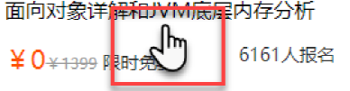

##### 锚点

如果网页内容较多，页面过长，浏览网页的时候，需要不断的拖动滚动条来查看网页的内容，这样效率低且不方便。为了提高检索速度，HTML语言提供了一种特殊的链接-锚点链接。

```html
<a href="#one">链接文本</a>
...
<h2 id="one">1.民族英雄概述</h2>
<!--在需要跳转的地方增加id定义，在使用跳转的时候，href属性#+需要跳转的实际id-->
```

##### 链接伪类

链接伪类主要用于在定义超链接时，配合鼠标指针操作，使超链接在单机前，单机后和鼠标指针悬停时显示不同的样式。在CSS中，常用的状态化伪类选择器主要有四种，分别为:link、:visited、:hover、:active。

|状态化伪类选择器 |描述 |
|---|---|
|a:link{CSS样式;} |设置超链接的默认样式 |
|a:visited{CSS样式;} |设置超链接被访问过之后的样式 |
|a:hover{CSS样式;} |设置鼠标指针悬停时超链接的样式 |
|a:active{CSS样式;} |设置鼠标指针单机不动时超链接的样式 |

```html
<head>
  <!-- 伪链接 -->
  <style>
    a:link {
      color: rgb(0, 0, 0);
    } /* 未访问的链接 */
    a:visited {
      color: rgb(177, 177, 177);
    } /* 已访问的链接 */
    a:hover {
      color: rgb(101, 150, 241);
    } /* 鼠标移动到链接上 */
    a:active {
      color: yellow;
    } /* 选定的链接 */
  </style>
</head>
<body>
  <a href="#">公司首页</a>
  <a href="#">公司简介</a>
  <a href="#">产品介绍</a>
  <a href="#">联系我们</a>
</body>
```

### 有序列表

#### 基本语法

有序列表是一列项目，列表项目使用数字进行标记。 有序列表始于` <ol>` 标签。每个列表项始于 `<li> `标签。

```html
<ol>
  <li>尚学堂</li>
  <li>百战程序员</li>
</ol>
```

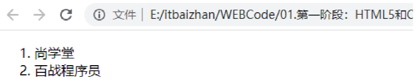

#### type属性

`<ol>`的属性type 拥有的选项

1. 1 表示列表项目用数字标号（1,2,3...）
2. a 表示列表项目用小写字母标号（a,b,c...）
3. A 表示列表项目用大写字母标号（A,B,C...）
4. i 表示列表项目用小写罗马数字标号（i,ii,iii...）
5. I 表示列表项目用大写罗马数字标号（I,II,III...）

#### 嵌套

```html
<ol>
  <li>尚学堂</li>
  <li>
    <ol>
      <li>阿里</li>
      <li>京东</li>
    </ol>
  </li>
  <li>百战程序员</li>
</ol>
```

### 无序列表

#### 语法

无序列表是一个项目的列表，此列项目使用粗体圆点（典型的小黑圆圈）进行标记。无序列表始于 `<ul>` 标签。每个列表项始于` <li>` 标签。

```html
<ul>
  <li>尚学堂</li>
  <li>百战程序员</li>
</ul>
```

#### type属性

`<ul>`的属性type 拥有的选项

- disc 默认实心圆
- circle 空心圆
- square 小方块
- none 不显示

#### 嵌套

列表是可以进行嵌套的

```html
<ul>
  <li>尚学堂</li>
  <li>
    <ul>
      <li>阿里</li>
      <li>京东</li>
    </ul>
  </li>
  <li>百战程序员</li>
</ul>
```

- 常见应用场景
  1. 无序的列表效果
  2. 导航效果

```html
<ul>
  <li>Xiaomi手机</li>
  <li>Redmi 红米</li>
  <li>电视</li>
  <li>笔记本</li>
</ul>
```

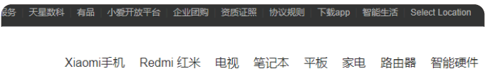

> **快捷键**
>
> 快速生成ul+li的布局：ul>li*3（数字根据自己的需要的li数量修改）

### 定义列表

常用于对名词进行解释和描述，与其他两个列表不同，定义列表的列表项前没有任何项目符号。

#### 基本语法

```html
<dl>
  <dt>名词1</dt>
  <dd>名词1解释1</dd>
  <dd>名词1解释1</dd>
  ...
  <dt>名词2</dt>
  <dd>名词2解释1</dd>
  <dd>名词2解释1</dd>
  ...
</dl>
```

上述语法中，dl标签用于指定定义列表，dt和dd标签并列嵌套于dl标签中。其中，dl标签用于指定名词，dd标签用于对名词进行解释和描述。一个dt标签可对应多个dd标签，即可以对一个名词进行多项解释。

```html
<dl>
  <dt>加油奥利给</dt>
  <dd>是在鼓励自己或者鼓励别人时经常用到的词汇</dd>
  <dd>近现代演变的词汇，目前普遍使用</dd>
  <dd>特别是中少年人群尤其盛行</dd>
</dl>
```

### 表格标签

#### 展示

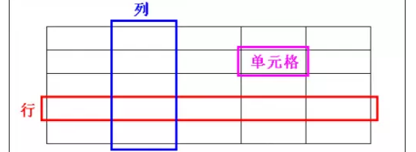

> **表格组成与特点**
>
> 行、列、单元格
>
> 单元格特点：同行等高、同列等宽。

> **表格标签**
>
> 表格：`<table>`
>
> 行：`<tr>`
>
> 单元格(列)：`<td>`

```html
<table>
  <tr>
    <td>尚学堂</td>
    <td>百战程序员</td>
  </tr>
  <tr>
    <td>阿里</td>
    <td>京东</td>
  </tr>
</table>
```

> **快捷键**
>
> 快速生成表格结构：table>tr*2>td{单元格}

#### 属性

1. border：设置表格的边框
2. width：设置表格的宽度
3. height：设置表格的高度

#### 单元格合并

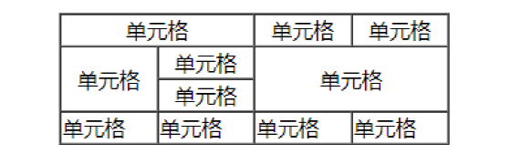

- 水平合并：colspan
- 垂直合并：rowspan

```html
<table border="1" width="500px" height="200px">
  <tr>
    <td colspan="3">单元格1单元格2单元格3</td>
    <td>单元格4</td>
    <td>单元格5</td>
  </tr>
  <tr>
    <td rowspan="2">单元格6-11</td>
    <td>单元格7</td>
    <td rowspan="3">单元格81318</td>
    <td colspan="2" rowspan="2">单元格9101415</td>
  </tr>
  <tr>
    <td>单元格12</td>
  </tr>
  <tr>
    <td>单元格16</td>
    <td>单元格17</td>
    <td>单元格19</td>
    <td>单元格20</td>
  </tr>
</table>
```

### 框架

#### 框架定义

框架网页是由框架集和框架页组成。框架页是存放于框架集中，也就是说，frame这个标签是放置在frameset这个标签里面。

`<frameset> </frameset>`--框架集

`<frame />`--框架页

> 注意：当实现了框架页面时，frameset这一对标签就替代了body标签的功能。

#### frameset属性

##### rows属性

用来将一个网页窗口划分为上中下型：

- rows="180,*"，表示将一个网页窗口分割为上下型，上窗口占据180个像素，其他的部分都给到下窗口。
- rows="180,100,*"，表示将一个网页窗口分割为上中下型，上窗口占据180个像素，中窗口占据100个像素，其他的部分都给到下窗口。
- rows属性只有frameset有这个属性

##### cols属性

用来将一个万叶窗口分割为左中右型：

- cols="100,*"，表示将一个网页窗口分割为左右型，左窗口占据100个像素，其他的部分都给到右窗口。
- rows="180,100,*"，表示将一个网页窗口分割为左中右型，左窗口占据180个像素，中窗口占据100个像素，其他的部分都给到右窗口。
- cols属性只有frameset有这个属性

```html
</head>
<frameset rows="180,*">
    <frame />
    <frameset cols="100,*">
    <frame />
    <frame />
    </frameset>
</frameset>
</html>
```

#### frame属性

- src，小窗口显示网页的地址；
- name，给小窗口取个名字；
- noresize，规定无法调用小窗口的大小，取值noresize
- frameborder，是否显示框架周围的边框线，取值0不显示，1显示

### 表单

表单在 Web 网页中用来给用户填写信息，从而能采用户信息，使网页具有交互的功能。

所有的用户输入内容的地方都用表单来写，如登录注册、搜索框

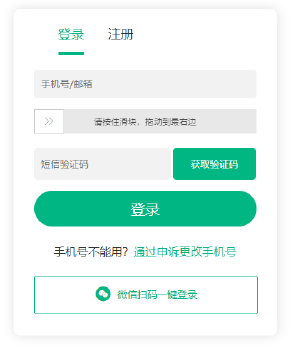

表单是由容器和控件组成的,一个表单一般应该包含用户填写信息的输入框,按钮等，这些输入框,按钮叫做控件,表单就是容器,它能够容纳各种各样的控件

```html
<form action="url" method="get|post" name="myform"></form>
```

> **属性说明**
>
> action服务器地址
>
> name表单名称
>
> **method中Get和Post的区别**
>
> 1. 数据提交方式，get把提交的数据url可以看到，post看不到
> 2. get一般用于提交少量数据，post用来提交大量数据

#### 表单元素

一个完整的表单包含三个基本组成部分：表单标签、表单域、表单按钮

1. 表单标签
2. 表单域
3. 表单按钮

```html
<form>
  <input type="text" />
  <input type="submit" />
</form>
```

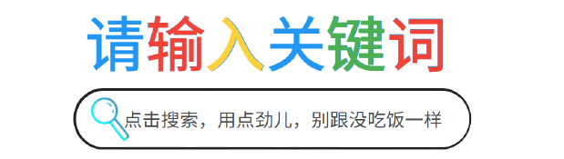

#### 文本框

文本域通过`<input type="text">` 标签来设定，当用户要在表单中键入字母、数字等内容时，就会用到文本域。

```html
<form>
  First name: <input type="text" name="firstname" />
  <br />
  Last name: <input type="text" name="lastname" />
</form>
```


#### 密码框

密码字段通过标签`<input type="password">` 来定义。

```html
<form>Password: <input type="password" name="pwd" /></form>
```


> **温馨提示**
>
> 密码字段字符不会明文显示，而是以星号或圆点替代

#### 提交按钮

当用户单击确认按钮时，表单的内容会被传送到另一个文件。表单的动作属性定义了目的文件的文件名。由动作属性定义的这个文件通常会对接收到的输入数据进行相关的处理

```text
<form name="input" action="url" method="get">
    Username: <input type="text" name="user">
    <input type="submit" value="Submit">
</form>
```


### HTML实体

在HTML 中我们可以用一种特殊的形式的内容，来表示某个符号，这种特殊形式的内容，就是HTML 实体。比如小于号 < 用于定义 HTML 标签的开始。如果我们希望浏览器正确地显示这些字符，我们必须在HTML 源码中插入字符实体。

> 字符实体由三部分组成：一个& 和 一个实体名称（或者一个# 和 一个实体编号），最后加上一
> 个分号; 。

常见字符实体总结：

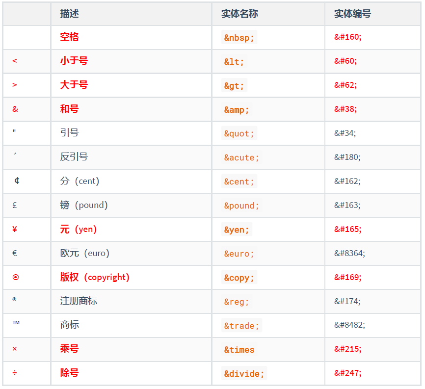

> 完整实体列表，请参考： [HTML Standard] (https://html.spec.whatwg.org/multipage/named-characters.html#named-character-references)

### HTML全局属性

常用的全局属性：

|属性名 |含义 |
|---|---|
|id |给标签指定唯一标识，注意： id 是不能重复的。<br/>作用：可以让label 标签与表单控件相关联；也可以与 CSS 、JavaScript 配合使用。 |
|class |给标签指定类名，随后通过CSS 就可以给标签设置样式。 |
|style |给标签设置CSS 样式。 |
|dir |内容的方向，值: ltr 、rtl |
|title |给标签设置一个文字提示，一般超链接和图片用得比较多。 |
|lang |给标签指定语言，具体规范和可选值请参考【10. HTML 设置语言】。 |

完整的全局属性，请参考：[全局属性 - HTML](https://developer.mozilla.org/zh-CN/docs/Web/HTML/Global_attributes)

## HTML5

### 定义

- HTML5 是新一代的 HTML 标准，2014年10月由万维网联盟（ W3C ）完成标准制定。
- 官网地址：
  - W3C 提供： https://www.w3.org/TR/html/index.html
  - WHATWG 提供： https://whatwg-cn.github.io/html/multipage
- HTML5 在狭义上是指新一代的 HTML 标准，在广义上是指：整个前端。

### 优势

1. 针对JavaScript ，新增了很多可操作的接口。
2. 新增了一些语义化标签、全局属性。
3. 新增了多媒体标签，可以很好的替代flash 。
4. 更加侧重语义化，对于SEO 更友好。
5. 可移植性好，可以大量应用在移动设备上。

### 兼容性

支持： Chrome 、Safari 、Opera 、Firefox 等主流浏览器。

> IE 浏览器必须是9 及以上版本才支持HTML5 ，且IE9 仅支持部分HTML5 新特性。

### 新增标签

#### 布局标签

|标签名 |语义 |单/双标签 |
|---|---|---|
|header |整个页面，或部分区域的头部 |双 |
|footer |整个页面，或部分区域的底部 |双 |
|nav |导航 |双 |
|article |文章、帖子、杂志、新闻、博客、评论等 |双 |
|section |页面中的某段文字，或文章中的某段文字（里面文字通常里面会包含标题）。 |双 |
|aside |侧边栏 |双 |
|main |文档的主要内容 ( WHATWG 没有语义， IE 不支持)，几乎不用。 |双 |
|hgroup |包裹连续的标题，如文章主标题、副标题的组合 （ W3C 将其删除） |双 |

关于article 和section ：

> 1. artical 里面可以有多个section 。
> 2. section 强调的是分段或分块，如果你想将一块内容分成几段的时候，可使用section 元素。
> 3. article 比section 更强调独立性，一块内容如果比较独立、比较完整，应该使用article 元素。

#### 状态标签

##### meter 标签

语义：定义已知范围内的标量测量。也被称为 gauge （尺度），双标签，例如：电量、磁盘用量等。
常用属性如下：

|   |值 |描述 |
|---|---|---|
|high |数值 |规定高值 |
|low |数值 |规定低值 |
|max |数值 |规定最大值 |
|min |数值 |规定最小值 |
|optimum |数值 |规定最优值 |
|value |数值 |规定当前值 |

##### progress 标签

语义：显示某个任务完成的进度的指示器，一般用于表示进度条，双标签，例如：工作完成进度等。

常用属性如下:

|标签名 |值 |描述 |
|---|---|---|
|max |数值 |规定目标值 |
|value |数值 |规定目标值 |

#### 列表标签

|标签名 |语义 |单/双标签 |
|---|---|---|
|datalist |用于搜索框的关键字提示 |双 |
|details |用于展示问题和答案，或对专有名词进行解释 |双 |
|summary |写在 details 的里面，用于指定问题或专有名词 |双 |

```css
<input type="text" list="mydata">
<datalist id="mydata">
<option value="周冬雨">周冬雨</option>
<option value="周杰伦">周杰伦</option>
<option value="温兆伦">温兆伦</option>
<option value="马冬梅">马冬梅</option>
</datalist>
```

```css
<details>
<summary>如何走上人生巅峰？</summary>
<p>一步一步走呗</p>
</details>
```

#### 文本标签

##### 文本注音

|标签名 |语义 |单/双标签 |
|---|---|---|
|ruby |包裹需要注音的文字 |双 |
|rt |写注音，rt标签写在ruby的里面 |双 |

```css
<ruby>
<span>魑魅魍魉</span>
<rt>chī mèi wǎng liǎng </rt>
</ruby>
```

##### 文本标记

|标记名 |语义 |单/双标签 |
|---|---|---|
|mark |标记 |双 |

> 注意： W3C 建议 mark 用于标记搜索结果中的关键字。

### 表单功能

#### 控件新增属性

|属性名 |功能 |
|---|---|
|placeholder |提示文字（注意：不是默认值， value 是默认值），适用于文字输入类的表单控件。 |
|required |表示该输入项必填， 适用于除按钮外其他表单控件。 |
|autofocus |自动获取焦点，适用于所有表单控件。 |
|autocomplete |自动完成，可以设置为on 或off ，适用于文字输入类的表单控件。<br/>注意：密码输入框、多行输入框不可用。 |
|pattern |填写正则表达式，适用于文本输入类表单控件。<br/>注意：多行输入不可用，且空的输入框不会验证，往往与 required 配合。 |

#### input 新增属性

|属性名 |功能 |
|---|---|
|email |邮箱类型的输入框，表单提交时会验证格式，输入为空则不验证格式。 |
|url |url 类型的输入框，表单提交时会验证格式，输入为空则不验证格式。 |
|number |数字类型的输入框，表单提交时会验证格式，输入为空则不验证格式。 |
|search |搜索类型的输入框，表单提交时不会验证格式。 |
|tel |电话类型的输入框，表单提交时不会验证格式，在移动端使用时，会唤起数字键盘。 |
|range |范围选择框，默认值为50 ，表单提交时不会验证格式。 |
|color |颜色选择框，默认值为黑色，表单提交时不会验证格式。 |
|date |日期选择框，默认值为空，表单提交时不会验证格式。 |
|month |月份选择框，默认值为空，表单提交时不会验证格式。 |
|week |周选择框，默认值为空，表单提交时不会验证格式。 |
|time |时间选择框，默认值为空，表单提交时不会验证格式。 |
|datetime-local |日期+时间选择框，默认值为空，表单提交时不会验证格式。 |

#### form 标签新增

|属性名 |功能 |
|---|---|
|novalidate |如果给form 标签设置了该属性，表单提交的时候不再进行验证。 |

### 多媒体标签

#### 视频标签

`<video>` 标签用来定义视频，它是双标签。

|属性 |值 |描述 |
|---|---|---|
|src |URL地址 |视频地址 |
|width |像素值 |设置视频播放器的宽度 |
|height |像素值 |设置视频播放器的高度 |
|controls |- |向用户显示视频控件（比如播放/暂停按钮） |
|muted |- |视频静音 |
|autoplay |auto / metadata / none |视频自动播放 |
|loop |- |循环播放 |
|poster |URL地址 |视频封面 |
|preload |auto / metadata / none |视频预加载，如果使用autoplay ，则忽略该属性。<br/> none : 不预加载视频。<br/> metadata : 仅预先获取视频的元数据（例如长度）。<br/> auto : 可以下载整个视频文件，即使用户不希望使用它。 |

#### 音频标签

`<audio>` 标签用来定义音频，它是双标签。

|属性 |值 |描述 |
|---|---|---|
|src |URL地址 |音频地址 |
|controls |- |向用户显示音频控件（比如播放/暂停按钮） |
|autoplay |- |音频自动播放 |
|muted |- |音频静音 |
|loop |   |循环播放 |
|preload |auto / metadata / none |音频预加载，如果使用autoplay ，则忽略该属性：<br/> none: 不预加载音频。<br/> metadata : 仅预先获取音频的元数据（例如长度）。<br/> auto : 可以下载整个音频文件，即使用户不希望使用它。 |

### 全局属性

|属性名 |功能 |
|---|---|
|contenteditable |表示元素是否可被用户编辑，可选值如下：<br/>true ：可编辑<br/>false ：不可编辑 |
|draggable |表示元素可以被拖动，可选值如下：<br/>true ：可拖动<br/>false ：不可拖动 |
|hidden |隐藏元素 |
|spellcheck |规定是否对元素进行拼写和语法检查，可选值如下：<br/>true ：检查<br/>false ：不检查 |
|contextmenu |规定元素的上下文菜单，在用户鼠标右键点击元素时显示。 |
|data-* |用于存储页面的私有定制数据。 |

### 兼容性处理

- 添加元信息，让浏览器处于最优渲染模式。

```css
<!--设置IE总是使用最新的文档模式进行渲染-->
<meta http-equiv="X-UA-Compatible" content="IE=Edge">
<!--优先使用 webkit ( Chromium ) 内核进行渲染, 针对360等壳浏览器-->
<meta name="renderer" content="webkit">
```

- 使用html5shiv 让低版本浏览器认识H5 的语义化标签。

```css
<!--[if lt ie 9]>
<script src="../sources/js/html5shiv.js"></script>
<![endif]-->
```

- 扩展

> lt 小于
> lte 小于等于
> gt 大于
> gte 大于等于
> ! 逻辑非

- 示例：

```css
<!--[if IE 8]>仅IE8可见<![endif]-->
<!--[if gt IE 8]>仅IE8以上可见<![endif]—>
<!--[if lt IE 8]>仅IE8以下可见<![endif]—>
<!--[if gte IE 8]>IE8及以上可见<![endif]—>
<!--[if lte IE 8]>IE8及以下可见<![endif]—>
<!--[if !IE 8]>非IE8的IE可见<![endif]-->
```

## CSS2

### 基础编程

#### 基本介绍

CSS（Cascading Style Sheets）层叠样式表，又叫级联样式表，简称样式表，CSS文件后缀名为`.css`,CSS用于HTML文档中元素样式的定义。使用css的唯一目的就是让网页具有美观一致的页面。

#### 基本语法

CSS 规则由两个主要的部分构成：选择器，以及一条或多条声明（样式）

```css
选择器 {
  属性1: 属性值1;
  属性2: 属性值2;
  属性3: 属性值3;
}
```

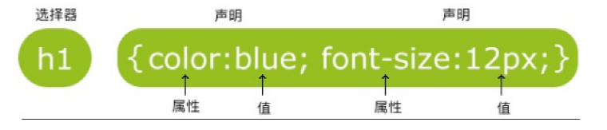

选择器通常是您需要改变样式的 HTML 元素，每条声明由一个属性和一个值组成。

属性（property）是您希望设置的样式属性（style attribute）。每个属性有一个值。属性和值被冒号分开。

```css
<style>
    h1{
        color: blue;
        font-size: 12px;
    }
</style>
```

#### 引入方式

##### 行内式

要使用行内式（内联样式），你需要在相关的标签内使用样式（style）属性。Style 属性可以包含任何 CSS 属性。

> **温馨提示**
>
> 缺乏整体性和规划性，不利于维护，维护成本高。

```html
<p style="background: orange; font-size: 24px;">CSS</p>
<p></p>
```

##### 内嵌式

当单个文档需要特殊的样式时，就应该使用内部样式表。你可以使用 `<style>` 标签在文档头部定义内部样式表。

> **温馨提示**
>
> 单个页面内的CSS代码具有统一性和规划性，便于维护，但是在多个页面之间容易混乱

```html
<head>
  <style>
    h1 {
      background: red;
    }
  </style>
</head>
```

##### 链入式

当样式需要应用于很多页面时，链入式（外部样式表）将是理想的选择。在使用链入式的情况下，你可以通过改变一个文件来改变整个站点的外观。每个页面使用 `<link>` 标签链接到样式表。 `<link>` 标签在（文档的）头部。

```html
<link href="xxx.css" rel="stylesheet" type="text/css" />
```

在上述语句中，<link/>标签需要放在<head>头部标签中，并且需要指定<link/>标签的3个属性：

<ul>
    <li>href,定义所链接外部样式的路径</li>
    <li>type,定义所链接文件的类型，这里需要指定text/css，表示链接的外部文件为css样式表</li>
    <li>ref,定义当前文件与被链接文件之间的关系，在这里需要指定为stylesheet，表示被链接的文件是样式表</li>
</ul>

##### 导入式

导入式与链入式相同，都能够引入外部样式表文件。

```html
<style type="text/css">
  @import url(css文件路径);或@import "css文件路径";
     存放其他css样式
</style>
```

上述语法中，@import语句有两种书写方式，这两种形式均可以导入css样式。此外在<style>标签内还可以存放其他的内嵌式css样式，但@import语句需要位于其他内嵌样式的上方。

```css
<style type="text/css">
	@import url(style03.css);
	p{color:blue;}
</style>
```

虽然导入式和链入式基本功能相同，但是大多数网站都是采用链入式引入外部样式表的。主要原因是导入式和链入式的加载时间和顺序不同。当一个页面被加载时，<link/>标签引用的css样式表将同时被加载，而@import引用的css样式表会等到页面全部下载完后再被加载。因为，导入式的方式会慢一些，客户体验不佳。

#### 样式优先级

优先级规则：行内样式 > 内部样式 = 外部样式

> 1. 内部样式、外部样式，这二者的优先级相同，且：后面的 会覆盖 前面的（简记：“后来
>    者居上”）。
> 2. 同一个样式表中，优先级也和编写顺序有关，且：后面的 会覆盖 前面的（简记：“后来
>    者居上”）。

|分类 |优点 |缺点 |使用频率 |作用范围 |
|---|---|---|---|---|
|行内样式 |优先级最高 |1. 结构与样式未分离<br/>2. 代码结构混乱<br/>3. 样式不能复用 |很低 |当前标签 |
|内部样式 |1. 样式可复用<br/>2. 代码结构清晰 |1. 结构与样式未彻底分离<br/>2. 样式不能多页面复用 |一般 |当前页面 |
|外部样式 |1. 样式可多页面复用<br/>2. 代码结构清晰<br/>3. 可触发浏览器的缓存机制<br/>4. 结构与样式彻底分离 |需要引入才能使用 |最高 |多个页面 |

#### 语法规范

CSS 语法规范由两部分构成：

- 选择器：找到要添加样式的元素。
- 声明块：设置具体的样式（声明块是由一个或多个声明组成的），声明的格式为： 属性名: 属性值;

> 备注1：最后一个声明后的分号理论上能省略，但最好还是写上。
>
> - [ ] 备注2：选择器与声明块之间，属性名与属性值之间，均有一个空格，理论上能省略，但最好还是写上。

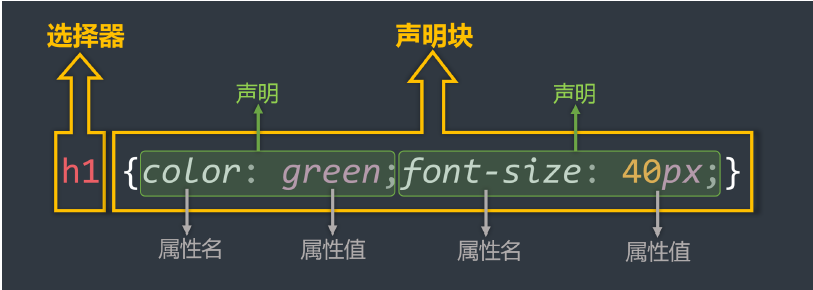

注释的写法：

```css
/* 给h1元素添加样式 */
h1 {
  /* 设置文字颜色为红色 */
  color: red;
  /* 设置文字大小为40px */
  font-size: 40px;
}
```

#### 代码风格

- 展开风格 —— 开发时推荐，便于维护和调试。

```css
h1 {
  color: red;
  font-size: 40px;
}
```

- 紧凑风格 —— 项目上线时推荐，可减小文件体积。

```css
h1 {
  color: red;
  font-size: 40px;
}
```

备注：

> 项目上线时，我们会通过工具将【展开风格】的代码，变成【紧凑风格】，这样可以减小文件体积，节约网络流量，同时也能让用户打开网页时速度更快。

#### 基础选择器

CSS语法 规则由两个主要的部分构成：<strong>选择器</strong>，以及一条或多条声明（样式）。

##### 全局选择器

也叫通配符选择器，可以与任何元素匹配，优先级最低，一般做样式初始化。

```css
* {
  margin: 0;
  padding: 0;
}
```

在实际开发过程中，一般不会使用通配符选择器，因为通配符选择器设置的样式对所有的额HTML标签都生效，不管标签是否需要该样式，这样反而降低了代码的执行速度。

##### 元素选择器

元素选择器，也叫标签选择器，HTML文档中的标签分为`p、b、div、a、img、body`等。

标签选择器，选择的是页面上所有这种类型的标签，所以经常描述“共性”，无法描述某一个元素的“个性”。

```css
p {
  font-size: 14px;
}
```

再比如说，我想让“学完前端，继续学Java”这句话中的“前端”两个变为红色字体，那么我可以用`<span>`标签把“前端”这两个字围起来，然后给`<span>`标签加一个标签选择器。

```html
<p>学完了<span>前端</span>，继续学Java</p>
span{ color: red; }
```

> **温馨提示**
>
> 1. 所有的标签，都可以是选择器。比如ul、li、label、dt、dl、input、div等
> 2. 无论这个标签藏的多深，一定能够被选择上
> 3. 选择的所有，而不是一个

##### 类选择器

规定用圆点 `.` 来定义，针对你想要的所有标签使用

> **优点**
>
> 灵活

```html
<h2 class="oneclass">你好</h2>
/*定义类选择器*/ .oneclass{ width:800px; }
```

> **class属性的特点**
>
> 1. 类选择器可以被多种标签使用
> 2. 类名不能以数字开头
> 3. 同一个标签可以使用多个类选择器。用空格隔开

```html
<h3 class="classone  classtwo">我是一个h3啊</h3>
```

```html
<h3 class="teshu" class="zhongyao">我是一个h3啊</h3>
// 错误
```

##### ID选择器

针对某一个特定的标签来使用，只能使用一次。`css`中的`ID选择器`以 `#` 来定义

```html
<h2 id="mytitle">你好</h2>
#mytitle{ border:3px dashed green; }
```

> **特别强调**
>
> 1. ID是唯一的
> 2. ID不能以数字开头

##### 合并选择器

语法：`选择器1,选择器2,...{ }`

作用：提取共同的样式，减少重复代码

```css
.header,
.footer {
  height: 300px;
}
```

##### 选择器优先级

CSS中,权重用数字衡量

元素选择器的权重为: 1

class选择器的权重为: 10

id选择器的权重为: 100

内联样式的权重为: 1000

优先级从高到低: 行内样式 > ID选择器 > 类选择器 > 元素选择器

##### 选择器总结

|基本选择器 |特点 |用法 |
|---|---|---|
|全局选择器 |选中所有标签，一般用于清除样式 |* {color:red} |
|元素选择器 |选中所有同种标签，但是不能差异化选择 |h1 {color:red} |
|类选择器 |选中所有特定类名（ class 值）的元素 —— 使用频率很高 |.say {color:red} |
|ID选择器 |选中特定id 值的那个元素（唯一的） |#earthy{color:red} |

#### 关系选择器

**关系选择器分类**

1. 交集选择器
2. 并集选择器
3. 后代选择器
4. 子代选择器
5. 相邻兄弟选择器
6. 通用兄弟选择器

##### 交集选择器

- 作用：选中同时符合多个条件的元素。

> 交集有并且的含义（通俗理解：即......又...... 的意思），例如：年轻且长得帅。

- 语法：选择器1选择器2选择器3...选择器n {}
- 举例：

```css
/* 选中：类名为beauty的p元素，为此种写法用的非常多！！！！ */
p.beauty {
  color: blue;
}
/* 选中：类名包含rich和beauty的元素 */
.rich.beauty {
  color: green;
}
```

- 注意：

1. 有标签名，标签名必须写在前面。
2. id 选择器、通配选择器，理论上可以作为交集的条件，但实际应用中几乎不用 —— 因为没有意义。
3. 交集选择器中不可能出现两个元素选择器，因为一个元素，不可能即是p 元素又是span 元素。
4. 用的最多的交集选择器是：元素选择器配合类名选择器，例如： p.beauty 。

##### 并集选择器

作用：选中多个选择器对应的元素，又称：分组选择器。

> 所谓并集就是或者的含义（通俗理解：要么......要么...... 的意思），例如：给我转10万块钱或者我报警。

语法：选择器1, 选择器2, 选择器3, ... 选择器n {}

> 多个选择器通过, 连接，此处, 的含义就是：或。

举例：

```css
/* 选中id为peiqi，或类名为rich，或类名为beauty的元素 */
#peiqi,
.rich,
.beauty {
  font-size: 40px;
  background-color: skyblue;
  width: 200px;
}
```

注意：

1. 并集选择器，我们一般竖着写。
2. 任何形式的选择器，都可以作为并集选择器的一部分 。
3. 并集选择器，通常用于集体声明，可以缩小样式表体积。

##### 元素间关系

分为：①父元素、②子元素、③祖先元素、④后代元素、⑤兄弟元素。

1. 父元素：直接包裹某个元素的元素，就是该元素的父元素。

> 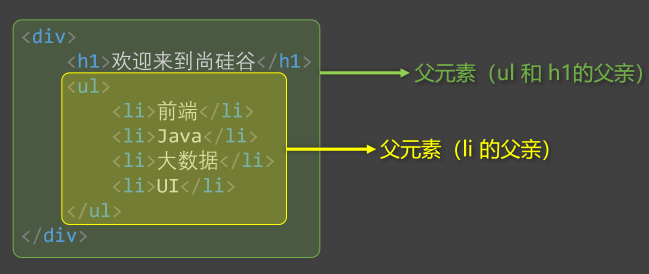

2. 子元素：被父元素直接包含的元素（简记：儿子元素）。

> 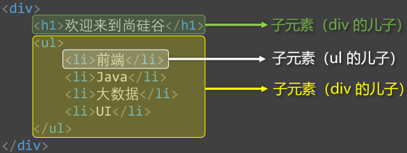

3. 祖先元素：父亲的父亲......，一直往外找，都是祖先。

> 备注：父元素，也算是祖先元素的一种。例如：张三的父亲，也算是张三的祖先，但一般还是称呼：父亲。

> 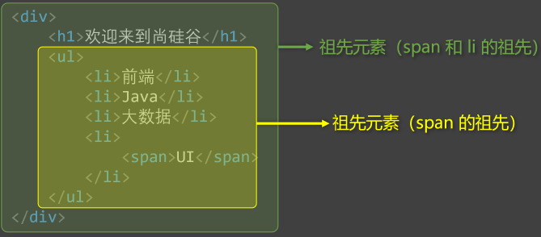

4. 后代元素：儿子的儿子......，一直往里找，都是后代。

> 备注：子元素，也算是后代元素的一种。例如：张三的儿子，也算是张三的后代，但一般还是称呼：儿子。
>
> 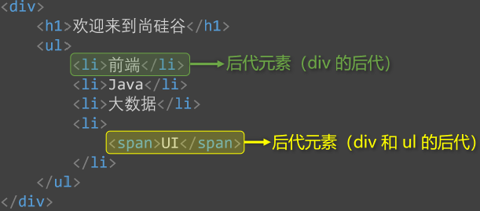

5. 兄弟元素：具有相同父元素的元素，互为兄弟元素。

> 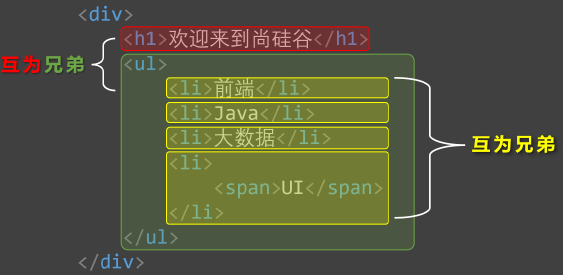

##### 后代选择器

**定义：**选择所有被E元素包含的F元素，中间用空格隔开

**语法**

```css
E F {
}
```

```html
<ul>
  <li>宝马</li>
  <li>奔驰</li>
</ul>
<ol>
  <li>奥迪</li>
</ol>
```

```css
ul li {
  color: green;
}
```

##### 子代选择器

**定义：**选择所有作为E元素的直接子元素F，对更深一层的元素不起作用，用>表示

**语法**

```css
E > F {
}
```

```html
<div>
  <a href="#">子元素1</a>
  <p><a href="#">孙元素</a></p>
  <a href="#">子元素2</a>
</div>
```

```css
div > a {
  color: red;
}
```

##### 相邻兄弟选择器

**定义：**选择紧跟E元素后的F元素，用加号表示，选择相邻的第一个兄弟元素，只能向下选择

**语法**

```css
E + F {
}
```

```html
<h1>h1元素</h1>
<p>第一个元素</p>
<p>第二个元素</p>
```

```css
h1 + p {
  color: red;
}
```

##### 通用兄弟选择器

**定义：**选择E元素之后的所有兄弟元素F，作用于多个元素，用~隔开，只能向下选择

**语法**

```css
E ~ F {
}
```

```html
<h1>h1元素</h1>
<p>第一个元素</p>
<p>第二个元素</p>
```

```css
h1 ~ p {
  color: red;
}
```

#### 属性选择器

- 作用：选中属性值符合一定要求的元素。
- 语法：

1. [属性名] 选中具有某个属性的元素。
2. [属性名="值"] 选中包含某个属性，且属性值等于指定值的元素。
3. [属性名^="值"] 选中包含某个属性，且属性值以指定的值开头的元素。
4. [属性名$="值"] 选中包含某个属性，且属性值以指定的值结尾的元素。
5. [属性名*=“值”] 选择包含某个属性，属性值包含指定值的元素。

- 举例：

```css
/* 选中具有title属性的元素 */
div[title] {
  color: red;
}
/* 选中title属性值为atguigu的元素 */
div[title="atguigu"] {
  color: red;
}
/* 选中title属性值以a开头的元素 */
div[title^="a"] {
  color: red;
}
/* 选中title属性值以u结尾的元素 */
div[title$="u"] {
  color: red;
}
/* 选中title属性值包含g的元素 */
div[title*="g"] {
  color: red;
}
```

#### 特殊选择器

##### 伪类选择器

- 作用：选中特殊状态的元素。

> 如何理解“伪” ? — 虚假的，不是真的。如何理解“伪类”？ — 像类( class )，但不是类，是元素的一种特殊状态。

- 常用的伪类选择器：

###### 动态伪类：

1. :link 超链接未被访问的状态。
2. :visited 超链接访问过的状态。
3. :hover 鼠标悬停在元素上的状态。
4. :active 元素激活的状态。

> 什么是激活？—— 按下鼠标不松开。
> 注意点：遵循LVHA 的顺序，即： link 、visited 、hover 、active 。

5. :focus 获取焦点的元素。

> 表单类元素才能使用:focus 伪类。当用户：点击元素、触摸元素、或通过键盘的 “ tab ” 键等方式，选择元素时，就是获
> 得焦点。

###### 结构伪类：

常用的结构伪类：

1. :first-child 所有兄弟元素中的第一个。
2. :last-child 所有兄弟元素中的最后一个。
3. :nth-child(n) 所有兄弟元素中的第 n 个。
4. :first-of-type 所有同类型兄弟元素中的第一个。
5. :last-of-type 所有同类型兄弟元素中的最后一个。
6. :nth-of-type(n) 所有同类型兄弟元素中的 第n个 。

关于n 的值：

> 1. 0 或不写：什么都选不中 —— 几乎不用。
> 2. n ：选中所有子元素 —— 几乎不用。
> 3. 1~正无穷的整数 ：选中对应序号的子元素。
> 4. 2n 或 even ：选中序号为偶数的子元素。
> 5. 2n+1 或 odd ：选中序号为奇数的子元素。
> 6. -n+3 ：选中的是前3 个。

不常用的结构伪类：

1. :nth-last-child(n) 所有兄弟元素中的倒数第 n 个。
2. :nth-last-of-type(n) 所有同类型兄弟元素中的 倒数第n个 。
3. :only-child 选择没有兄弟的元素（独生子女）。
4. :only-of-type 选择没有同类型兄弟的元素。
5. :root 根元素。
6. :empty 内容为空元素（空格也算内容）。

###### 否定伪类：

:not(选择器) 排除满足括号中条件的元素。

###### UI伪类：

1. :checked 被选中的复选框或单选按钮。
2. :enable 可用的表单元素（没有 disabled 属性）。
3. :disabled 不可用的表单元素（有disabled 属性）。

###### 目标伪类（了解）

:target 选中锚点指向的元素。

###### 语言伪类（了解）

:lang() 根据指定的语言选择元素（本质是看lang 属性的值）。

##### 伪元素选择器

CSS 伪元素是一种特殊的选择器，它可以在不改变 HTML 结构的情况下对页面元素的特定部分进行样式设置。CSS 伪元素是用来添加一些选择器的特殊效果。

常用的 CSS 伪元素有 ::before、::after、::first-line、::first-letter 等。

语法

伪元素的语法：

```css
selector::pseudo-element {
  property: value;
}
```

CSS 类也可以使用伪元素：

```css
selector.class::pseudo-element {
  property: value;
}
```

first-line 伪元素

"first-line" 伪元素用于向文本的首行设置特殊样式。在下面的例子中，浏览器会根据 "first-line" 伪元素中的样式对 p 元素的第一行文本进行格式化：

```css
p:first-line {
  color: #ff0000;
  font-variant: small-caps;
}
```

> **注意：**"first-line" 伪元素只能用于块级元素。

> 下面的属性可应用于 "first-line" 伪元素：
>
> - font properties
> - color properties
> - background properties
> - word-spacing
> - letter-spacing
> - text-decoration
> - vertical-align
> - text-transform
> - line-height
> - clear

first-letter 伪元素

"first-letter" 伪元素用于向文本的首字母设置特殊样式：

```css
p:first-letter {
  color: #ff0000;
  font-size: xx-large;
}
```

> **注意：** "first-letter" 伪元素只能用于块级元素。

> 下面的属性可应用于 "first-letter" 伪元素：
>
> - font properties
> - color properties
> - background properties
> - margin properties
> - padding properties
> - border properties
> - text-decoration
> - vertical-align (only if "float" is "none")
> - text-transform
> - line-height
> - float
> - clear

before 伪元素

":before" 伪元素可以在元素的内容前面插入新内容。下面的例子在每个 <h1>元素前面插入一幅图片：

```css
h1:before {
  content: url(smiley.gif);
}
```

after 伪元素

":after" 伪元素可以在元素的内容之后插入新内容。下面的例子在每个 <h1> 元素后面插入一幅图片：

```css
h1:after {
  content: url(smiley.gif);
}
```

其他伪元素

|选择器 |示例 |示例说明 |
|:---|:---|:---|
|[:link](https://www.runoob.com/cssref/sel-link.html) |a:link |选择所有未访问链接 |
|[:visited](https://www.runoob.com/cssref/sel-visited.html) |a:visited |选择所有访问过的链接 |
|[:active](https://www.runoob.com/cssref/sel-active.html) |a:active |选择正在活动链接 |
|[:hover](https://www.runoob.com/cssref/sel-hover.html) |a:hover |把鼠标放在链接上的状态 |
|[:focus](https://www.runoob.com/cssref/sel-focus.html) |input:focus |选择元素输入后具有焦点 |
|[:first-letter](https://www.runoob.com/cssref/sel-firstletter.html) |p:first-letter |选择每个<p> 元素的第一个字母 |
|[:first-line](https://www.runoob.com/cssref/sel-firstline.html) |p:first-line |选择每个<p> 元素的第一行 |
|[:first-child](https://www.runoob.com/cssref/sel-firstchild.html) |p:first-child |选择器匹配属于任意元素的第一个子元素的 <p> 元素 |
|[:before](https://www.runoob.com/cssref/sel-before.html) |p:before |在每个<p>元素之前插入内容 |
|[:after](https://www.runoob.com/cssref/sel-after.html) |p:after |在每个<p>元素之后插入内容 |
|[:lang(*language*)](https://www.runoob.com/cssref/sel-lang.html) |p:lang(it) |为<p>元素的lang属性选择一个开始值 |

伪元素和CSS类

伪元素可以结合CSS类：

```css
p.article:first-letter {color:#ff0000;}

<p class="article">文章段落</p>
```

上面的例子会使所有 class 为 article 的段落的首字母变为红色。

多个伪元素

可以结合多个伪元素来使用。在下面的例子中，段落的第一个字母将显示为红色，其字体大小为 xx-large。第一行中的其余文本将为蓝色，并以小型大写字母显示。段落中的其余文本将以默认字体大小和颜色来显示：

```css
p:first-letter {
  color: #ff0000;
  font-size: xx-large;
}
p:first-line {
  color: #0000ff;
  font-variant: small-caps;
}
```

#### 选择器优先级

通过不同的选择器，选中相同的元素 ，并且为相同的样式名设置不同的值时，就发生了样式的冲突。到底应用哪个样式，此时就需要看优先级了。

- 简单描述：

> 行内样式 > ID选择器 > 类选择器 > 元素选择器 > 通配选择器。

- 详细描述：

1. 计算方式：每个选择器，都可计算出一组权重，格式为： (a,b,c)

> a : ID 选择器的个数。
> b : 类、伪类、属性 选择器的个数。
> c : 元素、伪元素 选择器的个数。
> 例如：
>
> 选择器 权重
> ul>li (0,0,2)
> div ul>li p a span (0,0,6)
> #atguigu .slogan (1,1,0)
> #atguigu .slogan a (1,1,1)
> #atguigu .slogan a:hover (1,2,1)

2. 比较规则：按照从左到右的顺序，依次比较大小，当前位胜出后，后面的不再对比，例如：

> (1,0,0) > (0,2,2)
> (1,1,0) > (1,0,3)
> (1,1,3) > (1,1,2)

3. 特殊规则：
4. 行内样式权重大于所有选择器。
5. !important 的权重，大于行内样式，大于所有选择器，权重最高！
6. 图示：

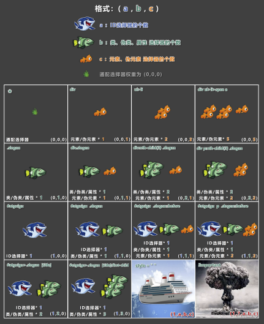

#### CSS三大特性

##### 层叠性

- 概念：如果发生了样式冲突，那就会根据一定的规则（选择器优先级），进行样式的层叠（覆盖）

> 什么是样式冲突？ ——— 元素的同一个样式名，被设置了不同的值，这就是冲突。

##### 继承性

- 概念：元素会自动拥有其父元素、或其祖先元素上所设置的某些样式。
- 规则：优先继承离得近的。
- 常见的可继承属性：

> text-?? ， font-?? ， line-?? 、color ......

- 备注：参照MDN 网站，可查询属性是否可被继承。

##### 优先级

- 简单聊： !important > 行内样式 > ID选择器 > 类选择器 > 元素选择器 > * > 继承的样式。
- 详细聊：需要计算权重。

> 计算权重时需要注意：并集选择器的每一个部分是分开算的！

#### 常规属性

##### 像素的概念

- 概念：我们的电脑屏幕是，是由一个一个“小点”组成的，每个“小点”，就是一个像素（px）。
- 规律：像素点越小，呈现的内容就越清晰、越细腻。

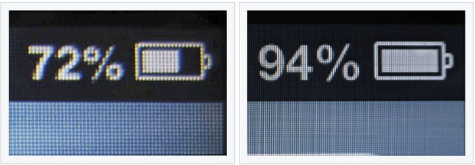

> 注意点：如果电脑设置中开启了缩放，那么就会影响一些工具的测量结果，但这无所谓，因为我们工作中都是参考详细的设计稿，去给元素设置宽高。

##### 颜色的表示

表示方式一：颜色名

- 编写方式：直接使用颜色对应的英文单词，编写比较简单，例如：

1. 红色：red
2. 绿色：green
3. 蓝色：blue
4. 紫色：purple
5. 橙色：orange
6. 灰色：gray
   ......

```css
1. 颜色名这种方式，表达的颜色比较单一，所以用的并不多。
2. 具体颜色名参考MDN 官方文档：https://developer.mozilla.org/en-US/docs/Web/CSS/named-color
```

表示方式二：rgb 或 rgba

- 编写方式：使用 红、黄、蓝 这三种光的三原色进行组合。
  r 表示 红色
  g 表示 绿色
  b 表示 蓝色
  a 表示 透明度
- 举例：

```css
/* 使用 0~255 之间的数字表示一种颜色 */
color: rgb(255, 0, 0);/* 红色 */
color: rgb(0, 255, 0);/* 绿色 */
color: rgb(0, 0, 255);/* 蓝色 */
color: rgb(0, 0, 0);/* 黑色 */
color: rgb(255, 255, 255);/* 白色 */
/* 混合出任意一种颜色 */
color:rgb(138, 43, 226) /* 紫罗兰色 */
color:rgba(255, 0, 0, 0.5);/* 半透明的红色 */
/* 也可以使用百分比表示一种颜色（用的少） */
color: rgb(100%, 0%, 0%);/* 红色 */
color: rgba(100%, 0%, 0%,50%);/* 半透明的红色 */
```

- 小规律：

> 1. 若三种颜色值相同，呈现的是灰色，值越大，灰色越浅。
> 2. rgb(0, 0, 0) 是黑色， rgb(255, 255,255) 是白色。
> 3. 对于rbga 来说，前三位的rgb 形式要保持一致，要么都是0~255 的数字，要么都是百分比。

表示方式三：HEX 或 HEXA

HEX 的原理同与 rgb 一样，依然是通过：红、绿、蓝色 进行组合，只不过要用 6位（分成3组） 来表达，格式为：# rr gg bb

> 每一位数字的取值范围是： 0 ~ f ，即：（ 0, 1, 2, 3, 4, 5, 6, 7, 8, 9, a, b, c,d, e, f ）
> 所以每一种光的最小值是： 00 ，最大值是： ff

```css
color: #ff0000; /* 红色 */
color: #00ff00; /* 绿色 */
color: #0000ff; /* 蓝色 */
color: #000000; /* 黑色 */
color: #ffffff; /* 白色 */
/* 如果每种颜色的两位都是相同的，就可以简写*/
color: #ff9988; /* 可简为：#f98 */
/* 但要注意前三位简写了，那么透明度就也要简写 */
color: #ff998866; /* 可简为：#f986 */
```

> 注意点： IE 浏览器不支持HEXA ，但支持HEX 。

表示方式四：HSL 或 HSLA

- HSL 是通过：色相、饱和度、亮度，来表示一个颜色的，格式为： hsl(色相,饱和度,亮度)。

色相：取值范围是0~360 度，具体度数对应的颜色如下图：

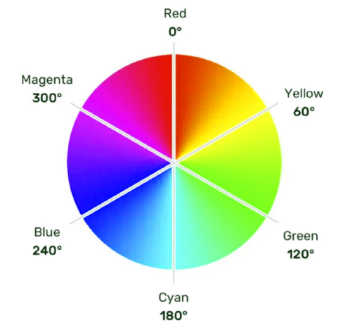

饱和度：取值范围是0%~100% 。（向色相中对应颜色中添加灰色， 0% 全灰， 100% 没有灰）
​ 亮度：取值范围是0%~100% 。（ 0% 亮度没了，所以就是黑色。100% 亮度太强，所以就是白色了）

- HSLA 其实就是在HSL 的基础上，添加了透明度。

##### 字体属性

CSS字体属性定义字体，颜色、大小，加粗，文字样式

###### color

规定文本的颜色

```css
div {
  color: red;
}
div {
  color: #ff0000;
}
div {
  color: rgb(255, 0, 0);
}
div {
  color: rgba(255, 0, 0, 0.5);
}
```

###### font-size

设置文本的大小

能否管理文字的大小，在网页设计中是非常重要的。但是，你不能通过调整字体大小使段落看上去像标题，或者使标题看上去像段落。

```css
h1 {
  font-size: 40px;
}
h2 {
  font-size: 30px;
}
p {
  font-size: 14px;
}
```

> **温馨提示**
>
> chrome浏览器接受最小字体是12px

###### font-weight

设置文本的粗细

|值 |描述 |
|---|---|
|bold |定义粗体字符 |
|bolder |定义更粗的字符 |
|lighter |定义更细的字符 |
|100~900 |定义由细到粗 400等同默认，而700等同于bold |

```css
H1 {
  font-weight: normal;
}
div {
  font-weight: bold;
}
p {
  font-weight: 900;
}
```

###### font-style

指定文本的字体样式

|值 |描述 |
|---|---|
|normal |默认值 |
|italic |定义斜体字 |

###### font-family

font-family属性指定一个元素的字体

> **温馨提示**
>
> 每个值用逗号分开
>
> 如果字体名称包含空格，它必须加上引号

```css
font-family: "Microsoft YaHei", "Simsun", "SimHei";
```

###### font-variant

该属性用于设置英文字符的变体，用于定义小型大写字体，该属性仅对英文字符有效。常用属性值如下：

|属性值 |描述 |
|---|---|
|normal |系统显示默认值 |
|small-caps |浏览器会显示小型大写的字体，即所有的小写字母均被转换为大写，但是高度都会变小。 |

##### 背景属性

CSS背景属性主要有以下几个

|属性 |描述 |
|---|---|
|background-color |设置背景颜色 |
|background-image |设置背景图片 |
|background-position |设置背景图片显示位置 |
|background-repeat |设置背景图片如何填充 |
|background-size |设置背景图片大小属性 |

###### background-color

该属性设置背景颜色

```css
<div class="box" > </div > .box {
  width: 300px;
  height: 300px;
  background-color: palevioletred;
}
```

###### background-image

设置元素的背景图像

元素的背景是元素的总大小，包括填充和边界（不包括外边距）。默认情况下background-image属性放置在元素的左上角，如果图像不够大的话会在垂直和水平方向平铺图像，如果图像大小超过元素大小从图像的左上角显示元素大小的那部分

```css
<div class="box" > </div > .box {
  width: 600px;
  height: 600px;
  background-image: url("images/img1.jpg");
}
```

###### background-repeat

该属性设置如何平铺背景图像

|值 |说明 |
|---|---|
|repeat |默认值 |
|repeat-x |只向水平方向平铺 |
|repeat-y |只向垂直方向平铺 |
|no-repeat |不平铺 |

```css
.box {
  width: 600px;
  height: 600px;
  background-color: #fcc;
  background-image: url("images/img1.jpg");
  background-repeat: no-repeat;
}
```

###### background-size

该属性设置背景图像的大小

|值 |说明 |
|---|---|
|length |设置背景图片的宽度和高度，第一个值宽度，第二个值高度，如果只是设置一个，第二个值auto |
|percentage |计算相对位置区域的百分比，第一个值宽度，第二个值高度，如果只是设置一个，第二个值auto |
|cover |保持图片纵横比并将图片缩放成完全覆盖背景区域的最小大小 |
|contain |保持图片纵横比并将图像缩放成适合背景定位区域的最大大小 |

```css
.box {
  width: 600px;
  height: 600px;
  background-image: url("images/img1.jpg");
  background-repeat: no-repeat;
  background-size: 100% 100%;
}
```

###### background-position

该属性设置背景图像的起始位置，其默认值是：0% 0%

|值 |说明 |
|---|---|
|left top |左上角 |
|left center |左 中 |
|left bottom |左 下 |
|right top |右上角 |
|right center |右 中 |
|right bottom |右 下 |
|center top |中 上 |
|center center |中 中 |
|center bottom |中 下 |
|x% y% |第一个值是水平位置，第二个值是垂直位置，左上角是0% 0%，右下角是100% 100% 。如果只指定了一个值，其他值默认是50%。默认是0% 0% |
|xpos ypos |单位是像素 |

```css
.box {
  width: 600px;
  height: 600px;
  background-color: #fcc;
  background-image: url("images/img1.jpg");
  background-repeat: no-repeat;
  background-position: center;
}
```

##### 文本属性

###### text-align

指定元素文本的水平对齐方式

|值 |描述 |
|---|---|
|left |文本居左排列，默认值 |
|right |把文本排列到右边 |
|center |把文本排列到中间 |

```css
h1 {
  text-align: center;
}
h2 {
  text-align: left;
}
h3 {
  text-align: right;
}
```

###### text-decoration

text-decoration 属性规定添加到文本的修饰，下划线、上划线、删除线等

|值 |描述 |
|---|---|
|underline |定义下划线 |
|overline |定义上划线 |
|line-through |定义删除线 |

```css
h1 {
  text-decoration: overline;
}
h2 {
  text-decoration: line-through;
}
h3 {
  text-decoration: underline;
}
```

###### text-transform

text-transform 属性控制文本的大小写

|值 |描述 |
|---|---|
|captialize |定义每个单词开头大写 |
|uppercase |定义全部大写字母 |
|lowercase |定义全部小写字母 |

```css
h1 {
  text-transform: uppercase;
}
h2 {
  text-transform: capitalize;
}
p {
  text-transform: lowercase;
}
```

###### text-indent

text-indent 属性规定文本块中首行文本的缩进

```css
p {
  text-indent: 50px;
}
```

> **温馨提示**
>
> 负值是允许的。如果值是负数，将第一行左缩进

##### 列表属性

列表相关的属性，可以作用在 ul 、ol 、li 元素上。

|属性名 |功能 |属性值 |
|---|---|---|
|list-style-type |设置列表符号 |常用值如下：<br/>none ：不显示前面的标识（很常用！）<br/>square ：实心方块<br/>disc ：圆形<br/>decimal ：数字<br/>lower-roman ：小写罗马字<br/>upper-roman ：大写罗马字<br/>lower-alpha ：小写字母<br/>upper-alpha ：大写字母 |
|list-style-position |设置列表符号的位置 |inside ：在 li 的里面<br/>outside ：在 li 的外边 |
|list-style-image |自定义列表符号 |url(图片地址) |
|list-style |复合属性 |没有数量、顺序的要求 |

##### 表格属性

使用 CSS 可以使 HTML 表格更美观

###### 表格边框

指定CSS表格边框，使用border属性

```css
table,
td {
  border: 1px solid black;
}
```

###### 折叠边框

border-collapse 属性设置表格的边框是否被折叠成一个单一的边框或隔开

```css
table {
  border-collapse: collapse;
}
table,
td {
  border: 1px solid black;
}
```

###### 表格宽度和高度

width和height属性定义表格的宽度和高度

```css
table {
  width: 100%;
}
td {
  height: 50px;
}
```

###### 表格文字对齐

表格中的文本对齐和垂直对齐属性

text-align属性设置水平对齐方式，向左，右，或中心

```css
td {
  text-align: right;
}
```

垂直对齐属性设置垂直对齐

```css
td {
  height: 50px;
  vertical-align: bottom;
}
```

###### 表格填充

如果在表的内容中控制空格之间的边框，应使用td和th元素的填充属性

```css
td {
  padding: 15px;
}
```

###### 表格颜色

下面的例子指定边框的颜色，和th元素的文本和背景颜色

```css
table,
td,
th {
  border: 1px solid green;
}
td {
  background-color: green;
  color: white;
}
```

#### 盒子模型

##### 常规模型

所有HTML元素可以看作盒子，在CSS中，"box model"这一术语是用来设计和布局时使用

CSS盒模型本质上是一个盒子，封装周围的HTML元素，它包括：

外边距（margin），边框（border），内边距（padding），和实际内容（content）

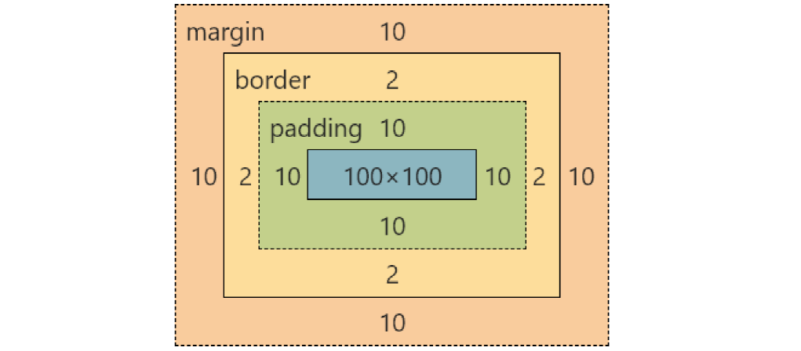

1. Margin(外边距) - 清除边框外的区域，外边距是透明的（两个值：第一个值上下，第二个值左右）
2. Border(边框) - 围绕在内边距和内容外的边框
3. Padding(内边距) - 清除内容周围的区域（两个值：第一个值上下，第二个值左右）
4. Content(内容) - 盒子的内容，显示文本和图像

如果把盒子模型看作是一个生活中的快递，那么内容部分等同于你买的实物，内边距等同于快递盒子中的泡沫，边框等同于快递盒子，外边距等同于两个快递盒子之间的距离。

```html
<div></div>
```

```css
div {
  width: 100px;
  height: 100px;
  padding: 10px;
  border: 2px solid red;
  margin: 10px;
  background: green;
}
```

##### 弹性模型

###### **定义**

弹性盒子是 CSS3 的一种新的布局模式

CSS3 弹性盒是一种当页面需要适应不同的屏幕大小以及设备类型时确保元素拥有恰当的行为的布局方式

引入弹性盒布局模型的目的是提供一种更加有效的方式来对一个容器中的子元素进行排列、对齐和分配空白空间

###### 内容

弹性盒子由弹性容器(Flex container)和弹性子元素(Flex item)组成

弹性容器通过设置 `display `属性的值为 `flex `将其定义为弹性容器

弹性容器内包含了一个或多个弹性子元素

> **温馨提示**
>
> 弹性容器外及弹性子元素内是正常渲染的。弹性盒子只定义了弹性子元素如何在弹性容器内布局

```html
<div class="flex-container">
  <div class="flex-item">flex item 1</div>
  <div class="flex-item">flex item 2</div>
  <div class="flex-item">flex item 3</div>
</div>
<style>
  .flex-container {
    display: flex;
    width: 400px;
    height: 250px;
    background-color: lightgrey;
  }
  .flex-item {
    background-color: cornflowerblue;
    width: 100px;
    height: 100px;
    margin: 10px;
  }
</style>
```

> **温馨提示**
>
> 默认弹性盒里内容横向摆放

###### 父元素属性

- **display 属性**

`display:flex;`开启弹性盒

`display:flex;`属性设置后子元素默认水平排列

- **flex-direction属性**

**定义**

flex-direction 属性指定了弹性子元素在父容器中的位置

**语法**

```css
flex-direction: row | row-reverse | column | column-reverse;
```

1. row：横向从左到右排列（左对齐），默认的排列方式
2. row-reverse：反转横向排列（右对齐，从后往前排，最后一项排在最前面
3. column：纵向排列
4. column-reverse：反转纵向排列，从后往前排，最后一项排在最上面

```css
.flex-container {
  display: flex;
  flex-direction: column;
  width: 400px;
  height: 250px;
  background-color: lightgrey;
}
```

- justify-content 属性

**定义：**内容对齐（justify-content）属性应用在弹性容器上，把弹性项沿着弹性容器的主轴线（main axis）对齐

**语法**

```css
justify-content: flex-start | flex-end | center;
```

1. `flex-start` 弹性项目向行头紧挨着填充。这个是默认值。第一个弹性项的main-start外边距边线被放置在该行的main-start边线，而后续弹性项依次平齐摆放
2. `flex-end` 弹性项目向行尾紧挨着填充。第一个弹性项的main-end外边距边线被放置在该行的main-end边线，而后续弹性项依次平齐摆放
3. `center` 弹性项目居中紧挨着填充。（如果剩余的自由空间是负的，则弹性项目将在两个方向上同时溢出）

```css
.flex-container {
  display: flex;
  justify-content: center;
  width: 400px;
  height: 250px;
  background-color: lightgrey;
}
```

- **align-items 属性**

**定义:**`align-items` 设置或检索弹性盒子元素在侧轴（纵轴）方向上的对齐方式

**语法**

```css
align-items: flex-start | flex-end | center;
```

1. `flex-start` 弹性盒子元素的侧轴（纵轴）起始位置的边界紧靠住该行的侧轴起始边界
2. `flex-end` 弹性盒子元素的侧轴（纵轴）起始位置的边界紧靠住该行的侧轴结束边界
3. `center` 弹性盒子元素在该行的侧轴（纵轴）上居中放置。（如果该行的尺寸小于弹性盒子元素的尺寸，则会向两个方向溢出相同的长度）

###### **子元素属性**

- flex

`flex` 根据弹性盒子元素所设置的扩展因子作为比率来分配剩余空间

默认为0，即如果存在剩余空间，也不放大

如果只有一个子元素设置，那么按扩展因子转化的百分比对其分配剩余空间。0.1即10%，1即100%，超出按100%

```css
<div class="flex-container">
    <div class="flex-item1">flex item 1</div>
    <div class="flex-item2">flex item 2</div>
    <div class="flex-item3">flex item 3</div>
</div>
<style>
	.flex-container {
        display: flex;
        width: 400px;
        height: 250px;
        background-color: gold;
    }
    .flex-item1 {
        height: 150px;
        background-color: red;
        flex: 1;
    }
    .flex-item2 {
        height: 150px;
        background-color: green;
        flex: 2;
    }
    .flex-item3 {
        height: 150px;
        background-color: blue;
        flex: 1;
    }
</style>
```

### 中级教程

#### 浮动

##### 浮动简介

在最初，浮动是用来实现文字环绕图片效果的，现在浮动是主流的页面布局方式之一。

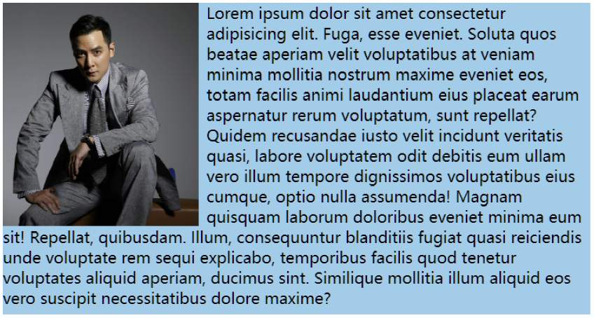

##### 浮动特点

1. 🤢脱离文档流。
2. 😊不管浮动前是什么元素，浮动后：默认宽与高都是被内容撑开（尽可能小），而且可以设置宽
   高。
3. 😊不会独占一行，可以与其他元素共用一行。
4. 😊不会margin 合并，也不会margin 塌陷，能够完美的设置四个方向的margin 和padding 。
5. 😊不会像行内块一样被当做文本处理（没有行内块的空白问题）。

##### 解决影响

###### 影响

对兄弟元素的影响： 后面的兄弟元素，会占据浮动元素之前的位置，在浮动元素的下面；对前面的兄弟无影响。
对父元素的影响： 不能撑起父元素的高度，导致父元素高度塌陷；但父元素的宽度依然束缚浮动的元素。

###### 解决

1. 方案一： 给父元素指定高度。
2. 方案二： 给父元素也设置浮动，带来其他影响。
3. 方案三： 给父元素设置 overflow:hidden 。
4. 方案四： 在所有浮动元素的最后面，添加一个块级元素，并给该块级元素设置 clear:both 。
5. 方案五： 给浮动元素的父元素，设置伪元素，通过伪元素清除浮动，原理与方案四相同。===> 推荐使用。

```css
.parent::after {
  content: "";
  display: block;
  clear: both;
}
```

> 布局中的一个原则：设置浮动的时候，兄弟元素要么全都浮动，要么全都不浮动。

##### 浮动练习

整体效果如下：

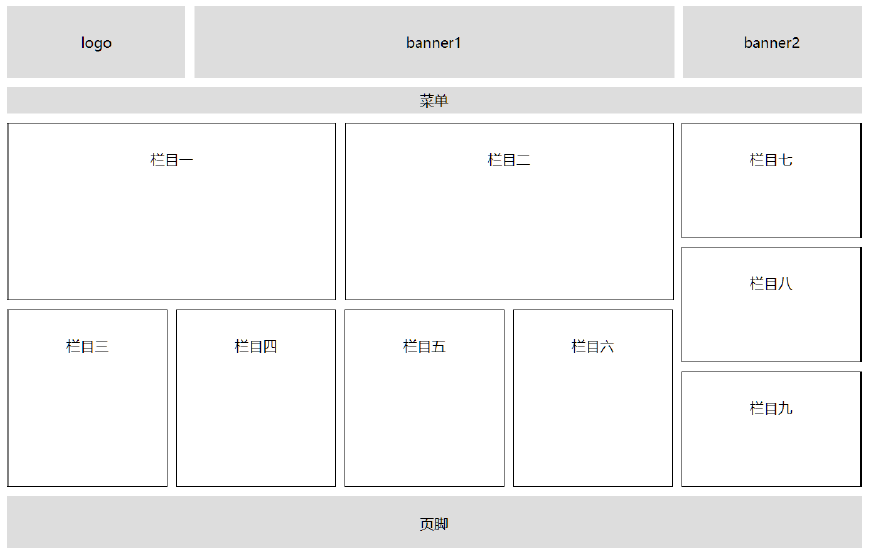

具体标注如下：

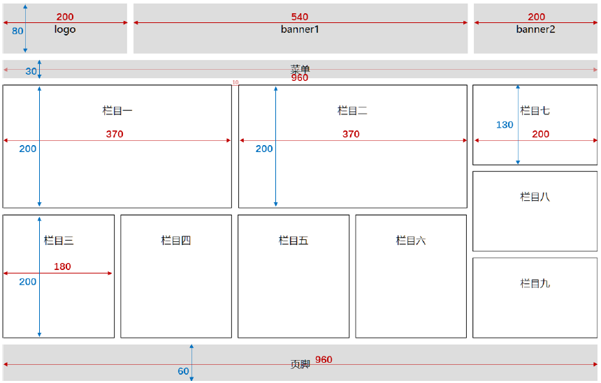

##### 浮动属性

|CSS 属性 |功能 |属性值 |
|---|---|---|
|float |设置浮动 |left : 设置左浮动<br/>right : 设置右浮动<br/>none ：不浮动，默认值 |
|clear |清除浮动<br/>清除前面兄弟元素浮动元素的响应 |left ：清除前面左浮动的影响<br/>right ：清除前面右浮动的影响<br/>both ：清除前面左右浮动的影响 |

#### 定位

position 属性指定了元素的定位类型。position 属性的五个值：

- static
- relative
- fixed
- absolute
- sticky

元素可以使用的顶部，底部，左侧和右侧属性定位。然而，这些属性无法工作，除非事先设定position属性。他们也有不同的工作方式，这取决于定位方法。

##### 默认定位

HTML 元素的默认值static ，即没有定位，遵循正常的文档流对象。静态定位的元素不会受到 top, bottom, left, right影响。

```css
div.static {
  position: static;
  border: 3px solid #73ad21;
}
```

##### 固定定位

**如何设置为固定定位？**

- 给元素设置 position: fixed 即可实现固定定位。
- 可以使用 left 、right 、top 、bottom 四个属性调整位置。

**固定定位的参考点在哪里？**

- 参考它的视口

> 什么是视口？—— 对于PC 浏览器来说，视口就是我们看网页的那扇“窗户”。

**固定定位元素的特点:**

1. 脱离文档流，会对后面的兄弟元素、父元素有影响。
2. left 不能和right 一起设置， top 和bottom 不能一起设置。
3. 固定定位和浮动不能同时设置，如果同时设置，浮动失效，以固定定位为主。
4. 固定定位的元素，也能通过margin 调整位置，但不推荐这样做。
5. 无论是什么元素（行内、行内块、块级）设置为固定定位之后，都变成了定位元素。

##### 相对定位

**如何设置相对定位**？

- 给元素设置 position:relative 即可实现相对定位。
- 可以使用 left 、right 、top 、bottom 四个属性调整位置。

**相对定位的参考点在哪里**？

相对定位元素的定位是相对其正常位置。

**相对定位的特点：**

1. 不会脱离文档流，元素位置的变化，只是视觉效果上的变化，不会对其他元素产生任何影响。
2. 定位元素的显示层级比普通元素高，无论什么定位，显示层级都是一样的。
   默认规则是：

- 定位的元素会盖在普通元素之上。
- 都发生定位的两个元素，后写的元素会盖在先写的元素之上。

3. left 不能和right 一起设置， top 和bottom 不能一起设置。
4. 相对定位的元素，也能继续浮动，但不推荐这样做。
5. 相对行为的元素，也能通过margin 调整位置，但不推荐这样做。

```css
h2.pos_left {
  position: relative;
  left: -20px;
}
h2.pos_right {
  position: relative;
  left: 20px;
}
```

移动相对定位元素，但它原本所占的空间不会改变。

```css
h2.pos_top {
  position: relative;
  top: -50px;
}
```

相对定位元素经常被用来作为绝对定位元素的容器块。

> 注意：绝大多数情况下，相对定位，会与绝对定位配合使用。

##### 绝对定位

**如何设置绝对定位？**

- 给元素设置 position: absolute 即可实现绝对定位。
- 可以使用 left 、right 、top 、bottom 四个属性调整位置。

**绝对定位的参考点在哪里？**

参考它的包含块。

> 什么是包含块？
>
> 1. 对于没有脱离文档流的元素：包含块就是父元素；
> 2. 对于脱离文档流的元素：包含块是第一个拥有定位属性的祖先元素（如果所有祖先都
>    没定位，那包含块就是整个页面）。

**绝对定位元素的特点：**

1. 脱离文档流，会对后面的兄弟元素、父元素有影响。
2. left 不能和right 一起设置， top 和bottom 不能一起设置。
3. 绝对定位、浮动不能同时设置，如果同时设置，浮动失效，以定位为主。
4. 绝对定位的元素，也能通过margin 调整位置，但不推荐这样做。
5. 无论是什么元素（行内、行内块、块级）设置为绝对定位之后，都变成了定位元素。

> 何为定位元素？ —— 默认宽、高都被内容所撑开，且能自由设置宽高。

##### 粘性定位

**如何设置为粘性定位**？

- 给元素设置 position:sticky 即可实现粘性定位。
- 可以使用 left 、right 、top 、bottom 四个属性调整位置，不过最常用的是top 值。

**粘性定位的参考点在哪里**？

- 离它最近的一个拥有“滚动机制”的祖先元素，即便这个祖先不是最近的真实可滚动祖先。

**粘性定位元素的特点**

- 不会脱离文档流，它是一种专门用于窗口滚动时的新的定位方式。
- 最常用的值是top 值。
- 粘性定位和浮动可以同时设置，但不推荐这样做。
- 粘性定位的元素，也能通过margin 调整位置，但不推荐这样做。

> 粘性定位和相对定位的特点基本一致，不同的是：粘性定位可以在元素到达某个位置时将其固定。

##### 重叠元素

元素的定位与文档流无关，所以它们可以覆盖页面上的其它元素，z-index属性指定了一个元素的堆叠顺序（哪个元素应该放在前面，或后面），一个元素可以有正数或负数的堆叠顺序：

```css
img {
  position: absolute;
  left: 0px;
  top: 0px;
  z-index: -1;
}
```

具有更高堆叠顺序的元素总是在较低的堆叠顺序元素的前面。

**注意：** 如果两个定位元素重叠，没有指定z - index，最后定位在HTML代码中的元素将被显示在最前面。

##### 定位层级

1. 定位元素的显示层级比普通元素高，无论什么定位，显示层级都是一样的。
2. 如果位置发生重叠，默认情况是：后面的元素，会显示在前面元素之上。
3. 可以通过 css 属性 z-index 调整元素的显示层级。
4. z-index 的属性值是数字，没有单位，值越大显示层级越高。
5. 只有定位的元素设置 z-index 才有效。
6. 如果z-index 值大的元素，依然没有覆盖掉z-index 值小的元素，那么请检查其包含块的层级。

##### 特殊应用

> 注意：
>
> 1. 发生固定定位、绝对定位后，元素都变成了定位元素，默认宽高被内容撑开，且依然可以设置宽高。
> 2. 发生相对定位后，元素依然是之前的显示模式。
> 3. 以下所说的特殊应用，只针对 绝对定位 和 固定定位 的元素，不包括相对定位的元素。

- 让定位元素的宽充满包含块
  1. 块宽想与包含块一致，可以给定位元素同时设置 left 和 right 为0 。
  2. 高度想与包含块一致， top 和 bottom 设置为 0 。
- 让定位元素在包含块中居中

方案一：

```css
left: 0;
right: 0;
top: 0;
bottom: 0;
margin: auto;
```

方案二：

```css
left: 50%;
top: 50%;
margin-left: 负的宽度一半;
margin-top: 负的高度一半;
```

> 注意：该定位的元素必须设置宽高！！！

#### 版心

在PC 端网页中，一般都会有一个固定宽度且水平居中的盒子，来显示网页的主要内容，这是网页的版心。
版心的宽度一般是960 ~ 1200 像素之间。版心可以是一个，也可以是多个。


#### 常用布局名词

|位置 |描述 |
|---|---|
|顶部导航条 |topbar |
|页头 |header 、page-header |
|导航 |nav 、 navigator 、navbar |
|搜索框 |search 、search-box |
|横幅、广告、宣传图 |banner |
|主要内容 |content 、main |
|侧边栏 |aside 、 sidebar |
|页脚 |footer 、page-footer |

#### 重置默认样式

很多元素都有默认样式，比如：

1. p 元素有默认的上下margin 。
2. h1~h6 标题也有上下margin ，且字体加粗。
3. body 元素有默认的8px 外边距。
4. 超链接有默认的文字颜色和下划线。
5. ul 元素有默认的左pading 。
6. .......

> 在早期，元素默认样式，能够让我们快速的绘制网页，但如今网页的设计越来越复杂，内容越来越多，而且很精细，这些默认样式会给我们绘制页面带来麻烦；而且这些默认样式，在不同的浏览器上呈现出来的效果也不一样，所以我们需要重置这些默认样式。

方案一：使用全局选择器

```css
* {
margin: 0;
padding: 0;
......
}
```

> 此种方法，在简单案例中可以用一下，但实际开发中不会使用，因为 * 选择的是所有元素，而并不是所有的元素都有默认样式；而且我们重置时，有时候是需要做特定处理的，比如：想让a 元素的文字是灰色，其他元素文字是蓝色。

方案二：reset.css

选择到具有默认样式的元素，清空其默认的样式。

> 经过reset 后的网页，好似“一张白纸”，开发人员可根据设计稿，精细的去添加具体的样式。

方案三：Normalize.css

Normalize.css 是一种最新方案，它在清除默认样式的基础上，保留了一些有价值的默认样式。

- 官网地址： http://necolas.github.io/normalize.css/

相对于 reset.css ， Normalize.css 有如下优点：

1. 保护了有价值的默认样式，而不是完全去掉它们。
2. 为大部分HTML元素提供一般化的样式。
3. 新增对 HTML5 元素的设置。
4. 对并集选择器的使用比较谨慎，有效避免调试工具杂乱。

> 备注： Normalize.css 的重置，和reset.css 相比，更加的温和，开发时可根据实际情况进行选择。

#### Sprite图

CSS Sprite也叫CSS精灵图、CSS雪碧图，是一种网页图片应用处理方式。它允许你将一个页面涉及到的所有零星图片都包含到一张大图中去

##### 优点

1. 减少图片的字节
2. 减少网页的http请求，从而大大的提高页面的性能

##### 原理

1. 通过background-image引入背景图片
2. 通过background-position把背景图片移动到自己需要的位置

```html
<i class="icon1"></i> <i class="icon2"></i>
```

```css
.icon1 {
  display: block;
  background-image: url(1.png);
  background-position: -20px 0;
  width: 45px;
  height: 70px;
}
.icon2 {
  display: block;
  background-image: url(1.png);
  background-position: -93px -84px;
  width: 45px;
  height: 70px;
}
```

## CSS3

### CSS3 简介

#### CSS3 概述

- CSS3 是CSS2 的升级版本，它在CSS2 的基础上，新增了很多强大的新功能，从而解决一些实际面临的问题。
- CSS3 在未来会按照模块化的方式去发展： https://www.w3.org/Style/CSS/current-work.html
- CSS3 的新特性如下：
  - 新增了更加实用的选择器，例如：动态伪类选择器、目标伪类选择器、伪元素选择器等等。
  - 新增了更好的视觉效果，例如：圆角、阴影、渐变等。
  - 新增了丰富的背景效果，例如：支持多个背景图片，同时新增了若干个背景相关的属性。
  - 新增了全新的布局方案 —— 弹性盒子。
  - 新增了Web 字体，可以显示用户电脑上没有安装的字体。
  - 增强了颜色，例如： HSL 、HSLA 、RGBA 几种新的颜色模式，新增 opacity 属性来控制透明度。
  - 增加了2D 和3D 变换，例如：旋转、扭曲、缩放、位移等。
  - 增加动画与过渡效果，让效果的变换更具流线性、平滑性。
    ……

#### 私有前缀

##### 什么是私有前缀

如下代码中的-webkit- 就是私有前缀:

```css
div {
  width: 400px;
  height: 400px;
  -webkit-border-radius: 20px;
}
```

##### 为什么要有私有前缀

- W3C 标准所提出的某个CSS 特性，在被浏览器正式支持之前，浏览器厂商会根据浏览器的内核，使用私有前缀来测试该CSS 特性，在浏览器正式支持该CSS 特性后，就不需要私有前缀了。
- 举个例子：

```css
-webkit-border-radius: 20px;
-moz-border-radius: 20px;
-ms-border-radius: 20px;
-o-border-radius: 20px;
border-radius: 20px;
```

- 查询CSS3 兼容性的网站： https://caniuse.com/

##### 常见浏览器私有前缀

- Chrome 浏览器： -webkit-
- Safari 浏览器： -webkit-
- Firefox 浏览器： -moz-
- Edge 浏览器： -webkit-
- 旧 Opera 浏览器： -o-
- 旧 IE 浏览器： -ms-

> 我们在编码时，不用过于关注浏览器私有前缀，不用绞尽脑汁的去记忆，也不用每个都去查询，因
> 为常用的CSS3 新特性，主流浏览器都是支持的，即便是为了老浏览器而加前缀，我们也可以借助
> 现代的构建工具，去帮我们添加私有前缀。

### CSS3 基本语法

#### 长度单位

1. rem 根元素字体大小的倍数，只与根元素字体大小有关。
2. vw 视口宽度的百分之多少 10vw 就是视口宽度的10% 。
3. vh 视口高度的百分之多少 10vh 就是视口高度的10% 。
4. vmax 视口宽高中大的那个的百分之多少。（了解即可）
5. vmin 视口宽高中小的那个的百分之多少。（了解即可）

#### 颜色设置

CSS3 新增了三种颜色设置方式，分别是： rgba 、hsl 、hsla ，由于之前已经详细讲解，此处略过。

#### 新增选择器

CSS3 新增的选择器有：动态伪类、目标伪类、语言伪类、UI 伪类、结构伪类、否定伪类、伪元素；这些在CSS2 中已经详细讲解，此处略过。

#### 盒模型属性

##### 怪异盒模型

使用box-sizing 属性可以设置盒模型的两种类型:

|可选值 |含义 |
|---|---|
|content-box |width 和 height 设置的是盒子内容区的大小。（默认值） |
|border-box |width 和 height 设置的是盒子总大小。（怪异盒模型） |

##### 调整盒子大小

使用resize 属性可以控制是否允许用户调节元素尺寸。

|   |   |
|---|---|
|none |不允许用户调整元素大小。 (默认) |
|both |用户可以调节元素的宽度和高度。 |
|horizontal |用户可以调节元素的宽度 。 |
|vertical |用户可以调节元素的高度。 |

##### 盒子阴影

使用 box-shadow 属性为盒子添加阴影。

- 语法：

```css
box-shadow: h-shadow v-shadow blur spread color inset;
```

- 各个值的含义：

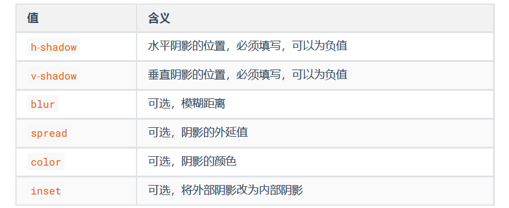

- 默认值： box-shadow:none 表示没有阴影
- 示例：

```css
/* 写两个值，含义：水平位置、垂直位置 */
box-shadow: 10px 10px;
/* 写三个值，含义：水平位置、垂直位置、颜色 */
box-shadow: 10px 10px red;
/* 写三个值，含义：水平位置、垂直位置、模糊值 */
box-shadow: 10px 10px 10px;
/* 写四个值，含义：水平位置、垂直位置、模糊值、颜色 */
box-shadow: 10px 10px 10px red;
/* 写五个值，含义：水平位置、垂直位置、模糊值、外延值、颜色 */
box-shadow: 10px 10px 10px 10px blue;
/* 写六个值，含义：水平位置、垂直位置、模糊值、外延值、颜色、内阴影 */
box-shadow: 10px 10px 20px 3px blue inset;
```

##### 不透明度

- opacity 属性能为整个元素添加透明效果， 值是 0 到 1 之间的小数， 0 是完全透明， 1 表示完全不透明。

> opacity 与 rgba 的区别？
> opacity 是一个属性，设置的是整个元素（包括元素里的内容）的不透明度。
> rgba 是颜色的设置方式，用于设置颜色，它的透明度，仅仅是调整颜色的透明度。

#### 背景属性

##### background-origin

作用：设置背景图的原点。
语法

1. padding-box ：从padding 区域开始显示背景图像。—— 默认值
2. border-box ： 从border 区域开始显示背景图像。
3. content-box ： 从content 区域开始显示背景图像。

##### background-clip

作用：设置背景图的向外裁剪的区域。
语法

1. border-box ： 从border 区域开始向外裁剪背景。 —— 默认值
2. padding-box ： 从padding 区域开始向外裁剪背景。
3. content-box ： 从content 区域开始向外裁剪背景。
4. text ：背景图只呈现在文字上。

> 注意：若值为text ，那么backgroun-clip 要加上-webkit- 前缀。

##### background-size

作用：设置背景图的尺寸。
语法：

1. 用长度值指定背景图片大小，不允许负值。`background-size: 300px 200px;`
2. 用百分比指定背景图片大小，不允许负值。`background-size: 100% 100%;`
3. auto ： 背景图片的真实大小。 —— 默认值
4. contain ： 将背景图片等比缩放，使背景图片的宽或高，与容器的宽或高相等，再将完整
   背景图片包含在容器内，但要注意：可能会造成容器里部分区域没有背景图片。`background-size: contain;`
5. cover ：将背景图片等比缩放，直到完全覆盖容器，图片会尽可能全的显示在元素上，但要
   注意：背景图片有可能显示不完整。—— 相对比较好的选择`background-size: cover;`

##### backgorund复合属性

语法:`background: color url repeat position / size origin clip`

> 注意：
>
> 1. origin 和 clip 的值如果一样，如果只写一个值，则origin 和 clip 都设置；如果设置了两个值，前面的是origin ，后面的clip 。
> 2. size 的值必须写在 position 值的后面，并且用 / 分开。

##### 多背景图

CSS3 允许元素设置多个背景图片.

```css
/* 添加多个背景图 */
background:
  url(../images/bg-lt.png) no-repeat,
  url(../images/bg-rt.png) no-repeat right top,
  url(../images/bg-lb.png) no-repeat left bottom,
  url(../images/bg-rb.png) no-repeat right bottom;
```

#### 边框属性

##### 边框圆角

- 在 CSS3 中，使用border-radius 属性可以将盒子变为圆角。
- 同时设置四个角的圆角：`border-radius:10px;`
- 分开设置每个角的圆角（几乎不用）：

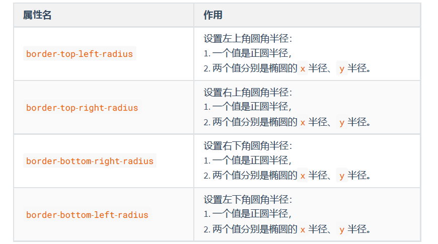

- 分开设置每个角的圆角，综合写法（几乎不用）：

`border-raidus: 左上角x 右上角x 右下角x 左下角x / 左上y 右上y 右下y 左下y`

##### 边框外轮廓

- outline-width ：外轮廓的宽度。
- outline-color ：外轮廓的颜色。
- outline-style ：外轮廓的风格。
  - none ： 无轮廓
  - dotted ： 点状轮廓
  - dashed ： 虚线轮廓
  - solid ： 实线轮廓
  - double ： 双线轮廓
- outline-offset 设置外轮廓与边框的距离，正负值都可以设置。

> 注意： outline-offset 不是outline 的子属性，是一个独立的属性。

- outline 复合属性`outline:50px solid blue;`

#### 文本属性

##### 文本阴影

- 在 CSS3 中，我们可以使用 text-shadow 属性给文本添加阴影。
- 语法：`text-shadow: h-shadow v-shadow blur color;`

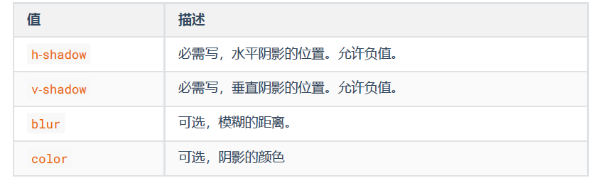

默认值： text-shadow:none 表示没有阴影。

##### 文本换行

- 在 CSS3 中，我们可以使用 white-space 属性设置文本换行方式。
- 常用值如下：

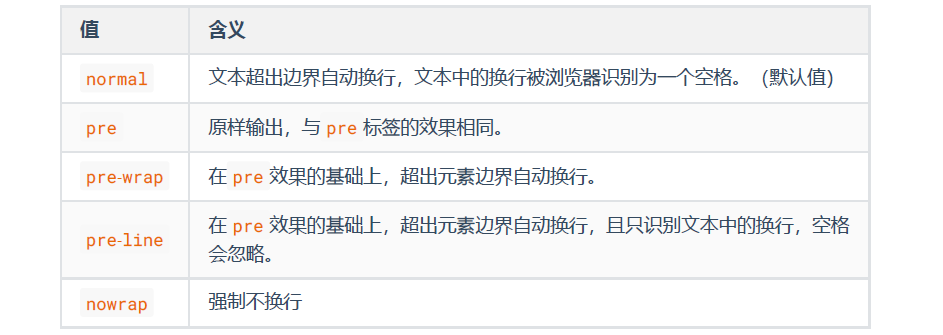

##### 文本溢出

- 在 CSS3 中，我们可以使用 text-overflow 属性设置文本内容溢出时的呈现模式。
- 常用值如下：

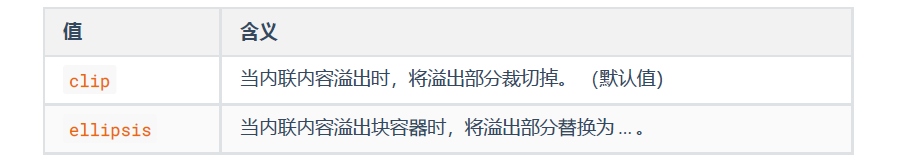

> 注意：要使得 text-overflow 属性生效，块容器必须显式定义 overflow 为非 visible值， white-space 为 nowrap 值。

##### 文本修饰

- CSS3 升级了text-decoration 属性，让其变成了复合属性。

`text-decoration: text-decoration-line || text-decoration-style || text-decorationcolor`

- 子属性及其含义：
  - text-decoration-line 设置文本装饰线的位置
    - none ： 指定文字无装饰 （默认值）
    - underline ： 指定文字的装饰是下划线
    - overline ： 指定文字的装饰是上划线
    - line-through ： 指定文字的装饰是贯穿线
  - text-decoration-style 文本装饰线条的形状
    - solid ： 实线 （默认）
    - double ： 双线
    - dotted ： 点状线条
    - dashed ： 虚线
    - wavy ： 波浪线
  - text-decoration-color 文本装饰线条的颜色

##### 文本描边

注意：文字描边功能仅 webkit 内核浏览器支持。

- -webkit-text-stroke-width ：设置文字描边的宽度，写长度值。
- -webkit-text-stroke-color ：设置文字描边的颜色，写颜色值。
- -webkit-text-stroke ：复合属性，设置文字描边宽度和颜色。

#### 新增渐变

##### 线性渐变

- 多个颜色之间的渐变， 默认从上到下渐变。

> 
> 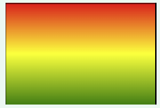


> background-image: linear-gradient(red,yellow,green);

- 使用关键词设置线性渐变的方向。

> 
> 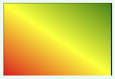


> background-image: linear-gradient(to top,red,yellow,green);
> background-image: linear-gradient(to right top,red,yellow,green);

- 使用角度设置线性渐变的方向。

> 
> 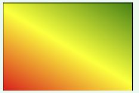


> background-image: linear-gradient(30deg,red,yellow,green);

- 调整开始渐变的位置。

> 
> 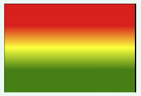


> background-image: linear-gradient(red 50px,yellow 100px ,green 150px);

##### 径向渐变

- 多个颜色之间的渐变， 默认从圆心四散。（注意：不一定是正圆，要看容器本身宽高比）

> 
> 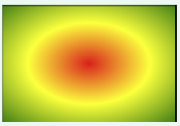


> background-image: radial-gradient(red,yellow,green);

- 使用关键词调整渐变圆的圆心位置。

> 
> 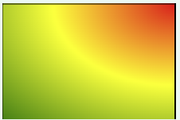


> background-image: radial-gradient(at right top,red,yellow,green);

- 使用像素值调整渐变圆的圆心位置。

> 
> 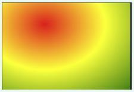


> background-image: radial-gradient(at 100px 50px,red,yellow,green);

- 调整渐变形状为正圆 。

> 
> 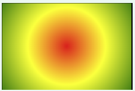


> background-image: radial-gradient(circle,red,yellow,green);

- 调整形状的半径 。

> 
> 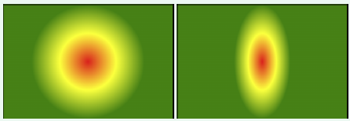


> background-image: radial-gradient(100px,red,yellow,green);
> background-image: radial-gradient(50px 100px,red,yellow,green);

- 调整开始渐变的位置。

> 
> 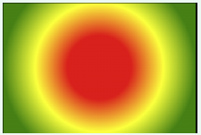


> background-image: radial-gradient(red 50px,yellow 100px,green 150px);

###### 重复渐变

无论线性渐变，还是径向渐变，在没有发生渐变的位置，继续进行渐变，就为重复渐变。

- 使用repeating-linear-gradient 进行重复线性渐变，具体参数同linear-gradient 。
- 使用repeating-radial-gradient 进行重复径向渐变，具体参数同radial-gradient 。

> 我们可以利用渐变，做出很多有意思的效果：例如：横格纸、立体球等等。

#### web 字体

##### 基本用法

可以通过@font-face 指定字体的具体地址，浏览器会自动下载该字体，这样就不依赖用户电脑上的字体了。

- 语法（简写方式）

```css
@font-face {
  font-family: "情书字体";
  src: url("./方正手迹.ttf");
}
```

- 语法（高兼容性写法）

```css
@font-face {
  font-family: "atguigu";
  font-display: swap;
  src: url("webfont.eot"); /* IE9 */
  src:
    url("webfont.eot?#iefix") format("embedded-opentype"),
    /* IE6-IE8 */ url("webfont.woff2") format("woff2"),
    url("webfont.woff") format("woff"),
    /* chrome、firefox */ url("webfont.ttf") format("truetype"),
    /* chrome、firefox、opera、Safari,
Android*/ url("webfont.svg#webfont") format("svg"); /* iOS 4.1- */
}
```

##### 定制字体

- 中文的字体文件很大，使用完整的字体文件不现实，通常针对某几个文字进行单独定制。
- 可使用阿里Web 字体定制工具： https://www.iconfont.cn/webfont

##### 字体图标

- 相比图片更加清晰。
- 灵活性高，更方便改变大小、颜色、风格等。
- 兼容性好， IE 也能支持。

> 字体图标的具体使用方式，每个平台不尽相同，最好参考平台使用指南，视频中我们是以使用最多
> 的阿里图标库作为演示。
> 阿里图标官网地址： https://www.iconfont.cn/

###### 阿里图标

我们会经常用到一些图标。但是我们在使用这些图标时，往往会遇到失真的情况，而且图片数量很多的话，页面加载就越慢。所以，我们可以使用字体图标的方式来显示图标，既解决了失真的问题，也解决了图片占用资源的问题。

常用字体图标库：[阿里字体图标库](https://iconfont.cn/)

**优点**

1. 轻量性：加载速度快，减少http请求
2. 灵活性：可以利用CSS设置大小颜色等
3. 兼容性：网页字体支持所有现代浏览器，包括IE低版本

**使用图标**

1. 注册账号并登录
2. 选取图标或搜索图标
3. 添加购物车
4. 下载代码
5. 选择`font-class`引用

```html
<span class="iconfont icon-add-circle"></span>
```

```css
<link rel="stylesheet" href="./css/iconfont.css" > .iconfont {
  font-size: 35px;
  color: red;
}
```

**使用方法**

- **访问并登录**

1. 打开浏览器，访问 [https://www.iconfont.cn/](https://www.iconfont.cn/?spm=5176.28103460.0.0.38f97d83b0lEV3)。
2. 点击右上角的“注册/登录”，用自己的账号登录。登录后才能创建自己的项目并下载代码。

- **搜索图标**

1. 在首页的搜索框中输入你想要的图标名称，例如“主题调色盘”。
2. 在搜索结果中找到合适的图标，点击图标下方的 **“添加入库”** 按钮。这会将图标放入你的购物车。
3. 重复以上步骤，将所有你需要的图标（如“钱包”、“设置”、“用户”等）都添加到购物车。

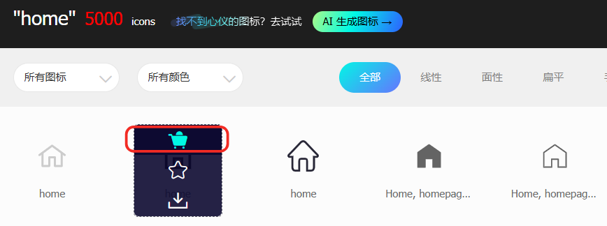

- **创建并下载**

1. 点击右上角的购物车图标，进入 **“购物车”** 页面。
2. 点击页面右下角的 **“下载至本地”** 按钮。
3. 系统会弹出一个对话框，询问你是直接下载还是加入项目。
   - **推荐做法**：点击 **“添加到项目”**。
4. 在弹出的“添加到项目”窗口中：
   - **项目名称**：为自己创建一个项目，例如 `my_website_icons`。
   - **选择分类**：可以不选，或者创建一个分类方便管理。
   - 点击 **“添加”**。

   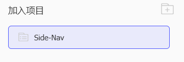

5. 添加成功后，会跳转到“我的项目”页面。找到你刚创建的项目，点击项目名称进入详情页。
6. 在项目详情页，点击页面右上角的 **“下载代码”** 按钮。这样下载下来的代码包含了你项目中所有图标的集合。

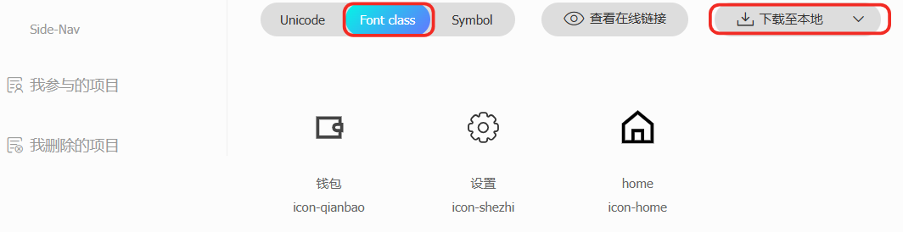

- **集成项目**

1. 解压你刚刚下载的 `.zip` 文件。
2. 你会看到一个文件夹，里面通常包含：
   - `iconfont.css` (最重要的样式文件)
   - `iconfont.js` (可选，用于 JS 方式使用)
   - `iconfont.json` (图标信息)
   - `iconfont.woff`, `iconfont.woff2`, `iconfont.ttf` (字体文件)
3. 将这个文件夹（或里面的文件）复制到你自己的网页项目目录中。例如，你可以创建一个 `font` 或 `assets/iconfont` 文件夹来存放它们。最终的文件结构可能像这样：

```css
your-website/
├── index.html
└── font/
    ├── iconfont.css
    ├── iconfont.woff2
    ├── iconfont.woff
    └── iconfont.ttf
```

- **引入与使用**

在<head>标签种使用<link  rel="stylesheet" href="iconfont.css的相对路径">，然后你就可以在需要的地方使用图标了。记住，需要同时加上 `iconfont` 这个通用类和你想要的图标的特定类名。

```html
<!DOCTYPE html>
<html lang="zh-CN">
  <head>
    <meta charset="UTF-8" />
    <meta name="viewport" content="width=device-width, initial-scale=1.0" />
    <title>GooHv's Coding</title>
    <link rel="stylesheet" href="font/iconfont.css" />
    <style>
      /* 中间为css代码 */
    </style>
  </head>
  <body>
    <!-- 你的网页内容 -->
    <ul>
      <li>
        <a href="#home">
          <div class="icon">
            <!-- 以下为导入字体图标的方法样式 -->
            <i class="iconfont icon-cangku"></i>
          </div>
          <div class="text">主&nbsp;&nbsp;&nbsp;页</div>
        </a>
      </li>
    </ul>
  </body>
</html>
```

- **注意事项**
- **路径问题**：确保 `href` 中的路径和你存放 `iconfont.css` 的位置相对应。同样，`iconfont.css` 文件内部会引用 `.woff` 等字体文件，也要保证它们之间的相对路径是正确的。
- **类名**：`icon-zhuti_tiaosepan` 这样的类名，就是你在 IconFont 项目中看到的每个图标的名称。复制粘贴时务必准确。
- **多图标**：你添加到项目中的所有图标都可以在同一个 CSS 文件中使用，所以引入一次 `iconfont.css` 就可以让你项目中所有的图标都可用。

###### icomoon图标

官方网址：https://icomoon.io/

**素材资料**

请基于icomoon字体图标.zip进行设计创作。

**使用方法**

本例采用伪元素结合字体图标进行设计工作。

- 拷贝

将压缩包内的fonts文件拷贝到网站目录。

- 声明

将压缩包内的style.css打开，拷贝font-face复制刀对应的css文件中进行文字图标的声明

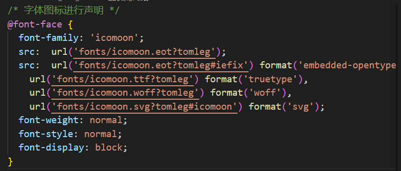

- 路径修改

将声明中的url里面的fonts路径修改为正确的路径，如下：

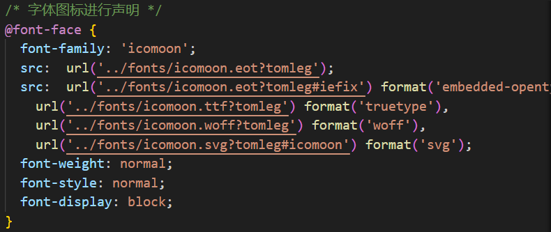

- 查找样式

在压缩包的demo.html中查找需要的样式，并赋值对应需要样式的代码

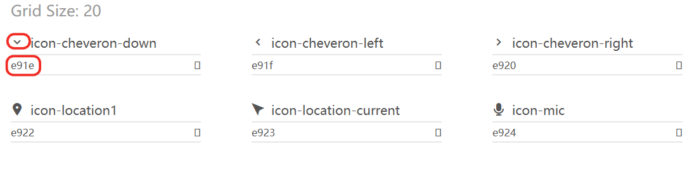

- 编码

在伪元素css对应的位置填写如下代码：

```css
/* 快捷导航中右侧样式中的下箭头 */
.arrow-icon::after {
  content: "\e91e";
  font-family: "icomoon";
  margin-left: 6px;
}
```

- 效果

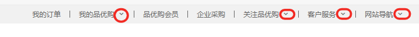

#### 2D变换

> 前提：二维坐标系如下图所示

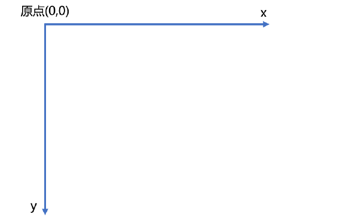

##### 2D位移

2D 位移可以改变元素的位置，具体使用方式如下：

1. 先给元素添加 转换属性 transform
2. 编写transform 的具体值，相关可选值如下：

|值 |含义 |
|---|---|
|translateX |设置水平方向位移，需指定长度值；若指定的是百分比，是参考自身宽度的百分比。 |
|translateY |设置垂直方向位移，需指定长度值；若指定的是百分比，是参考自身高度<br/>的百分比。 |
|translate |一个值代表水平方向，两个值代表：水平和垂直方向。 |

3. 注意点：

> 1. 位移与相对定位很相似，都不脱离文档流，不会影响到其它元素。
> 2. 与相对定位的区别：相对定位的百分比值，参考的是其父元素；定位的百分比值，参考的是
>    其自身。
> 3. 浏览器针对位移有优化，与定位相比，浏览器处理位移的效率更高。
> 4. transform 可以链式编写，例如：
> 5. 位移对行内元素无效。
> 6. 位移配合定位，可实现元素水平垂直居中
> 7. 
>    ```css
>    .box {
>      position: absolute;
>      left: 50%;
>      top: 50%;
>      transform: translate(-50%, -50%);
>    }
>    ```

##### 2D缩放

2D 缩放是指：让元素放大或缩小，具体使用方式如下：

1. 先给元素添加 转换属性 transform
2. 编写transform 的具体值，相关可选值如下：

|值 |含义 |
|---|---|
|scaleX |设置水平方向的缩放比例，值为一个数字， 1 表示不缩放，大于1 放大，小于1 缩小。 |
|scaleY |设置垂直方向的缩放比例，值为一个数字， 1 表示不缩放，大于1 放大，小于1 缩小。 |
|scale |同时设置水平方向、垂直方向的缩放比例，一个值代表同时设置水平和垂直缩放；两个值分别代表：水平缩放、垂直缩放。 |

3. 注意点：

> 1. scale 的值，是支持写负数的，但几乎不用，因为容易让人产生误解。
> 2. 借助缩放，可实现小于12px 的文字。

##### 2D旋转

2D 旋转是指：让元素在二维平面内，顺时针旋转或逆时针旋转，具体使用方式如下：

1. 先给元素添加 转换属性 transform
2. 编写transform 的具体值，相关可选值如下：

|值 |含义 |
|---|---|
|rotate |设置旋转角度，需指定一个角度值( deg )，正值顺时针，负值逆时针。 |

> 注意： rotateZ(20deg) 相当于 rotate(20deg) ，当然到了3D 变换的时候，还能写：
> rotate(x,x,x)

##### 2D扭曲

2D 扭曲是指：让元素在二维平面内被“拉扯”，进而“走形”，实际开发几乎不用，了解即可，具体使用方式如下：

1. 先给元素添加 转换属性 transform
2. 编写transform 的具体值，相关可选值如下：

|值 |含义 |
|---|---|
|skewX |设置元素在水平方向扭曲，值为角度值，会将元素的左上角、右下角拉扯。 |
|skewY |设置元素在垂直方向扭曲，值为角度值，会将元素的左上角、右下角拉扯。 |
|skew |一个值代表skewX ，两个值分别代表： skewX 、skewY |

##### 多重变换

多个变换，可以同时使用一个transform 来编写。

```css
transform: translate(-50%, -50%) rotate(45deg);
```

> 注意点：多重变换时，建议最后旋转。

##### 变换原点

- 元素变换时，默认的原点是元素的中心，使用transform-origin 可以设置变换的原点。
- 修改变换原点对位移没有影响， 对旋转和缩放会产生影响。
- 如果提供两个值，第一个用于横坐标，第二个用于纵坐标。
- 如果只提供一个，若是像素值，表示横坐标，纵坐标取50% ；若是关键词，则另一个坐标取50%

> 1. transform-origin: 50% 50% ， 变换原点在元素的中心位置，百分比是相对于自
>    身。—— 默认值
> 2. transform-origin: left top ，变换原点在元素的左上角 。
> 3. transform-origin: 50px 50px ， 变换原点距离元素左上角 50px 50px 的位置。
> 4. transform-origin: 0 ，只写一个值的时候，第二个值默认为 50% 。

#### 3D变换

##### 开启3D空间

重要原则：元素进行3D 变换的首要操作：父元素必须开启3D 空间！

> 使用transform-style 开启3D 空间，可选值如下：
> flat ： 让子元素位于此元素的二维平面内（ 2D 空间）—— 默认值
> preserve-3d ： 让子元素位于此元素的三维空间内（ 3D 空间）

##### 设置景深

何为景深？—— 指定观察者与z=0 平面的距离，能让发生3D 变换的元素，产生透视效果，看来更加立体。

> 使用perspective 设置景深，可选值如下：
> none ： 不指定透视 ——（默认值）
> 长度值 ： 指定观察者距离z=0 平面的距离，不允许负值。
> 注意： perspective 设置给发生3D 变换元素的父元素！

##### 透视点位置

所谓透视点位置，就是观察者位置；默认的透视点在元素的中心。

> 使用perspective-origin 设置观察者位置（透视点的位置），例如：
>
> ```css
> /* 相对坐标轴往右偏移400px， 往下偏移300px（相当于人蹲下300像素，然后向右移动400像素看元素）
> */
> perspective-origin: 400px 300px;
> ```
>
> 注意：通常情况下，我们不需要调整透视点位置。

##### 3D 位移

3D 位移是在2D 位移的基础上，可以让元素沿z 轴位移，具体使用方式如下：

1. 先给元素添加 转换属性 transform
2. 编写transform 的具体值， 3D 相关可选值如下：

|值 |含义 |
|---|---|
|translateZ |设置z 轴位移，需指定长度值，正值向屏幕外，负值向屏幕里，且不能写百分比。 |
|translate3d |第1个参数对应x 轴，第2个参数对应y 轴，第3个参数对应z 轴，且均不能省略。 |

##### 3D 旋转

3D 旋转是在2D 旋转的基础上，可以让元素沿x 轴和y 轴旋转，具体使用方式如下：

1. 先给元素添加 转换属性 transform
2. 编写transform 的具体值， 3D 相关可选值如下：

|值 |含义 |
|---|---|
|rotateX |设置x 轴旋转角度，需指定一个角度值( deg )，面对x 轴正方向：正值顺时针，负值逆时针。 |
|rotateY |设置y 轴旋转角度，需指定一个角度值( deg )，面对y 轴正方向：正值顺时针，负值逆时针。 |
|rotate3d |前3 个参数分别表示坐标轴： x , y , z ，第4 个参数表示旋转的角度，参数不允许省略。<br/>例如： transform: rotate3d(1,1,1,30deg) ，意思是： x 、y 、z 分别旋转30 度。 |

##### 3D 缩放

3D 缩放是在2D 缩放的基础上，可以让元素沿z 轴缩放，具体使用方式如下：

1. 先给元素添加 转换属性 transform
2. 编写transform 的具体值， 3D 相关可选值如下：

|值 |含义 |
|---|---|
|scaleZ |设置z 轴方向的缩放比例，值为一个数字， 1 表示不缩放，大于1 放大，小于1 缩小。 |
|scale3d |第1个参数对应x 轴，第2个参数对应y 轴，第3个参数对应z 轴，参数不允许省略。 |

##### 多重变换

多个变换，可以同时使用一个transform 来编写。

```css
transform: translateZ(100px) scaleZ(3) rotateY(40deg);
```

> 注意点：多重变换时，建议最后旋转。

##### 背部可见性

使用backface-visibility 指定元素背面，在面向用户时是否可见，常用值如下：

- visible ： 指定元素背面可见，允许显示正面的镜像。—— 默认值
- hidden ： 指定元素背面不可见

> 注意： backface-visibility 需要加在发生3D 变换元素的自身上。

#### 过渡

过渡可以在不使用 Flash 动画，不使用 JavaScript 的情况下，让元素从一种样式，平滑过渡为另一种样式。

##### transition-property

- 作用：定义哪个属性需要过渡，只有在该属性中定义的属性（比如宽、高、颜色等）才会以有过渡效果。
- 常用值：1. none ：不过渡任何属性。1. all ：过渡所有能过渡的属性。1. 具体某个属性名，例如： width 、heigth ，若有多个以逗号分隔。

> 不是所有的属性都能过渡，值为数字，或者值能转为数字的属性，都支持过渡，否则不支持过渡。
> 常见的支持过渡的属性有：颜色、长度值、百分比、z-index 、opacity 、2D 变换属性、3D 变换属性、阴影。

##### transition-duration

- 作用：设置过渡的持续时间，即：一个状态过渡到另外一个状态耗时多久
- 常用值：
  - 0 ：没有任何过渡时间 —— 默认值。
  - s 或ms ：秒或毫秒。
  - 列表：
    - 如果想让所有属性都持续一个时间，那就写一个值。
    - 如果想让每个属性持续不同的时间那就写一个时间的列表。

##### transition-delay

- 作用：指定开始过渡的延迟时间，单位： s 或ms

##### transition-timing-function

- 作用：设置过渡的类型
- 常用值：
  - ease ： 平滑过渡 —— 默认值
  - linear ： 线性过渡
  - ease-in ： 慢 → 快
  - ease-out ： 快 → 慢
  - ease-in-out ： 慢 → 快 → 慢
  - step-start ： 等同于 steps(1, start)
  - step-end ： 等同于 steps(1, end)
  - steps( integer,?) ： 接受两个参数的步进函数。第一个参数必须为正整数，指定函数的步数。第二个参数取值可以是start 或end ，指定每一步的值发生变化的时间点。第二个参数默认值为end 。
  - cubic-bezie ( number, number, number, number)： 特定的贝塞尔曲线类型。
  - 
    > 在线制作贝赛尔曲线： https://cubic-bezier.com

##### transition 复合属性

- 如果设置了一个时间，表示duration ；如果设置了两个时间，第一是duration ，第二个是delay ；其他值没有顺序要求。

```css
transition: 1s 1s linear all;
```

#### 动画

##### 什么是帧

一段动画，就是一段时间内连续播放n 个画面。每一张画面，我们管它叫做“帧”。一定时间内连续快速播放若干个帧，就成了人眼中所看到的动画。同样时间内，播放的帧数越多，画面看起来越流畅。

##### 什么是关键帧

关键帧指的是，在构成一段动画的若干帧中，起到决定性作用的2-3 帧。

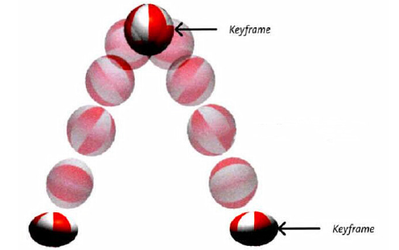

##### 基本使用

- 第一步：定义关键帧（定义动画）

1. 简单方式定义：

```css
/*写法一*/
@keyframes 动画名 {
  from {
    /*property1:value1*/
    /*property2:value2*/
  }
  to {
    /*property1:value1*/
  }
}
```

2. 完整方式定义：

```css
@keyframes 动画名 {
  0% {
    /*property1:value1*/
  }
  20% {
    /*property1:value1*/
  }
  40% {
    /*property1:value1*/
  }
  60% {
    /*property1:value1*/
  }
  80% {
    /*property1:value1*/
  }
  100% {
    /*property1:value1*/
  }
}
```

- 第二步：给元素应用动画，用到的属性如下：

1. animation-name ：给元素指定具体的动画（具体的关键帧）
2. animation-duration ：设置动画所需时间
3. animation-delay ：设置动画延迟

```css
.box {
  /* 指定动画 */
  animation-name: testKey;
  /* 设置动画所需时间 */
  animation-duration: 5s;
  /* 设置动画延迟 */
  animation-delay: 0.5s;
}
```

##### 其他属性

- animation-timing-function ，设置动画的类型，常用值如下：

> 1. ease ： 平滑动画 —— 默认值
> 2. linear ： 线性过渡
> 3. ease-in ： 慢 → 快
> 4. ease-out ： 快 → 慢
> 5. ease-in-out ： 慢 → 快 → 慢
> 6. step-start ： 等同于 steps(1, start)
> 7. step-end ： 等同于 steps(1, end)
> 8. steps( integer,?) ： 接受两个参数的步进函数。第一个参数必须为正整数，指定函数的步数。第二个参数取值可以是start 或end ，指定每一步的值发生变化的时间点。第二个参数默认值为end 。
> 9. cubic-bezie ( number, number, number, number)： 特定的贝塞尔曲线类型。

- animation-iteration-count ，指定动画的播放次数，常用值如下：

> 1. number ：动画循环次数
> 2. infinite ： 无限循环

- animation-direction ，指定动画方向，常用值如下：

> 1. normal ： 正常方向 (默认)
> 2. reverse ： 反方向运行
> 3. alternate ： 动画先正常运行再反方向运行，并持续交替运行
> 4. alternate-reverse ： 动画先反运行再正方向运行，并持续交替运行

- animation-fill-mode ，设置动画之外的状态

> 1. forwards ： 设置对象状态为动画结束时的状态
> 2. backwards ： 设置对象状态为动画开始时的状态

- animation-play-state ，设置动画的播放状态，常用值如下：

> 1. running ： 运动 (默认)
> 2. paused ： 暂停

##### 复合属性

只设置一个时间表示duration ，设置两个时间分别是： duration 和 delay ，其他属性没有数量和顺序要求。

```css
.inner {
  animation: atguigu 3s 0.5s linear 2 alternate-reverse forwards;
}
```

> 备注： animation-play-state 一般单独使用。

#### 多列布局

作用：专门用于实现类似于报纸的布局。


常用属性如下：

- column-count ：指定列数，值是数字。
- column-width ：指定列宽，值是长度。
- columns ：同时指定列宽和列数，复合属性；值没有数量和顺序要求。
- column-gap ：设置列边距，值是长度。
- column-rule-style ：设置列与列之间边框的风格，值与 border-style 一致。
- column-rule-width ：设置列与列之间边框的宽度，值是长度。
- column-rule-color ：设置列与列之间边框的颜色。
- coumn-rule ：设置列边框，复合属性。
- column-span 指定是否跨列；值: none 、all 。

#### 伸缩盒模型

##### 简介

- 2009 年， W3C 提出了一种新的盒子模型 —— Flexible Box （伸缩盒模型，又称：弹性盒子）。
- 它可以轻松的控制：元素分布方式、元素对齐方式、元素视觉顺序 .......
- 截止目前，除了在部分IE 浏览器不支持，其他浏览器均已全部支持。
- 伸缩盒模型的出现，逐渐演变出了一套新的布局方案 —— flex 布局。

> 小贴士：
>
> 1. 传统布局是指：基于传统盒状模型，主要靠： display 属性 + position 属性 + float
>    属性。
> 2. flex 布局目前在移动端应用比较广泛，因为传统布局不能很好的呈现在移动设备上。

##### 伸缩容器、伸缩项目

- 伸缩容器： 开启了 flex 的元素，就是：伸缩容器。

> 1. 给元素设置： display:flex 或 display:inline-flex ，该元素就变为了伸缩容
>    器。
> 2. display:inline-flex 很少使用，因为可以给多个伸缩容器的父容器，也设置为伸缩
>    容器。
> 3. 一个元素可以同时是：伸缩容器、伸缩项目。

- 伸缩项目：伸缩容器所有子元素自动成为了：伸缩项目。

> 1. 仅伸缩容器的子元素成为了伸缩项目，孙子元素、重孙子元素等后代，不是伸缩项目。
> 2. 无论原来是哪种元素（块、行内块、行内），一旦成为了伸缩项目，全都会“块状化”。

##### 主轴与侧轴

- 主轴： 伸缩项目沿着主轴排列，主轴默认是水平的，默认方向是：从左到右（左边是起点，右边是终点）。
- 侧轴： 与主轴垂直的就是侧轴，侧轴默认是垂直的，默认方向是：从上到下（上边是起点，下边是终点）。

##### 主轴方向

- 属性名： flex-direction
- 常用值如下：
  1. row ：主轴方向水平从左到右 —— 默认值
  2. row-reverse ：主轴方向水平从右到左。
  3. column ：主轴方向垂直从上到下。
  4. column-reverse ：主轴方向垂直从下到上。

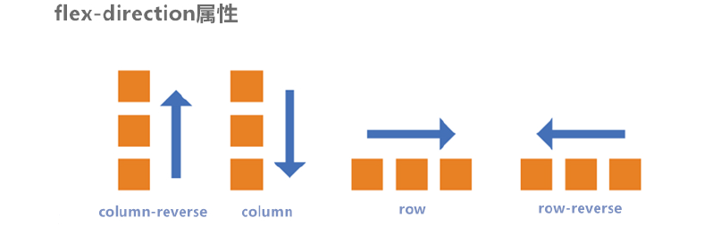

> 注意：改变了主轴的方向，侧轴方向也随之改变。

##### 主轴换行

- 属性名： flex-wrap
- 常用值如下：
  1. nowrap ：默认值，不换行。

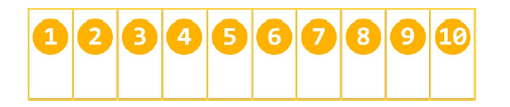

2. wrap ：自动换行，伸缩容器不够自动换行。

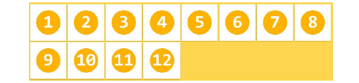

3. wrap-reverse ：反向换行。

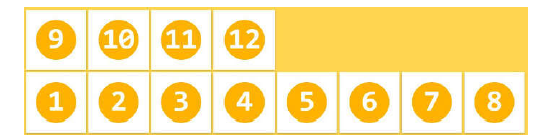

##### flex-flow

flex-flow 是一个复合属性，复合了 flex-direction 和 flex-wrap 两个属性。 值没有顺序要求。

```css
flex-flow: row wrap;
```

##### 主轴对齐

- 属性名： justify-content
- 常用值如下：
  1. flex-start ：主轴起点对齐。—— 默认值
  2. flex-end ：主轴终点对齐。
  3. center ：居中对齐
  4. space-between ：均匀分布，两端对齐（最常用）。
  5. space-around ：均匀分布，两端距离是中间距离的一半。
  6. space-evenly ：均匀分布，两端距离与中间距离一致。


##### 侧轴对齐

###### 一行的情况

- 所需属性： align-items
- 常用值如下：
  1. flex-start ：侧轴的起点对齐。
  2. flex-end ：侧轴的终点对齐。
  3. center ：侧轴的中点对齐。
  4. baseline : 伸缩项目的第一行文字的基线对齐。
  5. stretch ：如果伸缩项目未设置高度，将占满整个容器的高度。—— （默认值）


###### 多行的情况

- 所需属性： align-content
- 常用值如下：
  1. flex-start ：与侧轴的起点对齐。
  2. flex-end ：与侧轴的终点对齐。
  3. center ：与侧轴的中点对齐。
  4. space-between ：与侧轴两端对齐，中间平均分布。
  5. space-around ：伸缩项目间的距离相等，比距边缘大一倍。
  6. space-evenly : 在侧轴上完全平分。
  7. stretch ：占满整个侧轴。—— 默认值


##### flex 实现水平垂直居中

方法一：父容器开启flex 布局，随后使用justify-content 和align-items 实现水平垂直居中

```css
.outer {
  width: 400px;
  height: 400px;
  background-color: #888;
  display: flex;
  justify-content: center;
  align-items: center;
}
.inner {
  width: 100px;
  height: 100px;
  background-color: orange;
}
```

方法二：父容器开启flex 布局，随后子元素margin: auto

```css
.outer {
  width: 400px;
  height: 400px;
  background-color: #888;
  display: flex;
}
.inner {
  width: 100px;
  height: 100px;
  background-color: orange;
  margin: auto;
}
```

##### 伸缩性

###### flex-basis

- 概念： flex-basis 设置的是主轴方向的基准长度，会让宽度或高度失效。

> 备注：主轴横向：宽度失效；主轴纵向：高度失效

- 作用：浏览器根据这个属性设置的值，计算主轴上是否有多余空间，默认值auto ，即：伸缩项目的宽或高。

###### flex-grow（伸）

- 概念： flex-grow 定义伸缩项目的放大比例，默认为0 ，即：纵使主轴存在剩余空间，也不拉伸（放大）。
- 规则：

1. 若所有伸缩项目的 flex-grow 值都为1 ，则：它们将等分剩余空间（如果有空间的话）。
2. 若三个伸缩项目的flex-grow 值分别为： 1 、2 、3 ，则：分别瓜分到： 1/6 、2/6 、3/6 的空间。

###### flex-shrink（缩）

- 概念： flex-shrink 定义了项目的压缩比例，默认为1 ，即：如果空间不足，该项目将会缩小。
- 收缩项目的计算，略微复杂一点，我们拿一个场景举例：

> 例如：
> 三个收缩项目，宽度分别为： 200px 、300px 、200px ，它们的flex-shrink 值分别
> 为： 1 、2 、3
> 若想刚好容纳下三个项目，需要总宽度为700px ，但目前容器只有400px ，还差300px
> 所以每个人都要收缩一下才可以放下，具体收缩的值，这样计算：
>
> 1. 计算分母： (200×1) + (300×2) + (200×3) = 1400
> 2. 计算比例：
>    项目一： (200×1) / 1400 = 比例值1
>    项目二： (300×2) / 1400 = 比例值2
>
> 项目三： (200×3) / 1400 = 比例值3
>
> 3. 计算最终收缩大小：
>    项目一需要收缩： 比例值1 × 300
>    项目二需要收缩： 比例值2 × 300
>    项目三需要收缩： 比例值3 × 300

##### flex复合属性

- flex 是复合属性，复合了： flex-grow 、 flex-shrink 、flex-basis 三个属性，默认值为 0 1 auto 。
  - 如果写 flex:1 1 auto ，则可简写为： flex:auto
  - 如果写 flex:1 1 0 ，则可简写为： flex:1
  - 如果写 flex:0 0 auto ，则可简写为： flex:none
  - 如果写 flex:0 1 auto ，则可简写为： flex:0 auto —— 即 flex 初始值。

##### 项目排序

- order 属性定义项目的排列顺序。数值越小，排列越靠前，默认为0 。

##### 单独对齐

- 通过align-self 属性，可以单独调整某个伸缩项目的对齐方式
- 默认值为 auto ，表示继承父元素的 align-items 属性。

#### 响应式布局

##### 媒体查询

###### 媒体类型

|值 |含义 |
|---|---|
|all |检测所有设备。 |
|screen |检测电子屏幕，包括：电脑屏幕、平板屏幕、手机屏幕等。 |
|print |检测打印机。 |
|aural |已废弃，用于语音和声音合成器。 |
|braille |已废弃，应用于盲文触摸式反馈设备。 |
|embossed |已废弃， 用于打印的盲人印刷设备。 |
|handheld |已废弃， 用于掌上设备或更小的装置，如PDA和小型电话。 |
|projection |已废弃， 用于投影设备。 |
|tty |已废弃， 用于固定的字符网格，如电报、终端设备和对字符有限制的便携设备。 |
|tv |已废弃， 用于电视和网络电视。 |

> 完整列表请参考： https://developer.mozilla.org/zh-CN/docs/Web/CSS/@media

###### 媒体特性

|值 |含义 |
|---|---|
|width |检测视口宽度。 |
|max-width |检测视口最大宽度。 |
|min-width |检测视口最小宽度。 |
|height |检测视口高度。 |
|max-height |检测视口最大高度。 |
|min-height |检测视口最小高度。 |
|device-width |检测设备屏幕的宽度。 |
|max-device-width |检测设备屏幕的最大宽度。 |
|min-device-width |检测设备屏幕的最小宽度。 |
|orientation |检测视口的旋转方向（是否横屏）。<br/>1. portrait ：视口处于纵向，即高度大于等于宽度。<br/>2. landscape ：视口处于横向，即宽度大于高度。 |

> 完整列表请参考： https://developer.mozilla.org/zh-CN/docs/Web/CSS/@media

###### 运算符

|值 |含义 |
|---|---|
|and |并且 |
|, 或 or |或 |
|not |否定 |
|only |肯定 |

###### 常用阈值

在实际开发中，会将屏幕划分成几个区间，例如：

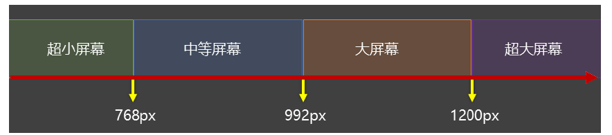

###### 结合外部样式的用法

- 用法一：

```css
<link rel="stylesheet" media="具体的媒体查询" href="mystylesheet.css">
```

- 用法二：

```css
@media screen and (max-width: 768px) {
  /*CSS-Code;*/
}
@media screen and (min-width: 768px) and (max-width: 1200px) {
  /*CSS-Code;*/
}
```

#### BFC

##### 什么是BFC

- W3C 上对 BFC 的定义：

> 原文：Floats, absolutely positioned elements, block containers (such as inline-blocks, tablecells,
> and table-captions) that are not block boxes, and block boxes with 'overflow' other than
> 'visible' (except when that value has been propagated to the viewport) establish new block
> formatting contexts for their contents.
> 译文：浮动、绝对定位元素、不是块盒子的块容器（如inline-blocks 、table-cells 和
> table-captions ），以及overflow 属性的值除visible 以外的块盒，将为其内容建立新
> 的块格式化上下文。

- MDN 上对 BFC 的描述：

> 块格式化上下文（Block Formatting Context，BFC） 是Web 页面的可视CSS 渲染的一部分，
> 是块盒子的布局过程发生的区域，也是浮动元素与其他元素交互的区域。

- 更加通俗的描述：

> 1. BFC 是 Block Formatting Context （块级格式上下文），可以理解成元素的一个“特异功能”。
> 2. 该 “特异功能”，在默认的情况下处于关闭状态；当元素满足了某些条件后，该“特异功能”被激活。
> 3. 所谓激活“特异功能”，专业点说就是：该元素创建了 BFC （又称：开启了 BFC ）。

##### 开启了BFC能解决什么问题

1. 元素开启BFC 后，其子元素不会再产生margin 塌陷问题。
2. 元素开启BFC 后，自己不会被其他浮动元素所覆盖。
3. 元素开启BFC 后，就算其子元素浮动，元素自身高度也不会塌陷。

##### 如何开启BFC

根元素
浮动元素
绝对定位、固定定位的元素
行内块元素
表格单元格： table 、thead 、tbody 、tfoot 、th 、td 、tr 、caption
overflow 的值不为 visible 的块元素
伸缩项目
多列容器
column-span 为 all 的元素（即使该元素没有包裹在多列容器中）
display 的值，设置为flow-root

## JavaScript

### 基础教程

#### 基本介绍

JavaScript 是一种轻量级的脚本语言。所谓“脚本语言”，指的是它不具备开发操作系统的能力，而是只用来编写控制其他大型应用程序的“脚本”。

JavaScript 是一种嵌入式（embedded）语言。它本身提供的核心语法不算很多。ECMAScript和JavaScript的关系是，前者是后者的规格，后者是前者的一种实现。在日常场合，这两个词是可以互换的。

##### 核心功能

- 操控浏览器的能力
- 广泛的使用领域
- 易学性

##### 基本版本

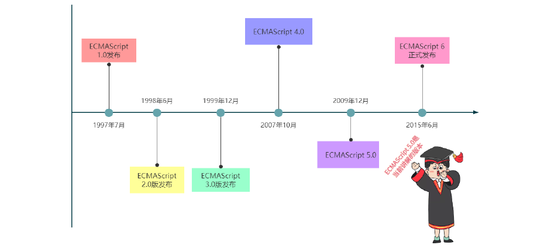

#### 基本语法

##### 语句

JavaScript 程序的单位是行（line），也就是一行一行地执行。一般情况下，每一行就是一个语句。

```js
var num = 10;
```

语句以分号结尾，一个分号就表示一个语句结束。

##### 标识符

标识符（identifier）指的是用来识别各种值的合法名称。最常见的标识符就是变量名

标识符是由：字母、美元符号($)、下划线(_)和数字组成，其中数字不能开头

> **温馨提示**
>
> 中文是合法的标识符，可以用作变量名（不推荐）

##### 保留字

以下关键字不需要强行记忆！

> JavaScript有一些保留字，不能用作标识符：arguments、break、case、catch、class、const、continue、debugger、default、delete、do、else、enum、eval、export、extends、false、finally、for、function、if、implements、import、in、instanceof、interface、let、new、null、package、private、protected、public、return、static、super、switch、this、throw、true、try、typeof、var、void、while、with、yield。

#### 引入方式

##### 嵌入式

直接将script语句嵌入到HTML文件中。

```html
<body>
  <script>
    var age = 20;
  </script>
</body>
```

##### 本地式

在body中引入本地独立JS文件。

```html
<body>
  <script type="text/javascript" src="./itbaizhan.js"></script>
</body>
```

##### 网络式

在body中引入网络上共享的JS文件。

```html
<body>
  <script src="https://cdn.bootcdn.net/ajax/libs/jquery/3.6.0/jquery.min.js"></script>
</body>
```

#### 注释与输出

##### 注释方式

源码中注释是不被引擎所解释的，它的作用是对代码进行解释。Javascript 提供两种注释的写法：一种是单行注释，用//起头；另一种是多行注释，放在/*和*/之间。

```js
// 这是单行注释

/*
 这是
 多行
 注释
*/
```

嵌入在HTML文件中的注释

```html
<!-- 注释 -->
```

> **温馨提示**
>
> 注释的快捷键：`ctrl + /`

##### 输出方式

JavaScript有很多种输出方式，都可以让我们更直观的看到程序运行的结果

```js
// 在浏览器中弹出一个对话框,然后把要输出的内容展示出来,alert都是把要输出的内容首先转换为字符串然后在输出的
alert("要输出的内容");

document.write("要输出的内容");

// 在控制台输出内容
console.log("要输出的内容");
```

#### 变量定义

变量的定义采用`var`来进行声明。

```js
var num = 10;
```

- **重新赋值**

```js
var num = 10;
num = 20;
```

- **变量提升**

JavaScript 引擎的工作方式是，先解析代码，获取所有被声明的变量，然后再一行一行地运行。这造成的结果，就是所有的变量的声明语句，都会被提升到代码的头部，这就叫做变量提升（hoisting）。

```js
console.log(num);
var num = 10; // 结果是什么呢？
```

#### 数据类型

##### 类型分类

JavaScript 语言的每一个值，都属于某一种数据类型。JavaScript 的数据类型，共有六种。（ES6 又新增了第七种 Symbol 类型的值和第八种 BigInt类型，当前课程暂不涉及）。

##### 基础类型

基础类型分3种，分别为：数值型，字符串型和布尔型。

```js
var age = 20;
var name = "尚学堂";
var learn = true;
```

##### 复合类型

对象：因为一个对象往往是多个原始类型的值的合成，可以看作是一个存放各种值的容器

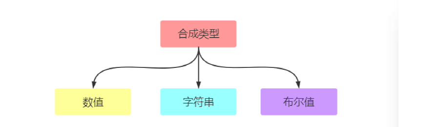

```js
var user = {
  name: "尚学堂",
  age: 20,
  learn: true,
};
```

> **温馨提示**
>
> 至于undefined和null，一般将它们看成两个特殊值。

#### 运算符

##### typrof运算符

JavaScript 有三种方法，可以确定一个值到底是什么类型。而我们现在需要接触到的就是typeof。

###### 数值

对应其值返回number。

```js
typeof 123; // "number"
```

###### 字符串

对应其值返回string。

```js
typeof "123"; // "string"
```

###### 布尔

对应其值返回boolean。

```js
typeof false; // "boolean"
```

###### 对象

对应其值返回object。

```js
typeof {}; // "object"
```

##### unll和undefined

null与undefined都可以表示“没有”，含义非常相似。将一个变量赋值为undefined或null，老实说，语法效果几乎没区别。既然含义与用法都差不多，为什么要同时设置两个这样的值，这不是无端增加复杂度，令初学者困扰吗？这与历史原因有关。

##### 算术运算符

###### 加减乘除运算符

加减乘除运算符就是基本的数学运算符效果

```js
10 + 10; // 20
100 - 10; // 90
10 * 2; //20
10 / 5;
2;
```

###### 余数运算符

余数运算符是比较常用的，因为在逻辑思维上寻找规律，余数运算符是很好用的

```js
13 % 5; // 3
```

###### 自增和自减运算符

自增和自减运算符，是一元运算符，只需要一个运算子。它们的作用是将运算子首先转为数值，然后加上1或者减去1

```js
var x = 1;
var y = 1;
++x; // 2
--y; // 0
```

自增和自减运算符有一个**需要注意**的地方，就是放在变量之后，会先返回变量操作前的值，再进行自增/自减操作；放在变量之前，会先进行自增/自减操作，再返回变量操作后的值。

```js
var x = 1;
var y = 1;

x++; // 1
++y; // 2
```

```js
var x = 10;
var y = 20;
console.log(x++ + y); // 30
```

##### 赋值运算符

赋值运算符（Assignment Operators）用于给变量赋值。最常见的赋值运算符，当然就是等号（=）

```js
// 将 1 赋值给变量 x
var x = 1;
// 将变量 y 的值赋值给变量 x
var x = y;
```

赋值运算符还可以与其他运算符结合，形成变体。下面是与算术运算符的结合

```js
// 等同于 x = x + y
x += y;
// 等同于 x = x - y
x -= y;
// 等同于 x = x * y
x *= y;
// 等同于 x = x / y
x /= y;
// 等同于 x = x % y
x %= y;
```

##### 比较运算符

比较运算符用于比较两个值的大小，然后返回一个布尔值，表示是否满足指定的条件。

```js
2 > 1; // true
```

JavaScript 一共提供了8个比较运算符。

|比较运算符 |描述 |
|:---:|:---:|
|< |小于运算符 |
|> |大于运算符 |
|<= |小于或等于运算符 |
|>= |大于或等于运算符 |
|== |相等运算符 |
|=== |严格相等运算符 |
|!= |不相等运算符 |
|!== |严格不相等运算符 |

**“**==**”和“**==**=”的区别**:

==：双等比较值

===：三等比较值和类型

##### 取反运算符

- 布尔值取反

```js
!true; // false
!false; // true
```

- 非布尔值取反

对于非布尔值，取反运算符会将其转为布尔值。可以这样记忆，以下六个值取反后为true，其他值都为false。

> **温馨提示**
>
> undefined
> null
> false
> 0
> NaN
> 空字符串（''）

```js
!undefined; // true
!null; // true
!0; // true
!NaN; // true
!""; // true

!54; // false
!"hello"; // false
```

##### 且运算符

多个条件都要满足。

> 如果一个人一直做好事，突然有一天做了一件坏事，那么人们会认为这个人很虚伪，以前说不定都是装的！对这个人不在认可

```js
console.log(10 < 20 && 10 > 5); // true
```

##### 或运算符

满足一个条件即可

> 如果一个人一直做坏事，突然有一天做了一件好事，那么人们会认为这个人其实还不错，以前也许是另有原因！对这个人突然就认可了

```js
console.log(10 < 20 || 10 < 5); // true
```

##### 三元运算符

JavaScript还有一个三元运算符（即该运算符需要三个运算子）`?:`，也可以用于逻辑判断。

```js
条件 ? 表达式1 : 表达式2;
```

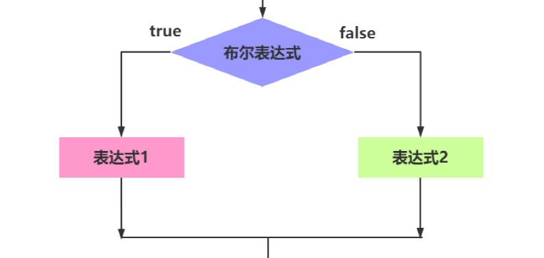

这个三元运算符可以被视为if...else...的简写形式，因此可以用于多种场合。

#### 条件语句

##### if语句

###### 语法规范

```js
if (布尔值) {
  语句;
}
```

需要注意的是，“布尔值”往往由一个条件表达式产生的，必须放在圆括号中。

```js
var m = 3;
if (m === 3) {
  m++;
}
console.log(m); // 4
```

注意，if后面的表达式之中，不要混淆赋值表达式（=）、严格相等运算符（===）和相等运算符（==）。尤其是赋值表达式不具有比较作用。

```js
var x = 1;
var y = 2;
if ((x = y)) {
  console.log(x);
}
```

##### if...else语句

###### 基本结构

if代码块后面，还可以跟一个else代码块，表示不满足条件时，所要执行的代码。

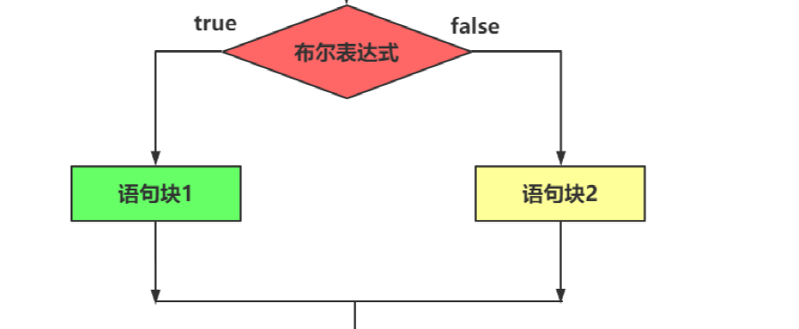

```js
if (m === 3) {
  // 满足条件时，执行的语句
} else {
  // 不满足条件时，执行的语句
}
```

###### 多层连接

对同一个变量进行多次判断时，多个if...else语句可以连写在一起。

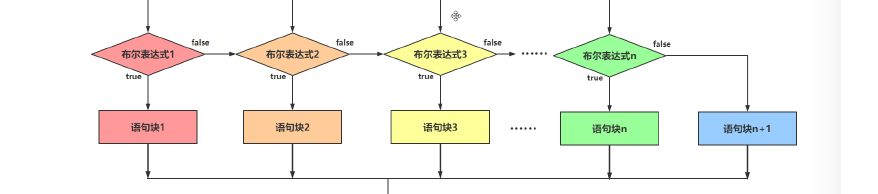

```js
if (m === 0) {
  // ...
} else if (m === 1) {
  // ...
} else if (m === 2) {
  // ...
} else {
  // ...
}
```

###### 嵌套语句

```js
var eat = true;
var food = "猪肉炖粉条";
if (eat) {
  if (food == "双椒鱼头") {
    console.log("双椒鱼头");
  } else {
    console.log("猪肉炖粉条");
  }
} else {
  console.log("不吃了");
}
```

else代码块总是与离自己最近的那个if语句配对。

##### switch语句

多个if...else连在一起使用的时候，可以转为使用更方便的switch结构。

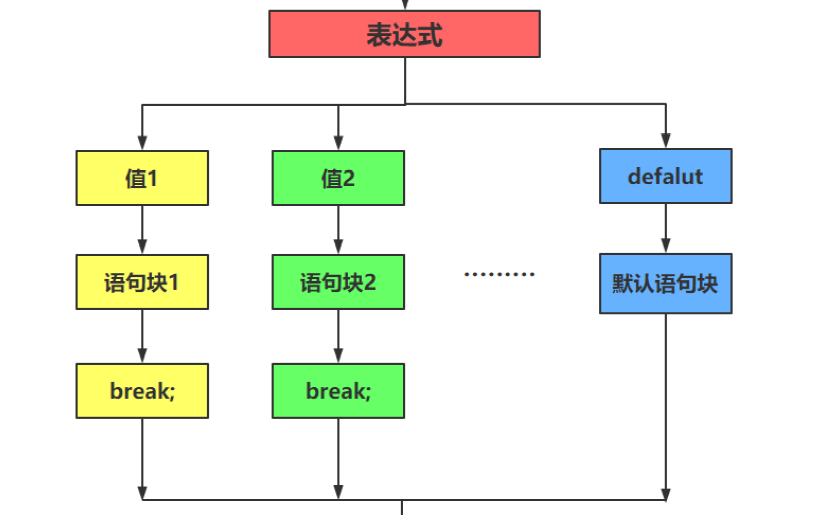

```js
switch (fruit) {
  case "banana":
    // ...
    break;
  case "apple":
    // ...
    break;
  default:
  // ...
}
```

需要注意的是，每个case代码块内部的break语句不能少，否则会接下去执行下一个case代码块，而不是跳出switch结构。

```js
var x = 1;

switch (x) {
  case 1:
    console.log("x 等于1");
  case 2:
    console.log("x 等于2");
  default:
    console.log("x 等于其他值");
}
// x等于1
// x等于2
// x等于其他值
```

##### 案例测试

问题：判断一个整数是奇数与偶数

1）if...else语句

```js
var n = 100;
if (n % 2 === 0) {
  console.log("偶数");
} else {
  console.log("奇数");
}
```

2）三元运算符

```js
var n = 100;
n % 2 === 0 ? "偶数" : "奇数";
```

#### 循环语句

##### for语句

循环语句用于重复执行某个操作，for语句就是循环命令，可以指定循环的起点、终点和终止条件。它的格式如下

```js
for (初始化表达式; 条件; 迭代因子) {
  语句;
}
```

for语句后面的括号里面，有三个表达式。

1. 初始化表达式（initialize）：确定循环变量的初始值，只在循环开始时执行一次。
2. 布尔表达式（test）：每轮循环开始时，都要执行这个条件表达式，只有值为真，才继续进行循环。
3. 迭代因子（increment）：每轮循环的最后一个操作，通常用来递增循环变量。

   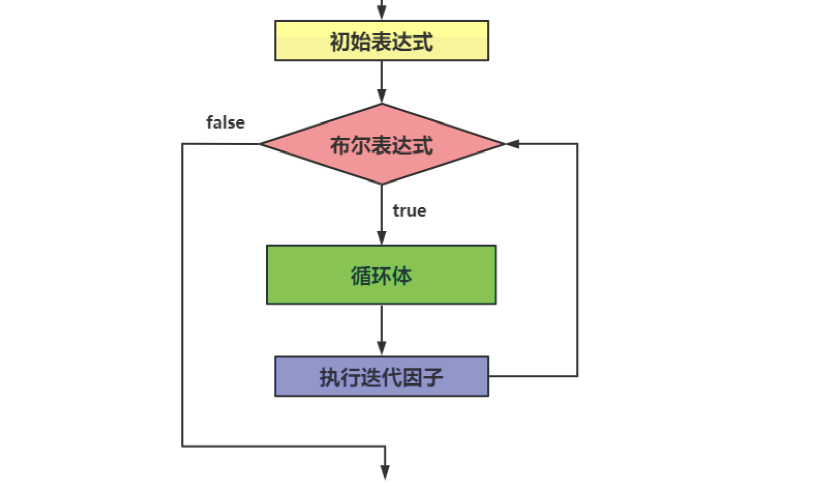


for语句的三个表达式，可以省略任何一个，也可以全部省略。

```js
for (;;) {
  console.log("Hello World");
}
```

> **温馨提示**
>
> 如果三个都省略，结果就导致了一个无限循环（死循环）

##### for案例

循环输出1~100之间数字的和：

```js
var sum = 0;
for (var i = 1; i <= 100; i++) {
  sum += i;
}
console.log(sum);
```

循环输出1000以内的奇数：

```js
for (i = 0; i < 1000; i++) {
  if (i % 2 == 1) {
    console.log(i + " ");
  }
}
```

打印九九乘法表：


```js
for (var i = 1; i <= 9; i++) {
  document.write("<br>");
  for (var j = 1; j <= i; j++) {
    sum = i * j;
    document.write(i, "*", j, "=", sum, " ");
  }
}
```

##### while语句

While语句包括一个循环条件和一段代码块，只要条件为真，就不断循环执行代码块。

```js
while (条件) {
  语句;
}
```

##### while案例

```js
var i = 0;
while (i < 100) {
  console.log("i 当前为：" + i);
  i = i + 1;
}
```

下面的例子是一个无限循环，因为循环条件总是为真

```js
while (true) {
  console.log("Hello, world");
}
```

所有for循环，都可以改写成while循环

```js
// for
var x = 3;
for (var i = 0; i < x; i++) {
  console.log(i);
}

// while
var x = 3;
var i = 0;
while (i < x) {
  console.log(i);
  i++;
}
```

##### 跳转语句

break语句和continue语句都具有跳转作用，可以让代码不按既有的顺序执行

###### break

break语句用于跳出代码块或循环。

```js
for (var i = 0; i < 5; i++) {
  if (i === 3) {
    break;
  }
  console.log(i);
}
```

###### continue

continue语句用于立即终止本轮循环，返回循环结构的头部，开始下一轮循环。

```js
for (var i = 0; i < 5; i++) {
  if (i === 3) {
    continue;
  }
  console.log(i);
}
```

#### 字符串

字符串就是零个或多个排在一起的字符，放在单引号或双引号之中。

```js
"itbaizhan";
"itbaizhan";
```

单引号字符串的内部，可以使用双引号。双引号字符串的内部，可以使用单引号。

```js
'key = "value"';
"It's a long itbaizhan";
```

如果要在单引号字符串的内部，使用单引号，就必须在内部的单引号前面加上反斜杠，用来转义。双引号字符串内部使用双引号，也是如此。

```js
'Did she say \'Hello\'?';
// "Did she say 'Hello'?"

"Did she say \"Hello\"?";
// "Did she say "Hello"?"
```

> **温馨提示**
>
> 字符串默认只能写在一行内，分成多行将会报错

如果长字符串必须分成多行，可以在每一行的尾部使用反斜杠。

```js
var longString =
  "Long \
long \
string";
longString;
// "Long long long string"
```

##### 属性

###### length

length属性返回字符串的长度，该属性也是无法改变的

```js
var s = "itbaizhan";
s.length; // 9
```

##### 方法

###### charAt()

`charAt`方法返回指定位置的字符，参数是从`0`开始编号的

```js
var s = new String("itbaizhan");

s.charAt(1); // "t"
s.charAt(s.length - 1); // "n"
```

如果参数为负数，或大于等于字符串的长度，`charAt`返回空字符串

```js
"itbaizhan".charAt(-1); // ""
"itbaizhan".charAt(9); // ""
```

###### concat()

`concat`方法用于连接两个字符串，返回一个新字符串，不改变原字符串

```js
var s1 = "itbaizhan";
var s2 = "sxt";

s1.concat(s2); // "itbaizhansxt"
s1; // "itbaizhan"
```

该方法可以接受多个参数

```js
"sxt".concat("itbaizhan", "bjsxt"); // "sxtitbaizhanbjsxt"
```

如果参数不是字符串，`concat`方法会将其先转为字符串，然后再连接

```js
var one = 1;
var two = 2;
var three = "3";

"".concat(one, two, three); // "123"
```

###### substring()

`substring`方法用于从原字符串取出子字符串并返回，不改变原字符串。它的第一个参数表示子字符串的开始位置，第二个位置表示结束位置（返回结果不含该位置）

```js
"itbaizhan".substring(0, 2); // "it"
```

如果省略第二个参数，则表示子字符串一直到原字符串的结束

```js
"itbaizhan".substring(2); // "baizhan"
```

如果第一个参数大于第二个参数，`substring`方法会自动更换两个参数的位置

```js
"itbaizhan".substring(9, 2); // "baizhan"
// 等同于
"itbaizhan".substring(2, 9); // "baizhan"
```

如果参数是负数，`substring`方法会自动将负数转为0

```text
'itbaizhan'.substring(-3) // "itbaizhan"
'itbaizhan'.substring(2, -3) // "it"
```

###### substr()

`substr`方法用于从原字符串取出子字符串并返回，不改变原字符串，跟`substring`方法的作用相同

`substr`方法的第一个参数是子字符串的开始位置（从0开始计算），第二个参数是子字符串的长度

```js
"itbaizhan".substr(2, 7); // baizhan
```

如果省略第二个参数，则表示子字符串一直到原字符串的结束

```js
"itbaizhan".substr(2); // "baizhan"
```

如果第一个参数是负数，表示倒数计算的字符位置。如果第二个参数是负数，将被自动转为0，因此会返回空字符串

```js
"itbaizhan".substr(-7); // "baizhan"
"itbaizhan".substr(4, -1); // ""
```

###### indexOf()

`indexOf`方法用于确定一个字符串在另一个字符串中第一次出现的位置，返回结果是匹配开始的位置。如果返回`-1`，就表示不匹配

```js
"hello world".indexOf("o"); // 4
"itbaizhan".indexOf("sxt"); // -1
```

`indexOf`方法还可以接受第二个参数，表示从该位置开始向后匹配

```js
"hello world".indexOf("o", 6); // 7
```

###### trim()

`trim`方法用于去除字符串两端的空格，返回一个新字符串，不改变原字符串

```js
"  hello world  ".trim();
// "hello world"
```

该方法去除的不仅是空格，还包括制表符（`\t`、`\v`）、换行符（`\n`）和回车符（`\r`）

```js
"\r\nitbaizhan \t".trim(); // 'itbaizhan'
```

ES6扩展方法，`trimEnd()`和`trimStart()`方法

```js
"   itbaizhan   ".trimEnd(); //    itbaizhan
"   itbaizhan   ".trimStart(); // itbaizhan
```

###### split()

`split`方法按照给定规则分割字符串，返回一个由分割出来的子字符串组成的数组

```js
"it|sxt|baizhan".split("|"); // ["it", "sxt", "baizhan"]
```

如果分割规则为空字符串，则返回数组的成员是原字符串的每一个字符。

```js
"a|b|c".split(""); // ["a", "|",  "b","|", "c"]
```

如果省略参数，则返回数组的唯一成员就是原字符串

```js
"it|sxt|bz".split(); // [it|sxt|bz]
```

`split`方法还可以接受第二个参数，限定返回数组的最大成员数。

```js
"it|sxt|bz".split("|", 0); // []
"it|sxt|bz".split("|", 1); // ["it"]
"it|sxt|bz".split("|", 2); // ["it", "sxt"]
"it|sxt|bz".split("|", 3); // ["it", "sxt", "bz"]
"it|sxt|bz".split("|", 4); // ["it", "sxt", "bz"]
```

#### 数组

数组（array）是按次序排列的一组值。每个值的位置都有编号（从0开始），整个数组用方括号表示。

```js
var arr = ["sxt", "baizhan", "it"];
```

两端的方括号是数组的标志。`sxt`是0号位置，`baizhan`是1号位置，`it`是2号位置。（位置也被称为下标）

除了在定义时赋值，数组也可以先定义后赋值。

```js
var arr = [];

arr[0] = "sxt";
arr[1] = "baizhan";
arr[2] = "it";
```

任何类型的数据，都可以放入数组

```js
var arr = [100, [1, 2, 3], false];
```

如果数组的元素还是数组，就形成了多维数组

```js
var a = [
  [1, 2],
  [3, 4],
];
a[0][1]; // 2
a[1][1]; // 4
```

##### 属性

###### length

数组的length属性，返回数组的成员数量

```js
["sxt", "baizhan", "it"].length; // 3
```

##### 遍历

1）数组的遍历可以考虑使用for循环或while循环。

```js
var a = ["sxt", "baizhan", "it"];

// for循环
for (var i = 0; i < a.length; i++) {
  console.log(a[i]);
}

// while循环
var i = 0;
while (i < a.length) {
  console.log(a[i]);
  i++;
}
```

2）for...in遍历数组。

```js
var a = ["sxt", "baizhan", "it"];

for (var i in a) {
  console.log(a[i]);
}
```

##### 方法

###### isArray()

`Array.isArray`方法返回一个布尔值，表示参数是否为数组。它可以弥补`typeof`运算符的不足。

```js
var arr = ["尚学堂", 100, true];
console.log(typeof arr); // object
```

```js
var arr = ["sxt", "baizhan", "it"];
Array.isArray(arr); // true
```

###### push()

`push`方法用于在数组的末端添加一个或多个元素，并返回添加新元素后的数组长度。注意，该方法会改变原数组

```js
var arr = [];
arr.push("尚学堂"); // 1
arr.push("itbaizhan"); // 2
arr.push(true, {}); // 4
arr; // [尚学堂, 'itbaizhan', true, {}]
```

###### pop()

`pop`方法用于删除数组的最后一个元素，并返回该元素。注意，该方法会改变原数组

```js
var arr = ["尚学堂", "itbaizhan", "WEB前端"];

arr.pop(); // 'WEB前端'
arr; // ['尚学堂', 'itbaizhan']
```

###### shift()

`shift`方法用于删除数组的第一个元素，并返回该元素。注意，该方法会改变原数组

```js
var arr = ["尚学堂", "itbaizhan", "WEB前端"];

arr.shift(); // '尚学堂'
arr; // ['itbaizhan', 'WEB前端']
```

`shift`方法可以遍历并清空一个数组

```js
var list = [1, 2, 3, 4, 5, 6];
var item;

while ((item = list.shift())) {
  console.log(item);
}

list; // []
```

###### unshift()

`unshift`方法用于在数组的第一个位置添加元素，并返回添加新元素后的数组长度。注意，该方法会改变原数组

```js
var arr = ["尚学堂", "itbaizhan", "WEB前端"];

arr.unshift("baizhan"); // 4
arr; // ['baizhan', '尚学堂', 'itbaizhan', 'WEB前端']
```

`unshift`方法可以接受多个参数，这些参数都会添加到目标数组头部

```js
var arr = ["尚学堂", "itbaizhan"];
arr.unshift("WEB前端", "baizhan"); // 4
arr; // [ 'WEB前端', 'baizhan', '尚学堂', 'itbaizhan' ]
```

###### join()

`join`方法以指定参数作为分隔符，将所有数组成员连接为一个字符串返回。如果不提供参数，默认用逗号分隔

```js
var a = [1, 2, 3, 4];

a.join(" "); // '1 2 3 4'
a.join(" | "); // "1 | 2 | 3 | 4"
a.join(); // "1,2,3,4"
```

如果数组成员是`undefined`或`null`或空位，会被转成空字符串

```js
[undefined, null].join('#')
// '#'

['a',, 'b'].join('-')
// 'a--b'
```

数组的`join`配合字符串的`split`可以实现数组与字符串的互换

```js
var arr = ["a", "b", "c"];
var myArr = arr.join("");
console.log(myArr);
console.log(myArr.split(""));
```

###### concat()

`concat`方法用于多个数组的合并。它将新数组的成员，添加到原数组成员的后部，然后返回一个新数组，原数组不变

```js
["hello"].concat(["world"])[
  // ["hello", "world"]

  "hello"
].concat(["world"], ["!"]);
// ["hello", "world", "!"]
```

除了数组作为参数，`concat`也接受其他类型的值作为参数，添加到目标数组尾部。

```js
[1, 2, 3].concat(4, 5, 6);
// [1, 2, 3, 4, 5, 6]
```

> **应用场景**
>
> 上拉加载，合并数据

###### reverse()

`reverse`方法用于颠倒排列数组元素，返回改变后的数组。注意，该方法将改变原数组

```js
var a = ["a", "b", "c"];

a.reverse(); // ["c", "b", "a"]
a; // ["c", "b", "a"]
```

实现一个字符串反转排列

```js
var str = "hello";
str.split("").reverse().join("");
```

###### indexOf()

`indexOf`方法返回给定元素在数组中第一次出现的位置，如果没有出现则返回`-1`

```js
var arr = ["a", "b", "c"];

arr.indexOf("b"); // 1
arr.indexOf("y"); // -1
```

`indexOf`方法还可以接受第二个参数，表示搜索的开始位置

```js
["尚学堂", "百战程序员", "itbaizhan"].indexOf("尚学堂", 1); // -1
```

#### 函数

##### 基本概念

###### 声明

function 命令： function命令声明的代码区块，就是一个函数。function命令后面是函数名，函数名后面是一对圆括号，里面是传入函数的参数。函数体放在大括号里面。

```js
function print(s) {
  console.log(s);
}
```

###### 提升

JavaScript 引擎将函数名视同变量名，所以采用function命令声明函数时，整个函数会像变量声明一样，被提升到代码头部

```js
add();

function add() {}
```

###### 参数

函数运行的时候，有时需要提供外部数据，不同的外部数据会得到不同的结果，这种外部数据就叫参数

```js
function square(x) {
  console.log(x * x);
}

square(2); // 4
square(3); // 9
```

###### 返回值

JavaScript函数提供两个接口实现与外界的交互，其中参数作为入口，接收外界信息；返回值作为出口，把运算结果反馈给外界

```js
function getName(name) {
  return name;
}

var myName = getName("itbaizhan");
console.log(myName); // itbaizhan
```

> **温馨提示**
>
> `return` 后面不能在添加任何代码，因为不会执行

#### 对象

##### 对象定义

什么是对象？对象（object）是 JavaScript 语言的核心概念，也是最重要的数据类型，简单说，对象就是一组“键值对”（key-value）的集合，是一种无序的复合数据集合。

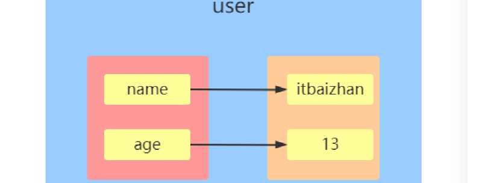

```js
var user = {
  name: "itbaizhan",
  age: "13",
};
```

对象的每一个键名又称为“属性”（property），它的“键值”可以是任何数据类型。如果一个属性的值为函数，通常把这个属性称为“方法”，它可以像函数那样调用

```js
var user = {
  getName: function (name) {
    return name;
  },
};
user.getName("itbaizhan"); // itbaizhan
```

如果属性的值还是一个对象，就形成了链式引用

```js
var user = {
  name: "itbaizhan",
  age: 13,
  container: {
    frontEnd: ["Web前端", "Android", "iOS"],
    backEnd: ["Java", "Python"],
  },
};
user.container.frontEnd; // ["Web前端","Android","iOS"]
```

##### Math对象

Math是 JavaScript 的原生对象，提供各种数学功能。

###### abs()

`Math.abs`方法返回参数值的绝对值

```js
Math.abs(1); // 1
Math.abs(-1); // 1
```

###### max()

`Math.max`方法返回参数之中最大的那个值，如果参数为空, `Math.max`返回`-Infinity`。

```js
Math.max(2, -1, 5); // 5
Math.max(); // -Infinity
```

###### min()

`Math.min`返回最小的那个值，如果参数为空, `Math.min`返回`Infinity`。

```js
Math.min(2, -1, 5); // -1
Math.min(); // Infinity
```

###### floor()

`Math.floor`方法返回小于参数值的最大整数

```js
Math.floor(3.2); // 3
Math.floor(-3.2); // -4
```

###### ceil()

`Math.ceil`方法返回大于参数值的最小整数

```js
Math.ceil(3.2); // 4
Math.ceil(-3.2); // -3
```

###### random()

`Math.random()`返回0到1之间的一个伪随机数，可能等于0，但是一定小于1。

```js
Math.random(); // 0.28525367438365223
```

任意范围的随机数生成函数如下：

```js
function getRandomArbitrary(min, max) {
  return Math.random() * (max - min) + min;
}

getRandomArbitrary(5, 10);
```

##### Date对象

`Date`对象是 JavaScript 原生的时间库。它以1970年1月1日00:00:00作为时间的零点，可以表示的时间范围是前后各1亿天（单位为毫秒）。

###### now()

`Date.now`方法返回当前时间距离时间零点（1970年1月1日 00:00:00 UTC）的毫秒数，相当于 Unix 时间戳乘以1000

```js
Date.now(); // 1635216733395
```

###### 时间戳

时间戳是指格林威治时间1970年01月01日00时00分00秒(北京时间1970年01月01日08时00分00秒)起至现在的总秒数。

格林威治和北京时间就是时区的不同

Unix是20世纪70年代初出现的一个操作系统，Unix认为1970年1月1日0点是时间纪元。JavaScript也就遵循了这一约束

`Date`对象提供了一系列`get*`方法，用来获取实例对象某个方面的值

> **实例方法get类**
>
> getTime()：返回实例距离1970年1月1日00:00:00的毫秒数
> getDate()：返回实例对象对应每个月的几号（从1开始）
> getDay()：返回星期几，星期日为0，星期一为1，以此类推
> getYear()：返回距离1900的年数
> getFullYear()：返回四位的年份
> getMonth()：返回月份（0表示1月，11表示12月）
> getHours()：返回小时（0-23）
> getMilliseconds()：返回毫秒（0-999）
> getMinutes()：返回分钟（0-59）
> getSeconds()：返回秒（0-59）

```js
var d = new Date("January 6, 2022");
d.getDate(); // 6
d.getMonth(); // 0
d.getYear(); // 122
d.getFullYear(); // 2022
```

编写函数获得本年度剩余天数。

```js
function leftDays() {
  var today = new Date();
  var endYear = new Date(today.getFullYear(), 11, 31, 23, 59, 59, 999);
  var msPerDay = 24 * 60 * 60 * 1000;
  return Math.round((endYear.getTime() - today.getTime()) / msPerDay);
}
```

#### 正则表达式

##### 创建方式

###### 实例化创建

语法：var 变量=new RegExp("正则表达式","匹配模式")；

**备注：**此为使用构造函数创建，需要注意，当实例化创建时，其表达式是一个字符串。

```js
/*这个正则表达式用来检测是否含有a*/
var reg = new RegExp("a");
var str = "a";
/*正则表达式的测试方法使用test()，如果符合则返回true，不符合返回false*/
var result = reg.test(str);
/*结果为true*/
console.log(result);
/*结果为true*/
console.log(reg.test("abcd"));
/*结果为false*/
console.log(reg.test("Abcd"));
```

在构造函数中可以传递一个匹配模式作为第二个参数：

- i - 忽略大小写
- g - 全局匹配模式

```js
/*这个正则表达式用来检测是否含有a*/
var reg = new RegExp("a", "i");
var str = "a";
/*结果为false*/
console.log(reg.test("Abcd"));
```

###### 字面量创建

语法：var 变量=/正则表达式/匹配模式

**备注：**[正则表达式]和[匹配模式]都没有添加引号，说明其都不是字符串，直接写表达式即可

```js
/*原来的表达式var reg=new RegExp("a","i")转换为字面量创建的话：*/
var reg = /a/i;
console.log(reg.test("abs"));
```

##### 优缺点

实例化：可以使用字符串变量，更加灵活

字面量：无法使用变量，但是更简单和直接

##### 修饰符

修饰符用于执行不区分大小写和全局的搜索：

|修饰符 |描述 |
|:---|:---|
|[g](jsref_regexp_g.html) |执行全局匹配（查找所有匹配而不是在第一个匹配后停止）。 |
|[i](jsref_regexp_i.html) |执行不区分大小写的匹配。 |
|[d](jsref_regexp_d.html) |执行子字符串匹配。 |
|[m](jsref_regexp_m.html) |执行多行匹配。 |

##### 常用语法

###### 或查询

reg=/a|b/，表示查询字符串中包含a或者b任意一个即可返回true

```js
var reg = /a|b/;
/*全部返回true*/
console.log(reg.test("bcde"));
console.log(reg.test("acde"));
console.log(reg.test("abcde"));
```

当需要查询的或种类极多，且具有连续性，可使用[]符号表示

- reg=/[ab]/相当于reg=/a|b/
- reg=/[af]/相当于reg=/a|b|c|d|e|f/
- reg=/[a-z]/表示任意的**小写字母**匹配即可返回true
- reg=/[A-z]/表示任意的**字母**匹配即可返回true
- reg=/a[bde]c/表示匹配字符串字母a+b/d/e任意一个+c
- reg=/[0-9]/表示匹配0-9任意一个数字

###### 或非查询

在[]中首个字母使用^表示除了后面带的字符段的意思。

- [^ab]表示，除了ab以外
- [^0-9]表示，除了数字以外
- [^A-z]表示，除了字母（大小写）以外

|表达式 |描述 |
|:---|:---|
|[[abc]](jsref_regexp_charset.html) |查找括号之间的任何字符。 |
|[[^abc]](jsref_regexp_charset_not.html) |查找任何不在方括号之间的字符。 |
|[[0-9]](jsref_regexp_0-9.html) |查找任何从 0 至 9 的数字。 |
|[[^0-9]](jsref_regexp_not_0-9.html) |查找任何不在括号内的字符（任何非数字）。 |
|[(x\|y)](jsref_regexp_xy.html) |查找任何指定的选项。 |

###### 量词查询

当需要查询多个相同字符或字符段时，为了简化写法并且方便识别，一般采用以下几种方式实现：

- reg=/a{x}/匹配包含 x 个 a 的序列的字符串，x为自然数
- reg=/a{x,y}/匹配包含 X 至 Y 个a 的序列的字符串，x,y为自然数
- reg=/(ab){x,y}/匹配包含 X 至 Y 个ab 的序列的字符串，x,y为自然数
- reg=/ab{x,y}c/匹配a+包含 X 至 Y 个b+c 的序列的字符串，x,y为自然数

|量词 |描述 |
|:---|:---|
|[n+](jsref_regexp_onemore.html) |匹配任何包含至少一个 n 的字符串。 |
|[n*](jsref_regexp_zeromore.html) |匹配任何包含零个或多个 n 的字符串。 |
|[n?](jsref_regexp_zeroone.html) |匹配任何包含零个或一个 n 的字符串。 |
|[n{X}](jsref_regexp_nx.html) |匹配包含 X 个 n 的序列的字符串。 |
|[n{X,Y}](jsref_regexp_nxy.html) |匹配包含 X 至 Y 个 n 的序列的字符串。 |
|[n{X,}](jsref_regexp_nxcomma.html) |匹配包含至少 X 个 n 的序列的字符串。 |
|[n$](jsref_regexp_ndollar.html) |匹配任何以 n 结尾的字符串。 |
|[^n](jsref_regexp_ncaret.html) |匹配任何以 n 开头的字符串。 |
|[?=n](jsref_regexp_nfollow.html) |匹配任何其后紧接指定字符串 n 的字符串。 |
|[?!n](jsref_regexp_nfollow_not.html) |匹配任何其后没有紧接指定字符串 n 的字符串。 |

###### 开头查询

若想查询以某个字符结尾，通常使用^开头，表示^后一个字符或字符段结尾，通常采用如下几种：

- reg=/^a/匹配以a为开头的字符串
- reg=/^a[0-9][A-z]/匹配以a开头，中间任意数字，之后有任意字母的字符串

###### 结尾查询

若想查询以某个字符结尾，通常使用$结尾，表示$前一个字符或字符段结尾，通常采用如下几种：

- reg=/b$/匹配以b为结尾的字符串
- reg=/^ab$/匹配以a开头，中间没有任何字符段，b结尾的字符串，实际只有ab字符串满足
- reg=/ab$/匹配在某个字符串中，ab结尾的字符串
- reg=/a[0-9]b$/匹配在某个字符串中，a+任意数字+b结尾的字符串

###### 转义查询

若要检查一个字符串是否含有.（表示任意字符），需要使用转义字符“\”来转移，如：

- var reg=/./表示检查字符串中是否有“.”；
- var reg=//表示检查字符串中是否有“\”；

###### 元字符查询

元字符是具有特殊含义的字符：

|元字符 |描述 |
|:---|:---|
|[.](jsref_regexp_dot.html) |查找单个字符，除了换行符或行终止符。 |
|[\w](jsref_regexp_wordchar.html) |查找单词字符。 |
|[\W](jsref_regexp_wordchar_non.html) |查找非单词字符。 |
|[\d](jsref_regexp_digit.html) |查找数字。 |
|[\D](jsref_regexp_digit_non.html) |查找非数字字符。 |
|[\s](jsref_regexp_whitespace.html) |查找空白字符。 |
|[\S](jsref_regexp_whitespace_non.html) |查找非空白字符。 |
|[\b](jsref_regexp_begin.html) |在单词的开头/结尾查找匹配项，开头如下：\bHI，结尾如下：HI\b。 |
|[\B](jsref_regexp_begin_not.html) |查找匹配项，但不在单词的开头/结尾处。 |
|[\0](jsref_regexp_nul.html) |查找 NULL 字符。 |
|\ |查找换行符。 |
|[\f](jsref_regexp_formfeed.html) |查找换页符。 |
|[\r](jsref_regexp_carriagereturn.html) |查找回车符。 |
|[\t](jsref_regexp_tab.html) |查找制表符。 |
|[\v](jsref_regexp_vtab.html) |查找垂直制表符。 |
|[\xxx](jsref_regexp_octal.html) |查找以八进制数 xxx 规定的字符。 |
|[\xdd](jsref_regexp_hex.html) |查找以十六进制数 dd 规定的字符。 |
|[\udddd](jsref_regexp_unicode_hex.html) |查找以十六进制数 xxxx 规定的 Unicode 字符。 |

##### 实例教学

###### 检测手机号

检测输入是否是手机号：

```js
/**创建一个正则表达式，用来检查一个字符串是否是一个合法手机号
 ***手机号规则：
 *** 1）一共有11位
 *** 2）以1开头 -- ^1
 *** 3）第二位3-9任意数字 -- [3-9]
 *** 4)三位以后任意数字9位 -- [0-9]{9}$
 */
var phoneStr = "13567890123";
var phoneReg = /^1[3-9][0-9]{9}$/;
console.log(phoneReg.test(phoneStr));
```

###### 检测电子邮件

检测输入电子邮件是否满足要求。

```js
/**创建一个正则表达式，用来检查输入的电子邮箱是否合法
 ***类似邮箱：hello  .nihao  @abc.com.cn
 *** 1)任意字母数字下划线 -- \w{3,}
 *** 2）.人意思字母数字下划线 -- (\.\w+)*
 *** 3）@ -- @
 *** 4）任意字母数字，没有下划线 -- [A-z0-9]+
 *** 5) .任意字母（2-5位）-- (\.[A-z]{2,5}){1,2}
 *** 6) .任意字母（2-5位）-- 步骤5已添加{1,2}
 ***/
var emailReg = /\w{3,}(\.\w+)*@[A-z0-9]+(\.[A-z]{2,5}){1,2}/;
var email = "abc.def@abc.com";
console.log(emailReg.test(email));
```

#### DOM

##### DOM定义

DOM 是 JavaScript 操作网页的接口，全称为“文档对象模型”（Document Object Model）。它的作用是将网页转为一个 JavaScript 对象，从而可以用脚本进行各种操作（比如对元素增删内容）。

浏览器会根据 DOM 模型，将结构化文档HTML解析成一系列的节点，再由这些节点组成一个树状结构（DOM Tree）。所有的节点和最终的树状结构，都有规范的对外接口。

DOM 只是一个接口规范，可以用各种语言实现。所以严格地说，DOM 不是 JavaScript 语法的一部分，但是 DOM 操作是 JavaScript 最常见的任务，离开了 DOM，JavaScript 就无法控制网页。另一方面，JavaScript 也是最常用于 DOM 操作的语言。

##### DOM节点

DOM 的最小组成单位叫做节点（node）。文档的树形结构（DOM 树），就是由各种不同类型的节点组成。每个节点可以看作是文档树的一片叶子。

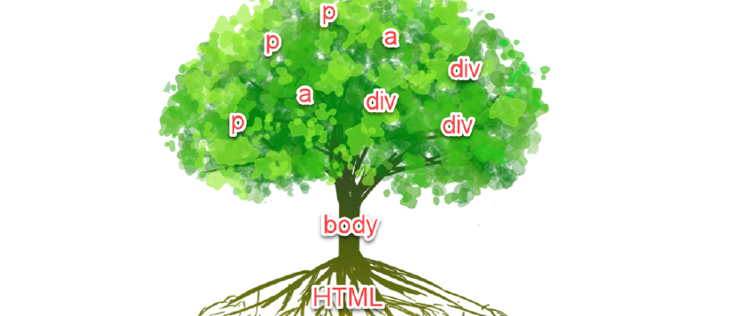

##### 节点树

###### 节点树定义

一个文档的所有节点，按照所在的层级，可以抽象成一种树状结构。这种树状结构就是 DOM 树。它有一个顶层节点，下一层都是顶层节点的子节点，然后子节点又有自己的子节点，就这样层层衍生出一个金字塔结构，倒过来就像一棵树，浏览器原生提供document节点，代表整个文档。

```js
document;
// 整个文档树
```

除了根节点，其他节点都有三种层级关系。

> 父节点关系（parentNode）：直接的那个上级节点
> 子节点关系（childNodes）：直接的下级节点
> 同级节点关系（sibling）：拥有同一个父节点的节点

###### Node.nodeType属性

不同节点的nodeType属性值和对应的常量如下：

> 文档节点（document）：9，对应常量Node.DOCUMENT_NODE
> 元素节点（element）：1，对应常量Node.ELEMENT_NODE
> 属性节点（attr）：2，对应常量Node.ATTRIBUTE_NODE
> 文本节点（text）：3，对应常量Node.TEXT_NODE
> 文档片断节点（DocumentFragment）：11，对应常量Node.DOCUMENT_FRAGMENT_NODE

```js
document.nodeType; // 9
document.nodeType === Node.DOCUMENT_NODE; // true
```

##### document对象

###### document.getElementsByTagName()

`document.getElementsByTagName`方法搜索 HTML 标签名，返回符合条件的元素。它的返回值是一个类似数组对象（`HTMLCollection`实例），可以实时反映 HTML 文档的变化。如果没有任何匹配的元素，就返回一个空集

```js
var paras = document.getElementsByTagName("p");
```

如果传入`*`，就可以返回文档中所有 HTML 元素

```js
var allElements = document.getElementsByTagName("*");
```

###### document.getElementsByClassName()

`document.getElementsByClassName`方法返回一个类似数组的对象（`HTMLCollection`实例），包括了所有`class`名字符合指定条件的元素，元素的变化实时反映在返回结果中

```js
var elements = document.getElementsByClassName(names);
```

由于`class`是保留字，所以 JavaScript 一律使用`className`表示 CSS 的`class`

参数可以是多个`class`，它们之间使用空格分隔

```js
var elements = document.getElementsByClassName("foo bar");
```

###### document.getElementsByName()

`document.getElementsByName`方法用于选择拥有`name`属性的 HTML 元素（比如`<form>`、`<radio>`、``等），返回一个类似数组的的对象（`NodeList`实例），因为`name`属性相同的元素可能不止一个

```js
// 表单为 <form name="itbaizhan"></form>
var forms = document.getElementsByName("itbaizhan");
```

###### document.getElementById()

`document.getElementById`方法返回匹配指定`id`属性的元素节点。如果没有发现匹配的节点，则返回`null`

```js
var elem = document.getElementById("para1");
```

注意，该方法的参数是大小写敏感的。比如，如果某个节点的`id`属性是`main`，那么`document.getElementById('Main')`将返回`null`

###### document.querySelector()

`document.querySelector`方法接受一个 CSS 选择器作为参数，返回匹配该选择器的元素节点。如果有多个节点满足匹配条件，则返回第一个匹配的节点。如果没有发现匹配的节点，则返回`null`

```js
var el1 = document.querySelector(".myclass");
```

###### document.querySelectorAll()

`document.querySelectorAll`方法与`querySelector`用法类似，区别是返回一个`NodeList`对象，包含所有匹配给定选择器的节点

```js
var elementList = document.querySelectorAll(".myclass");
```

###### document.createElement()

`document.createElement`方法用来生成元素节点，并返回该节点

```js
var newDiv = document.createElement("div");
```

###### document.createTextNode()

`document.createTextNode`方法用来生成文本节点（`Text`实例），并返回该节点。它的参数是文本节点的内容

```js
var newDiv = document.createElement("div");
var newContent = document.createTextNode("Hello");
newDiv.appendChild(newContent);
```

###### document.createAttribute()

`document.createAttribute`方法生成一个新的属性节点（`Attr`实例），并返回它

```js
var attribute = document.createAttribute(name);
```

```js
var root = document.getElementById("root");
var it = document.createAttribute("itbaizhan");
it.value = "it";
root.setAttributeNode(it);
```

##### Element对象

Element对象对应网页的 HTML 元素。每一个 HTML 元素，在 DOM 树上都会转化成一个Element节点对象（以下简称元素节点）

###### Element.id

`Element.id`属性返回指定元素的`id`属性，该属性可读写

```js
// HTML 代码为 <p id="foo">
var p = document.querySelector("p");
p.id; // "foo"
```

###### Element.className

`className`属性用来读写当前元素节点的`class`属性。它的值是一个字符串，每个`class`之间用空格分割

```js
// HTML 代码 <div class="one two three" id="myDiv"></div>
var div = document.getElementById("myDiv");
div.className;
```

###### Element.classList

`classList`对象有下列方法

> - `add()`：增加一个 class。
> - `remove()`：移除一个 class。
> - `contains()`：检查当前元素是否包含某个 class。
> - `toggle()`：将某个 class 移入或移出当前元素。

```js
var div = document.getElementById("myDiv");

div.classList.add("myCssClass");
div.classList.add("foo", "bar");
div.classList.remove("myCssClass");
div.classList.toggle("myCssClass"); // 如果 myCssClass 不存在就加入，否则移除
div.classList.contains("myCssClass"); // 返回 true 或者 false
```

###### Element.innerHTML

`Element.innerHTML`属性返回一个字符串，等同于该元素包含的所有 HTML 代码。该属性可读写，常用来设置某个节点的内容。它能改写所有元素节点的内容，包括`<HTML>`和`<body>`元素

```js
el.innerHTML = "";
```

###### Element.innerText

`innerText`和`innerHTML`类似，不同的是`innerText`无法识别元素，会直接渲染成字符串

###### Element获取元素位置

|属性 |描述 |
|:---|:---:|
|clientHeight |获取元素高度包括`padding`部分，但是不包括`border`、`margin` |
|clientWidth |获取元素宽度包括`padding`部分，但是不包括`border`、`margin` |
|scrollHeight |元素总高度，它包括`padding`，但是不包括`border`、`margin`包括溢出的不可见内容 |
|scrollWidth |元素总宽度，它包括`padding`，但是不包括`border`、`margin`包括溢出的不可见内容 |
|scrollLeft |元素的水平滚动条向右滚动的像素数量 |
|scrollTop |元素的垂直滚动条向下滚动的像素数量 |
|offsetHeight |元素的 CSS 垂直高度（单位像素），包括元素本身的高度、padding 和 border |
|offsetWidth |元素的 CSS 水平宽度（单位像素），包括元素本身的高度、padding 和 border |
|offsetLeft |到定位父级左边界的间距 |
|offsetTop |到定位父级上边界的间距 |

- **Element.clientHeight，Element.clientWidth**

`Element.clientHeight`属性返回一个整数值，表示元素节点的 CSS 高度（单位像素），只对块级元素生效，对于行内元素返回`0`。如果块级元素没有设置 CSS 高度，则返回实际高度

除了元素本身的高度，它还包括`padding`部分，但是不包括`border`、`margin`。如果有水平滚动条，还要减去水平滚动条的高度。注意，这个值始终是整数，如果是小数会被四舍五入。

`Element.clientWidth`属性返回元素节点的 CSS 宽度，同样只对块级元素有效，也是只包括元素本身的宽度和`padding`，如果有垂直滚动条，还要减去垂直滚动条的宽度。

`document.documentElement`的`clientHeight`属性，返回当前视口的高度（即浏览器窗口的高度）。`document.body`的高度则是网页的实际高度。

```js
// 视口高度
document.documentElement.clientHeight;

// 网页总高度
document.body.clientHeight;
```

- **Element.scrollHeight，Element.scrollWidth**

`Element.scrollHeight`属性返回一个整数值（小数会四舍五入），表示当前元素的总高度（单位像素），它包括`padding`，但是不包括`border`、`margin`以及水平滚动条的高度（如果有水平滚动条的话）

`Element.scrollWidth`属性表示当前元素的总宽度（单位像素），其他地方都与`scrollHeight`属性类似。这两个属性只读

整张网页的总高度可以从`document.documentElement`或`document.body`上读取

```js
// 返回网页的总高度
document.documentElement.scrollHeight;
document.body.scrollHeight;
```

- **Element.scrollLeft，Element.scrollTop**

`Element.scrollLeft`属性表示当前元素的水平滚动条向右侧滚动的像素数量，`Element.scrollTop`属性表示当前元素的垂直滚动条向下滚动的像素数量。对于那些没有滚动条的网页元素，这两个属性总是等于0

如果要查看整张网页的水平的和垂直的滚动距离，要从`document.documentElement`元素上读取

```js
document.documentElement.scrollLeft;
document.documentElement.scrollTop;
```

- **Element.offsetHeight，Element.offsetWidth**

`Element.offsetHeight`属性返回一个整数，表示元素的 CSS 垂直高度（单位像素），包括元素本身的高度、padding 和 border，以及水平滚动条的高度（如果存在滚动条）。

`Element.offsetWidth`属性表示元素的 CSS 水平宽度（单位像素），其他都与`Element.offsetHeight`一致。

这两个属性都是只读属性，只比`Element.clientHeight`和`Element.clientWidth`多了边框的高度或宽度。如果元素的 CSS 设为不可见（比如`display: none;`），则返回`0`

- **Element.offsetLeft，Element.offsetTop**

`Element.offsetLeft`返回当前元素左上角相对于`Element.offsetParent`节点的水平位移，`Element.offsetTop`返回垂直位移，单位为像素。通常，这两个值是指相对于父节点的位移

```html
<div class="parent">
  <div class="box" id="box"></div>
</div>
```

```css
.parent {
  width: 200px;
  height: 200px;
  background: red;
  position: relative;
  left: 50px;
  top: 50px;
}

.box {
  width: 100px;
  height: 100px;
  background: yellow;
  position: relative;
  left: 50px;
  top: 50px;
}
```

```js
var box = document.getElementById("box");
console.log(box.offsetLeft);
console.log(box.offsetTop);
```

#### CSS操作

##### `HTML` 元素的 `style` 属性

操作 CSS 样式最简单的方法，就是使用网页元素节点的`setAttribute`方法直接操作网页元素的`style`属性

```js
div.setAttribute("style", "background-color:red;" + "border:1px solid black;");
```

##### 元素节点的`style`属性

```js
var divStyle = document.querySelector("div").style;

divStyle.backgroundColor = "red";
divStyle.border = "1px solid black";
divStyle.width = "100px";
divStyle.height = "100px";
divStyle.fontSize = "10em";
```

##### `cssText`属性

```js
var divStyle = document.querySelector("div").style;

divStyle.cssText =
  "background-color: red;" +
  "border: 1px solid black;" +
  "height: 100px;" +
  "width: 100px;";
```

#### 事件处理

事件处理程序分为：

1. HTML事件处理
2. DOM0级事件处理
3. DOM2级事件处理

##### HTML事件

```html
<!DOCTYPE html>
<html>
  <head lang="en">
    <meta charset="UTF-8" />
    <title>Js事件详解--事件处理</title>
  </head>
  <body>
    <div id="div">
      <button id="btn1" onclick="demo()">按钮</button>
    </div>
    <script>
      function demo() {
        alert("hello html事件处理");
      }
    </script>
  </body>
</html>
```

##### DOM0级事件处理

```html
<body>
  <div id="div">
    <button id="btn1">按钮</button>
  </div>
  <script>
    var btn1 = document.getElementById("btn1");
    btn1.onclick = function () {
      alert("Hello DOM0级事件处理程序1");
    }; //被覆盖掉
    btn1.onclick = function () {
      alert("Hello DOM0级事件处理程序2");
    };
  </script>
</body>
```

##### DOM2级事件处理

```html
<body>
  <div id="div">
    <button id="btn1">按钮</button>
  </div>
  <script>
    var btn1 = document.getElementById("btn1");
    btn1.addEventListener("click", demo1);
    btn1.addEventListener("click", demo2);
    btn1.addEventListener("click", demo3);
    function demo1() {
      alert("DOM2级事件处理程序1");
    }
    function demo2() {
      alert("DOM2级事件处理程序2");
    }
    function demo3() {
      alert("DOM2级事件处理程序3");
    }
    btn1.removeEventListener("click", demo2);
  </script>
</body>
```

##### 鼠标事件

鼠标事件指与鼠标相关的事件，具体的事件主要有以下一些

 1. click：按下鼠标时触发
 2. dblclick：在同一个元素上双击鼠标时触发
 3. mousedown：按下鼠标键时触发
 4. mouseup：释放按下的鼠标键时触发
 5. mousemove：当鼠标在节点内部移动时触发。当鼠标持续移动时，该事件会连触发。
 6. mouseenter：鼠标进入一个节点时触发，进入子节点不会触发这个事件
 7. mouseleave：鼠标离开一个节点时触发，离开父节点不会触发这个事件
 8. mouseover：鼠标进入一个节点时触发，进入子节点会再一次触发这个事件
 9. mouseout：鼠标离开一个节点时触发，离开父节点也会触发这个事件
10. wheel：滚动鼠标的滚轮时触发

```js
var btn1 = document.getElementById("btn1");
btn1.onclick = function () {
  console.log("click事件");
};
```

> **温馨提示**
>
> 这些方法在使用的时候，除了DOM2级事件，都需要添加前缀`on`

##### Event事件

事件发生以后，会产生一个事件对象，作为参数传给监听函数。

1. Event.Target
2. Event.type

###### Event.target

Event.target属性返回事件当前所在的节点

```js
// HTML代码为
// <p id="para">Hello</p>
function setColor(e) {
  console.log(this === e.target);
  e.target.style.color = "red";
}

para.addEventListener("click", setColor);
```

###### Event.type

Event.type属性返回一个字符串，表示事件类型。事件的类型是在生成事件的时候。该属性只读。

##### 对象方法

1. Event.preventDefault()
2. Event.stopPropagation()

###### Event.preventDefault

Event.preventDefault方法取消浏览器对当前事件的默认行为。比如点击链接后，浏览器默认会跳转到另一个页面，使用这个方法以后，就不会跳转了

```js
btn.onclick = function (e) {
  e.preventDefault(); // 阻止默认事件
  console.log("点击A标签");
};
```

###### Event.stopPropagation()

stopPropagation方法阻止事件在 DOM 中继续传播，防止再触发定义在别的节点上的监听函数，但是不包括在当前节点上其他的事件监听函数

```js
btn.onclick = function (e) {
  e.stopPropagation(); // 阻止事件冒泡
  console.log("btn");
};
```

##### 键盘事件

键盘事件由用户击打键盘触发，主要有keydown、keypress、keyup三个事件。

1. keydown：按下键盘时触发。
2. keypress：按下有值的键时触发，即按下 Ctrl、Alt、Shift、Meta 这样无值的键，这个事件不会触发。对于有值的键，按下时先触发keydown事件，再触发这个事件。
3. keyup：松开键盘时触发该事件

```js
username.onkeypress = function (e) {
  console.log("keypress事件");
};
```

keyCode:唯一标识

```js
var username = document.getElementById("username");
username.onkeydown = function (e) {
  if (e.keyCode === 13) {
    console.log("回车");
  }
};
```

##### 表单事件

表单事件是在使用表单元素及输入框元素可以监听的一系列事件

1. input事件
2. select事件
3. Change事件
4. reset事件
5. submit事件

###### input事件

input事件当`<input>、<select>、<textarea>`的值发生变化时触发。对于复选框（`<input type=checkbox>`）或单选框（`<input type=radio>`），用户改变选项时，也会触发这个事件

input事件的一个特点，就是会连续触发，比如用户每按下一次按键，就会触发一次input事件。

```js
var username = document.getElementById("username");
username.oninput = function (e) {
  console.log(e.target.value);
};
```

###### select事件

select事件当在`<input>、<textarea>`里面选中文本时触发

```js
// HTML 代码如下
// <input id="test" type="text" value="Select me!" />

var elem = document.getElementById("test");
elem.addEventListener(
  "select",
  function (e) {
    console.log(e.type); // "select"
  },
  false,
);
```

###### Change 事件

Change事件当`<input>、<select>、<textarea>`的值发生变化时触发。它与input事件的最大不同，就是不会连续触发，只有当全部修改完成时才会触发

```js
var email = document.getElementById("email");
email.onchange = function (e) {
  console.log(e.target.value);
};
```

###### reset /submit 事件

这两个事件发生在表单对象`<form>`上，而不是发生在表单的成员上。

reset事件当表单重置（所有表单成员变回默认值）时触发。

submit事件当表单数据向服务器提交时触发。注意，submit事件的发生对象是`<form>`元素，而不是`<button>`元素，因为提交的是表单，而不是按钮

```html
<form id="myForm" onsubmit="submitHandle">
  <button onclick="resetHandle">重置数据</button>
  <button>提交</button>
</form>
```

```js
var myForm = document.getElementById("myForm");
function resetHandle() {
  myForm.reset();
}
function submitHandle() {
  console.log("提交");
}
```

#### 事件代理

由于事件会在冒泡阶段向上传播到父节点，因此可以把子节点的监听函数定义在父节点上，由父节点的监听函数统一处理多个子元素的事件。这种方法叫做事件的代理（delegation）。

```js
var ul = document.querySelector("ul");

ul.addEventListener("click", function (event) {
  if (event.target.tagName.toLowerCase() === "li") {
    // some code
  }
});
```

#### 定时器

##### setTimeout

JavaScript 提供定时执行代码的功能，叫做定时器（timer），主要由`setTimeout()`和`setInterval()`这两个函数来完成。它们向任务队列添加定时任务。`setTimeout`函数用来指定某个函数或某段代码，在多少毫秒之后执行。它返回一个整数，表示定时器的编号，以后可以用来取消这个定时器。

```js
var timerId = setTimeout(func | code, delay);
```

`setTimeout`函数接受两个参数，第一个参数`func|code`是将要推迟执行的函数名或者一段代码，第二个参数`delay`是推迟执行的毫秒数

```js
setTimeout(function () {
  console.log("定时器");
}, 1000);
```

> **温馨提示**
>
> 还有一个需要注意的地方，如果回调函数是对象的方法，那么`setTimeout`使得方法内部的`this`关键字指向全局环境，而不是定义时所在的那个对象。

```js
var name = "sxt";
var user = {
  name: "itbaizhan",
  getName: function () {
    setTimeout(function () {
      console.log(this.name);
    }, 1000);
  },
};
user.getName();
```

解决方案：

```js
var name = "sxt";
var user = {
  name: "itbaizhan",
  getName: function () {
    var that = this;
    setTimeout(function () {
      console.log(that.name);
    }, 1000);
  },
};
user.getName();
```

定时器可以进行取消。

```js
var id = setTimeout(f, 1000);
clearTimeout(id);
```

##### setInterval

`setInterval`函数的用法与`setTimeout`完全一致，区别仅仅在于`setInterval`指定某个任务每隔一段时间就执行一次，也就是无限次的定时执行。

```js
var timer = setInterval(function () {
  console.log(2);
}, 1000);
```

通过setInterval方法实现网页动画。

```html
<!DOCTYPE html>
<html lang="en">
  <head>
    <meta charset="UTF-8" />
    <meta name="viewport" content="width=device-width, initial-scale=1.0" />
    <title>Document</title>
    <style>
      #someDiv {
        width: 100px;
        height: 100px;
        background: red;
      }
    </style>
  </head>
  <body>
    <div id="someDiv"></div>
    <script>
      var div = document.getElementById("someDiv");
      var opacity = 1;
      var fader = setInterval(function () {
        opacity -= 0.05;
        if (opacity > 0) {
          div.style.opacity = opacity;
        } else {
          clearInterval(fader);
        }
      }, 30);
    </script>
  </body>
</html>
```

定时器可以进行取消。

```js
var id = setInterval(f, 1000);
clearInterval(id);
```

#### 防抖

防抖又名debounce，严格算起来应该属于性能优化的知识，但实际上遇到的频率相当高，处理不当或者放任不管就容易引起浏览器卡死。从滚动条监听的例子说起：

```js
function showTop() {
  var scrollTop = document.documentElement.scrollTop;
  console.log("滚动条位置：" + scrollTop);
}
window.onscroll = showTop;
```

在运行的时候会发现存在一个问题：这个函数的默认执行频率，太！高！了！。 高到什么程度呢？以chrome为例，我们可以点击选中一个页面的滚动条，然后点击一次键盘的【向下方向键】，会发现函数执行了8-9次！

然而实际上我们并不需要如此高频的反馈，毕竟浏览器的性能是有限的，不应该浪费在这里，所以接着讨论如何优化这种场景。

基于上述场景，首先提出第一种思路：在第一次触发事件时，不立即执行函数，而是给出一个期限值比如200ms，然后

1. 如果在200ms内没有再次触发滚动事件，那么就执行函数
2. 如果在200ms内再次触发滚动事件，那么当前的计时取消，重新开始计时

效果：如果短时间内大量触发同一事件，只会执行一次函数

实现：既然前面都提到了计时，那实现的关键就在于setTimeout这个函数，由于还需要一个变量来保存计时，考虑维护全局纯净，可以借助闭包来实现

```js
function debounce(fn, delay) {
  let timer = null; //借助闭包
  return function () {
    if (timer) {
      clearTimeout(timer);
    }
    timer = setTimeout(fn, delay); // 简化写法
  };
}
// 然后是旧代码
function showTop() {
  var scrollTop = document.documentElement.scrollTop;
  console.log("滚动条位置：" + scrollTop);
}
window.onscroll = debounce(showTop, 300);
```

到这里，已经把防抖实现了。

> **防抖定义**
>
> 对于短时间内连续触发的事件（上面的滚动事件），防抖的含义就是让某个时间期限（如上面的1000毫秒）内，事件处理函数只执行一次

#### 节流

节流又名throttle，严格算起来应该属于性能优化的知识，但实际上遇到的频率相当高，处理不当或者放任不管就容易引起浏览器卡死

继续思考，使用上面的防抖方案来处理问题的结果是

如果在限定时间段内，不断触发滚动事件（比如某个用户闲着无聊，按住滚动不断的拖来拖去），只要不停止触发，理论上就永远不会输出当前距离顶部的距离

但是如果产品同学的期望处理方案是：即使用户不断拖动滚动条，也能在某个时间间隔之后给出反馈呢？

其实很简单：我们可以设计一种类似控制阀门一样定期开放的函数，也就是让函数执行一次后，在某个时间段内暂时失效，过了这段时间后再重新激活（类似于技能冷却时间）

效果：如果短时间内大量触发同一事件，那么在函数执行一次之后，该函数在指定的时间期限内不再工作，直至过了这段时间才重新生效

**实现**

这里借助setTimeout来做一个简单的实现，加上一个状态位valid来表示当前函数是否处于工作状态

```js
function throttle(fn, delay) {
  let valid = true;
  return function () {
    if (!valid) {
      //休息时间 暂不接客
      return false;
    }
    // 工作时间，执行函数并且在间隔期内把状态位设为无效
    valid = false;
    setTimeout(function () {
      fn();
      valid = true;
    }, delay);
  };
}

function showTop() {
  var scrollTop = document.documentElement.scrollTop;
  console.log("滚动条位置：" + scrollTop);
}
window.onscroll = throttle(showTop, 300);
```

如果一直拖着滚动条进行滚动，那么会以300ms的时间间隔，持续输出当前位置和顶部的距离

讲完了这两个技巧，下面介绍一下平时开发中常遇到的场景:

1. 搜索框input事件，例如要支持输入实时搜索可以使用节流方案（间隔一段时间就必须查询相关内容），或者实现输入间隔大于某个值（如500ms），就当做用户输入完成，然后开始搜索，具体使用哪种方案要看业务需求
2. 页面resize事件，常见于需要做页面适配的时候。需要根据最终呈现的页面情况进行dom渲染（这种情形一般是使用防抖，因为只需要判断最后一次的变化情况）。

## ES6-16

### ES6-2015

#### 变量命令

`ES6 `新增了`let`命令，用来声明变量。它的用法类似于`var`，但是所声明的变量，只在`let`命令所在的代码块内有效。

##### 作用域

```js
{
  let itbaizhan = 10;
  var sxt = 1;
}

itbaizhan; // ReferenceError: itbaizhan is not defined.
sxt; // 1
```

`for`循环的计数器，就很合适使用`let`命令

```js
for (let i = 0; i < 10; i++) {
  // ...
}

console.log(i);
// ReferenceError: i is not defined
```

对比`var`和`let`在循环中的应用

```js
var a = [];
for (var i = 0; i < 10; i++) {
  a[i] = function () {
    console.log(i);
  };
}
a[6](); // 10
```

上面代码，输出的`10`,而我们期待的是`6`

```js
var a = [];
for (let i = 0; i < 10; i++) {
  a[i] = function () {
    console.log(i);
  };
}
a[6](); // 6
```

上面代码，输出的`6`

##### 变量提升

`var`命令会发生“变量提升”现象，即变量可以在声明之前使用，值为`undefined`。这种现象多多少少是有些奇怪的，按照一般的逻辑，变量应该在声明语句之后才可以使用

为了纠正这种现象，`let`命令改变了语法行为，它所声明的变量一定要在声明后使用，否则报错。

```js
// var 的情况
console.log(foo); // 输出undefined
var foo = 2;

// let 的情况
console.log(bar); // 报错ReferenceError
let bar = 2;
```

##### 重复声明

`let`不允许在相同作用域内，重复声明同一个变量。

```js
// 报错
function func() {
  let a = 10;
  var a = 1;
}

// 报错
function func() {
  let a = 10;
  let a = 1;
}
```

#### 常量命令

`const`声明一个只读的常量。一旦声明，常量的值就不能改变

```js
const PI = 3.1415;
PI; // 3.1415

PI = 3;
// TypeError: Assignment to constant variable.
```

`const`声明的变量不得改变值，这意味着，`const`一旦声明变量，就必须立即初始化，不能留到以后赋值

```js
const foo;
// SyntaxError: Missing initializer in const declaration
```

`const`的作用域与let命令相同：只在声明所在的块级作用域内有效

```js
if (true) {
  const MAX = 5;
}

MAX; // Uncaught ReferenceError: MAX is not defined
```

`const`命令声明的常量也是不存在提升

```js
if (true) {
  console.log(MAX); // ReferenceError
  const MAX = 5;
}
```

`const`声明的常量，也与`let`一样不可重复声明

```js
var message = "Hello!";
let age = 25;

// 以下两行都会报错
const message = "Goodbye!";
const age = 30;
```

#### 解构赋值

解构可以用于对象：

```js
let { name, age } = { name: "iwen", age: 20 };
```

> **温馨提示**
>
> 对象的属性没有次序，变量必须与属性同名，才能取到正确的值

```js
let { age, name } = { name: "iwen", age: 20 };
age; // 20
```

```js
let { sex, age, name } = { name: "iwen", age: 20 };
sex; // undefined
```

对象的解构赋值，可以很方便地将现有对象的方法，赋值到某个变量

```js
let { random, floor } = Math;
let { log } = console;
```

注意事项，如果要将一个已经声明的变量用于解构赋值，必须非常小心

```js
let hello = "Hello";
let { hello } = { hello: "hello" }; // 报错

let hello = "Hello";
({ hello } = { hello: "hello" }); // 正确
```

#### 模板字符串

ES6 加强了对 Unicode 的支持，允许采用`\uxxxx`形式表示一个字符，其中`xxxx`表示字符的 Unicode 码点。

##### Unicode

统一码（Unicode），也叫万国码、单一码，是计算机科学领域里的一项业界标准，包括字符集、编码方案等。Unicode是为了解决传统的字符编码方案的局限而产生的，它为每种语言中的每个字符设定了统一并且唯一的二进制编码，以满足跨语言、跨平台进行文本转换、处理的要求。

```js
"\u0061";
// "a"
```

##### 遍历器

`for...of`循环遍历

```js
for (let i of "itbaizhan") {
  console.log(i);
}
```

##### 模板字符串

模板字符串（template string）是增强版的字符串，用反引号（`）标识。它可以当作普通字符串使用，也可以用来定义多行字符串，或者在字符串中嵌入变量。

```js
let url = "www.itbaizhan.com";
let h1 = "<a href='" + url + "'>itbaizhan</a>";
let h2 = `<a href='${url}'>itbaizhan</a>`;
```

#### 数组扩展

##### 扩展运算符

扩展运算符（spread）是三个点（`...`）。将一个数组转为用逗号分隔的参数序列。

```js
console.log(...[1, 2, 3]);
// 1 2 3

console.log(1, ...[2, 3, 4], 5);
// 1 2 3 4 5
```

由于扩展运算符可以展开数组，所以不再需要`apply`方法，将数组转为函数的参数了

```js
// ES5 的写法
Math.max.apply(null, [14, 3, 77]);

// ES6 的写法
Math.max(...[14, 3, 77]);

// 等同于
Math.max(14, 3, 77);
```

##### 合并数组

扩展运算符提供了数组合并的新写法。

```js
const arr1 = ["a", "b"];
const arr2 = ["c"];
const arr3 = ["d", "e"];

// ES5 的合并数组
arr1.concat(arr2, arr3);
// [ 'a', 'b', 'c', 'd', 'e' ]

// ES6 的合并数组
[...arr1, ...arr2, ...arr3];
// [ 'a', 'b', 'c', 'd', 'e' ]
```

##### 数组转换

`Array.from`方法用于将类数组转为真正的数组

> **温馨提示**
>
> 常见的类数组有三类：
>
> 1. arguments
> 2. 元素集合
> 3. 类似数组的对象

###### arguments

```js
function add() {
  let collect = Array.from(arguments);
  collect.push(40);
  console.log(collect);
}
add(10, 20, 30);
```

###### 元素集合

```js
let divs = document.querySelectorAll("div");
console.log(Array.from(divs));
```

###### 类数组对象

```js
let arrayLike = {
  0: "a",
  1: "b",
  2: "c",
  length: 3,
};
let arr = Array.from(arrayLike);
console.log(arr);
```

##### 值转数组

`Array.of()`方法用于将一组值，转换为数组

```js
Array.of(3, 11, 8); // [3,11,8]
```

#### 字符串复制

`repeat`方法返回一个新字符串，表示将原字符串重复`n`次。

```js
"x".repeat(3); // "xxx"
"hello".repeat(2); // "hellohello"
"na".repeat(0); // ""
```

#### 对象扩展

##### 简洁表示

ES6 允许在大括号里面，直接写入变量和函数，作为对象的属性和方法。这样的书写更加简洁。

```js
let name = "iwen";
const user = {
  name,
  age: 20,
};
```

除了属性简写，方法也可以简写

```js
const o = {
  method() {
    return "Hello!";
  },
};

// 等同于

const o = {
  method: function () {
    return "Hello!";
  },
};
```

这种写法用于函数的返回值，将会非常方便

```js
function getPoint() {
  const x = 1;
  const y = 10;
  return { x, y };
}

getPoint(); // {x:1, y:10}
```

##### 属名表达

ES6 允许字面量定义对象时，用表达式作为对象的属性名，即把表达式放在方括号内

```js
let propKey = "itbaizhan";

let obj = {
  [propKey]: true,
  ["a" + "bc"]: 123,
};
```

##### 扩展运算

ES2018 将这个运算符引入了对象

```js
let z = { a: 3, b: 4 };
let n = { ...z };
console.log(n);

{...{}, a: 1}
// { a: 1 }
```

#### 箭头函数

##### 基本用法

ES6 允许使用“箭头”（`=>`）定义函数

```js
var add = (x) => x;

// 等同于
var add = function (x) {
  return x;
};
```

如果箭头函数不需要参数或需要多个参数，就使用一个圆括号代表参数部分

```js
var add = (x, y) => x + y;
// 等同于
var add = function (x, y) {
  return x + y;
};

var add = () => 100;
// 等同于
var add = function () {
  return 100;
};
```

如果箭头函数的代码块部分多于一条语句，就要使用大括号将它们括起来，并且使用`return`语句返回

```js
var add = (x, y) => {
  var z = 10;
  return x + y + z;
};

// 等同于
var add = function (x, y) {
  var z = 100;
  return x + y + z;
};
```

由于大括号被解释为代码块，所以如果箭头函数直接返回一个对象，必须在对象外面加上括号，否则会报错。

```js
var add = (x, y) => ({ x: 10, y: 20 });
```

箭头函数的一个用处是简化回调函数（匿名函数）

```js
var arr = [10, 20, 30];
arr.map((item) => {
  console.log(item);
});
```

##### 注意事项

对于普通函数来说，内部的`this`指向函数运行时所在的对象，但是这一点对箭头函数不成立。它没有自己的`this`对象，内部的`this`就是定义时上层作用域中的`this`

```js
var name = "itbaizhan";
var user = {
  name: "iwen",
  getName() {
    setTimeout(() => {
      console.log(this.name); // iwen
    });
  },
};
user.getName();
```

> **温馨提示**
>
> * this 是静态的. this 始终指向函数声明时所在作用域下的 this 的值
>
> * 不能作为构造实例化对象
> * 不能使用 arguments 变量

#### 默认参数

ES6 允许给函数参数赋值初始值。

##### 形参靠后

形参初始值 具有默认值的参数, 一般位置要靠后(潜规则)：

```js
function add(a, c = 10, b) {
  return a + b + c;
}
let result = add(1, 2);
console.log(result);
```

##### 解构赋值

可以与解构赋值结合使用：

```
function connect({ host = "127.0.0.1", username, password, port }) {
  console.log(host);
  console.log(username);
  console.log(password);
  console.log(port);
}
connect({
  host: "atguigu.com",
  username: "root",
  password: "root",
  port: 3306,
});

```

##### rest参数

 ES6 引入 rest 参数，用于获取函数的实参，用来代替 arguments。

* ES5 获取实参

```js
function date() {
  console.log(arguments);
}

date("白芷", "阿娇", "思慧");
```

*  ES6 rest 参数

```js
function date(...args) {
  console.log(args); // filter some every map
}

date("阿娇", "柏芝", "思慧");

//rest 参数必须要放到参数最后
function fn(a, b, ...args) {
  console.log(a);
  console.log(b);
  console.log(args);
}

fn(1, 2, 3, 4, 5, 6);
```

#### Set/Map

##### Set集合

###### 基本概念

ES6 提供了新的数据结构 Set。它类似于数组，但是成员的值都是唯一的，没有重复的值。

`Set`本身是一个构造函数，用来生成 Set 数据结构。本身实现了iterator接口，可使用扩展运算符和【for...of...】进行遍历。

```js
const s = new Set();

[2, 3, 5, 4, 5, 2, 2].forEach((x) => s.add(x));

for (let i of s) {
  console.log(i);
}
// 2 3 5 4
```

> 可以自动去重

通过`add()`方法向 Set 结构加入成员，结果表明 Set 结构不会添加重复的值。

`Set`函数可以接受一个数组作为参数

```js
const set = new Set([1, 2, 3, 4, 4]);
[...set];
// [1, 2, 3, 4]
```

数组去除重复成员的方法

```js
// 去除数组的重复成员
[...new Set(array)];
```

字符串去除重复字符

```js
[...new Set("ababbc")].join("");
// "abc"
```

向 Set 加入值的时候，不会发生类型转换，所以`5`和`"5"`是两个不同的值。

```js
var mySet = new Set();
mySet.add("5");
mySet.add(5);
console.log(mySet); // Set(2) {'5', 5}
```

###### 基本方法

```js
const numberSet = new Set();
```

* 获取大小

返回`Set`实例的成员总数：

```js
const numberSet = new Set([1, 2, 3, 4, 5, 5, 5, 5]);
numberSet.size; // 5
```

* 添加数据

`set` 添加方法

```js
// 添加数据
numberSet.add(1);
numberSet.add(2);
numberSet.add(3);
numberSet.add(2); // 重复，不会添加
```

* 删除数据

删除某个值，返回一个布尔值，表示删除是否

```js
// 删除数据
numberSet.delete(2);
console.log(numberSet.has(2)); // false
console.log(numberSet.size); // 2
```

* 查询数据

返回一个布尔值，表示该值是否为`Set`的成员

```js
// 检查是否存在
console.log(numberSet.has(2)); // true
console.log(numberSet.has(4)); // false
```

* 清除数据

清除所有成员，没有返回值

```js
// 清空
numberSet.clear();
console.log(numberSet.size); // 0
```

##### Map集合

###### 基本概念

`Map` 是 ES6 引入的一种新的数据结构，用于存储键值对。它比传统的对象（Object）更强大、更灵活。

###### 基本使用

```js
// 方式1：使用构造函数
const map = new Map();

// 方式2：使用数组初始化
const map2 = new Map([
  ['name', '张三'],
  ['age', 25],
  ['city', '北京']
]);

// 方式3：使用对象键
const objKey = { id: 1 };
const map3 = new Map();
map3.set(objKey, '对象作为键');
```

###### 基本方法

```js
const userMap = new Map();
```

* 获取大小

```js
// 获取大小
console.log(userMap.size); // 2
```

* 添加数据

```js
// 添加数据
userMap.set('name', '张三');
userMap.set('age', 25);
userMap.set('isStudent', false);
```

* 获取数据

```js
// 获取数据
console.log(userMap.get('name')); // '张三'
console.log(userMap.get('age'));  // 25
```

* 查询数据

```js
// 检查是否存在
console.log(userMap.has('email')); // false
```

* 更新数据

```js
// 更新数据
userMap.set('age', 26);
console.log(userMap.get('age')); // 26
```

* 删除数据

```js
// 删除数据
userMap.delete('isStudent');
console.log(userMap.has('isStudent')); // false
```

* 清空数据

```js
// 清空
userMap.clear();
console.log(userMap.size); // 0
```

#### Symbol

##### 基本使用

Symbol是一种新的数据类型，不能与其他数据进行运算，生成的额是独一无二的。

```js
//创建Symbol
let s = Symbol();
// console.log(s, typeof s);
let s2 = Symbol("尚硅谷");
let s3 = Symbol("尚硅谷");
//Symbol.for 创建
let s4 = Symbol.for("尚硅谷");
let s5 = Symbol.for("尚硅谷");
```

> 注意：不能与其他数据进行运算：
>
> ```js
> //都是错误的
> let result = s + 100;
> let result = s > 100;
> let result = s + s;
> ```

##### 对象属性

```js
//向对象中添加方法 up down
let game = {
  name: "俄罗斯方块",
  up: function () {},
  down: function () {},
};

//声明一个对象
let methods = {
  up: Symbol(),
  down: Symbol(),
};

game[methods.up] = function () {
  console.log("我可以改变形状");
};

game[methods.down] = function () {
  console.log("我可以快速下降!!");
};
console.log(game);

let youxi = {
  name: "狼人杀",
  [Symbol("say")]: function () {
    console.log("我可以发言");
  },
  [Symbol("zibao")]: function () {
    console.log("我可以自爆");
  },
};
console.log(youxi);

```

##### 内置属性

```js
class Person {
  static [Symbol.hasInstance](param) {
    console.log(param);
    console.log("我被用来检测类型了");
    return false;
  }
}
let o = {};
console.log(o instanceof Person);
const arr = [1, 2, 3];
const arr2 = [4, 5, 6];
arr2[Symbol.isConcatSpreadable] = false;
console.log(arr.concat(arr2));
```

#### 生成器

##### 迭代器

###### 声明使用

```js
//声明一个数组
const xiyou = ["唐僧", "孙悟空", "猪八戒", "沙僧"];

//使用 for...of 遍历数组
for (let v of xiyou) {
  console.log(v);
}
let iterator = xiyou[Symbol.iterator]();

//调用对象的next方法
console.log(iterator.next());
console.log(iterator.next());
console.log(iterator.next());
console.log(iterator.next());
console.log(iterator.next());
```

###### 自定义遍历

```js
const banji = {
  name: "终极一班",
  stus: ["xiaoming", "xiaoning", "xiaotian", "knight"],
  [Symbol.iterator]() {
    //索引变量
    let index = 0;
    let _this = this;
    return {
      next: function () {
        if (index < _this.stus.length) {
          const result = { value: _this.stus[index], done: false };
          //下标自增
          index++;
          //返回结果
          return result;
        } else {
          return { value: undefined, done: true };
        }
      },
    };
  },
};

//遍历这个对象
for (let v of banji) {
  console.log(v);
}
```

##### 函数定义

生成器其实就是一个特殊的函数，实现异步工作。

```js
function* gen() {
  // console.log(111);
  yield "一只没有耳朵";
  // console.log(222);
  yield "一只没有尾部";
  // console.log(333);
  yield "真奇怪";
  // console.log(444);
}
let iterator = gen();
console.log(iterator.next());
console.log(iterator.next());
console.log(iterator.next());
console.log(iterator.next());
```

##### 函数参数

```js
function* gen(arg) {
  console.log(arg);
  let one = yield 111;
  console.log(one);
  let two = yield 222;
  console.log(two);
  let three = yield 333;
  console.log(three);
}

//执行获取迭代器对象
let iterator = gen("AAA");
console.log(iterator.next());

//next方法可以传入实参
console.log(iterator.next("BBB"));
console.log(iterator.next("CCC"));
console.log(iterator.next("DDD"));
```

##### 函数实例

* 项目需求：1s 后控制台输出 111  2s后输出 222  3s后输出 333

```js
//使用回调地狱
{
  setTimeout(() => {
    console.log(111);
    setTimeout(() => {
      console.log(222);
      setTimeout(() => {
        console.log(333);
      }, 3000);
    }, 2000);
  }, 1000);
}

//使用生成器函数
{
  function one() {
    setTimeout(() => {
      console.log(111);
      iterator.next();
    }, 1000);
  }
  function two() {
    setTimeout(() => {
      console.log(222);
      iterator.next();
    }, 2000);
  }
  function three() {
    setTimeout(() => {
      console.log(333);
      iterator.next();
    }, 3000);
  }
  function* gen() {
    yield one();
    yield two();
    yield three();
  }
  let iterator = gen();
  iterator.next();
}

```

* 项目需求：模拟获取  用户数据  订单数据  商品数据

```js
function getUsers() {
  setTimeout(() => {
    let data = "用户数据";

    //调用 next 方法, 并且将数据传入

    iterator.next(data);
  }, 1000);
}
function getOrders() {
  setTimeout(() => {
    let data = "订单数据";

    iterator.next(data);
  }, 1000);
}
function getGoods() {
  setTimeout(() => {
    let data = "商品数据";

    iterator.next(data);
  }, 1000);
}
function* gen() {
  let users = yield getUsers();
    console.log(users);
  let orders = yield getOrders();
    console.log(orders);
  let goods = yield getGoods();
    console.log(goods);
}
//调用生成器函数
let iterator = gen();
iterator.next();

```

#### Promise

##### 基本概念

Promise 是异步编程的一种解决方案，比传统的解决方案——回调函数和事件——更合理和更强大。它由社区最早提出和实现，ES6 将其写进了语言标准，统一了用法，原生提供了`Promise`对象。

所谓`Promise`，简单说就是一个容器，里面保存着某个未来才会结束的事件（通常是一个异步操作）的结果。从语法上说，Promise 是一个对象，从它可以获取异步操作的消息。Promise 提供统一的 API，各种异步操作都可以用同样的方法进行处理。

有了`Promise`对象，就可以将异步操作以同步操作的流程表达出来，避免了层层嵌套的回调函数。此外，`Promise`对象提供统一的接口，使得控制异步操作更加容易。

##### 基本用法

ES6 规定，`Promise`对象是一个构造函数，用来生成`Promise`实例

```js
const promise = new Promise(function(resolve, reject) {
  // ... some code

  if (/* 异步操作成功 */){
    resolve(value);
  } else {
    reject(error);
  }
});
```

```js
//实例化 Promise 对象
const p = new Promise(function (resolve, reject) {
    //实际生产中，如果成功，调用resolve；如果失败，调用reject
  setTimeout(function () {
    let data = "数据库中的用户数据";
    resolve;
    resolve(data);
    let err = "数据读取失败";
    reject(err);
  }, 1000);
});

//调用 promise 对象的 then 方法，如果resolve触发，执行value对应函数；如果reject触发，执行reason对应函数
p.then(
  function (value) {
    console.log(value);
  },
  function (reason) {
    console.error(reason);
  },
);

```

`Promise`构造函数接受一个函数作为参数，该函数的两个参数分别是`resolve`和`reject`。它们是两个函数，由 JavaScript 引擎提供，不用自己部署

`Promise`实例生成以后，可以用`then`方法分别指定`resolved`状态和`rejected`状态的回调函数。

```js
promise.then(
  function (value) {
    // success
  },
  function (error) {
    // failure
  },
);
```

##### 基本方法

###### then方法

```js
//创建 promise 对象
const p = new Promise((resolve, reject) => {
  setTimeout(() => {
    resolve("用户数据");
    // reject('出错啦');
  }, 1000);
});
//调用 then 方法  then方法的返回结果是 Promise 对象, 对象状态由回调函数的执行结果决定
//1. 如果回调函数中返回的结果是 非 promise 类型的属性（通过return实现，若不通过return返回，则是undifined，也是成功）, 状态为成功, 返回值为对象的成功的值
const result = p.then(
  (value) => {
    console.log(value);
    //1. 非 promise 类型的属性
    return "iloveyou";
    //2. 是 promise 对象，则返回值就是result的值
    return new Promise((resolve, reject) => {
      resolve("ok");
	  //或reject
      // reject("error");
    });

    //3. 抛出错误
    throw new Error("出错啦!");
    throw "出错啦!";
  },
  (reason) => {
    console.warn(reason);
  },
);
//链式调用
p.then((value) => {}).then((value) => {});
```

###### catch方法

```js
const p = new Promise((resolve, reject) => {
  setTimeout(() => {
    //设置 p 对象的状态为失败, 并设置失败的值
    reject("出错啦!");
  }, 1000);
});
p.then(
  function (value) {},
  function (reason) {
    console.error(reason);
  },
);
p.catch(function (reason) {
  console.warn(reason);
});
```

##### 封装案例

###### 读取文件

使用Promise封装读取文件

```js
//1. 引入 fs 模块
const fs = require("fs");

//2. 调用方法读取文件
fs.readFile("./resources/为学.md", (err, data) => {
  //如果失败, 则抛出错误
  if (err) throw err;
  //如果没有出错, 则输出内容
  console.log(data.toString());
});

//3. 使用 Promise 封装
const p = new Promise(function (resolve, reject) {
  fs.readFile("./resources/为学.mda", (err, data) => {
    //判断如果失败
    if (err) reject(err);
    //如果成功
    resolve(data);
  });
});

p.then(
  function (value) {
    console.log(value.toString());
  },
  function (reason) {
    console.log("读取失败!!");
  },
);

```

###### 封装AJAX

使用promise封装AJAX

```js
// 接口地址: https://api.apiopen.top/getJoke
const p = new Promise((resolve, reject) => {
  //1. 创建对象
  const xhr = new XMLHttpRequest();
  //2. 初始化
  xhr.open("GET", "https://api.apiopen.top/getJoke");
  //3. 发送
  xhr.send();
  //4. 绑定事件, 处理响应结果
  xhr.onreadystatechange = function () {
    //判断
    if (xhr.readyState === 4) {
      //判断响应状态码 200-299
      if (xhr.status >= 200 && xhr.status < 300) {
        //表示成功
        resolve(xhr.response);
      } else {
        //如果失败
        reject(xhr.status);
      }
    }
  };
});

//指定回调
p.then(
  function (value) {
    console.log(value);
  },
  function (reason) {
    console.error(reason);
  },
);

```

###### 图片加载

```html
<!DOCTYPE html>
<html lang="en">
  <head>
    <meta charset="UTF-8" />
    <meta http-equiv="X-UA-Compatible" content="IE=edge" />
    <meta name="viewport" content="width=device-width, initial-scale=1.0" />
    <title>Document</title>
  </head>
  <body>
    <div></div>
    <script>
      function loadImageAsync(url) {
        var promise = new Promise(function (resolve, reject) {
          const image = new Image();
          image.onload = function () {
            resolve(image);
          };
          image.onerror = function () {
            reject(new Error("Could not load image at " + url));
          };
          image.src = url;
        });
        return promise;
      }
      loadImageAsync("http://iwenwiki.com/api/vue-data/vue-data-1.png").then(
        function (data) {
          console.log(data);
          $("div").append(data);
        },
        function (error) {
          $("div").html(error);
        },
      );
    </script>
  </body>
</html>
```

###### 读多文件

封装Promise读取多个文件：

```js
//引入 fs 模块
const fs = require("fs");
fs.readFile("./resources/为学.md", (err, data1) => {
  fs.readFile("./resources/插秧诗.md", (err, data2) => {
    fs.readFile("./resources/观书有感.md", (err, data3) => {
      let result = data1 + "\r\n" + data2 + "\r\n" + data3;
      console.log(result);
    });
  });
});

//使用 promise 实现
const p = new Promise((resolve, reject) => {
  fs.readFile("./resources/为学.md", (err, data) => {
    resolve(data);
  });
});
p.then((value) => {
  return new Promise((resolve, reject) => {
    fs.readFile("./resources/插秧诗.md", (err, data) => {
      resolve([value, data]);
    });
  });
})
  .then((value) => {
    return new Promise((resolve, reject) => {
      fs.readFile("./resources/观书有感.md", (err, data) => {
        //压入
        value.push(data);
        resolve(value);
      });
    });
  })
  .then((value) => {
    console.log(value.join("\r\n"));
  });
```

#### Class 类

##### 基本概念

###### 类的由来

JavaScript 语言中，生成实例对象的传统方法是通过构造函数。

```js
function Point(x, y) {
  this.x = x;
  this.y = y;
}

Point.prototype.toString = function () {
  return "(" + this.x + ", " + this.y + ")";
};

var p = new Point(1, 2);
```

ES6 提供了更接近传统语言的写法，引入了 Class（类）这个概念，作为对象的模板。通过`class`关键字，可以定义类。

基本上，ES6 的`class`可以看作只是一个语法糖，它的绝大部分功能，ES5 都可以做到，新的`class`写法只是让对象原型的写法更加清晰、更像面向对象编程的语法而已。

```js
class Point {
  constructor(x, y) {
    this.x = x;
    this.y = y;
  }

  toString() {
    return "(" + this.x + ", " + this.y + ")";
  }
}
```

###### 构造方法

`constructor()`方法是类的默认方法，通过`new`命令生成对象实例时，自动调用该方法。一个类必须有`constructor()`方法，如果没有显式定义，一个空的`constructor()`方法会被默认添加

```js
class Point {}

// 等同于
class Point {
  constructor() {}
}
```

###### 类的实例

生成类的实例的写法，与 ES5 完全一样，也是使用`new`命令

```js
class Point {
  // ...
}

// 报错
var point = Point(2, 3);

// 正确
var point = new Point(2, 3);
```

###### 注意事项

类不存在变量提升（hoist），这一点与 ES5 完全不同。

```js
new Foo(); // ReferenceError
class Foo {}
```

##### 属性方法

###### 实例方法

通过类的实例对象调用方法

```js
class People {
  say() {
    console.log("Hello");
  }
}
var p = new People();
p.say();
```

###### 实例属性

实例属性指的是类的实例对象可调用的属性

```js
class People {
  constructor(name, age) {
    this.name = name;
    this.age = age;
  }
  say() {
    console.log(this.name, this.age);
  }
}
var p = new People("iwen", 20);
p.say();
console.log(p.name, p.age);
```

###### 静态方法

类相当于实例的原型，所有在类中定义的方法，都会被实例继承。如果在一个方法前，加上`static`关键字，就表示该方法不会被实例继承，而是直接通过类来调用，这就称为“静态方法”

```js
class Person {
  static classMethod() {
    console.log("Hello");
  }
}

Person.classMethod(); // Hello

var p = new Person();
p.classMethod(); // p.classMethod is not a function
```

> **温馨提示**
>
> 注意，如果静态方法包含`this`关键字，这个`this`指的是类，而不是实例。

```js
class People {
  static getSay() {
    this.say();
  }
  static say() {
    console.log("hello");
  }
  say() {
    console.log("world");
  }
}
People.getSay(); // hello
```

###### 静态属性

静态属性指的是 Class 本身的属性，即`Class.propName`

```js
class People {}
People.status = "等待";
console.log(People.status);
```

##### Class继承

###### 基础用法

Class 可以通过`extends`关键字实现继承，让子类继承父类的属性和方法。extends 的写法比 ES5 的原型链继承，要清晰和方便很多。

```js
class Point {}

class ColorPoint extends Point {}
```

ES6 规定，子类必须在`constructor()`方法中调用`super()`，否则就会报错，这是因为子类自己的`this`对象，必须先通过父类的构造函数完成塑造，得到与父类同样的实例属性和方法，然后再对其进行加工，添加子类自己的实例属性和方法。如果不调用`super()`方法，子类就得不到自己的`this`对象

```js
class Point {
  constructor(x, y) {
    this.x = x;
    this.y = y;
  }
  getPoint() {
    console.log(this.x, this.y);
  }
}
class ColorPoint extends Point {
  constructor(x, y, z) {
    super(x, y);
    this.z = z;
  }
}
let cp = new ColorPoint(10, 20, 30);
cp.getPoint();
```

#### 模块化

历史上，JavaScript 一直没有模块（module）体系，无法将一个大程序拆分成互相依赖的小文件，再用简单的方法拼装起来。其他语言都有这项功能，比如 Ruby 的`require`、Python 的`import`，甚至就连 CSS 都有`@import`，但是 JavaScript 任何这方面的支持都没有，这对开发大型的、复杂的项目形成了巨大障碍，ES6 模块是通过`export`命令显式指定输出的代码，再通过`import`命令输入。

```js
export var Hello = "hello"; // hello.js文件
import { Hello } from "./hello.js"; // index.js文件
console.log(Hello); //在index.js中就可以打印Hello
```

##### 测试方式

我们采用Nodejs方式进行测试Module语法，但是nodejs采用的是CommonJS的模块化规范，使用require引入模块；而import是ES6的模块化规范关键字。想要使用import，必须引入babel转义支持，通过babel进行编译，使其变成node的模块化代码。

**疑惑：**为啥不用前端方式测试，前端方式测试会更加麻烦

第一步：全局安装babel-cli `cnpm install  -g babel-cli`

第二步：项目目录下安装 babel-preset-env `cnpm install -D babel-preset-env`

第三步：运行代码 `babel-node --presets env index.js` `//这里的index.js是自己创建的文件`

##### 项目导出

export命令导出变量：

```js
export var firstName = "sxt";
export var lastName = "itbaizhan";
export var year = 2000;
```

export命令导出函数：

```js
export function add(x, y) {
  return x + y;
}
```

##### 项目导入

使用`export`命令定义了模块的对外接口以后，其他 JS 文件就可以通过`import`命令加载这个模块。

```js
// name.js
export var firstName = "sxt";
export var lastName = "itbaizhan";
export var year = 2000;

// main.js
import { firstName, lastName, year } from "./profile.js";
```

如果想为输入的变量重新取一个名字，`import`命令要使用`as`关键字，将输入的变量重命名。

```js
// value.js
export var value = 1;

// main.js
import { value as val } from "./value.js";
```

除了指定加载某个输出值，还可以使用整体加载，即用星号（`*`）指定一个对象，所有输出值都加载在这个对象上面。

```js
// circle.js
export function area(radius) {
  return Math.PI * radius * radius;
}
export function circumference(radius) {
  return 2 * Math.PI * radius;
}

// main.js
import { area, circumference } from "./circle";
// 可以修改如下
import * as circle from "./circle";
```

##### 默认模式

从前面的例子可以看出，使用`import`命令的时候，用户需要知道所要加载的变量名或函数名，否则无法加载。但是，用户肯定希望快速上手，未必愿意阅读文档，去了解模块有哪些属性和方法

为了给用户提供方便，让他们不用阅读文档就能加载模块，就要用到`export default`命令，为模块指定默认输出。

```js
// export-default.js
export default function () {
  console.log("foo");
}
```

其他模块加载该模块时，`import`命令可以为该匿名函数指定任意名字。

```js
// import-default.js
import customName from "./export-default";
customName(); // 'foo'
```

### ES7-2016

#### 数组检查

传统上，JavaScript 只有`indexOf`方法，可以用来确定一个字符串是否包含在另一个字符串中。ES6 又提供了三种新方法。

1. **includes()**：返回布尔值，表示是否找到了参数字符串
2. **startsWith()**：返回布尔值，表示参数字符串是否在原字符串的头部
3. **endsWith()**：返回布尔值，表示参数字符串是否在原字符串的尾部

```js
let s = "Hello world!";

s.startsWith("Hello"); // true
s.endsWith("!"); // true
s.includes("o"); // true
```

这三个方法都支持第二个参数，表示开始搜索的位置

```js
let s = "Hello world!";

s.startsWith("world", 6); // true
s.endsWith("Hello", 5); // true
s.includes("Hello", 6); // false
```

#### 指数操作

在ES7中引入指数运算符「**」，用来实现幂运算，功能与Math.pow结果相同。

```js
//输出1024
console.log(2 ** 10);
```

### ES8-2017

#### async/await

##### async 函数

* async 函数的返回值为 promise 对象；

* promise 对象的结果由 async 函数执行的返回值决定；

```js
//async 函数 返回promise函数
async function fn() {
  // return '尚硅谷';// 返回一个字符串也是成功
  // 返回的结果不是一个 Promise 类型的对象,返回的结果就是成功 Promise 对象
  // throw new Error('出错啦!');//抛出错误,返回的结果是一个失败的 Promise
  //返回的结果如果是一个 Promise 对象
  return new Promise((resolve, reject) => {
    resolve("成功的数据");
    //reject("失败的错误");
  });
}
const result = fn();
//调用then 方法
result.then(
  (value) => {
    console.log(value);
  },
  (reason) => {
    console.warn(reason);
  },
);
```

##### await 表达式

* await 必须写在 async 函数中；
* await 右侧的表达式一般为 promise 对象；
* await 返回的是 promise 成功的值；
* await 的 promise 失败了,就会抛出异常,需要通过 try...catch 捕获处理；

```js
//创建 promise 对象
const p = new Promise((resolve, reject) => {
  //   resolve("成功的值!");
  reject("失败啦!");
});

// await 要放在 async 函数中.
async function main() {
  try {
    let result = await p;
    console.log(result); //成功的值
  } catch (e) {
    console.log(e);
  }
}
//调用函数
main();
```

##### 项目案例

###### 封装读取

```js
//1. 引入 fs 模块
const fs = require("fs");

//读取『为学』
function readWeiXue() {
  return new Promise((resolve, reject) => {
    fs.readFile("./resources/为学.md", (err, data) => {
      //如果失败
      if (err) reject(err);
      //如果成功
      resolve(data);
    });
  });
}

//读取『插秧诗』
function readChaYangShi() {
  return new Promise((resolve, reject) => {
    fs.readFile("./resources/插秧诗.md", (err, data) => {
      //如果失败
      if (err) reject(err);
      //如果成功
      resolve(data);
    });
  });
}

//读取『读书有感』
function readDuShuYouGan() {
  return new Promise((resolve, reject) => {
    fs.readFile("./resources/读书有感.md", (err, data) => {
      //如果失败
      if (err) reject(err);
      //如果成功
      resolve(data);
    });
  });
}

//声明一个 async 函数
async function main() {
  //获取为学内容
  let weixue = await readWeiXue();
  //获取插秧诗内容
  let chayang = await readChaYangShi();
  // 获取观书有感
  let guanshu = await readGuanShu();

  console.log(weixue.toString());
  console.log(chayang.toString());
  console.log(guanshu.toString());
}

main();

```

###### 封装请求

```js
// 发送 AJAX 请求，返回的结果是 Promise 对象
function sendAJAX(url) {
  return new Promise((resolve, reject) => {
    //1. 创建对象
    const x = new XMLHttpRequest();
    //2. 初始化
    x.open("GET", url);
    //3. 发送
    x.send();
    //4. 事件绑定
    x.onreadystatechange = function () {
      if (x.readyState === 4) {
        if (x.status >= 200 && x.status < 300) {
          //成功啦
          resolve(x.response);
        } else {
          //如果失败
          reject(x.status);
        }
      }
    };
  });
}

//promise then 方法测试
// sendAJAX("https://api.apiopen.top/getJoke").then(value=>{
//     console.log(value);
// }, reason=>{})

// async 与 await 测试
async function main() {
  //发送 AJAX 请求
  let result = await sendAJAX("https://api.apiopen.top/getJoke");
  console.log(result);
}
main();
```

#### 对象方法

##### 枚举遍历

Object.values 和 Object.entries

* Object.values()方法返回一个给定对象的所有可枚举属性值的数组
* Object.entries()方法返回一个给定对象自身可遍历属性[key,value]的数组

```js
//声明对象
const school = {
  name: "尚硅谷",
  cities: ["北京", "上海", "深圳"],
  xueke: ["前端", "Java", "大数据", "运维"],
};

//获取对象所有的键
console.log(Object.keys(school));
//获取对象所有的值
console.log(Object.values(school));
//entries
console.log(Object.entries(school));
//创建 Map
const m = new Map(Object.entries(school));
console.log(m.get("cities"));

```

##### 描述对象

Object.getOwnPropertyDescriptors：该方法返回指定对象所有自身属性的描述对象

```js
//声明对象
const school = {
  name: "尚硅谷",
  cities: ["北京", "上海", "深圳"],
  xueke: ["前端", "Java", "大数据", "运维"],
};

//对象属性的描述对象
console.log(Object.getOwnPropertyDescriptors(school));
```

#### 字符串补全

ES2017 引入了字符串补全长度的功能。如果某个字符串不够指定长度，会在头部或尾部补全。`padStart()`用于头部补全，`padEnd()`用于尾部补全。

```js
"x".padStart(5, "ab"); // 'ababx'
"x".padStart(4, "ab"); // 'abax'

"x".padEnd(5, "ab"); // 'xabab'
"x".padEnd(4, "ab"); // 'xaba'
```

### ES9-2018

#### 对象展开

Rest 参数与 spread 扩展运算符在 ES6 中已经引入，不过 ES6 中只针对于数组，在 ES9 中为对象提供了像数组一样的 rest 参数和扩展运算符。

```js
function connect({ host, port, ...user }) {
  console.log(host);
  console.log(port);
  console.log(user);
}

connect({
  host: "127.0.0.1",
  port: 3306,
  username: "root",
  password: "root",
  type: "master",
});
```

```js
const skillOne = {
  q: "天音波",
};
const skillTwo = {
  w: "金钟罩",
};
const skillThree = {
  e: "天雷破",
};
const skillFour = {
  r: "猛龙摆尾",
};
const mangseng = { ...skillOne, ...skillTwo, ...skillThree, ...skillFour };

```

#### 正则扩展

##### 命名捕获

###### 原始实现

```js
//声明一个字符串
let str = '<a href="http://www.atguigu.com">尚硅谷</a>';
//提取 url 与『标签文本』
const reg = /<a href="(.*)">(.*)<\/a>/;
//执行,捕获正则中(.*)，(.*)
const result = reg.exec(str);
console.log(result[1]);
console.log(result[2]);
```

###### 最新实现

```js
let str = '<a href="http://www.atguigu.com">尚硅谷</a>';
//语法：?< >,可以捕获url和text的内容
const reg = /<a href="(?<url>.*)">(?<text>.*)<\/a>/;
const result = reg.exec(str);
console.log(result);
console.log(result.groups.ur1);
console.log(result.groups.text);
```

##### 反向断言

###### 正向断言

```js
//声明字符串，提取后面的动态数字555
let str = "JS5211314你知道么555啦啦啦";
const reg = /\d+(?=啦)/;
const result = reg.exec(str);
console.log(result);

```

###### 反向断言

```js
//声明字符串，提取后面的动态数字555
let str = "JS5211314你知道么555啦啦啦";
const reg = /(?<=幺)\d+/;
const result = reg.exec(str);
console.log(result);
```

##### dotAll模式

指，除换行符以外的任意单个字符。

###### 原始实现

要求：提取电影名称和上映日期：

```js
let str = `
<ul>
    <li>
        <a>肖生克的救赎</a>
        <p>上映日期: 1994-09-10</p>
    </li>
    <li>
        <a>阿甘正传</a>
        <p>上映日期: 1994-07-06</p>
    </li>
</ul>
`;
//声明正则
const reg = /<li>\s+<a>(.*?)<\/a>\s+<p>(.*?)<\/p>/;
//执行匹配
const result = reg.exec(str);
console.log(result);
```

###### 当前实现

要求：提取电影名称和上映日期：

```js
//dot 元字符 除换行符以外的任意单个字符
let str = `
<ul>
    <li>
        <a>肖生克的救赎</a>
        <p>上映日期: 1994-09-10</p>
    </li>
    <li>
        <a>阿甘正传</a>
        <p>上映日期: 1994-07-06</p>
    </li>
</ul>`;
//声明正则
// const reg = /<\/li>\s+<a>(.*?)<\/a>\s+<p>(.*?)<\/p>/;
const reg = /<li>.*?<a>(.*?)<\/a>.*?<p>(.*?)<\/p>/gs;
//执行匹配
// const result = reg.exec(str);
let result;
let data = [];
while ((result = reg.exec(str))) {
  console.log(result);
  data.push({ title: result[1], time: result[2] });
}
//输出结果
console.log(data);
```

### ES10-2019

#### 对象扩展

Object.fromEntries可以创建键值对，具体使用方法和介绍如下：

```js
//二维数组
// const result = Object.fromEntries([
//     ['name','尚硅谷'],
//     ['xueke', 'Java,大数据,前端,云计算']
// ]);
//Map
// const m = new Map();
// m.set('name','ATGUIGU');
// const result = Object.fromEntries(m);

//Object.entries ES8
const arr = Object.entries({
  name: "尚硅谷",
});
console.log(arr);
```

#### 字符串扩展

trimStart 与 trimEnd用来清除字符串左右两边的空白：

```js
// trim
let str = "   iloveyou   ";
console.log(str);
console.log(str.trimStart());
console.log(str.trimEnd());
```

#### 数组扩展

##### flat方法

该方法实现对数组的降维，默认参数为1：

```js
//flat 将多维数组转化为低位数组
const arr = [1,2,3,4,[5,6]];
const arr = [1,2,3,4,[5,6,[7,8,9]]];
//参数为深度 是一个数字
console.log(arr.flat(2));
```

##### flatMap方法

是将对应传入的Map值直接进行降维：

```js
//flatMap
const arr = [1, 2, 3, 4];
const result = arr.flatMap((item) => [item * 10]);
console.log(result);
```

#### Symbol扩展

Symbol.prototype.description，是指可以返回对应的symbol描述：

```js
//创建 Symbol
let s = Symbol("尚硅谷");
console.log(s.description);
```

### ES11-2020

#### Promise扩展

##### allSettled

Promise.allSettled返回始终是成功的，是一个数组属性，其内部包含每个Promise对象的结果的详细描述。

```js
//Promise.allSettled
//声明两个promise对象
const p1 = new Promise((resolve, reject) => {
  setTimeout(() => {
    resolve("商品数据 - 1");
  }, 1000);
});
const p2 = new Promise((resolve, reject) => {
  setTimeout(() => {
    // resolve('商品数据 - 2');
    reject("出错啦!");
  }, 1000);
});
//调用 allSettled 方法,始终是成功，内含每个Promise对象的结果状态
const result = Promise.allSettled([p1, p2]);
console.log(result);

```

##### all

Promise.all返回，都成功则成功，有一个失败，则失败，失败的值是其中失败的对象的值；其内部包含每个Promise对象的结果的详细描述。

```js
//声明两个promise对象
const p1 = new Promise((resolve, reject) => {
  setTimeout(() => {
    resolve("商品数据 - 1");
  }, 1000);
});

const p2 = new Promise((resolve, reject) => {
  setTimeout(() => {
    resolve("商品数据 - 2");
    // reject('出错啦!');
  }, 1000);
});

const res = Promise.all([p1, p2]);

console.log(res);
```

#### 字符串扩展

##### matchAll

得到一个正则批量匹配的结果。

```js
let str = `<ul>
    <li>
        <a>肖生克的救赎</a>
        <p>上映日期: 1994-09-10</p>
    </li>
    <li>
        <a>阿甘正传</a>
        <p>上映日期: 1994-07-06</p>
    </li>
</ul>`;
//声明正则
const reg = /<li>.*?<a>(.*?)<\/a>.*?<p>(.*?)<\/p>/gs;
//调用方法
const result = str.matchAll(reg);

// for(let v of result){
//     console.log(v);
// }

const arr = [...result];
console.log(arr);

```

#### 链操作符

完整叫法为可选链操作符，对层级比较深的对象特别有用。

```js
// ?.
function main(config) {
  //常规需要这么写，因为如果不这么写就会报错
  // const dbHost = config && config.db && config.db.host;
  //使用可选链操作符，可以层层递进，如果第一层就不存在，那么返回undifined，不需要层层增加try...catch...
  const dbHost = config?.db?.host;

  console.log(dbHost);
}

main({
  db: {
    host: "192.168.1.100",
    username: "root",
  },
  cache: {
    host: "192.168.1.200",
    username: "admin",
  },
});

```

#### 动态导入

动态导入是对应ES6对应的静态导入：

```js
// 首先创建hello.js
export function hello(){
    alert('Hello!');
}
// 实现导入
// 下面的是ES6静态引入
// import * as m1 from "./hello.js";
// 获取元素
const btn = document.getElementById("btn");
btn.onclick = function () {
  //下面是ES11使用的动态引入，module是对应引入的模组，使用Promise方法
  import("./hello.js").then((module) => {
    module.hello();
  });
};
```

#### 数据类型

ES11中引入新的数据类型BigInt，主要用于大数值的运算：

```js
//大整形
// let n = 521n;
// console.log(n, typeof(n));

//函数
// let n = 123;
// console.log(BigInt(n));
// console.log(BigInt(1.2));

//大数值运算
let max = Number.MAX_SAFE_INTEGER;
console.log(max);
console.log(max + 1);
console.log(max + 2);
console.log(BigInt(max));
console.log(BigInt(max) + BigInteger(1));
console.log(BigInt(max) + BigInteger(2));

```

#### 特殊变量

globalThis始终是指向全局对象的：

```js
// 在js环境下，对应Windows；在node.js环境下，对应global
console.log(globalThis);
```

### ES12-2021

#### 赋值运算

逻辑赋值运算符 `&&=` `||=` `??=`

```js
let x = null;
x ??= 10; // x = x ?? 10 → 10
let y = 0;
y ||= 20; // y = y || 20 → 20
let z = 2;
z &&= 5; // z = z &&5 →5
```

#### 替换全部

一次性替换全部匹配字符串，不用正则 g

```js
const str = "a b a b";
console.log(str.replaceAll("a", "x")); // x b x b
```

#### Promise新增

第一个成功的 Promise 返回；全部失败才抛 AggregateError

```js
const p1 = Promise.reject(1);
const p2 = Promise.resolve(2);
Promise.any([p1, p2]).then(v=>console.log(v)); // 2
```

##### 弱引用

不阻止 GC 回收对象，配合 FinalizationRegistry 监听销毁。

#### 数字分隔

数字分隔符 `_`,提升大数可读性，编译自动忽略

```js
const num = 1_000_000;
console.log(num); // 1000000
```

### ES13-2022

#### 私有字段

类私有字段 `#`,外部无法访问，真正私有

```js
class User {
  #password = "123456";
  getPwd() {
    return this.#password;
  }
}
const u = new User();
console.log(u.#password); // 语法报错
```

#### 顶层 await

模块顶层直接写 await，不用包 async 函数（路由、配置加载常用）：

```js
// module.js
const data = await fetch("/api/config");
export default await data.json();
```

#### 数组/字符串

Array.at() / String.at()，支持负数索引，-1 取最后一位。

```js
const arr = [10,20,30];
console.log(arr.at(-1)); //30
const s = "abc";
console.log(s.at(-2)); //b
```

#### 是否包含

Object.hasOwn(obj, key)，替代 `Object.prototype.hasOwnProperty.call`，更安全

```js
const obj = { a: 1 };
console.log(Object.hasOwn(obj, "a")); // true
```

#### 正则索引

正则匹配索引 `d` 标识,拿到匹配内容的起止下标

```js
const reg = /a/d;
const res = reg.exec("xa");
console.log(res.indices); // [[1,2]]
```

### ES14-2023

#### 数组复制

数组复制修改方法（toSorted/toReversed/toSpliced/with）,不修改原数组，返回新数组，规避原数组污染:

```js
const arr = [3,1,2];
const sorted = arr.toSorted(); // [1,2,3] 原数组不变
const rev = arr.toReversed();
const spl = arr.toSpliced(1,1);
const w = arr.with(0, 99); // 下标0替换为99
console.log(arr); // [3,1,2]
```

#### 原生识别

Hashbang `#!` 支持,Node 脚本头部 `#!/usr/bin/env node` 原生识别

```js
#!/usr/bin/env node
console.log("cli脚本");
```

### ES15-2024

#### Promise新特性

Promise.withResolvers()，简化手动创建 Promise，不用外层定义 resolve/reject：

```js
// 旧写法
let resolve, reject;
const p = new Promise((r, rj)=>{resolve=r; reject=rj});

// ES15
const { promise, resolve, reject } = Promise.withResolvers();
resolve("ok");
```

#### 对象转数组

Array.fromAsync，异步可迭代对象转数组（读取流、异步生成器）

```js
async function* gen(){ yield 1; yield 2; }
const arr = await Array.fromAsync(gen());
console.log(arr); // [1,2]
```

#### 正则修饰符

正则 `v` 修饰符，增强字符集,支持集合差集、交集，简化复杂正则。

### ES16-2025

#### 集合分组

可索引集合分组：Map.groupBy/ Object.groupBy，数组按 key 快速分组，后台列表统计高频使用:

```js
const list = [
  {type:"a", id:1},
  {type:"b", id:2},
  {type:"a", id:3}
];
const group = Object.groupBy(list, item=>item.type);
console.log(group.a); // [{type:"a",id:1}, {type:"a",id:3}]
```

#### 异步迭代器

异步迭代器辅助：Iterator.from,统一同步 / 异步迭代对象。

#### 浮点数组

Float16Array 16 位浮点数组,WebGL、图形计算轻量化。

## 框架之V2

### 基本介绍

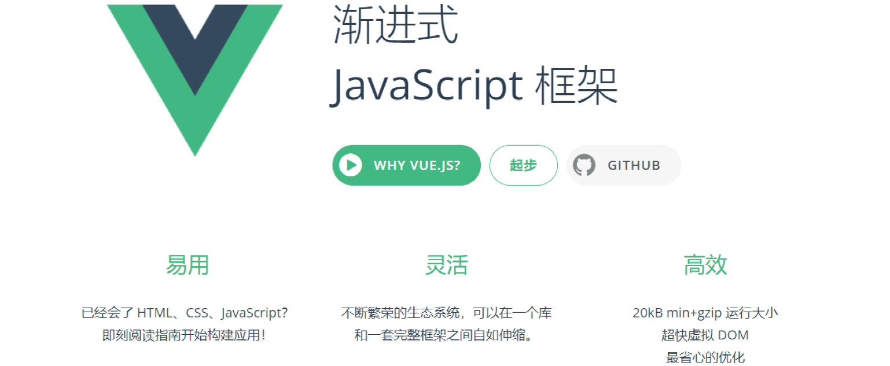

#### 基本定义

Vue (发音为 /vjuː/，类似 **view**) 是一款用于构建用户界面的 JavaScript 框架。它基于标准 HTML、CSS 和 JavaScript 构建，并提供了一套声明式的、组件化的编程模型，帮助你高效地开发用户界面。无论是简单还是复杂的界面，Vue 都可以胜任。

- 示例

```text
import { createApp, ref } from 'vue' createApp({ setup() { return { count:
ref(0) } } }).mount('#app')

<div id="app">
  <button @click="count++">
    Count is: {{ count }}
  </button>
</div>

//结果： //Countis:0
```

上面的示例展示了 Vue 的两个核心功能：

- **声明式渲染**：Vue 基于标准 HTML 拓展了一套模板语法，使得我们可以声明式地描述最终输出的 HTML 和 JavaScript 状态之间的关系。
- **响应性**：Vue 会自动跟踪 JavaScript 状态并在其发生变化时响应式地更新 DOM。

##### 渐进式框架

Vue 是一个框架，也是一个生态。其功能覆盖了大部分前端开发常见的需求。但 Web 世界是十分多样化的，不同的开发者在 Web 上构建的东西可能在形式和规模上会有很大的不同。考虑到这一点，Vue 的设计非常注重灵活性和“可以被逐步集成”这个特点。根据你的需求场景，你可以用不同的方式使用 Vue：

- 无需构建步骤，渐进式增强静态的 HTML
- 在任何页面中作为 Web Components 嵌入
- 单页应用 (SPA)
- 全栈 / 服务端渲染 (SSR)
- Jamstack / 静态站点生成 (SSG)
- 开发桌面端、移动端、WebGL，甚至是命令行终端中的界面

如果你是初学者，可能会觉得这些概念有些复杂。别担心！理解教程和指南的内容只需要具备基础的 HTML 和 JavaScript 知识。即使你不是这些方面的专家，也能够跟得上。

如果你是有经验的开发者，希望了解如何以最合适的方式在项目中引入 Vue，或者是对上述的这些概念感到好奇，我们在[使用 Vue 的多种方式](https://cn.vuejs.org/guide/extras/ways-of-using-vue.html)中讨论了有关它们的更多细节。

无论再怎么灵活，Vue 的核心知识在所有这些用例中都是通用的。即使你现在只是一个初学者，随着你的不断成长，到未来有能力实现更复杂的项目时，这一路上获得的知识依然会适用。如果你已经是一个老手，你可以根据实际场景来选择使用 Vue 的最佳方式，在各种场景下都可以保持同样的开发效率。这就是为什么我们将 Vue 称为“渐进式框架”：它是一个可以与你共同成长、适应你不同需求的框架。

- 官方简介：

https://cn.vuejs.org/guide/introduction.html

- 为什么要学习：

1. Vue是目前前端最火的框架之一
2. Vue是目前企业技术栈中要求的知识点
3. Vue可以提升开发体验
4. Vue学习难度较低
5. ...

#### 前期准备

##### 工具安装

Vue的官方网址：https://cn.vuejs.org/

`Vue CLI` Vue.js 开发的标准工具，`Vue CLI ` 是一个基于 Vue.js 进行快速开发的完整系统。

```js
cnpm install -g @vue/cli 或者  npm install -g @vue/cli
```

安装之后，你就可以在命令行中访问 `vue` 命令。你可以通过简单运行 `vue`，看看是否展示出了一份所有可用命令的帮助信息，来验证它是否安装成功。

```js
vue --version
```

##### 创建项目

运行以下命令来创建一个新项目。

```js
//在vs code对应文件夹右键选择【在集成终端中打开】输入如下命令，vue-demo替代为你自己的项目名称
vue create vue-demo //vue-demo可以更改为自己的项目名称，但是不能有大写字母，中间可以使用-进行链接
```

> **温馨提示**
>
> 在控制台中，可以用上下按键调整选择项
>
> 在控制台中，可以用空格(spacebar)选择是否选中和取消选中

可以选择默认项目模板，或者选“手动选择特性”来选取需要的特性。


我们选择`Babel`和`Progressive Web App (PWA) Support` 两个选项即可。

> **温馨提示**
>
> 在学习期间，不要选中 `Linter / Formatter` 以避免不必要的错误提示


Vue目前有两个主流大版本`vue2`和`vue3`，我们本套课程选择`vue3`最新版本。


配置放在哪里? `In dedicated config files ` 专用配置文件或者 `In package.json `在package.json文件。我们选择`In dedicated config files `。


将其保存为未来项目的预置? `y`代表保存，并添加名字，`n`不保存。


项目创建成功如下提示信息


##### 运行项目

第一步：进入项目根目录`cd vue-demo`；

第二步：运行`npm run serve` 启动项目；

##### 高亮插件

VSCode中安装`vetur`或者`volar`都可，前者针对Vue2版本，后者针对Vue3版本。

### 模板语法

Vue 使用一种基于 HTML 的模板语法，使我们能够声明式地将其组件实例的数据绑定到呈现的 DOM 上。所有的 Vue 模板都是语法层面合法的 HTML，可以被符合规范的浏览器和 HTML 解析器解析。

在底层机制中，Vue 会将模板编译成高度优化的 JavaScript 代码。结合响应式系统，当应用状态变更时，Vue 能够智能地推导出需要重新渲染的组件的最少数量，并应用最少的 DOM 操作。

如果你对虚拟 DOM 的概念比较熟悉，并且偏好直接使用 JavaScript，你也可以结合可选的 JSX 支持直接手写渲染函数而不采用模板。但请注意，这将不会享受到和模板同等级别的编译时优化。

#### 文本插值

最基本的数据绑定形式是文本插值，它使用的是“Mustache”语法 (即双大括号)：

```text
<span>Message: {{ msg }}</span>
```

双大括号标签会被替换为相应组件实例中 `msg` 属性的值。同时每次 `msg` 属性更改时它也会同步更新。

```text
export default { name: 'HelloWorld', data(){ return{ msg:"消息提示" } } }
```

#### 原始 HTML

双大括号会将数据解释为纯文本，而不是 HTML。若想插入 HTML，你需要使用 `v-html` 指令：

```text
<p>Using mustaches: {{ rawHtml }}</p>
<p>Using v-html directive: <span v-html="rawHtml"></span></p>
data(){ return{ rawHtml:"
<a href="https://www.itbaizhan.com">百战</a>
" } }
```

这里我们遇到了一个新的概念。这里看到的 `v-html` attribute 被称为一个**指令**。指令由 `v-` 作为前缀，表明它们是一些由 Vue 提供的特殊 attribute，你可能已经猜到了，它们将为渲染的 DOM 应用特殊的响应式行为。这里我们做的事情简单来说就是：在当前组件实例上，将此元素的 innerHTML 与 `rawHtml` 属性保持同步。

#### 属性 Attribute

Mustache 语法不能在 HTML 属性中使用，然而，可以使用 `v-bind` 指令

```html
<div v-bind:id="dynamicId"></div>
```

```js
data(){
    return{
        dynamicId:1001
    }
}
```

> **温馨提示**
>
> `v-bind:` 可以简写成 `:`

#### JavaScript 表达式

在我们的模板中，我们一直都只绑定简单的 property 键值，Vue.js 都提供了完全的 JavaScript 表达式支持

```js
{
  {
    number + 1;
  }
}

{
  {
    ok ? "YES" : "NO";
  }
}

{
  {
    message.split("").reverse().join("");
  }
}
```

这些表达式会在当前活动实例的数据作用域下作为 JavaScript 被解析。有个限制就是，每个绑定都只能包含**单个表达式**，所以下面的例子都**不会**生效。

```js
<!--  这是语句，不是表达式：-->
{{ var a = 1 }}

<!-- 流程控制也不会生效，请使用三元表达式 -->
{{ if (ok) { return message } }}
```

> 每个绑定仅支持**单一表达式**，也就是一段能够被求值的 JavaScript 代码。一个简单的判断方法是是否可以合法地写在 `return` 后面。

### 条件渲染

#### v-if

`v-if` 指令用于条件性地渲染一块内容。这块内容只会在指令的表达式返回 `true` 值的时候被渲染。

```html
<p v-if="flag">我是孙猴子</p>
```

```js
data() {
    return {
        flag: true
    }
}
```

#### v-else

你可以使用 `v-else` 指令来表示 `v-if` 的“else 块”

```html
<p v-if="flag">我是孙猴子</p>
<p v-else>你是傻猴子</p>
```

```js
data() {
    return {
        flag: false
    }
}
```

#### v-show

另一个用于条件性展示元素的选项是 `v-show` 指令

```html
<h1 v-show="ok">Hello!</h1>
```

#### 两者区别

`v-if` 是“真正”的条件渲染，因为它会确保在切换过程中，条件块内的事件监听器和子组件适当地被销毁和重建。

`v-if` 也是**惰性的**：如果在初始渲染时条件为假，则什么也不做——直到条件第一次变为真时，才会开始渲染条件块。

相比之下，`v-show` 就简单得多——不管初始条件是什么，元素总是会被渲染，并且只是简单地基于 CSS 进行切换。

一般来说，`v-if` 有更高的切换开销，而 `v-show` 有更高的初始渲染开销。因此，如果需要非常频繁地切换，则使用 `v-show` 较好；如果在运行时条件很少改变，则使用 `v-if` 较好。

### 列表渲染

#### 使用方法

用 `v-for` 把一个数组映射为一组元素：

我们可以用 `v-for` 指令基于一个数组来渲染一个列表。`v-for` 指令需要使用 `item in items` 形式的特殊语法，其中 items 是源数据数组，而 `item` 则是被迭代的数组元素的**别名**。

```html
<ul>
  <li v-for="item in items">{{ item.message }}</li>
</ul>
```

```js
data() {
    return {
        items: [{ message: 'Foo' }, { message: 'Bar' }]
    }
}
```

#### 维护状态

当 Vue 正在更新使用 `v-for` 渲染的元素列表时，它默认使用“就地更新”的策略。如果数据项的顺序被改变，Vue 将不会移动 DOM 元素来匹配数据项的顺序，而是就地更新每个元素，并且确保它们在每个索引位置正确渲染。

为了给 Vue 一个提示，以便它能跟踪每个节点的身份，从而重用和重新排序现有元素，你需要为每项提供一个唯一的 `key` attribute：

```html
<div v-for="(item,index) in items" :key="item.id|index">
  <!-- 内容 -->
</div>
```

### 事件处理

#### 监听事件

我们可以使用 `v-on` 指令 (通常缩写为 `@` 符号) 来监听 DOM 事件，并在触发事件时执行一些 JavaScript。用法为 `v-on:click="methodName"` 或使用快捷方式 `@click="methodName"`

```html
<button @click="counter += 1">Add 1</button>
```

```js
data() {
    return {
        counter: 0
    }
}
```

#### 处理方法

然而许多事件处理逻辑会更为复杂，所以直接把 JavaScript 代码写在 `v-on` 指令中是不可行的。因此 `v-on` 还可以接收一个需要调用的方法名称。

```html
<button @click="greet">Greet</button>
```

```js
methods: {
    greet(event) {
        // `event` 是原生 DOM event
        if (event) {
            alert(event.target.tagName)
        }
    }
}
```

#### 内联方法

这是官方的翻译称呼，其实我们可以直接叫他 "事件传递参数"

```html
<button @click="say('hi')">Say hi</button>
<button @click="say('what')">Say what</button>
```

```js
methods: {
    say(message) {
        alert(message)
    }
}
```

### 输入绑定

你可以用 `v-model` 指令在表单 `<input>`、`<textarea>` 及 `<select>` 元素上创建双向数据绑定。它会根据控件类型自动选取正确的方法来更新元素。尽管有些神奇，但 `v-model` 本质上不过是语法糖。它负责监听用户的输入事件来更新数据，并在某种极端场景下进行一些特殊处理。

```html
<input v-model="message" placeholder="edit me" />
<p>Message is: {{ message }}</p>
```

```js
data() {
    return {
        message:""
    }
}
```

#### 修饰符

##### `.lazy`

在默认情况下，`v-model` 在每次 `input` 事件触发后将输入框的值与数据进行同步 。你可以添加 `lazy` 修饰符，从而转为在 `change` 事件之后进行同步

```html
<input v-model.lazy="message" />
<p>Message is: {{ message }}</p>
```

```js
data() {
    return {
        message:""
    }
}
```

##### `.trim`

如果要自动过滤用户输入的首尾空白字符，可以给 `v-model` 添加 `trim` 修饰符

```html
<input v-model.trim="message" />
```

```js
data() {
    return {
        message:""
    }
}
```

### 组件基础

