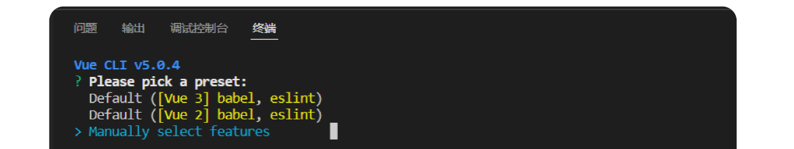
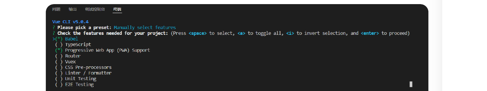
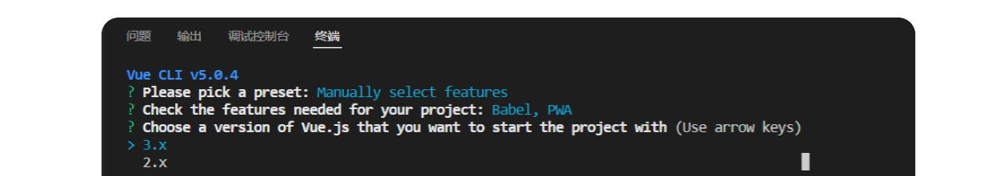
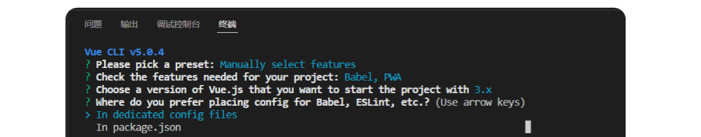
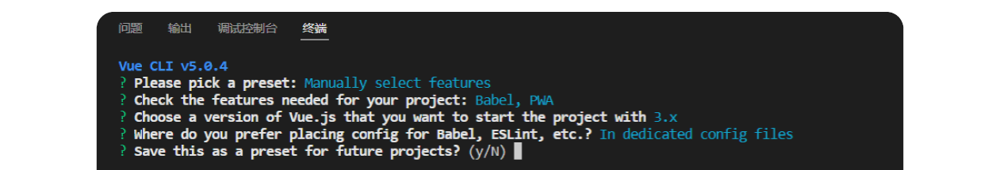
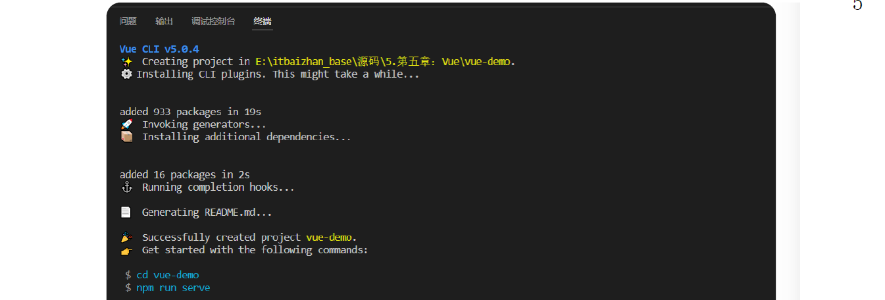
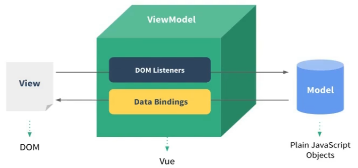
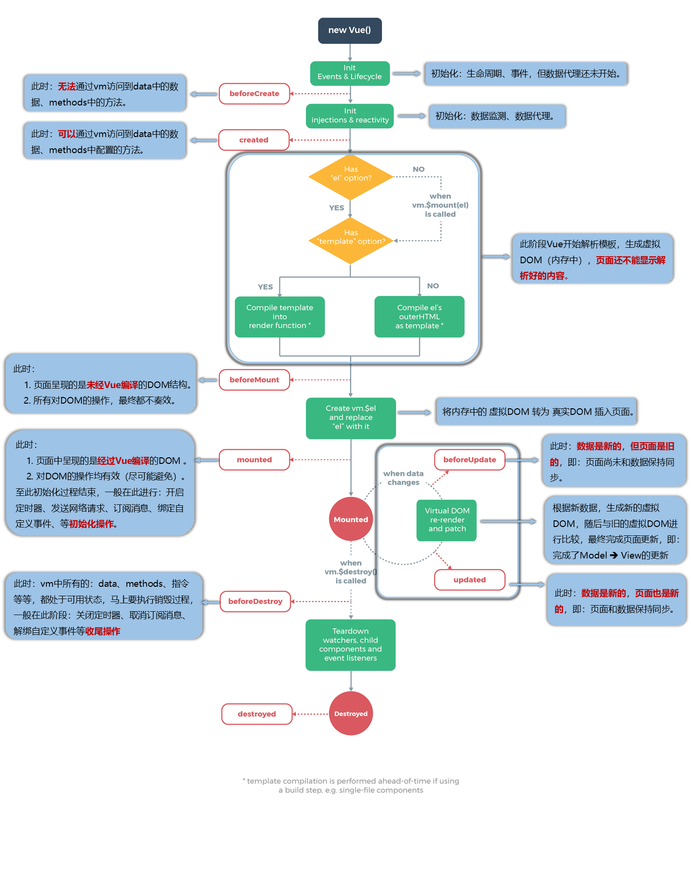
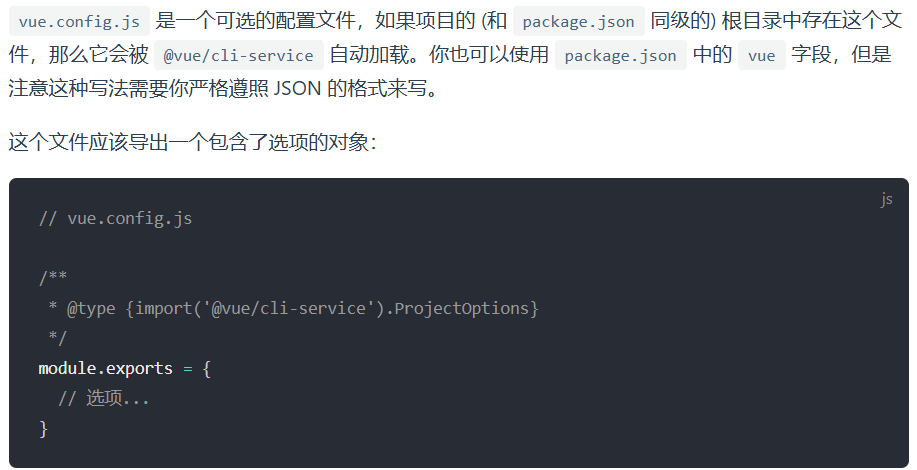
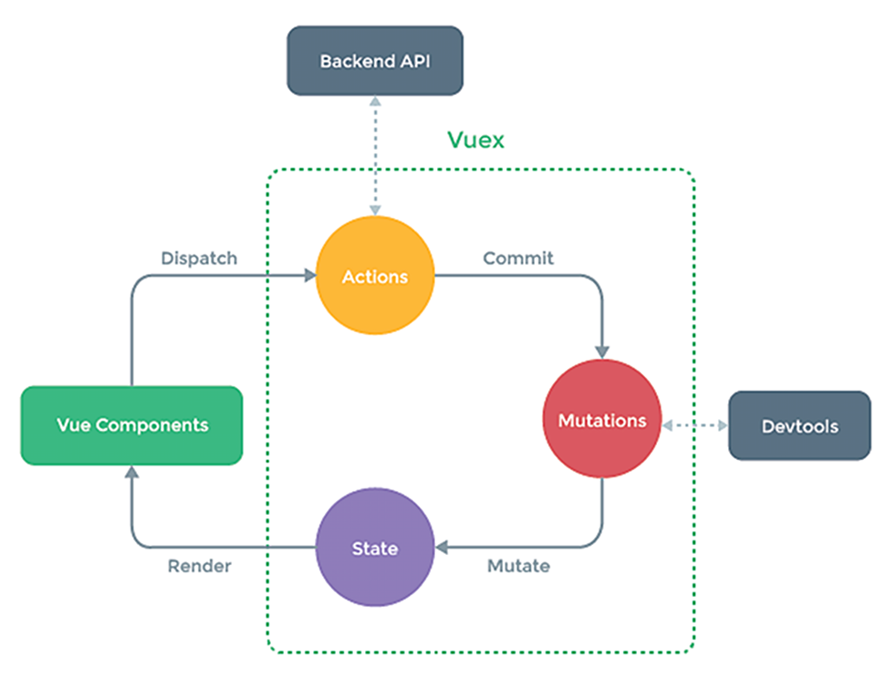

# 03.02-前端框架

## FVue2

### 基础教程

#### 引入使用

前期通过javascript引入使用：

```js
<head>
    <meta charset="UTF-8" />
    <meta name="viewport" content="width=device-width, initial-scale=1.0" />
    <link rel="shortcut icon" href="../../favicon.png" type="image/x-icon" />
    <title>初识Vue</title>
    <!-- 引入 vue-script -->
    <script type="text/javascript" src="../../js_Tools/vue.js"></script>
  </head>

  <body>
    <!--
    初识Vue：
      1.想让Vue工作，就必须创建一个VUe实例，且要传入一个配置对象；
      2.root容器里的代码依然符合html规范，只不过混入了一些特殊的Vue语法；
      3.root容器里的代码被称为【root模板】；
  -->
    <div id="root">
      <!-- 准备一个容器 -->
      <h1>Hello,{{name}}</h1>
    </div>
  </body>
  <script type="text/javascript">
    //阻止Vue在启动时生成生产提示。
    Vue.config.productionTip = false;

    //创建Vue实例
    new Vue({
      //el用于指定当前Vue实例为哪个容器服务，值通常为css选择器字符串，若选择为类，则可写为el:'.root'
      el: "#root",
      data: {
        //data中用于存储数据，数据供el所指定的容器去使用，值我们暂时先写成一个对象。
        name: "BeiJing"
      }
    });
  </script>
```

> Vue.config.productionTip = false;此为阻止Vue在启动时生成生产提示
>
> 此时，通过js文件引入进行使用，此为最基本的vue使用方案

```js
<head>
    <meta charset="UTF-8" />
    <meta name="viewport" content="width=device-width, initial-scale=1.0" />
    <link rel="shortcut icon" href="../../favicon.png" type="image/x-icon" />
    <title>初识Vue</title>
    <!-- 引入script -->
    <script type="text/javascript" src="../../js_Tools/vue.js"></script>
  </head>

  <body>
    <!--
    初识Vue：
      1.想让Vue工作，就必须创建一个VUe实例，且要传入一个配置对象；
      2.root容器里的代码依然符合html规范，只不过混入了一些特殊的Vue语法；
      3.root容器里的代码被称为【root模板】；
      4.容器和实例只能一一对应；
      5.双括号{}}内只能写js表达式，如{{1+1}},{{Data.new()}} ;
        注意事项，js表达式 和 js代码（语句）
          1.表达式：一个表达式会产生一个值，可以放在任何一个需要值的地方：
            1).a
            2).a+b
            3).demo(1)
            4).x==y?'a':'b'

          2.js代码（语句）：
            1).if(){}
            2).for(){}
  -->
    <div class="root">
      <!-- 准备一个容器 -->
      <h1>Hello,{{name}},{{address}}</h1>
    </div>
  </body>
  <script type="text/javascript">
    Vue.config.productionTip = false; //阻止Vue在启动时生成生产提示。

    //创建Vue实例
    new Vue({
      //el用于指定当前Vue实例为哪个容器服务，值通常为css选择器字符串，若选择为类，则可写为el:'.root'
      el: ".root",
      //data中用于存储数据，数据供el所指定的容器去使用，值我们暂时先写成一个对象。
      data: {
        name: "BeiJing",
        address: "北京昌平"
      }
    });
  </script>
```

#### 前期准备

##### 工具安装

Vue的官方网址：https://cn.vuejs.org/

`Vue CLI` Vue.js 开发的标准工具，`Vue CLI ` 是一个基于 Vue.js 进行快速开发的完整系统。

```js
cnpm install -g @vue/cli 或者  npm install -g @vue/cli
```

安装之后，你就可以在命令行中访问 `vue` 命令。你可以通过简单运行 `vue`，看看是否展示出了一份所有可用命令的帮助信息，来验证它是否安装成功。

```js
vue --version
```

##### 创建项目

运行以下命令来创建一个新项目。

```js
//在vs code对应文件夹右键选择【在集成终端中打开】输入如下命令，vue-demo替代为你自己的项目名称
vue create vue-demo //vue-demo可以更改为自己的项目名称，但是不能有大写字母，中间可以使用-进行链接
```

> **温馨提示**
>
> 在控制台中，可以用上下按键调整选择项
>
> 在控制台中，可以用空格(spacebar)选择是否选中和取消选中

可以选择默认项目模板，或者选“手动选择特性”来选取需要的特性。



我们选择`Babel`和`Progressive Web App (PWA) Support` 两个选项即可。

> **温馨提示**
>
> 在学习期间，不要选中 `Linter / Formatter` 以避免不必要的错误提示



Vue目前有两个主流大版本`vue2`和`vue3`，我们本套课程选择`vue3`最新版本。



配置放在哪里? `In dedicated config files ` 专用配置文件或者 `In package.json `在package.json文件。我们选择`In dedicated config files `。



将其保存为未来项目的预置? `y`代表保存，并添加名字，`n`不保存。



项目创建成功如下提示信息



##### 运行项目

第一步：进入项目根目录`cd vue-demo`；

第二步：运行`npm run serve` 启动项目；

##### 高亮插件

VSCode中安装`vetur`或者`volar`都可，前者针对Vue2版本，后者针对Vue3版本。

#### 配置选项

本章节针对Vue2的非组件配置选项做逐步罗列，每个配置选项会根据实际需求备注在哪个章节引入。

##### 挂载配置

`el为`挂载配置项，其作用是指定 Vue 实例要挂载控制的 DOM 容器，Vue 会接管这个容器内部所有 DOM，容器外部不受 Vue 管理。

###### 标准写法

* 字符串选择器

```js
new Vue({
  el: "#app", // id选择器
  // el: ".box" class选择器
  // el: "div" 标签选择器
})
```

* DOM 原生对象

```js
new Vue({
  el: document.getElementById("app")
})
```

###### 注意事项

1. `el` 只在**根 Vue 实例**使用（`new Vue()`），`.vue` 单文件组件**不能写 el**；

2. 挂载容器只能是普通 HTML 标签，不能挂载 `<html>` / `<body>`；

3. 替代方案：不写 el，用 `$mount()` 手动挂载（等价写法）;

> <span style="color:orange;">el配置项贯穿整个单组件学习过程，是 Vue2 原生根实例基础配置，是最早期、最入门的五大核心配置</span>

##### 数据配置

data是数据配置项，其作用是定义响应式数据，数据变化页面自动更新，模板中可插值、指令绑定。

###### 标准写法

* 根实例 new Vue () 简写（对象形式，仅根实例可用）

```js
new Vue({
  el: "#app",
  // 根实例允许直接写对象
  data: {
    username: "设备管理员",
    status: 1,
    tableList: []
  }
})
```

* 组件 / 通用标准写法（函数 return，所有.vue 组件必须用这个，无简写）

```js
export default {
  data() {
    return {
      username: "设备管理员",
      status: 1,
      tableList: []
    }
  }
}
```

> 重点：所有自定义组件里，data**必须是函数**，防止多个组件实例共用一份数据污染

###### 使用方式

模板插值、v-model、v-if 直接使用

```html
<div id="app">
  <p>{{ username }}</p>
  <span :class="status === 1 ? 'text-success' : 'text-danger'"></span>
</div>
```

> 在FVue2-基础教程-模板语法就会用到

##### 方法配置

methods是方法配置项，其作用是存放所有事件处理函数、业务逻辑函数，模板 `@click` / `@change` 调用，可通过 `this` 访问 data、computed 数据。

###### 标准写法

```js
new Vue({
  el: "#app",
  data() { return { id: 1 } },
  methods: {
    // 无参方法
    refresh() {
      console.log("刷新列表")
    },
    // 接收参数
    delDevice(deviceId) {
      console.log("删除设备", deviceId, this.id)
    }
  }
})
```

###### 使用方式

```html
<button @click="refresh">刷新</button>
<button @click="delDevice(1001)">删除</button>
```

###### 核心特点

1. 每次调用都会完整执行，**无缓存**；
2. 内部 `this` 指向 Vue 实例；
3. 不推荐写复杂渲染计算逻辑（交给 computed）。

> 首次应用在FVue2-基础教程-事件处理

##### 计算属性

computed是计算属性，其作用是基于 data 中已有数据派生新值，自带缓存：依赖数据不变，多次调用只执行一次，适合页面渲染计算。

###### 标准写法

```js
computed: {
  statusText: {
    // 获取值时触发
    get() {
      return this.status === 1 ? "设备正常" : "设备故障"
    },
    // 赋值修改时触发：this.statusText = "设备正常"
    set(val) {
      this.status = val === "设备正常" ? 1 : 0
    }
  }
}
```

###### 简洁写法

```js
computed: {
  // 函数直接返回值，只能读取，不能赋值修改
  statusText() {
    return this.status === 1 ? "设备正常" : "设备故障"
  }
}
```

###### 使用方式

```html
<span>{{ statusText }}</span>
```

###### 区别差异

与methods核心区别：

computed：有缓存，依赖不变不执行，用于页面展示文本；

methods：无缓存，每次触发都执行，用于事件、异步请求。

> 首次使用在FVue2-基础教程-计算属性中使用

##### 过滤配置

filters 过滤器是vue2独有的，在vue3中彻底被废除，其作用是对模板展示的文本做格式化处理（状态转换、时间格式化、金额保留小数），仅能在 `{{ }}` 插值、`v-bind` 中使用。

###### 标准写法

* 简写（单处理函数，最常用）

```js
filters: {
  // value：原始数据，返回处理后的文本
  statusFilter(value) {
    const map = { 1: "正常", 0: "故障" }
    return map[value] || "未知"
  }
}
```

* 带传参完整写法

```js
filters: {
  // 第二个参数开始是自定义传入参数
  priceFilter(val, digit) {
    return Number(val).toFixed(digit || 2)
  }
}
```

###### 使用方式

模板管道符调用 `|`：

```html
<!-- 无参数 -->
<span>{{ status | statusFilter }}</span>
<!-- 传参 -->
<span>{{ 1299.5 | priceFilter(1) }}</span>
```

###### 多级串联

```vue
<!-- 先转状态，再追加文字 -->
<span>{{ status | statusFilter | addText }}</span>
```

###### 注意事项

1. 过滤器**不能修改原始 data 数据**，仅做展示格式化；

2. Vue3 废弃该配置，统一用 computed 替代过滤器功能。

> 首次使用是在FVue2-基础教程-表单数据-过滤案例中使用

##### 生命周期

关于生命周期的所有配置函数，可以参考FVue2-基础教程-生命周期。

##### 自定义指令

###### 基本定义

此处指的是，自定义的全局指令，主要用于封装底层 DOM 操作（输入框聚焦、按钮权限、拖拽、水印、文本省略），Vue 内置指令不够用时自己封装复用。

###### 注册方式

* 局部自定义指令（仅当前组件可用）
* 全局自定义指令（整个项目所有组件通用）

###### 生命周期

指令生命周期钩子（5 个，和组件生命周期对应）：

```js
directiveName: {
  // 1. 指令绑定到元素时立刻执行（只执行1次）
  bind(el, binding, vnode) {},
  // 2. 元素插入DOM树时执行（常用，可操作DOM）
  inserted(el, binding, vnode) {},
  // 3. 组件更新时执行，数据变化触发
  update(el, binding, vnode, oldVnode) {},
  // 4. 组件更新完成后执行
  componentUpdated(el, binding, vnode) {},
  // 5. 指令与元素解绑、元素销毁时执行（清除定时器/事件）
  unbind(el, binding, vnode) {}
}
```

> 钩子参数说明（每个钩子都能接收）
>
> - `el`：绑定指令的真实 DOM 元素，可直接操作 DOM
> - binding：指令相关信息对象
>   - `binding.value`：指令传递的值 `v-focus="true"` → value 为 true
>   - `binding.arg`：指令参数 `v-permission:add` → arg 为 add
>   - `binding.modifiers`：指令修饰符 `v-copy.clip` → {clip:true}
> - `vnode`：Vue 虚拟 DOM 节点

###### 简写方式

如果只需要`inserted`钩子，可直接写函数简写：

```js
directives: {
  focus(el) {
    el.focus() // 等价只写inserted钩子
  }
}
```

###### 局部指令

* 基本语法格式如下：

```js
export default {
  directives: {
    // 指令名：不要加v-，使用时写 v-指令名
    指令名: {
      bind() {},
      inserted() {},
      update() {},
      componentUpdated() {},
      unbind() {}
    }
  }
}
```

* v-focus 输入框自动聚焦（完整写法 + 简写）：

  * 完整写法（完整钩子）

    ```vue
    <template>
      <!-- 使用自定义指令 -->
      <input v-focus placeholder="设备编号">
    </template>
    <script>
    export default {
      directives: {
        focus: {
          inserted(el) {
            // 元素插入页面后自动聚焦
            el.focus()
          }
        }
      }
    }
    </script>
    ```

  * 简写写法（仅 inserted 逻辑，项目最常用）

    ```vue
    directives: {
      focus(el) {
        el.focus()
      }
    }
    ```

###### 全局指令

基本语法格式如下：

```js
// main.js
import { createApp } from 'vue' // Vue3
import Vue from 'vue' // Vue2

// 全局完整写法
Vue.directive('指令名', {
  inserted(el) {
    el.focus()
  }
})
// 全局简写写法（仅inserted）
Vue.directive('focus', el => el.focus())
```

完整全局示例：v-copy 一键复制文本指令(main.js 全局注册):

```js
import Vue from 'vue'
Vue.directive('copy', {
  inserted(el, binding) {
    el.onclick = () => {
      // 复制传入的值
      navigator.clipboard.writeText(binding.value).then(() => {
        alert("复制成功")
      })
    }
  },
  unbind(el) {
    // 销毁时移除事件，防止内存泄漏
    el.onclick = null
  }
})
```

> 任意界面使用时：
>
> `<button v-copy="device.deviceNo">复制设备编号</button>`

###### 示例总结

```html
<body>
    <!-- 准备好一个容器-->
    <div id="root">
      <h2>{{name}}</h2>
      <h2>当前的n值是：<span v-text="n"></span></h2>
      <!-- <h2>放大10倍后的n值是：<span v-big-number="n"></span> </h2> -->
      <h2>放大10倍后的n值是：<span v-big="n"></span></h2>
      <button @click="n++">点我n+1</button>
      <hr />
      <input type="text" v-fbind:value="n" />
    </div>
</body>
<script type="text/javascript">
    Vue.config.productionTip = false;
    //定义全局指令
    /* Vue.directive('fbind',{
    bind(element,binding){element.value = binding.value},
    inserted(element,binding){ element.focus()},
    update(element,binding){element.value = binding.value}}) */
    //定义局部指令
    new Vue({el: "#root",data: {name: "尚硅谷",n: 1},
      directives: {
        big(element, binding) {console.log("big", this);element.innerText = binding.value * 10;},
        fbind: { 
          //指令与元素成功绑定时（一上来）
          bind(element, binding) {element.value = binding.value;},
          //指令所在元素被插入页面时
          inserted(element, binding) {element.focus();},
          //指令所在的模板被重新解析时
          update(element, binding) {element.value = binding.value;}
        }
      }
    });
</script>
```

> 1. 指令定义时不加v-，但使用时要加v-；
>
> 2. 指令名如果是多个单词，要使用kebab-case命名方式，不要用camelCase命名。
>
> 3. directives里面的指令实际上是操作DOM，所以里面的this是Windows，并且对应的参数是通过使用时传入的。

#### 模板语法

##### 插值语法

最基本的数据绑定形式是文本插值，它使用的是“Mustache”语法 (即双大括号)：

```text
<span>Message: {{ msg }}</span>
```

双大括号标签会被替换为相应组件实例中 `msg` 属性的值。同时每次 `msg` 属性更改时它也会同步更新。

```text
export default { name: 'HelloWorld', data(){ return{ msg:"消息提示" } } }
```

```js
<head>
  <meta charset="UTF-8">
  <meta name="viewport" content="width=device-width, initial-scale=1.0">
  <link rel="shortcut icon" href="../../favicon.png" type="image/x-icon">
  <title>02-Vue模板语法</title>
  <!-- 引入script -->
  <script type="text/javascript" src="../../js_Tools/vue.js"></script>
</head>

<body>
  <div id="root">
    <!-- 使用插值法获取数据 -->
    <h1> 插值语法</h1>
    <h3>你好，{{name}}</h3>
    <hr>
  </div>
</body>
<script>
  Vue.config.productionTip = false//阻止Vue在启动时生成生产提示
  new Vue({
    el: '#root',
    data: {
      name: 'goohv'
    }
  }) </script>
```

> 功能：用于解析标签体内容。
>
> 写法：{{xxx}},xxx是js表达式，且可以直接读取到data中的所有属性。
>
> 范围：一般都是使用在标签体内。

##### 指令语法

使用`v-bind:`或者`:`实现，其后面的“”内部的内容会被当做js表达式进行执行：

```html
<head>
  <meta charset="UTF-8" />
  <meta name="viewport" content="width=device-width, initial-scale=1.0" />
  <link rel="shortcut icon" href="../../favicon.png" type="image/x-icon" />
  <title>02-Vue模板语法</title>
  <!-- 引入script -->
  <script type="text/javascript" src="../../js_Tools/vue.js"></script>
</head>

<body>
  <div id="root">
    <h1>指令语法</h1>
    <!-- 增加v-bind后，引号中的内容就是js表达式执行 -->
    <a v-bind:href="school.url.toUpperCase()" x="hello"
      >我要去{{school.name}}学习百度1</a
    >
    <!-- v-bind可以简写为： -->
    <a :href="school.url" x="hello">我要去{{school.name}}学习百度2</a>
  </div>
</body>
<script>
  Vue.config.productionTip = false; //阻止Vue在启动时生成生产提示
  new Vue({
    el: "#root",
    data: {
      school: {
        name: "BeiJing",
        hello: "你好",
        url: "http://www.baidu.com/"
      }
    }
  });
</script>
```

> 功能：用于解析标签（包括：标签属性、标签体内容、绑定事件...）。
>
> 举例：v-bind:href="xxx" 或 简写为 :href="xxx"，xxx同样要写js表达式。
>
> 范围：一般用于标签属性。

#### 数据绑定

##### 单项绑定

单项绑定使用v-bind实现，数据只能从data流向页面：

```html
完整书写，单项数据绑定：<input type="text" v-bind:value="name" />
<!--- 或者简写为如下方式 --->
简单书写，单项数据绑定：<input type="text" :value="name" /> new Vue({ el:
'#root', data: { name: 'BeiJing' } })
```

##### 双项绑定

双向绑定使用v-model实现，数据不仅能从data流向页面，还可以从页面流向data：

```html
完整书写，双项数据绑定：<input type="text" v-model:value="name" />
<!--- 或者简写为如下方式 --->
简单书写，双项数据绑定：<input type="text" v-model="name" /> new Vue({ el:
'#root', data: { name: 'BeiJing' } })
```

> 特别注意：
>
>  1.v-model只能应用在表单类元素（输入类元素）上，即：有value值的元素（如input、select等）；
>
>  2.v-model:value 可以简写为v-model,因为v-model默认收集的就是value的值。

##### 双向修饰

在v-model上有3个非常常用的修饰符，分别为：

- lazy：失去焦点再收集数据
- number：输入字符串转为有效的数字
- trim：输入首尾空格过滤

```html
<form @submit.prevent="demo">
  <!-- 输入用户名时，输入首尾空格过滤 -->
  账号：<input type="text" v-model.trim="userInfo.account" />
  <!-- 输入年龄时，输入字符串转为有效的数字 -->
  年龄：<input type="number" v-model.number="userInfo.age" />
  <!-- 输入备注信息时，失去焦点再收集数据 -->
  <textarea v-model.lazy="userInfo.other"></textarea>
  <button>提交</button>
</form>
```

#### 获取方式

##### 案例分析

通常vue示例与html内部的{{value}}进行关联有两种方式实现，如下分别对el和data两种写法进行阐述：

```html
<body>
  <div id="root">
    <h1>你好,{{name}}</h1>
  </div>
</body>
<script type="text/javascript">
  Vue.config.productionTip = false;
  const x = new Vue({
    el: "#root",
    //以下为data的第1种写法：对象式
    data: {
      name: "BeiJing"
    }
  });
</script>
```

> 上述为对象式的写法，是最常见的方式，以el:"#root"将vue和html值进行绑定；
>
> el：直接指定对应的#root；data：直接是对象式，可以引用

```html
<body>
  <div id="root">
    <h1>你好,{{name}}</h1>
  </div>
</body>
<script type="text/javascript">
  Vue.config.productionTip = false;

  // el的第2种写法
  const x = new Vue({
    // 以下为data的第2种写法：函数式
    data: function () {
      return {
        name: "BeiJing"
      };
    }
  });
  x.$mount("#root");
</script>
```

> mount表示挂载，意思是在项目启动时，将vue进行挂载，将数据挂载到指定位置
>
> el：此时使用将vue进行挂载实现；data：函数式，通过返回值实现，后面组件知识点，只能使用函数式，不可以用对象式

##### 总结分析

如下对el和data做汇总总结如下：

data与el的2种写法:

1.el的2种写法

 （1）new Vue时候配置el属性。

 （2）先创建Vue实例，随后再通过vm.$mount('#root')指定el的值。

2.data的2种写法

 （1）对象式

 （2）函数式

 如何选择：目前哪种写法都可以，以后学习到组件后，data必须使用函数式，否则会报错

3.一个重要的原则：

 由Vue管理的函数，一定不要写箭头函数，一旦写了箭头函数，this就不再是Vue实例了，因为箭头函数没有this

#### 视图模型

MVVM 中的M代表模型Model，对应data中的数据；V代表视图View，表示模板；VM代表视图模型ViewModel，是Vue实例对象.



> 第1条线：将Model中的数据Bindings to View;
>
> 第2条线：通过DOM Listeners进行对数据的监控，实现v-model;

```html
<body>
  <div id="root">
    <h1>学校名称：{{name}}</h1>
    <h1>学校地址：{{address}}</h1>
  </div>
</body>
<script type="text/javascript">
  //阻止Vue在启动时生成生产提示。
  Vue.config.productionTip = false;

  const vm = new Vue({
    el: "#root",
    data: {
      name: "BeiJing",
      address: "北京市"
    }
  });
  console.log(vm);
</script>
```

> 1.data中所有的属性，最后都出现在了vm身上;
> 2.vm身上所有的属性 及 Vue原型上的所有属性，在Vue模板中都可以直接使用。

#### 数据代理

##### 属性回顾

js中可以通过Object.defineProperty方法将对象新增属性或方法：

```js
<script>
    let number = 19
    let person = {
      name: '张三',
      sex: '男'
    }
    //实现了实时查看数据，实时读取的目的
    Object.defineProperty(person, 'age', {
      //当有人读取person的age属性时，get函数（geter）就会被调用，且返回值就是age的值，实际就是number的值
      get() {
        return number
      },
      //当有人修改person的age属性时，set函数（seter）就会被调用，且返回值就是age的值，，实际就是number的值
      set(value) {
        number = value
      },
    })
</script>
```

> 通过如下设置，可以对defineProperty设置的属性进行设置
>
> ```js
> enumerable: true,//控制属性是否可枚举，默认false，不可枚举
> writable: true,//控制属性是否可以修改，默认false，不可修改
> configurable: true,//控制属性是否可以删除，默认false，不可删除
> ```

##### 代理定义

通过一个对象代理都另一个对象中属性的操作（读/写）：

```js
//实现通过对obj2的增加属性x，来对obj自身的x进行设置
<script>
    let obj = { x: 100 }
    let obj2 = { y: 200 }
    Object.defineProperty(obj2, 'x', {
      get() {
        return obj.x
      },
      set(value) {
        obj.x = value
      }
    })
  </script>
```

##### 代理应用

当有人访问/设置vue中data数据时，vm通过代理getter/setter实现：

```html
<body>
  <div id="root">
    <h1>学校名称：{{name}}</h1>
    <h1>学校地址：{{address}}</h1>
  </div>

  <script type="text/javascript">
    Vue.config.productionTip = false; //阻止Vue在启动时生成生产提示。

    const vm = new Vue({
      el: "#root",
      data: {
        name: "BeiJing",
        address: "北京市"
      }
    });
  </script>
</body>
```

> 注意事项：
> 1.Vue中的数据代理：
> 通过vm对象来代理data对象中属性的操作（读/写）
>
> 2.Vue中数据代理的好处：
> 更加方便的操作data中的数据
>
> 3.基本原理：
> 通过Object.defineProperty()把data对象中所有属性添加到vm中。
> 为每一个添加到vm上的属性，都指定一个getter/setter。
> 在getter/setter内部去操作（读/写）data中对应的属性。

#### 事件处理

##### 事件使用

###### 监听事件

我们可以使用 `v-on` 指令 (通常缩写为 `@` 符号) 来监听 DOM 事件，并在触发事件时执行一些 JavaScript。用法为 `v-on:click="methodName"` 或使用快捷方式 `@click="methodName"`

```html
<button @click="counter += 1">Add 1</button>
```

```js
data() {
    return {
        counter: 0
    }
}
```

###### 处理事件

然而许多事件处理逻辑会更为复杂，所以直接把 JavaScript 代码写在 `v-on` 指令中是不可行的。因此 `v-on` 还可以接收一个需要调用的方法名称。

```html
<button @click="greet">Greet</button>
```

```js
methods: {
    greet(event) {
        // `event` 是原生 DOM event
        if (event) {
            alert(event.target.tagName)
        }
    }
}
```

###### 事件传参

可以将参数通过事件触发传递给事件触发函数。

```html
<button @click="say('hi')">Say hi</button>
<button @click="say('what')">Say what</button>
```

```vue
methods: { say(message) { alert(message) } }
```

###### 使用总结

- 使用v-on:xxx或@xxx绑定事件，其中xxx是事件名；
- 事件的回调需要配置在methods对象中，最终会在vm中；
- methods中配置的函数，不要用箭头函数！否则this就不是vm了，是Windows；
- methods中配置的函数，都是被Vue所管理的函数，this的指向是vm 或 组件实例对象；
- @click='demo' 和 @click="demo($event)"效果一致，但后者可以传参；

##### 事件修饰

在事件执行时，有几个比较常用的修饰符：

```js
<!DOCTYPE html>
<html lang="en">

<head>
  <meta charset="UTF-8">
  <meta name="viewport" content="width=device-width, initial-scale=1.0">
  <link rel="shortcut icon" href="../../favicon.png" type="image/x-icon">
  <title>07.02-事件的修饰符</title>
  <!-- 引入script -->
  <script type="text/javascript" src="../../js_Tools/vue.js"></script>
</head>

<body>

  <!-- 准备好一个容器 -->
  <div id="root">
    <h1>欢迎来到{{name}}学习</h1>
    <!-- prevent：阻止默认事件（常用） -->
    <a href="http://www.baidu.com/" @click.prevent="showInfo">点我有提示信息</a>

    <!-- stop：阻止事件冒泡（常用） -->
    <div class="demo" @click="showInfo">
      <button @click.stop="showInfo">点我</button>
      <!-- 修饰符可以连续使用 -->
      <a href="http://www.baidu.com/" @click.stop.prevent="showInfo">点我有提示信息</a>
    </div>

    <!-- once：事件只触发一次（常用） -->
    <button @click.once="showInfo">点我</button>

    <!-- capture：使用事件的捕获模式 -->
    <div class="box1" @click.capture="showMsg(1)">
      <div class="box2" @click="showMsg(2)">
      </div>
    </div>

    <!-- self：只有event.target是当前操作的元素时才触发事件 -->
    <div class="demo" @click.self="showInfo">
      <button @click="showInfo">点我</button>
    </div>

    <!-- passive：事件的默认行为立即执行，无需等待事件回调执行完毕 -->
    <ul @wheel.passive="demo" class="list">
      <li>1</li>
      <li>2</li>
      <li>3</li>
      <li>4</li>
    </ul>
  </div>
</body>
<script type="text/javascript">
  Vue.config.productionTip = false //阻止Vue在启动时生成生产提示。

  const vm = new Vue({
    el: '#root',
    data: {
      name: 'BeiJing'
    },
    methods: {
      showInfo(e) {
        alert('Hello')
        console.log(e.target)
      },
      showMsg(msg) {
        console.log(msg)
      },
      demo() {
        // console.log('@')
        for (let i = 0; i < 10000; i++) {
          console.log('#')
        }
        console.log('累坏了')
      }
    }
  })
</script>

</html>
```

> 1.Vue中的事件修饰符：
>
> - prevent：阻止默认事件（常用）；
> - stop：阻止事件冒泡（常用）；
> - once：事件只触发一次（常用）；
> - capture：使用事件的捕获模式；
> - self：只有event.target是当前操作的元素时才 触发事件；
> - passive：事件的默认行为立即执行，无需等待事件回调执行完毕。
>
>   2.修饰符可以进行连续使用，如a标签下：@click.stop.prevent="showInfo"，表示即可以停止冒泡，又可以阻止跳转

##### 键盘事件

01-Vue中常用的按键别名：

- 回车 => enter
- 删除 => delete（捕获“删除”和退格键）
- 退出 => esc
- 空格 => space
- 换行 => tab（不适合keyup，适合keydown，因为keydown之后，就不聚焦当前标签了，所以keyup就不起作用了）
- 上 => up
- 下 => down
- 左 => left
- 右 => right
- CapsLock => caps-lock(例如这种多单词连接的词组，中间用-连接，前后词都是小写)

02-Vue未提供别名的按键，可以使用按键原始的key值去绑定，但注意要转为kebab-case

03-系统修饰键（用法特殊）：ctrl、alt、shift、meta(win)

- 配合keyup使用：按下修饰键的同时，再按下其他键，随后释放其他键，事件才被触发。
- 配合keydown使用：正常触发事件。
- 系统修饰符后面可以再加按键，如：@keyup.ctrl.y="showInfo"表示在按下ctrl之后，还要继续按y才起作用。

04-也可以使用keyCode去指定具体的按键（不推荐）

05-Vue.config.keyCode.自定义键名 = 键码，可以去定制键盘别名 Vue.config.keyCode.huiche=13 //绑定huiche是Enter按键的别名

```html
<body>
  <!-- 准备好一个容器 -->
  <div id="root">
    <h1>欢迎来到{{name}}学习</h1>
    <input type="text" placeholder="请输入内容" @keyup.enter="showInfo" />
  </div>

  <script type="text/javascript">
    Vue.config.productionTip = false; //阻止Vue在启动时生成生产提示。

    const vm = new Vue({
      el: "#root",
      data: {
        name: "BeiJing"
      },
      methods: {
        showInfo(e) {
          console.log(e.target.value);
        }
      }
    });
  </script>
</body>
```

#### 计算属性

##### 属性修改

属性的监听与获取一般有3种方式：插值语法、methods语法和计算属性。

- 插值语法：

```html
<body>
  <div id="root">
    <!-- "v-model:value=" = "v-model="" -->
    姓：<input type="text" v-model="firstName" /><br /><br />
    <!-- "v-model:value=" = "v-model="" -->
    名：<input type="text" v-model="lastName" /><br /><br />
    全名：<span>{{firstName}}-{{lastName}}</span><br /><br />
  </div>

  <script type="text/javascript">
    Vue.config.productionTip = false; //阻止Vue在启动时生成生产提示。

    new Vue({
      el: "#root",
      data: {
        firstName: "张",
        lastName: "三"
      }
    });
  </script>
</body>
```

> 插值语法使用v-model实现

- methods：

```html
<body>
  <div id="root">
    <!-- "v-model:value=" = "v-model="" -->
    姓：<input type="text" v-model="firstName" /><br /><br />
    <!-- "v-model:value=" = "v-model="" -->
    名：<input type="text" v-model="lastName" /><br /><br />
    全名：<span>{{fullName()}}</span><br /><br />
  </div>

  <script type="text/javascript">
    Vue.config.productionTip = false; //阻止Vue在启动时生成生产提示。

    new Vue({
      el: "#root",
      data: {
        firstName: "张",
        lastName: "三"
      },
      methods: {
        fullName() {
          return this.firstName + "-" + this.lastName;
        }
      }
    });
  </script>
</body>
```

> 通过methods创建链接函数实现拼接功能

- 计算属性：

```html
<body>
  <div id="root">
    <!-- "v-model:value=" = "v-model="" -->
    姓：<input type="text" v-model="firstName" /><br /><br />
    <!-- "v-model:value=" = "v-model="" -->
    名：<input type="text" v-model="lastName" /><br /><br />
    全名：<span>{{fullName}}</span><br /><br />
  </div>
  <script type="text/javascript">
    Vue.config.productionTip = false; //阻止Vue在启动时生成生产提示。

    const vm = new Vue({
      el: "#root",
      //data是属性
      data: {
        firstName: "张",
        lastName: "三"
      },
      //computed是计算属性,本身是没有值的，实际需要的时候，马上计算或者设置
      computed: {
        fullName: {
          //get的作用：当有人查询fullName时，fullName就会调用get，get的返回值就是fullName的内容
          get() {
            return this.firstName + "-" + this.lastName;
          },

          //set的作用：当fullname被修改时，fullName就会调用set，将传过来的值传递给内部
          set(value) {
            const arr = value.split("-");
            this.firstName = arr[0];
            this.lastName = arr[1];
          }
        }
      }
    });
  </script>
</body>
```

> 通过computed来进行对属性的计算和调整

##### 定义功能

1.定义：要用的属性不存在，要通过已有属性计算得来。

2.原理：底层借助了Object.defineproperty方法提供的getter和setter。

3.get函数什么时候执行？

 3.1 初次读取时会被执行一次；

 3.2 当以来的数据发生改变时会被再次调用；

4.优势：与methods实现相比，内部有缓存机制（复用），效率更高，调试方便。

5.备注：

 5.1 计算属性最终会出现在vm身上，直接读取使用即可；

 5.2 如果计算属性要被修改，那必须写set函数去响应修改，且set中要引起计算时依赖的数据变化；

##### 简写方式

在正常使用中，无需通过Object.defineproperty方法提供的getter和setter设置：

```html
<body>
  <div id="root">
    姓：<input type="text" v-model="firstName" /><br /><br />
    名：<input type="text" v-model="lastName" /><br /><br />
    全名：<span>{{fullName}}</span><br /><br />
  </div>

  <script type="text/javascript">
    Vue.config.productionTip = false; //阻止Vue在启动时生成生产提示。

    const vm = new Vue({
      el: "#root",
      data: {
        firstName: "张",
        lastName: "三"
      },
      computed: {
        /* //完整写法 - 通过getter和setter来实现完整功能
          fullName: {
            get() {
              return this.firstName + "-" + this.lastName;
            },
            set(value) {
              const arr = value.split("-");
              this.firstName = arr[0];
              this.lastName = arr[1];
            }
          } */

        //简写-确定只显示不修改,可以省略掉get函数，fullName() {...},实际调用fullname
        fullName: function () {
          return this.firstName + "-" + this.lastName;
        }
      }
    });
  </script>
</body>
```

> 简写无需通过getter和setter实现，直接通过函数方式实现即可

#### 监视属性

##### 常规监视

###### 默认形式

在vue中可以通过watch对数据进行实时监测，基本配置如下：

```js
// 1. 在创建vm实例内部就进行初始化
const vm = new Vue({
  el: "#root",
  data: { isHot: true },
  watch: {
    isHot: {
      //初始化时，让handle调用一下
      immediate: true,
      //handle什么时候被调用？在isHot发生改变时
      handler(newValue, oldValue) {
        console.log("isHot被修改了", newValue, oldValue);
      }
    },
    info: {
      //初始化时，让handle调用一下
      immediate: true,
      //handle什么时候被调用？在info发生改变时
      handler(newValue, oldValue) {
        console.log("info被修改了", newValue, oldValue);
      }
    }
  }
});

// 2. 如下为外部初始化，一般用于最初创建时不明确，后期明确增加的时候使用
vm.$watch("isHot", {
  //初始化时，让handle调用一下
  immediate: true,
  //handle什么时候被调用？在info发生改变时
  handler(newValue, oldValue) {
    console.log("info被修改了", newValue, oldValue);
  }
});
```

> watch可以通过内部初始化和外部初始化实现，两种实现方式是一样的，区别如下：
>
> 内部初始化：创建时就明确
>
> 外部初始化：创建时不明确
>
> 配置中，不增加deep属性，只能监控数据本身的变化，其实就是只监控指针对应的地址内容，但是地址内若存在指针（指向另一个地址），地址中的地址是无法被监视的，只能通过深度监视才可以实现

###### 简写形式

当配置中只有handler时，没有其他配置项（immediate: true,deep:true,）

```js
watch: {
    //默认写法
    isHot: {
      handler(newValue, oldValue) {
        console.log("isHot被修改了", newValue, oldValue);
      }
    }

    //简写形式
  isHot(newValue, oldValue) {
    console.log('isHot被修改了', newValue, oldValue)
  }
}
```

##### 深度监视

在常规监视中存在无法监视数据中的数据变化，即无法实现深度无穷监视，可以通过deep属性实现深度监视，具体如下：

```js
script type="text/javascript">
  Vue.config.productionTip = false; //阻止Vue在启动时生成生产提示。
  const vm = new Vue({
    el: "#root",
    data: {
      isHot: true,
      numbers: {a: 1, b: 1}
    },
    watch: {
      isHot: {
        immediate: true,
        handler(newValue, oldValue) {
          console.log("isHot被修改了", newValue, oldValue);
        }
      },
      //监视多级结构中所有属性的变化,通过deep配置实现
      numbers: {
        deep: true,
        handler() {
          console.log("numbers被改变了");
        }
      }
    }
  });
</script>
```

> 深度监视：
>
> 1. Vue中的watch默认不监视对象内部值的变化（只监视1层，多层不监视）
> 2. 配置deep:true后就可以监视对象内部值的变化（多层监视）
> 3. 因为深度监视是配置deep属性，所以，深度监视没有简写方式

##### 监视特性

常规情况下，计算属性能实现的，使用监视属性都能够实现，但是两者之间仍然有差异：

**computed和watch之间的区别：**

1.computed能完成的功能，watch都可以完成。

2.watch能完成的功能，computed不一定能完成，例如：watch可以进行异步操作。

**两个重要的小原则：**

1.所被Vue管理的函数，最好写成普通函数，这样this的指向才是vm 或 组件实例对象。

2.所有不被Vue所管理的函数（定时器回调函数、ajax回调函数等），最好写成箭头函数，这样this的指向才是vm 或 组件实例对象。

#### 内置指令

##### 单项绑定

###### 基本定义

v-bind 属性单向绑定，单向绑定 JS 数据到 HTML **标签属性**（class、style、src、href、自定义属性等），数据变化 → 属性同步更新；属性手动修改不会反向改 JS 数据（单向）。

###### 基本写法

* 完整：`v-bind:属性名="数据/表达式"`

* 简写：` :属性名="数据/表达式"` （去掉 `v-bind`，只留冒号）

###### 应用场景

* src、href、id、value普通属性

```html
<template>
  <!-- 完整写法 -->
  
  <!-- 简写（开发99%使用） -->
  
  <a :href="linkUrl">跳转设备详情</a>
  <div :id="boxId"></div>
</template>
<script>
export default {
  data() {
    return {
      imgUrl: "./device.png",
      linkUrl: "/device/1001",
      boxId: "card-box"
    }
  }
}
</script>
```

* 动态绑定 class

```vue
<body>
    <!-- 准备好一个容器 -->
    <div id="root">
      <!-- 绑定class样式--字符串写法，适用于：样式的类名不确定，需要动态指定 -->
      <div class="basic" :class="mood" @click="changeMood">{{name}}</div>
      <br /><br />
      <!-- 绑定class样式--数组写法，适用于：要绑定的样式个数不确定，名字也不确定 -->
      <div class="basic" :class="classArr" @click="changeMood">{{name}}</div>
      <br /><br />
      <!-- 绑定class样式--对象写法，适用于：要绑定的样式个数确定，名字也确定，但是要动态决定用不用 -->
      <div class="basic" :class="classObj">{{name}}</div>
      <br /><br />
    </div>

    <script type="text/javascript">
      Vue.config.productionTip = false; //阻止Vue在启动时生成生产提示。

      const vm = new Vue({
        el: "#root",
        data: {
          name: "BeiJing",
          // 字符串写法，通过计算属性或者watch方式实现动态变化
          mood: "",
          // 数组写法，可以通过操作数组实现动态
          classArr: ["atguigu1", "atguigu2", "atguigu3"],
          // 对象写法,写为true为使用，false为不使用
          classObj: {
            atguigu2: true,
            atguigu3: false
          }
        },
        methods: {
          changeMood() {
            const arr = ["happy", "sad", "normal"];
            const index = Math.floor(Math.random() * 3);
            console.log(index);
            this.mood = arr[index];
          }
        }
      });
    </script>
  </body>
```

> :class样式：
>
> class='xxx' xxx可以是字符串、对象或者数组。
>
> 字符串写法适用于：类名不确定，要动态获取；
>
> 对象写法适用于：要绑定多个样式，个数不确定，名字也不确定；
>
> 数组写法适用于：要绑定多个样式，个数确定，名字确定，但是不确定用不用。

* 动态绑定 style 行内样式

```vue
<body>
  <!-- 准备好一个容器 -->
  <div id="root">
    <!-- 绑定style样式--对象写法-->
    <div class="basic" :style="styleObj">{{name}}</div>
    <br /><br />
    <!-- 绑定style样式--数组写法-->
    <div class="basic" :style="styleArr">{{name}}</div>
  </div>

  <script type="text/javascript">
    Vue.config.productionTip = false; //阻止Vue在启动时生成生产提示。
    const vm = new Vue({
      el: "#root",
      data: {
        name: "BeiJing",
        //对象写法
        styleObj: {
          fontSize: "40px",
          color: "red",
          backgroundColor: "green"
        },
        //数组写法
        styleArr: [
          {
            fontSize: "40px",
            color: "red"
          },
          {
            backgroundColor: "green"
          }
        ]
      }
      }
    });
  </script>
</body>
```

> style样式：
>
> :style="{fontSize:xxx}"其中xxx是动态值；
>
> :style="[a,b]",其中a和b都是样式对象。

* 自定义属性（父组件传参 props）

```vue
<!-- 给子组件传递数据，必须用v-bind -->
<DeviceCard :device-id="device.id" :status="device.status" />
```

###### 关键特点

- 单向数据流：JS 数据驱动页面，页面无法反向修改 JS 变量
- 不加 : 是纯字符串，不会解析变量：
  - `` → 图片地址固定为字符串 `imgUrl`，不会读取 data 变量
  - `` → 读取 data 里的 imgUrl 变量

##### 双向绑定

###### 基本定义

v-model，**双向同步**：JS 数据 ↔ 表单元素值：

1. JS 数据改变 → 页面输入框自动更新
2. 用户在输入框修改内容 → JS 数据同步改变
   * 底层原理：v-bind 绑定 value  +  v-on 监听 input 事件的语法糖

###### 基本写法

无简写，固定 `v-model="变量"`

###### 应用场景

* 基础表单示例

```vue
<template>
  <!-- 输入框双向绑定 -->
  <input v-model="deviceNo" placeholder="输入设备编号" />
  <p>当前输入：{{ deviceNo }}</p>

  <!-- 下拉选择框 -->
  <select v-model="deviceType">
    <option value="1">工业机床</option>
    <option value="2">检测设备</option>
  </select>

  <!-- 开关 -->
  <input type="checkbox" v-model="isOpen" />
</template>
<script>
export default {
  data() {
    return {
      deviceNo: "",
      deviceType: "1",
      isOpen: true
    }
  }
}
</script>
```

###### 修饰符号

* .number`：自动转数字 `v-model.number="threshold"
* .trim`：自动去除首尾空格 `v-model.trim="username"
* .lazy`：失去焦点才更新数据（不实时同步）`v-model.lazy="desc"

##### 事件监听

###### 基本定义

v-on为绑定事件监听，其作用是，给 DOM 绑定原生事件（click、input、change、mouseover 等），触发执行 methods 内函数。

###### 基本写法

* 完整：`v-on:事件名="方法名/表达式"`

* 简写：`@事件名="方法名/表达式"`（把 `v-on:` 替换成 `@`）

###### 基本使用

* 无参直接调用（最常用）

```vue
<!-- 完整写法 -->
<button v-on:click="refreshList">刷新设备</button>
<!-- 简写 -->
<button @click="refreshList">刷新设备</button>
methods: {
  refreshList() {
    // 请求接口刷新列表
  }
}
```

* 传参调用

```vue
<button @click="deleteDevice(1001)">删除设备</button>
methods: {
  deleteDevice(id) {
    console.log("删除", id)
  }
}
```

* 原生事件对象 $event

```vue
<button @click="handleClick($event)">点击</button>
methods: {
  handleClick(e) {
    console.log(e.target) // 获取原生DOM事件对象
  }
}
```

###### 事件修饰

* .stop` 阻止事件冒泡 `@click.stop="fn"
* .prevent` 阻止默认行为（a 标签跳转、表单提交）`@submit.prevent="submit"
* .once` 事件只执行一次 `@click.once="fn"
* 键盘修饰符：`.enter` 回车触发 `@keyup.enter="search"`

##### 条件渲染

###### v-if条件

`v-if` 指令用于条件性地渲染一块内容。这块内容只会在指令的表达式返回 `true` 值的时候被渲染。

```html
<p v-if="flag">我是孙猴子</p>
```

```js
data() {
    return {
        flag: true
    }
}
```

###### v-else

你可以使用 `v-else`或`v-else-if` 指令来表示 `v-if` 的“else 块”

```html
<p v-if="flag">我是孙猴子</p>
<p v-else>你是傻猴子</p>
```

```js
data() {
    return {
        flag: false
    }
}
```

> 特别注意：
>
> 1.使用v-if/v-else-if/v-else不允许被打断
>
> 2.使用template包裹，实际渲染浏览器时，template直接被去掉，但是只能与if匹配，不可以和show匹配使用，不会破坏结构

###### 案例展示

```html
<body>
  <!-- 准备好一个容器 -->
  <div id="root">
    <div v-if="n===1">HTML</div>
    <div v-else-if="n===2">CSS</div>
    <div v-else-if="n===3">javascript</div>
    <div v-else>Vue2_3</div>
  </div>
  <script type="text/javascript">
    Vue.config.productionTip = false; //阻止Vue在启动时生成生产提示。
    const vm = new Vue({
      el: "#root",
      data: {
        name: "BeiJing",
        n: 0
      }
    });
  </script>
</body>
```

> 写法：
>
> (1).v-if="表达式"
>
> (2).v-else-if="表达式"
>
> (3).v-else="表达式"
>
> 适用于：切换频率较低的场景。
>
> 特点：不展示的DOM元素直接被移除，如果初始化创建时为false，则不会渲染节点，更没有数据，直到为true时再渲染。
>
> 注意：v-if可以和:v-else-if、v-else一起使用，但要求结构不能被“打断”。

###### v-show

另一个用于条件性展示元素的选项是 `v-show` 指令

```html
<h1 v-show="ok">Hello!</h1>
```

```html
<body>
  <!-- 准备好一个容器 -->
  <div id="root">
    <!-- 使用v-show做条件渲染 元素还在，用display进行隐藏-->
    <h1 v-show="false">欢迎来到{{name}}</h1>
    <h1 v-show="1===1">欢迎来到{{name}}</h1>
  </div>
  <script type="text/javascript">
    Vue.config.productionTip = false; //阻止Vue在启动时生成生产提示。
    const vm = new Vue({
      el: "#root",
      data: {
        name: "BeiJing",
        n: 0
      }
    });
  </script>
</body>
```

> 写法：v-show="表达式"
>
> 适用于：切换频率较高的场景。
>
> 特点：不展示的DOM元素未被移除，仅仅是使用样式隐藏掉，初始化时直接渲染节点，无论是true还是false，只是做了一隐藏

##### 区别差异

`v-if` 是“真正”的条件渲染，因为它会确保在切换过程中，条件块内的事件监听器和子组件适当地被销毁和重建。

`v-if` 也是**惰性的**：如果在初始渲染时条件为假，则什么也不做——直到条件第一次变为真时，才会开始渲染条件块。

相比之下，`v-show` 就简单得多——不管初始条件是什么，元素总是会被渲染，并且只是简单地基于 CSS 进行切换。

一般来说，`v-if` 有更高的切换开销，而 `v-show` 有更高的初始渲染开销。因此，如果需要非常频繁地切换，则使用 `v-show` 较好；如果在运行时条件很少改变，则使用 `v-if` 较好。

##### 列表渲染

###### 使用应用

用 `v-for` 把一个数组映射为一组元素：

我们可以用 `v-for` 指令基于一个数组来渲染一个列表。`v-for` 指令需要使用 `item in items` 形式的特殊语法，其中 items 是源数据数组，而 `item` 则是被迭代的数组元素的**别名**。

```html
<ul>
  <li v-for="item in items">{{ item.message }}</li>
</ul>
```

```js
data() {
    return {
        items: [{ message: 'Foo' }, { message: 'Bar' }]
    }
}
```

列表渲染v-if可以遍历如下：

- 数组
- 对象
- 字符串
- 次数

项目案例如下：

```html
<body>
  <div id="root">
    <template>
      <h2>人员名单</h2>
      <ul>
        <li v-for="(item,index) in persons" :key="index">
          {{item.name}}-{{item.age}}
        </li>
      </ul>
    </template>
    <template>
      <h2>车辆信息</h2>
      <ul>
        <li v-for="(val,key) in cars" :key="key">{{key}}-{{val}}</li>
      </ul>
    </template>
    <template>
      <h2>测试字符串</h2>
      <ul>
        <!-- 2个实参 -->
        <li v-for="(val,key) in str" :key="key">{{key}}-{{val}}</li>
      </ul>
    </template>
    <template>
      <h2>测试指定次数</h2>
      <ul>
        <li v-for="(val,key) in 5" :key="key">{{key}}-{{val}}</li>
      </ul>
    </template>
  </div>
  <script type="text/javascript">
    Vue.config.productionTip = false; //阻止Vue在启动时生成生产提示。
    const vm = new Vue({
      el: "#root",
      data: {
        persons: [
          { id: "001", name: "张三", age: "18" },
          { id: "002", name: "王五", age: "19" },
          { id: "003", name: "赵六", age: "20" }
        ],
        cars: {
          name: "奥迪",
          price: "70W",
          address: "SuZhou"
        },
        str: "abfcdesd"
      }
    });
  </script>
</body>
```

> 1. 用于展示列表数据
> 2. 语法：v-for="(item, index) in xxx" :key="yyy"
> 3. v-for既能遍历数组persons，又能遍历对象cars，还能遍历字符串str，更能通过遍历数字‘5’，实现运行5次；

###### key 原理

v-for中的key是属于特殊属性，通过`:key`来动态获取对应的序号值。一般情况下，key的值是后端传过来的数据id标识，不能用于自生成index，因为会出异常：

```markdown
1. 虚拟DOM中key的作用：
   key是虚拟DOM对象的标识，当数据发生变化时，Vue会根据【新数据】生成【新的虚拟DOM】,
   随后Vue进行【新虚拟DOM】与【旧虚拟DOM】的差异比较，比较规则如下：
   对比规则：
   (1).旧虚拟DOM中找到了与新虚拟DOM相同的key：
   ①.若虚拟DOM中内容没变, 直接使用之前的真实DOM！
   ②.若虚拟DOM中内容变了, 则生成新的真实DOM，随后替换掉页面中之前的真实DOM。
   (2).旧虚拟DOM中未找到与新虚拟DOM相同的key创建新的真实DOM，随后渲染到到页面。
2. 用index作为key可能会引发的问题：
   1. 若对数据进行：逆序添加、逆序删除等破坏顺序操作:
      会产生没有必要的真实DOM更新 ==> 界面效果没问题, 但效率低。
   2. 如果结构中还包含输入类的DOM：
      会产生错误DOM更新 ==> 界面有问题。
3. 开发中如何选择key?: 1.最好使用每条数据的唯一标识作为key, 比如id、手机号、身份证号、学号等唯一值。2.如果不存在对数据的逆序添加、逆序删除等破坏顺序操作，仅用于渲染列表用于展示，使用index作为key是没有问题的。
```

当 Vue 正在更新使用 `v-for` 渲染的元素列表时，它默认使用“就地更新”的策略。如果数据项的顺序被改变，Vue 将不会移动 DOM 元素来匹配数据项的顺序，而是就地更新每个元素，并且确保它们在每个索引位置正确渲染。

为了给 Vue 一个提示，以便它能跟踪每个节点的身份，从而重用和重新排序现有元素，你需要为每项提供一个唯一的 `key` attribute：

```html
<div v-for="(item,index) in items" :key="item.id|index">
  <!-- 内容 -->
</div>
```

###### 列表过滤

通过v-for+watch/computed实现列表的过滤案例：

```html
<body>
  <!-- 准备好一个容器-->
  <div id="root">
    <h2>人员列表</h2>
    <input type="text" placeholder="请输入名字" v-model="keyWord" />
    <ul>
      <li v-for="(p,index) of filPersons" :key="p.id">
        {{p.name}}-{{p.age}}-{{p.sex}}
      </li>
    </ul>
  </div>
  <script type="text/javascript">
    Vue.config.productionTip = false;
    /* //用watch实现
      new Vue({
        el: "#root",
        data: {
          keyWord: "",
          persons: [
            { id: "001", name: "马冬梅", age: 19, sex: "女" },
            { id: "002", name: "周冬雨", age: 20, sex: "女" },
            { id: "003", name: "周杰伦", age: 21, sex: "男" },
            { id: "004", name: "温兆伦", age: 22, sex: "男" }
          ],
          filPersons: []
        },
        watch: {
          keyWord: {
            immediate: true,
            handler(newValue, oldValue) {
              this.filPersons = this.persons.filter((p) => {
                return p.name.indexOf(newValue) !== -1;
              });
            }
          }
        }
      });
 */
    // 用computed实现
    new Vue({
      el: "#root",
      data: {
        keyWord: "",
        persons: [
          { id: "001", name: "马冬梅", age: 19, sex: "女" },
          { id: "002", name: "周冬雨", age: 20, sex: "女" },
          { id: "003", name: "周杰伦", age: 21, sex: "男" },
          { id: "004", name: "温兆伦", age: 22, sex: "男" }
        ]
      },
      computed: {
        filPersons() {
          return this.persons.filter((p) => {
            return p.name.indexOf(this.keyWord) !== -1;
          });
        }
      }
    });
  </script>
</body>
```

> 通过computed实现的功能代码更简洁，不需要监控keyword，只需要遍历filPerson即可。

###### 列表排序

在列表过滤的基础上，增加列表排序功能：

```html
<body>
  <!-- 准备好一个容器-->
  <div id="root">
    <h2>人员列表</h2>
    <input type="text" placeholder="请输入名字" v-model="keyWord" />
    <button @click="sortTyle=2">升序排列</button>
    <button @click="sortTyle=1">降序排列</button>
    <button @click="sortTyle=0">原顺序</button>
    <ul>
      <li v-for="(p,index) of filPersons" :key="p.id">
        {{p.name}}-{{p.age}}-{{p.sex}}
      </li>
    </ul>
    <p style="color: orange">当前的sortTyle={{sortTyle}}</p>
  </div>
  <script type="text/javascript">
    Vue.config.productionTip = false;
    // 用computed实现
    new Vue({
      el: "#root",
      data: {
        keyWord: "",
        persons: [
          { id: "001", name: "马冬梅", age: 30, sex: "女" },
          { id: "002", name: "周冬雨", age: 31, sex: "女" },
          { id: "003", name: "周杰伦", age: 18, sex: "男" },
          { id: "004", name: "温兆伦", age: 19, sex: "男" }
        ],
        sortTyle: 0 //0-原顺序，1-降序，2-升序
      },
      computed: {
        filPersons() {
          const arr = this.persons.filter((p) => {
            return p.name.indexOf(this.keyWord) !== -1;
          });
          if (this.sortTyle) {
            //当return a-b，则升序;当return b-a，则降序
            arr.sort((a, b) => {
              return this.sortTyle === 1 ? b.age - a.age : a.age - b.age;
            });
          }
          return arr;
        }
      }
    });
  </script>
</body>
```

##### 文本插值

###### 基本定义

v-text 为文本插值指令，其作用是解析变量文本，**替换标签内部全部内容**，等同于 `{{ }}` 插值表达式，纯文本渲染，不会解析 HTML 标签。单向数据绑定：数据变化，文本同步更新。

###### 基本写法

无简写，固定格式 `v-text="变量/表达式"`。

###### 基本使用

* 基础示例

```vue
<template>
  <div v-text="deviceName"></div>
  <!-- 等价于 -->
  <div>{{ deviceName }}</div>
</template>
<script>
export default {
  data() {
    return {
      deviceName: "数控机床DEV001"
    }
  }
}
</script>
```

> 页面渲染结果：`<div>数控机床DEV001</div>`

* 表达式运算示例

```vue
<!-- 支持运算、三元表达式 -->
<span v-text="status === 1 ? '正常运行' : '设备故障'"></span>
```

###### 关键特点

* 会覆盖标签内部原有文字
* 不会解析 HTML，所有标签原样输出（防 XSS）
* 对比 `{{ }}`：
  - `{{ }}`：可以和文字混合书写 `<div>设备：{{ name }}</div>`
  - `v-text`：直接替换整个标签内部，只能纯变量，无法拼接静态文字

* 适用场景：只需要单纯展示一段文字、不需要拼接静态文字的场景。

##### 网页解析

###### 基本定义

v-html 为 HTML 解析指令，其作用是将字符串内的 HTML 标签解析渲染，而不是当作纯文本展示，`v-text` 只会输出文字，`v-html` 会解析标签样式。

###### 基本写法

无简写，固定 `v-html="html字符串变量"`。

###### 基本使用

* 基本案例

```vue
<template>
  <div v-html="alertHtml"></div>
</template>
<script>
export default {
  data() {
    return {
      // 带html标签的字符串
      alertHtml: '<span style="color:red">⚠设备发生故障！</span>'
    }
  }
}
</script>
```

> 渲染效果：文字红色警告标识，标签生效；如果换成 `v-text`，页面会直接把 `<span>...</span>` 全部原样显示。

###### 致命特点

存在 XSS 跨站脚本攻击风险！

- 如果内容是用户输入、后端返回的动态内容，绝对禁止使用 `v-html`；
- 恶意用户输入 `<script>盗取cookie</script>` 会直接执行脚本；
- 仅信任完全可控、后台固定写死的静态 html 文本才能使用。

* 适用场景：后台固定富文本、后台预先渲染好的带样式提示文案、静态富文本公告。

##### 插值闪烁

###### 基本定义

v-cloak 是插值闪烁解决指令，其作用是解决页面加载时 `{{ }}` 插值表达式短暂闪烁的问题：网络慢、JS 未加载完成时，页面会先显示原始 `{{ deviceName }}`，等 Vue 渲染完成才替换文字；`v-cloak` 配合 css 隐藏未渲染完成的标签。

###### 基本写法

* 使用固定搭配（必须写 CSS）

```text
步骤 1：标签添加 v-cloak
步骤 2：全局样式写入对应 css
[v-cloak] {
  display: none;
}
```

```html
<!DOCTYPE html>
<html>
<head>
  <meta charset="utf-8">
  <title>v-cloak 消除闪烁</title>
  <style>
    /* 匹配所有带v-cloak属性的标签，Vue未渲染前隐藏 */
    [v-cloak] {
      display: none;
    }
  </style>
</head>
<body>
  <div id="app">
    <!-- 添加v-cloak -->
    <p v-cloak>设备编号：{{ deviceNo }}</p>
  </div>
  <script src="vue.js"></script>
  <script>
    new Vue({
      el:"#app",
      data:{
        deviceNo:"DEV005"
      }
    })
  </script>
</body>
</html>
```

###### 基本原理

Vue 实例渲染完成后，会自动移除标签上的 `v-cloak` 属性，css 选择器失效，内容正常显示，不会出现 `{{xxx}}` 闪烁。

###### 适用场景

原生 Vue2 页面、CDN 引入 Vue、网速较慢的静态页面；`.vue`单文件组件几乎用不到（模板编译后无插值闪烁）。

```html
<head>
    <meta charset="UTF-8" />
    <link rel="shortcut icon" href="../../favicon.png" type="image/x-icon" />
    <title>15.03-v-cloak指令</title>
    <script type="text/javascript" src="../../js_Tools/vue.js"></script>
    <script
      type="text/javascript"
      src="https://cdn.bootcdn.net/ajax/libs/dayjs/1.11.18/dayjs.min.js"
    ></script>
    <style>
      [v-cloak] {
        display: none;
      }
    </style>
  </head>

  <body>
    <div id="root">
      <div>你好,{{name}}</div>
      <div v-html="str">我好，</div>
      <h2 v-cloak>你好,{{name}}</h2>
    </div>
    <script>
      Vue.config.productionTip = false;

      new Vue({
        el: "#root",
        data: {
          name: "Beijing",
          str: "<h3>你好啊！</h3>"
        }
      });
    </script>
  </body>
```

##### 一次渲染

###### 基本定义

v-once 为一次性渲染指令，其作用是页面初次渲染只执行一次，后续数据发生变化，页面不再更新该节点内容；用于静态不变文字，减少页面响应式监听，优化性能。

即：初次动态渲染之后就是静态资源了。

###### 基本写法

无简写，直接写属性 `v-once`（无需赋值）

###### 基本实例

```vue
<template>
  <!-- 一次性渲染，count变化文字不会更新 -->
  <div v-once>设备初始编号：{{ deviceId }}</div>
  <!-- 普通插值，数据变化实时更新 -->
  <div>实时设备编号：{{ deviceId }}</div>

  <!-- 搭配v-bind、v-text全部生效 -->
  <span v-once :class="statusClass">{{ statusText }}</span>
</template>
<script>
export default {
  data() {
    return {
      deviceId: 1001
    }
  },
  methods: {
    changeId() {
      this.deviceId = 2002 // 修改后，v-once标签内容不变
    }
  }
}
</script>
```

###### 适用场景

页面固定静态文字、不会变更的标题、设备固定型号、版权信息等，减少响应式依赖，提升页面渲染性能。

```html
<body>
  <div id="root">
    <div v-once>初始化的n的值：{{n}}</div>
    <div>当前的n的值：{{n}}</div>
    <button @click="n++">点我n加1</button>
  </div>
</body>
<script>
  Vue.config.productionTip = false
  new Vue({el: '#root', data: {n: 1}})
</script>
```

##### 跳过编译

###### 基本定义

v-pre 为跳过编译指令，其作用是让 Vue跳过当前标签内部所有模板编译，原样输出 `{{ }}`、指令等原始文本，不会解析插值、v 系列指令。

###### 基本写法

无简写，直接写属性 `v-pre`，无需赋值。

###### 基本示例

```vue
<template>
  <!-- 加v-pre，{{ name }}不会解析，直接原样显示文字{{ name }} -->
  <div v-pre>原始文本：{{ deviceName }} <span v-text="test"></span></div>
</template>
<script>
export default {
  data() {
    return {
      deviceName: "测试设备"
    }
  }
}
</script>
```

> 原始文本：{{ deviceName }} <span v-text="test"></span> 不会解析变量、不会执行指令，完全作为纯文本展示。

###### 使用场景

1. 展示 Vue 代码示例、教学文档页面；
2. 需要页面原样展示 `{{ }}` 插值符号的场景；
3. 可利用它跳过：没有使用指令语法、没有使用插值语法的节点，会加快编译。

#### 监测原理

##### 遇到困扰

在数据监测中存在如下无法监测的情况：

```html
<body>
  <!-- 准备好一个容器-->
  <div id="root">
    <h2>人员列表</h2>
    <button @click="updateMei">更新马冬梅的信息</button>
    <ul>
      <li v-for="(p,index) of persons" :key="p.id">
        {{p.name}}-{{p.age}}-{{p.sex}}
      </li>
    </ul>
  </div>

  <script type="text/javascript">
    Vue.config.productionTip = false;

    new Vue({
      el: "#root",
      data: {
        persons: [
          { id: "001", name: "马冬梅", age: 30, sex: "女" },
          { id: "002", name: "周冬雨", age: 31, sex: "女" },
          { id: "003", name: "周杰伦", age: 18, sex: "男" },
          { id: "004", name: "温兆伦", age: 19, sex: "男" }
        ]
      },
      methods: {
        updateMei() {
          //this.persons[0].name = '马老师'//奏效
          //this.persons[0].age = 50//奏效
          //this.persons[0].sex = '男'//奏效
          //如下代码的修改是无法奏效的
          this.persons[0] = { id: "001", name: "马老师", age: 50, sex: "男" };
        }
      }
    });
  </script>
</body>
```

##### 手写监测

简单实现数据监测原理如下:

```html
<body>
  <script type="text/javascript">
    //模拟vm中的数据创建
    let data = {
      name: "BeiJing",
      address: "Suzhou"
    };
    //创建一个监视的实例对象，用于监视data中属性的变化
    const obs = new Observer(data);
    function Observer(obj) {
      //汇总对象中所有的属性形成一个数组,数组的内容就是对象的键值
      const keys = Object.keys(obj);

      //遍历
      keys.forEach((k) => {
        Object.defineProperty(this, k, {
          get() {
            return obj[k];
          },
          set(val) {
            console.log(
              `${k}被改了，我要去解析模板，生成虚拟DOM.....我要开始忙了`
            );
            obj[k] = val;
          }
        });
      });
    }
    //准备一个vm实例对象
    let vm = {};
    vm._data = data = obs;
  </script>
</body>
```

> 通过set方法，一旦数据被重新复制，则会触发set方法，实现set内本身内置的模板解析功能。

##### 后期追加

在实际开发中，后期追加的数据是无法通过如下方式进行数据的追加及响应式管理：

```js
//如下方式是无法对data内部进行追加age动态属性，也就是说，age本身没有get和set方法
vm._data.student.sex = "男";
```

只能通过如下方式添加：

```js
//Vue.set(data中的对象名，属性名,属性值),以下两种方式都可以实现
Vue.set(vm._data.student, "sex", "男");
Vm.$set(vm.student, "sex", "男");
```

> 通过这个方式就可以实现对追加数据的响应式，<span style="color: orange;">但是不允许以vm.\_data，即根目录下追加。</span>

##### 数组数据

Vue的数据响应式通过get和set实现，覆盖到变量、对象等，但常规情况下，Vue没有办法对直接操作数组内值变化（直接赋值的方式无法实现）监控，只能对数组自身通过如下方法的数据实现监控：

- push()
- pop()
- shift()
- unshift()
- splice()
- sort()
- reverse()

```html
<body>
  <!-- 准备好一个容器-->
  <div id="root">
    <h2>人员列表</h2>
    <button @click="updateMei">更新马冬梅的信息</button>
    <ul>
      <li v-for="(p,index) of persons" :key="p.id">
        {{p.name}}-{{p.age}}-{{p.sex}}
      </li>
    </ul>
  </div>

  <script type="text/javascript">
    Vue.config.productionTip = false;

    new Vue({
      el: "#root",
      data: {
        persons: [
          { id: "001", name: "马冬梅", age: 30, sex: "女" },
          { id: "002", name: "周冬雨", age: 31, sex: "女" },
          { id: "003", name: "周杰伦", age: 18, sex: "男" },
          { id: "004", name: "温兆伦", age: 19, sex: "男" }
        ]
      },
      methods: {
        updateMei() {
          //不奏效,因为使用赋值的方式变更数据，VUe是无法实现监控
          this.persons[0] = { id: "001", name: "马老师", age: 50, sex: "男" };
          // 奏效，因为vue可以通过push/pop/shift/unshift/splice/sort/reverse()实现数组数据监控
          this.persons.splice(0, 1, {
            id: "001",
            name: "马老师",
            age: 50,
            sex: "男"
          });
        }
      }
    });
  </script>
</body>
```

#### 表单数据

##### 基本要点

表单提交主要和v-model配套使用，实现数据的双向响应与监控，其中，表单中常用的样式与v-model的使用与绑定规则如下：

- 当表单为常规输入框时，<input type="text"/>，则v-model收集的是value值，用户输入的就是value值;
- 当表单为单选框时，<input type="radio"/>，则v-model收集的是value值，且要给标签配置value值;
- 当表单为多选框时：
  - 1.没有配置input的value属性，那么收集的就是checked（勾选 or 未勾选，是布尔值），可以手动设置value
  - 2.配置input的value属性:
    - (1)v-model的初始值是非数组，那么收集的就是checked（勾选 or 未勾选，是布尔值）
    - (2)v-model的初始值是数组，那么收集的的就是value组成的数组

```html
<body>
  <!-- 准备好一个容器-->
  <div id="root">
    <form @submit.prevent="demo">
      账号：<input type="text" v-model.trim="userInfo.account" /> <br /><br />
      密码：<input type="password" v-model="userInfo.password" /> <br /><br />
      年龄：<input type="number" v-model.number="userInfo.age" /> <br /><br />
      性别： 男<input
        type="radio"
        name="sex"
        v-model="userInfo.sex"
        value="male"
      />
      女<input type="radio" name="sex" v-model="userInfo.sex" value="female" />
      <br /><br />
      爱好： 学习<input
        type="checkbox"
        v-model="userInfo.hobby"
        value="study"
      />
      打游戏<input type="checkbox" v-model="userInfo.hobby" value="game" />
      吃饭<input type="checkbox" v-model="userInfo.hobby" value="eat" />
      <br /><br />
      所属校区
      <select v-model="userInfo.city">
        <option value="">请选择校区</option>
        <option value="beijing">北京</option>
        <option value="shanghai">上海</option>
        <option value="shenzhen">深圳</option>
        <option value="wuhan">武汉</option>
      </select>
      <br /><br />
      其他信息：
      <textarea v-model.lazy="userInfo.other"></textarea> <br /><br />
      <input type="checkbox" v-model="userInfo.agree" />阅读并接受<a href="#"
        >《用户协议》</a
      >
      <button>提交</button>
    </form>
  </div>
  <script type="text/javascript">
    Vue.config.productionTip = false;
    new Vue({
      el: "#root",
      data: {
        userInfo: {
          account: "",
          password: "",
          age: 18,
          sex: "female",
          hobby: [],
          city: "beijing",
          other: "",
          agree: ""
        }
      },
      methods: {
        demo() {
          console.log(JSON.stringify(this.userInfo));
        }
      }
    });
  </script>
</body>
```

##### 过滤案例

```html
<body>
    <!-- 准备好一个容器-->
    <div id="root">
      <h2 style="color: orange">显示格式化后的时间</h2>
      <!-- 过滤器实现 -->
      <h3>现在是：{{time | timeFormater}}</h3>
      <!-- 过滤器实现（传参） -->
      <h3>现在是：{{time | timeFormater('YYYY_MM_DD') | mySlice}}</h3>
      <h3 :x="msg | mySlice">尚硅谷</h3>
    </div>

    <div id="root2">
      <h2>{{msg | mySlice}}</h2>
    </div>

    <script type="text/javascript">
      Vue.config.productionTip = false;
      //全局过滤器
      Vue.filter("mySlice", function (value) {
        return value.slice(0, 4);
      });

      new Vue({
        el: "#root",
        data: {
          time: 1621561377603, //时间戳
          msg: "你好，尚硅谷"
        },
        //局部过滤器
        filters: {
          timeFormater(value, str = "YYYY年MM月DD日 HH:mm:ss") {
            // console.log('@',value)
            return dayjs(value).format(str);
          }
        }
      });
      new Vue({
        el: "#root2",
        data: {
          msg: "hello,atguigu!"
        }
      });
    </script>
</body>
```

#### 生命周期



##### 基本介绍

###### 基本定义

每个 Vue 组件从创建 → 挂载到页面 → 数据更新 → 销毁，整个过程自动执行的一系列回调函数，叫做生命周期钩子。我们可以在对应钩子中写业务代码（请求接口、操作 DOM、清除定时器）。完整 8 个生命周期钩子（Vue2 全部）分为 4 大阶段：创建阶段、挂载阶段、更新阶段、销毁阶段。

* 创建阶段：`beforeCreate`、`created`

* 挂载阶段：`beforeMount`、`mounted`

* 更新阶段：`beforeUpdate`、`updated`

* 销毁阶段：`beforeDestroy`、`destroyed`

###### 书写语法

根配置，无简写，固定函数格式：

```js
new Vue({
  el: "#app",
  data: { username: "设备管理员", status: 1, tableList: [] },
  // 以下为8个生命周期函数
  beforeCreate() {},
  created() {},
  beforeMount() {},
  mounted() {},
  beforeUpdate() {},
  updated() {},
  beforeDestroy() {},
  destroyed() {}
})
```

###### 函数参数

所有生命周期钩子内部 `this` 直接指向当前 Vue 组件实例，可访问 `data` / `methods` / `computed`。

##### 创建阶段

###### 基本定义

组件初始化，DOM 还未生成的阶段。

###### 未创建前

* 执行时机
  * beforeCreate，是在组件实例刚被创建
  * data、methods 还未初始化，无法访问数据和方法。

* 核心特点
  * `this.xxx` 获取不到 data、methods、props；
  * 没有 DOM，无法操作页面元素；
  * 几乎无使用场景，极少写代码。

* 基本示例

```js
beforeCreate() {
  console.log(this.deviceList) // undefined，拿不到数据
  console.log(this.getList) // undefined，拿不到方法
}
```

###### 已创建后

* 执行时机
  * created，是项目中最常见的钩子之一，实例创建完成
  * data、methods、props 全部初始化完毕，DOM 还没渲染到页面

* 核心特点
  * 可以正常访问、修改 data，调用 methods 方法；
  * 页面 DOM 还不存在，无法获取 / 操作 DOM 元素（`$refs` 获取不到）；

* 使用场景
  * 页面初始化请求后端接口（设备列表、参数数据）；
  * 初始化修改页面默认数据；
  * 订阅全局事件、websocket 连接。

* 基本示例

```js
data() {
  return {
    deviceList: [],
    page: 1,
    pageSize: 10
  }
},
methods: {
  // 请求设备分页列表
  async getDeviceList() {
    const res = await axios.get("/api/device/list", {
      params: { page: this.page, pageSize: this.pageSize }
    })
    this.deviceList = res.data.list
  }
},
created() {
  // 页面一加载就请求设备数据
  this.getDeviceList()
}
```

##### 挂载阶段

###### 基本定义

模板编译，DOM 渲染到页面。

###### 未挂载前

* 执行时机
  * beforeMount，模板编译完成，虚拟 DOM 生成，真实 DOM 还没插入页面

* 核心特点
  * 模板已经编译完成，但是页面上看不到元素；
  * `$refs` 获取 DOM 元素为 `null`；
  * 极少使用，一般用 mounted 替代。

###### 已挂载后

* 执行时机
  * mounted，是项目高频核心钩子
  * 真实 DOM 已经渲染、挂载到页面，页面可见

* 核心特点
  * 可以通过 `this.$refs` 获取页面 DOM 元素，操作原生 DOM；
  * 可以初始化第三方依赖（图表、弹窗、地图、ECharts 设备数据大屏）；
  * 可执行 DOM 相关操作：自动聚焦、获取元素宽高。

* 使用场景
  * 初始化 ECharts、AntV 图表（设备实时监控图表）；
  * 获取 DOM 宽高、滚动条操作；
  * 原生 DOM 插件初始化；
  * 需要页面 DOM 存在后执行的逻辑。

* 基本示例

```js
<template>
  <div ref="chartBox" style="width:100%;height:400px;"></div>
</template>
<script>
import * as echarts from "echarts"
export default {
  data() { return {} },
  mounted() {
    // DOM已渲染，获取图表容器
    const chartDom = this.$refs.chartBox
    const myChart = echarts.init(chartDom)
    myChart.setOption({
      // 设备运行数据图表配置
    })
  }
}
</script>
```

##### 更新阶段

###### 基本定义

data 数据变化，页面重新渲染

###### 未更新前

* 执行时机
  * beforeUpdate，data 响应式数据发生改变，页面 DOM 重新渲染更新之前触发。

* 核心特点
  * 旧 DOM 还在页面，新 DOM 未生成；
  * 可获取更新前的 DOM 状态；
* 适用场景
  * 对比更新前后 DOM 尺寸、记录旧布局数据。

###### 已更新后

* 执行时机
  * updated，数据变化完成，DOM 重新渲染完毕，页面更新完成

* 核心特点
  * 页面 DOM 已经是最新状态；
  * 适合数据更新后重新渲染图表、刷新页面布局；

* 使用场景
  * 设备筛选条件变更，表格数据刷新后重新自适应图表大小。

* 基本示例

```js
watch: {
  deviceStatus() {
    this.getList()
  }
},
updated() {
  // 数据刷新后重新调整图表
  myChart.resize()
}
```

##### 销毁阶段

###### 基本定义

组件关闭、页面切换销毁

###### 未销毁前

* 执行时机
  * beforeDestroy，项目必用钩子
  * 组件开始销毁，DOM 还存在页面中，实例还能正常访问

* 核心特点

  * 清除所有全局定时器、定时轮询、全局事件监听、websocket、页面订阅，防止内存泄漏

* 适用场景

  * 设备实时状态轮询定时器，离开页面必须清除

* 基本示例

  ```js
  data() {
    return {
      timer: null
    }
  },
  created() {
    // 每3秒轮询一次设备在线状态
    this.timer = setInterval(() => {
      this.getDeviceStatus()
    }, 3000)
  },
  methods: {
    getDeviceStatus() {}
  },
  beforeDestroy() {
    // 页面销毁，清除定时器，后台不再请求接口
    clearInterval(this.timer)
    this.timer = null
  }
  ```

###### 已销毁后

* 执行时机
  * destroyed，组件完全销毁，DOM 从页面移除，组件实例大部分功能失效

* 核心特点
  * DOM 已删除，无法操作页面元素；
  * 几乎无业务使用场景。

##### 顺序演示

```html
<!DOCTYPE html>
<html lang="zh-CN">
<head>
  <script src="https://cdn.jsdelivr.net/npm/vue@2.7.14/dist/vue.js"></script>
</head>
<body>
  <div id="app">
    <p>{{ msg }}</p>
    <button @click="msg='设备故障'">修改数据触发更新</button>
    <button @click="destroyVm">销毁组件</button>
  </div>

  <script>
    new Vue({
      el: "#app",
      data() {
        return { msg: "设备正常运行" }
      },
      methods: {
        destroyVm() {
          this.$destroy() // 手动销毁实例
        }
      },

      // 1. 创建阶段
      beforeCreate() {
        console.log("1. beforeCreate 实例初始化，无data/methods")
      },
      created() {
        console.log("2. created data、methods初始化完成，无DOM")
      },

      // 2. 挂载阶段
      beforeMount() {
        console.log("3. beforeMount 模板编译完成，DOM未插入页面")
      },
      mounted() {
        console.log("4. mounted DOM渲染完成，可操作页面元素")
      },

      // 3. 更新阶段（修改msg才会触发）
      beforeUpdate() {
        console.log("5. beforeUpdate 数据变更，DOM更新前")
      },
      updated() {
        console.log("6. updated DOM更新完成")
      },

      // 4. 销毁阶段（点击销毁按钮触发）
      beforeDestroy() {
        console.log("7. beforeDestroy 组件即将销毁，清除定时器")
      },
      destroyed() {
        console.log("8. destroyed 组件完全销毁")
      }
    })
  </script>
</body>
</html>
```

| 生命周期钩子  | 核心使用场景                              | 能不能操作 DOM |
| ------------- | ----------------------------------------- | -------------- |
| created       | 初始化请求设备列表、接口查询              | ❌ 不能         |
| mounted       | 渲染 ECharts 设备图表、获取 DOM、自动聚焦 | ✅ 可以         |
| beforeUpdate  | 获取更新前 DOM 尺寸、布局对比             | ✅ 可以         |
| updated       | 数据刷新后重置图表大小                    | ✅ 可以         |
| beforeDestroy | 清除定时器、轮询、websocket、全局事件     | ✅ DOM 还在页面 |

### 组件教程

#### 基本定义

Vue组件分单文件组件和非单文件组件：

* 非单文件组件：一个文件中包含有n个组件，日常开发中不常用；
* 单文件组件：一个文件中包含有1一个组件，日常开发中常用；

#### 配置选项

##### 组件配置

`components`为组件注册配置项，用于注册局部组件，仅当前组件内可用，其他组件无法直接使用。

* 局部组件注册

```js
vm = new Vue({
  el: "#root",
  components: {
    school,
    student
  }
});
```

* 全局组件注册

```js
Vue.component("hello", hello);
```

> 局部注册：靠new Vue的时候传入components选项
>
> 全局注册：靠Vue.component('组件名',组件)

##### 父传数据

###### 基本定义

Vue2 组件 props是父组件向子组件传递数据的专用配置项，实现父子组件单向数据流：

* 父组件通过 `:属性名="数据"` 传递值；

* 子组件通过 `props` 接收父传过来的数据；

* 单向绑定：父数据改变 → 子组件自动更新；子组件不能直接修改 props 原始值。

###### 子收写法

* 写法 1：极简数组简写（仅声明名称，无任何校验），只写要接收的参数名，不限制类型、不校验必填、无默认值

父组件传参：

```vue
<DeviceCard :device-id="1001" :status="1" device-name="数控机床" />
```

> :device-id表示v-blind类型，“”内部的是可执行js代码

子组件：

```js
export default {
  // 直接字符串数组
  props: ["deviceId", "status", "deviceName"]
}
```

> 规则：
>
> - 父组件短横线命名 `device-id`，子组件驼峰 `deviceId`；
> - 不传参数时，props 值为 `undefined`。

* 写法 2：对象基础类型校验，限制传入数据的类型，传错类型控制台抛出警告，方便排错

```js
props: {
  // 限定只能是数字
  deviceId: Number,
  // 限定只能是数字/字符串两种类型
  status: [Number, String],
  // 限定字符串
  deviceName: String
}
```

* 写法 3：完整规范校验写法（正式项目强制标准，包含：类型 / 必填 / 默认值 / 自定义校验）

每个 props 写成对象，支持 4 个配置：

1. `type`：限定数据类型
2. `required`：布尔值，是否必须由父组件传入
3. `default`：不传参时使用的默认值
4. `validator`：自定义校验函数，限制数值范围、格式等

```js
props: {
  // 设备ID：数字，必须传入
  deviceId: {
    type: Number,
    required: true
  },
  // 设备状态：数字，不传默认1（正常）
  status: {
    type: Number,
    default: 1
  },
  // 设备名称：字符串，默认空文本
  deviceName: {
    type: String,
    default: ""
  },
  // 设备列表：数组，默认空数组（引用类型default必须函数返回）
  deviceList: {
    type: Array,
    default() {
      return []
    }
  },
  // 设备信息对象：对象，默认空对象
  deviceInfo: {
    type: Object,
    default() {
      return {}
    }
  },
  // 阈值：数字，自定义校验只能0~100
  threshold: {
    type: Number,
    default: 50,
    validator(value) {
      // 返回true校验通过，false抛出警告
      return value >= 0 && value <= 100
    }
  }
}
```

> 支持的type合法类型：
>
> 基础类型：`String`、`Number`、`Boolean`、`Array`、`Object`、`Date`、`Function`、`Symbol`也支持多类型数组：`type: [String, Number]`

###### 父传写法

*  动态绑定（`:xxx` v-bind）传递变量 / 表达式

```vue
<!-- 父组件 -->
<template>
  <div>
    <DeviceCard
      :device-id="id"
      :status="deviceStatus"
      :device-list="tableList"
      :threshold="80"
    />
  </div>
</template>
<script>
import DeviceCard from "./DeviceCard.vue"
export default {
  components: { DeviceCard },
  data() {
    return {
      id: 1001,
      deviceStatus: 0,
      tableList: [{id:1,name:"机床"}]
    }
  }
}
</script>
```

* 静态字符串（不加 `:`）直接传固定文本，不加冒号，值永远是纯字符串，不会解析变量

```vue
<!-- deviceName 拿到的值是字符串 "DEV001" -->
<DeviceCard device-name="DEV001" />
<!-- 错误：不加冒号，不会读取data里的变量id，只会拿到字符串"id" -->
<DeviceCard device-id="id" />
```

* 布尔值传递特殊规则，不加属性值，等价传递 `true`

```vue
<!-- 子组件 props.open = true -->
<DeviceCard open />
<!-- 传false必须动态绑定 -->
<DeviceCard :open="false" />
```

###### 读取使用

props 会自动挂载到组件实例 `this` 上，模板、methods、computed、生命周期均可直接使用：

* 模板中使用

  ```vue
  <template>
    <div class="card">
      <p>设备ID：{{ deviceId }}</p>
      <p>{{ status === 1 ? "正常" : "故障" }}</p>
    </div>
  </template>
  ```

* JS 逻辑中使用

  ```js
  methods: {
    printInfo() {
      console.log(this.deviceId, this.deviceName)
    }
  },
  mounted() {
    // 页面加载用props请求接口
    this.getDetail(this.deviceId)
  }
  ```

###### 注意事项

* 单向数据流，禁止直接修改 props，若要修改，复制到本地 data，修改本地变量，修改后通过 `$emit` 通知父组件更新
* 引用类型若为 Array / Object，props里面的default 必须是函数

###### 项目案例

父组件使用：

```vue
<template>
	<div>
		<Student name="李四" sex="女" :age="18"/>
	</div>
</template>

<script>
	import Student from './components/Student'

	export default {
		name:'App',
		components:{Student}
	}
</script>
```

子组件设置：

```vue
<template>
	<div>
		<h1>{{msg}}</h1>
		<h2>学生姓名：{{name}}</h2>
		<h2>学生性别：{{sex}}</h2>
		<!-- <h2>学生年龄：{{age+2}}</h2> -->
		<h2>学生年龄：{{myAge+2}}</h2>
		<button @click="updateAge">尝试修改收到的年龄</button>
	</div>
</template>
<script>
	export default {
		name:'Student',
		data() {console.log(this);return {msg:'我是一个尚硅谷的学生',myAge:this.age}},
		methods: {
			// 系统内部的props数据是不可修改的，如果需要修改，必须在data中声明一个新的数据属性来接收props传递过来的数据，然后修改这个新的数据属性
			updateAge(){this.myAge++}
		},
		/* //第1种方式：简单声明接收,该方式在实际使用中应用最广泛的
		props:['name','age','sex']  */
		/* //第2种方式：接收的同时对数据进行类型限制
		props:{name:String,age:Number,sex:String}  */
		//第3种方式：接收的同时对数据进行类型限制+默认值的指定+必要性的限制
		props:{
			name:{type:String, //name的类型是字符串required:true, //name是必要的},
			sex:{type:String,required:true},
			age:{type:Number,default:20 //默认值}
		}
	}
</script>
```

##### mixin混入

###### 基本定义

vue2中的mixin 是复用多个组件共用的配置逻辑，可以把重复的 `data、methods、computed、watch、生命周期钩子、props、directives` 抽离成独立混入对象，多个组件引入后自动合并复用，不用重复写代码。其本质就是一个普通 JS 对象，内部写法和组件 `export default {}` 选项完全一致。其核心规格就是合并策略，组件自身配置 和 mixin 配置冲突时，组件自身优先级更高；生命周期钩子不会覆盖，会全部执行，先执行 mixin 钩子，再执行组件自身钩子。

###### 使用方式

* 方式 1：局部混入（单个组件使用，推荐，无全局污染）

  * 步骤 1：新建混入文件（抽离公共逻辑），新建 `src/mixins/deviceMixin.js` 设备后台通用混入：

    ```js
    // 混入对象，结构和组件配置完全一样
    export const deviceMixin = {
      // 响应式数据
      data() {
        return { page: 1,pageSize: 10,total: 0,loading: false }
      },
      // 计算属性
      computed: {
        statusText() {
          return this.status === 1 ? "设备正常" : "设备故障"
        }
      },
      // 通用方法
      methods: {
        // 获取设备分页列表
        async getDeviceList() {
          this.loading = true
          const res = await this.$axios.get("/api/device/list", {
            params: { page: this.page, pageSize: this.pageSize }
          })
          this.deviceList = res.data.list
          this.total = res.data.total
          this.loading = false
        },
        // 重置分页
        resetPage() {
          this.page = 1
          this.getDeviceList()
        }
      },
      // 生命周期钩子
      created() {
        console.log("mixin created 执行")
        this.getDeviceList()
      },
      beforeDestroy() {
        console.log("mixin beforeDestroy 执行")
      }
    }
    ```

  * 步骤 2：组件内引入并注册

    ```vue
    <script>
    // 导入混入
    import { deviceMixin } from "@/mixins/deviceMixin"
    export default {
      // mixins 数组，可传入多个混入
      mixins: [deviceMixin],
      // 组件自身配置（和mixin同名会覆盖mixin）
      data() {
        return {
          status: 1,
          deviceList: []
        }
      },
      created() {
        console.log("组件自身created 执行")
      }
    }
    </script>
    ```

  * 页面加载打印顺序：

    1. `mixin created 执行`
    2. `组件自身created 执行`

    > 钩子不会覆盖，全部执行；同名 data/methods，组件覆盖 mixin。

* 方式 2：全局混入（main.js 注册，所有组件自动生效，慎用）

​	全局注册后项目每一个组件都会加载该混入，容易造成逻辑污染，仅全局通用逻辑使用（如页面加载动画、全局权限）。

```js
// main.js
import Vue from 'vue'
import { deviceMixin } from "@/mixins/deviceMixin"
// 全局混入
Vue.mixin(deviceMixin)
```

>  注册后所有页面无需 `import`、无需 `mixins:[]`，直接使用混入内 data/methods。

###### 配置规则

1. 生命周期钩子：全部执行，先 mixin，后组件。mixin 有 created，组件也有 created，两个都会执行，混入优先执行。

2. data、computed、methods、props、directives：同名组件覆盖 mixin，如mixin 有`resetPage()`，组件内重写同名方法，组件方法会完全覆盖混入方法。

###### 项目案例

创建mixin.js:

```js
export const hunhe = {
	methods: {
		showName() {
			alert(this.name)
		}
	},
	mounted() {
		console.log('你好啊！')
	},
}
export const hunhe2 = {
	data() {
		return {
			x: 100,
			y: 200
		}
	},
}

```

Vue组件Student.vue(局部引入)：

```vue
<template>
	<div>
		<h2 @click="showName">学生姓名：{{name}}</h2>
		<h2>学生性别：{{sex}}</h2>
	</div>
</template>

<script>
	// import {hunhe,hunhe2} from '../mixin'
	export default {
		name:'Student',
		data() { return { name:'张三',sex:'男' } },
		mixins:[hunhe,hunhe2]
	}
</script>
```

Vue的main.js添加（全局引入）：

```js
//引入Vue
import Vue from 'vue'
//引入App
import App from './App.vue'
import { hunhe, hunhe2 } from './mixin'
//关闭Vue的生产提示
Vue.config.productionTip = false

/* 全局混合，但是全部的vue页面都具备了*/
Vue.mixin(hunhe)
Vue.mixin(hunhe2)


//创建vm
new Vue({
	el: '#app',
	render: h => h(App)
})
```

#### 非单组件

##### 基本使用

Vue中使用组件的三大步骤：

   一、定义组件(创建组件)

   二、注册组件

   三、使用组件(写组件标签)

######   创建组件

  使用Vue.extend(options)创建，其中options和new Vue(options)时传入的那个options几乎一样，但也有点区别；

  区别如下：

  1.el不要写，为什么？ ——— 最终所有的组件都要经过一个vm的管理，由vm中的el决定服务哪个容器。

  2.data必须写成函数，为什么？ ———— 避免组件被复用时，数据存在引用关系。

> 使用template可以配置组件结构。

######   注册组件

​      1.局部注册：靠new Vue的时候传入components选项

​      2.全局注册：靠Vue.component('组件名',组件)

######   编写组件

​     <school></school>

```html
<body>
    <!-- 准备好一个容器-->
    <div id="root">
      ---学校信息---
      <!-- 编辑非单文件组件标签 -->
      <school></school>
      ---学生信息---
      <!-- 编辑非单文件组件标签 -->
      <student></student>
      <!-- 编辑非单文件组件标签 -->
      <hello></hello>
    </div>
</body>
<script type="text/javascript">
Vue.config.productionTip = false; //阻止 vue 在启动时生成生产提示。

//第1步：创建school组件
const school = Vue.extend({
  template: `<div><h3>学校名称：{{schoolName}}</h3><h3>学校地址：{{schoolAddress}}</h3></div>`,
  data() {return {schoolName: "Changchun",schoolAddress: "WeixingGuangChang"};}
});
//第1步：创建student组件
const student = Vue.extend({
  template: `<div><h3>学生姓名：{{studentName}}</h3><h3>学生年龄：{{studentAge}}</h3></div>`,
  data() {return {studentName: "Sam",studentAge: "21"};}
});
// 第1步：创建Hello组件
const hello = Vue.extend({
  template: `<div><h3>Hello,{{helloName}}!</h3></div>`,
  data() {return { helloName: "Vue"};}
});
//第2步：全局注册
Vue.component("hello", hello);
//第2步：注册组件
vm = new Vue({el: "#root",components: {school,student}});
</script>
```

##### 组件嵌套

```html
<body>
  <!-- 准备好一个容器-->
  <div id="root">
  </div>
</body>
<script type="text/javascript">
  Vue.config.productionTip = false //阻止 vue 在启动时生成生产提示。
  //定义student组件
  const student = Vue.extend({
    name: 'student',
    template: `<div><h2>学生姓名：{{name}}</h2><h2>学生年龄：{{age}}</h2></div>`,
    data() {return { name: '尚硅谷',age: 18}}})
  //定义school组件
  const school = Vue.extend({
    name: 'school',
    template: `<div><h2>学校名称：{{name}}</h2><h2>学校地址：{{address}}</h2><student></student></div>`,
    data() {return {name: '尚硅谷',address: '北京'}},
    //注册组件（局部）
    components: {student}
  })
  //定义hello组件
  const hello = Vue.extend({
    template: `<h1>{{msg}}</h1>`,
    data() {return {msg: '欢迎来到尚硅谷学习！'}},
  })
  //定义app组件
  const app = Vue.extend({
    template: `<div><hello></hello><school></school></div>`,
    components: {school,hello}
  })
  //创建vm
  new Vue({template: '<app></app>',el: '#root',
    //注册组件（局部）
    components: { app }
  })
</script>
```

##### 注意事项

###### 组件名称

* 一个单词组成
  * 第一种写法(首字母小写)：school
  * 第二种写法(首字母大写)：School

* 多个单词组成
  * 第一种写法(kebab-case命名)：my-school
  * 第二种写法(CamelCase命名)：MySchool (需要Vue脚手架支持)

######    组件标签

* 第一种写法：<school></school>
* 第二种写法：<school/>
* 备注：不用使用脚手架时，<school/>会导致后续组件不能渲染。

```html
<body>
  <!-- 准备好一个容器-->
  <div id="root">
    <h1>{{msg}}</h1>
    <school></school>
  </div>
</body>
<script type="text/javascript">
  Vue.config.productionTip = false
  //定义组件
  const s = Vue.extend({name: 'atguigu',
    template: `<div><h2>学校名称：{{name}}</h2><h2>学校地址：{{address}}</h2></div>`,
    data() {return {name: '尚硅谷',address: '北京'}}})
  new Vue({el: '#root',data: {msg: '欢迎学习Vue!'},components: {school: s}})
</script>
```

###### 组件构造

* 创建的组件本质是一个名为VueComponent的构造函数，且不是程序员定义的，是Vue.extend生成的。
* 我们只需要写<school/>或<school></school>，Vue解析时会帮我们创建school组件的实例对象，即Vue帮我们执行的：new VueComponent(options)。
* 特别注意：每次调用Vue.extend，返回的都是一个全新的VueComponent！！！！
* 关于this指向：
  * 组件配置中data/methods/watch/computed中的函数 它们的this均是【VueComponent实例对象】。

* new Vue(options)配置中：
  * data/methods/watch/computed中的函数 它们的this均是【Vue实例对象】。

###### 内置关系

VueComponent.prototype._proto_ === Vue.prototype，是因为可以让组件实例对象（vc）可以访问到 Vue原型上的属性、方法。

#### 单文组件

##### 基本定义

单文件组件是Vue 官方推荐的组件编写格式，其核心作用是把一个组件的 HTML 模板、CSS 样式、JS 逻辑全部封装在同一个文件，高内聚、方便维护。

与传统拆分相比：

* 原生 Vue：html 写模板、js 写逻辑、css 单独文件，分散难管理；

* 单文件组件：一个 `.vue` 文件 = 完整独立组件（设备卡片、表格、弹窗都可以单独写成.vue）

##### 标准结构

固定三部分，顺序推荐：`<template>` → `<script>` → `<style>`，缺一不可（style 可省略，template+script 必须存在）

```vue
<template>
  <div class="school">
    <h2>学校名称：{{name}}</h2>	
    <h2>学校地址：{{address}}</h2>	
    <button @click="showX">点我输出x</button>
  </div>
</template>
<script>
export default {
  name: 'School',
  data() {return {name: '尚硅谷',address: '北京'}},
  methods: {showX() {console.log(this.x)}},
}
</script>
<style>.school{background-color: orange;padding: 5px;}</style>
```

##### 模块详解

###### 模板模块

模板模块实际就是html结构，其规则如下：

* 有且只能有一个根 DOM 标签（Vue2 强制，Vue3 无限制）；

```vue
<!-- 错误写法 -->
<template> <p>设备名称</p><p>设备状态</p></template>
<!-- 正确写法 -->
<template>
  <div class="device-card">
    <p>设备名称：{{ deviceNo }}</p>
    <el-tag :type="status === 1 ? 'success' : 'danger'">{{ statusText }}</el-tag>
  </div>
</template>
```

* 所有 Vue 内置指令 (v-if/v-for/v-bind/v-model 等)、自定义指令、子组件标签全部写在这里；
* 支持插值 `{{ }}`、事件绑定 `@click`、属性绑定 `:class`

* template在实际生成网页时会被删除，所以内部多元素可用`<template>`包裹，不会生成多余 DOM；

###### 脚本模块

* 基础固定格式

```vue
<script>
// 导入子组件、工具、接口、混入等
import DeviceTable from "./DeviceTable.vue"
import axios from "axios"

// 导出组件配置，所有选项式API配置项全部写在这
export default {
  // 基础配置
  name: "DeviceCard", // 组件名称
  components: { DeviceTable }, // 注册子组件

  // 数据
  props: ["deviceInfo"],
  data() {
    return {
      status: 1
    }
  },

  // 计算、监听、方法
  computed: { statusText() {} },
  watch: {},
  methods: {},

  // 生命周期钩子
  created() {},
  mounted() {},
  beforeDestroy() {}
}
</script>
```

> `export default {}`：导出组件配置，供其他页面 `import` 引入使用；
>
> 导入其他组件：`import 组件名 from "文件路径"`，再在 `components` 中注册；
>
> 可导入第三方库：axios、echarts、Element Plus 组件等；
>
> 所有之前讲的配置项（el 除外！单文件组件不能写 el）全部支持。

###### 样式模块

样式模块有两大核心属性：`scoped`、`lang`。

① `scoped` 私有样式（企业项目必加）

- 作用：样式仅当前组件生效，不会污染全局其他组件 DOM；
- 原理：编译时给当前组件所有 DOM 添加唯一 `data-v-xxx` 属性，CSS 自动带上该属性选择器隔离；
- 不加 scoped：全局样式，所有页面同名类都会被覆盖。

* 示例：

```vue
<!-- 仅当前DeviceCard组件生效 -->
<style scoped>
.device-card {
  padding: 12px;
}
</style>
```

② `lang` 指定预处理器（scss/less）

搭配你之前的 SCSS 分层架构，直接写 scss 语法：

```vue
<style lang="scss" scoped>
$color-normal: #00b42a;
.card {
  border: 1px solid #eee;
  .title {
    color: $color-normal;
  }
}
</style>
```

③ 穿透修改第三方组件样式 `::v-deep`

加了 scoped 后，无法直接修改 Element Plus 等子组件内部样式，使用深度选择器：

```vue
<style lang="scss" scoped>
// 穿透修改el-input内部样式
::v-deep(.el-input__inner) {
  height: 36px;
}
</style>
```

④ 全局样式（不加 scoped）

```vue
<style>
/* 全局生效，整个项目所有页面都能使用 */
.global-text {
  font-size: 14px;
}
</style>
```

##### 引入注册

```vue
<template>
  <div class="page">
    <!-- 使用子组件标签 -->
    <DeviceCard :device-no="devId" :status="devStatus" />
  </div>
</template>

<script>
// 导入组件
import DeviceCard from "./components/DeviceCard.vue"
export default {
  components: { DeviceCard }, // 注册
  data() {
    return {
      devId: "DEV001",
      devStatus: 1
    }
  }
}
</script>
```

##### 分类规范

```text
src/
├── views/          // 页面级大组件（每个路由页面一个.vue）
│   └── device/
│       └── DeviceList.vue  // 设备列表页面
├── components/     // 公共小组件（复用组件）
│   ├── DeviceCard.vue      // 设备卡片
│   ├── DeviceTable.vue     // 设备表格
│   └── common/             // 通用基础组件（弹窗、分页）
├── App.vue         // 根组件
```

#### V 脚手架

##### 基本定义

全称：Vue Command Line Interface，Vue 官方命令行构建工具；

作用：一键生成标准化 Vue 项目，自动配置 webpack、babel、热更新、打包、css 预处理器；

适用：Vue2 项目使用 `@vue/cli`；Vue3 推荐 Vite；

前置依赖：Node.js + npm/yarn（必须先安装 Node）

##### 环境准备

###### 安装环境

安装node.js工具，官方地址：https://nodejs.org/

###### 按照软件

全局安装Vue CLI脚手架

```bash
# 全局安装最新cli
npm install -g @vue/cli
# 国内慢可使用淘宝镜像
npm install -g @vue/cli --registry=https://registry.npmmirror.com
```

>  vue -V # 输出版本号 4.x 即安装成功

##### 创建项目

###### 命令交互

命令行交互式创建（推荐，自定义配置）：

* 终端进入存放项目的文件夹，执行创建命令

```bash
vue create device-admin
# device-admin 是你的项目文件夹名称（设备后台管理系统）
```

* 选择配置步骤（Vue2 项目标准选择）

```text
? Please pick a preset:
  Default ([Vue 3] babel, eslint)
  Default ([Vue 2] babel, eslint)  ← 选这个快速创建Vue2
> Manually select features  ← 自定义配置（推荐）
```

> 选择 `Manually select features` 后勾选需要的功能（空格选中）

###### 图形界面

```bash
vue ui
```

> 自动打开浏览器可视化面板，可视化勾选 Vue2、路由、SCSS 等配置。

##### 模板解析

###### 基本定义

是指脚手架中的render函数：

1. Vue2 中 `render` 是替代 template模板的渲染函数，直接用 JS 代码生成虚拟 DOM（VNode）；
2. 脚手架创建的 Vue 项目 `main.js` 默认自带 render 写法，是脚手架标准语法；
3. 底层原理：Vue 会把 `<template>` 模板编译成 render 函数，再执行生成页面 DOM；
4. 作用：适合高度动态组件、复杂封装场景，比模板更灵活，可直接写 JS 逻辑。

```js
new Vue({
  router,
  store,
  // h 是 createElement 别名，用来创建虚拟DOM
  render: h => h(App)
}).$mount('#app')
```

等价于：

```js
new Vue({
  router,
  store,
  render: function (createElement) {
    // createElement("标签/组件", 属性配置, 子节点)
    return createElement(App)
  }
}).$mount('#app')
```

> `h` = `createElement`：创建虚拟 DOM 的工厂函数；`App`：根组件 `App.vue`；`h(App)`：把 App 根组件渲染到挂载点`#app`。

###### 属性配置

createElement (h) 完整参数语法`createElement(标签名/组件, 属性对象, 子内容)`

>  参数 1：必填，字符串（div/p）或导入的组件对象
>
> 参数 2：可选，VNode 属性对象（class、style、指令、事件、props）
>
> 参数 3：可选，字符串 / 数组，子节点内容

完整的使用示例如下：

```js
render(h) {
  return h(
    "div",
    {
      // class类名
      class: { box: true, danger: this.status === 0 },
      // 行内样式
      style: { fontSize: "16px", color: "#f53f3f" },
      // 原生属性
      attrs: { id: "device-card" },
      // 事件绑定
      on: { click: this.handleClick },
      // 自定义指令
      directives: [{ name: "focus", inserted: () => {} }]
    },
    // 子节点：字符串 / h()数组
    [
      h("p", null, "设备编号：DEV001"),
      h("button", { on: { click: this.refresh } }, "刷新")
    ]
  )
}
```

##### 默认配置

* CLI依托于webpack工具，使用`vue inspect > output.js`命令，可以将CLI的配置全部导出到output.js文件内

> 首次打开会报错，可以将对象赋值给const a 就不会报错了。

* 使用vue.config.js可以对脚手架进行个性化定制，详情见：https://cli.vuejs.org/zh/config/#vue-config-js



> 最终会将vue.config.js和webpack的配置文件进行合并后执行，重复项以vue.config.js的为主

##### 标签属性

ref标签属性，被用来给元素或子组件注册引用信息（id的替代者），应用在html标签上获取的是真实DOM元素，应用在组件标签上是组件实例对象（vc）。

使用方式：

1. 打标识：```<h1 ref="xxx">.....</h1>``` 或 ```<School ref="xxx"></School>```
2. 获取：`this.$refs.xxx`

```vue
<template>
	<div>
		<h1 v-text="msg" ref="title"></h1>
		<button ref="btn" @click="showDOM">点我输出上方的DOM元素</button>
		<School ref="sch"/>
	</div>
</template>
<script>
	//引入School组件
	import School from './components/School'
	export default {
        name:'App',components:{School},
		data() {return {msg:'欢迎学习Vue！'}},
		methods: {
			showDOM(){console.log(this.$refs.title) //真实DOM元素console.log(this.$refs.btn) //真实DOM元素console.log(this.$refs.sch) //School组件的实例对象（vc）}},
	}
</script>
```

##### 局部样式

###### 基本定义

Vue2 单文件组件 scoped 局部样式的核心作用，是给 `<style>` 标签添加 `scoped` 属性，让当前样式仅作用于本组件，不会污染全局其他组件，实现样式隔离。

###### 实现原理

vue-loader 编译阶段会自动给当前组件所有 DOM 标签添加唯一 `data-v-xxx` 属性（随机哈希值），同时给所有 CSS 选择器拼接这个属性选择器，实现精准匹配。

###### 基本写法

* 写法 1：无 scoped（全局样式，不推荐）

```vue
<style>
.device-card {
  background: pink;
}
</style>
```

> 特点：
>
> 1. 全局生效，整个项目所有页面 `.device-card` 都会被修改；
> 2. 多人开发极易出现类名覆盖冲突；
> 3. 仅适合写全局重置、公共基础样式。

* 写法 2：带 scoped（局部私有样式，业务组件标准写法）

```vue
<style scoped>
.device-card {
  background: pink;
}
</style>
```

> 特点：
>
> 1. 仅当前组件 DOM 生效；
> 2. 自动添加 `data-v-xxx` 隔离；
> 3. 推荐所有业务组件默认添加。

* 写法 3：scoped + lang="scss"（搭配你项目 SCSS 预处理器）

```vue
<style lang="scss" scoped>
$gap: 12px;
.device-card {
  padding: $gap;
  .title {
    color: #00b42a;
  }
}
</style>
```

###### 动态兼容

搭配 v-if /v-show/ 动态 class 完全兼容，scoped 不会影响任何 Vue 指令，动态类名、条件渲染照常生效

```vue
<template>
  <div class="device-card" :class="{warning: status === 0}" v-show="show">
    <span class="text">{{ deviceName }}</span>
  </div>
</template>
<style scoped>
.device-card {
  padding: 10px;
}
.warning {
  border: 1px solid red;
}
.text {
  font-size: 14px;
}
</style>
```

###### 根目组件

* App.vue 如果写全局公共样式，**不要加 scoped**；

* App.vue 内部页面容器样式，可单独加 scoped 隔离；

```vue
<!-- App.vue -->
<style>
/* 全局通用重置，无scoped */
* {
  margin: 0;
  padding: 0;
}
</style>

<style scoped>
/* 仅App根容器私有样式 */
#app {
  min-height: 100vh;
}
</style>
```

#### Vue 插件

##### 基本定义

插件是用于扩展 Vue 全局功能的独立 JS 模块，可一次性给全局挂载：全局方法、全局自定义指令、全局混入、全局组件、原型属性、全局过滤器。其作用于整个项目所有组件，一次性全局注册大量通用能力（Element UI、axios 全局挂载、自定义指令集都属于插件）。

##### 标准结构

* 结构 1：对象格式，必须包含 `install(Vue, options)` 函数，Vue.use () 时自动执行

```js
// 插件对象
const MyPlugin = {
  // 固定钩子：install
  install(Vue, options) {
    // Vue：Vue构造函数
    // options：使用插件时传入的配置参数
  }
}
export default MyPlugin
```

* 结构 2：纯函数格式，直接导出 install 函数，等价上面对象

```js
export default function install(Vue, options) {
  // 扩展逻辑
}
```

##### 插件安装

`main.js` 中通过 `Vue.use(插件, 配置参数)` 注册，必须在 `new Vue()` 之前执行

```js
import Vue from 'vue'
import MyPlugin from './plugins/myPlugin'
// 注册插件，第二个参数为自定义配置
Vue.use(MyPlugin, { prefix: "dev", timeout: 3000 })
```

##### 扩展能力

在 `install` 函数内，可实现 5 类全局扩展：

1. 给 Vue 原型添加全局方法 / 属性（所有组件 this 直接访问）;
2. 注册全局自定义指令;
3. 注册全局混入 mixin;
4. 注册全局通用组件;
5. 注册全局过滤器 filters;

##### 项目案例

* 创建插件plugins.js：

```js
export default {
	install(Vue, x, y, z) {
		console.log(x, y, z)
		//全局过滤器
		Vue.filter('mySlice', function (value) {return value.slice(0, 4)})
        
		//定义全局指令
		Vue.directive('fbind', {bind(element, binding) {element.value = binding.value},update(element, binding) {element.value = binding.value}})
        
		//定义混入
		Vue.mixin({data() {return {x: 100,y: 200}},})
        
		//给Vue原型上添加一个方法（vm和vc就都能用了）
		Vue.prototype.hello = () => { alert('你好啊') }
	}
}
```

* 注册插件：

```js
//引入Vue
import Vue from 'vue'
//引入App
import App from './App.vue'
//引入插件
import plugins from './plugins'
//关闭Vue的生产提示
Vue.config.productionTip = false

//应用（使用）插件
Vue.use(plugins, 1, 2, 3)
//创建vm
new Vue({
	el: '#app',
	render: h => h(App)
})
```

* 直接应用插件：

```html
// Student.vue使用
<template>
	<div>
		<h2>学生姓名：{{name}}</h2>
		<h2>学生性别：{{sex}}</h2>
		<input type="text" v-fbind:value="name">
	</div>
</template>

// School.vue使用
<template>
	<div>
		<h2>学校名称：{{name | mySlice}}</h2>
		<h2>学校地址：{{address}}</h2>
		<button @click="test">点我测试一个hello方法</button>
	</div>
</template>
```

#### 过渡动画

##### 原生过渡

###### 基础概念

核心组件为 `<transition>`标签，其作用是监听单个元素 / 组件 `v-if` / `v-show` / 动态组件显示隐藏，自动挂载 6 个过渡 class：

| Class            | 触发时机                            |
| ---------------- | ----------------------------------- |
| `v-enter`        | 进入前初始状态，仅渲染 1 帧立刻删除 |
| `v-enter-active` | 进入全程，写 transition 过渡属性    |
| `v-enter-to`     | 进入结束稳定状态                    |
| `v-leave`        | 离开前初始状态，仅渲染 1 帧立刻删除 |
| `v-leave-active` | 离开全程，写 transition 过渡属性    |
| `v-leave-to`     | 离开结束状态                        |

> 默认前缀：不写 name 为 `v-xxx`;自定义前缀：`<transition name="slide">`，类名变为 `slide-xxx`，如`slide-enter-active`.

###### 单例示例

```vue
<template>
  <div>
    <button @click="show = !show">切换</button>
    <transition name="fade">
      <div v-if="show" class="box">原生过渡</div>
    </transition>
  </div>
</template>

<script>
export default {
  data() {
    return { show: false }
  }
}
</script>

<style scoped>
.box {
  width: 200px;
  height: 100px;
  background: skyblue;
}
/* scoped穿透写法 >>> */
>>> .fade-enter,
>>> .fade-leave-to {
  opacity: 0;
}
>>> .fade-enter-active,
>>> .fade-leave-active {
  transition: opacity 0.5s ease;
}
</style>
```

> scoped 样式必须用 `>>>` / `/deep/` 穿透，否则过渡 class 不生效;`transition` 写在 `*-active` 类，控制动画时长、缓动函数

###### 多个元素

多元素切换时，同标签切换必须加 `key`，否则 Vue 复用 DOM 无动画；

`mode` 解决两个元素重叠闪烁：

* `out-in`：旧元素先走，走完新元素再进（Tab、路由最常用）

* `in-out`：新元素先进，走完旧元素再走

```vue
<transition name="slide" mode="out-in">
  <div v-if="tab === 1" key="1">页面1</div>
  <div v-else key="2">页面2</div>
</transition>
```

###### 列表过渡

<transition-group>,用于 `v-for` 渲染列表增删排序，独有 `xxx-move` 位移过渡类

基本特性：

1. 渲染真实 DOM 标签，默认 span，`tag="ul"` 自定义标签
2. 每一项必须唯一 key
3. 删除元素需加 `position: absolute` 防止列表挤压抖动

###### 列表示例

```vue
<template>
  <div>
    <input v-model="val" @keyup.enter="add">
    <transition-group name="list" tag="ul">
      <li v-for="item in list" :key="item.id" @click="del(item.id)">
        {{ item.name }}
      </li>
    </transition-group>
  </div>
</template>
<script>
export default {
  data() {
    return { val: "", list: [{id:1,name:"测试"}] }
  },
  methods: {
    add(){
      this.list.push({id:Date.now(), name:this.val})
      this.val = ""
    },
    del(id){
      this.list = this.list.filter(i=>i.id!==id)
    }
  }
}
</script>
<style>
.list-enter, .list-leave-to {
  opacity: 0;
  transform: translateX(20px);
}
.list-enter-active, .list-leave-active, .list-move {
  transition: all 0.4s;
}
.list-leave-active {
  position: absolute;
}
</style>
```

###### 定义时长

```html
<!-- 统一进出时长 -->
<transition :duration="800">
<!-- 分开设置进入、离开时长 -->
<transition :duration="{ enter: 500, leave: 1000 }">
```

##### 原生动画

###### 基本使用

 在有CSS @keyframes 关键帧动画的情况下，与过渡相比，不需要 `enter` / `enter-to`，只需要 `*-active` 绑定动画：

```vue
<transition name="bounce">
  <div v-if="show" class="box">keyframes动画</div>
</transition>
<style>
.bounce-enter-active {
  animation: bounceIn 0.6s;
}
.bounce-leave-active {
  animation: bounceOut 0.6s;
}
@keyframes bounceIn {
  0% { transform: scale(0); opacity: 0; }
  60% { transform: scale(1.1); }
  100% { transform: scale(1); opacity: 1; }
}
@keyframes bounceOut {
  0% { transform: scale(1); opacity: 1; }
  100% { transform: scale(0); opacity: 0; }
}
</style>
```

###### 钩子函数

 JS 钩子函数动画，即纯 JS、无需 CSS：

`<transition>` 8 个生命周期钩子：

进入：`before-enter` / `enter(el, done)` / `after-enter` / `enter-cancelled`

离开：`before-leave` / `leave(el, done)` / `after-leave` / `leave-cancelled`

核心规则：

1. `enter` / `leave` 第二个参数 `done()` 必须调用，标记动画结束
2. `el.offsetWidth` 强制浏览器回流，触发动画
3. 添加 `:css="false"` 关闭 CSS 检测，性能更好

完整 JS 动画示例：

```vue
<template>
  <button @click="show = !show">JS动画</button>
  <transition
    :css="false"
    @before-enter="beforeEnter"
    @enter="enter"
    @after-enter="afterEnter"
    @before-leave="beforeLeave"
    @leave="leave"
    @after-leave="afterLeave"
  >
    <div v-if="show" class="box"></div>
  </transition>
</template>
<script>
export default {
  data(){ return { show: false } },
  methods:{
    beforeEnter(el){
      el.style.opacity = 0
      el.style.transform = "translateY(30px)"
    },
    enter(el, done){
      el.offsetWidth // 强制回流
      el.style.transition = "all 0.6s ease"
      el.style.opacity = 1
      el.style.transform = "translateY(0)"
      setTimeout(done, 600)
    },
    afterEnter(){ console.log("进入完成") },
    beforeLeave(el){},
    leave(el, done){
      el.style.transition = "all 0.6s ease"
      el.style.opacity = 0
      el.style.transform = "translateY(-30px)"
      setTimeout(done, 600)
    },
    afterLeave(){ console.log("离开完成") }
  }
}
</script>
```

##### 第三方库

可以使用第三方库集成的方式实现，主要介绍如下三种第三方库：

* animate.css：纯 CSS，开箱即用，快速做页面入场离场动画

* velocity.js：JS 动画，流畅，兼容低版本浏览器

* GSAP：专业级，复杂多段联动、交互动画、大屏动画

###### animate

官方网址：http://www.animate.style，是纯CSS库，开箱即用，主要制作页面入场离场动画。

* 基本安装：

```bash
PS F:\CodingMan\Code2Git\01-Stu\03-FrontEnd\03-Vue_2_3\02-Vue_2-Int\02-ProjectCode\01-todo-list> npm i animate.css      

added 1 package in 2s

123 packages are looking for funding
  run `npm fund` for details
```

* 全局引入:

```js
// 在需要引入的组件中或者在main.js中：
import 'animate.css'
```

* 基本使用：

```vue
<template>
  <button @click="show = !show">animate.css</button>
  <transition
    enter-active-class="animate__animated animate__bounceIn"
    leave-active-class="animate__animated animate__bounceOut"
  >
    <div v-if="show" class="box">animate动画</div>
  </transition>
</template>
```

> transition 提供 `enter-class` / `enter-active-class` / `leave-class` / `leave-active-class` 自定义动画 class，直接使用 animate 预设动画，动画可在官网查询使用：
>
> 进入：bounceIn、fadeIn、slideInLeft、zoomIn
>
> 离开：bounceOut、fadeOut、slideOutRight、zoomOut

```vue
<template>
  <!-- 待办事项显示 -->
  <ul class="todo-list">
    <transition-group
      enter-active-class="animate__animated animate__bounceIn"
      leave-active-class="animate__animated animate__bounceOut"
    >
      <UserItem v-for="todo in todos" :key="todo.id" :todo="todo" />
    </transition-group>
  </ul>
</template>
```

> import "animate.css"之后，多个列表使用transition-group标签

* 定义时长：

```css
.animate__animated {
  --animate-duration: 0.5s;
}
```

###### velocity

官方网址：http://velocityjs.org/，是JS 动画，流畅，JS 高性能动画库，替代 jQuery animate。

* 基本安装：

```bash
PS F:\CodingMan\Code2Git\01-Stu\03-FrontEnd\03-Vue_2_3\02-Vue_2-Int\02-ProjectCode\01-todo-list> npm i velocity-animate      

added 1 package in 2s

123 packages are looking for funding
  run `npm fund` for details
```

* 全局引入:

```js
// 在main.js中：
import Velocity from 'velocity-animate'
Vue.prototype.$velocity = Velocity
```

* 基本使用：

```vue
<template>
  <!-- 待办事项显示，使用第三方库：animate.css -->
  <!-- <ul class="todo-list">
    <transition-group
      enter-active-class="animate__animated animate__headShake"
      leave-active-class="animate__animated animate__bounceOut"
    >
      <UserItem v-for="todo in todos" :key="todo.id" :todo="todo" />
    </transition-group>
  </ul> -->

  <!-- 待办事项显示，main.js引入第三方库：Velocity.js -->
  <ul class="todo-list">
    <!-- 
    transition-group 列表动画组件
    :css="false" 关闭Vue内置CSS过渡，完全使用JS钩子控制Velocity动画
    tag="ul" 指定transition-group渲染为ul标签，替换外层多余ul，符合HTML规范
    @enter 新增条目DOM插入时触发入场动画
    @leave 条目被删除DOM移除时触发离场动画
  -->
    <transition-group
      :css="false"
      tag="ul"
      class="todo-list"
      @enter="enter"
      @leave="leave"
    >
      <UserItem v-for="todo in todos" :key="todo.id" :todo="todo" />
    </transition-group>
  </ul>
</template>

<script>
// 1）引入animate.css第三方css库
import "animate.css";

import UserItem from "./UserItem";
export default {
  name: "UserLists",
  components: {
    UserItem
  },
  // 此处的methods全部都是配合Velocity.js第三方js库使用测试
  methods: {
    /**
     * 入场钩子：新增todo，DOM刚插入页面触发
     * @param {HTMLElement} el 当前新增的UserItem根DOM元素（li）
     * @param {Function} done 动画完成回调，必须调用，通知Vue动画结束
     */
    enter(el, done) {
      // this.$velocity(目标元素, 动画属性配置, 动画参数配置)
      this.$velocity(
        // 要执行动画的DOM节点（当前新增的li）
        el,
        // 结束透明度1，初始透明度0（从透明变为不透明），结束Y轴偏移0，初始向下偏移30px（从下方滑入），动画总时长 600ms，动画执行完毕自动调用done()，释放DOM渲染流程
        { opacity: [1, 0], translateY: [0, 30] },
        { duration: 600, complete: done }
      );
    },
    /**
     * 离场钩子：删除todo，DOM即将移除页面触发
     * @param {HTMLElement} el 当前待删除的li DOM
     * @param {Function} done 动画完成回调，执行完再删除DOM
     */
    leave(el, done) {
      this.$velocity(
        el,
        // 离场：从不透明变为透明，向上滑出，结束0透明，初始1不透明，结束上移30px，初始原位0
        { opacity: [0, 1], translateY: [-30, 0] },
        { duration: 600, complete: done }
      );
    }
  },
  props: ["todos"]
};
</script>

<style scoped>
/*Item css sets*/
.todo-list {
  margin-top: 10px;
  width: 580px;
  border: 1px solid #ddd;
  border-radius: 2px;
  padding: 0px;
}
.todo-empty {
  height: 40px;
  line-height: 40px;
  border: 1px solid #ddd;
  border-radius: 2px;
  padding-left: 5px;
  margin-top: 10px;
}
</style>

```

> 优势：流畅、支持颜色、transform、滚动、SVG 动画，性能优于原生 transition

###### G S A P

官方网址：https://gsap.com/，是专业级，复杂多段联动、交互动画、大屏动画，适合长序列动画、多元素联动、时间轴、缓动曲线。

* 基本安装：

```bash
PS F:\CodingMan\Code2Git\01-Stu\03-FrontEnd\03-Vue_2_3\02-Vue_2-Int\02-ProjectCode\01-todo-list> npm i gsap      

added 1 package in 2s

123 packages are looking for funding
  run `npm fund` for details
```

* 引入使用:

```js
<template>
  <!-- 待办事项显示，引入 gsap 第三方依赖 -->
  <ul class="todo-list">
    <transition-group
      :css="false"
      tag="ul"
      class="todo-list"
      @enter="enter"
      @leave="leave"
    >
      <UserItem v-for="todo in todos" :key="todo.id" :todo="todo" />
    </transition-group>
  </ul>
</template>

<script>
// 3）引入gsap第三方依赖
import { gsap } from "gsap";
import UserItem from "./UserItem";
export default {
  name: "UserLists",
  components: {
    UserItem
  },
  methods: {
    //以下配合 gsap 第三方依赖使用测试
    enter(el, done) {
      gsap.from(el, {
        opacity: 0,
        y: 40,
        duration: 0.6,
        onComplete: done
      });
    },
    leave(el, done) {
      gsap.to(el, {
        opacity: 0,
        y: -40,
        duration: 0.6,
        onComplete: done
      });
    }
  },
  props: ["todos"]
};
</script>

<style scoped>
/*Item css sets*/
.todo-list {
  margin-top: 10px;
  width: 580px;
  border: 1px solid #ddd;
  border-radius: 2px;
  padding: 0px;
}
.todo-empty {
  height: 40px;
  line-height: 40px;
  border: 1px solid #ddd;
  border-radius: 2px;
  padding-left: 5px;
  margin-top: 10px;
}
</style>

```

> 高级功能：时间轴 Timeline、重复动画、延迟、弹性缓动、3D 动画

### 全 局 API

#### 基础全局

##### 组件构造

###### 基本定义

Vue.extend(options)，其作用是基于传入的组件选项，创建一个组件构造器，本质是组件类，需要手动 new 或者挂载。

###### 适用场景

* 动态创建组件并手动挂载到页面（弹窗、提示框动态生成）
* 封装可多次复用的组件构造函数

###### 代码示例

```js
// 1. 创建组件构造器
const MyComponent = Vue.extend({
  template: '<div>{{ msg }}</div>',
  data() {
    return {
      msg: 'extend创建的组件'
    }
  }
})

// 2. 实例化并挂载到body
new MyComponent().$mount('#app')

// 3. 注册为全局组件（很少用，直接Vue.component更简单）
Vue.component('my-comp', MyComponent)
```

> 日常开发几乎不用，`Vue.component` 内部底层就是封装了 `Vue.extend`；
>
> Vue3 彻底移除该 API，改用 `defineComponent`。

##### 下轮执行

###### 基本定义

Vue.nextTick(callback)，其作用是`nextTick` 回调会在本轮 DOM 更新完成后执行，可以直接拿到最新 DOM。使用时有两种调用方式：

* 全局 API：`Vue.nextTick(fn)`

* 实例方法：`this.$nextTick(fn)`（推荐组件内使用）

###### 适用场景

* 修改数据后立刻操作更新后的 DOM 元素

* `v-if/v-show` 动态渲染组件后获取 ref

* 列表数据更新后操作滚动、输入框聚焦

###### 代码示例

```js
new Vue({
  el: '#app',
  data() {
    return { show: false }
  },
  methods: {
    async open() {
      this.show = true
      // 此时DOM还没渲染，获取不到input
      // 全局nextTick
      Vue.nextTick(() => {
        this.$refs.input.focus()
      })
      // 等价实例写法（更常用）
      // await this.$nextTick()
      // this.$refs.input.focus()
    }
  }
})
```

> 返回值支持Promise，不传回调可使用await：
>
> ```js
> await Vue.nextTick()
> console.log('DOM已更新')
> ```

##### 新增属性

###### 基本定义

Vue.set(target, propertyName/index, value) / Vue.delete(target, key)，其出现原因是因为Vue2 响应式基于 Object.defineProperty，无法监听对象新增属性、数组下标 / 长度修改，新增属性不会触发视图更新。

###### 新增属性

Vue.set(target, propertyName/index, value)的作用：给对象 / 数组新增响应式属性，触发视图刷新

参数：

- target：目标对象 / 数组
- propertyName：对象 key / 数组下标
- value：新增值

```js
const vm = new Vue({
  data() {
    return {
      user: { name: '张三' },
      arr: [1,2,3]
    }
  }
})

// 错误写法：直接新增无响应
vm.user.age = 18 

// 正确写法：Vue.set 添加响应式属性
Vue.set(vm.user, 'age', 18)
Vue.set(vm.arr, 3, 4) // 数组下标赋值
```

###### 删除属性

Vue.delete(target, key)的作用，删除对象属性 / 数组元素，删除后视图同步更新

```js
Vue.delete(vm.user, 'age')
Vue.delete(vm.arr, 0)
```

###### 替代简写

组件内部可使用实例方法 `this.$set` / `this.$delete`，效果完全一致。

###### 重点备注

Vue3 使用 Proxy，原生支持新增删除属性，废弃这两个 API。

##### 定义指令

###### 基本定义

Vue.directive(id, definition)，其作用是注册全局自定义指令，所有组件都能直接使用，无需局部注册。其参数如下：

* id：指令名称（使用时 `v-xxx`）

* definition：指令钩子对象（bind、inserted、update、componentUpdated、unbind）

###### 代码示例

```js
// 全局注册自动聚焦指令 v-focus
Vue.directive('focus', {
  // 指令绑定到元素时触发
  bind(el) {},
  // 元素插入DOM时触发（常用）
  inserted(el) {
    el.focus() // 页面加载自动聚焦输入框
  },
  // 组件更新时触发
  update(el) {},
  // 更新完成
  componentUpdated(el) {},
  // 元素销毁解绑
  unbind(el) {}
})
```

模板使用：

```html
<input v-focus />
```

###### 简写模式

只用到 inserted/update:

```js
Vue.directive('color', (el, binding) => {
  el.style.color = binding.value
})
```

```html
<p v-color="'red'">文字</p>
```

##### 注册过滤

###### 基本定义

Vue.filter(id, definition)，全局注册过滤器，用于模板插值 `{{ 数据 | 过滤器 }}` 格式化文本（时间、价格、大小写）

###### 示例代码

```js
// 全局价格过滤器
Vue.filter('money', val => {
  return '¥' + Number(val).toFixed(2)
})
```

模板使用：

```html
<p>{{ 199.9 | money }}</p>
<!-- 输出 ¥199.90 -->
```

###### 多参过滤

```js
Vue.filter('slice', (str, start, end) => {
  return str.slice(start, end)
})
```

```html
<p>{{ 'abc123' | slice(0,3) }}</p>
```

##### 注册组件

###### 基本定义

Vue.component(id, definition)，全局注册组件，项目任意页面无需导入直接使用。

###### 基本用法

* 传入配置对象

```js
Vue.component('my-card', {
  template: `<div>{{ title }}</div>`,
  props: ['title']
})
```

* 传入 `Vue.extend` 创建的构造器

```js
const Card = Vue.extend({/* ... */})
Vue.component('my-card', Card)
```

模板直接使用：

```html
<my-card title="卡片"></my-card>
```

###### 优势缺点

- 优点：全局随处可用，不用 import 注册
- 缺点：打包体积增大（组件全部全局挂载），大型项目推荐局部注册

##### 扩展插件

###### 基本定义

Vue.use(plugin, options)，安装 Vue 插件，用于扩展全局功能：路由、状态管理、UI 组件库、自定义全局方法。

###### 插件规范

插件必须暴露 `install(Vue, options)` 方法，Vue.use 内部自动执行 install。

###### 代码示例

* 安装第三方库：

```js
// 安装ElementUI
import ElementUI from 'element-ui'
Vue.use(ElementUI, { size: 'small' })

// 安装vue-router/vuex
import VueRouter from 'vue-router'
Vue.use(VueRouter)
```

* 自定义插件

```js
// my-plugin.js
export default {
  install(Vue, opt) {
    // 全局方法
    Vue.prototype.$test = () => console.log('插件')
    // 全局组件
    Vue.component('demo', { template: '<div>demo</div>' })
  }
}

// main.js
import plugin from './my-plugin'
Vue.use(plugin)
```

##### 全局混入

###### 基本定义

Vue.mixin(mixinObj)，全局混入，所有组件自动合并混入内的选项（data、methods、生命周期、钩子）。

###### 执行规则

1. 组件自身选项优先级 > 混入选项（同名 data/methods 会覆盖混入）
2. 生命周期钩子：混入钩子先执行，组件自身钩子后执行

###### 代码示例

```js
// 全局混入
Vue.mixin({
  created() {
    console.log('全局mixin created')
  },
  methods: {
    toast(msg) {
      alert(msg)
    }
  }
})
```

> 任意组件直接调用 `this.toast()`，创建时会打印日志。
>
> 重大缺陷（不推荐全局大量使用）
>
> - 全局污染，所有组件都会注入逻辑，造成性能浪费、命名冲突
> - Vue3 组合式推荐用自定义 hooks 替代 mixin

#### 静态方法

##### 渲染函数

###### 基本定义

Vue.compile(templateStr),把原始模板字符串编译成render 渲染函数，返回包含 render/staticRenderFns 的对象。

###### 适用场景

动态拼接模板字符串并渲染（极少使用，性能差）。

###### 代码示例

```js
const res = Vue.compile('<div>{{msg}}</div>')
console.log(res.render) // 生成渲染函数
```

配合组件使用：

```js
const Comp = Vue.extend({
  render: res.render
})
new Comp({ data: { msg: '编译模板' } }).$mount('#app')
```

##### 获取版本

###### 基本定义

Vue.version，静态属性，获取当前 Vue 版本号字符串，用于版本判断兼容逻辑。

###### 代码示例

```js
console.log(Vue.version) // 输出 "2.7.14"
// 版本判断
if (Vue.version.startsWith('2')) {
  console.log('当前Vue2')
}
```

#### 全局配置

##### 生产环境

###### 基本定义

Vue.config.productionTip，不属于执行 API，是全局配置对象，初始化前修改生效，作用是关闭控制台 “生产环境提示”

###### 基本用法

main.js标配：

```js
Vue.config.productionTip = false
```

##### 全局捕获

###### 基本定义

Vue.config.errorHandler，全局捕获所有组件渲染、生命周期内抛出的错误，统一上报日志。

###### 基本用法

```js
Vue.config.errorHandler = (err, vm, info) => {
  console.error('全局捕获错误：', err, vm.$route.path, info)
  // 上传错误到监控系统
}
```

##### 忽略标签

###### 基本定义

Vue.config.ignoredElements，忽略自定义原生标签，避免 Vue 报警告。

###### 基本用法

```js
// 忽略 <uni-view> 标签不做组件解析
Vue.config.ignoredElements = ['uni-view', /^my-/]
```

##### 键盘别名

###### 基本定义

Vue.config.keyCodes 自定义键盘按键别名，Vue2 中给键盘按键码自定义别名，在模板 `@keyup.别名`、`@keydown.别名` 直接使用，不用写数字 keyCode，Vue3 已移除。

###### 底层背景

原生键盘事件 `event.keyCode` 是数字，Vue 内置了 enter、space、tab 等默认别名，不常用按键可以自己定义。

###### 基本语法

```js
Vue.config.keyCodes.自定义别名 = 数字键码
// 支持多个键码数组：同一个别名匹配多个按键
Vue.config.keyCodes.自定义别名 = [键码1, 键码2]
```

###### 代码示例

```js
// main.js 全局配置
Vue.config.keyCodes = {
  // 单键码：F1 = 112
  f1: 112,
  // 多键码：ctrl+s / s 都触发 save
  save: [83, 17 + 83],
  num0: 48
}
```

模板使用：

```html
<!-- 按下F1触发事件 -->
<input @keyup.f1="handlerF1" />
<!-- s / ctrl+s 都会触发保存 -->
<input @keydown.save="saveData" />
```

###### 废弃原因

1. Vue3中，`keyCode` 属性浏览器标准废弃，推荐使用 `event.key` 字符串；
2. Vue3中， 不再提供 `keyCodes` 全局配置，需要自定义按键逻辑直接在方法内判断 `event.key`。

3. Vue3中替代写法如下：

```vue
<input @keyup="handleKey">
<script setup>
const handleKey = (e) => {
  if (e.key === 'F1') {
    // 对应原来f1逻辑
  }
}
</script>
```

##### 性能追踪

###### 基本定义

Vue.config.performance 开启性能追踪（仅开发环境生效），开启后，Vue 在浏览器 DevTools 的 Performance（性能）面板记录：

- 组件初始化、渲染、更新耗时;
- 虚拟 DOM diff、patch 耗时，方便定位页面卡顿、渲染慢、组件重复更新问题;

###### 使用要求

1. 只能在开发环境开启；生产环境自动失效，不影响线上性能；
2. 浏览器需要打开 Performance 录制面板查看数据。

###### 代码示例

```js
// main.js
if (process.env.NODE_ENV !== 'production') {
  Vue.config.performance = true
}
new Vue({ el: '#app' })
```

###### 使用步骤

1. 配置好后重启项目；
2. F12 打开浏览器调试工具 → Performance；
3. 点击录制按钮，操作页面（切换列表、弹窗、输入）；
4. 停止录制，图表中带有 `Vue` 标识的区块就是组件渲染耗时；

###### 适用场景

- 列表大数据渲染卡顿；
- 页面切换白屏、加载慢；
- 频繁重复触发 `updated` 钩子。

##### 允许调试

###### 基本定义

Vue.config.devtools 控制是否允许 Vue Devtools 调试，全局开关，控制当前应用是否能被浏览器 Vue Devtools 插件检测、调试。

默认规则：

- 开发环境：`true`（允许调试）
- 生产环境：`false`（禁止调试，保护项目）

###### 语法示例

示例 1：强制关闭 devtools（本地也不让调试）

```js
Vue.config.devtools = false
```

示例 2：线上环境手动开启（仅内网测试使用，不推荐正式生产）

```js
// 仅内网域名开启调试
if (location.host.includes('192.168') || location.host.includes('localhost')) {
  Vue.config.devtools = true
} else {
  Vue.config.devtools = false
}
```

###### 使用场景

1. 正式生产环境保持默认 `false`，防止别人通过 devtools 修改页面状态、窃取数据；
2. 内网测试服务器手动开启，方便测试人员在线排查 bug；
3. 多项目并行时，关闭其中一个项目的调试避免 devtools 识别混乱。

###### 补充说明

修改该配置必须写在 `new Vue()` 实例化之前，否则不生效。

### 代理服务

#### 基本作用

开发环境跨域解决方案：

前端页面运行在 `http://localhost:8080`，后端接口 `http://127.0.0.1:3000`，浏览器同源策略拦截请求。webpack-dev-server 提供代理，本地服务器转发请求，绕过浏览器跨域限制。

#### 前置说明

* 配置文件：项目根目录有或新建 `vue.config.js`；

* 仅作用于 `npm run serve` 开发环境；打包 `npm run build` 后**代理失效**，线上由 Nginx 反向代理处理跨域，支持多后端地址、路径重写、WebSocket、请求头修改；

#### 常规方案

常规解决CORS（跨域）问题基本有如下几种方式：

##### CORS方案

最标准解决方案（个人搭建应用最广），但后台给数据时同时带着头信息，浏览器会根据服务器给出的确定信息（服务器已经确定一定要给数据），浏览器忽略跨域问题-但是有风险，任何人都可以请求数据。

##### jsonp 方案

特别巧妙，通过script下的src引入地址不受同源限制的特殊性实现，但是在实际开发中应用极少，需要前端和后端共同配合，只能解决get请求

##### 代理服务器

应用最广泛的方法：

* 代理服务器在8080（前端）与5000（后端）之间存在，代理服务器处于8080端；
* 前端请求向代理服务器请求数据，代理服务器向后端5000服务器请求，接收到数据后，代理服务器再把数据给到前端8080；

* 同源要求是在前端与后端服务器之间，即使用除了http之外的其他请求时的限制（get/push/ajax）；

* 代理服务器与实际服务器之间的通讯，不使用ajax通讯，使用http请求，没有同源要求；

#### 流程解析

* 前端请求：`axios.get("/api/user/list")`

  * 识别前缀 `/api`，转发到 target
  * 最终真实请求地址：`http://127.0.0.1:3000/api/user/list`

  axios 基础封装（src/utils/request.js）：

  ```js
  import axios from 'axios'
  const service = axios.create({
    baseURL: '/api', // 匹配代理前缀
    timeout: 10000
  })
  export default service
  ```

* 请求发送到本地 `localhost:8088` webpack 开发服务器

* devServer 识别 `/api` 匹配代理规则

* 服务器转发请求到 target 后端地址

* 后端返回数据，服务器原样传回前端

* 浏览器层面不存在跨域，因为请求对象是本地服务，同源策略放行

#### 前置条件

##### 安装工具

```bash
# 脚手架代理官方推荐使用axios
# 第1步：安装  npm i axios
```

##### 引用工具

```bash
# 第2步：引入 
import axios from 'axios'
```

##### 使用工具

```bash
# 第3步：使用 
axios.get('http://localhost:5000/students').then(
    response=>{
      console.log('请求成功了',response.data)
    },
    error=>{
      console.log('请求失败了',error.message);
    }
```

#### 单一代理

此种方法为单代理+唯一服务器发请求。

##### 基本需求

* vue-cli最简单的解决方式就是单一代理服务器，vue自带工具

* 需求整理如下：

  * 客户端端口号：8080

  * 服务器端口号：5000

  * 代理服务器端口号：8080

##### 解决方案

* vue.config.js进行开启设置：

  * 访问官网：https://cli.vuejs.org/zh/config/#devserver-proxy

  * 复制核心代码

    ```js
    devServer: {
    proxy: 'http://localhost:4000'
    }
    ```

* 修改代码并添加如下：

    ```js
  const { defineConfig } = require('@vue/cli-service')
  module.exports = defineConfig({
  transpileDependencies: true,
  // 开启代理服务器
  devServer: {
    // 方法1：此处需要写的不是代理服务器的端口号，而是终端服务器的端口号
    proxy: 'http://localhost:5000'
  }
  })
  ```

##### 案例演示

提前开启了后端服务器，ID+端口为http://localhost:5000

vue.config.js:

```js
const { defineConfig } = require('@vue/cli-service')
module.exports = defineConfig({
  transpileDependencies: true,
  // 开启代理服务器
  devServer: {
    // 方法1：此处需要写的不是代理服务器的端口号，而是终端服务器的端口号
    proxy: 'http://localhost:5000'
  }
})

```

App.vue:

```vue
<template>
  <div>
    <button @click="getStudentsMsg">获取学生信息</button>
  </div>
</template>


<script>
import axios from 'axios'
export default {
  name: 'App',
  methods: {
    getStudentsMsg(){
      axios.get('http://localhost:8080/students').then(
        response=>{
          console.log('请求成功了',response.data)
        },
        error=>{
          console.log('请求失败了',error.message);
        }
      )          
    }
  },
}
</script>
```

##### 基本劣势

本地localhost:8080代指public文件夹的情况下：

* 需要请求的文件本地存在的情况下，代理服务器不会向服务器请求；

* 该种方法配置的代理，只能转发一个后台服务器，也就是说8080只能通过代理服务器转发给后端5000服务器；

> 此方法的劣势会在多端代理上全部解决

#### 多端代理

此种方法为多代理+多服务器发请求。

##### 基本需求

基本需求整理如下：

* 客户端端口号：8080

* 服务器端口号：5000

* 代理服务器端口号：8080
* 本地有相同文件，但是也会从服务器获取
* 可向多个服务器进行数据请求，不再局限为单一服务器

##### 解决方案

vue.config.js进行开启设置：

* 访问官网：https://cli.vuejs.org/zh/config/#devserver-proxy

* 复制核心代码

```js
proxy: {
  '/api': {
    target: '<url>',
    ws: true,
    changeOrigin: true
  },
  '/foo': {
    target: '<other_url>'
  }
}
```

* 修改代码并添加如下：

```js
proxy: {
  //api:请求前缀，可以修改,实际：http://localhost:8080/students;变更为：http://localhost:8080/api/students
  '/api1': {
    target: 'http://localhost:5000',
    //将客户端传过来的路径中包含/api的删除
    pathRewrite: { '^/api1': '' },
    //websocket,用于支持websocket，默认为true
    ws: true,
    //true为默认，用于控制请求头中的host值
    changeOrigin: true 
  },
  //api2:请求前缀，可以修改实际：http://localhost:8080/carss；变更为：http://localhost:8080/api2/students
  '/api2': {
    target: 'http://localhost:5001',
    //将客户端传过来的路径中包含/api的删除
    pathRewrite: { '^/api2': '' },
    //true为默认，用于控制请求头中的host值
    ws: true,
    //true为默认，用于控制请求头中的host值
    changeOrigin: true
  }
}
```

##### 案例演示

提前开启了后端服务器，ID+端口为http://localhost:5000

vue.config.js:

```js
const { defineConfig } = require('@vue/cli-service')
module.exports = defineConfig({
  transpileDependencies: true,
  devServer: {
    proxy: {
      '/api1': {
        target: 'http://localhost:5000',
        pathRewrite: { '^/api1': '' },
        ws: true,
        changeOrigin: true 
      },
      '/api2': {
        target: 'http://localhost:5001',
        pathRewrite: { '^/api2': '' },
        ws: true,
        changeOrigin: true 
      }
    }
  },
})
```

App.vue:

```vue
<template>
  <div>
    <button @click="getStudentsMsg">获取学生信息</button>
    <button @click="getCarsMsg">获取车辆信息</button>
  </div>
</template>
<script>
import axios from 'axios'
export default {
  name: 'App',
  methods: {
    getStudentsMsg(){
      axios.get('http://localhost:8080/api1/students').then(
        response=>{
          console.log('请求成功了',response.data)
        },
        error=>{
          console.log('请求失败了',error.message);
        }
      )          
    },
    getCarsMsg(){
      axios.get('http://localhost:8080/api2/cars').then(
        response=>{
          console.log('请求成功了',response.data)
        },
        error=>{
          console.log('请求失败了',error.message);
        }
      )          
    }
  },
}
</script>
```

> * `target`：后端接口基础地址（必填）
>
> * `changeOrigin: true`伪造请求来源为后端域名，解决后端校验 Origin 拦截
>
> * `pathRewrite` 路径替换正则，删除自定义前缀
>
> * `ws: true` 支持 WebSocket 实时通信（监控、消息推送）
>
> * `host: 0.0.0.0` 同一局域网手机 / 其他电脑可访问本机页面

#### 通配进阶

##### 固定匹配

```js
proxy: {
  '/api/user': {
    target: 'http://127.0.0.1:3000',
    changeOrigin: true
  }
}
```

##### 多个前缀

```js
proxy: {
  ['/api', '/upload']: {
    target: 'http://127.0.0.1:3000',
    changeOrigin: true,
    pathRewrite: { '^/(api|upload)': '' }
  }
}
```

#### 代理失效

##### 开发环境

打包后代理失效，需要判断环境切换真实后端地址：

```js
import axios from 'axios'
const isDev = process.env.NODE_ENV === 'development'
const service = axios.create({
  baseURL: isDev ? '/api' : 'http://线上真实后端域名/api',
  timeout: 12000
})
```

##### 生产环境

Nginx 线上反向代理配置，打包后替代 devServer 代理

```nginx
server {
  listen 80;
  server_name xxx.com;
  root /dist文件路径;
  index index.html;
  # 前端页面刷新404
  location / {
    try_files $uri $uri/ /index.html;
  }
  # 接口代理
  location /api/ {
    proxy_pass http://后端真实地址/api/;
    proxy_set_header Host $host;
    proxy_set_header X-Real-IP $remote_addr;
  }
}
```

### 发送 ajax

#### 基本介绍

#####  基本定义

AJAX 是 Asynchronous JavaScript And XML的缩写，是异步 JS 和 XML。核心一句话：不用刷新整个页面，单独向后端服务器发请求、拿数据、局部更新页面，是非常常用的一种发送数据的方法。

##### 优势阐述

###### 流程比较

传统同步网页流程：

* 浏览器访问地址 → 服务器返回完整 HTML 页面

* 点击查询 / 提交表单

* 浏览器整页刷新，空白一瞬间，页面所有内容重置

* 表单填写内容、滚动位置、弹窗状态全部丢失

* 缺点：体验差、资源浪费、卡顿。

ajax异步流程:

* 页面加载完成，页面保持不动

* JS 单独发起请求，后台返回纯数据（JSON）

* JS 拿到数据，只更新页面需要变化的一小块区域

* 页面不刷新、滚动位置、输入内容全部保留

###### 核心优点

* 无刷新局部更新，用户体验大幅提升

  - TodoList 添加待办：点新增，列表立刻多出一条，页面不闪

  - 商品列表分页、筛选：切换页码 / 筛选条件，只刷新列表，顶部导航、侧边栏不动

  - 表单提交：提交成功只弹出提示，页面保留原有填写内容

* 前后端分离架构必备（Vue项目根本离不开，Vue 只负责页面渲染（视图层），后端只提供接口返回 JSON 数据）

  - 前端只发 AJAX 请求拿数据，不用后端拼接 HTML；

  - 一套后端接口，可同时给 PC 管理端、手机 H5、小程序、APP 使用；

  - 前后端开发并行：后端先写接口，前端模拟接口调试，互不等待。

* 按需请求，节省网络流量、提升速度，不需要一次性加载所有数据

  - 分页：只请求当前页 10 条，不是一次性查上万条；

  - 懒加载：滚动到底部再加载下一页；

  - 弹窗数据：点击弹窗才请求详情，页面初始化不加载。

* AJAX 是异步操作，发请求时 JS 代码不会卡住
  - 请求等待返回过程中，用户可以正常点击切换其他功能，如果是同步请求，网络慢时整个页面会卡死无法操作。

* 灵活交互，实现复杂交互功能

  - 实时搜索联想（输入文字实时请求后台匹配关键词）

  - 实时消息通知、聊天、设备状态实时刷新

  - 上传文件进度条、表单实时校验

  - 点赞、收藏、修改状态（点击立即生效，不刷新）

* 数据传输轻量化，性能更好

  * AJAX 传输 JSON 格式，体积很小；

  * 传统整页刷新要返回完整 HTML、CSS、JS，流量消耗大、加载慢。

* 复用接口，降低维护成本

  * 后端接口统一，前端任意位置都可以调用：

  * 比如「获取用户信息」接口，首页、个人中心、编辑页面都能用，不用重复写逻辑。

#### 基本方式

Vue2 / Vue3 中发送 AJAX 请求主流库，按使用频率排序：

* axios（行业标准，90% Vue 项目首选）

* fetch API（浏览器原生，无第三方包）

* vue-resource（Vue 官方旧库，现已废弃，不推荐新项目）

* ky / ofetch（轻量现代化 fetch 封装）

* superagent（老牌 Node / 浏览器双端请求库）

* rxjs ajax（搭配 RxJS 数据流，适合实时高频请求）

#### 介绍使用

##### axios

###### 基本特点

* 基于 Promise，支持异步同步；
* 浏览器 + Node.js 双端通用；
* 拦截请求 / 响应、自动转换 JSON；
* 取消请求、超时、防重复请求；
* 统一处理请求头 token、状态码；
* 完美搭配`vue.config.js`开发代理。

###### 封装示例

src/utils/request.js 标准封装：

```js
import axios from 'axios'
// 区分开发/生产环境
const baseURL = process.env.NODE_ENV === 'development' ? '/api' : 'https://online-api.com/api'
const service = axios.create({
  baseURL,
  timeout: 10000
})
// 请求拦截器：统一携带token
service.interceptors.request.use(config => {
  const token = localStorage.getItem('token')
  if (token) config.headers.Authorization = `Bearer ${token}`
  return config
})
// 响应拦截器：统一错误处理
service.interceptors.response.use(
  res => res.data,
  err => {
    // 401 未登录，跳转登录页
    if (err.response?.status === 401) {
      localStorage.removeItem('token')
      location.href = '/login'
    }
    return Promise.reject(err)
  }
)
export default service
```

> 安装axios的方式如下:
>
> ```bash
> npm i axios -S
> ```

###### 页面调用

```js
import request from '@/utils/request'
// GET
request.get('/todo/list', { params: { page: 1 } }).then(res => {})
// POST
request.post('/todo/add', { title: '嫦娥' }).then(res => {})
```

###### 全局挂载

Vue2 main.js:

```js
import Vue from 'vue'
import request from '@/utils/request'
Vue.prototype.$http = request
// 组件内直接 this.$http.get()
```

###### 适用场景

后台管理系统、中大型 Vue 项目、需要统一接口处理的业务。

#####  fetch

fetch是浏览器原生 API，零依赖。

###### 基本特点

浏览器原生自带，无需安装任何包；

基于 Promise；

缺点：

1. 无请求拦截、响应拦截；
2. 不会自动处理 4xx/5xx 错误（只有网络失败才 reject）；
3. 不支持请求取消、超时配置；
4. 写法繁琐，需要手动处理 header、JSON 转换。

###### 基本使用

```js
// GET
fetch('/api/todo/list?page=1')
  .then(res => {
    if (!res.ok) throw new Error('接口异常')
    return res.json()
  })
  .then(data => console.log(data))

// POST
fetch('/api/todo/add', {
  method: 'POST',
  headers: {
    'Content-Type': 'application/json',
    Authorization: `Bearer ${localStorage.token}`
  },
  body: JSON.stringify({ title: '嫦娥' })
}).then(res => res.json())
```

###### 适用场景

小型 Demo、简单静态页面、不想引入第三方库的极简项目。

##### resource

###### 基本特点

vue-resource现已废弃，Vue1 时代官方配套请求库，Vue2 后期官方停止维护，新项目禁止使用。缺点：功能简陋、生态停滞、不支持复杂拦截，已全面被 axios 替代。

###### 基础使用

引入后，你可以通过全局的 `Vue.http` 或在 Vue 实例内部使用 `this.$http` 来发起请求。请求返回一个 Promise 对象，可以使用 `.then()` 处理成功响应，`.catch()` 处理错误。

```js
// GET请求
this.$http.get('/api/data', {
  params: { id: 123 } // URL 查询参数
}).then(response => {
  // 成功回调
  console.log(response.body); // 响应数据
}).catch(error => {
  // 失败回调
  console.error(error);
});

// POST 请求
this.$http.post('/api/data', {
  name: 'John',
  age: 30
}, {
  emulateJSON: true // 如果服务器无法处理 application/json，可启用此选项
}).then(response => {
  console.log(response.body);
}).catch(error => {
  console.error(error);
});
```

> 在使用前需要安装和引用：
>
> ```bash
> # npm安装
> npm i vue-resource --save
> # main.js引入并使用
> import Vue from 'vue'
> import VueResource from 'vue-resource'
> Vue.use(VueResource)
> # 也可以不用安装，直接使用cdn引入
> <script src="https://cdn.staticfile.org/vue-resource/1.5.1/vue-resource.min.js"></script>
> ```

###### 核心配置

在发起请求时，可以通过 `options` 对象进行详细配置。

| 参数          | 类型            | 描述                                                         |
| ------------- | --------------- | ------------------------------------------------------------ |
| `params`      | Object          | URL 查询参数对象                                             |
| `body`        | Object/FormData | 请求体数据                                                   |
| `headers`     | Object          | 请求头对象                                                   |
| `timeout`     | Number          | 请求超时时间（毫秒）                                         |
| `emulateJSON` | Boolean         | 将请求体以 `application/x-www-form-urlencoded` 格式发送      |
| `emulateHTTP` | Boolean         | 用 POST 方式发送 PUT/PATCH/DELETE 请求，并设置 `X-HTTP-Method-Override` 头 |
| `credentials` | Boolean         | 跨域请求时是否携带凭据（如 Cookies）                         |

###### 拦截器

拦截器是 `vue-resource` 的强大特性，允许你在请求发送前或响应返回后进行全局处理。

```js
Vue.http.interceptors.push((request, next) => {
  // 请求发送前：例如添加认证 Token
  request.headers.set('Authorization', 'Bearer ' + getToken());

  // 继续发送请求
  next((response) => {
    // 响应返回后：例如处理 401 未授权错误
    if (response.status === 401) {
      logout(); // 执行登出操作
    }
    return response;
  });
});
```

###### 响应对象

请求成功后，`.then()` 回调函数会接收到一个响应对象，包含以下常用属性和方法：

- `response.body`: 响应体数据
- `response.status`: HTTP 状态码 (如 200, 404)
- `response.ok`: 布尔值，状态码在 200-299 之间时为 `true`
- `response.headers`: 响应头对象
- `response.json()`: 将响应体解析为 JSON 对象
- `response.text()`: 将响应体解析为文本字符串

###### RESTful

`vue-resource` 提供了 `$resource` 服务，可以更简洁地操作 RESTful API。

```js
// 创建资源实例
const userResource = this.$resource('/api/users{/id}');

// 执行 CRUD 操作
userResource.get({ id: 1 })          // GET /api/users/1
userResource.save({}, userData)      // POST /api/users
userResource.update({ id: 1 }, data) // PUT /api/users/1
userResource.delete({ id: 1 })       // DELETE /api/users/1
```

###### 全局配置

你可以对 vue-resource 进行全局配置，避免在每个请求中重复设置。

```js
// 设置请求根路径
Vue.http.options.root = 'https://api.example.com/';

// 全局启用 emulateJSON
Vue.http.options.emulateJSON = true;
```

> // 设置请求根路径 Vue.http.options.root = 'https://api.example.com/'; // 全局启用 emulateJSON Vue.http.options.emulateJSON = true;

##### RxJS ajax

###### 基本特点

* 数据流专用；

* 不是单纯 AJAX 库，配套 RxJS，适合高频、实时、连续请求：

* 设备监控、WebSocket、定时轮询、防抖节流。

###### 基本使用

```js
import { ajax } from 'rxjs/ajax'
import { throttleTime } from 'rxjs/operators'

ajax.getJSON('/api/device/status').pipe(throttleTime(1000)).subscribe(res => {
  console.log('设备实时状态', res)
})
```

###### 适用场景

大屏监控、实时数据看板、高频上报场景。

##### ky/ofetch

###### 基本特点

基于 fetch 封装，体积极小，轻量现代化封装，Vue3 常用；

内置超时、拦截、自动 JSON 解析；

支持自动重试、类型友好；

适配 Vite、Vue3，轻量化项目首选。

###### 基本使用

```js
import $fetch from 'ofetch'
// 全局配置
$fetch.create({ baseURL: '/api' })
// 请求
$fetch('/todo/list', { params: { page: 1 } })
```

> 需要通过npm进行安装：
>
> ```bash
> npm i ofetch -S
> ```

###### 适用场景

Vue3 轻量化项目、移动端 H5。

##### superagent

###### 基本特点

* 老牌请求库，Node.js/ 浏览器通用，链式调用语法；

* 功能齐全，但体积比 axios 大，Vue 项目极少使用，多用于 Node 后端。

###### 基本使用

```js
import request from 'superagent'
request.get('/api/todo').query({ page:1 }).end((err, res)=>{})
```

#### 选用原则

* 企业后台、Vue2 管理系统 → **axios**（行业标准，配套代理、token 拦截最成熟）

* Vue3 轻量化 H5、小型页面 → **ky/ofetch**

* 极简 Demo、不想装依赖 → **fetch**

* 实时监控、设备高频推送、轮询 → **RxJS ajax**

* 新项目绝对不要用 → **vue-resource**

| 库           | 依赖大小    | 拦截器     | 超时 / 取消请求 | 双端运行      | 学习成本 | 适用 Vue 版本  |
| ------------ | ----------- | ---------- | --------------- | ------------- | -------- | -------------- |
| axios        | 40KB        | ✅ 完整     | ✅               | 浏览器 + Node | 低       | Vue2/Vue3 通用 |
| fetch        | 0KB（原生） | ❌          | ❌               | 仅浏览器      | 中       | 全部           |
| vue-resource | 废弃        | 简易       | ❌               | 浏览器        | 低       | 仅老 Vue2 项目 |
| ofetch/ky    | 5KB         | ✅          | ✅               | 浏览器 / Vite | 极低     | Vue3 优先      |
| superagent   | 80KB        | ✅          | ✅               | 双端          | 中       | 极少前端使用   |
| RxJS ajax    | 大          | 数据流处理 | ✅               | 双端          | 高       | 实时大屏专用   |

### 数据通讯

#### 数据传递

结合目前的知识储备，汇总截止到目前的数据传递的方式：

##### 父传子收

数据存放在父组件中，父组件配置数据，并通过子组件标签+v-bind方式，将数据传递给子组件：

父组件的数据及传递方式如下：

```vue
<template>
  <div id="app">
    <div class="todo-page">
      <div class="todo-container">
        <UserHeader />
        <UserLists :todos="todos" />
        <UserFooter />
      </div>
    </div>
  </div>
</template>

<script>
import UserHeader from "./components/UserHeader";
import UserFooter from "./components/UserFooter";
import UserLists from "./components/UserLists";

export default {
  name: "App",
  components: {
    UserHeader,
    UserFooter,
    UserLists
  },
  data() {
    return {
      todos: [
        { id: "001", title: "抽烟", done: true },
        { id: "002", title: "喝酒", done: true },
        { id: "003", title: "烫头", done: true },
        { id: "004", title: "开车", done: false }
      ]
    };
  }
};
</script>
```

> 1. 父组件通过data方法，创建数据todos
> 2. 通过创建子组件标签，并通过:todos=“todos”的方式实现

子组件接收并传递给自己的自组件方式：

```vue
<template>
  <!-- 待办事项显示 -->
  <ul class="todo-list">
    <UserItem v-for="todo in todos" :key="todo.id" :todo="todo" />
  </ul>
</template>

<script>
import UserItem from "./UserItem";
export default {
  name: "UserLists",
  components: {
    UserItem
  },
  props: ["todos"]
};
</script>
```

> 1. 通过props:["todos"]获取数据
> 2. 通过使用子组件标签+v-for的方式遍历获取到的数据并呈现在自己的子组件身上

##### 子传父收

子组装将数据传递给父组件的原理实际和父传子收的方式一样，只是将父组件传递给子组件的数据更改为方法函数，子组件接收到父组件传递过来的函数方法后，通过调用父组件的方法实现将数据传递给父组件，具体传递实现方法如下：

在父组件中创建方法`addTodo(todoObj){ ... }`并传递给子组件：

```vue
<template>
  <div id="app">
    <div class="todo-page">
      <div class="todo-container">
        <UserHeader :addTodo="addTodo" />
        <UserLists :todos="todos" />
        <UserFooter />
      </div>
    </div>
  </div>
</template>

<script>
import UserHeader from "./components/UserHeader";
import UserFooter from "./components/UserFooter";
import UserLists from "./components/UserLists";

export default {
  name: "App",
  components: {
    UserHeader,
    UserFooter,
    UserLists
  },
  data() {
    return {
      todos: [
        { id: "001", title: "抽烟", done: true },
        { id: "002", title: "喝酒", done: true },
        { id: "003", title: "烫头", done: true },
        { id: "004", title: "开车", done: false }
      ]
    };
  },
  methods: {
    addTodo(todoObj) {
      if (!todoObj) {
        alert("输入数据不能为空");
        return;
      }
      this.todos.unshift(todoObj);
    }
  }
};
</script>
```

在子组件中使用传递过来的`addTodo(todoObj){ ... }`

```vue
<template>
  <!-- 头部显示 -->
  <div class="todo-header">
    <input type="text" placeholder="请输入您的任务名称，按回车确认" v-model="title" @keyup.enter="add" />
  </div>
</template>

<script>
import { nanoid } from "nanoid";
export default {
  name: "UserHeader",
  data() {
    return {
      title: ""
    };
  },
  methods: {
    //当用户点击enter键之后，进入此方式的执行
    add() {
      if (!this.title.trim()) return;
      //创建数据对象todoObj
      const todoObj = { id: nanoid(), title: this.title, done: false };
      //使用父组件传递过来的方法实现数据的子传父功能
      this.addTodo(todoObj);
      //清空显示框数据
      this.title = "";
    }
  },
  props: ["addTodo"]
};
</script>
```

#### 自定事件

##### 适用范围

子给父传数据，替代数据传递中的子传父收模块。

自定义事件是组件间通讯的一种方式，主要是指区别于js本身自带的事件，如click/keyup事件，主要是针对于组件的自定义事件。我们通过一个子组件传父组件数据的案例来学习自定义事件。

##### 常规实现

按照此前的技术储备，从子组件将数据传递给父组件通常是如下方式实现：

```vue
<!-- 通过父组件给子组件传递函数类型的props实现：子父传递数据 -->
<MySchool :getSchoolName="getSchoolName"/>
methods:{
    getSchoolName(name){
        console.log('App收到了学校名为：',name)
    },
```

> 父组件将数据处理方法传递给子组件

```vue
<template>
  <div class="school">
    <button @click="sendSchoolName()">把学校名给App</button>
  </div>
</template>

<script>
...
  props: ["getSchoolName"],
  methods: {
    sendSchoolName() {this.getSchoolName(this.name);}}
  };
</script>
```

> 子组件通过调用父组件的方法实现将数据传递给父组件

##### 定义事件

###### 第1种方式

在父组件中通过`<MyStudent v-on:testOne="getStudentName" />`创建MyStudent.vue组件的自定义事件testOne，对应的父组件回调函数为getStudentName：

```vue
<template>
	<div class="app">
		<h1>{{msg}}</h1>
		<!-- 通过父组件给子组件绑定一个自定义事件实现：子给父传递数据，此为第1种方法，可以使用v-on:或者@ -->
		<MyStudent v-on:testOne="getStudentName"/>
	</div>
</template>
<script>
...
methods:{
    // 第1种实现：...a是使用了ES6的语法，意思是将剩余的数据全部整合到a的数组当中
    getStudentName(name,...params){
        console.log('App收到了学生名为：',name,params)
    },
}
...
</script>
```

> 父组件中进行对子组件的自定义事件的定义和回调函数的定义
>
> v-on:testOne可以简写为@testOne

在子组件中绑定自定义事件，并使用自定义事件：

```vue
<template>
	<div class="student">
		<button @click="sendStudentName">把学生名给App</button>
	</div>
</template>
<script>
...
methods:{
    sendStudentName(){
        //触发Student组件实力的对象身上的testOne事件,666,888,999是为了测试多个参数，配合...params使用的
        this.$emit('testOne',this.name,666,888,999)
    },
}
...
</script>
```

> 子组件中通过$emit绑定自定义事件，并使用

###### 第2种方式

用ref指定子组件的别名，相当于student是app的一个实例对象，通过this.$ref.student可以选中并绑定自定义事件。

在父组件中创建自定义事件的回调函数：

```vue
<template>
	<div class="app">
		<!-- 此处用ref指定，此为第2种方法 -->
		<MyStudent ref="student"/>
	</div>
</template>
<script>
...
methods:{
    getStudentName(name,...params){
        console.log('App收到了学生名为：',name,params)
    },
    // 第2种实现：此方法配合<Student ref="student"/>一起使用，灵活性好
    mounted(){
        // 增加定时器只是为了阐明，此种方法的灵活性
        setTimeout(() => {
            this.$refs.student.$on('testOne',this.getStudentName)
            /* // 如下方法代表此自定义事件只支持一次
            this.$refs.student.$once('testOne',this.getStudentName) */
        }, 3000);
	}
...
</script>
```

> 可以通过$once试下只绑定一次

在子组件中绑定自定义事件，并使用自定义事件：

```vue
<template>
	<div class="student">
		<button @click="sendStudentName">把学生名给App</button>
	</div>
</template>
<script>
...
methods:{
    sendStudentName(){
        //触发Student组件实力的对象身上的testOne事件,666,888,999是为了测试多个参数，配合...params使用的
        this.$emit('testOne',this.name,666,888,999)
    },
}
...
</script>
```

> 子组件中通过$emit绑定自定义事件，并使用，与第一种方式实现方式一致

###### 注意事项

* 通过```this.$refs.xxx.$on('atguigu',回调)```绑定自定义事件时，回调<span style="color:red">要么配置在methods中</span>，<span style="color:red">要么用箭头函数</span>，否则this指向会出问题！

```javascript
//这种方式直接用回调的话，那么this指向就不是vc了
mounted(){
    // 增加定时器只是为了阐明，此种方法的灵活性
    setTimeout(() => {
        this.$refs.student.$on('testOne', function (name, ...params) { 
            console.log('App收到了学生名为：', name, params);
            this.studentName = name;
        })
        /* // 如下方法代表此自定义事件只支持一次
        this.$refs.student.$once('testOne',this.getStudentName) */
    }, 3000);
}
```

* 组件上也可以绑定原生DOM事件，需要使用```native```修饰符,@click="show",否则会被认定为自定义事件。

```javascript
//父组件如下命令，子组件会被认定为自定义点击事件执行，无法实现原生DOM事件
<MyStudent v-on:testOne="getStudentName" @click="ceshi"/>
//父组件如下命令，子组件会被认定为原生事件，可以实现原生DOM事件
<MyStudent v-on:testOne="getStudentName" @click.native="ceshi"/>
```

##### 解绑事件

###### 单一解绑

在子组件中，通过`this.$off('自定义事件名称')`实现：

```vue
<template>
	<div class="student">
		<button @click="unbind">解绑testOne事件</button>
	</div>
</template>
<script>
...
unbind(){
    //解绑一个事件，使用$off实现
    this.$off('testOne')
}
...
</script>
```

###### 多个解绑

在子组件中，通过`this.$off(['自定义事件名称1','自定义事件名称2',...])`实现：

```vue
<template>
	<div class="student">
		<button @click="unbind">解绑testOne事件</button>
	</div>
</template>
<script>
...
unbind(){
    //多个绑定事件的解绑方法
    this.$off(['testOne','demo'])
}
...
</script>
```

###### 全部解绑

在子组件中，通过`this.$off()`实现：

```vue
<template>
	<div class="student">
		<button @click="unbind">解绑testOne事件</button>
	</div>
</template>
<script>
...
unbind(){
    //所有的绑定事件的解绑方法
    this.$off()
}
...
</script>
```

> 如果实例对象vc销毁`this.$destroy()`之后，对应的自定义事件也会跟随销毁

#### 全局总线

##### 适用场景

适用于兄弟间传递数据或者孙子与爷爷传递数据。

全称为全局事件总线，实际是通过自定义事件中抽离出来的方式方法，是组件跨层级传值（爷孙、兄弟无直接关联组件），简单项目替代 Vuex/Pinia，轻量通信方案。

##### 特点原理

中间全局通讯组件的$bus总线需要具备：

* 所有组件都能看到X组件；
* $bus组件可以调用\$on/\$off/\$emit；

$bus总线的实际原理为：

* 在main.js中创建vc/vm中创建$bus，这样，后面所有的组件都可以使用总线\$bus通讯；
* 在接收方组件身上通过\$bus.\$on创建自定义事件，并带有回调函数；
* 在发送方组件身上通过\$bus.\$emit绑定自定义事件，并带有数据；
* 这样就实现了组件间的互相通讯，主要就是通过他们共有的vue实例对象是同一个的原理；

##### Vue2写法

如下为vue2的主流Options API完整写法：

###### 创建事件

* main.js 全局挂载（推荐，全局可用）：

```js
// main.js
import Vue from 'vue'
import App from './App.vue'

new Vue({
	el: '#app',
	render: h => h(App),
	// 如下为创建全局数据总线,全局的VC和VM都能具有此方法$bus及对应的$on、$off、$emit
	beforeCreate() {
		Vue.prototype.$bus = this
	},
})
```

> 在全局main.js中的创建的vc中创建.$bus，作为全局数据总线

* 单独 bus.js 文件（大型项目解耦）:

```js
//新建 src/utils/bus.js
import Vue from 'vue'
export const bus = new Vue()
```

> 使用页面导入：`import { bus } from '@/utils/bus'`

###### 发送数据

触发事件，任意组件中，`this.$bus.$emit('事件名', 参数1, 参数2...)`

```vue
<!-- A组件 发送方 -->
<template>
  <button @click="sendMsg">发送数据</button>
</template>

<script>
export default {
  methods: {
    sendMsg() {
      // 触发全局事件，传递数据
      this.$bus.$emit('globalMsg', '来自A组件的数据', { id: 1, name: '测试' })
    }
  }
}
</script>
```

###### 接收数据

监听事件，使用 `$on` 监听，必须在组件销毁时解绑，防止内存泄漏：

```vue
<!-- B组件 接收方 -->
<script>
export default {
  data() {
    return {
      msg: ''
    }
  },
  mounted() {
    // 监听全局事件
    this.$bus.$on('globalMsg', (str, obj) => {
      this.msg = str
      console.log('接收参数：', str, obj)
    })
  },
  beforeDestroy() {
    // 关键：销毁组件解绑事件，多次挂载会重复触发
    this.$bus.$off('globalMsg')
  }
}
</script>
```

>  一次性监听 $once:只接收一次，自动解绑，无需手动 `$off`
>
> ```js
> mounted() {
>   this.$bus.$once('onceMsg', (val) => {
>     console.log('只执行一次', val)
>   })
> }
> ```

###### 注销总线

```js
// 在接收端，也就是绑定事件总线端（\$bus.$on），如下阶段进行销毁总线通讯，Vue即将摧毁前，将总线通讯进行摧毁
    beforeDestroy() {
        this.$bus.$off('communicateByBus')
    },
```

##### Vue3写法

Vue3 移除了 Vue 构造函数，两种方案。

###### 使用 mitt

* 安装：

```bash
npm install mitt
# yarn add mitt
```

* src/utils/bus.js:

```js
import mitt from 'mitt'
export const bus = mitt()
```

* 全局挂载 main.js

```js
import { createApp } from 'vue'
import App from './App.vue'
import { bus } from './utils/bus'

const app = createApp(App)
app.config.globalProperties.$bus = bus
app.mount('#app')
```

* 组合式 API 使用:

```vue
<script setup>
import { getCurrentInstance, onMounted, onUnmounted } from 'vue'
const { proxy } = getCurrentInstance()

// 发送
const send = () => {
  proxy.$bus.emit('vue3Msg', 'vue3总线数据')
}

// 接收
const handler = (val) => {
  console.log(val)
}
onMounted(() => {
  proxy.$bus.on('vue3Msg', handler)
})
// 销毁解绑
onUnmounted(() => {
  proxy.$bus.off('vue3Msg', handler)
})
</script>
```

###### 原生总线

原生空对象简易总线（不推荐复杂项目）：

```js
// bus.js
export const bus = {
  event: {},
  on(name, fn) {
    if (!this.event[name]) this.event[name] = []
    this.event[name].push(fn)
  },
  emit(name, ...args) {
    this.event[name]?.forEach(fn => fn(...args))
  },
  off(name, fn) {
    if (!this.event[name]) return
    if (fn) {
      this.event[name] = this.event[name].filter(item => item !== fn)
    } else {
      delete this.event[name]
    }
  }
}
```

##### 注意事项

* 必须解绑事件
  * 组件销毁不 `$off`，每次进入页面都会新增监听，点击一次触发多次，内存泄漏。

* 监听写在 `mounted`，不要写在 `created`
  * created 时 DOM 未挂载，部分场景总线监听失效。

* 事件名统一管理
  * 建议新建 `event-name.js` 存放所有事件常量，避免字符串写错：

```js
// event-name.js
export const GLOBAL_MSG = 'globalMsg'
```

* 适用边界

  - 适合：小型项目、简单跨组件临时通信

  - 不适合：大型项目、多页面共享状态 → 改用 Pinia/Vuex

* 父子组件优先用 `props/$emit`，兄弟简单通信再用总线

##### 完整示例

###### 父亲组件

```vue
<template>
  <div>
    <ChildA />
    <ChildB />
  </div>
</template>
<script>
import ChildA from './components/ChildA'
import ChildB from './components/ChildB'
export default {
  components: { ChildA, ChildB }
}
</script>
```

###### 子组发送

```vue
<template>
  <button @click="send">向B组件传值</button>
</template>
<script>
export default {
  methods: {
    send() {
      this.$bus.$emit('sendData', '我是A组件')
    }
  }
}
</script>
```

###### 子组接收

```vue
<template>
  <div>{{ content }}</div>
</template>
<script>
export default {
  data() {
    return { content: '' }
  },
  mounted() {
    this.$bus.$on('sendData', (res) => {
      this.content = res
    })
  },
  beforeDestroy() {
    this.$bus.$off('sendData')
  }
}
</script>
```

#### 订阅发布

章节全称：全称为消息订阅与发布，主要分为Vue2内置库/第三方库/Vue3推荐库/大型项目推荐库。

业务场景：兄弟组件跨通信，发布「设备刷新」事件传递设备对象。

教程规范：

1. Vue2：Vue CLI / Webpack
2. Vue3：Vite + Composition API 
3. 每个库分：安装 → 基础使用 → 工程化封装 → 进阶能力 → 优势缺点

|   库/第三方库   |  体积   |  难度  | 内存泄漏 |                     特色功能                     |              适用项目规模               |
| :-------------: | :-----: | :----: | :------: | :----------------------------------------------: | :-------------------------------------: |
|   *EventBus*    | *内置*  | *极低* |  *极高*  |             *耦合 Vue，仅 Vue 可用*              |        *小型 Demo、临时简单通信*        |
|   *pubsub-js*   | *~4KB*  | *极低* |   *低*   |      *subscribeOnce、独立 token、API 极简*       |     *中小型 Vue 后台、通用 JS 项目*     |
|     *mitt*      | *~200B* | *极低* |   *中*   |         *超轻量、ESM、无 once 原生支持*          |         *Vue3 / 小型轻量化项目*         |
| *eventemitter3* | *~10KB* | *中等* |   *低*   | *命名空间、通配符监听、最大监听数限制、异步事件* |  *中大型复杂前端、多模块通信、跨框架*   |
|     *rxjs*      | *较大*  |  *高*  |   *低*   |       *数据流、节流防抖、合并流、复杂异步*       | *大型中台、实时数据流、图表、WebSocket* |

##### Vue 原生

全称为EventBus，是属于Vue原生库，中文叫法：事件总线、全局事件总线。或者在日常开发中直接简称为 Bus（比如 `$bus`），也就是我们上章节的全局时间总线。它本质上是一个中心化的事件分发器，充当了组件之间通信的“桥梁”。所有组件都可以通过它来发送（发布）和接收（订阅）事件，从而实现跨层级、非父子组件之间的解耦通信。在Vue2中，内置 `$on/$emit/$once/$off`，可直接用空 Vue 实例，但是在Vue3中，移除了实例事件 API，不推荐 EventBus，官方改用 mitt，再次不再赘述。

##### Pubsub库

全称为PubSub 库，是属于第三方库，中文叫法：发布订阅库、发布订阅工具，Vue2中小型后台，通用JS项目库。Vue2 / Vue3 完全通用的第三方库。

###### 基本安装

```bash
# Vue2/Vue3 通用
npm i pubsub-js -S
```

###### 核心 API

- publish (name, data) 发布

- subscribe (name, callback) 返回 token

- subscribeOnce (name, callback) 一次性订阅

- unsubscribe (token /name) 解绑

  ```js
  回调参数：(msgName, payload)
  ```

* 分Vu2耦合使用/Vue2独立工具和Vue3独立使用，三种方式：

###### 发布消息

为Vue2耦合使用，在需要发布消息，即发送数据的Vue中引入第三方库并使用：

```vue
<script>
//需要订阅和发布的话，需要使用npm i pubsub-js安装，并使用import pubsub from'pubsub-js'引入
import pubsub from'pubsub-js'
	export default {
		name:'MyStudent',
		data() { return {name:'张三',sex:'男' } },
		methods: {
			//引入后使用pubsub.publish(msgName,data)
			sendStudentName(){
				pubsub.publish('publishMsg',666)
			}
		},
	}
</script>
```

###### 订阅消息

为Vue2耦合使用，在需要订阅消息，即接收数据的Vue中引入第三方库并使用：

```vue
<script>
//需要订阅和发布的话，需要使用npm i pubsub-js安装，并使用import pubsub from'pubsub-js'引入
import pubsub from'pubsub-js'
	export default {
		name:'MySchool',
		data() {return {name:'尚硅谷',address:'北京',}},
	mounted() {
			this.pubId=pubsub.subscribe('publishMsg',(msgName,data)=>{
				console.log('订阅发布的消息已经接收到了，数据是：',data);
			})
		},
	}
</script>
```

###### 销毁订阅

为Vue2耦合使用，在订阅组件上进行销毁处理：

```vue
<script>
import pubsub from'pubsub-js'
	export default {
		name:'MySchool',
		data() {return {name:'尚硅谷',address:'北京',}},
		mounted() {
			this.pubId=pubsub.subscribe('publishMsg',(msgName,data)=>{
				console.log('订阅发布的消息已经接收到了，数据是：',data);
			})
		},
		//使用完成后需要进行销毁，方法为：pubsub.unsubscribe(this.pubId)
		beforeDestroy() {
			pubsub.unsubscribe(this.pubId)
		},
	}
</script>
```

###### 独立工具

以下为Vu2独立工具的使用方法：

* 独立工具文件 src/utils/pubsub.js

```js
import PubSub from 'pubsub-js'
// 发布
export const pub = (event, data) => PubSub.publish(event, data)
// 持续订阅
export const sub = (event, cb) => PubSub.subscribe(event, cb)
// 一次性订阅
export const subOnce = (event, cb) => PubSub.subscribeOnce(event, cb)
// 解绑
export const unSub = (token) => PubSub.unsubscribe(token)
export default PubSub
```

* 发布组件 Send.vue

```vue
<script>
import { pub } from '@/utils/pubsub'
import { EVENT } from '@/constant/event'
export default {
  methods: {
    send() {
      pub(EVENT.DEVICE_REFRESH, { id: 1001, name: '机床' })
    }
  }
}
</script>
```

* 订阅组件 Receive.vue

```vue
<script>
import { sub, unSub } from '@/utils/pubsub'
import { EVENT } from '@/constant/event'
export default {
  data() { return { info: null, token: null } },
  mounted() {
    this.token = sub(EVENT.DEVICE_REFRESH, (_, data) => {
      this.info = data
    })
  },
  beforeDestroy() {
    unSub(this.token)
  }
}
</script>
```

###### V3 使用

以下为Vue3独立使用的教程：

```vue
<!-- Receive.vue -->
<script setup>
import { ref, onMounted, onUnmounted } from 'vue'
import { sub, unSub } from '@/utils/pubsub'
import { EVENT } from '@/constant/event'
const info = ref(null)
let token = null
onMounted(() => {
  token = sub(EVENT.DEVICE_REFRESH, (_, data) => {
    info.value = data
  })
})
onUnmounted(() => {
  unSub(token)
})
</script>
```

###### 进阶能力

* 多参数传递：传数组包裹

```js
pub('TEST', [1, '嫦娥', { status: 0 }])
sub('TEST', (_, arr) => { const [id, name] = arr })
```

* 批量清空所有订阅

```js
PubSub.clearAllSubscriptions()
```

###### 优势缺点

优点：轻量 4kb、token 精准解绑、自带 once、双版本通用、无 Vue 耦合;

缺点：无通配符、无命名空间、先发布后订阅消息丢失;

##### Mitt 总线

全称为mitt，事件总线库，中文叫法：Mitt 事件总线、Mitt 事件发射器，因为它非常轻量，在 Vue 3 生态中经常被用来做全局事件总线（Event Bus），是Vue3中主推的全局事件总线方案，是替代Vue2中的全局事件总线（$bus）。

###### 基本安装

```bash
npm i mitt -S
```

###### 创建工具

创建工具包 src/utils/mittBus.js，并进行初始化：

```js
import mitt from 'mitt'
const bus = mitt()
export default bus
```

###### 消息发布

消息发布参考如下：

```vue
<script setup>
import bus from '@/utils/mittBus'
import { EVENT } from '@/constant/event'
const send = () => {
  bus.emit(EVENT.DEVICE_REFRESH, { id: 2001, name: '检测仪' })
}
</script>
<template>
  <button @click="send">推送设备</button>
</template>
```

###### 消息订阅

消息订阅参考如下：

```vue
<script setup>
import { ref, onMounted, onUnmounted } from 'vue'
import bus from '@/utils/mittBus'
import { EVENT } from '@/constant/event'
const info = ref(null)
// 保存回调用于解绑
const handler = (data) => {
  info.value = data
}
onMounted(() => {
  bus.on(EVENT.DEVICE_REFRESH, handler)
})
onUnmounted(() => {
  bus.off(EVENT.DEVICE_REFRESH, handler)
})
</script>
```

###### 一次订阅

原生 mitt 无 once，手动封装：

```js
// mittBus.js
import mitt from 'mitt'
const bus = mitt()
bus.once = function (event, cb) {
  const fn = (val) => {
    cb(val)
    this.off(event, fn)
  }
  this.on(event, fn)
}
export default bus
// 使用
bus.once('LOGIN', (user) => {})
```

###### 进阶 API

```js
// 监听全部事件（通配符*）
bus.on('*', (eventName, data) => {
  console.log('全局捕获事件', eventName, data)
})
// 清空所有监听
bus.all.clear()
```

###### 优势缺点

优点：体积仅 200 字节、Vue3 官方推荐、支持通配符 *、ESM 原生支持;

缺点：无内置 once、无 token 标识，只能按回调解绑;

##### Emitter3

Event（事件）：指代程序中发生的某种“动作”或“状态变化”，比如“用户点击了按钮”、“数据加载完成了”、“连接断开了”。

Emitter（发射器）：指代一个能够“发出”、“广播”或“触发”这些动作的机制或对象。

全称为 eventemitter3，中文叫法：事件发射器、事件触发器。它的核心功能就是“发射（emit）”和“监听（on）”事件。

###### 基本安装

```bash
npm i eventemitter3 -S
```

###### 创建工具

创建工具包 src/utils/emitter.js，并进行初始化：

```js
import EventEmitter from 'eventemitter3'
export const emitter = new EventEmitter()
export default emitter
```

###### 消息发布

消息发布参考如下：

```js
import emitter from '@/utils/emitter'
emitter.emit('DEVICE_REFRESH', { id: 3001, name: '铣床' })
```

###### 消息订阅

消息订阅参考如下：

```js
import emitter from '@/utils/emitter'
export default {
  data() { return { info: null } },
  mounted() {
    this.handler = (data) => { this.info = data }
    emitter.on('DEVICE_REFRESH', this.handler)
  },
  beforeDestroy() {
    emitter.off('DEVICE_REFRESH', this.handler)
  }
}
```

###### 核心功能

```js
// 一次性监听
emitter.once('LOGOUT', () => {})
// 通配符监听
emitter.on('device:*', (data, event) => {})
emitter.emit('device:status', {})
// 限制最大监听数量，防止内存爆炸
emitter.setMaxListeners(20)
// 获取当前事件所有监听函数
emitter.listeners('DEVICE_REFRESH')
// 移除该事件全部监听
emitter.removeAllListeners('DEVICE_REFRESH')
// 清空全部
emitter.removeAllListeners()
```

###### 适用场景

大型后台、微前端、多模块隔离、大量跨组件全局消息

##### RxJS响应

全称为RxJS，中文叫法：响应式编程库、响应式扩展库。因为它基于“响应式编程（Reactive Programming）”思想，所以常被称为“响应式编程库”。

###### 基本定位

不是单纯事件总线，是异步数据流处理库，适合高频实时推送。

###### 基本安装

```bash
npm i rxjs -S
```

###### 发布订阅

多播发布订阅，src/utils/rxBus.js：

```js
import { Subject } from 'rxjs'
import { filter } from 'rxjs/operators'
// 全局数据流总线
export const deviceSubject = new Subject()
// 发布
export const publishDevice = (data) => {
  deviceSubject.next({ type: 'DEVICE_REFRESH', payload: data })
}
// 订阅过滤指定事件
export const subscribeDeviceRefresh = (cb) => {
  return deviceSubject.pipe(
    filter(v => v.type === 'DEVICE_REFRESH')
  ).subscribe(res => cb(res.payload))
}
```

###### Vue2使用

* 发布消息组件：

```js
import { publishDevice } from '@/utils/rxBus'
methods: {
  send() {
    publishDevice({ id: 4001, name: '检测设备' })
  }
}
```

* 订阅消息组件：

```js
import { subscribeDeviceRefresh } from '@/utils/rxBus'
export default {
  data() { return { info: null, sub: null } },
  mounted() {
    this.sub = subscribeDeviceRefresh((data) => {
      this.info = data
    })
  },
  beforeDestroy() {
    // 取消订阅，防止内存泄漏
    this.sub.unsubscribe()
  }
}
```

###### Vue3使用

Vue3 script setup:

```vue
<script setup>
import { ref, onMounted, onUnmounted } from 'vue'
import { subscribeDeviceRefresh } from '@/utils/rxBus'
const info = ref(null)
let sub = null
onMounted(() => {
  sub = subscribeDeviceRefresh(data => info.value = data)
})
onUnmounted(() => {
  sub.unsubscribe()
})
</script>
```

###### 进阶能力

* RxJS 独有，节流、防抖（高频设备上报）：

```js
import { throttleTime } from 'rxjs/operators'
deviceSubject.pipe(throttleTime(500)) // 500ms内只接收一次
```

* 延迟、合并、映射、错误捕获
* 冷 / 热可观察对象、多数据流合并
* 适合 WebSocket 实时监控、设备告警高频推送

###### 优势缺点

优点：强大异步处理、节流防抖、数据流链式处理、适合实时大屏

缺点：学习曲线陡峭，包体积大，简单业务过度设计

#### 插槽通讯

##### 基本定义

插槽 slot是 Vue 组件内容分发机制：子组件预留占位 `<slot></slot>`，父组件传入自定义 HTML / 组件，填充到子组件占位位置。其作用是：让父组件可以向子组件指定位置插入html结构，也是一种组件间通信的方式，适用于父组件 ===> 子组件。

##### 基本分类

默认插槽：单个插槽，不命名

具名插槽：多个插槽，通过 name 区分位置

作用域插槽：子组件传数据给父插槽，父组件渲染子组件内部变量

##### 默认插槽

###### 基本语法

子组件预留占位：`<slot>默认内容</slot>`，父组件在子组件标签中间写内容，自动填充到 slot。

###### Vue2示例

* 子组件 TodoCard.vue

```vue
<template>
  <div class="card">
    <h3>Todo卡片</h3>
    <!-- 默认插槽，父不传则显示默认文字 -->
    <slot>暂无待办内容</slot>
  </div>
</template>

<style scoped>
.card { border: 1px solid #ccc; padding:10px; margin:10px; }
</style>

<!-- 父组件使用 App.vue -->
<template>
  <div>
    <TodoCard>
      <!-- 填充默认插槽 -->
      <p>学习Vue插槽</p>
      <input type="checkbox" /> 完成
    </TodoCard>
    <!-- 不传内容，显示slot内部默认文字 -->
    <TodoCard />
  </div>
</template>
<script>
import TodoCard from './TodoCard.vue'
export default { components: { TodoCard } }
</script>
```

* 父组件使用 App.vue

```vue
<template>
  <div>
    <TodoCard>
      <!-- 填充默认插槽 -->
      <p>学习Vue插槽</p>
      <input type="checkbox" /> 完成
    </TodoCard>
    <!-- 不传内容，显示slot内部默认文字 -->
    <TodoCard />
  </div>
</template>
<script>
import TodoCard from './TodoCard.vue'
export default { components: { TodoCard } }
</script>
```

###### Vue3示例

子组件完全一致，父组件仅导入写法不同，如下为父组件的写法：

```vue
<script setup>
import TodoCard from './TodoCard.vue'
</script>
<template>
  <TodoCard>
    <span>Vue3 默认插槽内容</span>
  </TodoCard>
</template>
```

###### 核心特点

* 一个组件只能有一个默认插槽；

* 父组件所有内容全部塞进默认 slot；

* slot 内部文字为兜底默认内容；

##### 具名插槽

多区域分发，卡片分三块：头部、主体、底部，三处都要自定义，需要命名区分。

###### 基本语法

子组件：`<slot name="插槽名"></slot>`

父组件：`<template v-slot:插槽名></template>`

###### 基本示例

* 子组件 TodoCard.vue（三个具名插槽）

```vue
<template>
  <div class="card">
    <!-- 头部插槽 -->
    <slot name="header">默认标题</slot>
    <hr />
    <!-- 主体默认插槽 -->
    <slot>默认内容</slot>
    <hr />
    <!-- 底部按钮插槽 -->
    <slot name="footer">
      <button>默认按钮</button>
    </slot>
  </div>
</template>
```

* 父组件填充不同区域

```vue
<template>
  <TodoCard>
    <!-- 头部插槽 -->
    <template v-slot:header>
      <h2 style="color:red">待办事项：嫦娥计划</h2>
    </template>

    <!-- 默认插槽，不需要写name -->
    <div>
      <input type="checkbox" /> 完成任务
    </div>

    <!-- 底部插槽简写 #footer -->
    <template #footer>
      <button>编辑</button>
      <button>删除</button>
    </template>
  </TodoCard>
</template>
```

> Vue3完全兼容Vue2的写法，可以保持一致

###### 核心特点

1. 多个区域必须用 `name` 区分插槽；
2. 父内容必须包裹 `<template #xxx>`；
3. 无 name 的 slot 为默认插槽，父直接写内容不用 template。

##### 作用域插槽

###### 基本定义

子传数据给父插槽，适用于子组件内部循环数据，父组件需要自定义每一项渲染结构，但数据在子组件内部，如Todo 列表在子组件循环，父自定义每一条 todo 的 HTML 结构。其原理为子组件给 slot 绑定自定义属性 `:todo="item"`，父插槽通过 `v-slot="scope"` 接收所有数据。

###### 基本示例

* 子组件 TodoList.vue（内部存放 todo 数组）：

```vue
<template>
  <div class="list">
    <div v-for="item in todos" :key="shturl.">
      <!-- 向插槽抛出数据 todo、index -->
      <slot name="item" :todo="todos" :index="shturl."></slot>
    </div>
  </div>
</template>
<script>
export default {
  data() {
    return {
      todos: [
        { id: 1, title: "学习插槽", done: false },
        { id: 2, title: "Ajax axios", done: true }
      ]
    }
  }
}
</script>
```

* 父组件接收子组件数据，自定义渲染:

```vue
<template>
  <TodoList>
    <!-- scope 接收子组件抛出的所有数据 -->
    <template slot-scope='items'>
      <div :style="{textDecoration: scope.todo.done ? 'line-through' : ''}">
        {{ items.index }} - {{ items.todo.title }}
        <button>编辑</button>
      </div>
    </template>
  </TodoList>
</template>
```

> `slot-scope='items'`可以写成`scope='items'`
>
> `slot-scope='items'`也可以写成`slot-scope="{todo}",这样的话，todo也就是子组件传过来的数据

###### 核心特点

* 普通插槽：父传 HTML 给子；

* 作用域插槽：子传数据给父 + 父自定义 HTML；

* 数据只能通过 `:xxx` 绑定在 `<slot>` 上抛出。

##### 进阶知识点

###### 动态槽名

插槽名称通过变量动态绑定，`v-slot:[变量]` / `#[变量]`

```vue
<template>
  <TodoCard>
    <template #[slotName]>
      动态头部内容
    </template>
  </TodoCard>
</template>
<script>
export default {
  data(){ return { slotName: 'header' } }
}
</script>
```

###### 默认内容

子组件 slot 内部写的 HTML，父不传对应插槽时自动显示：

```vue
<slot name="footer">
  <button>新增</button>
</slot>
```

###### 渲染作用域

父模板只能访问父组件数据，不能直接拿子组件变量。

父组件 错误写法（拿不到子组件 item）：

```vue
<TodoList>
  <div>{{ item.title }}</div>
</TodoList>
```

> 如上 item 为子组件内部数据，父组件无此数据；
>
> 必须用 作用域插槽 让子把数据抛出来才能使用。

###### 插槽 prop

子组件抛出的数据，父组件只能读取，不能直接修改；如需修改通过事件通知子组件。

###### 解构对象

```vue
<template #item="{ todo: task, index }">
  {{ task.title }}
</template>
```

> 在作用域插槽中非常常用，可以大大增加子组件的书写灵活性

##### Vue23差异

###### 统一规则

Vue2.6+ 统一使用 `v-slot`，废弃旧语法 `slot="header"` / `slot-scope`；

Vue3 彻底删除旧语法，只能用 `#` / `v-slot:`。

```vue
<!-- Vue2.6 以前旧语法，现在报错 -->
<div slot="header"></div>
<div slot-scope="scope"></div>
```

###### 简写统一

`v-slot:header` 等价 `#header`，Vue2/Vue3 通用。

##### 企业级封装

###### 组件定义

子组件 BaseTable.vue：

```vue
<template>
  <table border="1" width="100%">
    <thead>
      <tr>
        <slot name="thead"></slot>
      </tr>
    </thead>
    <tbody>
      <tr v-for="row in tableData" :key="row.id">
        <slot name="tbody" :row="row"></slot>
      </tr>
    </tbody>
  </table>
</template>
<script>
export default {
  props: ['tableData']
}
</script>
```

###### 组件使用

父组件使用，自定义表头与单元格

```vue
<template>
  <BaseTable :tableData="todoList">
    <!-- 自定义表头 -->
    <template #thead>
      <th>编号</th>
      <th>标题</th>
      <th>操作</th>
    </template>
    <!-- 自定义每一行，接收行数据 -->
    <template #tbody="{ row }">
      <td>{{ row.id }}</td>
      <td>{{ row.title }}</td>
      <td>
        <button @click="edit(row)">编辑</button>
      </td>
    </template>
  </BaseTable>
</template>
```

### 状态管理

#### 前置概要

##### 基本定义

<span style="color:orange">状态管理实际上也是数据通讯的一个分类，正是因为其使用广泛，单独抽离出来进行讲解。</span>

在 Vue 中，状态管理是指对应用程序中的数据进行统一、集中管理的一种机制。在 Vue 应用中，每一个组件实例其实都在“管理”它自己的响应式状态（数据），这通常包含三个部分：

1. 状态 (State)：驱动整个应用的数据源；
2. 视图 (View)：对状态的一种声明式映射；
3. 交互 (Actions)：状态根据用户在视图中的输入而作出相应变更的方式；

##### 何时需要

* 多层父子组件、兄弟组件、跨路由页面共享同一批数据（用户信息、待办列表、权限、全局配置）；

* 多处组件修改同一数据，需要统一规则、统一追溯变更；

* 需要页面刷新后数据不丢失（持久化）；

##### 工具定位

###### 全局状态

全局状态库常用工具为 Vuex / <strong style="color:orange">Pinia</strong> / Redux / Zustand / Jotai/Valtio：响应式全局仓库，统一读写共享数据，真正的状态管理。

###### 消息总线

消息总线常用工具为 mitt/pubsub-js，仅发送临时通知，不保存数据，刷新丢失，适合一次性消息推送，具体参考数据总线。

###### 本地存储

本地存储常用方法为localStorage / sessionStorage,无响应式持久化容器，一般搭配状态库做数据落地，具体参考‘’01-基础技能.md‘’。

> 本章节中讲到的状态管理，实际上只是针对于全局状态库的不同工具的基本介绍，使用介绍。

#### Vuex工具

##### 基本定义

Vue2 官方全局状态管理，Vuex通过store管理核心五件套：`state / getters / mutations / actions / modules`。单向数据流：组件 dispatch → actions (异步) → commit mutations (同步改 state) → 视图响应更新。



##### 基本介绍

* State(美食本身):

  * Vuex方法,数据类型为对象;

  * 本身是Object对象，内含非常多的数据;
  * 将数据传递和渲染各个Vue Components;

* Vue Components(餐厅吃饭人员):
  * 非Vuex方法;
  * 通过 <span style="color:orange">dispatch</span> 实际动作传达单元;
  * 将需要执行的动作传递给Actions--('动作类型',参数);
  * 若需要执行的功能和数据都具备，那么Vue Components可以直接调用Commit，直接跳过Actions;

* Actions(服务员):
  * Vuex方法,数据类型为对象;
  * 对应dispatch里面的'动作类型'函数和接收参数;
  * 自行调用 <span style="color:orange">commit</span> ,将动作传递给Mutation;
  * 自身不对参数和动作类型做任何功能执行;
  * 核心作用是与Backend API进行数据和命令交互，此点是Actions的存在核心(如发送Axios请求与服务器进行交互);

* Mutations(后厨团队):
  * Vuex方法,数据类型为对象;
  * 实际执行单元；
  * 内包含'动作类型'函数和接收参数;

##### 基本搭建

###### 安装工具

```bash
npm i vuex@3
```

> 备注：
>
> * vue2中，使用vuex的3版本
> * vue3中，使用vuex的4版本

###### 使用工具

* 创建Vuex的配置文件store/index.js:

```js
//该文件用于创建Vuex中最为核心的store
import Vue from 'vue'
//引入Vuex
import Vuex from 'vuex'
//应用Vuex插件
Vue.use(Vuex)

//准备actions——用于响应组件中的动作
const actions = {

}
//准备mutations——用于操作数据（state）
const mutations = {

}
//准备state——用于存储数据
const state = {
}

//创建并暴露store
export default new Vuex.Store({
	actions,
	mutations,
	state,
})
```

> 此index.js文件为基础，不含多数据分享配置，所有actions / mutations / state 中没有任何数据和方法

* 在main.js文件中使用插件：

```js
//引入Vue
import Vue from 'vue'
//引入App
import App from './App.vue'
//引入store/index.js 
import store from './store/index.js'

//关闭Vue的生产提示
Vue.config.productionTip = false

//创建vm
new Vue({
	el:'#app',
	render: h => h(App),
	store
})
```

> 但是使用插件的命令`Vue.use(Vuex)`不在main.js中定义，因为在store/index.js中需要引入Vue，基于Vue解析界面的顺序，需要把`Vue.use(Vuex)`放入store/index.js中。

##### 常用使用

###### 创建配置

创建store/index.js:

```js
//该文件用于创建Vuex中最为核心的store
import Vue from 'vue'
//引入Vuex
import Vuex from 'vuex'
//应用Vuex插件
Vue.use(Vuex)
//准备actions——用于响应组件中的动作
const actions = {
	/* jia(context,value){
		console.log('actions中的jia被调用了')
		context.commit('JIA',value)
	},
	jian(context,value){
		console.log('actions中的jian被调用了')
		context.commit('JIAN',value)
	}, */
	jiaOdd(context,value){
		console.log('actions中的jiaOdd被调用了')
		if(context.state.sum % 2){
			context.commit('JIA',value)
		}
	},
	jiaWait(context,value){
		console.log('actions中的jiaWait被调用了')
		setTimeout(()=>{
			context.commit('JIA',value)
		},500)
	}
}
//准备mutations——用于操作数据（state）
const mutations = {
	JIA(state,value){
		console.log('mutations中的JIA被调用了')
		state.sum += value
	},
	JIAN(state,value){
		console.log('mutations中的JIAN被调用了')
		state.sum -= value
	}
}
//准备state——用于存储数据
const state = {
	sum:0 //当前的和
}

//创建并暴露store
export default new Vuex.Store({
	actions,
	mutations,
	state,
})
```

###### 使用工具

在app.vue中引用组件：

```vue
<template>
	<div>
		<Count/>
	</div>
</template>

<script>
	import Count from './components/Count'
	export default {
		name:'App',
		components:{Count},
		mounted() {
			// console.log('App',this)
		},
	}
</script>

```

在Count.vue中定义并使用Vuex:

```vue
<template>
	<div>
		<h1>当前求和为：{{$store.state.sum}}</h1>
		<select v-model.number="n">
			<option value="1">1</option>
			<option value="2">2</option>
			<option value="3">3</option>
		</select>
		<button @click="increment">+</button>
		<button @click="decrement">-</button>
		<button @click="incrementOdd">当前求和为奇数再加</button>
		<button @click="incrementWait">等一等再加</button>
	</div>
</template>

<script>
	export default {
		name:'Count',
		data() {
			return {
				n:1, //用户选择的数字
			}
		},
		methods: {
			increment(){
				this.$store.commit('JIA',this.n)
			},
			decrement(){
				this.$store.commit('JIAN',this.n)
			},
			incrementOdd(){
				this.$store.dispatch('jiaOdd',this.n)
			},
			incrementWait(){
				this.$store.dispatch('jiaWait',this.n)
			},
		},
		mounted() {
			console.log('Count',this)
		},
	}
</script>

<style lang="css">
	button{
		margin-left: 5px;
	}
</style>

```

> 1. 需要简单判断和运算，通过vue内`this.$store.dispatch('actions内方法',当前组件内数据)`
> 2. 无需判断和运算，直接跳过actions，调用`commit('actions内方法',当前组件内数据)`提交mutations，操作state中的数据

##### 常用配置

###### getters使用

用于在Vuex的配置文件store/index.js中对state中的数据进行简单加工，类似于Vue中的Computed的功能：

store/index.js：

```js
//该文件用于创建Vuex中最为核心的store
import Vue from 'vue'
//引入Vuex
import Vuex from 'vuex'
//应用Vuex插件
Vue.use(Vuex)

//准备actions——用于响应组件中的动作
const actions = {
	/* jia(context,value){
		console.log('actions中的jia被调用了')
		context.commit('JIA',value)
	},
	jian(context,value){
		console.log('actions中的jian被调用了')
		context.commit('JIAN',value)
	}, */
	jiaOdd(context,value){
		console.log('actions中的jiaOdd被调用了')
		if(context.state.sum % 2){
			context.commit('JIA',value)
		}
	},
	jiaWait(context,value){
		console.log('actions中的jiaWait被调用了')
		setTimeout(()=>{
			context.commit('JIA',value)
		},500)
	}
}
//准备mutations——用于操作数据（state）
const mutations = {
	JIA(state,value){
		console.log('mutations中的JIA被调用了')
		state.sum += value
	},
	JIAN(state,value){
		console.log('mutations中的JIAN被调用了')
		state.sum -= value
	}
}
//准备state——用于存储数据
const state = {
	sum:0 //当前的和
}
//准备getters——用于将state中的数据进行加工
const getters = {
	bigSum(state){
		return state.sum*10
	}
}

//创建并暴露store
export default new Vuex.Store({
	actions,
	mutations,
	state,
	getters
})
```

> getters也是通过返回值的方式实现，类似于Computed；所有配置都要暴露处理

Count.vue组件进行使用：

```vue
<template>
	<div>
		<h1>当前求和为：{{$store.state.sum}}</h1>
		<h3>当前求和放大10倍为：{{$store.getters.bigSum}}</h3>
...
```

> 在使用的Vue组件中，直接通过`$store.getters.bigSum`使用getters里面的数据

###### mapState使用

mapState通过引入Vuex的相关方法，实现无需在使用Vuex的组件上进行复杂的函数编写即可使用State中的变量，使用方式如下：

```vue
<template>
	<div>
		<h1>当前求和为：{{sum}}</h1>
		<h3>当前求和放大10倍为：{{bigSum}}</h3>
		<h3>我在{{school}}，学习{{subject}}</h3>
		<select v-model.number="n">
			<option value="1">1</option>
			<option value="2">2</option>
			<option value="3">3</option>
		</select>
		<button @click="increment">+</button>
		<button @click="decrement">-</button>
		<button @click="incrementOdd">当前求和为奇数再加</button>
		<button @click="incrementWait">等一等再加</button>
	</div>
</template>

<script>
	import {mapState} from 'vuex'
	export default {
		name:'Count',
		data() {
			return {
				n:1, //用户选择的数字
			}
		},
		computed:{
            //借助mapState生成计算属性，从state中读取数据。（对象写法）
			// ...mapState({he:'sum',xuexiao:'school',xueke:'subject'}),
            
			//借助mapState生成计算属性，从state中读取数据。（数组写法）
			...mapState(['sum','school','subject']),
            
			bigSum(){
				return this.$store.getters.bigSum
			},
		},
		methods: {
			increment(){
				this.$store.commit('JIA',this.n)
			},
			decrement(){
				this.$store.commit('JIAN',this.n)
			},
			incrementOdd(){
				this.$store.dispatch('jiaOdd',this.n)
			},
			incrementWait(){
				this.$store.dispatch('jiaWait',this.n)
			},
		},
		mounted() {
			const x = mapState({he:'sum',xuexiao:'school',xueke:'subject'})
			console.log(x)
		},
	}
</script>
<style lang="css">
	button{
		margin-left: 5px;
	}
</style>

```

> 1. store/index.js不需要改变
> 2. 需要引入才能使用
> 3. 数组方式常用与变量名字相同的情况下

###### mapGetters使用

mapGetters通过引入Vuex的相关方法，实现无需在使用Vuex的组件上进行复杂的函数编写即可使用getters中的变量，使用方式如下：

```vue
<template>
	<div>
		<h1>当前求和为：{{sum}}</h1>
		<h3>当前求和放大10倍为：{{bigSum}}</h3>
		<h3>我在{{school}}，学习{{subject}}</h3>
		<select v-model.number="n">
			<option value="1">1</option>
			<option value="2">2</option>
			<option value="3">3</option>
		</select>
		<button @click="increment">+</button>
		<button @click="decrement">-</button>
		<button @click="incrementOdd">当前求和为奇数再加</button>
		<button @click="incrementWait">等一等再加</button>
	</div>
</template>

<script>
	import {mapState,mapGetters} from 'vuex'
	export default {
		name:'Count',
		data() {
			return {
				n:1, //用户选择的数字
			}
		},
		computed:{
            //借助mapState生成计算属性，从state中读取数据。（对象写法）
			// ...mapState({he:'sum',xuexiao:'school',xueke:'subject'}),
            
			//借助mapState生成计算属性，从state中读取数据。（数组写法）
			...mapState(['sum','school','subject']),
            
            //借助mapGetters生成计算属性，从getters中读取数据。（对象写法）
			// ...mapGetters({bigSum:'bigSum'})
            
			//借助mapGetters生成计算属性，从getters中读取数据。（数组写法）
			...mapGetters(['bigSum'])
		},
		methods: {
			increment(){
				this.$store.commit('JIA',this.n)
			},
			decrement(){
				this.$store.commit('JIAN',this.n)
			},
			incrementOdd(){
				this.$store.dispatch('jiaOdd',this.n)
			},
			incrementWait(){
				this.$store.dispatch('jiaWait',this.n)
			},
		},
		mounted() {
			const x = mapState({he:'sum',xuexiao:'school',xueke:'subject'})
			console.log(x)
		},
	}
</script>

<style lang="css">
	button{
		margin-left: 5px;
	}
</style>

```

> 1. store/index.js不需要改变
> 2. 需要引入才能使用
> 3. 数组方式常用与变量名字相同的情况下

###### mapActions使用

mapActions通过引入Vuex的相关方法，实现无需在使用Vuex的组件上进行复杂的函数编写即可传递Actions函数，使用方式如下：

```vue
<template>
	<div>
		<h1>当前求和为：{{sum}}</h1>
		<h3>当前求和放大10倍为：{{bigSum}}</h3>
		<h3>我在{{school}}，学习{{subject}}</h3>
		<select v-model.number="n">
			<option value="1">1</option>
			<option value="2">2</option>
			<option value="3">3</option>
		</select>
		<button @click="increment(n)">+</button>
		<button @click="decrement(n)">-</button>
		<button @click="incrementOdd(n)">当前求和为奇数再加</button>
		<button @click="incrementWait(n)">等一等再加</button>
	</div>
</template>

<script>
	import {mapState,mapGetters,mapMutations,mapActions} from 'vuex'
	export default {
		name:'Count',
		data() {
			return {
				n:1, //用户选择的数字
			}
		},
		computed:{
			//借助mapState生成计算属性，从state中读取数据。（数组写法）
			...mapState(['sum','school','subject']),
			//借助mapGetters生成计算属性，从getters中读取数据。（数组写法）
			...mapGetters(['bigSum'])
		},
		methods: {
			//借助mapMutations生成对应的方法，方法中会调用commit去联系mutations(对象写法)
			...mapMutations({increment:'JIA',decrement:'JIAN'}),
            
			//借助mapMutations生成对应的方法，方法中会调用commit去联系mutations(数组写法)
			// ...mapMutations(['JIA','JIAN']),

			//借助mapActions生成对应的方法，方法中会调用dispatch去联系actions(对象写法)
			...mapActions({incrementOdd:'jiaOdd',incrementWait:'jiaWait'})

			//借助mapActions生成对应的方法，方法中会调用dispatch去联系actions(数组写法)
			// ...mapActions(['jiaOdd','jiaWait'])
		},
		mounted() {
			const x = mapState({he:'sum',xuexiao:'school',xueke:'subject'})
			console.log(x)
		},
	}
</script>

<style lang="css">
	button{
		margin-left: 5px;
	}
</style>

```

> 1. store/index.js不需要改变
> 2. 需要引入才能使用
> 3. 数组方式常用与变量名字相同的情况下

###### mapMutations使用

mapMutations通过引入Vuex的相关方法，实现无需在使用Vuex的组件上进行复杂的函数编写即可传递Mutations函数，使用方式如下：

```vue
<template>
	<div>
		<h1>当前求和为：{{sum}}</h1>
		<h3>当前求和放大10倍为：{{bigSum}}</h3>
		<h3>我在{{school}}，学习{{subject}}</h3>
		<select v-model.number="n">
			<option value="1">1</option>
			<option value="2">2</option>
			<option value="3">3</option>
		</select>
		<button @click="increment(n)">+</button>
		<button @click="decrement(n)">-</button>
		<button @click="incrementOdd(n)">当前求和为奇数再加</button>
		<button @click="incrementWait(n)">等一等再加</button>
	</div>
</template>

<script>
	import {mapState,mapGetters,mapMutations,mapActions} from 'vuex'
	export default {
		name:'Count',
		data() {
			return {
				n:1, //用户选择的数字
			}
		},
		computed:{
			//借助mapState生成计算属性，从state中读取数据。（数组写法）
			...mapState(['sum','school','subject']),
			//借助mapGetters生成计算属性，从getters中读取数据。（数组写法）
			...mapGetters(['bigSum'])
		},
		methods: {
			//借助mapMutations生成对应的方法，方法中会调用commit去联系mutations(对象写法)
			...mapMutations({increment:'JIA',decrement:'JIAN'}),
            
			//借助mapMutations生成对应的方法，方法中会调用commit去联系mutations(数组写法)
			// ...mapMutations(['JIA','JIAN']),

			//程序员亲自写方法
			incrementOdd(){
				this.$store.dispatch('jiaOdd',this.n)
			},
			incrementWait(){
				this.$store.dispatch('jiaWait',this.n)
			}, 
		},
		mounted() {
			const x = mapState({he:'sum',xuexiao:'school',xueke:'subject'})
			console.log(x)
		},
	}
</script>

<style lang="css">
	button{
		margin-left: 5px;
	}
</style>

```

> 1. store/index.js不需要改变
> 2. 需要引入才能使用
> 3. 数组方式常用与变量名字相同的情况下

##### 组件共享

###### 基本使用

将不同的组件都需要使用Vuex，最基础的使用方法就是按照如上的方式直接调用。

* 更新store/main.js:

```js
//该文件用于创建Vuex中最为核心的store
import Vue from 'vue'
//引入Vuex
import Vuex from 'vuex'
//应用Vuex插件
Vue.use(Vuex)

//准备actions——用于响应组件中的动作
const actions = {
	/* jia(context,value){
		console.log('actions中的jia被调用了')
		context.commit('JIA',value)
	},
	jian(context,value){
		console.log('actions中的jian被调用了')
		context.commit('JIAN',value)
	}, */
	jiaOdd(context,value){
		console.log('actions中的jiaOdd被调用了')
		if(context.state.sum % 2){
			context.commit('JIA',value)
		}
	},
	jiaWait(context,value){
		console.log('actions中的jiaWait被调用了')
		setTimeout(()=>{
			context.commit('JIA',value)
		},500)
	}
}
//准备mutations——用于操作数据（state）
const mutations = {
	JIA(state,value){
		console.log('mutations中的JIA被调用了')
		state.sum += value
	},
	JIAN(state,value){
		console.log('mutations中的JIAN被调用了')
		state.sum -= value
	},
	ADD_PERSON(state,value){
		console.log('mutations中的ADD_PERSON被调用了')
		state.personList.unshift(value)
	}
}
//准备state——用于存储数据
const state = {
	sum:0, //当前的和
	school:'尚硅谷',
	subject:'前端',
	personList:[
		{id:'001',name:'张三'}
	]
}
//准备getters——用于将state中的数据进行加工
const getters = {
	bigSum(state){
		return state.sum*10
	}
}

//创建并暴露store
export default new Vuex.Store({
	actions,
	mutations,
	state,
	getters
})
```

* 创建Count.vue:

```vue
<template>
	<div>
		<h1>当前求和为：{{sum}}</h1>
		<h3>当前求和放大10倍为：{{bigSum}}</h3>
		<h3>我在{{school}}，学习{{subject}}</h3>
		<h3 style="color:red">Person组件的总人数是：{{personList.length}}</h3>
		<select v-model.number="n">
			<option value="1">1</option>
			<option value="2">2</option>
			<option value="3">3</option>
		</select>
		<button @click="increment(n)">+</button>
		<button @click="decrement(n)">-</button>
		<button @click="incrementOdd(n)">当前求和为奇数再加</button>
		<button @click="incrementWait(n)">等一等再加</button>
	</div>
</template>

<script>
	import {mapState,mapGetters,mapMutations,mapActions} from 'vuex'
	export default {
		name:'Count',
		data() {
			return {
				n:1, //用户选择的数字
			}
		},
		computed:{
			//借助mapState生成计算属性，从state中读取数据。（数组写法）
			...mapState(['sum','school','subject','personList']),
			//借助mapGetters生成计算属性，从getters中读取数据。（数组写法）
			...mapGetters(['bigSum'])
		},
		methods: {
			//借助mapMutations生成对应的方法，方法中会调用commit去联系mutations(对象写法)
			...mapMutations({increment:'JIA',decrement:'JIAN'}),
			//借助mapActions生成对应的方法，方法中会调用dispatch去联系actions(对象写法)
			...mapActions({incrementOdd:'jiaOdd',incrementWait:'jiaWait'})
		}
	}
</script>
<style lang="css">
	button{
		margin-left: 5px;
	}
</style>
```

> 使用map...方式实现

* 创建Person.vue:

```vue
<template>
	<div>
		<h1>人员列表</h1>
		<h3 style="color:red">Count组件求和为：{{sum}}</h3>
		<input type="text" placeholder="请输入名字" v-model="name">
		<button @click="add">添加</button>
		<ul>
			<li v-for="p in personList" :key="p.id">{{p.name}}</li>
		</ul>
	</div>
</template>

<script>
	import {nanoid} from 'nanoid'
	export default {
		name:'Person',
		data() {
			return {
				name:''
			}
		},
		computed:{
			personList(){
				return this.$store.state.personList
			},
			sum(){
				return this.$store.state.sum
			}
		},
		methods: {
			add(){
				const personObj = {id:nanoid(),name:this.name}
				this.$store.commit('ADD_PERSON',personObj)
				this.name = ''
			}
		},
	}
</script>

```

> 使用传统方式实现

###### 模块应用

在基本使用章节的应用中，当多个组件的数据共享在Vuex，如果把所有的数据全部编写到一起，会造成混乱，且很难识别，需要通过不同组件分开创建的方式实现，即配套命名空间实现。

1. 更新store/index.js分为index.js、count.js和person.js

* store/count.js

```js
//count 求和相关的配置
export default {
	namespaced:true,
	actions:{
		jiaOdd(context,value){
			console.log('actions中的jiaOdd被调用了')
			if(context.state.sum % 2){
				context.commit('JIA',value)
			}
		},
		jiaWait(context,value){
			console.log('actions中的jiaWait被调用了')
			setTimeout(()=>{
				context.commit('JIA',value)
			},500)
		}
	},
	mutations:{
		JIA(state,value){
			console.log('mutations中的JIA被调用了')
			state.sum += value
		},
		JIAN(state,value){
			console.log('mutations中的JIAN被调用了')
			state.sum -= value
		},
	},
	state:{
		sum:0, //当前的和
		school:'尚硅谷',
		subject:'前端',
	},
	getters:{
		bigSum(state){
			return state.sum*10
		}
	},
}
```

> 通过`namespaced:true`配置实现在使用的组件中通过命名空间引用该命名空间下的数据和方法

* store/person.js

```js
//人员管理相关的配置
import axios from 'axios'
import { nanoid } from 'nanoid'
export default {
	namespaced:true,
	actions:{
		addPersonWang(context,value){
			if(value.name.indexOf('王') === 0){
				context.commit('ADD_PERSON',value)
			}else{
				alert('添加的人必须姓王！')
			}
		},
		addPersonServer(context){
			axios.get('https://api.uixsj.cn/hitokoto/get?type=social').then(
				response => {
					context.commit('ADD_PERSON',{id:nanoid(),name:response.data})
				},
				error => {
					alert(error.message)
				}
			)
		}
	},
	mutations:{
		ADD_PERSON(state,value){
			console.log('mutations中的ADD_PERSON被调用了')
			state.personList.unshift(value)
		}
	},
	state:{
		personList:[
			{id:'001',name:'张三'}
		]
	},
	getters:{
		firstPersonName(state){
			return state.personList[0].name
		}
	},
}
```

> `https://api.uixsj.cn/hitokoto/get?type=social'`第三方接口网址
>
> 通过`namespaced:true`配置实现在使用的组件中通过命名空间引用该命名空间下的数据和方法

* store/index.js

```js
//该文件用于创建Vuex中最为核心的store
import Vue from 'vue'
//引入Vuex
import Vuex from 'vuex'
import countOptions from './count'
import personOptions from './person'
//应用Vuex插件
Vue.use(Vuex)

//创建并暴露store
export default new Vuex.Store({
	modules:{
		countAbout:countOptions,
		personAbout:personOptions
	}
})
```

> 通过`modules:{...}`创建并暴露store下对应的不同组件的store/...js文件

2. 组件应用

* Count.vue中应用：

```vue
<template>
	<div>
		<h1>当前求和为：{{sum}}</h1>
		<h3>当前求和放大10倍为：{{bigSum}}</h3>
		<h3>我在{{school}}，学习{{subject}}</h3>
		<h3 style="color:red">Person组件的总人数是：{{personList.length}}</h3>
		<select v-model.number="n">
			<option value="1">1</option>
			<option value="2">2</option>
			<option value="3">3</option>
		</select>
		<button @click="increment(n)">+</button>
		<button @click="decrement(n)">-</button>
		<button @click="incrementOdd(n)">当前求和为奇数再加</button>
		<button @click="incrementWait(n)">等一等再加</button>
	</div>
</template>

<script>
	import {mapState,mapGetters,mapMutations,mapActions} from 'vuex'
	export default {
		name:'Count',
		data() {
			return {
				n:1, //用户选择的数字
			}
		},
		computed:{
			//借助mapState生成计算属性，从state中读取数据。（数组写法）
			...mapState('countAbout',['sum','school','subject']),
			...mapState('personAbout',['personList']),
			//借助mapGetters生成计算属性，从getters中读取数据。（数组写法）
			...mapGetters('countAbout',['bigSum'])
		},
		methods: {
			//借助mapMutations生成对应的方法，方法中会调用commit去联系mutations(对象写法)
			...mapMutations('countAbout',{increment:'JIA',decrement:'JIAN'}),
			//借助mapActions生成对应的方法，方法中会调用dispatch去联系actions(对象写法)
			...mapActions('countAbout',{incrementOdd:'jiaOdd',incrementWait:'jiaWait'})
		},
		mounted() {
			console.log(this.$store)
		},
	}
</script>

<style lang="css">
	button{
		margin-left: 5px;
	}
</style>
```

> `mapState` / `mapState` / `mapMutations` / `mapMutations`通过`map...('命名空间',常规写法)`实现

* Person.vue应用：

```vue
<template>
	<div>
		<h1>人员列表</h1>
		<h3 style="color:red">Count组件求和为：{{sum}}</h3>
		<h3>列表中第一个人的名字是：{{firstPersonName}}</h3>
		<input type="text" placeholder="请输入名字" v-model="name">
		<button @click="add">添加</button>
		<button @click="addWang">添加一个姓王的人</button>
		<button @click="addPersonServer">添加一个人，名字随机</button>
		<ul>
			<li v-for="p in personList" :key="p.id">{{p.name}}</li>
		</ul>
	</div>
</template>

<script>
	import {nanoid} from 'nanoid'
	export default {
		name:'Person',
		data() {
			return {
				name:''
			}
		},
		computed:{
			personList(){
				return this.$store.state.personAbout.personList
			},
			sum(){
				return this.$store.state.countAbout.sum
			},
			firstPersonName(){
				return this.$store.getters['personAbout/firstPersonName']
			}
		},
		methods: {
			add(){
				const personObj = {id:nanoid(),name:this.name}
				this.$store.commit('personAbout/ADD_PERSON',personObj)
				this.name = ''
			},
			addWang(){
				const personObj = {id:nanoid(),name:this.name}
				this.$store.dispatch('personAbout/addPersonWang',personObj)
				this.name = ''
			},
			addPersonServer(){
				this.$store.dispatch('personAbout/addPersonServer')
			}
		},
	}
</script>
```

> 在上诉的非map书写方式中，需要通过`命名空间` /  `常规方法`的方式使用

###### 注意事项

* 若使用命名空间实现组件共享Vuex

```bash
# 在使用map...方法时,第一个参数需要输入命名空间
    mapState('countAbout',['sum','school','subject'])
    mapState('countAbout',['sum','school','subject'])
    mapMutations('countAbout',{increment:'JIA',decrement:'JIAN'})
    mapActions('countAbout',{incrementOdd:'jiaOdd',incrementWait:'jiaWait'})
```

* 若使用常规方法实现组件共享Vuex

```bash
# 在使用常规方法时,第一个参数需要输入命名空间 / 函数方法
    this.$store.getters['personAbout/firstPersonName']
    this.$store.dispatch('personAbout/addPersonWang',personObj)
    this.$store.dispatch('personAbout/addPersonWang',personObj)
```

##### 优势缺点

* 优点

  - Vue2 官方标准，生态成熟

  - 变更全部记录，方便排错

  - 模块化、插件体系完善

* 缺点

  - 模板代码极度冗余（state/getter/mutation/action 四层）

  - 必须 mutation 同步修改，异步只能放 action，写法繁琐

  - TS 类型支持差，类型推导复杂

  - Vue3 官方停止主推，仅兼容过渡

##### 适用场景

仅老 Vue2 存量项目维护；Vue2/Vue3 新项目一律推荐 Pinia。

#### Pinia工具

##### 基础定义

Vue2/Vue3 新一代官方全局状态管理库，完全替代 Vuex，移除冗余的 mutations，仅保留`state / getters / actions`三大核心；同步、异步逻辑统一写在 actions 中，天然支持 TypeScript，模块化开箱即用，无命名空间冗余配置。

数据流：组件直接导入 Store 实例 → 调用 actions（同步 / 异步、接口请求）→ 直接修改 state → 视图自动响应更新。

##### 基本介绍

- State (仓库数据源):
  - Pinia 方法，数据类型为函数返回对象；
  - 必须用函数`()=>({})`返回，避免多组件实例共享同一数据；
  - 全局统一存放所有页面共享数据，所有组件可读取渲染。
- Vue Components (页面组件):
  - 非 Pinia 内置方法；
  - 导入对应业务 Store 实例，直接读取 state/getters，直接调用 actions；
  - 无需 dispatch/commit 分层，简化调用逻辑。
- Actions (业务逻辑处理):
  - Pinia 核心方法，同步、异步全部写在此处；
  - 可直接操作`this.xxx`修改 state，无需中转 mutation；
  - 核心职责：接口 Axios 请求、数据处理、业务判断、修改仓库状态。
- Getters (全局计算属性):
  - Pinia 内置方法；
  - 基于 state 派生、过滤、格式化数据，缓存计算结果，重复调用不会重复执行；
  - 只读，不能修改 state，仅做数据加工。

##### 基本搭建

###### 安装工具

```bash
# Vue3 项目
npm i pinia -S

# Vue2 项目，需要兼容组合式API
npm i pinia @vue/composition-api -S
```

> Vue2 使用 pinia + @vue/composition-api 兼容包
>
> Vue3 直接使用 pinia 原生，无需额外兼容包

###### 使用工具

* 创建分模块仓库文件 src/stores/count.js

```js
// 该文件为计数业务独立仓库
import { defineStore } from 'pinia'

// defineStore(唯一仓库ID, 配置对象)
export const useCountStore = defineStore('count', {
  // state必须函数返回，防止多实例污染数据
  state: () => ({
    sum: 0,
    school: '尚硅谷',
    subject: '前端'
  }),
  // getters全局计算属性
  getters: {
    bigSum(state) {
      return state.sum * 10
    }
  },
  // 同步、异步统一写在actions
  actions: {
    // 同步加法
    jia(value) {
      this.sum += value
    },
    // 同步减法
    jian(value) {
      this.sum -= value
    },
    // 奇数再加（业务判断同步逻辑）
    jiaOdd(value) {
      if (this.sum % 2) {
        this.jia(value)
      }
    },
    // 延迟异步加法
    jiaWait(value) {
      setTimeout(() => {
        this.jia(value)
      }, 500)
    }
  }
})
```

> Pinia 推荐一个业务一个独立 store 文件，替代 Vuex 的 modules

* 全局挂载 main.js

```js
//引入Vue3核心
import { createApp } from 'vue'
//引入App根组件
import App from './App.vue'
//引入pinia创建方法
import { createPinia } from 'pinia'

// 创建pinia实例
const pinia = createPinia()

// 创建app并挂载pinia
createApp(App).use(pinia).mount('#app')
```

> 如上为Vue3 挂载写法

```js
//引入Vue
import Vue from 'vue'
//引入App
import App from './App.vue'
//引入pinia
import { createPinia } from 'pinia'

//关闭Vue生产提示
Vue.config.productionTip = false
//安装pinia插件
Vue.use(createPinia())

//创建vm
new Vue({
  el:'#app',
  render: h => h(App)
})
```

> 如上为Vue2 挂载写法
>
> Pinia 无需在 store 文件内部引入 Vue，仅需在 main.js 全局注册一次即可全局使用。

##### 常用使用

###### 创建仓库

按照如上的方式创建基础仓库：src/stores/count.js（同上基础仓库代码）

###### 组件调用

* App.vue 引入子组件

```vue
<template>
	<div>
		<Count/>
	</div>
</template>

<script>
	import Count from './components/Count'
	export default {
		name:'App',
		components:{Count}
	}
</script>
```

* Count.vue 组件使用 Pinia 仓库（Vue3 script setup 标准写法）

```vue
<template>
	<div>
		<h1>当前求和为：{{ countStore.sum }}</h1>
		<h3>当前求和放大10倍为：{{ countStore.bigSum }}</h3>
		<h3>我在{{ countStore.school }}，学习{{ countStore.subject }}</h3>
		<select v-model.number="n">
			<option value="1">1</option>
			<option value="2">2</option>
			<option value="3">3</option>
		</select>
		<button @click="countStore.jia(n)">+</button>
		<button @click="countStore.jian(n)">-</button>
		<button @click="countStore.jiaOdd(n)">当前求和为奇数再加</button>
		<button @click="countStore.jiaWait(n)">等一等再加</button>
	</div>
</template>

<script setup>
// 导入对应仓库方法
import { useCountStore } from '@/stores/count'
// 获取仓库实例
const countStore = useCountStore()
// 组件本地数据
const n = ref(1)
</script>

<style lang="css">
	button{
		margin-left: 5px;
	}
</style>
```

* Count.vue 组件使用 Pinia 仓库（Vue2 Options API 组件调用写法）

```vue
<template>
	<div>
		<h1>当前求和为：{{ sum }}</h1>
		<h3>当前求和放大10倍为：{{ bigSum }}</h3>
		<h3>我在{{ school }}，学习{{ subject }}</h3>
		<select v-model.number="n">
			<option value="1">1</option>
			<option value="2">2</option>
			<option value="3">3</option>
		</select>
		<button @click="jia(n)">+</button>
		<button @click="jian(n)">-</button>
		<button @click="jiaOdd(n)">当前求和为奇数再加</button>
		<button @click="jiaWait(n)">等一等再加</button>
	</div>
</template>

<script>
import { useCountStore } from '@/stores/count'
export default {
	name:'Count',
	data() {
		return {
			n:1
		}
	},
	computed:{
		// 获取仓库实例
		countStore(){
			return useCountStore()
		},
		// 映射state数据
		sum(){
			return this.countStore.sum
		},
		school(){
			return this.countStore.school
		},
		subject(){
			return this.countStore.subject
		},
		// 映射getters
		bigSum(){
			return this.countStore.bigSum
		}
	},
	methods:{
		// 直接调用仓库actions
		jia(val){
			this.countStore.jia(val)
		},
		jian(val){
			this.countStore.jian(val)
		},
		jiaOdd(val){
			this.countStore.jiaOdd(val)
		},
		jiaWait(val){
			this.countStore.jiaWait(val)
		}
	}
}
</script>

<style lang="css">
	button{
		margin-left: 5px;
	}
</style>
```

> 简单同步修改、异步请求全部统一调用 actions，无需区分 commit/dispatch；
>
> 无需 mapState/mapGetters/mapMutations/mapActions 映射辅助函数，直接导入仓库实例使用。

##### 常用配置

###### 数据加工

getters 作用：对 state 原始数据加工、过滤、计算，自带缓存，多次调用仅执行一次。

* src/stores/count.js

```js
import { defineStore } from 'pinia'
export const useCountStore = defineStore('count', {
  state: () => ({
    sum: 0,
    school: '尚硅谷',
    subject: '前端'
  }),
  getters: {
    // 基础放大十倍
    bigSum(state) {
      return state.sum * 10
    },
    // 带参数getter（返回函数接收参数）
    filterSum(state) {
      return (num) => state.sum + num
    }
  },
  actions: {
    jia(value) {
      this.sum += value
    }
  }
})
```

* 组件使用

```vue
<template>
	<div>
		<p>放大十倍：{{ countStore.bigSum }}</p>
		<p>传入参数计算：{{ countStore.filterSum(5) }}</p>
	</div>
</template>
```

###### 批量修改

state $patch，无需逐个赋值，批量修改多个 state 属性，性能更优：

```js
// stores/count.js actions内
batchEdit() {
  // 对象写法批量更新
  this.$patch({
    sum: 100,
    school: '前端研究院'
  })
  // 函数写法，可拿到原始state
  this.$patch((state) => {
    state.sum += 10
    state.subject = 'Vue全栈'
  })
}
```

###### 重置仓库

$reset，一键将 state 恢复为初始默认值，清空编辑、筛选状态

```js
actions:{
  resetCount(){
    this.$reset()
  }
}
```

###### 监听数据

$subscribe 全局监听当前仓库 state 所有变更，可用于日志、持久化自定义逻辑

```vue
<script setup>
import { useCountStore } from '@/stores/count'
const countStore = useCountStore()
// 监听state变化
countStore.$subscribe((mutation, state) => {
  console.log('仓库数据发生变更', state.sum)
})
</script>
```

##### 组件共享

###### 多组件共享

多组件共用同一个 store，无需额外配置，任意组件导入即可读取 / 修改数据，状态全局同步。

* 新增人员模块仓库 src/stores/person.js

```js
import { defineStore } from 'pinia'
import { nanoid } from 'nanoid'
import axios from 'axios'
export const usePersonStore = defineStore('person', {
  state: () => ({
    personList: [
      {id:'001',name:'张三'}
    ]
  }),
  getters: {
    firstPersonName(state){
      return state.personList[0].name
    }
  },
  actions: {
    // 添加人员，校验姓名必须姓王
    addPersonWang(person) {
      if(person.name.startsWith('王')){
        this.personList.unshift(person)
      }else{
        alert('姓名必须姓王')
      }
    },
    // 异步接口自动生成人员
    async addPersonServer() {
      const res = await axios.get('https://api.uixsj.cn/hitokoto/get?type=social')
      const newPerson = { id: nanoid(), name: res.data }
      this.personList.unshift(newPerson)
    },
    // 基础添加人员
    addPerson(person){
      this.personList.unshift(person)
    }
  }
})
```

* Count.vue 读取 person 仓库数据

```vue
<script setup>
import { useCountStore } from '@/stores/count'
import { usePersonStore } from '@/stores/person'
const countStore = useCountStore()
const personStore = usePersonStore()
</script>
<template>
  <h3 style="color:red">Person组件总人数：{{ personStore.personList.length }}</h3>
</template>
```

* Person.vue 组件读写 person 仓库、读取 count 仓库数据

```vue
<template>
	<div>
		<h1>人员列表</h1>
		<h3 style="color:red">Count组件求和为：{{ countStore.sum }}</h3>
		<h3>列表第一个人：{{ personStore.firstPersonName }}</h3>
		<input type="text" placeholder="输入姓名" v-model="name">
		<button @click="add">添加</button>
		<button @click="addWang">添加姓王人员</button>
		<button @click="addPersonServer">接口随机生成人员</button>
		<ul>
			<li v-for="p in personStore.personList" :key="p.id">{{p.name}}</li>
		</ul>
	</div>
</template>

<script setup>
import { ref } from 'vue'
import { nanoid } from 'nanoid'
import { usePersonStore } from '@/stores/person'
import { useCountStore } from '@/stores/count'
const personStore = usePersonStore()
const countStore = useCountStore()
const name = ref('')

const add = () => {
  const obj = { id: nanoid(), name: name.value }
  personStore.addPerson(obj)
  name.value = ''
}
const addWang = () => {
  const obj = { id: nanoid(), name: name.value }
  personStore.addPersonWang(obj)
  name.value = ''
}
const addPersonServer = () => {
  personStore.addPersonServer()
}
</script>
```

###### 多模块拆分

Pinia 每个独立 store 文件天然隔离，不存在命名冲突，不需要 Vuex 的`namespaced:true`；

* 业务拆分规范：

  - src/stores/count.js 计数模块

  - src/stores/person.js 人员模块

  - src/stores/user.js 用户登录模块

  - src/stores/todo.js 待办业务模块

* 使用规则：哪个组件需要哪个模块，单独导入对应 useXxxStore 即可，相互完全隔离。

##### 数据持久化

pinia-plugin-persistedstate，页面刷新仓库数据不丢失，替代手动 localStorage 封装

###### 基本安装

```bash
npm i pinia-plugin-persistedstate -S
```

###### 注册插件

main.js 全局注册插件:

```js
// Vue3示例
import { createApp } from 'vue'
import { createPinia } from 'pinia'
import piniaPluginPersistedstate from 'pinia-plugin-persistedstate'
import App from './App.vue'

const pinia = createPinia()
// 注册持久化插件
pinia.use(piniaPluginPersistedstate)
createApp(App).use(pinia).mount('#app')
```

###### 开启持久

```js
export const useCountStore = defineStore('count', {
  state: () => ({ sum:0 }),
  actions: {},
  persist: true // 开启持久化，自动存入localStorage
})
```

基本配置

自定义持久化配置（指定存储字段、存储方式）：

```js
export const useCountStore = defineStore('count', {
  state: () => ({ sum:0, school:'尚硅谷', subject:'前端' }),
  persist: {
    // 仅持久化sum字段，其他不缓存
    paths: ['sum'],
    // 切换sessionStorage存储（关闭标签清除）
    storage: sessionStorage
  }
})
```

##### 优势缺点

优点

1. Vue 官方新一代标准，Vue2/Vue3 双端完美兼容，长期维护；
2. 移除冗余 mutations，同步、异步全部写 actions，代码量减少 50%；
3. 天然 TypeScript 友好，自动类型推导，无需额外类型声明；
4. 模块化天然隔离，不需要 namespaced 命名空间，无模块调用繁琐语法；
5. 无需 mapState/mapGetters 等映射辅助函数，导入仓库直接使用；
6. 持久化插件开箱即用，DevTools 完整支持状态调试、热更新；
7. 提供\(reset/\)patch/$subscribe 内置 API，批量修改、重置、监听更便捷。

缺点

1. Vue2 老旧 Vuex 大型项目迁移需要重构仓库代码；
2. 极老旧 IE 浏览器兼容性较差（几乎无业务场景受影响）。

##### 适用场景

1. 所有 Vue2、Vue3 新项目首选全局状态管理；
2. 中大型后台管理系统、移动端 H5、中台多页面共享数据；
3. 需要 TS 类型约束、统一接口请求、页面刷新数据持久化项目；
4. Vue2 老项目重构替换老旧 Vuex 仓库。

#### Redux 库

##### 基本定义

跨框架通用全局状态管理库（不绑定 Vue/React），单一全局 Store，核心三要素：`state / reducers / actions`；严格单向数据流、纯函数 reducer、不可变数据；异步逻辑依赖中间件（redux-thunk）。

数据流：组件 dispatch (action 对象) → 中间件处理异步 → reducer 纯函数生成新 state → 视图响应更新。

##### 基本介绍

- State (仓库数据源):
  - Redux 根仓库唯一数据源，纯对象；
  - 存放全局共享数据，只读，禁止直接修改；
  - 所有组件共享同一份 state。
- Vue Components (页面组件):
  - 非 Redux 内置；
  - 通过`mapState`读取 state，`mapDispatch`派发 action；
  - 派发动作必须传入标准 action 对象 `{type: "标识", payload: 参数}`。
- Actions (动作描述):
  - 纯 JS 对象，必须携带`type`字段；
  - 仅用来描述 “要做什么”，不修改数据；
  - 携带业务参数存放在`payload`。
- Reducers (数据处理纯函数):
  - 唯一可以更新 state 的地方，纯函数；
  - 入参：旧 state + action；返回全新 state（不可直接修改原 state）；
  - 不能写异步、定时器、接口请求，只能同步计算。
- Middleware 中间件 (异步处理器):
  - 原生 Redux 无异步能力，借助`redux-thunk`；
  - 拦截 dispatch，支持传入函数代替 action 对象，处理 axios、定时器等异步逻辑。

##### 基本搭建

###### 安装工具

```bash
# Vue项目使用Redux全套依赖
npm i redux vue-redux redux-thunk -S
```

> 备注：
>
> - redux：核心库
> - vue-redux：Vue 桥接层，对接 Vue 组件
> - redux-thunk：异步中间件，处理接口请求

###### 使用工具

1. 创建根仓库 src/store/index.js

```js
// 引入redux核心
import { createStore, applyMiddleware, combineReducers } from 'redux'
// 异步中间件
import thunk from 'redux-thunk'
// 引入分模块reducer
import countReducer from './reducers/count'
import personReducer from './reducers/person'

// 合并多个模块reducer
const allReducer = combineReducers({
  count: countReducer,
  person: personReducer
})

// 创建全局store，注入thunk中间件
export default createStore(allReducer, applyMiddleware(thunk))
```

2. 创建模块 reducer src/store/reducers/count.js

```js
// 初始state
const initState = {
  sum: 0,
  school: '尚硅谷',
  subject: '前端'
}

// reducer纯函数：旧state + action = 新state
export default function countReducer(state = initState, action) {
  switch (action.type) {
    case 'JIA':
      return { ...state, sum: state.sum + action.payload }
    case 'JIAN':
      return { ...state, sum: state.sum - action.payload }
    default:
      return state
  }
}
```

3. 创建 action 创建器 src/store/actions/count.js 统一生成 action 对象，避免手写字符串 type

```js
// 同步action
export const jia = (value) => ({ type: 'JIA', payload: value })
export const jian = (value) => ({ type: 'JIAN', payload: value })

// 异步action（thunk支持返回函数）
export const jiaOdd = (value) => {
  return (dispatch, getState) => {
    // getState 获取当前仓库全部state
    const { count } = getState()
    if (count.sum % 2) {
      dispatch(jia(value))
    }
  }
}

export const jiaWait = (value) => {
  return (dispatch) => {
    setTimeout(() => {
      dispatch(jia(value))
    }, 500)
  }
}
```

4. main.js 全局注入 store

```js
import Vue from 'vue'
import App from './App.vue'
import { Provider } from 'vue-redux'
import store from './store'

Vue.config.productionTip = false

new Vue({
  el: '#app',
  render: h => h(App),
  // Provider挂载全局store，所有子组件可访问
  store,
  components: { Provider }
})
```

##### 常用使用

###### 仓库结构

src/store 完整目录

```文本
store/
├── index.js          // 根仓库、合并reducer、中间件
├── reducers/
│   ├── count.js      // 计数模块纯函数
│   └── person.js     // 人员模块纯函数
└── actions/
    ├── count.js      // 计数动作生成器
    └── person.js     // 人员动作生成器
```

###### 示例代码

父组件 App.vue

```vue
<template>
	<div>
		<Count/>
	</div>
</template>

<script>
	import Count from './components/Count'
	export default {
		name:'App',
		components:{Count}
	}
</script>
```

Count.vue Vue2 Options API 完整使用

```vue
<template>
	<div>
		<h1>当前求和为：{{ sum }}</h1>
		<h3>我在{{ school }}，学习{{ subject }}</h3>
		<h3 style="color:red">Person组件总人数：{{ personList.length }}</h3>
		<select v-model.number="n">
			<option value="1">1</option>
			<option value="2">2</option>
			<option value="3">3</option>
		</select>
		<button @click="jia(n)">+</button>
		<button @click="jian(n)">-</button>
		<button @click="jiaOdd(n)">当前求和为奇数再加</button>
		<button @click="jiaWait(n)">等一等再加</button>
	</div>
</template>

<script>
import { mapState, mapDispatch } from 'vue-redux'
import { jia, jian, jiaOdd, jiaWait } from '@/store/actions/count'

export default {
	name:'Count',
	data() {
		return {
			n:1
		}
	},
	computed:{
		// 映射count模块state
		...mapState({
			sum: state => state.count.sum,
			school: state => state.count.school,
			subject: state => state.count.subject,
			personList: state => state.person.personList
		})
	},
	methods:{
		// 映射action派发方法
		...mapDispatch({
			jia,
			jian,
			jiaOdd,
			jiaWait
		})
	}
}
</script>

<style lang="css">
	button{
		margin-left: 5px;
	}
</style>
```

> 同步 / 异步逻辑统一由 action 创建器管理，异步依赖 redux-thunk 中间件；
>
> reducer 必须返回全新对象，不可直接修改原 state；
>
> 通过`mapState`读取状态、`mapDispatch`派发动作。

##### 常用配置

###### 派生数据

Redux 没有内置 getters，派生数据统一写在组件 computed 或封装工具函数

```js
computed:{
  ...mapState(state => ({sum: state.count.sum})),
  bigSum(){
    return this.sum * 10
  }
}
```

###### 模块拆分

大型项目拆分多个 reducer，通过`combineReducers`合并，每个模块独立管理 state

```js
import { combineReducers } from 'redux'
import countReducer from './count'
import personReducer from './person'
export default combineReducers({
  count: countReducer,
  person: personReducer
})
```

> 组件读取时层级：`state.模块名.字段`

###### 定义中间件

统一拦截所有 dispatch，打印日志、统一处理接口报错

```js
// 自定义日志中间件
const logMiddleware = store => next => action => {
  console.log('派发动作：', action)
  return next(action)
}
// 注入多个中间件
createStore(allReducer, applyMiddleware(logMiddleware, thunk))
```

##### 组件共享

###### 多组件共享

新增人员模块 reducer 与 action，src/store/reducers/person.js

```js
const initState = {
  personList: [
    {id:'001',name:'张三'}
  ]
}
export default function personReducer(state = initState, action) {
  switch (action.type) {
    case 'ADD_PERSON':
      return { ...state, personList: [action.payload, ...state.personList] }
    default:
      return state
  }
}
```

src/store/actions/person.js

```js
import axios from 'axios'
import { nanoid } from 'nanoid'

export const addPerson = (person) => ({ type: 'ADD_PERSON', payload: person })

export const addPersonWang = (person) => {
  return (dispatch) => {
    if(person.name.startsWith('王')){
      dispatch(addPerson(person))
    }else{
      alert('姓名必须姓王')
    }
  }
}

export const addPersonServer = () => {
  return async (dispatch) => {
    const res = await axios.get('https://api.uixsj.cn/hitokoto/get?type=social')
    dispatch(addPerson({id:nanoid(), name: res.data}))
  }
}
```

Person.vue 组件读写 person 模块、读取 count 模块数据

```vue
<template>
	<div>
		<h1>人员列表</h1>
		<h3 style="color:red">Count组件求和：{{ sum }}</h3>
		<h3>第一条人员名称：{{ firstPersonName }}</h3>
		<input type="text" v-model="name" placeholder="输入姓名">
		<button @click="add">添加</button>
		<button @click="addWang">仅添加姓王人员</button>
		<button @click="addPersonServer">接口随机生成</button>
		<ul>
			<li v-for="p in personList" :key="p.id">{{p.name}}</li>
		</ul>
	</div>
</template>

<script>
import { mapState, mapDispatch } from 'vue-redux'
import { addPerson, addPersonWang, addPersonServer } from '@/store/actions/person'
import { nanoid } from 'nanoid'

export default {
	name:'Person',
	data(){
		return {
			name: ''
		}
	},
	computed:{
		...mapState(state => ({
			personList: state.person.personList,
			sum: state.count.sum
		})),
		firstPersonName(){
			return this.personList[0].name
		}
	},
	methods:{
		...mapDispatch({ addPerson, addPersonWang, addPersonServer }),
		add(){
			const obj = { id: nanoid(), name: this.name }
			this.addPerson(obj)
			this.name = ''
		}
	}
}
</script>
```

###### 多模块拆分

1. 按业务拆分 reducer、action 文件；
2. combineReducers 合并，全局唯一 store；
3. 读取数据必须携带模块前缀 `state.count.xxx`；
4. 不同模块 type 命名建议加前缀防止冲突 `COUNT_JIA / PERSON_ADD`。

##### 数据持久化

页面刷新数据不丢失

```bash
npm i redux-persist -S
```

store/index.js 修改

```js
import { persistStore, persistReducer } from 'redux-persist'
import storage from 'redux-persist/lib/storage'
const persistConfig = { key: 'root', storage }
const persistedReducer = persistReducer(persistConfig, allReducer)
export const store = createStore(persistedReducer, applyMiddleware(thunk))
export const persistor = persistStore(store)
```

##### 优势缺点

优点

1. 完全跨框架通用：Vue、React、原生 JS、小程序一套逻辑复用；
2. 严格单向数据流、纯函数 reducer，状态变更完全可预测；
3. 中间件生态极强：thunk/saga/promise，复杂异步流处理方案丰富；
4. 完善日志、持久化、时间旅行调试工具；
5. 适合超大型多端混合中台项目。

缺点

1. 样板代码爆炸：action、reducer、action 创建器三层冗余代码；
2. 学习曲线陡峭，概念多（纯函数、不可变、中间件、派发流程）；
3. Vue 项目使用过度繁琐，对比 Pinia/Vuex 开发效率极低；
4. 无原生计算属性 getters，派生数据需要手动封装；
5. 必须手动保证 state 不可变，容易误改原 state 引发 bug。

##### 适用场景

1. 一套业务同时运行 Vue + React 多端混合项目；
2. 超大型复杂中台、海量异步流程、实时数据流看板；
3. 团队强制要求统一跨框架状态逻辑复用；
4. **不推荐纯 Vue 独立项目使用，开发成本过高**。

#### Zustand

##### 基本定义

轻量化跨框架状态管理库，原生适配 React，Vue 可兼容使用；无顶层 Provider 包裹、无需全局注入，单文件即可创建独立仓库；无强制分层，同步 / 异步统一写在 store 内部，基于不可变更新，体积仅 1KB。

数据流：组件直接导入自定义 store → 调用 store 内修改方法更新数据 → 组件精准订阅对应状态自动响应。

##### 基本介绍

- Store (仓库本体):
  - Zustand 核心，通过`create`函数创建独立仓库；
  - 一个业务对应一个独立 store，无需合并根仓库；
  - 内部存放 state 数据、同步 / 异步修改方法。
- Vue Components (页面组件):
  - 非 Zustand 内置；
  - 按需订阅仓库指定字段，仅订阅的数据变更才会重渲染；
  - 直接调用 store 内置方法修改数据，无 dispatch/commit 分层。
- Update Methods (仓库内修改方法):
  - 同步、异步接口请求全部写在一处；
  - 通过`set`函数更新 state，支持函数式读取旧 state；
  - 无需区分 action/reducer，写法极简。

##### 基本搭建

###### 安装工具

```bash
npm i zustand -S
```

> - 原生适配 React，Vue 项目可直接导入使用，无额外兼容包；
> - 配套中间件：`zustand/middleware` 提供持久化、immer 简化不可变写法。

###### 使用工具

1. 创建独立仓库 src/stores/count.js

```js
import create from 'zustand'
// 导入immer中间件，简化不可变更新
import { immer } from 'zustand/middleware/immer'

// 创建计数仓库
export const useCountStore = create(
  immer((set, get) => ({
    // state数据源
    sum: 0,
    school: '尚硅谷',
    subject: '前端',

    // 同步加法
    jia: (value) => set((state) => {
      state.sum += value
    }),
    // 同步减法
    jian: (value) => set((state) => {
      state.sum -= value
    }),
    // 奇数再加
    jiaOdd: (value) => {
      const state = get()
      if (state.sum % 2) {
        state.jia(value)
      }
    },
    // 延迟异步加法
    jiaWait: (value) => {
      setTimeout(() => {
        const state = get()
        state.jia(value)
      }, 500)
    },
    // 获取派生数据（模拟getters）
    getBigSum: () => {
      const state = get()
      return state.sum * 10
    }
  }))
)
```

> `set`：更新 state；`get`：读取当前完整仓库 state；`immer`中间件允许直接修改 state，内部自动生成全新对象，规避不可变繁琐写法。

2. 全局无需挂载

Zustand 不需要在`main.js`注册、不需要全局注入，任意组件直接导入仓库文件即可使用。

##### 常用使用

###### 仓库结构

src/stores/count.js 如上代码.

父组件 App.vue

```vue
<template>
	<div>
		<Count/>
	</div>
</template>

<script>
	import Count from './components/Count'
	export default {
		name:'App',
		components:{Count}
	}
</script>
```

Count.vue Vue2 Options API 完整使用

```vue
<template>
	<div>
		<h1>当前求和为：{{ sum }}</h1>
		<h3>当前求和放大10倍为：{{ bigSum }}</h3>
		<h3>我在{{ school }}，学习{{ subject }}</h3>
		<h3 style="color:red">Person组件总人数：{{ personList.length }}</h3>
		<select v-model.number="n">
			<option value="1">1</option>
			<option value="2">2</option>
			<option value="3">3</option>
		</select>
		<button @click="jia(n)">+</button>
		<button @click="jian(n)">-</button>
		<button @click="jiaOdd(n)">当前求和为奇数再加</button>
		<button @click="jiaWait(n)">等一等再加</button>
	</div>
</template>

<script>
import { useCountStore } from '@/stores/count'
import { usePersonStore } from '@/stores/person'
export default {
	name:'Count',
	data() {
		return {
			n:1
		}
	},
	computed:{
		// 精准订阅单个字段，仅对应字段变化才更新
		sum(){
			return useCountStore(state => state.sum)
		},
		school(){
			return useCountStore(state => state.school)
		},
		subject(){
			return useCountStore(state => state.subject)
		},
		bigSum(){
			return useCountStore(state => state.getBigSum())
		},
		personList(){
			return usePersonStore(state => state.personList)
		}
	},
	methods:{
		jia(val){
			useCountStore.getState().jia(val)
		},
		jian(val){
			useCountStore.getState().jian(val)
		},
		jiaOdd(val){
			useCountStore.getState().jiaOdd(val)
		},
		jiaWait(val){
			useCountStore.getState().jiaWait(val)
		}
	}
}
</script>

<style lang="css">
	button{
		margin-left: 5px;
	}
</style>
```

Vue3 script setup 极简写法

```vue
<template>
	<div>
		<h1>当前求和为：{{ sum }}</h1>
		<h3>当前求和放大10倍为：{{ bigSum }}</h3>
		<select v-model.number="n">
			<option value="1">1</option>
			<option value="2">2</option>
			<option value="3">3</option>
		</select>
		<button @click="jia(n)">+</button>
	</div>
</template>

<script setup>
import { ref } from 'vue'
import { useCountStore } from '@/stores/count'
const n = ref(1)
// 精准订阅状态
const sum = useCountStore(s => s.sum)
const school = useCountStore(s => s.school)
const subject = useCountStore(s => s.subject)
const bigSum = useCountStore(s => s.getBigSum())
// 直接调用方法
const store = useCountStore.getState()
const jia = (val) => store.jia(val)
const jian = (val) => store.jian(val)
const jiaOdd = (val) => store.jiaOdd(val)
const jiaWait = (val) => store.jiaWait(val)
</script>
```

> 无 map 映射函数，直接按需订阅字段；
>
> 支持精准粒度订阅，无关数据变更不会触发组件重渲染；
>
> 同步、异步逻辑全部写在仓库内，无 action/reducer 分层。

##### 常用配置

###### 派生数据

Zustand 无独立 getters 配置，两种实现方式：

1. 仓库内封装函数（推荐，上面 count.js 已实现`getBigSum`）
2. 组件 computed 内实时计算

```js
bigSum(){
  return this.sum * 10
}
```

###### 批量更新

批量更新state：

```js
// 一次性修改多个字段，count.js中已写batchReset
batchReset: () => set({
  sum: 100,
  school: '前端研究院'
})
// 函数式更新，依赖旧state
addTen: () => set(state => ({ sum: state.sum + 10 }))
```

###### 监听数据

```vue
<script setup>
import { onUnmounted } from 'vue'
import { useCountStore } from '@/stores/count'
// 订阅监听
const unSub = useCountStore.subscribe((state, prevState) => {
  console.log('数据变更', prevState.sum, '→', state.sum)
})
// 组件销毁取消监听，防止内存泄漏
onUnmounted(() => unSub())
</script>
```

##### 组件共享

###### 多组件共享

新增人员模块仓库 src/stores/person.js（完整代码）

```js
import create from 'zustand'
import { immer } from 'zustand/middleware'
import axios from 'axios'
import { nanoid } from 'nanoid'

export const usePersonStore = create(
  immer((set, get) => ({
    personList: [
      {id:'001',name:'张三'}
    ],
    // 基础添加人员
    addPerson: (person) => set(state => {
      state.personList.unshift(person)
    }),
    // 校验姓名必须姓王
    addPersonWang: (person) => {
      const state = get()
      if(person.name.startsWith('王')){
        state.addPerson(person)
      }else{
        alert('添加的人必须姓王！')
      }
    },
    // 异步接口生成人员
    addPersonServer: async () => {
      const res = await axios.get('https://api.uixsj.cn/hitokoto/get?type=social')
      const newPerson = {id:nanoid(), name: res.data}
      const state = get()
      state.addPerson(newPerson)
    },
    // 获取第一条人员（模拟getter）
    getFirstPerson() {
      const state = get()
      return state.personList[0].name
    }
  }))
)
```

Person.vue 组件读写 person 仓库、读取 count 仓库数据

```vue
<template>
	<div>
		<h1>人员列表</h1>
		<h3 style="color:red">Count组件求和为：{{ sum }}</h3>
		<h3>列表中第一个人的名字是：{{ firstPersonName }}</h3>
		<input type="text" placeholder="请输入名字" v-model="name">
		<button @click="add">添加</button>
		<button @click="addWang">添加一个姓王的人</button>
		<button @click="addPersonServer">添加一个人，名字随机</button>
		<ul>
			<li v-for="p in personList" :key="p.id">{{p.name}}</li>
		</ul>
	</div>
</template>

<script>
import { nanoid } from 'nanoid'
import { useCountStore } from '@/stores/count'
import { usePersonStore } from '@/stores/person'
export default {
	name:'Person',
	data() {
		return {
			name:''
		}
	},
	computed:{
		personList(){
			return usePersonStore(state => state.personList)
		},
		sum(){
			return useCountStore(state => state.sum)
		},
		firstPersonName(){
			return usePersonStore(state => state.getFirstPerson())
		}
	},
	methods: {
		add(){
			const personObj = {id:nanoid(),name:this.name}
			usePersonStore.getState().addPerson(personObj)
			this.name = ''
		},
		addWang(){
			const personObj = {id:nanoid(),name:this.name}
			usePersonStore.getState().addPersonWang(personObj)
			this.name = ''
		},
		addPersonServer(){
			usePersonStore.getState().addPersonServer()
		}
	}
}
</script>
```

###### 多模块拆分

* 每个业务独立创建`useXxxStore`仓库文件，完全隔离；

* 无根仓库、无需合并 reducer，按需导入对应仓库；

* 仓库之间可互相调用，在方法内部通过`getState()`获取其他仓库数据。

##### 数据持久化

persist 持久化中间件，页面刷新数据不丢失

```bash
npm i zustand
```

改造 src/stores/count.js 开启持久化：

```js
import create from 'zustand'
import { persist, immer } from 'zustand/middleware'

export const useCountStore = create(
  persist(
    immer((set) => ({
      sum: 0,
      school: '尚硅谷',
      subject: '前端',
      jia: (value) => set(state => { state.sum += value }),
    })),
    {
      name: 'count-storage', // localStorage存储key名称
      storage: localStorage
    }
  )
)
```

##### 优势缺点

优点

1. 体积极小（仅 1KB），打包无体积负担；
2. 无 Provider 顶层包裹，无需 main 全局注册，开箱即用；
3. 精准按需订阅，细粒度更新，渲染性能优秀；
4. 同步 / 异步统一编写，无冗余分层概念，样板代码极少；
5. 内置丰富中间件：持久化、immer 简化不可变、日志；
6. 跨框架通用，Vue/React/ 原生 JS 均可使用。

缺点

1. Vue 生态配套薄弱，无官方深度适配 DevTools；
2. 无内置命名空间，全靠手动规范仓库名避免冲突；
3. 国内企业 Vue 项目案例少，遇到问题社区资料少；
4. TypeScript 自动推导弱于 Pinia；
5. 无官方统一辅助映射工具，组件内订阅写法需要手动封装。

##### 适用场景

1. 轻量化小型 H5、极简 Demo、轻量工具类页面；
2. 多框架混合小型项目，需要一套状态库同时给 Vue/React 使用；
3. 追求极致性能、细粒度渲染优化的页面；
4. 不推荐中大型 Vue 后台管理系统，生态与社区支持不足。


