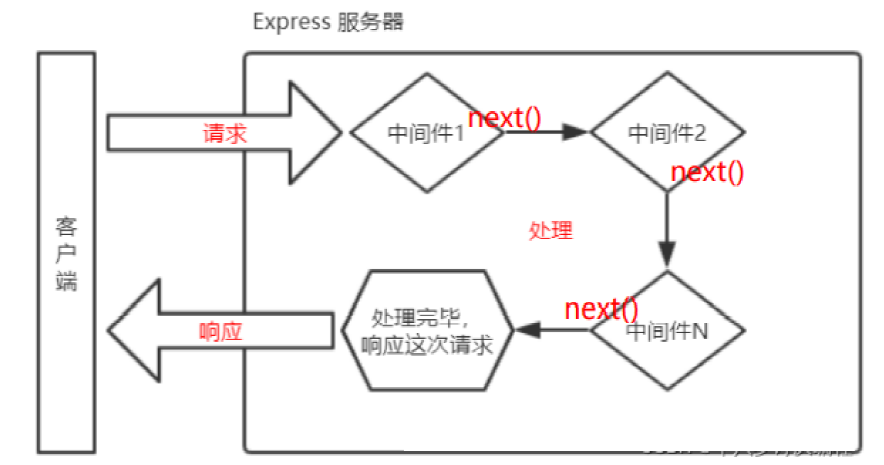

# 04-后端技术

## Node技术

Node技术指node.js技术，以下通过对node.js详细的功能介绍进行学习。

### Buffer模块

#### 概念

Buffer 是一个类似于数组的对象，用于表示固定长度的字节序列。本质是一段内存空间，专门用来处理二进制数据。


#### 特点

1. Buffer 大小固定且无法调整
2. Buffer 性能较好，可以直接对计算机内存进行操作
3. 每个元素的大小为 1 字节（byte）


#### 使用

##### Buffer创建

Node.js 中创建 Buffer 的方式主要如下几种：

1. Buffer.alloc

   ```js
   //使用Buffer.alloc创建
   {
     //创建了一个长度为 10 字节的 Buffer，相当于申请了 10 字节的内存空间，每个字节的值为 0
     let buf_1 = Buffer.alloc(10);
     console.log(buf_1); // 结果为 <Buffer 00 00 00 00 00 00 00 00 00 00>
   }
   ```
2. Buffer.allocUnsafe

   ```js
   //使用Buffer.allocUnsafe创建
   {
     //创建了一个长度为 10 字节的 Buffer，buffer 中可能存在旧的数据, 可能会影响执行结果，所以叫unsafe
     let buf_2 = Buffer.allocUnsafe(10);
     console.log(buf_2); // 结果为 <Buffer 00 00 00 00 00 00 00 00 00 00>
   }
   ```
3. Buffer.from

   ```js
   {
     //通过字符串创建 Buffer
     let buf_3 = Buffer.from("hello");
     //通过数组创建 Buffer
     let buf_4 = Buffer.from([105, 108, 111, 118, 101, 121, 111, 117]);
     console.log(buf_3, buf_4); // 结果为 <Buffer 68 65 6c 6c 6f> <Buffer 69 6c 6f 76 65 79 6f 75>
   }
   ```

##### Buffer转化

我们可以借助 toString 方法将 Buffer 转为字符串

```js
//Buffer 与字符串的转化
{
  let buf_5 = Buffer.from([105, 108, 111, 118, 101, 121, 111, 117]);
  console.log(buf_5.toString()); //结果为iloveyou
}
```

> toString 默认是按照 utf-8 编码方式进行转换的。

##### Buffer 读写

Buffer 可以直接通过[] 的方式对数据进行处理。

```js
//Buffer读取
{
  //读取
  let buf_6 = Buffer.from("hello");
  console.log(buf_6[1]); //结果为101
  //修改
  buf_6[1] = 97;
  //查看字符串结果
  console.log(buf_6.toString()); //结果为hallo
}
```

> 注意：
>
> 1. 如果修改的数值超过 255 ，则超过 8 位数据会被舍弃；
> 2. 一个 utf-8 的字符一般占 3 个字节；

### 文件模块

#### 基本简介

fs 全称为 file system ，称之为文件系统，是 Node.js 中的内置模块，可以对计算机中的磁盘进行操作。 本章节会介绍如下几个操作：

1. 文件写入
2. 文件读取
3. 文件移动与重命名
4. 文件删除
5. 文件夹操作
6. 查看资源状态

##### 文件写入

文件写入就是将数据保存到文件中，我们可以使用如下几个方法来实现该效果：

|方法 |说明 |
|---|---|
|writeFile |异步写入 |
|writeFileSync |同步写入 |
|appendFile / appendFileSync |追加写入 |
|createWriteStream |流式写入 |

##### 异步写入

writeFile，语法： fs.writeFile(file, data[, options], callback)

参数说明：

- file 文件名
- data 待写入的数据
- options 选项设置（可选）
  - {flag:'a'}表示为追加写入
- callback 写入回调

返回值： undefined

代码示例：

```js
// ========================================
// ===writeFile异步写入
// ===需求：
//    新建一个文件夹，座右铭.txt，写入内容，三人行，必有我师焉
// ========================================

// require 是 Node.js 环境中的'全局'变量，用来导入模块
const fs = require("fs");

//path 是 Node.js 的内置核心模块，专门用来处理和操作文件路径！
const path = require("path");

// 获取脚本所在目录的绝对路径和写入内容
const filePath = path.join(__dirname, "01-异步座右铭.txt");
const testContent = "三人行，必有我师焉！";

//将 『三人行，必有我师焉。』 写入到当前文件夹下的『座右铭.txt』文件中
/* fs.writeFile(filePath, testContent, err => {
  //如果写入失败，则回调函数调用时，会传入错误对象，如写入成功，会传入 null
  if (err) {
    console.log('写入失败~~~');
    return;
  }
  console.log('写入成功~~~');
}) */

//将 『三人行，必有我师焉。』 写入到当前文件夹下的『座右铭.txt』文件中，追加写入:{ flag: 'a' }
fs.writeFile(filePath, testContent, { flag: "a" }, (err) => {
  //如果写入失败，则回调函数调用时，会传入错误对象，如写入成功，会传入 null
  if (err) {
    console.log("写入失败~~~");
    return;
  }
  console.log("写入成功~~~");
});
```

##### 同步写入

writeFileSync，语法: fs.writeFileSync(file, data[, options])

参数与 fs.writeFile 大体一致，只是没有 callback 参数

返回值： undefined

代码示例：

```js
// ========================================
// ===writeFileSync同步写入
// ===需求：
// 新建一个文件夹，座右铭.txt，写入内容，三人行，必有我师焉
// ========================================

// require 是 Node.js 环境中的'全局'变量，用来导入模块
const fs = require("fs");

//path 是 Node.js 的内置核心模块，专门用来处理和操作文件路径！
const path = require("path");

// 获取脚本所在目录的绝对路径和写入内容
const filePath = path.join(__dirname, "02-同步座右铭.txt");
const testContent = "三人行，必有我师焉";

//将 『三人行，必有我师焉。』 写入到当前文件夹下的『座右铭.txt』文件中
fs.writeFileSync(filePath, testContent);
```

> Node.js 中的磁盘操作是由其他线程完成的，结果的处理有两种模式：
>
> 1. 同步处理 JavaScript 主线程会等待其他线程的执行结果，然后再继续执行主线程的代码，效率较低
> 2. 异步处理 JavaScript 主线程不会等待其他线程的执行结果，直接执行后续的主线程代码，效率较好

##### 追加写入

appendFile / appendFileSync。

appendFile 作用是在文件尾部追加内容，appendFile 语法与 writeFile 语法完全相同

语法:

- fs.appendFile(file, data[, options], callback)
- fs.appendFileSync(file, data[, options])

返回值： 二者都为 undefined

appendFile实例代码：

```js
// ========================================
// ===appendFile异步追加
// ===需求：
//    异步追加内容：择其善者而从之，择其不善者而改之
// ========================================

// require 是 Node.js 环境中的'全局'变量，用来导入模块
const fs = require("fs");

//path 是 Node.js 的内置核心模块，专门用来处理和操作文件路径！
const path = require("path");

// 获取脚本所在目录的绝对路径和写入内容
const filePath = path.join(__dirname, "01-异步座右铭.txt");
const testContent = "择其善者而从之，择其不善者而改之";

//将 『三人行，必有我师焉。』 写入到当前文件夹下的『座右铭.txt』文件中
fs.appendFile(filePath, testContent, (err) => {
  if (err) {
    console.log("写入失败", err);
    return;
  }
  console.log("写入成功~~~");
});
```

appendFileSync实例代码：

```js
// ========================================
// ===appendFileSync同步追加
// ===需求：
//    异步追加内容：择其善者而从之，择其不善者而改之
// ========================================

// require 是 Node.js 环境中的'全局'变量，用来导入模块
const fs = require("fs");

//path 是 Node.js 的内置核心模块，专门用来处理和操作文件路径！
const path = require("path");

// 获取脚本所在目录的绝对路径和写入内容
const filePath = path.join(__dirname, "02-同步座右铭.txt");
const testContent = "择其善者而从之，择其不善者而改之";

//将 『三人行，必有我师焉。』 写入到当前文件夹下的『座右铭.txt』文件中
fs.appendFileSync(filePath, testContent);
```

##### 流式写入

createWriteStream语法： fs.createWriteStream(path[, options])

参数说明：

- path 文件路径
- options 选项配置（ 可选）
- 返回值： Object

代码示例：

```js
// ========================================
// ===createWriteStream流式写入
// ===需求：
//    写入内容：写入一首诗
// ========================================

// require 是 Node.js 环境中的'全局'变量，用来导入模块
const fs = require("fs");

//path 是 Node.js 的内置核心模块，专门用来处理和操作文件路径！
const path = require("path");

// 获取脚本所在目录的绝对路径和写入内容
const filePath = path.join(__dirname, "05-观书有感.txt");

//创建写入流对象
const ws = fs.createWriteStream(filePath);

//写入文档
ws.write("床前明月光，\r\n");
ws.write("疑似地上霜，\r\n");
ws.write("举头望明月，\r\n");
ws.write("低头思故乡。\r\n");

//关闭文档流
ws.close();
```

> 程序打开一个文件是需要消耗资源的，流式写入可以减少打开关闭文件的次数。流式写入方式适用于大文件写入或者频繁写入的场景, writeFile 适合于写入频率较低的场景

##### 写入场景

文件写入在计算机中是一个非常常见的操作，下面的场景都用到了文件写入:

- 下载文件
- 安装软件
- 保存程序日志，如 Git
- 编辑器保存文件
- 视频录制

> 当需要持久化保存数据的时候，应该想到文件写入。

#### 文件读取

文件读取顾名思义，就是通过程序从文件中取出其中的数据，我们可以使用如下几种方式：

|方法 |说明 |
|---|---|
|readFile |异步读取 |
|readFileSync |同步读取 |
|createReadStream |流式读取 |

##### 异步读取

readFile。语法： fs.readFile(path[, options], callback)

参数说明：

- path 文件路径
- options 选项配置
- callback 回调函数
- 返回值： undefined

代码示例：

```js
// ========================================
// ===readFile异步读取
// ===需求：
//    读取01-异步座右铭.txt文件
// ========================================

// require 是 Node.js 环境中的'全局'变量，用来导入模块
const fs = require("fs");

//path 是 Node.js 的内置核心模块，专门用来处理和操作文件路径！
const path = require("path");

// 获取脚本所在目录的绝对路径和读取内容
const filePath = path.join(__dirname, "../00-操作文件/01-异步座右铭.txt");

//异步读取对应的文件,data为读取到的文件
fs.readFile(filePath, (err, data) => {
  if (err) {
    console.log("读取失败~~~");
    return;
  }
  console.log("读取成功:", data.toString());
});
```

##### 同步读取

readFileSync。语法： fs.readFileSync(path[, options])

参数说明：

- path 文件路径
- options 选项配置
- 返回值： string | Buffer

代码示例：

```js
// ========================================
// ===readFileSync同步读取
// ===需求：
//    读取01-同步座右铭.txt文件
// ========================================

// require 是 Node.js 环境中的'全局'变量，用来导入模块
const fs = require("fs");

//path 是 Node.js 的内置核心模块，专门用来处理和操作文件路径！
const path = require("path");

// 获取脚本所在目录的绝对路径和读取内容
const filePath = path.join(__dirname, "../00-操作文件/02-同步座右铭.txt");

//同步读取对应的文件,data为读取到的文件
let data = fs.readFileSync(filePath);
console.log(data.toString());
```

##### 流式读取

createReadStream 。语法： fs.createReadStream(path[, options])

参数说明：

- path 文件路径
- options 选项配置（ 可选）
- 返回值： Object

代码示例：

```js
// ========================================
// ===createReadStream流式读取
// ===需求：
//    读取05-观书有感.txt文件
// ========================================

// require 是 Node.js 环境中的'全局'变量，用来导入模块
const fs = require("fs");

//path 是 Node.js 的内置核心模块，专门用来处理和操作文件路径！
const path = require("path");

// 获取脚本所在目录的绝对路径和读取内容
const filePath = path.join(__dirname, "../00-操作文件/05-观书有感.txt");

//使用流式读取有以下几步：
let rs = fs.createReadStream(filePath);

//step1:绑定事件,chunk有块，大块的意思。每次取出65538字节，即 64k 数据后执行一次 data 回调
rs.on("data", (chunk) => {
  console.log(chunk.toString());
  console.log(chunk.length);
});

//读取完毕后, 执行 end 回调
rs.on("end", () => {
  console.log("读取完成！");
});
```

##### 读取场景

- 电脑开机
- 程序运行
- 编辑器打开文件
- 查看图片
- 播放视频
- 播放音乐
- Git 查看日志
- 上传文件
- 查看聊天记录

#### 小练习

1）使用同步读写方式实现文件的复制粘贴，源代码如下：

```js
/*
 * 需求：
 *     将source下的mp4文件复制一份新的
 *
 * 文件：01-复制文件之同步读写.js
 * 作用：使用同步读写方式实现
 */

// 1. 引入fs模块
const fs = require("fs");

// 2. 引入path模块
const path = require("path");

// 3. 创建读取和输出文件路径
const readFilePath = path.join(__dirname, "./source/汪小敏-笑看风云.mp4");
const writeFilePath = path.join(__dirname, "./source/汪小敏-笑看风云-2.mp4");

// 4. 同步读取文件
let readedData = fs.readFileSync(readFilePath);

// 5. 同步写入文件
fs.writeFileSync(writeFilePath, readedData);
```

2）使用异步读写方式实现文件的复制粘贴，源代码如下：

```js
/*
 * 需求：
 *     将source下的mp4文件复制一份新的
 *
 * 文件：02-复制文件之异步读写.js
 * 作用：使用异步读写方式实现
 */

// 1. 引入fs模块
const fs = require("fs");

// 2. 引入path模块
const path = require("path");

// 3. 创建读取和写入文件路径变量
const readFilePath = path.join(__dirname, "./source/汪小敏-笑看风云.mp4");
const writeFilePath = path.join(__dirname, "./source/汪小敏-笑看风云-3.mp4");

/*
 * 如下是在异步读取文件后直接调用异步写入data
 */
// 4. 异步读取文件
fs.readFile(readFilePath, (err, data) => {
  if (err) {
    console.log("err");
    return;
  }
  // 5. 异步写入文件
  fs.writeFile(writeFilePath, data, (err) => {
    if (err) {
      console.log("err");
      return;
    }
    console.log("复制成功！");
  });
});
```

3）使用流式读写方式实现文件的复制粘贴，源代码如下：

```js
/*
 * 需求：
 *     将source下的mp4文件复制一份新的
 *
 * 文件：03-复制文件之流式读写.js
 * 作用：使用异步读写方式实现
 */

// 1. 引入fs模块
const fs = require("fs");

// 2. 引入path模块
const path = require("path");

// 3. 创建读取和写入文件路径变量
const readFilePath = path.join(__dirname, "./source/汪小敏-笑看风云.mp4");
const writeFilePath = path.join(__dirname, "./source/汪小敏-笑看风云-4.mp4");

// 4. 创建流式读取
let rs = fs.createReadStream(readFilePath);

// 5. 创建流式写入
let ws = fs.createWriteStream(writeFilePath);

// 6. 流式读取绑定data事件
rs.on("data", (chunk) => {
  ws.write(chunk);
});

//读取完毕后, 执行 end 回调
rs.on("end", () => {
  console.log("读取完成！");
});
```

#### 移动重命名

在 Node.js 中，我们可以使用 rename 或 renameSync 来移动或重命名文件或文件夹

语法：

```js
fs.rename(oldPath, newPath, callback);
fs.renameSync(oldPath, newPath);
```

参数说明：

- oldPath 文件当前的路径
- newPath 文件新的路径
- callback 操作后的回调

代码示例：

```js
/*
 * 需求：
 *     1）将05-观书有感.txt文件移动到本路径下；
 *     2）将05-观书有感.txt文件重命名为观书有感重启版.txt
 *
 * 使用：该代码使用异步操作，同步操作不再演示
 */

// 1.引入fs模块
const fs = require("fs");

// 2.引入path模块
const path = require("path");

// 3.创建原始路径
const oldFilePath = path.join(__dirname, "../00-操作文件/05-观书有感.txt");
const NewMoveFilePath = path.join(__dirname, "观书有感重启版.txt");
const newRenameFilePath = path.join(
  __dirname,
  "../00-操作文件/05-观书有感重启版.txt",
);

/* // 4. 对原始文件重新命名
fs.rename(oldFilePath, newRenameFilePath, err => {
  if (err) {
    console.log('重命名错误~~~');
    return;
  }
  console.log('重命名成功！');
}) */

// 5. 对原始文件移动到新路径
fs.rename(oldFilePath, NewMoveFilePath, (err) => {
  if (err) {
    console.log("移动错误~~~");
    return;
  }
  console.log("移动成功！");
});
```

#### 文件删除

在 Node.js 中，我们可以使用 unlink 或 unlinkSync 来删除文件

语法：

```js
fs.unlink(path, callback);
fs.unlinkSync(path);
fs.rm(path, { param }, callback);
```

参数说明：

- path 文件路径
- callback 操作后的回调

代码示例：

```js
/*
 * 需求：
 *     1）将00-待删除文件-01.txt文件删除；
 *
 */
// 1. fs文件引入
const fs = require("fs");

// 2. 引入path
const path = require("path");

// 3. 设定删除文件的path路径
const filePath = path.join(__dirname, "../00-操作文件/00-待删除文件-01.txt");

/* // 4. 使用同步unlink方式删除文件
fs.unlinkSync(filePath); */

/* // 4. 使用异步unlink方式删除文件
fs.unlink(filePath, err => {
  if (err) {
    console.log('err');
    return
  }
  console.log('Success!!!');

}); */

// 4. fs.rm() - 删除文件或目录（Node.js 14.14.0+）
// recursive: true -- 表示递归删除
// force: true -- 表示强制删除
fs.rm(filePath, { recursive: true, force: true }, (err) => {
  if (err) {
    console.error("删除失败:", err);
    return;
  }
  console.log("删除成功");
});
```

#### 文件夹操作

借助 Node.js 的能力，我们可以对文件夹进行创建 、读取、 删除等操作。

|方法 |说明 |
|---|---|
|mkdir / mkdirSync |创建文件夹 |
|readdir / readdirSync |读取文件夹 |
|rmdir / rmdirSync |删除文件夹 |

##### 创建文件夹

在 Node.js 中，我们可以使用 mkdir 或 mkdirSync 来创建文件夹。

语法：

```js
fs.mkdir(path[, options], callback)
fs.mkdirSync(path[, options])
```

参数说明：

- path 文件夹路径
- options 选项配置（ 可选）
- callback 操作后的回调

示例代码：

```js
// 1. 引入fs
const fs = require("fs");

// 2. 引入path
const path = require("path");

// 3. 设定操作文件夹
const dirName = "00-操作文件 copy-001";
const opaDir = path.join(__dirname, "../" + dirName);

//创建文件夹
{
  // 4. 异步创建文件夹
  fs.mkdir(opaDir, (err) => {
    if (err) {
      console.log("错误！");
      return;
    }
    console.log("成功");
  });

  /*   // 4. 同步创建文件夹
    fs.mkdirSync(opaDir); */
}
```

##### 读取文件夹

在 Node.js 中，我们可以使用 readdir 或 readdirSync 来读取文件夹。

语法：

```js
fs.readdir(path[, options], callback)
fs.readdirSync(path[, options])
```

参数说明：

- path 文件夹路径
- options 选项配置（ 可选）
- callback 操作后的回调

示例代码：

```js
// 1. 引入fs
const fs = require("fs");

// 2. 引入path
const path = require("path");

// 3. 设定操作文件夹
const dirName = "00-操作文件 copy";
const opaDir = path.join(__dirname, "../" + dirName);

//读取文件夹
{
  // 5. 异步读取文件夹
  /*   fs.readdir(opaDir, (err, data) => {
      if (err) {
        console.log('错误！');
        return;
      }
      console.log(data);
  
  
    }) */

  // 5. 同步读取文件夹
  const files = fs.readdirSync(opaDir);
  console.log(files);
}
```

##### 删除文件夹

在 Node.js 中，我们可以使用 rmdir 或 rmdirSync 来删除文件夹。

语法：

```js
fs.rmdir(path[, options], callback)
fs.rmdirSync(path[, options])
```

参数说明：

- path 文件夹路径
- options 选项配置（ 可选）
- callback 操作后的回调

示例代码：

```js
// 1. 引入fs
const fs = require("fs");

// 2. 引入path
const path = require("path");

// 3. 设定操作文件夹
const dirName = "00-操作文件 copy 2";
const opaDir = path.join(__dirname, "../" + dirName);

//删除文件夹
{
  // 6. 异步删除单一文件夹
  /*   fs.rmdir(opaDir, err => {
      if (err) {
        console.log('错误！');
        return;
      }
      console.log(data);
    }) */

  // 6. 异步删除递归文件夹
  /*   fs.rmdir(opaDir, { recursive: true }, err => {
      if (err) {
        console.log('错误！');
        return;
      }
      console.log('递归删除');
    }) */

  // 6. 同步读取文件夹
  fs.rmdirSync(opaDir, { recursive: true });
}
```

#### 资源状态

在 Node.js 中，我们可以使用 stat 或 statSync 来查看资源的详细信息。

语法：

```js
fs.stat(path[, options], callback)
fs.statSync(path[, options])
```

参数说明：

- path 文件夹路径
- options 选项配置（ 可选）
- callback 操作后的回调

示例代码：

```js
// 1. 引入fs
const fs = require("fs");

// 2. 引入path
const path = require("path");

// 3. 设定需要获取的文件路径
const fileName = "00-待删除文件-02.txt";
const pathName = path.join(__dirname, "../00-操作文件/" + fileName);

/* // 4.异步获取资源状态新
fs.stat(pathName, (err, data) => {
  if (err) {
    console.log(err);
    return;
  }
  console.log('dev:' + data.dev, 'mode:' + data.mode, 'nlink:' + data.nlink, 'uid:' + data.uid, 'gid:' + data.gid, 'rdev:' + data.rdev, 'atimeMs:' + data.atimeMs, 'size:' + data.size + ' MB', 'blocks:' + data.blocks,);

}) */

// 4.同步获取资源状态新
const data = fs.statSync(pathName);
console.log(
  "dev:" + data.dev,
  "mode:" + data.mode,
  "nlink:" + data.nlink,
  "uid:" + data.uid,
  "gid:" + data.gid,
  "rdev:" + data.rdev,
  "atimeMs:" + data.atimeMs,
  "size:" + data.size + " MB",
  "blocks:" + data.blocks,
);
```

> 结果值对象结构：
>
> - size 文件体积
> - birthtime 创建时间
> - mtime 最后修改时间
> - isFile 检测是否为文件
> - isDirectory 检测是否为文件夹
> - ....

#### 路径问题

fs 模块对资源进行操作时，路径的写法有两种：

##### 相对路径

- ./座右铭.txt 当前目录下的座右铭.txt
- 座右铭.txt 等效于上面的写法
- ../座右铭.txt 当前目录的上一级目录中的座右铭.txt

##### 绝对路径

- D:/Program Files windows 系统下的绝对路径
- /usr/bin Linux 系统下的绝对路径

> 相对路径中所谓的当前目录，指的是命令行的工作目录，而并非是文件的所在目录。 所以当命令行的工作目录与文件所在目录不一致时，会出现一些 BUG

#### __dirname

dirname 与 require 类似，都是 Node.js 环境中的'全局'变量。

dirname 保存着当前文件所在目录的绝对路径，可以使用 __dirname 与文件名拼接成绝对路径 代码示例：

```js
// 1. 引入fs
const fs = require("fs");

// 2. 引入path
const path = require("path");

// 3. 设定需要获取的文件路径
const fileName = "00-待删除文件-02.txt";
const pathName = path.join(__dirname, "../00-操作文件/" + fileName);

/* // 4.异步获取资源状态新
fs.stat(pathName, (err, data) => {
  if (err) {
    console.log(err);
    return;
  }
  console.log('dev:' + data.dev, 'mode:' + data.mode, 'nlink:' + data.nlink, 'uid:' + data.uid, 'gid:' + data.gid, 'rdev:' + data.rdev, 'atimeMs:' + data.atimeMs, 'size:' + data.size + ' MB', 'blocks:' + data.blocks,);

}) */

// 4.同步获取资源状态新
const data = fs.statSync(pathName);
console.log(
  "dev:" + data.dev,
  "mode:" + data.mode,
  "nlink:" + data.nlink,
  "uid:" + data.uid,
  "gid:" + data.gid,
  "rdev:" + data.rdev,
  "atimeMs:" + data.atimeMs,
  "size:" + data.size + " MB",
  "blocks:" + data.blocks,
);
```

> 使用 fs 模块的时候，尽量使用 __dirname 将路径转化为绝对路径，这样可以避免相对路径产生的Bug。

#### 模块练习

> 1. 编写一个 JS 文件，实现复制文件的功能
> 2. 文件重命名

```js
/*
 * 需求：
 *     1）对文件名中以"-"分割；
 *     2）将"-"前面的数字后面都加上指定的特定字符串；
 *
 */
// 1. 引入fs
const fs = require("fs");

// 2.引入path
const path = require("path");

// 3. 创建需要批量重命名文件夹路径
const renameDir = path.join(__dirname, "../00-操作文件");

// 4. 指定需要增加指定字符串
const preStr = "_change_";

// 5. 通过文件夹操作遍历文件夹内所有文件
fs.readdir(renameDir, (err, dataArr) => {
  if (err) {
    console.log(renameDir + ":读取错误！");
  } else {
    //此时拿到的dataArr就是一个数组
    for (let i = 0; i < dataArr.length; i++) {
      // console.log(dataArr[i].split('-'));

      let index = dataArr[i].indexOf("-");
      //分割后的前部分
      let unmodifiedFileFirstStr = "";
      //分割后的后部分
      let unmodifiedFileSecondStr = "";
      if (index != -1) {
        unmodifiedFileFirstStr = dataArr[i].substring(0, index);
        unmodifiedFileSecondStr = dataArr[i].substring(index + 1);
      }

      //将前缀拼接成期待的文件前缀字符串，modifiedFileFirstStr是之后的文件名称字符串分割
      let modifiedFileFirstStr = unmodifiedFileFirstStr + preStr;
      // console.log(renameFilePreNameStr);

      //将dataArr中保留的文件名称拼接成想要的文件名称,modifiedFileAllName就是更新之后文件的名字
      let modifiedFileAllName = modifiedFileFirstStr + unmodifiedFileSecondStr;

      // console.log(renameDir + '\\' + dataArr[i], renameDir + '\\' + modifiedFileAllName);

      //文件名称修改
      fs.rename(
        renameDir + "\\" + dataArr[i],
        renameDir + "\\" + modifiedFileAllName,
        (err) => {
          if (err) {
            console.log("处理异常");
            return;
          } else console.log("处理成功，请确认！");
        },
      );
    }
  }
});
```

### 路径模块

#### Path模块

path 模块提供了操作路径的功能，我们将介绍如下几个较为常用的几个 API：

|API |说明 |
|:---:|:---:|
|path.resolve |拼接规范的绝对路径 常用 |
|path.join |拼接规范的相对路径或绝对路径 常用 |
|path.sep |获取操作系统的路径分隔符 |
|path.parse |解析路径并返回对象 |
|path.basename |获取路径的基础名称 |
|path.dirname |获取路径的目录名 |
|path.extname |获得路径的扩展名 |

代码示例：

```js
const path = require("path");
//获取路径分隔符
console.log(path.sep);
//拼接绝对路径
console.log(path.resolve(__dirname, "test"));
//解析路径
let pathname = "D:/program file/nodejs/node.exe";
console.log(path.parse(pathname));
//获取路径基础名称
console.log(path.basename(pathname));
//获取路径的目录名
console.log(path.dirname(pathname));
//获取路径的扩展名
console.log(path.extname(pathname));
```

> path.join路径分开传：
>
> ```js
> // 正确拼接路径
> const dbOperatePath = path.join(process.cwd(), "src", "database", "lowdb", "dbOperate.js");
> const dbOperate = require(dbOperatePath);
> ```

#### cwd路径

不管你从 `bin/www`、根目录、任何文件夹启动项目，`process.cwd()` 永远返回命令行执行时的根文件夹。

```js
// src/lowdb/lowdbOper.js
const path = require('path')
// process.cwd() = 程序启动时的工作目录，也就是【项目根目录】
require('dotenv').config({
  path: path.join(process.cwd(), '.env')
})
```

#### 第三方库

moduleAliases是第三方库，可以配置package.json后实现路径引用问题，此为目前最主要使用方式，具体安装方式如下：

```bash
PS F:\CodingMan\Code2Git\01-Stu\04-BackEnd\06-Projects\01-myAccounts> npm i module-alias

added 1 package in 802ms

10 packages are looking for funding
  run `npm fund` for details
```

> * 路径映射
>   * package.json配置如下：
>
> ```json
> "_moduleAliases": {
>     "@bin": "./bin",
>     "@middleware": "./middleware",
>     "@public": "./public",
>     "@routes": "./routes",
>     "@views": "./views",
>     "@MongoDB": "./src/database/MongoDBV2dot1"
>   }
> ```
>
> * 引用路径
>   * 按照如下方式使用：
>
> ```js
> const expend = require("@middleware/listenExpend.js");
> ```

### HTTP协议

#### 定义与解析

##### 概念

HTTP（hypertext transport protocol）协议；中文叫超文本传输协议 是一种基于TCP/IP的应用层通信协议 这个协议详细规定了浏览器和万维网服务器之间互相通信的规则。 协议中主要规定了两个方面的内容

- 客户端：用来向服务器发送数据，可以被称之为请求报文
- 服务端：向客户端返回数据，可以被称之为响应报文

> 报文：可以简单理解为就是一堆字符串

##### 请求报文

- 请求行
- 请求头
- 空行
- 请求体

##### 请求行

- 请求方法（get、post、put、delete等）
- 
  ##### 请求 URL（统一资源定位器）

例如： [http://www.baidu.com:80/index.html?a=100&b=200#logo](http://www.baidu.com/index.html?a=100&b=200#logo)

- http： 协议（https、ftp、ssh等）
- [www.baidu.com](typora://app/typemark/www.baidu.com) 域名
- 80 端口号
- /index.html 路径
- a=100&b=200 查询字符串
- #logo 哈希（锚点链接）
- HTTP协议版本号

###### 请求头

格式：『头名：头值』

常见的请求头有：

|请求头 |解释 |
|---|---|
|Host |主机名 |
|Connection |连接的设置keep-alive（保持连接）；close（关闭连接） |
|Cache-Control |缓存控制 (没有缓存) $\max-\mathrm{age}=0$ |
|Upgrade- Insecure- Requests |将网页中的http请求转化为https请求（很少用）老网站升级 |
|User-Agent |用户代理，客户端字符串标识，服务器可以通过这个标识来识别这个请求来自 哪个客户端，一般在PC端和手机端的区分 |
|Accept |设置浏览器接收的数据类型 |
|Accept-Encoding |设置接收的压缩方式 |
|Accept- Language |设置接收的语言 为喜好系数，满分为1 $q=0.7$ |
|Cookie |后面单独讲 |

具体详细信息请参考：https://developer.mozilla.org/zh-CN/docs/Web/HTTP/Reference/Headers

##### 请求体

请求体内容的格式是非常灵活的，

(可以是空) -> GET请求，

(也可以是字符串，还可以是JSON) -> POST请求

例如：

- 字符串：keywords=-手机&price=2000;
- JSON:"keywords":"手机，"price'":2o0o

##### 响应报文

- 响应行
  - HTTP/1.1 200 OK
  - HTTP/1.1：HTTP协议版本号
  - 200：响应状态码 404 Not Found 500 Internal Server Error，还有一些状态码，参考： https://developer.mozilla.org/zh-CN/docs/Web/HTTP/Status
  - OK：响应状态描述

  > 响应状态码和响应字符串关系是一一对应的。
- 响应头

```cmd
Cache-Control:缓存控制 private 私有的，只允许客户端缓存数据
Connection 链接设置
Content-Type:text/html;charset=utf-8 设置响应体的数据类型以及字符集,响应体为html，字符集
utf-8
Content-Length:响应体的长度，单位为字节
```

- 空行
- 响应体
  - 响应体内容的类型是非常灵活的，常见的类型有 HTML、CSS、JS、图片、JSON

##### 网页URL

网页中的 URL 主要分为两大类：相对路径与绝对路径。

**绝对路径**

绝对路径可靠性强，而且相对容易理解，在项目中运用较多。

|形式 |特点 |
|---|---|
|http://atguigu.com/web |直接向目标资源发送请求，容易理解。网站的外链会用到此形式 |
|//atguigu.com/web |与页面URL的协议拼接形成完整URL再发送请求。大型网站用的比较多 |
|/web |与页面URL的协议、主机名、端口拼接形成完整URL再发送请求。中小 型网站 |

**相对路径**

相对路径在发送请求时，需要与当前页面 URL 路径进行计算，得到完整 URL 后，再发送请求，学习阶段用的较多，例如当前网页 url 为 http://www.atguigu.com/course/h5.html

|形式 |最终的URL |
|---|---|
|./css/app.css |http://www.atguigu.com/course/css/app.css |
|js/app.js |http://www.atguigu.com/course/js/app.js |
|../img/logo.png |http://www.atguigu.com/img/logo.png |
|../../mp4/show.mp4 |http://www.atguigu.com/mp4/show.mp4 |

#### 创建 HTTP

使用 nodejs 创建 HTTP 服务

##### 操作步骤

```js
// 1. 引入http
const http = require("http");

// 2. 创建http对象
const server = http.createServer((request, response) => {
  response.setHeader("content-type", "text/html;charset=utf-8");
  response.end("你好，服务启动" + "Hello Server Start..."); //设置响应体
});

// 3. 监听端口，启动服务，http://127.0.0.1:9000
server.listen(9000, () => {
  console.log("服务已经启动...");
});
```

> http.createServer 里的回调函数的执行时机： 当接收到 HTTP 请求的时候，就会执行

##### 测试

浏览器请求对应端口`http://127.0.0.1:9000`

##### 注意事项

1. 命令行 ctrl + c 停止服务
2. 当服务启动后，更新代码必须重启服务才能生效
3. 响应内容中文乱码的解决办法

   `response.setHeader('content-type','text/html;charset=utf-8');`
4. 端口号被占用

`Error: listen EADDRINUSE: address already in use :::9000`

1）关闭当前正在运行监听端口的服务 （ 使用较多）

2）修改其他端口号

1. HTTP 协议默认端口是 80 。HTTPS 协议的默认端口是 443, HTTP 服务开发常用端口有 3000， 8080，8090，9000 等

> 如果端口被其他程序占用，可以使用资源监视器找到占用端口的程序，然后使用任务管理器关闭 对应的程序

#### 请求报文

##### 查看报文

- 点击步骤


- 查看请求行与请求头


- 查看请求体


- 查看 URL 查询字符串


- 查看响应行与响应头


- 查看响应体


##### 获取报文

想要获取请求的数据，需要通过 request 对象

|含义 |语法 |重点掌握 |
|---|---|---|
|请求方法 |request.method |* |
|请求版本 |request.httpVersion |   |
|请求路径 |request.url |* |
|URL路径 |require('url').parse(request.url).pathname |* |
|URL查询字符串 |require('url').parse(request.url, true).query |* |
|请求头 |request.headers |* |
|请求体 |request.on('data',function(chunk){}) request.on('end',function(){}); |   |

注意事项：

1. request.url 只能获取路径以及查询字符串，无法获取 URL 中的域名以及协议的内容
2. request.headers 将请求信息转化成一个对象，并将属性名都转化成了『小写』
3. 关于路径：如果访问网站的时候，只填写了 IP 地址或者是域名信息，此时请求的路径为『/ 』
4. 关于 favicon.ico：这个请求是属于浏览器自动发送的请求

```js
/*
 * 项目：02-提取HTTP报文.js
 *
 */
// 1. 引入 HTTP 模块
const http = require("http");

// 2. 创建服务对象
const server = http.createServer((request, response) => {
  /* //获取请求的方法
  console.log(request.method); */

  /* //获取请求的 url,只包含 url 中的路径与查询字符串
  console.log(request.url); */

  /* //获取 HTTP 协议的版本号
  console.log(request.httpVersion); */

  //获取 HTTP 的请求头:127.0.0.1:9000
  console.log(request.headers.host);

  //设置响应体,传递给浏览器的数据
  response.end("I have seen it.");
});

// 3. 监听端口，启动服务，http://127.0.0.1:9000
server.listen(9000, () => {
  console.log("服务已经启动...");
});
/*
 * 项目：03-提取HTTP报文的请求体.js
 *
 */
// 1. 引入http
const http = require("http");

// 2. 创建服务对象
const server = http.createServer((request, response) => {
  //1. 声明一个变量
  let body = "";

  //2. 绑定data事件,'data' 是一个事件名称，当请求体（request body）的数据到达时触发；chunk 是数据块，是每次 'data' 事件触发时传递的参数。
  request.on("data", (chunk) => {
    body += chunk;
  });

  //3. 绑定end事件
  request.on("end", () => {
    //body:'username=12&password=12313'
    console.log(body);

    //设置响应体
    response.end("I have seen it.");
  });
});

// 3. 监听端口，启动服务，http://127.0.0.1:9000
server.listen(9000, () => {
  console.log("服务已经启动...");
});
/*
 * 项目：04 提取HTTP报文中URL的路径与查询字符串.js
 *
 */
// 1. 引入http模块,url模块
const http = require("http");
const url = require("url");

// 2. 创建服务对象
const server = http.createServer((request, response) => {
  //a. 解析request.url:/index-test/http
  // console.log(request.url);

  //request.url:只包含路径和查询字符串部分，不包含协议、主机名、端口等
  //true:将查询字符串解析为对象
  let res = url.parse(request.url, true);

  //所以打印出来的res很多在request.url不包含的都是null
  console.log(res);

  //b. 路径
  let pathname = res.pathname;

  //只获取res里面的pathname信息：/index-test/http
  // console.log(pathname);

  //c. 查询字符串
  let keyword = res.query.keyword;

  //只获取res里面的query.keyword信息：query为null，所以获取的也是null
  console.log(keyword);

  response.end("I have seen it.");
});

//3.监听端口
server.listen(9000, () => {
  console.log("I am listening...");
});
/*
 * 项目：05-提取HTTP报文中URL的路径与查询字符串.js
 *
 */
// 1. 导入 http 模块
const http = require("http");

// 2. 创建服务对象
const server = http.createServer((request, response) => {
  //实例化 URL 的对象
  // let url = new URL('/search?a=100&b=200', 'http://127.0.0.1:9000');
  console.log("我是01_" + request.url);

  //request.url:要解析的 URL 字符串（可以是相对路径或绝对路径）
  //http://127.0.0.1:基础 URL（当 urlString 是相对路径时必需）
  let url = new URL(request.url, "http://127.0.0.1");

  //输出路径
  console.log("我是02_" + url);
  console.log("我是02_" + url.pathname);

  //输出 keyword 查询字符串
  console.log("我是03_" + url.searchParams.get("keyword"));

  response.end("I have seen it.");
});

// 3. 监听端口, 启动服务
server.listen(9000, () => {
  console.log("I am listening...");
});
```

##### 阶段练习

按照以下要求搭建 HTTP 服务

|请求类型(方法) |请求地址 |响应体结果 |
|---|---|---|
|get |/login |登录页面 |
|get |/reg |注册页面 |

```js
// ========================================
// =项目名称：06-HTTP报文练习.js
// =需求：
//    1）请求方法：get，路径：/login，响应体结果为：登录页面
//    2）请求方法：get，路径：/reg,响应体结果为：注册页面
// ========================================

// 1. 导入 http 模块
const http = require("http");

// 2. 创建服务对象
const server = http.createServer((request, response) => {
  // 2.1 获取请求方法
  let methods = request.method;

  // 2.2 获取路径方法
  let urls = new URL(request.url, "http://127.0.0.1");

  /* // 测试输出获取的方法
  console.log('01-' + methods, '02-' + urls, '03-' + urls.pathname); */

  // 2.3 实现功能
  if (methods === "GET" && urls.pathname === "/login") {
    response.end("Success Login!");
    console.log(
      "methods:" +
        methods +
        ";urls.pathname:" +
        urls.pathname +
        "; Connecting. Success Login!",
    );
  } else if (methods === "GET" && urls.pathname === "/reg") {
    response.end("Success Register!");
    console.log(
      "methods:" +
        methods +
        ";urls.pathname:" +
        urls.pathname +
        "; Connecting. Success Register!",
    );
  } else if (methods === "GET" && urls.pathname === "/favicon.ico") {
    response.end("Ignore:favicon.ico");
    console.log(
      "methods:" +
        methods +
        ";urls.pathname:" +
        urls.pathname +
        "; Connecting. But it is favicon.ico files.",
    );
  } else {
    response.end("Not Found.");
    console.log(
      "methods:" +
        methods +
        ";urls.pathname:" +
        urls.pathname +
        "; Connecting. But Not Found.",
    );
  }
});

// 3. 监听端口, 启动服务
server.listen(9000, () => {
  console.log("I am listening...");
});
```

#### 响应报文

##### 设置报文

|作用 |语法 |
|---|---|
|设置响应状态码 |response.statusCode |
|设置响应状态描述 |response.statusMessage （用的非常少） |
|设置响应头信息 |response.setHeader('头名,'头值') |
|设置响应体 |response.write('") response.end('xxx') |

```js
// 1. 引入http模块
const http = require("http");

// 2. 创建服务对象
const server = http.createServer((request, response) => {
  // a. 设置响应状态码
  response.statusCode = 203;

  // b. 响应状态的描述
  response.statusMessage = "i love you";

  // c. 响应头
  response.setHeader("content-type", "text/html;charset=utf-8");
  response.setHeader("Server", "node.js");
  response.setHeader("myHeader", "lulululalala");
  response.setHeader("test", ["a", "b", "c"]);

  // d. 响应体的设置,一般设置了write，就不会在response.end设置了。response.end();
  response.write("Approved.Plesase go ahead.");

  // e. 设置响应结束，只能有1个end方法，end和write内的内容选择一个即可
  response.end();
});

// 3. 监听端口，启动服务器
server.listen(9000, () => {
  console.log("I am listening.");
});
```

##### 阶段练习

搭建 HTTP 服务，响应一个 4 行 3 列的表格，并且要求表格有隔行换色效果，且点击单元格能高亮显示

```js
// ========================================
// =项目名称：02-HTTP响应练习-结合体.js
// =需求：
//    1）搭建 HTTP 服务
//    2）响应一个 4 行 3 列的表格
//    3) 表格有隔行换色效果，且点击单元格能高亮显示
// ========================================
// 1. 引入http模块
const http = require("http");

// 2. 创建服务对象
const server = http.createServer((request, response) => {
  // 响应结果
  response.end(`
    <!DOCTYPE html>
<html lang="en">

<head>
  <meta charset="UTF-8">
  <meta name="viewport" content="width=device-width, initial-scale=1.0">
  <title>Document</title>
  <style>
    td {
      padding: 20px 40px;
      border: 1px orange solid;
    }

    tr:nth-child(even) {
      background-color: yellowgreen;
    }

    tr:nth-child(odd) {
      background-color: lightblue;
    }
  </style>
</head>

<body>
  <table>
    <tr><td></td><td></td><td></td></tr>
    <tr><td></td><td></td><td></td></tr>
    <tr><td></td><td></td><td></td></tr>
    <tr><td></td><td></td><td></td></tr>
  </table>
</body>
<script>
  //获取所有的td
  let tds = document.querySelectorAll('td');
  //遍历
  tds.forEach(item => {
    item.onclick = function () {
      this.style.background = 'black';
    }
  })
</script>

</html>
    `);
});

// 3. 监听端口，启动服务器
server.listen(9000, () => {
  console.log("I am listening.");
});
// ========================================
// =项目名称：02-HTTP响应练习-拆分体.js
// =需求：
//    1）搭建 HTTP 服务
//    2）响应一个 4 行 3 列的表格
//    3) 表格有隔行换色效果，且点击单元格能高亮显示
// ========================================
// 1. 引入http fs模块
const http = require("http");
const fs = require("fs");

// 2. 创建服务对象
const server = http.createServer((request, response) => {
  //异步读取文件
  const htmlPath = __dirname + "/02-HTTP响应练习_demo.html";

  fs.readFile(htmlPath, (err, data) => {
    if (err) {
      console.log("Please Read the Error.");
      return;
    } else {
      response.end(data);
    }
  });
});

// 3. 监听端口，启动服务器
server.listen(9000, () => {
  console.log("I am listening.");
});
```

#### 资源加载

##### 基本概念


网页资源的加载都是循序渐进的，首先获取 HTML 的内容， 然后解析 HTML 在发送其他资源的请求，如CSS，Javascript，图片等。理解

了这个内容对于后续的学习与成长有非常大的帮助。

##### 阶段训练

```js
// ========================================
// =项目名称：04-HTTP响应练习-资源获取.js
// =需求：
//    1）搭建 HTTP 服务
//    2）响应一个 4 行 3 列的表格
//    3) 表格有隔行换色效果，且点击单元格能高亮显示
// ========================================
// 1. 引入http fs模块
const http = require("http");
const fs = require("fs");

// 2. 创建服务对象
const server = http.createServer((request, response) => {
  //因为要获取的html内含css和js文件，都是单独请求的，所以，需要根据请求头url来进行确定是哪个请求，提供哪个数据
  //异步读取文件
  const htmlPath = __dirname + "/Sources/HTTP响应练习_资源引入demo.html";
  const cssPath = __dirname + "/Sources/index.css";
  const jsPath = __dirname + "/Sources/index.js";

  let urlAdd = new URL(request.url, "http://127.0.0.1");
  // console.log(urlAdd.pathname);

  //此为读取html的方法
  if (urlAdd.pathname === "/login") {
    readHtml();
  }
  //此为读取css的方法
  else if (urlAdd.pathname === "/index.css") {
    readCss();
  }

  //读取js文件
  else if (urlAdd.pathname === "/index.js") {
    readJs();
  } else {
    response.statusCode = "404";
    response.end("Err. Not Find Any Com...");
  }

  //此为读取html的方法
  function readHtml() {
    fs.readFile(htmlPath, (err, data) => {
      if (err) {
        console.log("Read html File Err.Please Read the Error Msg..");
        return;
      } else {
        response.end(data);
      }
    });
  }

  //此为读取css的方法
  function readCss() {
    fs.readFile(cssPath, (err, data) => {
      if (err) {
        console.log("Read css File Err.Please Read the Error Msg..");
        return;
      } else {
        response.end(data);
      }
    });
  }

  //此为读取js的方法
  function readJs() {
    fs.readFile(jsPath, (err, data) => {
      if (err) {
        console.log("Read js File Err.Please Read the Error Msg..");
        return;
      } else {
        response.end(data);
      }
    });
  }
});

// 3. 监听端口，启动服务器
server.listen(9000, () => {
  console.log("I am listening.");
});
```

##### 资源类别

- 静态资源是指内容长时间不发生改变的资源，例如图片，视频，CSS 文件，JS文件，HTML文件，字体文件等；
- 动态资源是指内容经常更新的资源，例如百度首页，网易首页，京东搜索列表页面等

##### 静资服务

可以解决痛点：

- 减少判断
- 访问速度提升

项目要求

创建一个HTTP服务，端口为9000,满足如下需求：

- GET /index.html 响应 page/index.html的文件内容；
- GET /css/app.css 响应 page/css/app.css的文件内容；
- GET /images/logo.png 响应 page/images/logo,png的文件内容；

```js
// ========================================
// =项目名称：05-HTTP响应练习-静态资源搭建.js
// =需求：
//    1）GET  /index.html   响应  index.html的文件内容
//    2）GET  /css/index.css  响应  css/index.css的文件内容
//    3) GET  /images/logo.png  响应  images/logo,png的文件内容
// ========================================
// 1. 引入http fs模块
const http = require("http");
const fs = require("fs");

// 2. 创建服务对象
const server = http.createServer((request, response) => {
  let urlAdd = new URL(request.url, "http://127.0.0.1");
  // console.log(urlAdd.pathname);

  //拼接路径
  let filePath = __dirname + "/Sources/02-静态资源" + urlAdd.pathname;
  console.log("拼接路径：" + filePath);

  //异步读取
  fs.readFile(filePath, (err, data) => {
    if (err) {
      console.log("Read html File Err.Please Read the Error Msg..");
      response.end("文件读取失败~");
      return;
    } else {
      response.end(data);
    }
  });
});

// 3. 监听端口，启动服务器
server.listen(9000, () => {
  console.log("I am listening.");
});
```

- **网站根目录或静态资源目录**

HTTP 服务在哪个文件夹中寻找静态资源，那个文件夹就是静态资源目录，也称之为网站根目录。

> 思考：vscode 中使用 live-server 访问 HTML 时， 它启动的服务中网站根目录是谁？

- **网页中使用 URL 的场景小结**

包括但不限于如下场景：

- a 标签 href
- link 标签 href
- script 标签 src
- img 标签 src
- video audio 标签 src
- form 中的 action
- AJAX 请求中的 URL

##### 资源类型

媒体类型（通常称为 Multipurpose Internet Mail Extensions 或 MIME 类型 ）是一种标准，用来表示文档、文件或字节流的性质和格

式。

HTTP 服务可以设置响应头 Content-Type 来表明响应体的 MIME 类型，浏览器会根据该类型决定如何处理资源。下面是常见文件对应的

mime 类型：

```js
html: 'text/html',
css: 'text/css',
js: 'text/javascript',
png: 'image/png',
jpg: 'image/jpeg',
gif: 'image/gif',
mp4: 'video/mp4',
mp3: 'audio/mpeg',
json: 'application/json'
```

> 对于未知的资源类型，可以选择 application/octet-stream 类型，浏览器在遇到该类型的响应时，会对响应体内容进行独立存储，也就是我们常见的下载效果

```js
// ========================================
// =项目名称：06-HTTP响应练习-MIME+解决乱码.js
// =需求：
//    1）GET  /index.html   响应  index.html的文件内容
//    2）GET  /css/index.css  响应  css/index.css的文件内容
//    3) GET  /images/logo.png  响应  images/logo,png的文件内容
//    4) 增加MIME：媒体类型， Multipurpose Internet Mail Extensions ，是一种标准，用来表示文档、文件或字节流的性质和格式
//    5）解决中文乱码问题
// ========================================
// 1. 引入http fs模块
const http = require("http");
const fs = require("fs");
const path = require("path");

//创建MIME对象用于检索，实际上，html内部已经设置了MIME类型，重新设定优先级>html内置优先级
/* ** charset=utf-8：中文乱码问题的解决方案：response.setHeader('content-type',type+';charset=utf-8');
 ** 在html内置了charset=utf-8 ，所以，不会乱码，但是单独访问js,css文件会存在乱码问题
 ** 可加可不加
 */
const mimes = {
  html: "text/html",
  css: "text/css",
  js: "text/javascript",
  png: "image/png",
  jpg: "image/jpeg",
  gif: "image/gif",
  mp4: "video/mp4",
  mp3: "audio/mpeg",
  json: "application/json",
};

// 2. 创建服务对象
const server = http.createServer((request, response) => {
  let urlAdd = new URL(request.url, "http://127.0.0.1");
  // console.log(urlAdd.pathname);

  //拼接路径,可以拼接处对应不同的数据请求类型，如：index.js/index.css/logo.png
  let filePath = __dirname + "/Sources/02-静态资源" + urlAdd.pathname;
  console.log("拼接路径：" + filePath);

  //异步读取
  fs.readFile(filePath, (err, data) => {
    if (err) {
      console.log("Read html File Err.Please Read the Error Msg..");
      response.end("文件读取失败~");
      return;
    } else {
      //获取文件的后缀，也就是文件类型
      //slice(1):获取从索引1以后的所有数据
      let ext = path.extname(filePath).slice(1);

      //获取对应的类型
      let type = mimes[ext];
      if (type) {
        //匹配到了,type+';charset=utf-8':增加了解码说明，防止查看文件乱码
        response.setHeader("content-type", type + ";charset=utf-8");
      } else {
        //没有匹配到了
        response.setHeader("content-type", application / octet - stream);
      }
      response.end(data);
    }
  });
});

// 3. 监听端口，启动服务器
server.listen(9000, () => {
  console.log("I am listening.");
});
```

#### GET 和 POST

GET 请求的情况：

- 在地址栏直接输入 url 访问
- 点击 a 链接
- link 标签引入 css
- script 标签引入 js
- img 标签引入图片
- form 标签中的 method 为 get （不区分大小写）
- ajax 中的 get 请求

POST 请求的情况：

- form 标签中的 method 为 post（不区分大小写）
- AJAX 的 post 请求

**GET和POST请求的区别**

GET 和 POST 是 HTTP 协议请求的两种方式。

- GET 主要用来获取数据，POST 主要用来提交数据
- GET 带参数请求是将参数缀到 URL 之后，在地址栏中输入 url 访问网站就是 GET 请求，POST 带参数请求是将参数放到请求体中
- POST 请求相对 GET 安全一些，因为在浏览器中参数会暴露在地址栏
- GET 请求大小有限制，一般为 2K，而 POST 请求则没有大小限制

### Node模块

#### 基本介绍

- 将一个复杂的程序文件依据一定规则（规范）拆分成多个文件的过程称之为模块化，其中拆分出的每个文件就是一个模块，模块的内

  部数据是私有的，不过模块可以暴露内部数据以便其他模块使用；
- 编码时是按照模块一个一个编码的， 整个项目就是一个模块化的项目；
- module.exports/exports/require 这些都是 CommonJS 模块化规范中的内容。而 Node.js 是实现了 CommonJS 模块化规范，二者关系有点像 JavaScript 与 ECMAScript。
- 下面是模块化的一些好处：
  - 防止命名冲突
  - 高复用
  - 高维护性

#### 暴露数据

##### 初步体验

可以通过下面的操作步骤，快速体验模块化

- 创建 01-初体验-me.js

```js
// ========================================
// =项目名称：01-数据暴露/01-初体验-me.js
// =项目类型：标准模块
// ========================================
//声明一个模块化函数
function tiemo() {
  console.log("I am tie mo ing...");
}

//暴露函数
module.exports = tiemo;
```

- 创建 01-初体验-index.js

```js
// ========================================
// =项目名称：01-数据暴露/01-初体验-index.js
// =项目类型：
// ========================================
const tiemo = require("./01-初体验-me.js");

//使用函数
tiemo();
```

##### 暴露数据

模块暴露数据的方式有两种：

1. module.exports = value
2. exports.name = value

> 使用时有几点注意：
>
> - module.exports 可以暴露任意数据
> - 不能使用 exports = value 的形式暴露数据，因为模块内部 module 与 exports 的隐式关系:exports = module.exports = {} ，require 返回的是**目标模块中 module.exports 的值**


```js
// ========================================
// =项目名称：01-数据暴露/02-数据暴露-me.js
// =项目类型：标准模块
// ========================================
//声明一个模块化函数：tiemo()
function tiemo() {
  console.log("I am tie mo ing...");
}

//测试exports方法使用
let varing = "123";

//声明一个模块化函数：xiushouji()
function xiushouji() {
  console.log("I am xiushouji ing...");
}

/* **
** ** 暴露函数方式1：module.exports=value
** ** module.exports可以暴露任何value数据
** ** 1） module.exports='I do it.',
** ** 2)  module.exports=131689
** ** 3)  module.exports={
            tiemo:tiemo,
            xiushouji:xiushouji 
        }
 */
/* module.exports={
    tiemo:tiemo,
    xiushouji:xiushouji 
} */

/* **
 ** ** 暴露函数方式2：exports.name=value
 ** ** exports暴露的value不可以直接是数据,只能是函数或者变量
 */
exports.tiemo = tiemo;
exports.xiushouji = xiushouji;
exports.varing = varing;
// ========================================
// =项目名称：01-数据暴露/02-数据暴露-me.js
// =项目类型：
// ========================================
const me = require("./02-数据暴露-me.js");

//使用函数
me.tiemo();
me.xiushouji();
//测试exports方法
console.log(me.varing);
```

#### 引入模块

##### 基本概论

在模块中使用 require 传入文件路径即可引入文件

```text
const test = require('./me.js');
```

require 使用的一些注意事项：

1. 对于自己创建的模块，导入时路径建议写相对路径，且不能省略./ 和../
2. **js 和 json 文件导入时可以不用写后缀**，c/c++编写的node 扩展文件也可以不写后缀，但是一般用不到
3. 如果导入其他类型的文件，会以 js 文件进行处理
4. 如果导入的路径是个文件夹，则会首先检测该文件夹下 package.json 文件中 main 属性对应的文件:
5. 如果存在则导入，反之如果文件不存在会报错。
6. 如果 main 属性不存在，或者 package.json 不存在，则会尝试导入文件夹下的 index.js 和index.json 。
7. 如果还是没找到，就会报错。
8. 导入 node.js 内置模块时，直接 require 模块的名字即可，无需加./ 和../

##### 基本流程

这里我们介绍一下 require 导入【自定义模块】的基本流程

1. 将相对路径转为绝对路径，定位目标文件
2. 缓存检测
3. 读取目标文件代码
4. 包裹为一个函数并执行（自执行函数）。通过 arguments.callee.toString() 查看自执行函数
5. 缓存模块的值
6. 返回 module.exports 的值

```js
/**
 * 伪代码，不能被执行的伪代码
 */

function require(file) {
  //1. 将相对路径转为绝对路径，定位目标文件
  let absolutePath = path.resolve(__dirname, file);
  //2. 缓存检测
  if (caches[absolutePath]) {
    return caches[absolutePath];
  }
  //3. 读取文件的代码
  let code = fs.readFileSync(absolutePath).toString();
  //4. 包裹为一个函数 然后执行
  let module = {};
  let exports = (module.exports = {});
  (function (exports, require, module, __filename, __dirname) {
    const test = {
      name: "尚硅谷",
    };

    module.exports = test;

    //输出
    console.log(arguments.callee.toString());
  })(exports, require, module, __filename, __dirname);
  //5. 缓存结果
  caches[absolutePath] = module.exports;
  //6. 返回 module.exports 的值
  return module.exports;
}

const m = require("./me.js");
```


### 依赖管理

#### 概念介绍

包英文单词是 package ，代表了一组特定功能的源码集合。管理『包』的应用软件，可以对「包」进行下载安装， 更新， 删除， 上传等操作，借助包管理工具，可以快速开发项目，提升开发效率，包管理工具是一个通用的概念，很多编程语言都有包管理工具，所以掌握好包管理工具非常重要。

#### 常用工具

下面列举了前端常用的包管理工具：

- npm
- cnpm
- yarn

#### npm工具

npm 全称 Node Package Manager ，翻译为中文意思是『Node 的包管理工具』。npm 是 node.js 官方内置的包管理工具，是必须要掌握住的工具。

##### npm 安装

node.js 在安装时会自动安装 npm ，所以如果你已经安装了 node.js，可以直接使用 npm，可以通过 npm -v 查看版本号测试，如果显示版本号说明安装成功，反之安装失败。


> 查看版本时可能与上图版本号不一样，不过不影响正常使用

##### 基本使用

- **初始化**

创建一个空目录，然后以此目录作为工作目录启动命令行工具，执行 npm init


- npm init 命令的作用是将文件夹初始化为一个『包』， 交互式创建 package.json 文件
- package.json 是包的配置文件，每个包都必须要有 package.json
- cmd命令行创建的过程如下：

  ```cmd
  PS F:\CodingMan\Code2Git\01-Stu\04-FrontEnd\03-K-Points\01-Node.js\01-Basic\05-包管理工具\01-npm\01-BasicUse> npm init
  This utility will walk you through creating a package.json file.
  It only covers the most common items, and tries to guess sensible defaults.
  See `npm help init` for definitive documentation on these fields
  and exactly what they do.
  Use `npm install <pkg>` afterwards to install a package and
  save it as a dependency in the package.json file.
  Press ^C at any time to quit.
  package name: (01-basicuse)
  version: (1.0.0)
  description:
  entry point: (index.js)
  test command:
  git repository:
  keywords:
  author: GooHv
  license: (ISC)
  type: (commonjs)
  About to write to F:\CodingMan\Code2Git\01-Stu\04-FrontEnd\03-K-Points\01-Node.js\01-Basic\05-包管理工具\01-npm\01-BasicUse\package.json:
  
  {
    "name": "01-basicuse",
    "version": "1.0.0",
    "description": "",
    "main": "index.js",
    "scripts": {
      "test": "echo \"Error: no test specified\" && exit 1"
    },
    "author": "GooHv",
    "license": "ISC",
    "type": "commonjs"
  }
  Is this OK? (yes)
  ```
- package.json 内容示例：

  ```json
  {
    "name": "01-basicuse",
    "version": "1.0.0",
    "description": "c",
    "license": "ISC",
    "author": "GooHv",
    "type": "commonjs",
    "main": "index.js",
    "scripts": {
      "test": "echo \"Error: no test specified\" && exit 1"
    }
  }
  ```

  > 初始化的过程中还有一些注意事项：
  > 1. package name ( 包名) 不能使用中文、大写，默认值是文件夹的名称，所以文件夹名称也不能使用中文和大写
  > 2. version ( 版本号)要求 x.x.x 的形式定义， x 必须是数字，默认值是 1.0.0
  > 3. ISC 证书与 MIT 证书功能上是相同的，关于开源证书扩展阅读http://www.ruanyifeng.com/blog/2011/05/how_to_choose_free_software_licenses.html
  > 4. package.json 可以手动创建与修改
  > 5. 使用 npm init -y 或者npm init --yes 极速创建package.json
- **搜索包**
  - 搜索包的方式有两种:
    - 命令行 『npm s/search 关键字』
    - 网站搜索 网址是 https://www.npmjs.com/

      > 我怎样才能精准找到我需要的包? 这个事儿需要大家在实践中不断的积累，通过看文章，看项目去学习去积累
- **下载安装包**

1）我们可以通过 npm install 和npm i 命令安装包

```json
# 格式
npm install <包名>
npm i <包名>
# 示例
npm install uniq
npm i uniq
```

2）运行之后文件夹下会增加两个资源：

2.1 node_modules 文件夹存放下载的包

2.2 package-lock.json 包的锁文件，用来锁定包的版本

> 安装 uniq 之后， uniq 就是当前这个包的一个依赖包，有时会简称为依赖。比如我们创建一个包名字为 A，A 中安装了包名字是 B，我们就说 B 是 A 的一个依赖包，也会说A依赖 B

3）案例说明

```js
/*
 * 项目：index.js
 * 目的:引入uniq,其作用为:Removes all duplicates from an array in place.
 *      1) First install using npm:npm install uniq
 *      2) Then use it as follows:
 *          var arr = [1, 1, 2, 2, 3, 5]
 *           require("uniq")(arr)
 *           console.log(arr)
 *           //Prints:1,2,3,5
 */
// 1. 引入uniq
// const uniq=require('uniq');

// 1. 引入uniq,实际上是导入node_modules/uniq/uniq.js文件
//若没有找到，则在上级目录中下的 node_modules 中寻找同名的文件夹，直至找到磁盘根目录；
const uniq = require("./node_modules/uniq/uniq.js");

// 2. 使用其函数
let arr = [1, 2, 3, 4, 5, 4, 3, 2, 1];

const result = uniq(arr);

console.log(result); //[ 1, 2, 3, 4, 5 ]
```

**require导入**

1. 在当前文件夹下 node_modules 中寻找同名的文件夹；
2. 若没有找到，则在上级目录中下的 node_modules 中寻找同名的文件夹，直至找到磁盘根目录；

##### 环境简介

- 开发环境是程序员专门用来写代码的环境，一般是指程序员的电脑，开发环境的项目一般只能程序员自己访问;
- 生产环境是项目代码正式运行的环境，一般是指正式的服务器电脑，生产环境的项目一般每个客户都可以访问;

##### 依赖简介

- **基本简介**

分生产依赖和开发依赖，我们可以在安装时设置选项来区分依赖的类型，目前分为两类：

|类型 |命令 |补充 |
|---|---|---|
|生产依赖 |npm i-S uniq npmi-save uniq |-S等效于--save, -S 是默认选项 包信息保存在packagejson中 dependencies属性 |
|开发依赖 |npmi-D less npm i --save-dev less |-D等效于--save-dev 包信息保存在 package.json 中 devDependencies 属性 |

> 开发依赖：只存在于开发依赖，比如less，只存在于开发时期，在上线期间已转变为css文件；
>
> 生产依赖：不仅仅在开发时期使用，在上线时期也会使用；
>
> 如何识别：一般依赖包的技术文档都会展示，可以查询，-s为默认值
>
> 举个例子方便大家理解，比如说做蛋炒饭需要 大米， 油， 葱， 鸡蛋， 锅， 煤气， 铲子等,其中锅， 煤气， 铲子属于开发依赖，只在制作阶段使用，而大米， 油， 葱， 鸡蛋属于生产依赖，在制作与最终食用都会用到。所以开发依赖是只在开发阶段使用的依赖包，而生产依赖是开发阶段和最终上线运行阶段都用到的依赖包

- **举例说明**

```cmd
PS F:\CodingMan\Code2Git\01-Stu\04-FrontEnd\03-K-Points\01-Node.js\01-Basic\05-包管理工具\01-npm\01-BasicUse> npm i -s jquery
PS F:\CodingMan\Code2Git\01-Stu\04-FrontEnd\03-K-Points\01-Node.js\01-Basic\05-包管理工具\01-npm\01-BasicUse> npm i -D less

added 17 packages in 3s

2 packages are looking for funding
  run `npm fund` for details
```

package.json文件如下所示（-D安装的作为开发依赖放在devDependencies下;-s安装的作为生产依赖放在dependencies）：

```js
{
  "name": "01-basicuse",
  "version": "1.0.0",
  "description": "codes4Stu",
  "license": "ISC",
  "author": "GooHv",
  "type": "commonjs",
  "main": "index.js",
  "scripts": {
    "test": "echo \"Error: no test specified\" && exit 1"
  },
  "dependencies": {
    "jquery": "^4.0.0",
    "uniq": "^1.0.1"
  },
  "devDependencies": {
    "less": "^4.6.4"
  }
}
```

##### 全局安装

我们可以执行安装选项 -g 进行全局安装`npm i -g nodemon`

全局安装完成之后就可以在命令行的任何位置运行 nodemon 命令。该命令的作用是：**自动重启 node 应用程序**。

> 说明： 全局安装的命令不受工作目录位置影响，可以通过 npm root -g 可以查看**全局安装包位置**，不是所有的包都适合全局安装， 只有全局类的工具才适合，可以通过查看包的官方文档来确定，安装方式，这里先不必太纠结。

**windows策略**


windows 默认不允许 npm 全局命令执行脚本文件，所以需要修改执行策略

1. 以管理员身份打开 powershell 命令行


1. 键入命令 set-ExecutionPolicy remoteSigned


1. 键入 A 然后敲回车 👌
2. 如果不生效，可以尝试重启 vscode

**环境变量 Path**

Path 是操作系统的一个环境变量，可以设置一些文件夹的路径，在当前工作目录下找不到可执行文件时，就会在环境变量 Path 的目录中挨个的查找，如果找到则执行，如果没有找到就会报错


> 补充说明： 如果希望某个程序在任何工作目录下都能正常运行，就应该将该程序的所在目录配置到环境变量 Path 中 windows 下查找命令的所在位置，cmd 命令行中执行 where nodemon，powershell命令行执行 get-command nodemon

##### 安装包依赖

- **基础功能**

在项目协作中有一个常用的命令就是 npm i ，通过该命令可以依据 package.json 和 packagelock.json 的依赖声明安装项目依赖

```json
npm i
npm install
```

> node_modules 文件夹大多数情况都不会存入版本库

- **指定版本安装**

项目中可能会遇到版本不匹配的情况，有时就需要安装指定版本的包，可以使用下面的命令的

```js
## 格式
npm i <包名@版本号>
## 示例
npm i jquery@1.11.2
```

- **删除依赖**

项目中可能需要删除某些不需要的包，可以使用下面的命令

```js
## 局部删除
npm remove uniq
npm r uniq
## 全局删除
npm remove -g nodemon
```

##### 配置别名

通过配置命令别名可以更简单的执行命令，配置 package.json 中的 scripts 属性

```json
{
.
.
.
"scripts": {
"server": "node index.js",
"start": "node index.js",
},
.
.
}
```

配置完成之后，可以使用别名执行命令

```json
npm run server
npm run start
npm start
```

> 补充说明： npm start 是项目中常用的一个命令，一般用来启动项目; npm run 有自动向上级目录查找的特性，跟require 函数也一样; 对于陌生的项目，我们可以通过查看 scripts 属性来参考项目的一些操作;

#### cnpm工具

##### 概念介绍

cnpm 是一个淘宝构建的 npmjs.com 的完整镜像，也称为『淘宝镜像』，网址https://npmmirror.com/，cnpm 服务部署在国内阿里云服务器上， 可以提高包的下载速度。官方也提供了一个全局工具包 cnpm ，操作命令与 npm 大体相同。

##### cnpm安装

我们可以通过 npm 来安装 cnpm 工具：`npm install -g cnpm --registry=https://registry.npmmirror.com`

##### 操作命令

|功能 |命令 |
|---|---|
|初始化 |cnpm init / cnpm init |
|安装包 |cnpmiuniq cnpmi-S uniq cnpmi-D uniq cnpmi-g nodemon |
|安装项目依赖 |cnpmi |
|删除 |cnpm r uniq |

##### 配置镜像

用 npm 也可以使用淘宝镜像，配置的方式有两种:

- 直接配置
- 工具配置

**直接配置**

执行如下命令即可完成配置,`npm config set registry https://registry.npmmirror.com/`

**工具配置**

使用 nrm 配置 npm 的镜像地址 npm registry manager

1. 安装 nrm

   ```cmd
   npm i -g nrm
   ```
2. 支持列表

   ```cmd
   PS F:\CodingMan\Code2Git\01-Stu\04-FrontEnd\03-K-Points\01-Node.js\02-Int\02-包管理工具\02-cnpm> nrm ls
     npm ---------- https://registry.npmjs.org/
     yarn --------- https://registry.yarnpkg.com/
     tencent ------ https://mirrors.tencent.com/npm/
     cnpm --------- https://r.cnpmjs.org/
     taobao ------- https://registry.npmmirror.com/
     npmMirror ---- https://skimdb.npmjs.com/registry/
     huawei ------- https://repo.huaweicloud.com/repository/npm/
   ```
3. 修改镜像

   ```cmd
   nrm use taobao
   ```
4. 检查是否配置成功（选做）

   ```cmd
   npm config list
   ```

   检查 registry 地址是否为 https://registry.npmmirror.com/ , 如果是则表明成功

> 补充说明：
>
> 1. 建议使用第二种方式进行镜像配置，因为后续修改起来会比较方便;
> 2. 虽然 cnpm 可以提高速度，但是 npm 也可以通过淘宝镜像进行加速，所以 npm 的使用率还是高于 cnpm;

```cmd
PS F:\CodingMan\Code2Git\01-Stu\04-FrontEnd\03-K-Points\01-Node.js\02-Int\02-包管理工具\02-cnpm> npm i -g nrm
added 31 packages in 11s
6 packages are looking for funding
  run `npm fund` for details

PS F:\CodingMan\Code2Git\01-Stu\04-FrontEnd\03-K-Points\01-Node.js\02-Int\02-包管理工具\02-cnpm> nrm ls
  npm ---------- https://registry.npmjs.org/
  yarn --------- https://registry.yarnpkg.com/
  tencent ------ https://mirrors.tencent.com/npm/
  cnpm --------- https://r.cnpmjs.org/
  taobao ------- https://registry.npmmirror.com/
  npmMirror ---- https://skimdb.npmjs.com/registry/
  huawei ------- https://repo.huaweicloud.com/repository/npm/

PS F:\CodingMan\Code2Git\01-Stu\04-FrontEnd\03-K-Points\01-Node.js\02-Int\02-包管理工具\02-cnpm> nrm use taobao
 SUCCESS  The registry has been changed to 'taobao'.
```

#### yarn工具

##### yarn 介绍

yarn 是由 Facebook 在 2016 年推出的新的 Javascript 包管理工具，官方网址： https://yarnpkg.com/

##### yarn 特点

yarn 官方宣称的一些特点:

- 速度超快：yarn 缓存了下载过的包，所以再次使用时无需重复下载。 同时利用并行下载以最大化资源利用率，因此安装速度更快
- 超级安全：在执行代码之前，yarn 会通过算法校验每个安装包的完整性
- 超级可靠：使用详细、简洁的锁文件格式和明确的安装算法，yarn 能够保证在不同系统上无差异的工作

##### yarn 安装

我们可以使用 npm 安装 yarn

```cmd
npm i -g yarn
```

##### 常用命令

|功能 |命令 |
|---|---|
|初始化 |yarn init / yarn init -y |
|安装包 |yarn add uniq 生产依赖<br/>yarn add less --dev 开发依赖<br/>yarn global add nodemon 全局安装 |
|删除包 |yarn remove uniq 删除项目依赖包<br/>yarn global remove nodemon 全局删除包 |
|安装项目依赖 |yarn |
|运行命令别名 |yarn <别名> # 不需要添加 run |

> 思考题： 这里有个小问题就是全局安装的包不可用 ，yarn 全局安装包的位置可以通过 yarn global bin来查看，那你有没有办法使 yarn 全局安装的包能够正常运行？

##### 配置镜像

可以通过如下命令配置淘宝镜像

```cmd
yarn config set registry https://registry.npmmirror.com/
```

可以通过 yarn config list 查看 yarn 的配置项

##### 工具选择

大家可以根据不同的场景进行选择npm 或 yarn ：

1. 个人项目 如果是个人项目， 哪个工具都可以，可以根据自己的喜好来选择；
2. 公司项目 如果是公司要根据项目代码来选择，可以通过锁文件判断项目的包管理工具；

- npm 的锁文件为 package-lock.json
- yarn 的锁文件为 yarn.lock

> 包管理工具不要混着用，切记，切记，切记！

#### npm发布包

##### 创建与发布

我们可以将自己开发的工具包发布到 npm 服务上，方便自己和其他开发者使用，操作步骤如下：

1. 创建文件夹，并创建文件 index.js， 在文件中声明函数，使用 module.exports 暴露；
2. npm 初始化工具包，package.json 填写包的信息 (包的名字是唯一的)；
3. 注册账号 https://www.npmjs.com/signup；
4. 激活账号 （ 一定要激活账号）；
5. 修改为官方的官方镜像 (命令行中运行 nrm use npm )；
6. 命令行下 npm login 填写相关用户信息

命令行下npm publish 提交包 。

##### 更新包

后续可以对自己发布的包进行更新，操作步骤如下：

1. 更新包中的代码
2. 测试代码是否可用
3. 修改 package.json 中的版本号
4. 发布更新 `npm publish`

##### 删除包

执行如下命令删除包

```cmd
npm unpublish --force
```

> 删除包需要满足一定的条件， https://docs.npmjs.com/policies/unpublish 你是包的作者, 发布小于 24 小时, 大于 24 小时后，没有其他包依赖，并且每周小于 300 下载量，并且只有一个维护者。

#### 扩展内容

在很多语言中都有包管理工具，比如：

|语言 |包管理工具 |
|---|---|
|PHP |composer |
|Python |pip |
|Java |maven |
|Go |go mod |
|JavaScript |npm/yarn/cnpm/other |
|Ruby |rubyGems |

除了编程语言领域有包管理工具之外，操作系统层面也存在包管理工具，不过这个包指的是『软件包』

|操作系统 |包管理工具 |网址 |
|---|---|---|
|Centos |yum |https://packages.debian.org/stable/ |
|Ubuntu |apt |https://packages.ubuntu.com/ |
|MacOS |homebrew |https://brew.sh/ |
|Windows |chocolatey |https://chocolatey.org/ |

#### nvm模块

##### 介绍

nvm 全称 Node Version Manager 顾名思义它是用来管理 node 版本的工具，方便切换不同版本的Node.js。

##### 使用

nvm 的使用非常的简单，跟 npm 的使用方法类似。

- 下载安装

首先先下载 nvm，下载地址 https://github.com/coreybutler/nvm-windows/releases ，选择 nvm-setup.exe 下载即可（网络异常的小朋友可以在资料文件夹中获取）

- 常用命令

|命令 |说明 |
|---|---|
|nvm list available |显示所有可以下载的 Node.js 版本 |
|nvm list |显示已安装的版本 |
|nvm install 18.12.1 |安装 18.12.1 版本的 Node.js |
|nvm install latest |安装最新版的 Node.js |
|nvm uninstall 18.12.1 |删除某个版本的 Node.js |
|nvm use 18.12.1 |切换 18.12.1 的 Node.js |

### 常用依赖

#### 框架模板

通过generator应用生成器工具 `express-generator` 可以快速创建一个应用的骨架，首先全局安装应用生成器工具 `express-generator` ：

```cmd
PS F:\CodingMan\Code2Git\01-Stu\04-BackEnd\06-Projects> npm i -g express express-generator
npm warn deprecated mkdirp@0.5.1: Legacy versions of mkdirp are no longer supported. Please update to mkdirp 1.x. (Note that the API surface has changed to use Promises in 1.x.)

added 67 packages, and changed 10 packages in 2s

24 packages are looking for funding
  run `npm fund` for details
```

#### 创建项目

通过express -e命令生成新项目文件夹，系统会基于express-generator工具自动将基本依赖包安装好：

```bash
PS F:\CodingMan\Code2Git\01-Stu\04-BackEnd\06-Projects> express -e 01-myAccounts

  warning: option `--ejs' has been renamed to `--view=ejs'


   create : 01-myAccounts\
   create : 01-myAccounts\public\
   create : 01-myAccounts\public\javascripts\
   create : 01-myAccounts\public\images\
   create : 01-myAccounts\public\stylesheets\
   create : 01-myAccounts\public\stylesheets\style.css
   create : 01-myAccounts\routes\
   create : 01-myAccounts\routes\index.js
   create : 01-myAccounts\views\
   create : 01-myAccounts\views\error.ejs
   create : 01-myAccounts\views\index.ejs
   create : 01-myAccounts\app.js
   create : 01-myAccounts\package.json
   create : 01-myAccounts\bin\
   create : 01-myAccounts\bin\www

   change directory:
     > cd 01-myAccounts

   install dependencies:
     > npm install

   run the app:
     > SET DEBUG=01-myaccounts:* & npm start

PS F:\CodingMan\Code2Git\01-Stu\04-BackEnd\06-Projects> cd .\01-myAccounts\
```

#### 解决跨域

- cors解决浏览器跨域请求问题
- cors允许前端应用从不同域名访问你的 API

```bash
PS C:\Users\Administrator\Desktop\01-stuProjects> npm i cors
npm warn deprecated transformers@2.1.0: Deprecated, use jstransformer
npm warn deprecated constantinople@3.0.2: Please update to at least constantinople 3.1.1
npm warn deprecated jade@1.11.0: Jade has been renamed to pug, please install the latest version of pug instead of jade

added 58 packages, removed 23 packages, and changed 30 packages in 3s

2 packages are looking for funding
  run `npm fund` for details
PS C:\Users\Administrator\Desktop\01-stuProjects> 
```

> 在app.js中使用cors
>
> ```js
> ...
> var express = require("express");
> const cors = require("cors");
> ...
> //全域开启跨域
> app.use(cors());
> ...
> ```

#### 自动构建

nodemon包适用于node.js环境下修改代码自动更新，无需手动再次启动服务

```js
PS C:\Users\Administrator\Desktop\01-stuProjects> npm i nodemon

added 28 packages in 2s

7 packages are looking for funding
  run `npm fund` for details
PS C:\Users\Administrator\Desktop\01-stuProjects> 
```

> - 修改package.json,实现修改后自动重新服务
>
> ```json
> "start": "node ./bin/www"
> 修改为：
> "start": "nodemon ./bin/www"
> ```
>
> - 启动服务
>
> ```bash
> > npm start
> > 客户端打开http://127.0.0.1:3000
> ```

#### 变量加载

为了将基本变量统一进行管理，在项目根目录下创建.env文件用于项目变量的存储，env文件的内容基本如下：

```env
# ============================================
# 服务器配置
# process.env.LISTEN_AREA: 用于设定是否在本地使用还是局域网内使用
# ============================================
PORT=3000
LISTEN_AREA=0.0.0.0
NODE_ENV=development
SERVER_IP=http://${LOCAL_IP}:${PORT}

# ============================================
# 局域网IP
# 自动获取的局域网IP（由 setup-env.js 自动更新）
# ============================================
LOCAL_IP=172.29.32.1

# ============================================
# 数据库配置
# ============================================
MONGODB_DBHOST=${LOCAL_IP}
MONGODB_DBPORT=27017
MONGODB_DBNAME=expressTest4Demo
MONGODB_USER=
MONGODB_PASSWORD=
MONGODB_POOL_SIZE=10
MONGODB_TIMEOUT=5000
EXIT_ON_DB_ERROR=true

# ============================================
# CORS 配置
# ============================================
CORS_ORIGINS=["http://localhost:3000","http://localhost:8080"]
```

dotenv 是一个 Node.js 的 npm 包，它的唯一作用就是：把 .env 文件里的变量加载到 process.env 对象中，每个后端服务器都有自己的环境配置等信息，可以使用dotenv包进行管理和加载。

安装 dotenv非常简单，按照以下步骤操作即可。

```cmd
PS C:\Users\Administrator\Desktop\01-stuProjects> npm i dotenv

added 1 package in 1s

8 packages are looking for funding
  run `npm fund` for details
PS C:\Users\Administrator\Desktop\01-stuProjects> 
```

> 安装好后，就可以通过创建.env文件，并在www或其他服务文件下导入即可使用。
>
> dotenv 默认不支持变量引用，若想使用变量引用，需要安装变量增强工具包
>
> > SERVER_IP=http://${LOCAL_IP}:${PORT}
> >
> > LOCAL_IP=192.168.10.148
> >
> > process.env.SERVER_IP      // "http://${LOCAL_IP}:${PORT}"  (字面量，不会解析)

#### 变量增强

dotenv 默认不支持变量引用，若想使用变量引用，需要安装变量增强工具包dotenv-expand，具体安装方式如下：

```bash
PS F:\CodingMan\Code2Git\01-Stu\07-StuProject\01-stuProjectsMT> npm i dotenv-expand      

added 1 package in 1s

10 packages are looking for funding
  run `npm fund` for details
PS F:\CodingMan\Code2Git\01-Stu\07-StuProject\01-stuProjectsMT>
```

> 具体使用方法见变量应用章节

#### 文件操作

因为涉及到对env文件的写入操作，所以需要fs依赖的安装。

```bash
PS F:\CodingMan\Code2Git\01-Stu\04-BackEnd\06-Projects\01-myAccounts> npm i fs

added 1 package in 926ms

9 packages are looking for funding
  run `npm fund` for details
```

#### 数据库包

该项目统一使用LowDB/MongoDB进行数据管理。

* LowDB数据库依赖包安装

```bash
PS F:\CodingMan\Code2Git\01-Stu\04-BackEnd\06-Projects\01-myAccounts> npm i lowdb@1.0.0

added 6 packages in 2s

9 packages are looking for funding
  run `npm fund` for details
PS F:\CodingMan\Code2Git\01-Stu\04-BackEnd\06-Projects\01-myAccounts>
```

> 目前使用不要使用最新版本，因为最新版本需要ES6语法，为了简单操作，可以选用1.0.0，具体下载、安装、使用网址如下：https://www.npmjs.com/package/lowdb/v/1.0.0

MongoDB需要使用mongoose包进行管理

```cmd
PS F:\CodingMan\Code2Git\01-Stu\07-StuProject\01-stuProjectsMT> npm i mongoose

added 18 packages in 3s

9 packages are looking for funding
  run `npm fund` for details
PS F:\CodingMan\Code2Git\01-Stu\07-StuProject\01-stuProjectsMT> 
```

#### 唯一标识

因为LowDB没有自建唯一ID，此处在使用LowDB时，需要使用nanoid进行ID的设置，需要进行安装：

```bash
PS F:\CodingMan\Code2Git\01-Stu\04-BackEnd\06-Projects\01-myAccounts> npm i nanoid

added 1 package in 846ms

10 packages are looking for funding
  run `npm fund` for details
PS F:\CodingMan\Code2Git\01-Stu\04-BackEnd\06-Projects\01-myAccounts> 
```

#### 加解密包

密码保存/密码对比需要进行加密和解密工作，此项目使用bcryptjs包：

```js
PS F:\CodingMan\Code2Git\01-Stu\04-BackEnd\06-Projects\01-myAccounts> npm i bcryptjs

added 1 package in 791ms

10 packages are looking for funding
  run `npm fund` for details
```

#### 路径混乱

moduleAliases是第三方库，可以配置package.json后实现路径引用问题，具体安装方式如下：

```bash
PS F:\CodingMan\Code2Git\01-Stu\04-BackEnd\06-Projects\01-myAccounts> npm i module-alias

added 1 package in 802ms

10 packages are looking for funding
  run `npm fund` for details
```

> * 路径映射
>   * package.json配置如下：
>
> ```json
> "_moduleAliases": {
>     "@bin": "./bin",
>     "@middleware": "./middleware",
>     "@public": "./public",
>     "@routes": "./routes",
>     "@views": "./views",
>     "@MongoDB": "./src/database/MongoDBV2dot1"
>   }
> ```
>
> * 引用路径
>   * 按照如下方式使用：
>
> ```js
> const expend = require("@middleware/listenExpend.js");
> ```

#### 签发校验

`jsonwebtoken` 是 Node.js 最主流 JWT 签发 / 校验库，用于**无状态登录鉴权**，项目里登录生成 token、`authMiddleware` 校验 token 全依赖它。

```js
PS F:\CodingMan\Code2Git\01-Stu\04-BackEnd\06-Projects\01-myAccounts> npm i jsonwebtoken       

up to date in 646ms

10 packages are looking for funding
  run `npm fund` for details
```

#### 时间格式

**Day.js** 是一个**极简、快速、2KB**的 JavaScript 日期处理库，专为现代浏览器和 Node.js 环境设计。本案例针对于数据库存储的关于时间戳的转换为可视化的格式。

```bash
# npm
npm install dayjs
# 项目引入
const dayjs = require('dayjs');
```

核心使用语法及案例如下：

```js
// 1. 当前时间
const now = dayjs()

// 2. ISO/标准字符串
dayjs('2026-06-19')
dayjs('2026-06-19 20:30:15')
dayjs('2026-06-19T20:30:15+08:00')

// 3. 毫秒时间戳（13位）
dayjs(1781890215000)

// 4. 原生 Date 对象
dayjs(new Date())

// 5. 数组 [年,月(0开始),日,时,分,秒]
dayjs([2026, 5, 19]) // 6月19日（月份0=1月）

// 6. 以下为格式化常用语法
const d = dayjs('2026-06-19 08:05:09')
d.format() // 默认ISO：2026-06-19T08:05:09+08:00
d.format('YYYY-MM-DD') // 2026-06-19
d.format('YYYY年MM月DD日 HH:mm:ss') // 2026年06月19日 08:05:09
d.format('x') // 毫秒时间戳 1781890215000
d.format('X') // 秒级时间戳 1781890215
```

#### 会话控制

在express架构上使用session会话控制，需要安装两个依赖包，分别为express-session connect-mongo，安装方式如下：

```bash
PS F:\CodingMan\Code2Git\01-Stu\04-BackEnd\06-Projects\01-myAccounts> npm i express-session connect-mongo

added 14 packages in 2s

12 packages are looking for funding
  run `npm fund` for details
```

> 具体使用方式如下:
>
> ```js
> const session = require("express-session");
> //V5/v6新版标准写法
> const MongoStore = require("connect-mongo").default;
> ......
> // 4. 设置 session 的中间件
> app.use(
> session({
>  //设置cookie的name，默认值是：connect.sid
>  name: "sid",
>  //参与加密的字符串（又称签名），加盐
>  secret: "atguigu",
>  //是否为每次请求都设置一个cookie用来存储session的id
>  saveUninitialized: false,
>  //是否在每次请求时重新保存session，生命周期,生产环境建议改为 false，减少数据库频繁写入
>  resave: true,
>  //数据库的连接配置
>  store: MongoStore.create({
>    mongoUrl: MONGOURL,
>  }),
>  cookie: {
>    // 开启后前端无法通过 JS 操作
>    httpOnly: true,
>    // 这一条 是控制 sessionID 的过期时间的,1000 *300 = 300秒 =5min
>    maxAge: 1000 * 300,
>  },
> }),
> );
> 
> // 5.1 创建 session
> app.get("/login", (req, res) => {
> //假定用户名和密码都是admin，浏览器访问：http://127.0.0.1:3000/login?username=admin&password=admin
> if (req.query.username === "admin" && req.query.password === "admin") {
>  req.session.username = "zhangsan";
>  req.session.email = "zhangsan@qq.com";
>  res.send("登录成功");
> } else {
>  res.send("登录失败");
> }
> });
> 
> // 5.2 获取 session
> app.get("/cart", (req, res) => {
> if (req.session.username) {
>  res.send(`购物车页面，欢迎您${req.session.username}`);
> } else {
>  res.send(`${req.session.username}还没有登录`);
> }
> });
> 
> // 5.3 销毁 session
> app.get("/logout", (req, res) => {
> //销毁session
> // res.send('设置session');
> req.session.destroy((err) => {
>  if (err) return res.send("退出失败");
>  res.clearCookie("sid"); // 手动清除浏览器sid cookie，彻底失效
>  res.send("成功退出");
> });
> });
> ```

#### 端口释放

日常开发会出现端口被占用的情况，处理起来比较麻烦，可以通过如下依赖包快速释放端口：

```bash
PS F:\CodingMan\Code2Git\01-Stu\04-BackEnd\06-Projects\01-myAccounts> npm i -g kill-port

added 3 packages in 2s
```

> * 手动清理
>   * 在项目中可以通过`kill-port 3000`释放端口
>
> * 自动清理
>   * 启动脚本增加自动清理，package.json 配置：
>
> ```json
> "scripts": {
>   "dev": "kill-port 3000 && node app.js"
> }
> ```
>
> > node app.js可以替换为实际的启动文件

## 后端框架

### express

#### 基本介绍

express 是一个基于 Node.js 平台的极简、灵活的 WEB 应用开发框架，官方网址： https://www.expressjs.com.cn/

简单来说，express 是一个封装好的工具包，封装了很多功能，便于我们开发 WEB 应用（HTTP 服务）

#### 基本使用

##### 下载

express 本身是一个 npm 包，所以可以通过 npm 安装 :

```cmd
PS F:\CodingMan\Code2Git\01-Stu\04-FrontEnd\03-K-Points\01-Node.js\03-Adv\01-Express> npm init
This utility will walk you through creating a package.json file.
It only covers the most common items, and tries to guess sensible defaults.

See `npm help init` for definitive documentation on these fields
and exactly what they do.

Use `npm install <pkg>` afterwards to install a package and
save it as a dependency in the package.json file.

Press ^C at any time to quit.
package name: (01-express)
version: (1.0.0)
description:
entry point: (index.js)
test command:
git repository:
keywords:
author:
license: (ISC)
type: (commonjs)
About to write to F:\CodingMan\Code2Git\01-Stu\04-FrontEnd\03-K-Points\01-Node.js\03-Adv\01-Express\package.json:

{
  "name": "01-express",
  "version": "1.0.0",
  "description": "",
  "main": "index.js",
  "scripts": {
    "test": "echo \"Error: no test specified\" && exit 1"
  },
  "author": "",
  "license": "ISC",
  "type": "commonjs"
}


Is this OK? (yes)
PS F:\CodingMan\Code2Git\01-Stu\04-FrontEnd\03-K-Points\01-Node.js\03-Adv\01-Express> npm i express

added 66 packages in 2s

24 packages are looking for funding
  run `npm fund` for details
```

##### 体验

大家可以按照这个步骤进行操作：

1. 创建 01-初体验.js 文件，键入如下代码

```js
/*
 * 项目：01-初体验.js
 *
 */

// 1. 引入express
const express = require("express");

// 2. 创建应用对象
const app = express();

// 3. 创建路由
app.get("/home", (req, res) => {
  res.end("I am listening...");
});

// 4. 监视端口，启动服务
app.listen(8080, () => {
  console.log("Let's Go Fishing...");
});
```

1. 命令行下执行该脚本

```js
node <文件名>
# 或者
nodemon <文件名>
```

1. 然后在浏览器就可以访问 http://127.0.0.1:8080/home

#### 框架路由

##### 定义

官方定义： 路由确定了应用程序如何响应客户端对特定端点的请求。

##### 使用

一个路由的组成有请求方法， 路径和回调函数组成，express 中提供了一系列方法，可以很方便的使用路由，使用格式如下：

```text
app.<method>(path，callback)
```

代码示例：

```js
/*
 * 项目：01-简单路由演示.js
 *
 */
// 1. 导入express
const express = require("express");

// 2. 创建应用对象
const app = express();

// 3.1 创建get路由 127.0.0.1:3000
app.get("/home", (req, res) => {
  res.send("我是首页.");
});

app.get("/", (req, res) => {
  res.send("我才是首页");
});

// 3.2 创建post路由
app.post("login", (req, res) => {
  res.send("登录成功.");
});

// 3.3 匹配所有的请求
app.all("/search", (req, res) => {
  res.send("1 秒钟为您查询到10个亿的数据信息");
});

// 3.4 自定义 404 路由（必须放在最后），在 Express 5 或较新版本中，app.all("*") 的语法发生了变化，不再受支持
app.all(/.*/, (req, res) => {
  res.send("<h1> 404 Not Found </h1>");
});

// 4. 监听端口
app.listen(3000, () => {
  console.log("Server is started,please go fishing.");
});
```

##### 请求参数

express 框架封装了一些 API 来方便获取请求报文中的数据，并且兼容原生 HTTP 模块的获取方式

```js
/*
 * 项目：02-请求参数.js
 *
 */
// 1. 导入express
const express = require("express");

// 2. 创建应用对象
const app = express();

// 3.1 创建get路由 127.0.0.1:3000
app.get("/request", (req, res) => {
  // 3.1 获取报文的方式与原生 HTTP 获取方式是兼容的，如下为获取报文相关数据
  console.log(req.method);
  console.log(req.url);
  console.log(req.httpVersion);
  console.log(req.headers);

  // 3.2 express 独有的获取报文的方式

  //获取查询字符串，『相对重要』
  console.log(req.query);
  // 获取指定的请求头
  console.log(req.get("host"));

  //如下为简单的响应
  res.send("我是首页.");
});

// 4. 监听端口
app.listen(3000, () => {
  console.log("Server is started,please go fishing.");
});
```

##### 路由参数

路由参数指的是 URL 路径中的参数（数据）

```js
/*
 * 项目：03-路由参数.js
 *
 */
// 1. 导入express
const express = require("express");

// 2. 创建应用对象
const app = express();

// 3.1 创建get路由 127.0.0.1:3000
// / 表示路径分隔符
// : 表示参数标识符，表示后面是动态参数
// id 参数名称，可以在 req.params.id 中获取
// .html 固定后缀，必须匹配 .html
app.get("/:id.html", (req, res) => {
  res.send("商品详情, 商品 id 为" + req.params.id);
});

// 4. 监听端口
app.listen(3000, () => {
  console.log("Server is started,please go fishing.");
});
```

##### 响应设置

express 框架封装了一些 API 来方便给客户端响应数据，并且兼容原生 HTTP 模块的获取方式

```js
/*
 * 项目：04-基本响应设置.js
 *
 */
// 1. 导入express
const express = require("express");

// 2. 创建应用对象
const app = express();

// 3.1 创建get路由 127.0.0.1:3000
app.get("/response", (req, res) => {
  /* //原生响应
  res.statusCode = 404;
  res.statusMessage = " running now.";
  res.setHeader("xxx", "yyy");
  res.write("hello,frame rounter");
  res.end("response..."); */

  //express响应
  res.status(500);
  res.set("aaa", "bbb");
  //中文不会乱码，因为express会自动加上字符集设置
  res.send("你好，我是express的响应体");

  /* //以上信息也可以写为如下模式
  res.status(500).set("aaa", "bbb").send("你好，我是express的响应体"); */
});

// 4. 监听端口
app.listen(3000, () => {
  console.log("Server is started,please go fishing.");
});
```

其他相应设置案例代码：

```js
/*
 * 项目：05-其他响应设置.js
 *
 */
// 1. 导入express
const express = require("express");

// 2. 创建应用对象
const app = express();

// 3.1 创建get路由 127.0.0.1:3000
app.get("/redirect", (req, res) => {
  //跳转响应
  res.redirect("http://www.baidu.com/");
});
app.get("/download", (req, res) => {
  //下载响应
  res.download(__dirname + "/03-路由参数.js");
});
app.get("/json", (req, res) => {
  //JSON 响应
  res.json({
    name: "尚硅谷",
    slogon: "天下没有难学的技术",
  });
});
app.get("/html", (req, res) => {
  //HTML响应
  res.sendFile(__dirname + "/05-其他响应设置-test.html");
});

// 4. 监听端口
app.listen(3000, () => {
  console.log("Server is started,please go fishing.");
});
```

#### 中间件

##### 基本定义

中间件（Middleware）本质是一个回调函数，中间件函数可以像路由回调一样访问请求对象（request） ， 响应对象（response）。

###### 作用

中间件的作用就是使用函数封装公共操作，简化代码。

###### 类型

- 全局中间件
- 路由中间件

##### 全局中间件

###### 基本定义

每一个请求到达服务端之后都会执行全局中间件函数声明中间件函数。

```js
let recordMiddleware = function (request, response, next) {
  //实现功能代码
  //.....
  //执行next函数(当如果希望执行完中间件函数之后，仍然继续执行路由中的回调函数，必须调用next)
  next();
};
```



###### 应用中间件

```text
app.use(recordMiddleware);
```

声明时可以直接将匿名函数传递给 use

```js
app.use(function (request, response, next) {
  console.log("定义第一个中间件");
  next();
});
```

###### 多个中间件

express 允许使用 app.use() 定义多个全局中间件

```js
app.use(function (request, response, next) {
  console.log("定义第一个中间件");
  next();
});
app.use(function (request, response, next) {
  console.log("定义第二个中间件");
  next();
});
```

案例代码：

```js
/*
 * 项目：01-创建全局中间件.js
 *
 */
// 1. 导入express/path/fs模块
const { log } = require("console");
const express = require("express");
const fs = require("fs");
const path = require("path");

// 2. 创建应用对象
const app = express();

// 3.1 创建全局中间件
function recordMiddleWare(req, res, next) {
  //获取url和ip
  let middleUrl = req.url;
  let middleIp = req.ip;

  //写入日志当中的字符串
  let logStr =
    "Current URL is :" + middleUrl + ";Current IP is :" + middleIp + "\n";
  console.log(logStr);

  //将获取到的信息导出到日志当中
  fs.appendFile(path.resolve(__dirname, "./access.log"), logStr, (err) => {
    if (err) {
      console.error("写入日志失败:", err);
    }
  });

  //通过next，继续让程序执行路由
  next();
}

// 3.2 使用中间件
app.use(recordMiddleWare);

// 4 创建get路由 127.0.0.1:3000
app.get("/redirect", (req, res) => {
  //跳转响应
  res.redirect("http://www.baidu.com/");
});

// 5. 监听端口
app.listen(3000, () => {
  console.log("Server is started,please go fishing.");
});
```

##### 路由中间件

如果只需要对某一些路由进行功能封装，则就需要路由中间件 调用格式如下：

```js
app.get("/路径", `中间件函数`, (request, response) => {});
app.get("/路径", `中间件函数1`, `中间件函数2`, (request, response) => {});
```

案例代码：

```js
/*
 * 项目：02-创建路由中间件.js
 * 要求：针对/admin/setting的请求，要求URL携带code=521参数，如未携带提示【暗号错误】
 *
 */
// 1. 导入express/path/fs模块
const express = require("express");

// 2. 创建应用对象
const app = express();

// 3. 创建路由中间件
let fiveTwoOne = (req, res, next) => {
  //获取url并检验
  console.log(req.query.code);

  if (req.query.code === "521") {
    next();
  } else {
    res.send("暗号错误");
  }
  //通过next，继续让程序执行路由
};

// 4 创建get路由 127.0.0.1:3000
app.get("/admin", fiveTwoOne, (req, res) => {
  //路由中间件
  res.send("后台首页");
});

// 4 创建get路由 127.0.0.1:3000
app.get("/setting", fiveTwoOne, (req, res) => {
  //路由中间件
  res.send("后台设置");
});

// 5. 监听端口
app.listen(3000, () => {
  console.log("Server is started,please go fishing.");
});
```

##### 静态中间件

express 内置处理静态资源的中间件，其中设置的静态文件夹不需要写在请求当中。

```js
/*
 * 项目：03-静态资源中间件.js
 *
 */
// 1. 导入express/path/fs模块
const express = require("express");

// 2. 创建应用对象
const app = express();

// 3. 创建静态资源中间件,实际使用不需要增加public文件路径：127.0.0.1:3000/index.html
app.use(express.static(__dirname + "/public"));

// 4 创建get路由 127.0.0.1:3000
app.get("/admin", (req, res) => {
  //路由中间件
  res.send("后台首页");
});

// 4 创建get路由 127.0.0.1:3000
app.get("/setting", (req, res) => {
  //路由中间件
  res.send("后台设置");
});

// 5. 监听端口
app.listen(3000, () => {
  console.log("Server is started,please go fishing.");
});
```

> 注意事项:
>
> 1. index.html 文件为默认打开的资源
> 2. 如果静态资源与路由规则同时匹配，谁先匹配谁就响应
> 3. 路由响应动态资源，静态资源中间件响应静态资源

案例代码：

```js
/*
 * 项目：04-静态资源中间件-案例.js
 * 需求：局域网内都可以访问到尚品汇
 * 注意事项：
 *  1. 通过静态资源中间件设置首页
 *  2. 但是在主页html中需要自动引入css和js文件，这样，可以通过几次的请求，将需要的文件都获取到
 *
 */
// 1. 导入express/path/fs模块
const express = require("express");

// 2. 创建应用对象
const app = express();

// 3. 创建静态资源中间件,实际使用不需要增加public文件路径：127.0.0.1:3000/index.html
app.use(express.static(__dirname + "/尚品汇"));

// 5. 监听端口
app.listen(3000, () => {
  console.log("Server is started,please go fishing.");
});
```

##### body-parser.js

express 可以使用 body-parser.js 包获取请求体数据，关于此包的使用及介绍，参考：https://npmmirror.com/package/body-parser

###### 安装

```text
npm i body-parser
```

###### 导入

```text
const bodyParser = require('body-parser');
```

###### 获取

```js
// 3.2 创建post路由规则，引用body-parser的bodyParser.urlencoded()方法读取post请求体内容
app.post("/login", bodyParser.urlencoded(), (req, res) => {
  console.log(req.body);
});
```

###### 数据

```text
{ username: '123', password: '123' }
```

###### 源码

```js
/*
 * 项目：05-body-parser获取请求体数据.js
 * 需求，按照要求搭建HTTP服务：
 *  1）GET
         /1ogin显示表单网页;
    2）POST /login
         获取表单中的用户名和密码;
 */
// 1. 引入express和body-parser,使用说明：https://npmmirror.com/package/body-parser
const express = require("express");
const bodyParser = require("body-parser");

// 2. 创建应用对象
const app = express();

// 3.1 创建get路由规则
app.get("/login", (req, res) => {
  res.sendFile(__dirname + "/05-body-parser获取请求体数据_form.html");
});

// 3.2 创建post路由规则，引用body-parser的bodyParser.urlencoded()方法读取post请求体内容
app.post("/login", bodyParser.urlencoded(), (req, res) => {
  console.log(req.body);
});

// 4. 设置启动监控端口
app.listen(3000, () => {
  console.log("Server is running...");
});
```

#### 防盗链

```js
/*
 * 项目：01-图片防盗链.js
 */
// 1. 导入 express
const express = require("express");

// 2. 创建应用对象
const app = express();

// 3. 声明中间件
app.use((req, res, next) => {
  //检测请求头中的 referer 是否为 127.0.0.1
  //获取 referer
  let referer = req.get("referer");
  if (referer) {
    //实例化
    let url = new URL(referer);
    //获取 hostname
    let hostname = url.hostname;
    //判断
    if (hostname !== "127.0.0.1") {
      //响应 404
      res.status(404).send("<h1>404 Not Found</h1>");
      return;
    }
  }
  next();
});

// 4. 静态资源中间件设置
app.use(express.static(__dirname + "../03-中间件/public"));

// 5. 监听端口, 启动服务
app.listen(3000, () => {
  console.log("服务已经启动, 端口 3000 正在监听中....");
});
```

#### 路由模块化

##### 介绍

express 中的 Router 是一个完整的中间件和路由系统，可以看做是一个小型的 app 对象。

##### 作用

Router 是对路由进行模块化，更好的管理路由。

##### 使用

创建独立的 routes/homeRouter.js文件（homeRouter.js）

```js
/*
 * 项目：homeRouter.js，前端路由
 */

// 1. 导入 express
const express = require("express");

// 2. 创建路由对象
const router = express.Router();

// 3.1 创建路由规则1
router.get("/home", (req, res) => {
  res.send("前台首页");
});

// 3.2 创建路由规则2
router.get("/search", (req, res) => {
  res.send("内容搜索");
});

// 4. 将js模块暴露
module.exports = router;
```

创建独立的 routes/adminRouter.js文件（adminRouter.js）

```js
/*
 * 项目：adminRouter.js，后端路由
 */

// 1. 导入 express
const express = require("express");

// 2. 创建路由对象
const router = express.Router();

// 3.1 设置后端路由规则1
router.get("/admin", (req, res) => {
  res.send("后台首页");
});

// 3.2 设置后端路由规则2
router.get("/setting", (req, res) => {
  res.send("设置页面");
});

// 4. 将js模块暴露
module.exports = router;
```

主文件

```js
/*
 * 项目：01-路由模块化.js
 */

// 1. 导入 express/前端相关homeRouter/后端相关adminRouter
const express = require("express");
const homeRouter = require("./routes/homeRouter");
const adminRouter = require("./routes/adminRouter");

// 2. 创建应用对象
const app = express();

// 3. 设置
app.use(homeRouter);
app.use(adminRouter);

// 4. Not Found设置,使用正则表达式：/.*/
app.all(/.*/, (req, res) => {
  res.send("<h1>404 Not Found</h1>");
});

// 5. 监听端口, 启动服务
app.listen(3000, () => {
  console.log("Server is Started,3000 Ports is listened....");
});
```

#### 模板引擎

##### EJS定义

模板引擎是分离用户界面和业务数据的一种技术，用于分离HTML和JS，在很多语言中都存在。

EJS 是一个高效的 Javascript 的模板引擎，是常用模板引擎的一种。

- 官网: https://ejs.co/，中文站： https://ejs.bootcss.com/

##### 初体验

下载安装EJS

```js
npm i ejs --save
```

代码示例:

```js
/*
 * 项目：01-ejs的基本使用方法.js
 */
// 1. 安装ejs，命令：npm i ejs

// 2. 引入ejs/fs
const ejs = require("ejs");
const fs = require("fs");

// 正常使用：字符串
let china = "中国";
let weather = "今天天气不错";

//字符串合并
let str = "";
fs.readFile(__dirname + "/01_html.html", (err, data) => {
  if (err) {
    console.log("Read Err.");
    return;
  }

  str = data.toString();

  //使用ejs渲染,将str中对应的内容替换掉，实现了html与js的完全分离
  let result = ejs.render(str, { china: china, weather: weather });

  console.log(result);
});
```

##### 常用语法

执行JS代码 `<% code %>`

输出转义的数据到模板上 `<%= code %>`

输出非转义的数据到模板上 `<%- code %>`

##### EJS渲染

###### 列表渲染

html文件内容：

```html
<!doctype html>
<html lang="en">
  <head>
    <meta charset="UTF-8" />
    <meta http-equiv="X-UA-Compatible" content="IE=edge" />
    <meta name="viewport" content="width=device-width, initial-scale=1.0" />
    <title>西游四人组</title>
  </head>
  <body>
    <h2>西游四人组</h2>
    <!-- <% 中间可以使用js代码> -->
    <ul>
      <% xiyou.forEach(item => { %>
      <li><%= item %></li>
      <% }) %>
    </ul>
  </body>
</html>
```

js文件内容：

```js
/*
 * 项目：02-ejs的列表渲染.js
 * 要求：
 *    将'唐僧'，'孙悟空'，'猪八戒'，'沙僧'渲染为列表
 */
// 1. 安装ejs，命令：npm i ejs

const xiyou = ["唐僧", "孙悟空", "猪八戒", "沙僧", "白龙马"];

// 2. 引入ejs/fs
const ejs = require("ejs");
const fs = require("fs");

// 3. 原生JS实现
{
  let str = "<ul>";

  xiyou.forEach((item) => {
    str += `<li> ${item} </li>`;
  });

  str += "</ul>";

  console.log(str);
}

// 4. 使用ejs实现
const html = fs.readFileSync(__dirname + "/02_西游.html").toString();

const result = ejs.render(html, { xiyou: xiyou });

console.log(result);
```

###### 条件渲染

html文件内容：

```html
<!doctype html>
<html lang="en">
  <head>
    <meta charset="UTF-8" />
    <meta http-equiv="X-UA-Compatible" content="IE=edge" />
    <meta name="viewport" content="width=device-width, initial-scale=1.0" />
    <title>Document</title>
  </head>
  <body>
    <header>
      <!-- <% 中间可以使用js代码> -->
      <% if(isLogin){ %>
      <span>欢迎回来</span>
      <% }else{ %>
      <button>登录</button> <button>注册</button>
      <% } %>
    </header>
  </body>
</html>
```

js文件内容：

```js
/*
 * 项目：03-ejs的条件渲染.js
 * 要求：
 * 通过 isLogin 决定最终的输出内容
 * true   输出『<span>欢迎回来</span>』
 * false  输出『<button>登录</button>  <button>注册</button>』
 */
// 1. 安装ejs，命令：npm i ejs

//变量
let isLogin = true;

// 2. 引入ejs/fs
const ejs = require("ejs");
const fs = require("fs");

// 3. 原生JS实现
{
  if (isLogin) {
    console.log("<span>欢迎回来</span>");
  } else {
    console.log("<button>登录</button>  <button>注册</button>");
  }
}

// 4. 使用ejs实现
let html = fs.readFileSync("./03_home.html").toString();
let result = ejs.render(html, { isLogin: isLogin });

console.log(result);
```

##### express使用

###### 前提检查

首先需要在所需目录或上目录中安装express和ejs模板引擎。具体安装教程参考对应章节介绍。

###### 代码演示

首先创建js文件

```js
/*
 * 项目：01-在express中使用模板引擎ejs.js
 * 前提：
 *      安装express，ejs
 */

// 1. 引入express、path
const express = require("express");
const path = require("path");

// 2. 创建应用对象
const app = express();

// 3. 设置应用对象的模板引擎,同类型的模板引擎有ejs，pug，twing
app.set("view engine", "ejs");

// 4. 设置模板存放地址，模板文件：具有模板语法内容
app.set("views", path.resolve(__dirname, "./views"));

// 5. 创建路由
app.get("/home", (req, res) => {
  /* // 5.1 render响应
    res.render('模板的文件名','数据') */
  // 5.1 render响应声明变量
  let title = "尚硅谷 - 让天下没有难学的技术。";
  res.render("home", { title });

  // 5.2 创建模板文件
});

app.listen(3000, () => {
  console.log("Server is started in ports 3000...");
});
```

创建html文件

```html
<!DOCTYPE html>
<html lang="en">
  <head>
    <meta charset="UTF-8" />
    <meta name="viewport" content="width=device-width, initial-scale=1.0" />
    <title>Document</title>
  </head>
  <body>
    <h2><%= title %></h2>
  </body>
</html>
```

#### 程序生成器

##### 安装

通过应用生成器工具 `express-generator` 可以快速创建一个应用的骨架。

你可以通过 `npx` （包含在 Node.js 8.2.0 及更高版本中）命令来运行 Express 应用程序生成器。

```cmd
$ npx express-generator
```

对于较老的 Node 版本，请通过 npm 将 Express 应用程序生成器安装到全局环境中并使用：

```cmd
PS F:\CodingMan\Code2Git\01-Stu\04-BackEnd\02-NodeFrame> npm install -g express-generator
npm warn deprecated mkdirp@0.5.1: Legacy versions of mkdirp are no longer supported. Please update to mkdirp 1.x. (Note that the API surface has changed to use Promises in 1.x.)

added 10 packages in 1s
```

##### 验证

安装后，使用express -h，出来一些说明，说明已经安装成功。

```cmd
PS F:\CodingMan\Code2Git\01-Stu\04-BackEnd\02-NodeFrame> express -h

  Usage: express [options] [dir]

  Options:

        --version        output the version number
    -e, --ejs            add ejs engine support
        --pug            add pug engine support
        --hbs            add handlebars engine support
    -H, --hogan          add hogan.js engine support
    -v, --view <engine>  add view <engine> support (dust|ejs|hbs|hjs|jade|pug|twig|vash) (defaults to jade)
        --no-view        use static html instead of view engine
    -c, --css <engine>   add stylesheet <engine> support (less|stylus|compass|sass) (defaults to plain css)
        --git            add .gitignore
    -f, --force          force on non-empty directory
    -h, --help           output usage information
```

`-h` 参数可以列出所有可用的命令行参数：

```cmd
$ express -h

  Usage: express [options] [dir]

  Options:

    -h, --help          输出使用方法
        --version       输出版本号
    -e, --ejs           添加对 ejs 模板引擎的支持
        --hbs           添加对 handlebars 模板引擎的支持
        --pug           添加对 pug 模板引擎的支持
    -H, --hogan         添加对 hogan.js 模板引擎的支持
        --no-view       创建不带视图引擎的项目
    -v, --view <engine> 添加对视图引擎（view） <engine> 的支持 (ejs|hbs|hjs|jade|pug|twig|vash) （默认是 jade 模板引擎）
    -c, --css <engine>  添加样式表引擎 <engine> 的支持 (less|stylus|compass|sass) （默认是普通的 css 文件）
        --git           添加 .gitignore
    -f, --force         强制在非空目录下创建
```

##### 使用

###### 创建文件夹

通过express -e 08-程序生成器 ----创建一个08-程序生成器文件夹。

```cmd
PS F:\CodingMan\Code2Git\01-Stu\04-BackEnd\02-NodeFrame\01-Express> express -e 08-程序生成器

  warning: option `--ejs' has been renamed to `--view=ejs'


   create : 08-程序生成器\
   create : 08-程序生成器\public\
   create : 08-程序生成器\public\javascripts\
   create : 08-程序生成器\public\images\
   create : 08-程序生成器\public\stylesheets\
   create : 08-程序生成器\public\stylesheets\style.css
   create : 08-程序生成器\routes\
   create : 08-程序生成器\routes\index.js
   create : 08-程序生成器\routes\users.js
   create : 08-程序生成器\views\
   create : 08-程序生成器\views\error.ejs
   create : 08-程序生成器\views\index.ejs
   create : 08-程序生成器\app.js
   create : 08-程序生成器\package.json
   create : 08-程序生成器\bin\
   create : 08-程序生成器\bin\www

   change directory:
     > cd 08-程序生成器

   install dependencies:
     > npm install

   run the app:
     > SET DEBUG=08:* & npm start
```

###### 安装npm依赖

进入到该文件夹下，通过npm i命令进行依赖的安装。

```js
PS F:\CodingMan\Code2Git\01-Stu\04-BackEnd\02-NodeFrame\01-Express\08-程序生成器> npm i

added 54 packages in 2s
```

###### 运行程序

通过命令npm start运行程序

```cmd
//通过查看package.json，实际运行的是./bin/www文件
PS F:\CodingMan\Code2Git\01-Stu\04-BackEnd\02-NodeFrame\01-Express\08-程序生成器> npm start

> 08@0.0.0 start
> node ./bin/www
```

###### 访问测试

该程序使用的端口是3000

```cmd
//访问127.0.0.1:3000
GET / 200 11.322 ms - 207
GET /stylesheets/style.css 200 2.491 ms - 111
//访问127.0.0.1:3000/users
GET /users 200 1.394 ms - 23
```

#### 文件上传

将routes/index修改为如下代码：

```js
var express = require("express");
var router = express.Router();
//导入
const formidable = require("formidable");

/* GET home page. */
router.get("/", function (req, res, next) {
  res.render("index", { title: "Express" });
});

//显示网页的 (表单)
router.get("/portrait", (req, res) => {
  res.render("portrait");
});

//处理文件上传
router.post("/portrait", (req, res) => {
  //创建 form 对象
  const form = formidable({
    multiples: true,
    //设置上传文件的保存目录
    uploadDir: __dirname + "/../public/images",
    //保持文件后缀
    keepExtensions: true,
  });
  //解析请求报文
  form.parse(req, (err, fields, files) => {
    if (err) {
      next(err);
      return;
    }
    // console.log(fields);// text  radio  checkbox  select
    // console.log(files); // file

    //服务器保存该图片的访问 URL
    // /images/8ad3d5e36012212ba7642c000.jpg
    let url = "/images/" + files.portrait.newFilename; // 将来将此数据保存在数据库中

    res.send(url);
  });
});

module.exports = router;
```

users.js如下：

```js
var express = require("express");
var router = express.Router();

/* GET users listing. */
router.get("/", function (req, res, next) {
  res.send("respond with a resource");
});

router.get("/test", function (req, res, next) {
  res.send("用户测试");
});

module.exports = router;
```

views下创建三个ejs页面：

```text
<!-- 文件名称为error.ejs -->
<h1><%= message %></h1>
<h2><%= error.status %></h2>
<pre><%= error.stack %></pre>
```

```text
<!-- 文件名称为index.ejs -->
<!DOCTYPE html>
<html>
  <head>
    <title><%= title %></title>
    <link rel="stylesheet" href="/stylesheets/style.css" />
  </head>
  <body>
    <h1><%= title %></h1>
    <p>Welcome to <%= title %></p>
  </body>
</html>
```

```text
<!-- 文件名称为portrait.ejs -->
<!DOCTYPE html>
<html lang="en">
  <head>
    <meta charset="UTF-8" />
    <meta http-equiv="X-UA-Compatible" content="IE=edge" />
    <meta name="viewport" content="width=device-width, initial-scale=1.0" />
    <title>文件上传</title>
  </head>
  <body>
    <h2>文件上传</h2>
    <hr />
    <!--                                            文件上传的必需的属性             -->
    <form action="/portrait" method="post" enctype="multipart/form-data">
      用户名: <input type="text" name="username" /><br />
      头像: <input type="file" name="portrait" /><br />
      <hr />
      <button>点击提交</button>
    </form>
  </body>
</html>
```

## 渲染/分离

前后端有两种架构模式，分别是服务端渲染（SSR）与前后端分离（SPA）。这两种方式并没有绝对的“谁取代谁”，它们分别代表了不同时代的主流，并且在今天依然各自有不可替代的应用场景。

### 核心区别

#### SSR

##### 定义

Express + EJS：服务端渲染。

##### 流程

用户发起请求 -> Node.js/Express 服务器去查数据库 -> 服务器把查到的数据塞进 EJS 模板里，拼接成完整的 HTML -> 浏览器收到完整的 HTML 直接展示。

##### 特点

页面是在服务器上“做好饭”直接端给用户吃，通过 express 和 ejs 模板引擎是能通过后端服务器，数据库和前端串起来并显示。

#### SPA

##### 定义

Vue + Axios：前后端分离。

##### 流程

用户打开网页 -> 浏览器先加载一个空的 Vue 框架（HTML+JS） -> Vue 在浏览器里通过 Axios 向后端（Node.js/Express）发请求要数据 -> 后端只返回纯数据（通常是 JSON 格式） -> Vue 拿到数据在浏览器里动态渲染出来。

##### 特点

服务器只负责“送食材（数据）”，前端 Vue 负责自己“炒菜（渲染页面）”。vue 通过 axiax 请求数据，后端通过数据库查询并把数据给到 vue 显示”。

### 应用选择

#### Express + EJS

优势：首屏加载极快（因为服务器直接给了完整 HTML），对搜索引擎极其友好（SEO 极佳，爬虫能直接读到内容）。

劣势：每次点击链接都要刷新整个页面，用户体验不如 SPA 丝滑，前后端代码耦合度较高。

适用场景：企业官网、新闻博客、营销落地页等重内容展示、轻交互的网站。

#### Vue + Axios

优势：用户体验极好（页面无刷新跳转，像原生 App 一样丝滑），前后端彻底解耦（后端只写 API 接口，前端专心写界面，甚至可以同时开发）。

劣势：首屏加载相对较慢（因为要先下载 JS 框架再请求数据），SEO 相对较弱（虽然现在有 Nuxt.js 等框架解决了这个问题）。

适用场景：后台管理系统、电商网站、社交平台、在线文档等重交互、重体验的 Web 应用。

#### 目前主流

在现代互联网大厂和复杂的商业项目中，Vue + Axios 的前后端分离是绝对的主流。

因为现代 Web 应用越来越像桌面软件，对交互体验要求极高。

但是，EJS 并没有被淘汰，在很多中小型项目、个人博客或者对 SEO 要求极高的场景下，它依然是最快、最省事的解决方案。

### 常规流程

标准的开发流程是这样的：

#### 后端

（Express）变身“纯 API 服务器”：

后端不再使用 EJS 模板引擎，也不再负责渲染 HTML。

后端只负责连接数据库，处理业务逻辑，并通过路由返回纯 JSON 数据。

例如：app.get('/api/users', (req, res) => { res.json({ name: '张三', age: 18 }) })。

#### 前端

（Vue）独立开发：

前端使用 Vue CLI 或 Vite 搭建独立的项目。

在 Vue 组件中，使用 Axios 在页面加载时（mounted 或 onMounted）向后端的 /api/users 发起请求。

拿到后端返回的 JSON 数据后，赋值给 Vue 的响应式变量（data 或 ref），页面自动更新显示。

### 后端部署

#### 打包传输

在 Node.js/Express 后端开发中，“打包”和前端（如 Vue）的“打包”概念完全不同。

##### 前端打包

是把成百上千个 .vue、.js、.css 文件，通过 Webpack 或 Vite 等工具，压缩、合并成几个浏览器能看懂的静态文件（通常在 dist 文件夹里）。

##### 后端打包

通常不是指把代码编译成加密文件，而是指“整理并准备传输项目文件”这个过程。

因为 Node.js 项目里有一个体积非常庞大（通常几百兆）的 node_modules 文件夹，里面全是下载的第三方依赖包。这个文件夹完全没必要传输，因为换台电脑通过 npm install 就能重新生成。所以，后端所谓的“打包”流程通常是这样的：

- 把项目文件夹里的 node_modules 删掉；
- 把剩下的源代码、package.json、.env 配置文件等，压缩成一个 .zip 或 .rar 压缩包（或者通过 Git 仓库直接拉取）；
- 把这个压缩包传到新服务器/新电脑上，解压出来。

#### 运行环境

Node.js 和 Express 本质上是 JavaScript 的运行环境。新电脑必须安装 Node.js 才能跑起来。

##### 操作

去 Node.js 官网下载并安装 LTS（长期支持）版本的 Node.js。

安装好后，打开新电脑的终端（Windows 下是 CMD 或 PowerShell，Mac/Linux 下是终端），输入 node -v 和 npm -v。如果能看到版本号，就说明环境准备好了。

#### 安装依赖

在新电脑上，打开终端，使用 cd 命令进入你刚才传过来的项目文件夹（即包含 package.json 文件的那个目录）。

##### 操作

在终端里输入命令 npm install（或简写为 npm i）。

##### 作用

npm 会自动读取 package.json 里的记录，把项目运行所依赖的所有第三方库（比如 express, cors 等）全部下载回来，重新生成一个全新的 node_modules 文件夹。

##### 启动服务

依赖安装完成后，依然在这个终端里，直接输入启动命令即可。

##### 操作

如果你在 package.json 的 scripts 里配置了启动脚本（比如 "start": "node app.js"），直接输入 npm start。

如果没有配置，也可以直接输入 node app.js（假设你的入口文件叫 app.js）。

##### 效果

终端会打印出“服务已启动，访问：http://17.2.0.0.1:3000”之类的提示。此时，你的后端就已经在这台新电脑上成功跑起来了！

#### 交付原则

##### 自己服务器

通常就是把源代码拷过去。

原因：服务器完全掌握在你或你公司手里，环境是绝对受控和安全的。就像你把家里的家具搬进自己买的房子里，不需要给家具上锁，因为别人进不来。

做法：直接通过 Git 拉取代码，或者把源码压缩包传上去，运行 npm install 和 npm start 即可。这是最主流、最高效的开发和部署方式。

##### 交付软件

如果直接把 .js 源码交给客户，客户不仅能看到你的业务逻辑和算法，甚至可以随意篡改、倒卖你的代码。这时候，就必须进行源码保护。

##### 源码保护

Node.js 领域，保护源码主要有以下几种主流手段：**代码混淆**、**编译字节码**、**二进制文件**、**算法抽离**。

##### 代码混淆

原理：不改变代码的运行结果，但是把变量名、函数名改成毫无意义的 a, b, c，把字符串加密，把清晰的 if-else 逻辑打乱成极其复杂的“迷宫”（控制流平坦化）。

效果：代码依然能跑，但任何人拿到代码都完全看不懂，逆向还原的成本极高。

常用工具：javascript-obfuscator。你可以在本地写一个脚本，把核心的业务逻辑文件混淆后，再把混淆后的文件部署到客户服务器上。

##### 编译字节码

原理：Node.js 运行代码时，V8 引擎会先把 JS 代码编译成字节码再执行。我们可以利用工具（如 bytenode）直接把 .js 文件编译成 .jsc 字节码文件。

效果：服务器上只保留 .jsc 文件，没有原始的 .js 源码。因为 V8 引擎能直接运行字节码，所以程序完全正常，但别人拿到 .jsc 文件几乎无法还原出可读的 JS 代码。

##### 二进制文件

原理：使用 pkg 等工具，把你的 Node.js 项目、甚至 Node.js 运行环境本身，一起打包成一个独立的 .exe (Windows) 或可执行文件 (Linux/Mac)。

效果：客户拿到手的是一个双击就能运行的程序，完全看不到任何 JS 源码。这种方式非常适合交付独立的桌面端或后端服务软件。

##### 算法抽离

原理：如果你的项目里有极其核心、绝不能泄露的算法，可以把它用 C++、Rust 等语言写成原生模块，或者编译成 WebAssembly (Wasm)。

效果：Node.js 只是去调用这个编译好的二进制模块。别人就算拿到了你的 Node.js 源码，也完全破解不了核心算法。

#### 工具分类

在 Node.js 代码保护领域，常用的工具主要分为三大类：代码混淆器、打包编译工具以及字节码工具。针对不同的交付场景（比如是部署在自己服务器还是交付给客户）。

##### 代码混淆器

作用：增加阅读难度。

这类工具不改变代码的运行逻辑，但会将变量名改成无意义的字符、打乱控制流、加密字符串，让代码变得极其难以阅读和逆向。

javascript-obfuscator：目前最强大的开源 JS 混淆器之一。它可以直接在 AST（抽象语法树）层面进行深度混淆，支持控制流平坦化、字符串加密、注入死代码和反调试机制，能极大提升静态分析和动态调试的门槛。

JShaman：一款专业的商业化 JS 代码保护平台。除了常规的混淆，它还提供控制流混淆、域名绑定等高级防护功能，并且提供了命令行工具，非常适合集成到自动化的 CI/CD 构建流程中。

Terser / UglifyJS：这两个工具主要用于代码的压缩和精简（去掉空格、缩短变量名），虽然能起到最基础的混淆作用，但防护能力较弱，通常作为构建流程中的基础步骤。

##### 打包编译工具

作用：隐藏源码。

这类工具可以将你的 Node.js 项目连同 Node 运行环境一起打包，生成一个独立的二进制可执行文件（如 Windows 下的 .exe 或 Linux 下的可执行文件）。

pkg：Node.js 领域最主流的打包工具。它能把你的项目打包成一个独立的二进制文件，客户拿到后直接运行即可，完全不需要在目标机器上安装 Node.js 环境，也看不到原始的 JS 源码。

nexe：功能与 pkg 类似，也是将 Node.js 项目编译打包成单一的可执行文件，同样适合用于交付独立的 CLI 工具或后端服务软件。

##### 字节码工具

作用：提升破解门槛。

Node.js 在运行时，V8 引擎会先将 JS 代码编译成字节码。我们可以利用这一特性，直接交付编译后的字节码文件。

bytenode：一个极简的 Node.js 字节码编译器。它可以将你的 .js 文件编译成 .jsc 字节码文件。在部署时，服务器上只保留 .jsc 文件，V8 引擎可以直接执行它，但攻击者几乎无法将其完美还原成可读的原始 JS 代码。

| 工具名称              | 核心功能                 | 适用场景                             |
| --------------------- | ------------------------ | ------------------------------------ |
| javascript-obfuscator | 深度代码混淆（开源免费） | 需要极高阅读门槛的源码交付           |
| pkg                   | 打包成独立二进制文件     | 交付给客户，且客户环境无 Node.js     |
| bytenode              | 编译为 V8 字节码         | 在自己的服务器上部署，防止源码泄露   |
| JShaman               | 商业化混淆与防护平台     | 企业级项目，需要自动化集成和强力保护 |

### 免费部署

对于学习 Node.js、Express 和 MongoDB 全栈开发，目前市面上确实有几个非常棒的免费部署平台。它们的体验已经非常接近生产环境，而且对新手极其友好。

#### 后端托管

##### Railway

免费额度：提供初始的试用金额度，足够个人学习和中小型项目长期运行。

核心优势：对开发者极度友好。你只需要把代码推送到 GitHub 仓库，Railway 就能自动识别并部署你的 Node.js 应用。它的最大亮点是内置了 MongoDB 数据库服务，你可以在同一个平台上一站式搞定后端代码和数据库的部署，省去了很多配置的麻烦。

体验：应用不会轻易“休眠”，访问速度非常稳定。

##### Render

免费额度：每月提供 750 小时的免费运行时间。

核心优势：部署流程极其简单，同样支持关联 GitHub 自动部署。它与云数据库 MongoDB Atlas 的集成非常完美。

体验：唯一的“缺点”是免费版应用在 15 分钟没有访问后会自动“休眠”。当你再次访问时，它需要几十秒的时间来“冷启动”唤醒。不过对于日常学习和演示来说，完全不影响使用。

##### Fly.io

免费额度：新用户会赠送一定的试用额度。

核心优势：通过 CLI 命令行工具管理部署，它会将你的应用打包成容器，部署到全球的边缘节点上，访问延迟很低。适合对网络速度有一定要求的项目。

#### 数据库托管

##### MongoDB Atlas

这是 MongoDB 官方提供的云数据库服务。它提供永久免费的共享集群（通常有 512MB 的存储空间），对于学习和开发来说绰绰有余。

你只需要在 MongoDB Atlas 上创建一个免费的集群，获取连接字符串（Connection String），然后在你的 Express 代码或 Railway/Render 的环境变量中配置好即可。

#### 极简部署

最简单的“一键部署”流程：

##### 准备代码

将你的 Express + MongoDB 项目推送到 GitHub 仓库。确保你的 package.json 中配置了正确的启动命令（如 npm start），并且在代码中使用 process.env.PORT 来监听端口，使用环境变量来存放 MongoDB 的连接字符串。

##### 关联账号

注册并登录 Railway，选择“New Project”，然后授权并关联你的 GitHub 仓库。

##### 自动部署

Railway 会自动检测这是一个 Node.js 项目，并开始安装依赖、打包和部署。

##### 配置变量

在 Railway 的项目控制台里，找到 Variables（变量）选项卡，把你 MongoDB 的连接字符串（例如 MONGODB_URI）添加进去。

##### 访问应用

部署成功后，Railway 会分配给你一个专属的公网域名（例如 https://your-app.railway.app），你可以直接在浏览器中访问！

## 标准控制

### API接口

#### 基本简介

接口是前后端通信的桥梁。简单理解：一个接口就是服务中的一个路由规则，根据请求响应结果。接口的英文单词是 API (Application Program Interface)，所以有时也称之为 API 接口，这里的接口指的是**数据接口**， 与编程语言（Java，Go 等）中的接口语法不同。

#### 核心作用

实现前后端通信，后端提供接口实现文档，前端通过后端文档进行实现。

#### 开发调用

大多数接口都是由后端工程师开发的， 开发语言不限。

一般情况下接口都是由前端工程师调用的，但有时后端工程师也会调用接口，比如短信接口，支付接口等。

#### 基本组成

一个接口一般由如下几个部分组成：

- 请求方法
- 接口地址（URL）
- 请求参数
- 响应结果

一个接口示例 https://www.free-api.com/doc/325


> 体验一下： https://api.asilu.com/idcard/?id=371522199111299668

#### RESTful API

RESTful API 是一种特殊风格的接口，主要特点有如下几个：

- URL 中的路径表示资源，路径中不能有动词，例如create , delete , update 等这些都不能有；
- 操作资源要与 HTTP 请求方法对应；
- 操作结果要与 HTTP 响应状态码对应；

规则示例：

|操作 |请求类型 |URL |返回 |
|---|---|---|---|
|新增歌曲 |POST |/song |返回新生成的歌曲信息 |
|删除歌曲 |DELETE |/song/10 |返回一个空文档，10为id号 |
|修改歌曲 |PUT |/song/10 |完全更新，返回更新后的歌曲信息，10为id号 |
|修改歌曲 |PATCH |/song/10 |局部更新，返回更新后的歌曲信息，10为id号 |
|获取所有歌曲 |GET |/song |返回歌曲列表数组 |
|获取单个歌曲 |GET |/song/10 |返回单个歌曲信息，10为id号 |

> 扩展阅读： https://www.ruanyifeng.com/blog/2014/05/restful_api.html

#### json-server

json-server 本身是一个 JS 编写的工具包，可以快速搭建 RESTful API 服务，官方地址: https://github.com/typicode/json-server

操作步骤：

1. 全局安装 json-server

   ```cmd
   npm i -g json-server
   ```
2. 创建 JSON 文件（db.json），编写基本结构
3. 
   ```js
   {
     "$schema": "./node_modules/json-server/schema.json",
     "posts": [
       { "id": "1", "title": "a title", "views": 100 },
       { "id": "2", "title": "another title", "views": 200 }
     ],
     "comments": [
       { "id": "1", "text": "a comment about post 1", "postId": "1" },
       { "id": "2", "text": "another comment about post 1", "postId": "1" }
     ],
     "profile": {
       "name": "typicode"
     }
   }
   ```
4. **以 JSON 文件所在文件夹作为工作目录**，执行如下命令

   ```cmd
   json-server --watch db.json
   ```

> Index:
> http://localhost:3000/
>
> Static files:
> Serving ./public directory if it exists
>
> Endpoints:
> http://localhost:3000/posts
> http://localhost:3000/comments
> http://localhost:3000/profile

5. 通过网络请求如下路由地址：

   ```text
   PS F:\CodingMan\Code2Git> curl http://localhost:3000/posts/1
   
   StatusCode        : 200
   StatusDescription : OK
   Content           : {
                         "id": "1",
                         "title": "a title",
                         "views": 100
                       }
   RawContent        : HTTP/1.1 200 OK
                       Access-Control-Allow-Origin: *
                       Access-Control-Allow-Methods: GET, HEAD, PUT, PATCH, POST, DELETE
                       Access-Control-Allow-Headers: content-type
                       Connection: keep-alive
                       Keep-Alive: time...
   Forms             : {}
   Headers           : {[Access-Control-Allow-Origin, *], [Access-Control-Allow-Methods, GET, HEAD, PUT, PATCH, POST, DELETE],
                       [Access-Control-Allow-Headers, content-type], [Connection, keep-alive]...}
   Images            : {}
   InputFields       : {}
   Links             : {}
   ParsedHtml        : mshtml.HTMLDocumentClass
   RawContentLength  : 53
   ```

#### 接口工具

介绍几个接口测试工具

- apipost https://www.apipost.cn/ (中文)
- apifox https://www.apifox.cn/ (中文)
- postman https://www.postman.com/ (英文)

#### APIpost工具

##### 基本使用

###### 启动server

```cmd
//第1步：安装json server服务器
npm i -g json-server
//第2步：建立db.json文件
{
  "posts": [
    { "id": "1", "title": "a title", "views": 100 },
    { "id": "2", "title": "another title", "views": 200 },
    { "id": "3", "title": "ketter", "views": 112 },
    { "id": "4", "title": "dogger", "views": 352 }
  ],
  "comments": [
    { "id": "1", "text": "a comment about post 1", "postId": "1" },
    { "id": "2", "text": "another comment about post 1", "postId": "1" }
  ],
  "profile": {
    "name": "typicode"
  }
}
//第3步：监控数据变化
json-server --watch db.json
```

###### 测试server

```cmd
//第4步：测试数据库是否已连接
curl http://localhost:3000/posts/1
```

###### 安装软件

apipost https://www.apipost.cn/ (中文)

###### 基本操作

- **整体查询**


输出内容


- **单独查询**


输出内容


- **查询保存**

通过使用ctrl+s，将查询名字保存，以便后续使用。


- **前缀设置**

通过如下设置后，后续可直接输入路由路径即可


###### 参数介绍


##### 基本操作

###### 增加数据


> 备注：
>
> 1）Body采用raw（JSON格式）；
>
> 2）根据RESTful API指定要求，**新增使用post请求**，返回新增后的数据内容。

###### 删除数据


> 根据RESTful API指定要求，**删除使用DELETE请求**，返回空内容。

###### 局部更新


> 备注：
>
> - 局部更新使用PATCH命令；
> - 选择posts/id号，选择body-->raw-->JSON;
> - 添加需要修改的内容，不需要修改的，不用处理

###### 完全更新


> 备注：
>
> - 局部更新使用PUT命令；
> - 选择posts/id号，选择body-->raw-->JSON;
> - 添加整个id内容，将需要修改的进行修改，不需要修改的不动。

###### 查询数据


> 备注：
>
> - 查询数据使用get命令；

##### 公共参数

###### 项目需求

在每个请求中都需要有一个公共参数，如：在请求头内具有auth参数，如何批量处理？

###### 需求处理

新建文件夹-->将文件放入其内-->修改目录公共Header-->保存目录-->单个请求命令测试


##### 文档功能

可以将API接口的文档通过测试实现并转发给其他使用者。


### 会话控制

#### 基本分类

所谓会话控制就是对会话进行控制

HTTP 是一种无状态的协议，它没有办法区分多次的请求是否来自于同一个客户端， 无法区分用户，而产品中又大量存在的这样的需求，所以我们需要通过会话控制来解决该问题。

常见的会话控制技术有三种，实际使用中，可以任选其一：

- cookie
- session
- token

#### 会话种类

##### cookie

###### 基本定义

cookie 是 HTTP 服务器发送到用户浏览器并保存在本地的一小块数据，cookie 是保存在浏览器端的一小块数据。cookie 是按照域名划分保存的。

简单示例：

|域名 |cookie |
|---|---|
|[www.baidu.com](typora://app/typemark/www.baidu.com) |a=100; b=200 |
|[www.bilibili.com](typora://app/typemark/www.bilibili.com) |xid=1020abce121; hm=112411213 |
|jd.com |x=100; ocw=12414cce |

###### 基本特点

浏览器向服务器发送请求时，会自动将当前域名下可用的 cookie 设置在请求头中，然后传递给服务器。这个请求头的名字也叫 cookie ，所以将 cookie 理解为一个 HTTP 的请求头也是可以的。

###### 运行流程

填写账号和密码校验身份，校验通过后下发 cookie


有了 cookie 之后，后续向服务器发送请求时，就会自动携带 cookie。


###### 手动操作

浏览器操作 cookie 的操作，使用相对较少，大家了解即可

1. 禁用所有 cookie
2. 删除 cookie
3. 查看 cookie

###### 代码操作

express 中可以使用 cookie-parser 进行处理，cookie.js代码如下：

```js
//导入 express
const express = require('express');
const cookieParser = require('cookie-parser')

//创建应用对象
const app = express();
app.use(cookieParser());

//创建路由规则
app.get('/set-cookie', (req, res) => {
  // res.cookie('name', 'zhangsan'); // 会在浏览器关闭的时候, 销毁
  res.cookie('name','lisi', {maxAge: 60 * 1000}) // max 最大  age 年龄
  res.cookie('theme', 'blue');
  res.send('home');
});

//删除 cookie
app.get('/remove-cookie', (req, res) => {
  //调用方法
  res.clearCookie('name');
  res.send('删除成功~~');
});

//获取 cookie
app.get('/get-cookie', (req, res) => {
  //获取 cookie
  console.log(req.cookies);
  res.send(`欢迎您 ${req.cookies.name}`);
})

//启动服务
app.listen(3000);
```

> 不同浏览器中的 cookie 是相互独立的，不共享

##### session

###### 基本定义

session 是保存在服务器端的一块儿数据，保存当前访问用户的相关信息，属于cookie的一种。

###### 基本作用

实现会话控制，可以识别用户的身份，快速获取当前用户的相关信息

###### 运行流程

填写账号和密码校验身份，校验通过后创建 session 信息，然后将 session_id 的值通过响应头返回给浏览器浏览


有了 cookie，下次发送请求时会自动携带 cookie，服务器通过 cookie 中的 session_id 的值确定用户的身份


###### 代码操作

express 中可以使用 express-session 对 session 进行操作

```js
// 定义数据库连接地址
const MONGOURL = "mongodb://127.0.0.1:27017/expressTest4Demo";

// 1. 安装包 npm i express-session connect-mongo
// 2. 引入 依赖包
const express = require("express");
const session = require("express-session");
//V5/v6新版标准写法
const MongoStore = require("connect-mongo").create;

// 3. 创建app程序
const app = express();

// 4. 设置 session 的中间件
app.use(
  session({
    //设置cookie的name，默认值是：connect.sid
    name: "sid",
    //参与加密的字符串（又称签名），加盐
    secret: "atguigu",
    //是否为每次请求都设置一个cookie用来存储session的id
    saveUninitialized: false,
    //是否在每次请求时重新保存session，生命周期,生产环境建议改为 false，减少数据库频繁写入
    resave: true,
    //数据库的连接配置
    store: MongoStore({
      mongoUrl: MONGOURL,
    }),
    cookie: {
      // 开启后前端无法通过 JS 操作
      httpOnly: true,
      // 这一条 是控制 sessionID 的过期时间的,1000 *300 = 300秒 =5min
      maxAge: 1000 * 300,
    },
  }),
);

// 5.1 创建 session
app.get("/login", (req, res) => {
  req.session.username = "zhangsan";
  req.session.email = "zhangsan@qq.com";
  res.send("登录成功");
});

// 5.2 获取 session
app.get("/home", (req, res) => {
  console.log("session的信息");
  console.log(req.session.username);
  if (req.session.username) {
    res.send(`你好 ${req.session.username}`);
  } else {
    res.send("登录 注册");
  }
});

// 5.3 销毁 session
app.get("/logout", (req, res) => {
  //销毁session
  // res.send('设置session');
  req.session.destroy(() => {
    if (err) return res.send("退出失败");
    res.clearCookie("sid"); // 手动清除浏览器sid cookie，彻底失效
    res.send("成功退出");
  });
});

// 6 创建监听窗口
app.listen(3000, () => {
  console.log("服务已经启动, 端口 " + 3000 + " 监听中...");
});

```

> PS F:\CodingMan\Code2Git\01-Stu\04-BackEnd\05-会话控制> npm i express-session connect-mongo
>
> added 32 packages in 3s
>
> 2 packages are looking for funding
>   run `npm fund` for details
> PS F:\CodingMan\Code2Git\01-Stu\04-BackEnd\05-会话控制> 
>
> express-session:用于管理session
>
> connect-mongo:用于连接mongo数据库

##### 两者区别

###### 存在位置

* cookie:浏览器端

* session:服务端+浏览器端

###### 安全性

* cookie是以明文的方式存放在客户端的，安全性相对较低；
* session存放于服务器中，所以安全性相对较好；

###### 网络传输

* cookie设置内容过多会增大报文体积，会影响传输效率

* session数据存储在服务器，只是通过cookie传递id,所以不影响传输效率

###### 存储限制

浏览器限制单个cookie保存的数据不能超过4K，且单个域名下的存储数量也有限制session数据存储在服务器中，所以没有这些限制。

##### token

###### 基本定义

token 是服务端生成并返回给 HTTP 客户端的一串加密字符串， token 中保存着用户信息。

###### 基本作用

实现会话控制，可以识别用户的身份，主要用于移动端 APP

###### 工作流程

填写账号和密码校验身份，校验通过后响应 token，token 一般是在响应体中返回给客户端的


后续发送请求时，需要手动将 token 添加在请求报文中，一般是放在请求头中。


###### 基本特点

- 服务端压力更小
  - 数据存储在客户端
- 相对更安全
  - 数据加密
  - 可以避免 CSRF（跨站请求伪造）
- 扩展性更强
  - 服务间可以共享
  - 增加服务节点更简单

###### JWT认证

JWT（JSON Web Token ）是目前最流行的跨域认证解决方案，可用于基于 token 的身份验证，JWT 使 token 的生成与校验更规范，我们可以使用 jsonwebtoken 包来操作 token：

```js
//导入 jsonwebtokan
const jwt = require("jsonwebtoken");
//创建 token
// jwt.sign(数据, 加密字符串, 配置对象)
let token = jwt.sign(
  {
    username: "zhangsan",
  },
  "atguigu",
  {
    expiresIn: 60, //单位是 秒
  },
);
//解析 token
jwt.verify(token, "atguigu", (err, data) => {
  if (err) {
    console.log("校验失败~~");
    return;
  }
  console.log(data);
});
```

> 扩展阅读： https://www.ruanyifeng.com/blog/2018/07/json_web_token-tutorial.html

## 域名证书

### 本地域名

所谓本地域名就是只能在本机使用的域名，一般在开发阶段使用。

#### 操作流程

编辑文件 C:\Windows\System32\drivers\etc\hosts `127.0.0.1 www.baidu.com`

> 如果修改失败， 可以修改该文件的权限
>
> 实际访问：www.baidu.com:3000
>
> 若需要去掉3000端口号，可将端口号修改为80即可使用www.baidu.com访问


#### 基本原理

* 在地址栏输入域名之后，浏览器会先进行 DNS（Domain Name System） 查询，获取该域名对应的 IP 地址，请求会发送到 DNS 服务器，可以根据域名返回 IP 地址。

* 可以通过 ipconfig /all 查看本机的 DNS 服务器。

* hosts 文件也可以设置域名与 IP 的映射关系，在发送请求前，可以通过该文件获取域名的 IP 地址。

### 配置证书

https本意是http+SSL(Secure Sockets Layer安全套接层)，https可以加密HTTP报文，所以大家也可以理解为是安全的HTTP

工具官网：`https:/certbot.eff.org/`

操作流程：

1.下载工具https://d1.eff.org/certbot-beta-installer-win_amd64.exe

2.安装工具

3.管理员运行命令`certbot certonly--standalone`

4.代码配置如下:

```js
const https = require("https");
https
  .createServer(
    {
      key: fs.readFileSync("/etc/letsencrypt/path/to/key.pem"),
      cert: fs.readFileSync("/etc/letsencrypt/path/to/cert.pem"),
      ca: fs.readFileSync("/etc/letsencrypt/path/to/chain.pem"),
    },
    app,
  )
  .listen(443, () => {
    console.log("Listening.··");
  });
```

> 在www文件中修改如下：
>
> ```js
> const fs=require('fs');
> //https的默认端口为443端口
> var port = normalizePort(process.env.PORT || "443");
> //etc/letsencrypt/path/to/ 填写为实际路径，需要反斜线\\
> var server = https.createServer({
>       key: fs.readFileSync("/etc/letsencrypt/path/to/key.pem"),
>       cert: fs.readFileSync("/etc/letsencrypt/path/to/cert.pem"),
>       ca: fs.readFileSync("/etc/letsencrypt/path/to/chain.pem"),
>     },app);
> ```
>
> > 完成后即可启动服务器

5. 证书更新 证书有效期为三个月，可以通过下面的命令更新：

```本文
## 一般证书
certbot renew
##强制更新
certbot --force-renewal
```

> 截止到目前，您的前端项目就可以正式上线了。
