# 04.01-后端技术

## Node 技术

Node技术指node.js技术，以下通过对node.js详细的功能介绍进行学习。

### Buffer模块

#### 概念

Buffer 是一个类似于数组的对象，用于表示固定长度的字节序列。本质是一段内存空间，专门用来处理二进制数据。


#### 特点

1. Buffer 大小固定且无法调整
2. Buffer 性能较好，可以直接对计算机内存进行操作
3. 每个元素的大小为 1 字节（byte）


#### 使用

##### Buffer创建

Node.js 中创建 Buffer 的方式主要如下几种：

1. Buffer.alloc

   ```js
   //使用Buffer.alloc创建
   {
     //创建了一个长度为 10 字节的 Buffer，相当于申请了 10 字节的内存空间，每个字节的值为 0
     let buf_1 = Buffer.alloc(10);
     console.log(buf_1); // 结果为 <Buffer 00 00 00 00 00 00 00 00 00 00>
   }
   ```

2. Buffer.allocUnsafe

   ```js
   //使用Buffer.allocUnsafe创建
   {
     //创建了一个长度为 10 字节的 Buffer，buffer 中可能存在旧的数据, 可能会影响执行结果，所以叫unsafe
     let buf_2 = Buffer.allocUnsafe(10);
     console.log(buf_2); // 结果为 <Buffer 00 00 00 00 00 00 00 00 00 00>
   }
   ```

3. Buffer.from

   ```js
   {
     //通过字符串创建 Buffer
     let buf_3 = Buffer.from("hello");
     //通过数组创建 Buffer
     let buf_4 = Buffer.from([105, 108, 111, 118, 101, 121, 111, 117]);
     console.log(buf_3, buf_4); // 结果为 <Buffer 68 65 6c 6c 6f> <Buffer 69 6c 6f 76 65 79 6f 75>
   }
   ```

##### Buffer转化

我们可以借助 toString 方法将 Buffer 转为字符串

```js
//Buffer 与字符串的转化
{
  let buf_5 = Buffer.from([105, 108, 111, 118, 101, 121, 111, 117]);
  console.log(buf_5.toString()); //结果为iloveyou
}
```

> toString 默认是按照 utf-8 编码方式进行转换的。

##### Buffer 读写

Buffer 可以直接通过[] 的方式对数据进行处理。

```js
//Buffer读取
{
  //读取
  let buf_6 = Buffer.from("hello");
  console.log(buf_6[1]); //结果为101
  //修改
  buf_6[1] = 97;
  //查看字符串结果
  console.log(buf_6.toString()); //结果为hallo
}
```

> 注意：
>
> 1. 如果修改的数值超过 255 ，则超过 8 位数据会被舍弃；
> 2. 一个 utf-8 的字符一般占 3 个字节；

### 文件模块

#### 基本简介

fs 全称为 file system ，称之为文件系统，是 Node.js 中的内置模块，可以对计算机中的磁盘进行操作。 本章节会介绍如下几个操作：

1. 文件写入
2. 文件读取
3. 文件移动与重命名
4. 文件删除
5. 文件夹操作
6. 查看资源状态

##### 文件写入

文件写入就是将数据保存到文件中，我们可以使用如下几个方法来实现该效果：

| 方法                        | 说明     |
| --------------------------- | -------- |
| writeFile                   | 异步写入 |
| writeFileSync               | 同步写入 |
| appendFile / appendFileSync | 追加写入 |
| createWriteStream           | 流式写入 |

##### 异步写入

writeFile，语法： fs.writeFile(file, data[, options], callback)

参数说明：

- file 文件名
- data 待写入的数据
- options 选项设置（可选）
  - {flag:'a'}表示为追加写入
- callback 写入回调

返回值： undefined

代码示例：

```js
// ========================================
// ===writeFile异步写入
// ===需求：
//    新建一个文件夹，座右铭.txt，写入内容，三人行，必有我师焉
// ========================================

// require 是 Node.js 环境中的'全局'变量，用来导入模块
const fs = require("fs");

//path 是 Node.js 的内置核心模块，专门用来处理和操作文件路径！
const path = require("path");

// 获取脚本所在目录的绝对路径和写入内容
const filePath = path.join(__dirname, "01-异步座右铭.txt");
const testContent = "三人行，必有我师焉！";

//将 『三人行，必有我师焉。』 写入到当前文件夹下的『座右铭.txt』文件中
/* fs.writeFile(filePath, testContent, err => {
  //如果写入失败，则回调函数调用时，会传入错误对象，如写入成功，会传入 null
  if (err) {
    console.log('写入失败~~~');
    return;
  }
  console.log('写入成功~~~');
}) */

//将 『三人行，必有我师焉。』 写入到当前文件夹下的『座右铭.txt』文件中，追加写入:{ flag: 'a' }
fs.writeFile(filePath, testContent, { flag: "a" }, (err) => {
  //如果写入失败，则回调函数调用时，会传入错误对象，如写入成功，会传入 null
  if (err) {
    console.log("写入失败~~~");
    return;
  }
  console.log("写入成功~~~");
});
```

##### 同步写入

writeFileSync，语法: fs.writeFileSync(file, data[, options])

参数与 fs.writeFile 大体一致，只是没有 callback 参数

返回值： undefined

代码示例：

```js
// ========================================
// ===writeFileSync同步写入
// ===需求：
// 新建一个文件夹，座右铭.txt，写入内容，三人行，必有我师焉
// ========================================

// require 是 Node.js 环境中的'全局'变量，用来导入模块
const fs = require("fs");

//path 是 Node.js 的内置核心模块，专门用来处理和操作文件路径！
const path = require("path");

// 获取脚本所在目录的绝对路径和写入内容
const filePath = path.join(__dirname, "02-同步座右铭.txt");
const testContent = "三人行，必有我师焉";

//将 『三人行，必有我师焉。』 写入到当前文件夹下的『座右铭.txt』文件中
fs.writeFileSync(filePath, testContent);
```

> Node.js 中的磁盘操作是由其他线程完成的，结果的处理有两种模式：
>
> 1. 同步处理 JavaScript 主线程会等待其他线程的执行结果，然后再继续执行主线程的代码，效率较低
> 2. 异步处理 JavaScript 主线程不会等待其他线程的执行结果，直接执行后续的主线程代码，效率较好

##### 追加写入

appendFile / appendFileSync。

appendFile 作用是在文件尾部追加内容，appendFile 语法与 writeFile 语法完全相同

语法:

- fs.appendFile(file, data[, options], callback)
- fs.appendFileSync(file, data[, options])

返回值： 二者都为 undefined

appendFile实例代码：

```js
// ========================================
// ===appendFile异步追加
// ===需求：
//    异步追加内容：择其善者而从之，择其不善者而改之
// ========================================

// require 是 Node.js 环境中的'全局'变量，用来导入模块
const fs = require("fs");

//path 是 Node.js 的内置核心模块，专门用来处理和操作文件路径！
const path = require("path");

// 获取脚本所在目录的绝对路径和写入内容
const filePath = path.join(__dirname, "01-异步座右铭.txt");
const testContent = "择其善者而从之，择其不善者而改之";

//将 『三人行，必有我师焉。』 写入到当前文件夹下的『座右铭.txt』文件中
fs.appendFile(filePath, testContent, (err) => {
  if (err) {
    console.log("写入失败", err);
    return;
  }
  console.log("写入成功~~~");
});
```

appendFileSync实例代码：

```js
// ========================================
// ===appendFileSync同步追加
// ===需求：
//    异步追加内容：择其善者而从之，择其不善者而改之
// ========================================

// require 是 Node.js 环境中的'全局'变量，用来导入模块
const fs = require("fs");

//path 是 Node.js 的内置核心模块，专门用来处理和操作文件路径！
const path = require("path");

// 获取脚本所在目录的绝对路径和写入内容
const filePath = path.join(__dirname, "02-同步座右铭.txt");
const testContent = "择其善者而从之，择其不善者而改之";

//将 『三人行，必有我师焉。』 写入到当前文件夹下的『座右铭.txt』文件中
fs.appendFileSync(filePath, testContent);
```

##### 流式写入

createWriteStream语法： fs.createWriteStream(path[, options])

参数说明：

- path 文件路径
- options 选项配置（ 可选）
- 返回值： Object

代码示例：

```js
// ========================================
// ===createWriteStream流式写入
// ===需求：
//    写入内容：写入一首诗
// ========================================

// require 是 Node.js 环境中的'全局'变量，用来导入模块
const fs = require("fs");

//path 是 Node.js 的内置核心模块，专门用来处理和操作文件路径！
const path = require("path");

// 获取脚本所在目录的绝对路径和写入内容
const filePath = path.join(__dirname, "05-观书有感.txt");

//创建写入流对象
const ws = fs.createWriteStream(filePath);

//写入文档
ws.write("床前明月光，\r\n");
ws.write("疑似地上霜，\r\n");
ws.write("举头望明月，\r\n");
ws.write("低头思故乡。\r\n");

//关闭文档流
ws.close();
```

> 程序打开一个文件是需要消耗资源的，流式写入可以减少打开关闭文件的次数。流式写入方式适用于大文件写入或者频繁写入的场景, writeFile 适合于写入频率较低的场景

##### 写入场景

文件写入在计算机中是一个非常常见的操作，下面的场景都用到了文件写入:

- 下载文件
- 安装软件
- 保存程序日志，如 Git
- 编辑器保存文件
- 视频录制

> 当需要持久化保存数据的时候，应该想到文件写入。

#### 文件读取

文件读取顾名思义，就是通过程序从文件中取出其中的数据，我们可以使用如下几种方式：

| 方法             | 说明     |
| ---------------- | -------- |
| readFile         | 异步读取 |
| readFileSync     | 同步读取 |
| createReadStream | 流式读取 |

##### 异步读取

readFile。语法： fs.readFile(path[, options], callback)

参数说明：

- path 文件路径
- options 选项配置
- callback 回调函数
- 返回值： undefined

代码示例：

```js
// ========================================
// ===readFile异步读取
// ===需求：
//    读取01-异步座右铭.txt文件
// ========================================

// require 是 Node.js 环境中的'全局'变量，用来导入模块
const fs = require("fs");

//path 是 Node.js 的内置核心模块，专门用来处理和操作文件路径！
const path = require("path");

// 获取脚本所在目录的绝对路径和读取内容
const filePath = path.join(__dirname, "../00-操作文件/01-异步座右铭.txt");

//异步读取对应的文件,data为读取到的文件
fs.readFile(filePath, (err, data) => {
  if (err) {
    console.log("读取失败~~~");
    return;
  }
  console.log("读取成功:", data.toString());
});
```

##### 同步读取

readFileSync。语法： fs.readFileSync(path[, options])

参数说明：

- path 文件路径
- options 选项配置
- 返回值： string | Buffer

代码示例：

```js
// ========================================
// ===readFileSync同步读取
// ===需求：
//    读取01-同步座右铭.txt文件
// ========================================

// require 是 Node.js 环境中的'全局'变量，用来导入模块
const fs = require("fs");

//path 是 Node.js 的内置核心模块，专门用来处理和操作文件路径！
const path = require("path");

// 获取脚本所在目录的绝对路径和读取内容
const filePath = path.join(__dirname, "../00-操作文件/02-同步座右铭.txt");

//同步读取对应的文件,data为读取到的文件
let data = fs.readFileSync(filePath);
console.log(data.toString());
```

##### 流式读取

createReadStream 。语法： fs.createReadStream(path[, options])

参数说明：

- path 文件路径
- options 选项配置（ 可选）
- 返回值： Object

代码示例：

```js
// ========================================
// ===createReadStream流式读取
// ===需求：
//    读取05-观书有感.txt文件
// ========================================

// require 是 Node.js 环境中的'全局'变量，用来导入模块
const fs = require("fs");

//path 是 Node.js 的内置核心模块，专门用来处理和操作文件路径！
const path = require("path");

// 获取脚本所在目录的绝对路径和读取内容
const filePath = path.join(__dirname, "../00-操作文件/05-观书有感.txt");

//使用流式读取有以下几步：
let rs = fs.createReadStream(filePath);

//step1:绑定事件,chunk有块，大块的意思。每次取出65538字节，即 64k 数据后执行一次 data 回调
rs.on("data", (chunk) => {
  console.log(chunk.toString());
  console.log(chunk.length);
});

//读取完毕后, 执行 end 回调
rs.on("end", () => {
  console.log("读取完成！");
});
```

##### 读取场景

- 电脑开机
- 程序运行
- 编辑器打开文件
- 查看图片
- 播放视频
- 播放音乐
- Git 查看日志
- 上传文件
- 查看聊天记录

#### 小练习

1）使用同步读写方式实现文件的复制粘贴，源代码如下：

```js
/*
 * 需求：
 *     将source下的mp4文件复制一份新的
 *
 * 文件：01-复制文件之同步读写.js
 * 作用：使用同步读写方式实现
 */

// 1. 引入fs模块
const fs = require("fs");

// 2. 引入path模块
const path = require("path");

// 3. 创建读取和输出文件路径
const readFilePath = path.join(__dirname, "./source/汪小敏-笑看风云.mp4");
const writeFilePath = path.join(__dirname, "./source/汪小敏-笑看风云-2.mp4");

// 4. 同步读取文件
let readedData = fs.readFileSync(readFilePath);

// 5. 同步写入文件
fs.writeFileSync(writeFilePath, readedData);
```

2）使用异步读写方式实现文件的复制粘贴，源代码如下：

```js
/*
 * 需求：
 *     将source下的mp4文件复制一份新的
 *
 * 文件：02-复制文件之异步读写.js
 * 作用：使用异步读写方式实现
 */

// 1. 引入fs模块
const fs = require("fs");

// 2. 引入path模块
const path = require("path");

// 3. 创建读取和写入文件路径变量
const readFilePath = path.join(__dirname, "./source/汪小敏-笑看风云.mp4");
const writeFilePath = path.join(__dirname, "./source/汪小敏-笑看风云-3.mp4");

/*
 * 如下是在异步读取文件后直接调用异步写入data
 */
// 4. 异步读取文件
fs.readFile(readFilePath, (err, data) => {
  if (err) {
    console.log("err");
    return;
  }
  // 5. 异步写入文件
  fs.writeFile(writeFilePath, data, (err) => {
    if (err) {
      console.log("err");
      return;
    }
    console.log("复制成功！");
  });
});
```

3）使用流式读写方式实现文件的复制粘贴，源代码如下：

```js
/*
 * 需求：
 *     将source下的mp4文件复制一份新的
 *
 * 文件：03-复制文件之流式读写.js
 * 作用：使用异步读写方式实现
 */

// 1. 引入fs模块
const fs = require("fs");

// 2. 引入path模块
const path = require("path");

// 3. 创建读取和写入文件路径变量
const readFilePath = path.join(__dirname, "./source/汪小敏-笑看风云.mp4");
const writeFilePath = path.join(__dirname, "./source/汪小敏-笑看风云-4.mp4");

// 4. 创建流式读取
let rs = fs.createReadStream(readFilePath);

// 5. 创建流式写入
let ws = fs.createWriteStream(writeFilePath);

// 6. 流式读取绑定data事件
rs.on("data", (chunk) => {
  ws.write(chunk);
});

//读取完毕后, 执行 end 回调
rs.on("end", () => {
  console.log("读取完成！");
});
```

#### 移动重命名

在 Node.js 中，我们可以使用 rename 或 renameSync 来移动或重命名文件或文件夹

语法：

```js
fs.rename(oldPath, newPath, callback);
fs.renameSync(oldPath, newPath);
```

参数说明：

- oldPath 文件当前的路径
- newPath 文件新的路径
- callback 操作后的回调

代码示例：

```js
/*
 * 需求：
 *     1）将05-观书有感.txt文件移动到本路径下；
 *     2）将05-观书有感.txt文件重命名为观书有感重启版.txt
 *
 * 使用：该代码使用异步操作，同步操作不再演示
 */

// 1.引入fs模块
const fs = require("fs");

// 2.引入path模块
const path = require("path");

// 3.创建原始路径
const oldFilePath = path.join(__dirname, "../00-操作文件/05-观书有感.txt");
const NewMoveFilePath = path.join(__dirname, "观书有感重启版.txt");
const newRenameFilePath = path.join(
  __dirname,
  "../00-操作文件/05-观书有感重启版.txt"
);

/* // 4. 对原始文件重新命名
fs.rename(oldFilePath, newRenameFilePath, err => {
  if (err) {
    console.log('重命名错误~~~');
    return;
  }
  console.log('重命名成功！');
}) */

// 5. 对原始文件移动到新路径
fs.rename(oldFilePath, NewMoveFilePath, (err) => {
  if (err) {
    console.log("移动错误~~~");
    return;
  }
  console.log("移动成功！");
});
```

#### 文件删除

在 Node.js 中，我们可以使用 unlink 或 unlinkSync 来删除文件

语法：

```js
fs.unlink(path, callback);
fs.unlinkSync(path);
fs.rm(path, { param }, callback);
```

参数说明：

- path 文件路径
- callback 操作后的回调

代码示例：

```js
/*
 * 需求：
 *     1）将00-待删除文件-01.txt文件删除；
 *
 */
// 1. fs文件引入
const fs = require("fs");

// 2. 引入path
const path = require("path");

// 3. 设定删除文件的path路径
const filePath = path.join(__dirname, "../00-操作文件/00-待删除文件-01.txt");

/* // 4. 使用同步unlink方式删除文件
fs.unlinkSync(filePath); */

/* // 4. 使用异步unlink方式删除文件
fs.unlink(filePath, err => {
  if (err) {
    console.log('err');
    return
  }
  console.log('Success!!!');

}); */

// 4. fs.rm() - 删除文件或目录（Node.js 14.14.0+）
// recursive: true -- 表示递归删除
// force: true -- 表示强制删除
fs.rm(filePath, { recursive: true, force: true }, (err) => {
  if (err) {
    console.error("删除失败:", err);
    return;
  }
  console.log("删除成功");
});
```

#### 文件夹操作

借助 Node.js 的能力，我们可以对文件夹进行创建 、读取、 删除等操作。

| 方法                  | 说明       |
| --------------------- | ---------- |
| mkdir / mkdirSync     | 创建文件夹 |
| readdir / readdirSync | 读取文件夹 |
| rmdir / rmdirSync     | 删除文件夹 |

##### 创建文件夹

在 Node.js 中，我们可以使用 mkdir 或 mkdirSync 来创建文件夹。

语法：

```js
fs.mkdir(path[, options], callback)
fs.mkdirSync(path[, options])
```

参数说明：

- path 文件夹路径
- options 选项配置（ 可选）
- callback 操作后的回调

示例代码：

```js
// 1. 引入fs
const fs = require("fs");

// 2. 引入path
const path = require("path");

// 3. 设定操作文件夹
const dirName = "00-操作文件 copy-001";
const opaDir = path.join(__dirname, "../" + dirName);

//创建文件夹
{
  // 4. 异步创建文件夹
  fs.mkdir(opaDir, (err) => {
    if (err) {
      console.log("错误！");
      return;
    }
    console.log("成功");
  });

  /*   // 4. 同步创建文件夹
    fs.mkdirSync(opaDir); */
}
```

##### 读取文件夹

在 Node.js 中，我们可以使用 readdir 或 readdirSync 来读取文件夹。

语法：

```js
fs.readdir(path[, options], callback)
fs.readdirSync(path[, options])
```

参数说明：

- path 文件夹路径
- options 选项配置（ 可选）
- callback 操作后的回调

示例代码：

```js
// 1. 引入fs
const fs = require("fs");

// 2. 引入path
const path = require("path");

// 3. 设定操作文件夹
const dirName = "00-操作文件 copy";
const opaDir = path.join(__dirname, "../" + dirName);

//读取文件夹
{
  // 5. 异步读取文件夹
  /*   fs.readdir(opaDir, (err, data) => {
      if (err) {
        console.log('错误！');
        return;
      }
      console.log(data);
  
  
    }) */

  // 5. 同步读取文件夹
  const files = fs.readdirSync(opaDir);
  console.log(files);
}
```

##### 删除文件夹

在 Node.js 中，我们可以使用 rmdir 或 rmdirSync 来删除文件夹。

语法：

```js
fs.rmdir(path[, options], callback)
fs.rmdirSync(path[, options])
```

参数说明：

- path 文件夹路径
- options 选项配置（ 可选）
- callback 操作后的回调

示例代码：

```js
// 1. 引入fs
const fs = require("fs");

// 2. 引入path
const path = require("path");

// 3. 设定操作文件夹
const dirName = "00-操作文件 copy 2";
const opaDir = path.join(__dirname, "../" + dirName);

//删除文件夹
{
  // 6. 异步删除单一文件夹
  /*   fs.rmdir(opaDir, err => {
      if (err) {
        console.log('错误！');
        return;
      }
      console.log(data);
    }) */

  // 6. 异步删除递归文件夹
  /*   fs.rmdir(opaDir, { recursive: true }, err => {
      if (err) {
        console.log('错误！');
        return;
      }
      console.log('递归删除');
    }) */

  // 6. 同步读取文件夹
  fs.rmdirSync(opaDir, { recursive: true });
}
```

#### 资源状态

在 Node.js 中，我们可以使用 stat 或 statSync 来查看资源的详细信息。

语法：

```js
fs.stat(path[, options], callback)
fs.statSync(path[, options])
```

参数说明：

- path 文件夹路径
- options 选项配置（ 可选）
- callback 操作后的回调

示例代码：

```js
// 1. 引入fs
const fs = require("fs");

// 2. 引入path
const path = require("path");

// 3. 设定需要获取的文件路径
const fileName = "00-待删除文件-02.txt";
const pathName = path.join(__dirname, "../00-操作文件/" + fileName);

/* // 4.异步获取资源状态新
fs.stat(pathName, (err, data) => {
  if (err) {
    console.log(err);
    return;
  }
  console.log('dev:' + data.dev, 'mode:' + data.mode, 'nlink:' + data.nlink, 'uid:' + data.uid, 'gid:' + data.gid, 'rdev:' + data.rdev, 'atimeMs:' + data.atimeMs, 'size:' + data.size + ' MB', 'blocks:' + data.blocks,);

}) */

// 4.同步获取资源状态新
const data = fs.statSync(pathName);
console.log(
  "dev:" + data.dev,
  "mode:" + data.mode,
  "nlink:" + data.nlink,
  "uid:" + data.uid,
  "gid:" + data.gid,
  "rdev:" + data.rdev,
  "atimeMs:" + data.atimeMs,
  "size:" + data.size + " MB",
  "blocks:" + data.blocks
);
```

> 结果值对象结构：
>
> - size 文件体积
> - birthtime 创建时间
> - mtime 最后修改时间
> - isFile 检测是否为文件
> - isDirectory 检测是否为文件夹
> - ....

#### 路径问题

fs 模块对资源进行操作时，路径的写法有两种：

##### 相对路径

- ./座右铭.txt 当前目录下的座右铭.txt
- 座右铭.txt 等效于上面的写法
- ../座右铭.txt 当前目录的上一级目录中的座右铭.txt

##### 绝对路径

- D:/Program Files windows 系统下的绝对路径
- /usr/bin Linux 系统下的绝对路径

> 相对路径中所谓的当前目录，指的是命令行的工作目录，而并非是文件的所在目录。 所以当命令行的工作目录与文件所在目录不一致时，会出现一些 BUG

#### \_\_dirname

dirname 与 require 类似，都是 Node.js 环境中的'全局'变量。

dirname 保存着当前文件所在目录的绝对路径，可以使用 \_\_dirname 与文件名拼接成绝对路径 代码示例：

```js
// 1. 引入fs
const fs = require("fs");

// 2. 引入path
const path = require("path");

// 3. 设定需要获取的文件路径
const fileName = "00-待删除文件-02.txt";
const pathName = path.join(__dirname, "../00-操作文件/" + fileName);

/* // 4.异步获取资源状态新
fs.stat(pathName, (err, data) => {
  if (err) {
    console.log(err);
    return;
  }
  console.log('dev:' + data.dev, 'mode:' + data.mode, 'nlink:' + data.nlink, 'uid:' + data.uid, 'gid:' + data.gid, 'rdev:' + data.rdev, 'atimeMs:' + data.atimeMs, 'size:' + data.size + ' MB', 'blocks:' + data.blocks,);

}) */

// 4.同步获取资源状态新
const data = fs.statSync(pathName);
console.log(
  "dev:" + data.dev,
  "mode:" + data.mode,
  "nlink:" + data.nlink,
  "uid:" + data.uid,
  "gid:" + data.gid,
  "rdev:" + data.rdev,
  "atimeMs:" + data.atimeMs,
  "size:" + data.size + " MB",
  "blocks:" + data.blocks
);
```

> 使用 fs 模块的时候，尽量使用 \_\_dirname 将路径转化为绝对路径，这样可以避免相对路径产生的Bug。

#### 模块练习

> 1. 编写一个 JS 文件，实现复制文件的功能
> 2. 文件重命名

```js
/*
 * 需求：
 *     1）对文件名中以"-"分割；
 *     2）将"-"前面的数字后面都加上指定的特定字符串；
 *
 */
// 1. 引入fs
const fs = require("fs");

// 2.引入path
const path = require("path");

// 3. 创建需要批量重命名文件夹路径
const renameDir = path.join(__dirname, "../00-操作文件");

// 4. 指定需要增加指定字符串
const preStr = "_change_";

// 5. 通过文件夹操作遍历文件夹内所有文件
fs.readdir(renameDir, (err, dataArr) => {
  if (err) {
    console.log(renameDir + ":读取错误！");
  } else {
    //此时拿到的dataArr就是一个数组
    for (let i = 0; i < dataArr.length; i++) {
      // console.log(dataArr[i].split('-'));

      let index = dataArr[i].indexOf("-");
      //分割后的前部分
      let unmodifiedFileFirstStr = "";
      //分割后的后部分
      let unmodifiedFileSecondStr = "";
      if (index != -1) {
        unmodifiedFileFirstStr = dataArr[i].substring(0, index);
        unmodifiedFileSecondStr = dataArr[i].substring(index + 1);
      }

      //将前缀拼接成期待的文件前缀字符串，modifiedFileFirstStr是之后的文件名称字符串分割
      let modifiedFileFirstStr = unmodifiedFileFirstStr + preStr;
      // console.log(renameFilePreNameStr);

      //将dataArr中保留的文件名称拼接成想要的文件名称,modifiedFileAllName就是更新之后文件的名字
      let modifiedFileAllName = modifiedFileFirstStr + unmodifiedFileSecondStr;

      // console.log(renameDir + '\\' + dataArr[i], renameDir + '\\' + modifiedFileAllName);

      //文件名称修改
      fs.rename(
        renameDir + "\\" + dataArr[i],
        renameDir + "\\" + modifiedFileAllName,
        (err) => {
          if (err) {
            console.log("处理异常");
            return;
          } else console.log("处理成功，请确认！");
        }
      );
    }
  }
});
```

### 路径模块

#### Path模块

path 模块提供了操作路径的功能，我们将介绍如下几个较为常用的几个 API：

|      API      |               说明                |
| :-----------: | :-------------------------------: |
| path.resolve  |      拼接规范的绝对路径 常用      |
|   path.join   | 拼接规范的相对路径或绝对路径 常用 |
|   path.sep    |     获取操作系统的路径分隔符      |
|  path.parse   |        解析路径并返回对象         |
| path.basename |        获取路径的基础名称         |
| path.dirname  |         获取路径的目录名          |
| path.extname  |         获得路径的扩展名          |

代码示例：

```js
const path = require("path");
//获取路径分隔符
console.log(path.sep);
//拼接绝对路径
console.log(path.resolve(__dirname, "test"));
//解析路径
let pathname = "D:/program file/nodejs/node.exe";
console.log(path.parse(pathname));
//获取路径基础名称
console.log(path.basename(pathname));
//获取路径的目录名
console.log(path.dirname(pathname));
//获取路径的扩展名
console.log(path.extname(pathname));
```

> path.join路径分开传：
>
> ```js
> // 正确拼接路径
> const dbOperatePath = path.join(
>   process.cwd(),
>   "src",
>   "database",
>   "lowdb",
>   "dbOperate.js"
> );
> const dbOperate = require(dbOperatePath);
> ```

#### cwd路径

不管你从 `bin/www`、根目录、任何文件夹启动项目，`process.cwd()` 永远返回命令行执行时的根文件夹。

```js
// src/lowdb/lowdbOper.js
const path = require("path");
// process.cwd() = 程序启动时的工作目录，也就是【项目根目录】
require("dotenv").config({
  path: path.join(process.cwd(), ".env")
});
```

#### 第三方库

moduleAliases是第三方库，可以配置package.json后实现路径引用问题，此为目前最主要使用方式，具体安装方式如下：

```bash
PS F:\CodingMan\Code2Git\01-Stu\04-BackEnd\06-Projects\01-myAccounts> npm i module-alias

added 1 package in 802ms

10 packages are looking for funding
  run `npm fund` for details
```

> - 路径映射
>   - package.json配置如下：
>
> ```json
> "_moduleAliases": {
>     "@bin": "./bin",
>     "@middleware": "./middleware",
>     "@public": "./public",
>     "@routes": "./routes",
>     "@views": "./views",
>     "@MongoDB": "./src/database/MongoDBV2dot1"
>   }
> ```
>
> - 引用路径
>   - 按照如下方式使用：
>
> ```js
> const expend = require("@middleware/listenExpend.js");
> ```

### HTTP协议

#### 定义与解析

##### 概念

HTTP（hypertext transport protocol）协议；中文叫超文本传输协议 是一种基于TCP/IP的应用层通信协议 这个协议详细规定了浏览器和万维网服务器之间互相通信的规则。 协议中主要规定了两个方面的内容

- 客户端：用来向服务器发送数据，可以被称之为请求报文
- 服务端：向客户端返回数据，可以被称之为响应报文

> 报文：可以简单理解为就是一堆字符串

##### 请求报文

- 请求行
- 请求头
- 空行
- 请求体

##### 请求行

- 请求方法（get、post、put、delete等）
- ##### 请求 URL（统一资源定位器）

例如： [http://www.baidu.com:80/index.html?a=100&b=200#logo](http://www.baidu.com/index.html?a=100&b=200#logo)

- http： 协议（https、ftp、ssh等）
- [www.baidu.com](typora://app/typemark/www.baidu.com) 域名
- 80 端口号
- /index.html 路径
- a=100&b=200 查询字符串
- #logo 哈希（锚点链接）
- HTTP协议版本号

###### 请求头

格式：『头名：头值』

常见的请求头有：

| 请求头                      | 解释                                                                                                      |
| --------------------------- | --------------------------------------------------------------------------------------------------------- |
| Host                        | 主机名                                                                                                    |
| Connection                  | 连接的设置keep-alive（保持连接）；close（关闭连接）                                                       |
| Cache-Control               | 缓存控制 (没有缓存) $\max-\mathrm{age}=0$                                                                 |
| Upgrade- Insecure- Requests | 将网页中的http请求转化为https请求（很少用）老网站升级                                                     |
| User-Agent                  | 用户代理，客户端字符串标识，服务器可以通过这个标识来识别这个请求来自 哪个客户端，一般在PC端和手机端的区分 |
| Accept                      | 设置浏览器接收的数据类型                                                                                  |
| Accept-Encoding             | 设置接收的压缩方式                                                                                        |
| Accept- Language            | 设置接收的语言 为喜好系数，满分为1 $q=0.7$                                                                |
| Cookie                      | 后面单独讲                                                                                                |

具体详细信息请参考：https://developer.mozilla.org/zh-CN/docs/Web/HTTP/Reference/Headers

##### 请求体

请求体内容的格式是非常灵活的，

(可以是空) -> GET请求，

(也可以是字符串，还可以是JSON) -> POST请求

例如：

- 字符串：keywords=-手机&price=2000;
- JSON:"keywords":"手机，"price'":2o0o

##### 响应报文

- 响应行
  - HTTP/1.1 200 OK
  - HTTP/1.1：HTTP协议版本号
  - 200：响应状态码 404 Not Found 500 Internal Server Error，还有一些状态码，参考： https://developer.mozilla.org/zh-CN/docs/Web/HTTP/Status
  - OK：响应状态描述

  > 响应状态码和响应字符串关系是一一对应的。

- 响应头

```cmd
Cache-Control:缓存控制 private 私有的，只允许客户端缓存数据
Connection 链接设置
Content-Type:text/html;charset=utf-8 设置响应体的数据类型以及字符集,响应体为html，字符集
utf-8
Content-Length:响应体的长度，单位为字节
```

- 空行
- 响应体
  - 响应体内容的类型是非常灵活的，常见的类型有 HTML、CSS、JS、图片、JSON

##### 网页URL

网页中的 URL 主要分为两大类：相对路径与绝对路径。

**绝对路径**

绝对路径可靠性强，而且相对容易理解，在项目中运用较多。

| 形式                   | 特点                                                                |
| ---------------------- | ------------------------------------------------------------------- |
| http://atguigu.com/web | 直接向目标资源发送请求，容易理解。网站的外链会用到此形式            |
| //atguigu.com/web      | 与页面URL的协议拼接形成完整URL再发送请求。大型网站用的比较多        |
| /web                   | 与页面URL的协议、主机名、端口拼接形成完整URL再发送请求。中小 型网站 |

**相对路径**

相对路径在发送请求时，需要与当前页面 URL 路径进行计算，得到完整 URL 后，再发送请求，学习阶段用的较多，例如当前网页 url 为 http://www.atguigu.com/course/h5.html

| 形式               | 最终的URL                                 |
| ------------------ | ----------------------------------------- |
| ./css/app.css      | http://www.atguigu.com/course/css/app.css |
| js/app.js          | http://www.atguigu.com/course/js/app.js   |
| ../img/logo.png    | http://www.atguigu.com/img/logo.png       |
| ../../mp4/show.mp4 | http://www.atguigu.com/mp4/show.mp4       |

#### 创建 HTTP

使用 nodejs 创建 HTTP 服务

##### 操作步骤

```js
// 1. 引入http
const http = require("http");

// 2. 创建http对象
const server = http.createServer((request, response) => {
  response.setHeader("content-type", "text/html;charset=utf-8");
  response.end("你好，服务启动" + "Hello Server Start..."); //设置响应体
});

// 3. 监听端口，启动服务，http://127.0.0.1:9000
server.listen(9000, () => {
  console.log("服务已经启动...");
});
```

> http.createServer 里的回调函数的执行时机： 当接收到 HTTP 请求的时候，就会执行

##### 测试

浏览器请求对应端口`http://127.0.0.1:9000`

##### 注意事项

1. 命令行 ctrl + c 停止服务
2. 当服务启动后，更新代码必须重启服务才能生效
3. 响应内容中文乱码的解决办法

   `response.setHeader('content-type','text/html;charset=utf-8');`

4. 端口号被占用

`Error: listen EADDRINUSE: address already in use :::9000`

1）关闭当前正在运行监听端口的服务 （ 使用较多）

2）修改其他端口号

1. HTTP 协议默认端口是 80 。HTTPS 协议的默认端口是 443, HTTP 服务开发常用端口有 3000， 8080，8090，9000 等

> 如果端口被其他程序占用，可以使用资源监视器找到占用端口的程序，然后使用任务管理器关闭 对应的程序

#### 请求报文

##### 查看报文

- 点击步骤

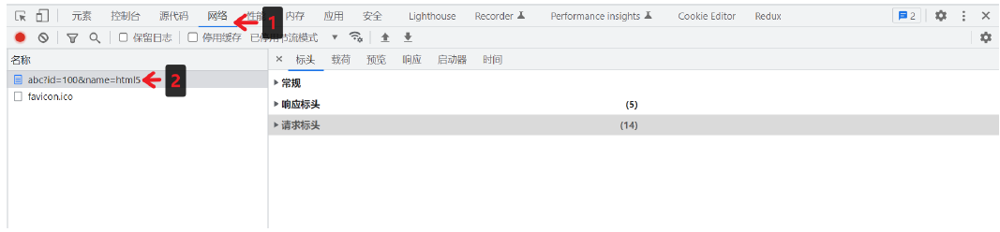

- 查看请求行与请求头

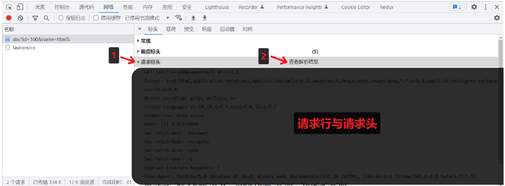

- 查看请求体

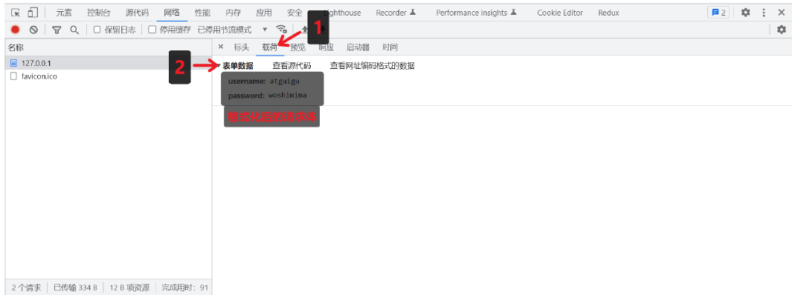

- 查看 URL 查询字符串

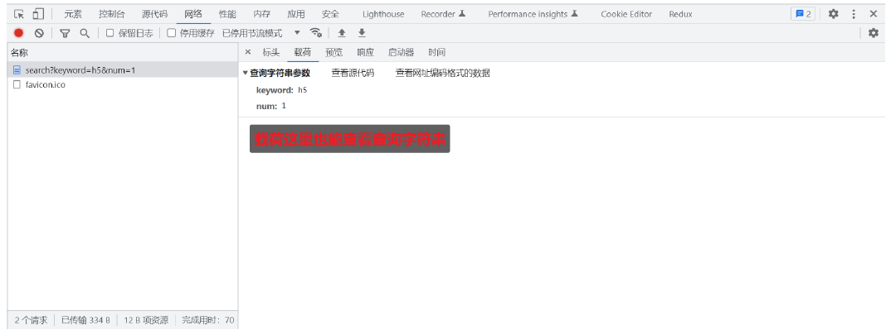

- 查看响应行与响应头

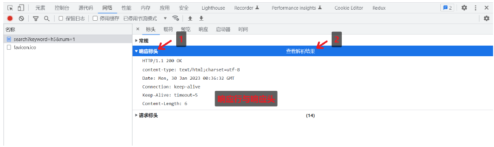

- 查看响应体

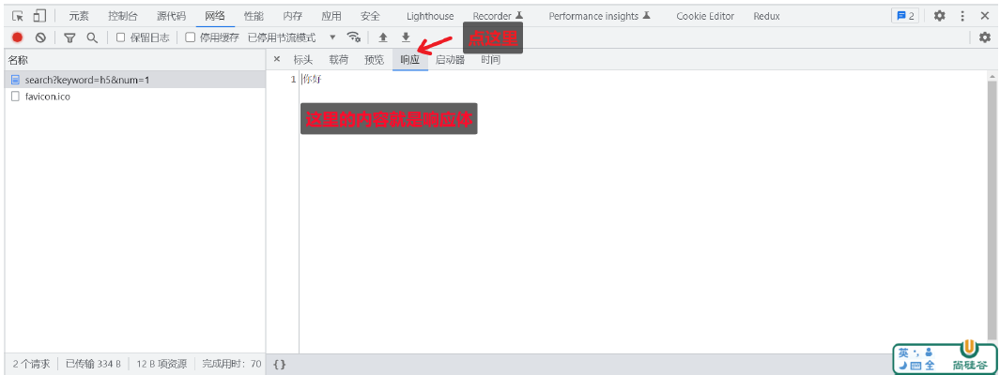

##### 获取报文

想要获取请求的数据，需要通过 request 对象

| 含义          | 语法                                                                 | 重点掌握 |
| ------------- | -------------------------------------------------------------------- | -------- |
| 请求方法      | request.method                                                       | \*       |
| 请求版本      | request.httpVersion                                                  |          |
| 请求路径      | request.url                                                          | \*       |
| URL路径       | require('url').parse(request.url).pathname                           | \*       |
| URL查询字符串 | require('url').parse(request.url, true).query                        | \*       |
| 请求头        | request.headers                                                      | \*       |
| 请求体        | request.on('data',function(chunk){}) request.on('end',function(){}); |          |

注意事项：

1. request.url 只能获取路径以及查询字符串，无法获取 URL 中的域名以及协议的内容
2. request.headers 将请求信息转化成一个对象，并将属性名都转化成了『小写』
3. 关于路径：如果访问网站的时候，只填写了 IP 地址或者是域名信息，此时请求的路径为『/ 』
4. 关于 favicon.ico：这个请求是属于浏览器自动发送的请求

```js
/*
 * 项目：02-提取HTTP报文.js
 *
 */
// 1. 引入 HTTP 模块
const http = require("http");

// 2. 创建服务对象
const server = http.createServer((request, response) => {
  /* //获取请求的方法
  console.log(request.method); */

  /* //获取请求的 url,只包含 url 中的路径与查询字符串
  console.log(request.url); */

  /* //获取 HTTP 协议的版本号
  console.log(request.httpVersion); */

  //获取 HTTP 的请求头:127.0.0.1:9000
  console.log(request.headers.host);

  //设置响应体,传递给浏览器的数据
  response.end("I have seen it.");
});

// 3. 监听端口，启动服务，http://127.0.0.1:9000
server.listen(9000, () => {
  console.log("服务已经启动...");
});
/*
 * 项目：03-提取HTTP报文的请求体.js
 *
 */
// 1. 引入http
const http = require("http");

// 2. 创建服务对象
const server = http.createServer((request, response) => {
  //1. 声明一个变量
  let body = "";

  //2. 绑定data事件,'data' 是一个事件名称，当请求体（request body）的数据到达时触发；chunk 是数据块，是每次 'data' 事件触发时传递的参数。
  request.on("data", (chunk) => {
    body += chunk;
  });

  //3. 绑定end事件
  request.on("end", () => {
    //body:'username=12&password=12313'
    console.log(body);

    //设置响应体
    response.end("I have seen it.");
  });
});

// 3. 监听端口，启动服务，http://127.0.0.1:9000
server.listen(9000, () => {
  console.log("服务已经启动...");
});
/*
 * 项目：04 提取HTTP报文中URL的路径与查询字符串.js
 *
 */
// 1. 引入http模块,url模块
const http = require("http");
const url = require("url");

// 2. 创建服务对象
const server = http.createServer((request, response) => {
  //a. 解析request.url:/index-test/http
  // console.log(request.url);

  //request.url:只包含路径和查询字符串部分，不包含协议、主机名、端口等
  //true:将查询字符串解析为对象
  let res = url.parse(request.url, true);

  //所以打印出来的res很多在request.url不包含的都是null
  console.log(res);

  //b. 路径
  let pathname = res.pathname;

  //只获取res里面的pathname信息：/index-test/http
  // console.log(pathname);

  //c. 查询字符串
  let keyword = res.query.keyword;

  //只获取res里面的query.keyword信息：query为null，所以获取的也是null
  console.log(keyword);

  response.end("I have seen it.");
});

//3.监听端口
server.listen(9000, () => {
  console.log("I am listening...");
});
/*
 * 项目：05-提取HTTP报文中URL的路径与查询字符串.js
 *
 */
// 1. 导入 http 模块
const http = require("http");

// 2. 创建服务对象
const server = http.createServer((request, response) => {
  //实例化 URL 的对象
  // let url = new URL('/search?a=100&b=200', 'http://127.0.0.1:9000');
  console.log("我是01_" + request.url);

  //request.url:要解析的 URL 字符串（可以是相对路径或绝对路径）
  //http://127.0.0.1:基础 URL（当 urlString 是相对路径时必需）
  let url = new URL(request.url, "http://127.0.0.1");

  //输出路径
  console.log("我是02_" + url);
  console.log("我是02_" + url.pathname);

  //输出 keyword 查询字符串
  console.log("我是03_" + url.searchParams.get("keyword"));

  response.end("I have seen it.");
});

// 3. 监听端口, 启动服务
server.listen(9000, () => {
  console.log("I am listening...");
});
```

##### 阶段练习

按照以下要求搭建 HTTP 服务

| 请求类型(方法) | 请求地址 | 响应体结果 |
| -------------- | -------- | ---------- |
| get            | /login   | 登录页面   |
| get            | /reg     | 注册页面   |

```js
// ========================================
// =项目名称：06-HTTP报文练习.js
// =需求：
//    1）请求方法：get，路径：/login，响应体结果为：登录页面
//    2）请求方法：get，路径：/reg,响应体结果为：注册页面
// ========================================

// 1. 导入 http 模块
const http = require("http");

// 2. 创建服务对象
const server = http.createServer((request, response) => {
  // 2.1 获取请求方法
  let methods = request.method;

  // 2.2 获取路径方法
  let urls = new URL(request.url, "http://127.0.0.1");

  /* // 测试输出获取的方法
  console.log('01-' + methods, '02-' + urls, '03-' + urls.pathname); */

  // 2.3 实现功能
  if (methods === "GET" && urls.pathname === "/login") {
    response.end("Success Login!");
    console.log(
      "methods:" +
        methods +
        ";urls.pathname:" +
        urls.pathname +
        "; Connecting. Success Login!"
    );
  } else if (methods === "GET" && urls.pathname === "/reg") {
    response.end("Success Register!");
    console.log(
      "methods:" +
        methods +
        ";urls.pathname:" +
        urls.pathname +
        "; Connecting. Success Register!"
    );
  } else if (methods === "GET" && urls.pathname === "/favicon.ico") {
    response.end("Ignore:favicon.ico");
    console.log(
      "methods:" +
        methods +
        ";urls.pathname:" +
        urls.pathname +
        "; Connecting. But it is favicon.ico files."
    );
  } else {
    response.end("Not Found.");
    console.log(
      "methods:" +
        methods +
        ";urls.pathname:" +
        urls.pathname +
        "; Connecting. But Not Found."
    );
  }
});

// 3. 监听端口, 启动服务
server.listen(9000, () => {
  console.log("I am listening...");
});
```

#### 响应报文

##### 设置报文

| 作用             | 语法                                   |
| ---------------- | -------------------------------------- |
| 设置响应状态码   | response.statusCode                    |
| 设置响应状态描述 | response.statusMessage （用的非常少）  |
| 设置响应头信息   | response.setHeader('头名,'头值')       |
| 设置响应体       | response.write('") response.end('xxx') |

```js
// 1. 引入http模块
const http = require("http");

// 2. 创建服务对象
const server = http.createServer((request, response) => {
  // a. 设置响应状态码
  response.statusCode = 203;

  // b. 响应状态的描述
  response.statusMessage = "i love you";

  // c. 响应头
  response.setHeader("content-type", "text/html;charset=utf-8");
  response.setHeader("Server", "node.js");
  response.setHeader("myHeader", "lulululalala");
  response.setHeader("test", ["a", "b", "c"]);

  // d. 响应体的设置,一般设置了write，就不会在response.end设置了。response.end();
  response.write("Approved.Plesase go ahead.");

  // e. 设置响应结束，只能有1个end方法，end和write内的内容选择一个即可
  response.end();
});

// 3. 监听端口，启动服务器
server.listen(9000, () => {
  console.log("I am listening.");
});
```

##### 阶段练习

搭建 HTTP 服务，响应一个 4 行 3 列的表格，并且要求表格有隔行换色效果，且点击单元格能高亮显示

```js
// ========================================
// =项目名称：02-HTTP响应练习-结合体.js
// =需求：
//    1）搭建 HTTP 服务
//    2）响应一个 4 行 3 列的表格
//    3) 表格有隔行换色效果，且点击单元格能高亮显示
// ========================================
// 1. 引入http模块
const http = require("http");

// 2. 创建服务对象
const server = http.createServer((request, response) => {
  // 响应结果
  response.end(`
    <!DOCTYPE html>
<html lang="en">

<head>
  <meta charset="UTF-8">
  <meta name="viewport" content="width=device-width, initial-scale=1.0">
  <title>Document</title>
  <style>
    td {
      padding: 20px 40px;
      border: 1px orange solid;
    }

    tr:nth-child(even) {
      background-color: yellowgreen;
    }

    tr:nth-child(odd) {
      background-color: lightblue;
    }
  </style>
</head>

<body>
  <table>
    <tr><td></td><td></td><td></td></tr>
    <tr><td></td><td></td><td></td></tr>
    <tr><td></td><td></td><td></td></tr>
    <tr><td></td><td></td><td></td></tr>
  </table>
</body>
<script>
  //获取所有的td
  let tds = document.querySelectorAll('td');
  //遍历
  tds.forEach(item => {
    item.onclick = function () {
      this.style.background = 'black';
    }
  })
</script>

</html>
    `);
});

// 3. 监听端口，启动服务器
server.listen(9000, () => {
  console.log("I am listening.");
});
// ========================================
// =项目名称：02-HTTP响应练习-拆分体.js
// =需求：
//    1）搭建 HTTP 服务
//    2）响应一个 4 行 3 列的表格
//    3) 表格有隔行换色效果，且点击单元格能高亮显示
// ========================================
// 1. 引入http fs模块
const http = require("http");
const fs = require("fs");

// 2. 创建服务对象
const server = http.createServer((request, response) => {
  //异步读取文件
  const htmlPath = __dirname + "/02-HTTP响应练习_demo.html";

  fs.readFile(htmlPath, (err, data) => {
    if (err) {
      console.log("Please Read the Error.");
      return;
    } else {
      response.end(data);
    }
  });
});

// 3. 监听端口，启动服务器
server.listen(9000, () => {
  console.log("I am listening.");
});
```

#### 资源加载

##### 基本概念


网页资源的加载都是循序渐进的，首先获取 HTML 的内容， 然后解析 HTML 在发送其他资源的请求，如CSS，Javascript，图片等。理解

了这个内容对于后续的学习与成长有非常大的帮助。

##### 阶段训练

```js
// ========================================
// =项目名称：04-HTTP响应练习-资源获取.js
// =需求：
//    1）搭建 HTTP 服务
//    2）响应一个 4 行 3 列的表格
//    3) 表格有隔行换色效果，且点击单元格能高亮显示
// ========================================
// 1. 引入http fs模块
const http = require("http");
const fs = require("fs");

// 2. 创建服务对象
const server = http.createServer((request, response) => {
  //因为要获取的html内含css和js文件，都是单独请求的，所以，需要根据请求头url来进行确定是哪个请求，提供哪个数据
  //异步读取文件
  const htmlPath = __dirname + "/Sources/HTTP响应练习_资源引入demo.html";
  const cssPath = __dirname + "/Sources/index.css";
  const jsPath = __dirname + "/Sources/index.js";

  let urlAdd = new URL(request.url, "http://127.0.0.1");
  // console.log(urlAdd.pathname);

  //此为读取html的方法
  if (urlAdd.pathname === "/login") {
    readHtml();
  }
  //此为读取css的方法
  else if (urlAdd.pathname === "/index.css") {
    readCss();
  }

  //读取js文件
  else if (urlAdd.pathname === "/index.js") {
    readJs();
  } else {
    response.statusCode = "404";
    response.end("Err. Not Find Any Com...");
  }

  //此为读取html的方法
  function readHtml() {
    fs.readFile(htmlPath, (err, data) => {
      if (err) {
        console.log("Read html File Err.Please Read the Error Msg..");
        return;
      } else {
        response.end(data);
      }
    });
  }

  //此为读取css的方法
  function readCss() {
    fs.readFile(cssPath, (err, data) => {
      if (err) {
        console.log("Read css File Err.Please Read the Error Msg..");
        return;
      } else {
        response.end(data);
      }
    });
  }

  //此为读取js的方法
  function readJs() {
    fs.readFile(jsPath, (err, data) => {
      if (err) {
        console.log("Read js File Err.Please Read the Error Msg..");
        return;
      } else {
        response.end(data);
      }
    });
  }
});

// 3. 监听端口，启动服务器
server.listen(9000, () => {
  console.log("I am listening.");
});
```

##### 资源类别

- 静态资源是指内容长时间不发生改变的资源，例如图片，视频，CSS 文件，JS文件，HTML文件，字体文件等；
- 动态资源是指内容经常更新的资源，例如百度首页，网易首页，京东搜索列表页面等

##### 静资服务

可以解决痛点：

- 减少判断
- 访问速度提升

项目要求

创建一个HTTP服务，端口为9000,满足如下需求：

- GET /index.html 响应 page/index.html的文件内容；
- GET /css/app.css 响应 page/css/app.css的文件内容；
- GET /images/logo.png 响应 page/images/logo,png的文件内容；

```js
// ========================================
// =项目名称：05-HTTP响应练习-静态资源搭建.js
// =需求：
//    1）GET  /index.html   响应  index.html的文件内容
//    2）GET  /css/index.css  响应  css/index.css的文件内容
//    3) GET  /images/logo.png  响应  images/logo,png的文件内容
// ========================================
// 1. 引入http fs模块
const http = require("http");
const fs = require("fs");

// 2. 创建服务对象
const server = http.createServer((request, response) => {
  let urlAdd = new URL(request.url, "http://127.0.0.1");
  // console.log(urlAdd.pathname);

  //拼接路径
  let filePath = __dirname + "/Sources/02-静态资源" + urlAdd.pathname;
  console.log("拼接路径：" + filePath);

  //异步读取
  fs.readFile(filePath, (err, data) => {
    if (err) {
      console.log("Read html File Err.Please Read the Error Msg..");
      response.end("文件读取失败~");
      return;
    } else {
      response.end(data);
    }
  });
});

// 3. 监听端口，启动服务器
server.listen(9000, () => {
  console.log("I am listening.");
});
```

- **网站根目录或静态资源目录**

HTTP 服务在哪个文件夹中寻找静态资源，那个文件夹就是静态资源目录，也称之为网站根目录。

> 思考：vscode 中使用 live-server 访问 HTML 时， 它启动的服务中网站根目录是谁？

- **网页中使用 URL 的场景小结**

包括但不限于如下场景：

- a 标签 href
- link 标签 href
- script 标签 src
- img 标签 src
- video audio 标签 src
- form 中的 action
- AJAX 请求中的 URL

##### 资源类型

媒体类型（通常称为 Multipurpose Internet Mail Extensions 或 MIME 类型 ）是一种标准，用来表示文档、文件或字节流的性质和格

式。

HTTP 服务可以设置响应头 Content-Type 来表明响应体的 MIME 类型，浏览器会根据该类型决定如何处理资源。下面是常见文件对应的

mime 类型：

```js
html: 'text/html',
css: 'text/css',
js: 'text/javascript',
png: 'image/png',
jpg: 'image/jpeg',
gif: 'image/gif',
mp4: 'video/mp4',
mp3: 'audio/mpeg',
json: 'application/json'
```

> 对于未知的资源类型，可以选择 application/octet-stream 类型，浏览器在遇到该类型的响应时，会对响应体内容进行独立存储，也就是我们常见的下载效果

```js
// ========================================
// =项目名称：06-HTTP响应练习-MIME+解决乱码.js
// =需求：
//    1）GET  /index.html   响应  index.html的文件内容
//    2）GET  /css/index.css  响应  css/index.css的文件内容
//    3) GET  /images/logo.png  响应  images/logo,png的文件内容
//    4) 增加MIME：媒体类型， Multipurpose Internet Mail Extensions ，是一种标准，用来表示文档、文件或字节流的性质和格式
//    5）解决中文乱码问题
// ========================================
// 1. 引入http fs模块
const http = require("http");
const fs = require("fs");
const path = require("path");

//创建MIME对象用于检索，实际上，html内部已经设置了MIME类型，重新设定优先级>html内置优先级
/* ** charset=utf-8：中文乱码问题的解决方案：response.setHeader('content-type',type+';charset=utf-8');
 ** 在html内置了charset=utf-8 ，所以，不会乱码，但是单独访问js,css文件会存在乱码问题
 ** 可加可不加
 */
const mimes = {
  html: "text/html",
  css: "text/css",
  js: "text/javascript",
  png: "image/png",
  jpg: "image/jpeg",
  gif: "image/gif",
  mp4: "video/mp4",
  mp3: "audio/mpeg",
  json: "application/json"
};

// 2. 创建服务对象
const server = http.createServer((request, response) => {
  let urlAdd = new URL(request.url, "http://127.0.0.1");
  // console.log(urlAdd.pathname);

  //拼接路径,可以拼接处对应不同的数据请求类型，如：index.js/index.css/logo.png
  let filePath = __dirname + "/Sources/02-静态资源" + urlAdd.pathname;
  console.log("拼接路径：" + filePath);

  //异步读取
  fs.readFile(filePath, (err, data) => {
    if (err) {
      console.log("Read html File Err.Please Read the Error Msg..");
      response.end("文件读取失败~");
      return;
    } else {
      //获取文件的后缀，也就是文件类型
      //slice(1):获取从索引1以后的所有数据
      let ext = path.extname(filePath).slice(1);

      //获取对应的类型
      let type = mimes[ext];
      if (type) {
        //匹配到了,type+';charset=utf-8':增加了解码说明，防止查看文件乱码
        response.setHeader("content-type", type + ";charset=utf-8");
      } else {
        //没有匹配到了
        response.setHeader("content-type", application / octet - stream);
      }
      response.end(data);
    }
  });
});

// 3. 监听端口，启动服务器
server.listen(9000, () => {
  console.log("I am listening.");
});
```

#### GET 和 POST

GET 请求的情况：

- 在地址栏直接输入 url 访问
- 点击 a 链接
- link 标签引入 css
- script 标签引入 js
- img 标签引入图片
- form 标签中的 method 为 get （不区分大小写）
- ajax 中的 get 请求

POST 请求的情况：

- form 标签中的 method 为 post（不区分大小写）
- AJAX 的 post 请求

**GET和POST请求的区别**

GET 和 POST 是 HTTP 协议请求的两种方式。

- GET 主要用来获取数据，POST 主要用来提交数据
- GET 带参数请求是将参数缀到 URL 之后，在地址栏中输入 url 访问网站就是 GET 请求，POST 带参数请求是将参数放到请求体中
- POST 请求相对 GET 安全一些，因为在浏览器中参数会暴露在地址栏
- GET 请求大小有限制，一般为 2K，而 POST 请求则没有大小限制

### Node模块

#### 基本介绍

- 将一个复杂的程序文件依据一定规则（规范）拆分成多个文件的过程称之为模块化，其中拆分出的每个文件就是一个模块，模块的内

  部数据是私有的，不过模块可以暴露内部数据以便其他模块使用；

- 编码时是按照模块一个一个编码的， 整个项目就是一个模块化的项目；
- module.exports/exports/require 这些都是 CommonJS 模块化规范中的内容。而 Node.js 是实现了 CommonJS 模块化规范，二者关系有点像 JavaScript 与 ECMAScript。
- 下面是模块化的一些好处：
  - 防止命名冲突
  - 高复用
  - 高维护性

#### 暴露数据

##### 初步体验

可以通过下面的操作步骤，快速体验模块化

- 创建 01-初体验-me.js

```js
// ========================================
// =项目名称：01-数据暴露/01-初体验-me.js
// =项目类型：标准模块
// ========================================
//声明一个模块化函数
function tiemo() {
  console.log("I am tie mo ing...");
}

//暴露函数
module.exports = tiemo;
```

- 创建 01-初体验-index.js

```js
// ========================================
// =项目名称：01-数据暴露/01-初体验-index.js
// =项目类型：
// ========================================
const tiemo = require("./01-初体验-me.js");

//使用函数
tiemo();
```

##### 暴露数据

模块暴露数据的方式有两种：

1. module.exports = value
2. exports.name = value

> 使用时有几点注意：
>
> - module.exports 可以暴露任意数据
> - 不能使用 exports = value 的形式暴露数据，因为模块内部 module 与 exports 的隐式关系:exports = module.exports = {} ，require 返回的是**目标模块中 module.exports 的值**

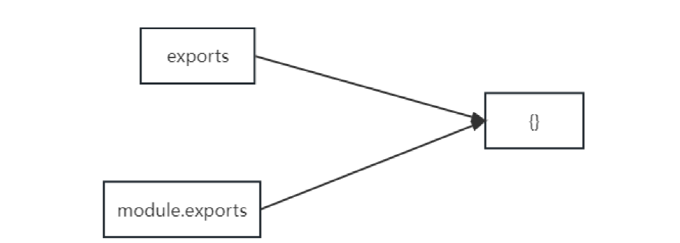

```js
// ========================================
// =项目名称：01-数据暴露/02-数据暴露-me.js
// =项目类型：标准模块
// ========================================
//声明一个模块化函数：tiemo()
function tiemo() {
  console.log("I am tie mo ing...");
}

//测试exports方法使用
let varing = "123";

//声明一个模块化函数：xiushouji()
function xiushouji() {
  console.log("I am xiushouji ing...");
}

/* **
** ** 暴露函数方式1：module.exports=value
** ** module.exports可以暴露任何value数据
** ** 1） module.exports='I do it.',
** ** 2)  module.exports=131689
** ** 3)  module.exports={
            tiemo:tiemo,
            xiushouji:xiushouji 
        }
 */
/* module.exports={
    tiemo:tiemo,
    xiushouji:xiushouji 
} */

/* **
 ** ** 暴露函数方式2：exports.name=value
 ** ** exports暴露的value不可以直接是数据,只能是函数或者变量
 */
exports.tiemo = tiemo;
exports.xiushouji = xiushouji;
exports.varing = varing;
// ========================================
// =项目名称：01-数据暴露/02-数据暴露-me.js
// =项目类型：
// ========================================
const me = require("./02-数据暴露-me.js");

//使用函数
me.tiemo();
me.xiushouji();
//测试exports方法
console.log(me.varing);
```

#### 引入模块

##### 基本概论

在模块中使用 require 传入文件路径即可引入文件

```text
const test = require('./me.js');
```

require 使用的一些注意事项：

1. 对于自己创建的模块，导入时路径建议写相对路径，且不能省略./ 和../
2. **js 和 json 文件导入时可以不用写后缀**，c/c++编写的node 扩展文件也可以不写后缀，但是一般用不到
3. 如果导入其他类型的文件，会以 js 文件进行处理
4. 如果导入的路径是个文件夹，则会首先检测该文件夹下 package.json 文件中 main 属性对应的文件:
5. 如果存在则导入，反之如果文件不存在会报错。
6. 如果 main 属性不存在，或者 package.json 不存在，则会尝试导入文件夹下的 index.js 和index.json 。
7. 如果还是没找到，就会报错。
8. 导入 node.js 内置模块时，直接 require 模块的名字即可，无需加./ 和../

##### 基本流程

这里我们介绍一下 require 导入【自定义模块】的基本流程

1. 将相对路径转为绝对路径，定位目标文件
2. 缓存检测
3. 读取目标文件代码
4. 包裹为一个函数并执行（自执行函数）。通过 arguments.callee.toString() 查看自执行函数
5. 缓存模块的值
6. 返回 module.exports 的值

```js
/**
 * 伪代码，不能被执行的伪代码
 */

function require(file) {
  //1. 将相对路径转为绝对路径，定位目标文件
  let absolutePath = path.resolve(__dirname, file);
  //2. 缓存检测
  if (caches[absolutePath]) {
    return caches[absolutePath];
  }
  //3. 读取文件的代码
  let code = fs.readFileSync(absolutePath).toString();
  //4. 包裹为一个函数 然后执行
  let module = {};
  let exports = (module.exports = {});
  (function (exports, require, module, __filename, __dirname) {
    const test = {
      name: "尚硅谷"
    };

    module.exports = test;

    //输出
    console.log(arguments.callee.toString());
  })(exports, require, module, __filename, __dirname);
  //5. 缓存结果
  caches[absolutePath] = module.exports;
  //6. 返回 module.exports 的值
  return module.exports;
}

const m = require("./me.js");
```

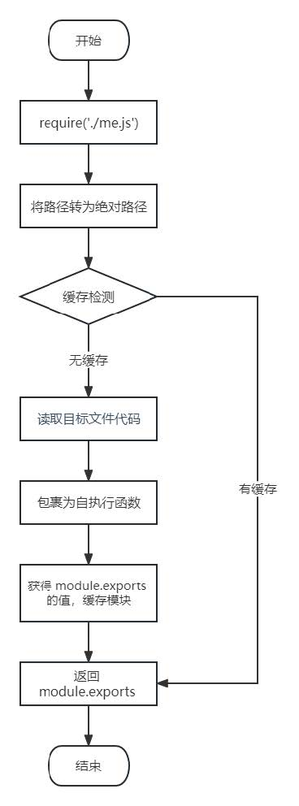

### 依赖管理

#### 概念介绍

包英文单词是 package ，代表了一组特定功能的源码集合。管理『包』的应用软件，可以对「包」进行下载安装， 更新， 删除， 上传等操作，借助包管理工具，可以快速开发项目，提升开发效率，包管理工具是一个通用的概念，很多编程语言都有包管理工具，所以掌握好包管理工具非常重要。

#### 常用工具

下面列举了前端常用的包管理工具：

- npm
- cnpm
- yarn

#### npm工具

npm 全称 Node Package Manager ，翻译为中文意思是『Node 的包管理工具』。npm 是 node.js 官方内置的包管理工具，是必须要掌握住的工具。

##### npm 安装

node.js 在安装时会自动安装 npm ，所以如果你已经安装了 node.js，可以直接使用 npm，可以通过 npm -v 查看版本号测试，如果显示版本号说明安装成功，反之安装失败。

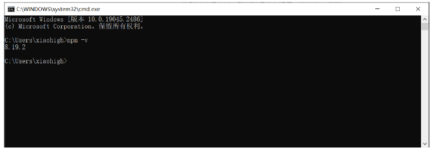

> 查看版本时可能与上图版本号不一样，不过不影响正常使用

##### 基本使用

- **初始化**

创建一个空目录，然后以此目录作为工作目录启动命令行工具，执行 npm init

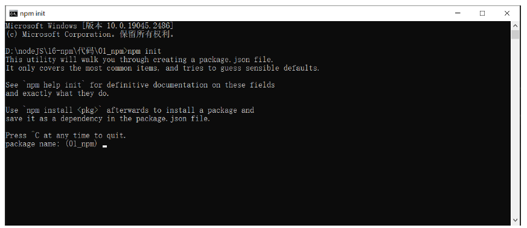

- npm init 命令的作用是将文件夹初始化为一个『包』， 交互式创建 package.json 文件
- package.json 是包的配置文件，每个包都必须要有 package.json
- cmd命令行创建的过程如下：

  ```cmd
  PS F:\CodingMan\Code2Git\01-Stu\04-FrontEnd\03-K-Points\01-Node.js\01-Basic\05-包管理工具\01-npm\01-BasicUse> npm init
  This utility will walk you through creating a package.json file.
  It only covers the most common items, and tries to guess sensible defaults.
  See `npm help init` for definitive documentation on these fields
  and exactly what they do.
  Use `npm install <pkg>` afterwards to install a package and
  save it as a dependency in the package.json file.
  Press ^C at any time to quit.
  package name: (01-basicuse)
  version: (1.0.0)
  description:
  entry point: (index.js)
  test command:
  git repository:
  keywords:
  author: GooHv
  license: (ISC)
  type: (commonjs)
  About to write to F:\CodingMan\Code2Git\01-Stu\04-FrontEnd\03-K-Points\01-Node.js\01-Basic\05-包管理工具\01-npm\01-BasicUse\package.json:

  {
    "name": "01-basicuse",
    "version": "1.0.0",
    "description": "",
    "main": "index.js",
    "scripts": {
      "test": "echo \"Error: no test specified\" && exit 1"
    },
    "author": "GooHv",
    "license": "ISC",
    "type": "commonjs"
  }
  Is this OK? (yes)
  ```

- package.json 内容示例：

  ```json
  {
    "name": "01-basicuse",
    "version": "1.0.0",
    "description": "c",
    "license": "ISC",
    "author": "GooHv",
    "type": "commonjs",
    "main": "index.js",
    "scripts": {
      "test": "echo \"Error: no test specified\" && exit 1"
    }
  }
  ```

  > 初始化的过程中还有一些注意事项：
  >
  > 1. package name ( 包名) 不能使用中文、大写，默认值是文件夹的名称，所以文件夹名称也不能使用中文和大写
  > 2. version ( 版本号)要求 x.x.x 的形式定义， x 必须是数字，默认值是 1.0.0
  > 3. ISC 证书与 MIT 证书功能上是相同的，关于开源证书扩展阅读http://www.ruanyifeng.com/blog/2011/05/how_to_choose_free_software_licenses.html
  > 4. package.json 可以手动创建与修改
  > 5. 使用 npm init -y 或者npm init --yes 极速创建package.json

- **搜索包**
  - 搜索包的方式有两种:
    - 命令行 『npm s/search 关键字』
    - 网站搜索 网址是 https://www.npmjs.com/

      > 我怎样才能精准找到我需要的包? 这个事儿需要大家在实践中不断的积累，通过看文章，看项目去学习去积累

- **下载安装包**

1）我们可以通过 npm install 和npm i 命令安装包

```json
# 格式
npm install <包名>
npm i <包名>
# 示例
npm install uniq
npm i uniq
```

2）运行之后文件夹下会增加两个资源：

2.1 node_modules 文件夹存放下载的包

2.2 package-lock.json 包的锁文件，用来锁定包的版本

> 安装 uniq 之后， uniq 就是当前这个包的一个依赖包，有时会简称为依赖。比如我们创建一个包名字为 A，A 中安装了包名字是 B，我们就说 B 是 A 的一个依赖包，也会说A依赖 B

3）案例说明

```js
/*
 * 项目：index.js
 * 目的:引入uniq,其作用为:Removes all duplicates from an array in place.
 *      1) First install using npm:npm install uniq
 *      2) Then use it as follows:
 *          var arr = [1, 1, 2, 2, 3, 5]
 *           require("uniq")(arr)
 *           console.log(arr)
 *           //Prints:1,2,3,5
 */
// 1. 引入uniq
// const uniq=require('uniq');

// 1. 引入uniq,实际上是导入node_modules/uniq/uniq.js文件
//若没有找到，则在上级目录中下的 node_modules 中寻找同名的文件夹，直至找到磁盘根目录；
const uniq = require("./node_modules/uniq/uniq.js");

// 2. 使用其函数
let arr = [1, 2, 3, 4, 5, 4, 3, 2, 1];

const result = uniq(arr);

console.log(result); //[ 1, 2, 3, 4, 5 ]
```

**require导入**

1. 在当前文件夹下 node_modules 中寻找同名的文件夹；
2. 若没有找到，则在上级目录中下的 node_modules 中寻找同名的文件夹，直至找到磁盘根目录；

##### 环境简介

- 开发环境是程序员专门用来写代码的环境，一般是指程序员的电脑，开发环境的项目一般只能程序员自己访问;
- 生产环境是项目代码正式运行的环境，一般是指正式的服务器电脑，生产环境的项目一般每个客户都可以访问;

##### 依赖简介

- **基本简介**

分生产依赖和开发依赖，我们可以在安装时设置选项来区分依赖的类型，目前分为两类：

| 类型     | 命令                              | 补充                                                                     |
| -------- | --------------------------------- | ------------------------------------------------------------------------ |
| 生产依赖 | npm i-S uniq npmi-save uniq       | -S等效于--save, -S 是默认选项 包信息保存在packagejson中 dependencies属性 |
| 开发依赖 | npmi-D less npm i --save-dev less | -D等效于--save-dev 包信息保存在 package.json 中 devDependencies 属性     |

> 开发依赖：只存在于开发依赖，比如less，只存在于开发时期，在上线期间已转变为css文件；
>
> 生产依赖：不仅仅在开发时期使用，在上线时期也会使用；
>
> 如何识别：一般依赖包的技术文档都会展示，可以查询，-s为默认值
>
> 举个例子方便大家理解，比如说做蛋炒饭需要 大米， 油， 葱， 鸡蛋， 锅， 煤气， 铲子等,其中锅， 煤气， 铲子属于开发依赖，只在制作阶段使用，而大米， 油， 葱， 鸡蛋属于生产依赖，在制作与最终食用都会用到。所以开发依赖是只在开发阶段使用的依赖包，而生产依赖是开发阶段和最终上线运行阶段都用到的依赖包

- **举例说明**

```cmd
PS F:\CodingMan\Code2Git\01-Stu\04-FrontEnd\03-K-Points\01-Node.js\01-Basic\05-包管理工具\01-npm\01-BasicUse> npm i -s jquery
PS F:\CodingMan\Code2Git\01-Stu\04-FrontEnd\03-K-Points\01-Node.js\01-Basic\05-包管理工具\01-npm\01-BasicUse> npm i -D less

added 17 packages in 3s

2 packages are looking for funding
  run `npm fund` for details
```

package.json文件如下所示（-D安装的作为开发依赖放在devDependencies下;-s安装的作为生产依赖放在dependencies）：

```js
{
  "name": "01-basicuse",
  "version": "1.0.0",
  "description": "codes4Stu",
  "license": "ISC",
  "author": "GooHv",
  "type": "commonjs",
  "main": "index.js",
  "scripts": {
    "test": "echo \"Error: no test specified\" && exit 1"
  },
  "dependencies": {
    "jquery": "^4.0.0",
    "uniq": "^1.0.1"
  },
  "devDependencies": {
    "less": "^4.6.4"
  }
}
```

##### 全局安装

我们可以执行安装选项 -g 进行全局安装`npm i -g nodemon`

全局安装完成之后就可以在命令行的任何位置运行 nodemon 命令。该命令的作用是：**自动重启 node 应用程序**。

> 说明： 全局安装的命令不受工作目录位置影响，可以通过 npm root -g 可以查看**全局安装包位置**，不是所有的包都适合全局安装， 只有全局类的工具才适合，可以通过查看包的官方文档来确定，安装方式，这里先不必太纠结。

**windows策略**

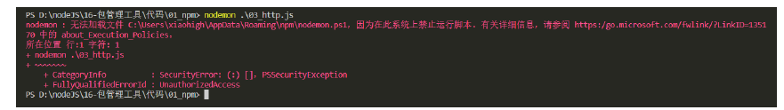

windows 默认不允许 npm 全局命令执行脚本文件，所以需要修改执行策略

1. 以管理员身份打开 powershell 命令行

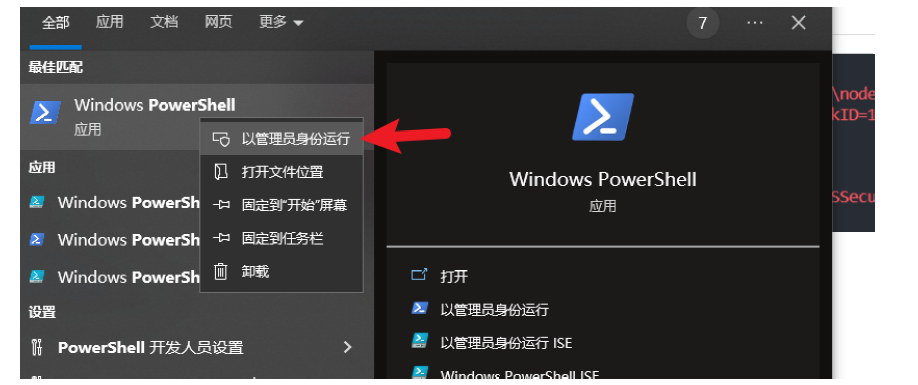

1. 键入命令 set-ExecutionPolicy remoteSigned

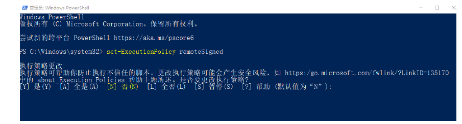

1. 键入 A 然后敲回车 👌
2. 如果不生效，可以尝试重启 vscode

**环境变量 Path**

Path 是操作系统的一个环境变量，可以设置一些文件夹的路径，在当前工作目录下找不到可执行文件时，就会在环境变量 Path 的目录中挨个的查找，如果找到则执行，如果没有找到就会报错

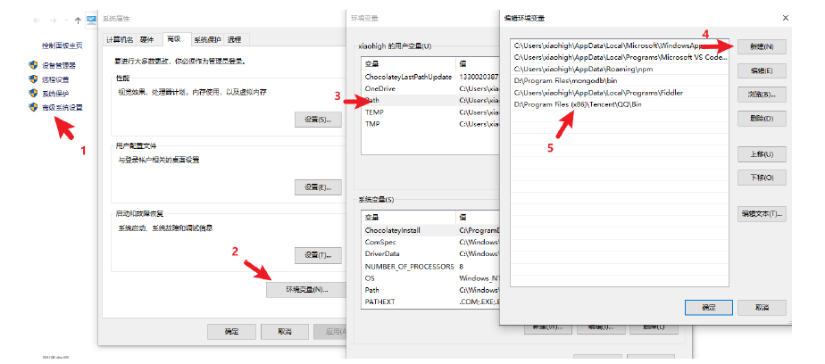

> 补充说明： 如果希望某个程序在任何工作目录下都能正常运行，就应该将该程序的所在目录配置到环境变量 Path 中 windows 下查找命令的所在位置，cmd 命令行中执行 where nodemon，powershell命令行执行 get-command nodemon

##### 安装包依赖

- **基础功能**

在项目协作中有一个常用的命令就是 npm i ，通过该命令可以依据 package.json 和 packagelock.json 的依赖声明安装项目依赖

```json
npm i
npm install
```

> node_modules 文件夹大多数情况都不会存入版本库

- **指定版本安装**

项目中可能会遇到版本不匹配的情况，有时就需要安装指定版本的包，可以使用下面的命令的

```js
## 格式
npm i <包名@版本号>
## 示例
npm i jquery@1.11.2
```

- **删除依赖**

项目中可能需要删除某些不需要的包，可以使用下面的命令

```js
## 局部删除
npm remove uniq
npm r uniq
## 全局删除
npm remove -g nodemon
```

##### 配置别名

通过配置命令别名可以更简单的执行命令，配置 package.json 中的 scripts 属性

```json
{
.
.
.
"scripts": {
"server": "node index.js",
"start": "node index.js",
},
.
.
}
```

配置完成之后，可以使用别名执行命令

```json
npm run server
npm run start
npm start
```

> 补充说明： npm start 是项目中常用的一个命令，一般用来启动项目; npm run 有自动向上级目录查找的特性，跟require 函数也一样; 对于陌生的项目，我们可以通过查看 scripts 属性来参考项目的一些操作;

#### cnpm工具

##### 概念介绍

cnpm 是一个淘宝构建的 npmjs.com 的完整镜像，也称为『淘宝镜像』，网址https://npmmirror.com/，cnpm 服务部署在国内阿里云服务器上， 可以提高包的下载速度。官方也提供了一个全局工具包 cnpm ，操作命令与 npm 大体相同。

##### cnpm安装

我们可以通过 npm 来安装 cnpm 工具：`npm install -g cnpm --registry=https://registry.npmmirror.com`

##### 操作命令

| 功能         | 命令                                                |
| ------------ | --------------------------------------------------- |
| 初始化       | cnpm init / cnpm init                               |
| 安装包       | cnpmiuniq cnpmi-S uniq cnpmi-D uniq cnpmi-g nodemon |
| 安装项目依赖 | cnpmi                                               |
| 删除         | cnpm r uniq                                         |

##### 配置镜像

用 npm 也可以使用淘宝镜像，配置的方式有两种:

- 直接配置
- 工具配置

**直接配置**

执行如下命令即可完成配置,`npm config set registry https://registry.npmmirror.com/`

**工具配置**

使用 nrm 配置 npm 的镜像地址 npm registry manager

1. 安装 nrm

   ```cmd
   npm i -g nrm
   ```

2. 支持列表

   ```cmd
   PS F:\CodingMan\Code2Git\01-Stu\04-FrontEnd\03-K-Points\01-Node.js\02-Int\02-包管理工具\02-cnpm> nrm ls
     npm ---------- https://registry.npmjs.org/
     yarn --------- https://registry.yarnpkg.com/
     tencent ------ https://mirrors.tencent.com/npm/
     cnpm --------- https://r.cnpmjs.org/
     taobao ------- https://registry.npmmirror.com/
     npmMirror ---- https://skimdb.npmjs.com/registry/
     huawei ------- https://repo.huaweicloud.com/repository/npm/
   ```

3. 修改镜像

   ```cmd
   nrm use taobao
   ```

4. 检查是否配置成功（选做）

   ```cmd
   npm config list
   ```

   检查 registry 地址是否为 https://registry.npmmirror.com/ , 如果是则表明成功

> 补充说明：
>
> 1. 建议使用第二种方式进行镜像配置，因为后续修改起来会比较方便;
> 2. 虽然 cnpm 可以提高速度，但是 npm 也可以通过淘宝镜像进行加速，所以 npm 的使用率还是高于 cnpm;

```cmd
PS F:\CodingMan\Code2Git\01-Stu\04-FrontEnd\03-K-Points\01-Node.js\02-Int\02-包管理工具\02-cnpm> npm i -g nrm
added 31 packages in 11s
6 packages are looking for funding
  run `npm fund` for details

PS F:\CodingMan\Code2Git\01-Stu\04-FrontEnd\03-K-Points\01-Node.js\02-Int\02-包管理工具\02-cnpm> nrm ls
  npm ---------- https://registry.npmjs.org/
  yarn --------- https://registry.yarnpkg.com/
  tencent ------ https://mirrors.tencent.com/npm/
  cnpm --------- https://r.cnpmjs.org/
  taobao ------- https://registry.npmmirror.com/
  npmMirror ---- https://skimdb.npmjs.com/registry/
  huawei ------- https://repo.huaweicloud.com/repository/npm/

PS F:\CodingMan\Code2Git\01-Stu\04-FrontEnd\03-K-Points\01-Node.js\02-Int\02-包管理工具\02-cnpm> nrm use taobao
 SUCCESS  The registry has been changed to 'taobao'.
```

#### yarn工具

##### yarn 介绍

yarn 是由 Facebook 在 2016 年推出的新的 Javascript 包管理工具，官方网址： https://yarnpkg.com/

##### yarn 特点

yarn 官方宣称的一些特点:

- 速度超快：yarn 缓存了下载过的包，所以再次使用时无需重复下载。 同时利用并行下载以最大化资源利用率，因此安装速度更快
- 超级安全：在执行代码之前，yarn 会通过算法校验每个安装包的完整性
- 超级可靠：使用详细、简洁的锁文件格式和明确的安装算法，yarn 能够保证在不同系统上无差异的工作

##### yarn 安装

我们可以使用 npm 安装 yarn

```cmd
npm i -g yarn
```

##### 常用命令

| 功能         | 命令                                                                                         |
| ------------ | -------------------------------------------------------------------------------------------- |
| 初始化       | yarn init / yarn init -y                                                                     |
| 安装包       | yarn add uniq 生产依赖<br/>yarn add less --dev 开发依赖<br/>yarn global add nodemon 全局安装 |
| 删除包       | yarn remove uniq 删除项目依赖包<br/>yarn global remove nodemon 全局删除包                    |
| 安装项目依赖 | yarn                                                                                         |
| 运行命令别名 | yarn <别名> # 不需要添加 run                                                                 |

> 思考题： 这里有个小问题就是全局安装的包不可用 ，yarn 全局安装包的位置可以通过 yarn global bin来查看，那你有没有办法使 yarn 全局安装的包能够正常运行？

##### 配置镜像

可以通过如下命令配置淘宝镜像

```cmd
yarn config set registry https://registry.npmmirror.com/
```

可以通过 yarn config list 查看 yarn 的配置项

##### 工具选择

大家可以根据不同的场景进行选择npm 或 yarn ：

1. 个人项目 如果是个人项目， 哪个工具都可以，可以根据自己的喜好来选择；
2. 公司项目 如果是公司要根据项目代码来选择，可以通过锁文件判断项目的包管理工具；

- npm 的锁文件为 package-lock.json
- yarn 的锁文件为 yarn.lock

> 包管理工具不要混着用，切记，切记，切记！

#### npm发布包

##### 创建与发布

我们可以将自己开发的工具包发布到 npm 服务上，方便自己和其他开发者使用，操作步骤如下：

1. 创建文件夹，并创建文件 index.js， 在文件中声明函数，使用 module.exports 暴露；
2. npm 初始化工具包，package.json 填写包的信息 (包的名字是唯一的)；
3. 注册账号 https://www.npmjs.com/signup；
4. 激活账号 （ 一定要激活账号）；
5. 修改为官方的官方镜像 (命令行中运行 nrm use npm )；
6. 命令行下 npm login 填写相关用户信息

命令行下npm publish 提交包 。

##### 更新包

后续可以对自己发布的包进行更新，操作步骤如下：

1. 更新包中的代码
2. 测试代码是否可用
3. 修改 package.json 中的版本号
4. 发布更新 `npm publish`

##### 删除包

执行如下命令删除包

```cmd
npm unpublish --force
```

> 删除包需要满足一定的条件， https://docs.npmjs.com/policies/unpublish 你是包的作者, 发布小于 24 小时, 大于 24 小时后，没有其他包依赖，并且每周小于 300 下载量，并且只有一个维护者。

#### 扩展内容

在很多语言中都有包管理工具，比如：

| 语言       | 包管理工具          |
| ---------- | ------------------- |
| PHP        | composer            |
| Python     | pip                 |
| Java       | maven               |
| Go         | go mod              |
| JavaScript | npm/yarn/cnpm/other |
| Ruby       | rubyGems            |

除了编程语言领域有包管理工具之外，操作系统层面也存在包管理工具，不过这个包指的是『软件包』

| 操作系统 | 包管理工具 | 网址                                |
| -------- | ---------- | ----------------------------------- |
| Centos   | yum        | https://packages.debian.org/stable/ |
| Ubuntu   | apt        | https://packages.ubuntu.com/        |
| MacOS    | homebrew   | https://brew.sh/                    |
| Windows  | chocolatey | https://chocolatey.org/             |

#### nvm模块

##### 介绍

nvm 全称 Node Version Manager 顾名思义它是用来管理 node 版本的工具，方便切换不同版本的Node.js。

##### 使用

nvm 的使用非常的简单，跟 npm 的使用方法类似。

- 下载安装

首先先下载 nvm，下载地址 https://github.com/coreybutler/nvm-windows/releases ，选择 nvm-setup.exe 下载即可（网络异常的小朋友可以在资料文件夹中获取）

- 常用命令

| 命令                  | 说明                            |
| --------------------- | ------------------------------- |
| nvm list available    | 显示所有可以下载的 Node.js 版本 |
| nvm list              | 显示已安装的版本                |
| nvm install 18.12.1   | 安装 18.12.1 版本的 Node.js     |
| nvm install latest    | 安装最新版的 Node.js            |
| nvm uninstall 18.12.1 | 删除某个版本的 Node.js          |
| nvm use 18.12.1       | 切换 18.12.1 的 Node.js         |

### 常用依赖

#### 框架模板

通过generator应用生成器工具 `express-generator` 可以快速创建一个应用的骨架，首先全局安装应用生成器工具 `express-generator` ：

```cmd
PS F:\CodingMan\Code2Git\01-Stu\04-BackEnd\06-Projects> npm i -g express express-generator
npm warn deprecated mkdirp@0.5.1: Legacy versions of mkdirp are no longer supported. Please update to mkdirp 1.x. (Note that the API surface has changed to use Promises in 1.x.)

added 67 packages, and changed 10 packages in 2s

24 packages are looking for funding
  run `npm fund` for details
```

#### 创建项目

通过express -e命令生成新项目文件夹，系统会基于express-generator工具自动将基本依赖包安装好：

```bash
PS F:\CodingMan\Code2Git\01-Stu\04-BackEnd\06-Projects> express -e 01-myAccounts

  warning: option `--ejs' has been renamed to `--view=ejs'


   create : 01-myAccounts\
   create : 01-myAccounts\public\
   create : 01-myAccounts\public\javascripts\
   create : 01-myAccounts\public\images\
   create : 01-myAccounts\public\stylesheets\
   create : 01-myAccounts\public\stylesheets\style.css
   create : 01-myAccounts\routes\
   create : 01-myAccounts\routes\index.js
   create : 01-myAccounts\views\
   create : 01-myAccounts\views\error.ejs
   create : 01-myAccounts\views\index.ejs
   create : 01-myAccounts\app.js
   create : 01-myAccounts\package.json
   create : 01-myAccounts\bin\
   create : 01-myAccounts\bin\www

   change directory:
     > cd 01-myAccounts

   install dependencies:
     > npm install

   run the app:
     > SET DEBUG=01-myaccounts:* & npm start

PS F:\CodingMan\Code2Git\01-Stu\04-BackEnd\06-Projects> cd .\01-myAccounts\
```

#### 解决跨域

- cors解决浏览器跨域请求问题
- cors允许前端应用从不同域名访问你的 API

```bash
PS C:\Users\Administrator\Desktop\01-stuProjects> npm i cors
npm warn deprecated transformers@2.1.0: Deprecated, use jstransformer
npm warn deprecated constantinople@3.0.2: Please update to at least constantinople 3.1.1
npm warn deprecated jade@1.11.0: Jade has been renamed to pug, please install the latest version of pug instead of jade

added 58 packages, removed 23 packages, and changed 30 packages in 3s

2 packages are looking for funding
  run `npm fund` for details
PS C:\Users\Administrator\Desktop\01-stuProjects>
```

> 在app.js中使用cors
>
> ```js
> ...
> var express = require("express");
> const cors = require("cors");
> ...
> //全域开启跨域
> app.use(cors());
> ...
> ```

#### 自动构建

nodemon包适用于node.js环境下修改代码自动更新，无需手动再次启动服务

```js
PS C:\Users\Administrator\Desktop\01-stuProjects> npm i nodemon

added 28 packages in 2s

7 packages are looking for funding
  run `npm fund` for details
PS C:\Users\Administrator\Desktop\01-stuProjects>
```

> - 修改package.json,实现修改后自动重新服务
>
> ```json
> "start": "node ./bin/www"
> 修改为：
> "start": "nodemon ./bin/www"
> ```
>
> - 启动服务
>
> ```bash
> > npm start
> > 客户端打开http://127.0.0.1:3000
> ```

#### 变量加载

为了将基本变量统一进行管理，在项目根目录下创建.env文件用于项目变量的存储，env文件的内容基本如下：

```env
# ============================================
# 服务器配置
# process.env.LISTEN_AREA: 用于设定是否在本地使用还是局域网内使用
# ============================================
PORT=3000
LISTEN_AREA=0.0.0.0
NODE_ENV=development
SERVER_IP=http://${LOCAL_IP}:${PORT}

# ============================================
# 局域网IP
# 自动获取的局域网IP（由 setup-env.js 自动更新）
# ============================================
LOCAL_IP=172.29.32.1

# ============================================
# 数据库配置
# ============================================
MONGODB_DBHOST=${LOCAL_IP}
MONGODB_DBPORT=27017
MONGODB_DBNAME=expressTest4Demo
MONGODB_USER=
MONGODB_PASSWORD=
MONGODB_POOL_SIZE=10
MONGODB_TIMEOUT=5000
EXIT_ON_DB_ERROR=true

# ============================================
# CORS 配置
# ============================================
CORS_ORIGINS=["http://localhost:3000","http://localhost:8080"]
```

dotenv 是一个 Node.js 的 npm 包，它的唯一作用就是：把 .env 文件里的变量加载到 process.env 对象中，每个后端服务器都有自己的环境配置等信息，可以使用dotenv包进行管理和加载。

安装 dotenv非常简单，按照以下步骤操作即可。

```cmd
PS C:\Users\Administrator\Desktop\01-stuProjects> npm i dotenv

added 1 package in 1s

8 packages are looking for funding
  run `npm fund` for details
PS C:\Users\Administrator\Desktop\01-stuProjects>
```

> 安装好后，就可以通过创建.env文件，并在www或其他服务文件下导入即可使用。
>
> dotenv 默认不支持变量引用，若想使用变量引用，需要安装变量增强工具包
>
> > SERVER_IP=http://${LOCAL_IP}:${PORT}
> >
> > LOCAL_IP=192.168.10.148
> >
> > process.env.SERVER_IP // "http://${LOCAL_IP}:${PORT}" (字面量，不会解析)

#### 变量增强

dotenv 默认不支持变量引用，若想使用变量引用，需要安装变量增强工具包dotenv-expand，具体安装方式如下：

```bash
PS F:\CodingMan\Code2Git\01-Stu\07-StuProject\01-stuProjectsMT> npm i dotenv-expand

added 1 package in 1s

10 packages are looking for funding
  run `npm fund` for details
PS F:\CodingMan\Code2Git\01-Stu\07-StuProject\01-stuProjectsMT>
```

> 具体使用方法见变量应用章节

#### 文件操作

因为涉及到对env文件的写入操作，所以需要fs依赖的安装。

```bash
PS F:\CodingMan\Code2Git\01-Stu\04-BackEnd\06-Projects\01-myAccounts> npm i fs

added 1 package in 926ms

9 packages are looking for funding
  run `npm fund` for details
```

#### 数据库包

该项目统一使用LowDB/MongoDB进行数据管理。

- LowDB数据库依赖包安装

```bash
PS F:\CodingMan\Code2Git\01-Stu\04-BackEnd\06-Projects\01-myAccounts> npm i lowdb@1.0.0

added 6 packages in 2s

9 packages are looking for funding
  run `npm fund` for details
PS F:\CodingMan\Code2Git\01-Stu\04-BackEnd\06-Projects\01-myAccounts>
```

> 目前使用不要使用最新版本，因为最新版本需要ES6语法，为了简单操作，可以选用1.0.0，具体下载、安装、使用网址如下：https://www.npmjs.com/package/lowdb/v/1.0.0

MongoDB需要使用mongoose包进行管理

```cmd
PS F:\CodingMan\Code2Git\01-Stu\07-StuProject\01-stuProjectsMT> npm i mongoose

added 18 packages in 3s

9 packages are looking for funding
  run `npm fund` for details
PS F:\CodingMan\Code2Git\01-Stu\07-StuProject\01-stuProjectsMT>
```

#### 唯一标识

因为LowDB没有自建唯一ID，此处在使用LowDB时，需要使用nanoid进行ID的设置，需要进行安装：

```bash
PS F:\CodingMan\Code2Git\01-Stu\04-BackEnd\06-Projects\01-myAccounts> npm i nanoid

added 1 package in 846ms

10 packages are looking for funding
  run `npm fund` for details
PS F:\CodingMan\Code2Git\01-Stu\04-BackEnd\06-Projects\01-myAccounts>
```

#### 加解密包

密码保存/密码对比需要进行加密和解密工作，此项目使用bcryptjs包：

```js
PS F:\CodingMan\Code2Git\01-Stu\04-BackEnd\06-Projects\01-myAccounts> npm i bcryptjs

added 1 package in 791ms

10 packages are looking for funding
  run `npm fund` for details
```

#### 路径混乱

moduleAliases是第三方库，可以配置package.json后实现路径引用问题，具体安装方式如下：

```bash
PS F:\CodingMan\Code2Git\01-Stu\04-BackEnd\06-Projects\01-myAccounts> npm i module-alias

added 1 package in 802ms

10 packages are looking for funding
  run `npm fund` for details
```

> - 路径映射
>   - package.json配置如下：
>
> ```json
> "_moduleAliases": {
>     "@bin": "./bin",
>     "@middleware": "./middleware",
>     "@public": "./public",
>     "@routes": "./routes",
>     "@views": "./views",
>     "@MongoDB": "./src/database/MongoDBV2dot1"
>   }
> ```
>
> - 引用路径
>   - 按照如下方式使用：
>
> ```js
> const expend = require("@middleware/listenExpend.js");
> ```

#### 签发校验

`jsonwebtoken` 是 Node.js 最主流 JWT 签发 / 校验库，用于**无状态登录鉴权**，项目里登录生成 token、`authMiddleware` 校验 token 全依赖它。

```js
PS F:\CodingMan\Code2Git\01-Stu\04-BackEnd\06-Projects\01-myAccounts> npm i jsonwebtoken

up to date in 646ms

10 packages are looking for funding
  run `npm fund` for details
```

#### 时间格式

**Day.js** 是一个**极简、快速、2KB**的 JavaScript 日期处理库，专为现代浏览器和 Node.js 环境设计。本案例针对于数据库存储的关于时间戳的转换为可视化的格式。

```bash
# npm
npm install dayjs
# 项目引入
const dayjs = require('dayjs');
```

核心使用语法及案例如下：

```js
// 1. 当前时间
const now = dayjs();

// 2. ISO/标准字符串
dayjs("2026-06-19");
dayjs("2026-06-19 20:30:15");
dayjs("2026-06-19T20:30:15+08:00");

// 3. 毫秒时间戳（13位）
dayjs(1781890215000);

// 4. 原生 Date 对象
dayjs(new Date());

// 5. 数组 [年,月(0开始),日,时,分,秒]
dayjs([2026, 5, 19]); // 6月19日（月份0=1月）

// 6. 以下为格式化常用语法
const d = dayjs("2026-06-19 08:05:09");
d.format(); // 默认ISO：2026-06-19T08:05:09+08:00
d.format("YYYY-MM-DD"); // 2026-06-19
d.format("YYYY年MM月DD日 HH:mm:ss"); // 2026年06月19日 08:05:09
d.format("x"); // 毫秒时间戳 1781890215000
d.format("X"); // 秒级时间戳 1781890215
```

#### 会话控制

在express架构上使用session会话控制，需要安装两个依赖包，分别为express-session connect-mongo，安装方式如下：

```bash
PS F:\CodingMan\Code2Git\01-Stu\04-BackEnd\06-Projects\01-myAccounts> npm i express-session connect-mongo

added 14 packages in 2s

12 packages are looking for funding
  run `npm fund` for details
```

> 具体使用方式如下:
>
> ```js
> const session = require("express-session");
> //V5/v6新版标准写法
> const MongoStore = require("connect-mongo").default;
> ......
> // 4. 设置 session 的中间件
> app.use(
> session({
>  //设置cookie的name，默认值是：connect.sid
>  name: "sid",
>  //参与加密的字符串（又称签名），加盐
>  secret: "atguigu",
>  //是否为每次请求都设置一个cookie用来存储session的id
>  saveUninitialized: false,
>  //是否在每次请求时重新保存session，生命周期,生产环境建议改为 false，减少数据库频繁写入
>  resave: true,
>  //数据库的连接配置
>  store: MongoStore.create({
>    mongoUrl: MONGOURL,
>  }),
>  cookie: {
>    // 开启后前端无法通过 JS 操作
>    httpOnly: true,
>    // 这一条 是控制 sessionID 的过期时间的,1000 *300 = 300秒 =5min
>    maxAge: 1000 * 300,
>  },
> }),
> );
>
> // 5.1 创建 session
> app.get("/login", (req, res) => {
> //假定用户名和密码都是admin，浏览器访问：http://127.0.0.1:3000/login?username=admin&password=admin
> if (req.query.username === "admin" && req.query.password === "admin") {
>  req.session.username = "zhangsan";
>  req.session.email = "zhangsan@qq.com";
>  res.send("登录成功");
> } else {
>  res.send("登录失败");
> }
> });
>
> // 5.2 获取 session
> app.get("/cart", (req, res) => {
> if (req.session.username) {
>  res.send(`购物车页面，欢迎您${req.session.username}`);
> } else {
>  res.send(`${req.session.username}还没有登录`);
> }
> });
>
> // 5.3 销毁 session
> app.get("/logout", (req, res) => {
> //销毁session
> // res.send('设置session');
> req.session.destroy((err) => {
>  if (err) return res.send("退出失败");
>  res.clearCookie("sid"); // 手动清除浏览器sid cookie，彻底失效
>  res.send("成功退出");
> });
> });
> ```

#### 端口释放

日常开发会出现端口被占用的情况，处理起来比较麻烦，可以通过如下依赖包快速释放端口：

```bash
PS F:\CodingMan\Code2Git\01-Stu\04-BackEnd\06-Projects\01-myAccounts> npm i -g kill-port

added 3 packages in 2s
```

> - 手动清理
>   - 在项目中可以通过`kill-port 3000`释放端口
> - 自动清理
>   - 启动脚本增加自动清理，package.json 配置：
>
> ```json
> "scripts": {
>   "dev": "kill-port 3000 && node app.js"
> }
> ```
>
> > node app.js可以替换为实际的启动文件

## Tec_Supp.

### js Server

#### 基本介绍

`json-server` 是基于 Node.js 的**零代码本地 Mock 模拟接口工具**，仅依靠一个 JSON 文件，就能自动生成标准 RESTful 增删改查接口，无需编写后端代码、无需搭建数据库。

##### 核心优势

1. 零配置：仅需 JSON 数据文件，30 秒启动完整接口服务
2. 标准 REST 接口：自动支持 `GET/POST/PUT/PATCH/DELETE`
3. 内置查询能力：分页、筛选、排序、模糊搜索、多表关联
4. 持久化：POST/PUT/DELETE 操作自动修改 JSON 文件，数据永久保存
5. 热更新：监听 JSON 文件改动，无需重启服务
6. 轻量无依赖，前端开发、接口测试、项目演示通用

##### 适用场景

- 前后端分离开发：后端接口未完成，前端先行调试页面
- 本地测试、Demo 演示、自动化测试脚本
- 离线开发、无网络环境调试页面

##### 官方网址

地址：https://github.com/typicode/json-server

#### 安装说明

```bash
npm install json-server
```

#### 运行说明

##### 创建文件

创建db.json:

```json
{
  "$schema": "./node_modules/json-server/schema.json",
  "posts": [
    { "id": "1", "title": "a title", "views": 100 },
    { "id": "2", "title": "another title", "views": 200 }
  ],
  "comments": [
    { "id": "1", "text": "a comment about post 1", "postId": "1" },
    { "id": "2", "text": "another comment about post 1", "postId": "1" }
  ],
  "profile": {
    "name": "typicode"
  }
}
```

##### 启动项目

```bash
npx json-server db.json
```

> Index:
>
> http://localhost:3000/
>
> Endpoints:
>
> http://localhost:3000/posts
>
> http://localhost:3000/comments
>
> http://localhost:3000/profile

```bash
# --watch 监听文件变化，修改db.json自动刷新接口
# --port 指定端口，默认3000
json-server --watch db.json --port 3000
```

#### 项目案例

项目案例中使用axios的案例描述。

##### 函数使用

axios函数的使用基本语法如下：

```js
// Send a POST request
axios({
  method: "post",
  url: "/user/12345",
  data: {
    firstName: "Fred",
    lastName: "Flintstone"
  }
});
```

```js
// GET request for remote image in node.js
const response = await axios({
  method: "get",
  url: "https://bit.ly/2mTM3nY",
  responseType: "stream"
});
response.data.pipe(fs.createWriteStream("ada_lovelace.jpg"));
```

###### 获取全部

语法如下：

```js
GET / posts;
```

案例如下：

```html
<!doctype html>
<html lang="en">
  <head>
    <meta charset="UTF-8" />
    <meta
      name="viewport"
      content="width=device-width, user-scalable=no, initial-scale=1.0, maximum-scale=1.0, minimum-scale=1.0"
    />
    <meta http-equiv="X-UA-Compatible" content="ie=edge" />
    <title>axios基本使用</title>
    <link
      crossorigin="anonymous"
      href="https://cdn.bootcss.com/twitter-bootstrap/3.3.7/css/bootstrap.min.css"
      rel="stylesheet"
    />
    <script src="https://cdn.bootcdn.net/ajax/libs/axios/0.21.1/axios.min.js"></script>
  </head>
  <body>
    <div class="container">
      <h2 class="page-header">基本使用</h2>
      <button class="btn btn-primary">发送GET请求</button>
      <button class="btn btn-warning">发送POST请求</button>
      <button class="btn btn-success">发送 PUT 请求</button>
      <button class="btn btn-danger">发送 DELETE 请求</button>
    </div>
    <script>
      //获取按钮
      const btns = document.querySelectorAll("button");

      //第一个按钮
      btns[0].onclick = function () {
        //发送 AJAX 请求，返回结果是promise对象
        axios({
          //请求类型
          method: "GET",
          //URL
          url: "http://localhost:3000/posts"
        }).then((response) => {
          //浏览器控制台：{data: {…}, status: 200, statusText: 'OK', headers: {…}, config: {…}, …}
          console.log(response);
        });
      };
    </script>
  </body>
</html>
```

> 后续只展现核心script内部分

###### 获取单一

语法如下：

```js
GET    /posts/:id
```

案例如下：

```js
<script>
      //获取按钮
      const btns = document.querySelectorAll("button");

      //第一个按钮
      btns[0].onclick = function () {
        //发送 AJAX 请求，返回结果是promise对象
        axios({
          //请求类型
          method: "GET",
          //URL
          url: "http://localhost:3000/posts/2"
        }).then((response) => {
          //浏览器控制台：{data: {…}, status: 200, statusText: 'OK', headers: {…}, config: {…}, …}
          console.log(response);
        });
      };
    </script>
```

###### 创建数据

语法如下：

```js
POST / posts;
```

案例如下：

```js
<script>
      //获取按钮
      const btns = document.querySelectorAll("button");

     //第二个按钮，添加一篇新的文章
      btns[1].onclick = function () {
        //发送 AJAX 请求
        axios({
          //请求类型
          method: "POST",
          //URL
          url: "http://localhost:3000/posts",
          //设置请求体
          data: {
            title: "今天天气不错, 还挺风和日丽的",
            author: "张三"
          }
        }).then((response) => {
          console.log(response);
        });
      };

    </script>
```

###### 更新数据

语法如下：

```js
PUT    /posts/:id
或者
PATCH  /posts/:id
```

案例如下：

```js
<script>
      //获取按钮
      const btns = document.querySelectorAll("button");

     //第三个按钮，更新数据
      btns[2].onclick = function () {
        //发送 AJAX 请求
        axios({
          //请求类型 或者 method: "PATCH",
          method: "PUT",
          //URL id基于实际填写
          url: "http://localhost:3000/posts/GWhpvjpDkr4",
          //设置请求体
          data: {
            title: "今天天气不错, 还挺风和日丽的",
            author: "李四"
          }
        }).then((response) => {
          console.log(response);
        });
      };

    </script>
```

##### 删除数据

语法如下：

```js
DELETE /posts/:id
```

案例如下：

```js
<script>
      //获取按钮
      const btns = document.querySelectorAll("button");

     //第四个按钮，删除数据
      btns[3].onclick = function () {
        //发送 AJAX 请求
        axios({
          //请求类型
          method: "delete",
          //URL id基于实际填写
          url: "http://localhost:3000/posts/GWhpvjpDkr4"
        }).then((response) => {
          console.log(response);
        });
      };
    </script>
```

##### 方法使用

Axios各方法自身也可以直接使用，基本使用的语法如下：

```bash
axios.request(config)
axios.get(url[, config])
axios.delete(url[, config])
axios.head(url[, config])
axios.options(url[, config])
axios.post(url[, data[, config]])
axios.put(url[, data[, config]])
axios.patch(url[, data[, config]])
```

> 注意：当使用别名简写方式时，无需在配置对象中单独指定 `url`、`method`、`data` 这些属性，如：
>
> ```js
> // post 别名简写，不用写 method:"post"
> axios.post("/api/user/add", { username: "test" });
>
> // get 别名简写
> axios.get("/api/user/list", { params: { status: 1 } });
> ```

###### request使用

```js
<script>
      //获取按钮
      const btns = document.querySelectorAll("button");
      //第1个按钮，axios.request() 发送 GET 请求
      btns[0].onclick = function () {
        // axios()
        axios
          .request({
            method: "GET",
            url: "http://localhost:3000/comments"
          })
          .then((response) => {
            console.log(response);
          });
      };
    </script>
```

###### post使用

```js
<script>
      //获取按钮
      const btns = document.querySelectorAll("button");
      //第2个按钮，axios.post() 发送 POST 请求
      btns[1].onclick = function () {
        // axios()
        axios
          .post("http://localhost:3000/comments", {
            body: "喜大普奔",
            postId: 2
          })
          .then((response) => {
            console.log(response);
          });
      };
    </script>
```

### 上传文件

#### 基本概念

本章节主要介绍`ode.js + Express、MySQL` 以及` github 图床`实现文件的上传功能。

#### 技术路线

前端：主要采用`Vue2+Element UI`方式，使用 `el-upload` 组件，将文件封装为 `FormData` 发送。

后端：使用 `multer` 中间件接收二进制流，并生成唯一文件名`（UUID）`防止覆盖。

数据库：使用 `mysql2` 将文件的元数据（原文件名、大小、存储路径/URL）持久化到数据库。

存储分支：

- 分支A（本地存储）：使用 `multer.diskStorage` 将文件写入服务器本地磁盘，并通过的 `express.static` 提供访问;
- 分支B（云端存储）：使用 `multer.memoryStorage` 将文件读入内存，通过`AWS SDK`直传至`github 图床`;

#### 项目框架

##### 快速创建

###### 安装依赖

通过generator应用生成器工具 `express-generator` 可以快速创建一个应用的骨架，首先全局安装应用生成器工具 `express-generator` ：

```bash
PS F:\CodingMan\Code2Git\01-Stu\04-BackEnd\04-Tec_Support> npm i -g express express-generator            
npm warn deprecated mkdirp@0.5.1: Legacy versions of mkdirp are no longer supported. Please update to mkdirp 1.x. (Note that the API surface has changed to use Promises in 1.x.)

changed 77 packages in 2s

26 packages are looking for funding
  run `npm fund` for details
```

###### 创建项目

通过`express -e`命令生成新项目文件夹，系统会基于`express-generator`工具自动将基本依赖包安装好：

```bash
PS F:\CodingMan\Code2Git\01-Stu\04-BackEnd\04-Tec_Support> express -e 01-upload-files
```

##### 依赖安装

```bash
PS F:\CodingMan\Code2Git\01-Stu\04-BackEnd\04-Tec_Support\01-upload-files> npm i  mysql2 cors multer uuid  fs http-errors axios

added 59 packages in 4s

7 packages are looking for funding
  run `npm fund` for details
```

> 1. `mysql2 cors`数据库和跨域
>
> 2. `multer uuid`:文件处理与工具

#### 数据库表

在MySQL数据库中创建一个用于记录文件元数据的表。无论文件存在本地还是云端，数据库只存路径：

```sql
-- Active: 1779717424467@@127.0.0.1@3306@mydb4demo
CREATE TABLE files (
  id INT AUTO_INCREMENT PRIMARY KEY,
  original_name VARCHAR(255) NOT NULL COMMENT '原始文件名',
  file_size BIGINT NOT NULL COMMENT '文件大小(字节)',
  storage_type ENUM('local', 'cloud') NOT NULL COMMENT '存储类型',
  file_path VARCHAR(512) NOT NULL COMMENT '本地相对路径 或 云端完整URL',
  upload_time TIMESTAMP DEFAULT CURRENT_TIMESTAMP
);
```

#### 功能配置

##### 数据配置

在`app.js`中进行`MySQL`配置：

```js
// 1. 配置 MySQL 连接池
const pool = mysql.createPool({
  host: 'localhost', user: 'root', password: '你的数据库密码', database: 'mydb4demo',
  waitForConnections: true, connectionLimit: 10, queueLimit: 0
});
```

##### Multer配置

在`app.js`中进行`Multer`配置，针对本地磁盘存储、内存存储，用于云端上传：

```js
// 2. 配置 Multer (内存存储，用于云端上传),上传到 GitHub 需要将文件读入内存并转为 Base64
const memoryUpload = multer({ storage: multer.memoryStorage() });

// 3. 配置 Multer (本地磁盘存储)
const localDir = path.join(__dirname, 'uploads');
if (!fs.existsSync(localDir)) fs.mkdirSync(localDir);

const diskStorage = multer.diskStorage({
  // 保存目录
  destination: (req, file, cb) => cb(null, localDir),
  // 使用 UUID + 原后缀，防止文件名冲突
  filename: (req, file, cb) => {

    const ext = path.extname(file.originalname);
    cb(null, `${uuidv4()}${ext}`);
  }
});
// 使用自定义的 storage
const localUpload = multer({ storage: diskStorage });
```

#### 静态资源

在`app.js`中进行静态目录设置：

```js
// 暴露本地静态文件目录，使上传的文件可以通过 URL 访问
app.use('/uploads', express.static(localDir));
```

#### 路由设置

##### 本地存储

在`app.js`中进行本地存储路由创建：

```js
// ==========================================
// 路由 A：上传到本地服务器，localUpload.single('file')，localUpload.array('file',3)
// ==========================================
app.post('/api/upload-local', localUpload.array('file', 3), async (req, res) => {
  // 多文件是 req.files 数组
  console.log("收到的文件：", req.files);

  try {
    if (!req.files || req.files.length === 0) return res.status(400).json({ code: 400, msg: '未上传文件' });

    // 循环批量入库
    const insertResults = [];
    for (const file of req.files) {
      const relativePath = `/uploads/${file.filename}`;
      const [result] = await pool.execute(
        'INSERT INTO files (original_name, file_size, storage_type, file_path) VALUES (?, ?, ?, ?)',
        [file.originalname, file.size, 'local', relativePath]
      );
      insertResults.push({
        id: result.insertId,
        url: `http://localhost:3000${relativePath}`
      })
    }

    res.json({ code: 200, msg: '本地上传成功', data: insertResults });
  } catch (err) {
    console.error(err);
    res.status(500).json({ code: 500, msg: err.message });
  }
});
```

> 多文件共同上传案例

##### 云端存储

在`app.js`中进行云端存储路由创建：

```js
// ==========================================
// 路由 B：上传到 GitHub 图床
// ==========================================
app.post('/api/upload-cloud', memoryUpload.single('file'), async (req, res) => {
  try {
    if (!req.file) return res.status(400).json({ code: 400, msg: '未上传文件' });

    // 1. 生成 GitHub 上的文件路径
    const ext = path.extname(req.file.originalname);
    // 按日期分类存储，例如：images/2026/08/uuid.jpg
    const date = new Date();
    const year = date.getFullYear();
    const month = String(date.getMonth() + 1).padStart(2, '0');
    const githubPath = `images/${year}/${month}/${uuidv4()}${ext}`;


    // 2. 准备上传数据 (GitHub API 要求文件内容必须是 Base64 编码)
    const content = req.file.buffer.toString('base64');

    // 3. 调用 GitHub API 上传文件
    // ⚠️ 请务必替换下面的占位符
    const GITHUB_TOKEN = 'Your Github Token';
    const OWNER = 'GooHvLiu';
    const REPO = 'my-files-bed';
    const BRANCH = 'main'; // 如果你的默认分支是 master，请改成 'master'

    const url = `https://api.github.com/repos/${OWNER}/${REPO}/contents/${githubPath}`;

    await axios.put(
      url,
      {
        message: 'Upload image via API',
        content: content,
        branch: BRANCH
      },
      {
        headers: {
          'Authorization': `token ${GITHUB_TOKEN}`,
          'User-Agent': 'Node.js-App', // GitHub API 要求必须有 User-Agent
          'Content-Type': 'application/json'
        },
        httpsAgent: new https.Agent({
          rejectUnauthorized: false
        })
      }
    );

    // 4. 拼接最终的图片访问 URL
    const fileUrl = `https://raw.githubusercontent.com/${OWNER}/${REPO}/${BRANCH}/${githubPath}`;

    // 5. 将云端 URL 存入数据库
    const [result] = await pool.execute(
      'INSERT INTO files (original_name, file_size, storage_type, file_path) VALUES (?, ?, ?, ?)',
      [req.file.originalname, req.file.size, 'cloud', fileUrl]
    );

    res.json({ code: 200, msg: 'GitHub上传成功', data: { id: result.insertId, url: fileUrl } });

  } catch (err) {
    console.error('GitHub Upload Error:', err.response ? err.response.data : err.message);
    res.status(500).json({ code: 500, msg: 'GitHub上传失败: ' + (err.response ? err.response.data.message : err.message) });
  }
});
```

> 单文件上传案例

### 下载文件

#### 新增清单

下载文件案例采用【获取文件清单】和【下载文件】两个路由。

#### 路由设置

增加 获取全部文件清单`/api/download/lists`和下载文件 (根据 ID 查询数据库并下载)`/api/download/:id`的路由。

##### 获取清单

```js
// ==========================================
// 路由 C：获取全部文件清单
// ==========================================
app.get('/api/download/lists', async (req, res) => {

  try {
    // 1. 根据 ID 查询数据库
    const [rows] = await pool.execute(
      'SELECT * FROM files');
    // console.log("获取到的数据：", rows);

    if (rows.length === 0) {
      return res.status(404).json({ code: 404, data: null, msg: '文件记录不存在' });
    }

    return res.status(200).json({ code: 200, data: rows, msg: '获取清单成功' });

  } catch (err) {
    console.error('下载接口异常:', err);
    res.status(500).json({ code: 500, msg: '服务器内部错误' });
  }
});
```

##### 下载文件

```js
// ==========================================
// 路由 D：下载文件 (根据 ID 查询数据库并下载)
// ==========================================
app.get('/api/download/:id', async (req, res) => {
  const fileId = req.params.id;
  console.log("fileId:", fileId);

  try {
    // 1. 根据 ID 查询数据库
    const [rows] = await pool.execute(
      'SELECT * FROM files WHERE id = ?',
      [fileId]
    );

    if (rows.length === 0) {
      return res.status(404).json({ code: 404, msg: '文件记录不存在' });
    }

    const fileRecord = rows[0];

    // 2. 根据存储类型处理
    if (fileRecord.storage_type === 'local') {
      // --- 本地文件处理 ---

      // 拼接服务器上的绝对路径
      // 假设你的 uploads 文件夹在 app.js 同级目录
      const absolutePath = path.join(__dirname, 'uploads', path.basename(fileRecord.file_path));

      // 检查文件是否真的存在于磁盘上
      if (!fs.existsSync(absolutePath)) {
        return res.status(404).json({ code: 404, msg: '服务器上的物理文件已丢失' });
      }

      // 3. 执行下载
      // res.download(path, filename, callback)
      // filename 参数告诉浏览器保存时叫什么名字（这里使用数据库里的 original_name）
      res.download(absolutePath, fileRecord.original_name, (err) => {
        if (err) {
          console.error('下载出错:', err);
          // 如果响应头已经发送，就不能再发 JSON 了
          if (!res.headersSent) {
            res.status(500).json({ code: 500, msg: '文件读取失败' });
          }
        }
      });

    } else if (fileRecord.storage_type === 'cloud') {
      // --- GitHub/云端文件处理 ---
      // GitHub raw 链接可以直接访问，不需要后端中转流量
      // 直接重定向到 GitHub 的地址，浏览器会自动开始下载
      res.redirect(fileRecord.file_path);
    } else {
      res.status(400).json({ code: 400, msg: '未知的存储类型' });
    }

  } catch (err) {
    console.error('下载接口异常:', err);
    res.status(500).json({ code: 500, msg: '服务器内部错误' });
  }
});
```


