# 04.04-后端支持

## 渲染/分离

前后端有两种架构模式，分别是服务端渲染（SSR）与前后端分离（SPA）。这两种方式并没有绝对的“谁取代谁”，它们分别代表了不同时代的主流，并且在今天依然各自有不可替代的应用场景。

### 核心区别

#### SSR

##### 定义

Express + EJS：服务端渲染。

##### 流程

用户发起请求 -> Node.js/Express 服务器去查数据库 -> 服务器把查到的数据塞进 EJS 模板里，拼接成完整的 HTML -> 浏览器收到完整的 HTML 直接展示。

##### 特点

页面是在服务器上“做好饭”直接端给用户吃，通过 express 和 ejs 模板引擎是能通过后端服务器，数据库和前端串起来并显示。

#### SPA

##### 定义

Vue + Axios：前后端分离。

##### 流程

用户打开网页 -> 浏览器先加载一个空的 Vue 框架（HTML+JS） -> Vue 在浏览器里通过 Axios 向后端（Node.js/Express）发请求要数据 -> 后端只返回纯数据（通常是 JSON 格式） -> Vue 拿到数据在浏览器里动态渲染出来。

##### 特点

服务器只负责“送食材（数据）”，前端 Vue 负责自己“炒菜（渲染页面）”。vue 通过 axiax 请求数据，后端通过数据库查询并把数据给到 vue 显示”。

### 应用选择

#### Express + EJS

优势：首屏加载极快（因为服务器直接给了完整 HTML），对搜索引擎极其友好（SEO 极佳，爬虫能直接读到内容）。

劣势：每次点击链接都要刷新整个页面，用户体验不如 SPA 丝滑，前后端代码耦合度较高。

适用场景：企业官网、新闻博客、营销落地页等重内容展示、轻交互的网站。

#### Vue + Axios

优势：用户体验极好（页面无刷新跳转，像原生 App 一样丝滑），前后端彻底解耦（后端只写 API 接口，前端专心写界面，甚至可以同时开发）。

劣势：首屏加载相对较慢（因为要先下载 JS 框架再请求数据），SEO 相对较弱（虽然现在有 Nuxt.js 等框架解决了这个问题）。

适用场景：后台管理系统、电商网站、社交平台、在线文档等重交互、重体验的 Web 应用。

#### 目前主流

在现代互联网大厂和复杂的商业项目中，Vue + Axios 的前后端分离是绝对的主流。

因为现代 Web 应用越来越像桌面软件，对交互体验要求极高。

但是，EJS 并没有被淘汰，在很多中小型项目、个人博客或者对 SEO 要求极高的场景下，它依然是最快、最省事的解决方案。

### 常规流程

标准的开发流程是这样的：

#### 后端

（Express）变身“纯 API 服务器”：

后端不再使用 EJS 模板引擎，也不再负责渲染 HTML。

后端只负责连接数据库，处理业务逻辑，并通过路由返回纯 JSON 数据。

例如：app.get('/api/users', (req, res) => { res.json({ name: '张三', age: 18 }) })。

#### 前端

（Vue）独立开发：

前端使用 Vue CLI 或 Vite 搭建独立的项目。

在 Vue 组件中，使用 Axios 在页面加载时（mounted 或 onMounted）向后端的 /api/users 发起请求。

拿到后端返回的 JSON 数据后，赋值给 Vue 的响应式变量（data 或 ref），页面自动更新显示。

### 后端部署

#### 打包传输

在 Node.js/Express 后端开发中，“打包”和前端（如 Vue）的“打包”概念完全不同。

##### 前端打包

是把成百上千个 .vue、.js、.css 文件，通过 Webpack 或 Vite 等工具，压缩、合并成几个浏览器能看懂的静态文件（通常在 dist 文件夹里）。

##### 后端打包

通常不是指把代码编译成加密文件，而是指“整理并准备传输项目文件”这个过程。

因为 Node.js 项目里有一个体积非常庞大（通常几百兆）的 node_modules 文件夹，里面全是下载的第三方依赖包。这个文件夹完全没必要传输，因为换台电脑通过 npm install 就能重新生成。所以，后端所谓的“打包”流程通常是这样的：

- 把项目文件夹里的 node_modules 删掉；
- 把剩下的源代码、package.json、.env 配置文件等，压缩成一个 .zip 或 .rar 压缩包（或者通过 Git 仓库直接拉取）；
- 把这个压缩包传到新服务器/新电脑上，解压出来。

#### 运行环境

Node.js 和 Express 本质上是 JavaScript 的运行环境。新电脑必须安装 Node.js 才能跑起来。

##### 操作

去 Node.js 官网下载并安装 LTS（长期支持）版本的 Node.js。

安装好后，打开新电脑的终端（Windows 下是 CMD 或 PowerShell，Mac/Linux 下是终端），输入 node -v 和 npm -v。如果能看到版本号，就说明环境准备好了。

#### 安装依赖

在新电脑上，打开终端，使用 cd 命令进入你刚才传过来的项目文件夹（即包含 package.json 文件的那个目录）。

##### 操作

在终端里输入命令 npm install（或简写为 npm i）。

##### 作用

npm 会自动读取 package.json 里的记录，把项目运行所依赖的所有第三方库（比如 express, cors 等）全部下载回来，重新生成一个全新的 node_modules 文件夹。

##### 启动服务

依赖安装完成后，依然在这个终端里，直接输入启动命令即可。

##### 操作

如果你在 package.json 的 scripts 里配置了启动脚本（比如 "start": "node app.js"），直接输入 npm start。

如果没有配置，也可以直接输入 node app.js（假设你的入口文件叫 app.js）。

##### 效果

终端会打印出“服务已启动，访问：http://17.2.0.0.1:3000”之类的提示。此时，你的后端就已经在这台新电脑上成功跑起来了！

#### 交付原则

##### 自己服务器

通常就是把源代码拷过去。

原因：服务器完全掌握在你或你公司手里，环境是绝对受控和安全的。就像你把家里的家具搬进自己买的房子里，不需要给家具上锁，因为别人进不来。

做法：直接通过 Git 拉取代码，或者把源码压缩包传上去，运行 npm install 和 npm start 即可。这是最主流、最高效的开发和部署方式。

##### 交付软件

如果直接把 .js 源码交给客户，客户不仅能看到你的业务逻辑和算法，甚至可以随意篡改、倒卖你的代码。这时候，就必须进行源码保护。

##### 源码保护

Node.js 领域，保护源码主要有以下几种主流手段：**代码混淆**、**编译字节码**、**二进制文件**、**算法抽离**。

##### 代码混淆

原理：不改变代码的运行结果，但是把变量名、函数名改成毫无意义的 a, b, c，把字符串加密，把清晰的 if-else 逻辑打乱成极其复杂的“迷宫”（控制流平坦化）。

效果：代码依然能跑，但任何人拿到代码都完全看不懂，逆向还原的成本极高。

常用工具：javascript-obfuscator。你可以在本地写一个脚本，把核心的业务逻辑文件混淆后，再把混淆后的文件部署到客户服务器上。

##### 编译字节码

原理：Node.js 运行代码时，V8 引擎会先把 JS 代码编译成字节码再执行。我们可以利用工具（如 bytenode）直接把 .js 文件编译成 .jsc 字节码文件。

效果：服务器上只保留 .jsc 文件，没有原始的 .js 源码。因为 V8 引擎能直接运行字节码，所以程序完全正常，但别人拿到 .jsc 文件几乎无法还原出可读的 JS 代码。

##### 二进制文件

原理：使用 pkg 等工具，把你的 Node.js 项目、甚至 Node.js 运行环境本身，一起打包成一个独立的 .exe (Windows) 或可执行文件 (Linux/Mac)。

效果：客户拿到手的是一个双击就能运行的程序，完全看不到任何 JS 源码。这种方式非常适合交付独立的桌面端或后端服务软件。

##### 算法抽离

原理：如果你的项目里有极其核心、绝不能泄露的算法，可以把它用 C++、Rust 等语言写成原生模块，或者编译成 WebAssembly (Wasm)。

效果：Node.js 只是去调用这个编译好的二进制模块。别人就算拿到了你的 Node.js 源码，也完全破解不了核心算法。

#### 工具分类

在 Node.js 代码保护领域，常用的工具主要分为三大类：代码混淆器、打包编译工具以及字节码工具。针对不同的交付场景（比如是部署在自己服务器还是交付给客户）。

##### 代码混淆器

作用：增加阅读难度。

这类工具不改变代码的运行逻辑，但会将变量名改成无意义的字符、打乱控制流、加密字符串，让代码变得极其难以阅读和逆向。

javascript-obfuscator：目前最强大的开源 JS 混淆器之一。它可以直接在 AST（抽象语法树）层面进行深度混淆，支持控制流平坦化、字符串加密、注入死代码和反调试机制，能极大提升静态分析和动态调试的门槛。

JShaman：一款专业的商业化 JS 代码保护平台。除了常规的混淆，它还提供控制流混淆、域名绑定等高级防护功能，并且提供了命令行工具，非常适合集成到自动化的 CI/CD 构建流程中。

Terser / UglifyJS：这两个工具主要用于代码的压缩和精简（去掉空格、缩短变量名），虽然能起到最基础的混淆作用，但防护能力较弱，通常作为构建流程中的基础步骤。

##### 打包编译工具

作用：隐藏源码。

这类工具可以将你的 Node.js 项目连同 Node 运行环境一起打包，生成一个独立的二进制可执行文件（如 Windows 下的 .exe 或 Linux 下的可执行文件）。

pkg：Node.js 领域最主流的打包工具。它能把你的项目打包成一个独立的二进制文件，客户拿到后直接运行即可，完全不需要在目标机器上安装 Node.js 环境，也看不到原始的 JS 源码。

nexe：功能与 pkg 类似，也是将 Node.js 项目编译打包成单一的可执行文件，同样适合用于交付独立的 CLI 工具或后端服务软件。

##### 字节码工具

作用：提升破解门槛。

Node.js 在运行时，V8 引擎会先将 JS 代码编译成字节码。我们可以利用这一特性，直接交付编译后的字节码文件。

bytenode：一个极简的 Node.js 字节码编译器。它可以将你的 .js 文件编译成 .jsc 字节码文件。在部署时，服务器上只保留 .jsc 文件，V8 引擎可以直接执行它，但攻击者几乎无法将其完美还原成可读的原始 JS 代码。

| 工具名称              | 核心功能                 | 适用场景                             |
| --------------------- | ------------------------ | ------------------------------------ |
| javascript-obfuscator | 深度代码混淆（开源免费） | 需要极高阅读门槛的源码交付           |
| pkg                   | 打包成独立二进制文件     | 交付给客户，且客户环境无 Node.js     |
| bytenode              | 编译为 V8 字节码         | 在自己的服务器上部署，防止源码泄露   |
| JShaman               | 商业化混淆与防护平台     | 企业级项目，需要自动化集成和强力保护 |

### 免费部署

对于学习 Node.js、Express 和 MongoDB 全栈开发，目前市面上确实有几个非常棒的免费部署平台。它们的体验已经非常接近生产环境，而且对新手极其友好。

#### 后端托管

##### Railway

免费额度：提供初始的试用金额度，足够个人学习和中小型项目长期运行。

核心优势：对开发者极度友好。你只需要把代码推送到 GitHub 仓库，Railway 就能自动识别并部署你的 Node.js 应用。它的最大亮点是内置了 MongoDB 数据库服务，你可以在同一个平台上一站式搞定后端代码和数据库的部署，省去了很多配置的麻烦。

体验：应用不会轻易“休眠”，访问速度非常稳定。

##### Render

免费额度：每月提供 750 小时的免费运行时间。

核心优势：部署流程极其简单，同样支持关联 GitHub 自动部署。它与云数据库 MongoDB Atlas 的集成非常完美。

体验：唯一的“缺点”是免费版应用在 15 分钟没有访问后会自动“休眠”。当你再次访问时，它需要几十秒的时间来“冷启动”唤醒。不过对于日常学习和演示来说，完全不影响使用。

##### Fly.io

免费额度：新用户会赠送一定的试用额度。

核心优势：通过 CLI 命令行工具管理部署，它会将你的应用打包成容器，部署到全球的边缘节点上，访问延迟很低。适合对网络速度有一定要求的项目。

#### 数据库托管

##### MongoDB Atlas

这是 MongoDB 官方提供的云数据库服务。它提供永久免费的共享集群（通常有 512MB 的存储空间），对于学习和开发来说绰绰有余。

你只需要在 MongoDB Atlas 上创建一个免费的集群，获取连接字符串（Connection String），然后在你的 Express 代码或 Railway/Render 的环境变量中配置好即可。

#### 极简部署

最简单的“一键部署”流程：

##### 准备代码

将你的 Express + MongoDB 项目推送到 GitHub 仓库。确保你的 package.json 中配置了正确的启动命令（如 npm start），并且在代码中使用 process.env.PORT 来监听端口，使用环境变量来存放 MongoDB 的连接字符串。

##### 关联账号

注册并登录 Railway，选择“New Project”，然后授权并关联你的 GitHub 仓库。

##### 自动部署

Railway 会自动检测这是一个 Node.js 项目，并开始安装依赖、打包和部署。

##### 配置变量

在 Railway 的项目控制台里，找到 Variables（变量）选项卡，把你 MongoDB 的连接字符串（例如 MONGODB_URI）添加进去。

##### 访问应用

部署成功后，Railway 会分配给你一个专属的公网域名（例如 https://your-app.railway.app），你可以直接在浏览器中访问！

## 标准控制

### API接口

#### 基本简介

接口是前后端通信的桥梁。简单理解：一个接口就是服务中的一个路由规则，根据请求响应结果。接口的英文单词是 API (Application Program Interface)，所以有时也称之为 API 接口，这里的接口指的是**数据接口**， 与编程语言（Java，Go 等）中的接口语法不同。

#### 核心作用

实现前后端通信，后端提供接口实现文档，前端通过后端文档进行实现。

#### 开发调用

大多数接口都是由后端工程师开发的， 开发语言不限。

一般情况下接口都是由前端工程师调用的，但有时后端工程师也会调用接口，比如短信接口，支付接口等。

#### 基本组成

一个接口一般由如下几个部分组成：

- 请求方法
- 接口地址（URL）
- 请求参数
- 响应结果

一个接口示例 https://www.free-api.com/doc/325

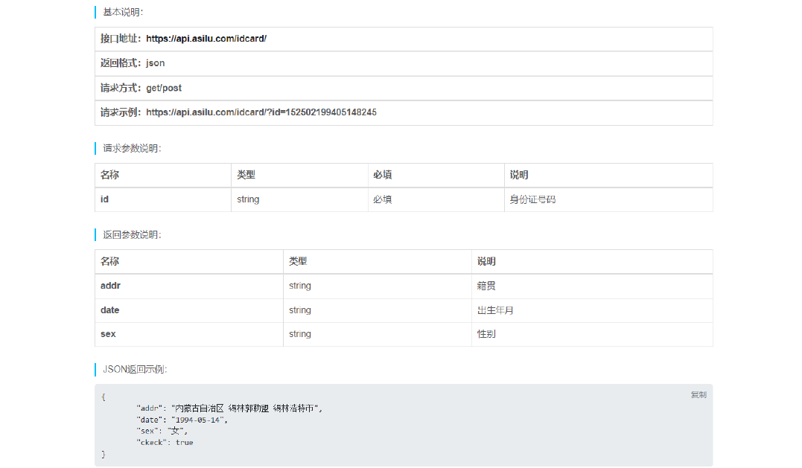

> 体验一下： https://api.asilu.com/idcard/?id=371522199111299668

#### RESTful API

RESTful API 是一种特殊风格的接口，主要特点有如下几个：

- URL 中的路径表示资源，路径中不能有动词，例如create , delete , update 等这些都不能有；
- 操作资源要与 HTTP 请求方法对应；
- 操作结果要与 HTTP 响应状态码对应；

规则示例：

| 操作         | 请求类型 | URL      | 返回                                     |
| ------------ | -------- | -------- | ---------------------------------------- |
| 新增歌曲     | POST     | /song    | 返回新生成的歌曲信息                     |
| 删除歌曲     | DELETE   | /song/10 | 返回一个空文档，10为id号                 |
| 修改歌曲     | PUT      | /song/10 | 完全更新，返回更新后的歌曲信息，10为id号 |
| 修改歌曲     | PATCH    | /song/10 | 局部更新，返回更新后的歌曲信息，10为id号 |
| 获取所有歌曲 | GET      | /song    | 返回歌曲列表数组                         |
| 获取单个歌曲 | GET      | /song/10 | 返回单个歌曲信息，10为id号               |

> 扩展阅读： https://www.ruanyifeng.com/blog/2014/05/restful_api.html

#### json-server

json-server 本身是一个 JS 编写的工具包，可以快速搭建 RESTful API 服务，官方地址: https://github.com/typicode/json-server

操作步骤：

1. 全局安装 json-server

   ```cmd
   npm i -g json-server
   ```

2. 创建 JSON 文件（db.json），编写基本结构
3. ```js
   {
     "$schema": "./node_modules/json-server/schema.json",
     "posts": [
       { "id": "1", "title": "a title", "views": 100 },
       { "id": "2", "title": "another title", "views": 200 }
     ],
     "comments": [
       { "id": "1", "text": "a comment about post 1", "postId": "1" },
       { "id": "2", "text": "another comment about post 1", "postId": "1" }
     ],
     "profile": {
       "name": "typicode"
     }
   }
   ```
4. **以 JSON 文件所在文件夹作为工作目录**，执行如下命令

   ```cmd
   json-server --watch db.json
   ```

> Index:
> http://localhost:3000/
>
> Static files:
> Serving ./public directory if it exists
>
> Endpoints:
> http://localhost:3000/posts
> http://localhost:3000/comments
> http://localhost:3000/profile

5. 通过网络请求如下路由地址：

   ```text
   PS F:\CodingMan\Code2Git> curl http://localhost:3000/posts/1

   StatusCode        : 200
   StatusDescription : OK
   Content           : {
                         "id": "1",
                         "title": "a title",
                         "views": 100
                       }
   RawContent        : HTTP/1.1 200 OK
                       Access-Control-Allow-Origin: *
                       Access-Control-Allow-Methods: GET, HEAD, PUT, PATCH, POST, DELETE
                       Access-Control-Allow-Headers: content-type
                       Connection: keep-alive
                       Keep-Alive: time...
   Forms             : {}
   Headers           : {[Access-Control-Allow-Origin, *], [Access-Control-Allow-Methods, GET, HEAD, PUT, PATCH, POST, DELETE],
                       [Access-Control-Allow-Headers, content-type], [Connection, keep-alive]...}
   Images            : {}
   InputFields       : {}
   Links             : {}
   ParsedHtml        : mshtml.HTMLDocumentClass
   RawContentLength  : 53
   ```

#### 接口工具

介绍几个接口测试工具

- apipost https://www.apipost.cn/ (中文)
- apifox https://www.apifox.cn/ (中文)
- postman https://www.postman.com/ (英文)

#### APIpost工具

##### 基本使用

###### 启动server

```cmd
//第1步：安装json server服务器
npm i -g json-server
//第2步：建立db.json文件
{
  "posts": [
    { "id": "1", "title": "a title", "views": 100 },
    { "id": "2", "title": "another title", "views": 200 },
    { "id": "3", "title": "ketter", "views": 112 },
    { "id": "4", "title": "dogger", "views": 352 }
  ],
  "comments": [
    { "id": "1", "text": "a comment about post 1", "postId": "1" },
    { "id": "2", "text": "another comment about post 1", "postId": "1" }
  ],
  "profile": {
    "name": "typicode"
  }
}
//第3步：监控数据变化
json-server --watch db.json
```

###### 测试server

```cmd
//第4步：测试数据库是否已连接
curl http://localhost:3000/posts/1
```

###### 安装软件

apipost https://www.apipost.cn/ (中文)

###### 基本操作

- **整体查询**

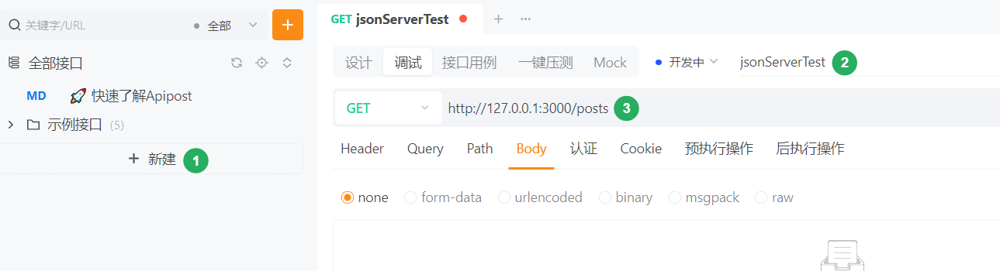

输出内容

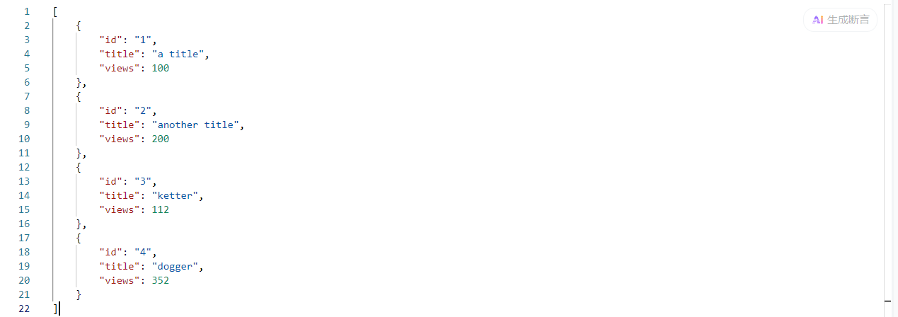

- **单独查询**

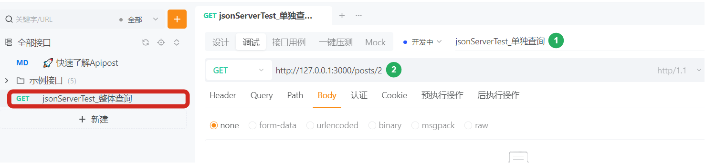

输出内容

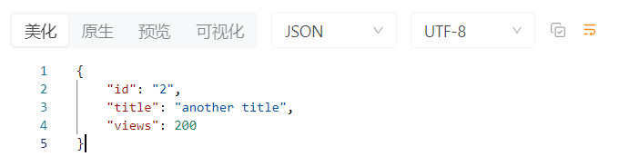

- **查询保存**

通过使用ctrl+s，将查询名字保存，以便后续使用。

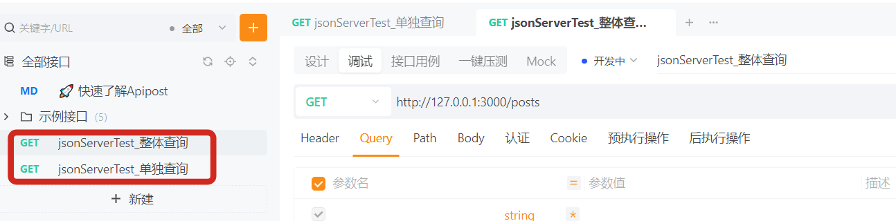

- **前缀设置**

通过如下设置后，后续可直接输入路由路径即可

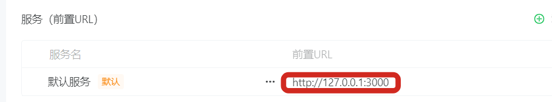

###### 参数介绍

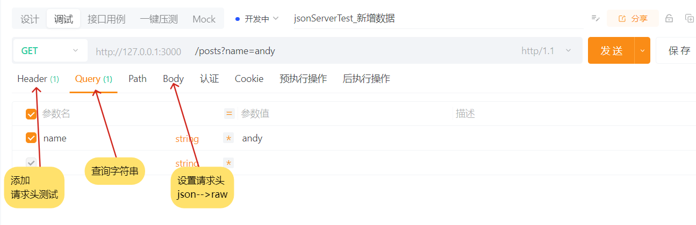

##### 基本操作

###### 增加数据

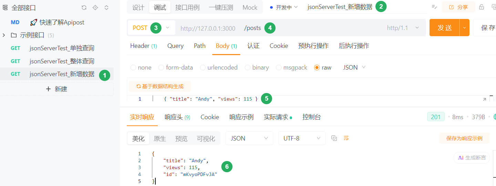

> 备注：
>
> 1）Body采用raw（JSON格式）；
>
> 2）根据RESTful API指定要求，**新增使用post请求**，返回新增后的数据内容。

###### 删除数据

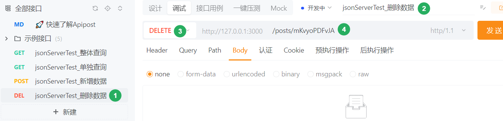

> 根据RESTful API指定要求，**删除使用DELETE请求**，返回空内容。

###### 局部更新

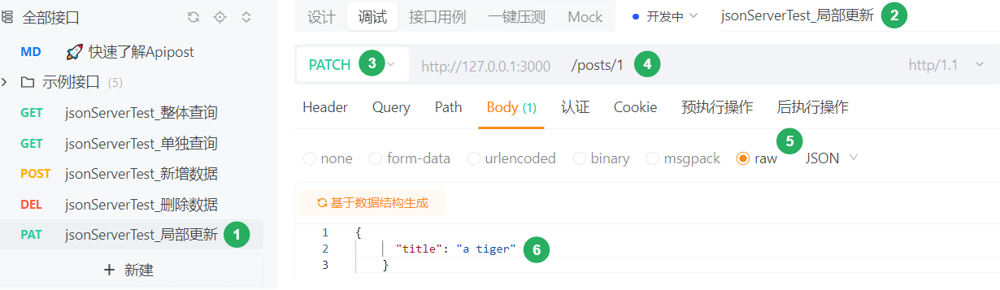

> 备注：
>
> - 局部更新使用PATCH命令；
> - 选择posts/id号，选择body-->raw-->JSON;
> - 添加需要修改的内容，不需要修改的，不用处理

###### 完全更新

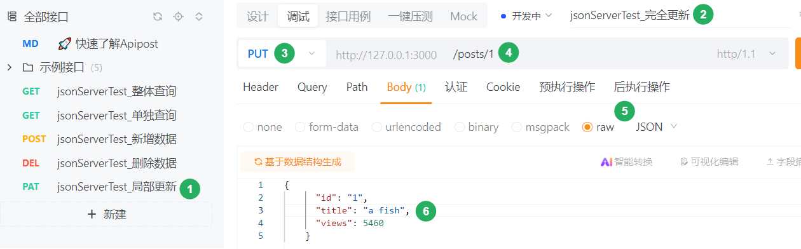

> 备注：
>
> - 局部更新使用PUT命令；
> - 选择posts/id号，选择body-->raw-->JSON;
> - 添加整个id内容，将需要修改的进行修改，不需要修改的不动。

###### 查询数据

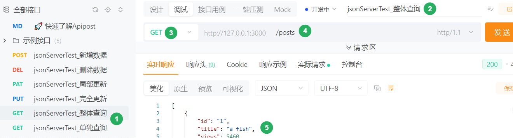

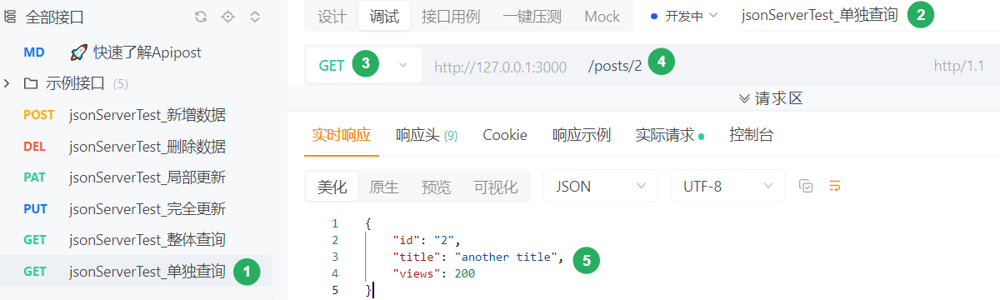

> 备注：
>
> - 查询数据使用get命令；

##### 公共参数

###### 项目需求

在每个请求中都需要有一个公共参数，如：在请求头内具有auth参数，如何批量处理？

###### 需求处理

新建文件夹-->将文件放入其内-->修改目录公共Header-->保存目录-->单个请求命令测试

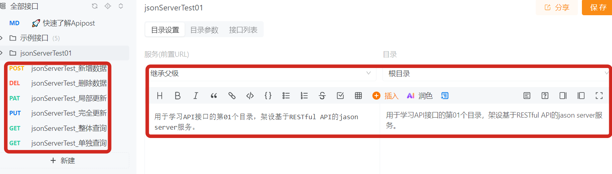

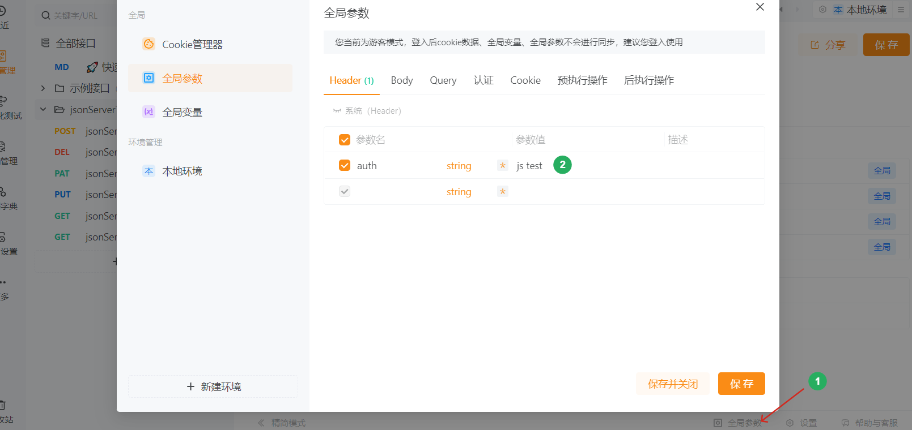

##### 文档功能

可以将API接口的文档通过测试实现并转发给其他使用者。

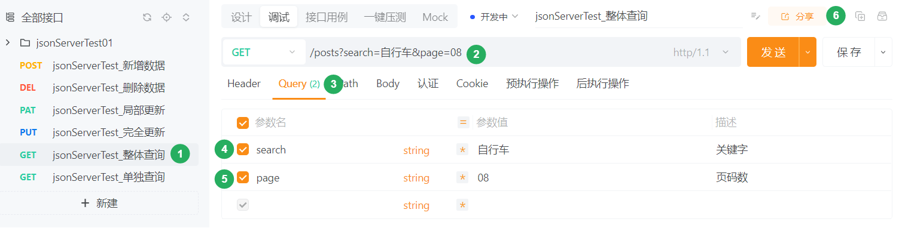

### 会话控制

#### 基本分类

所谓会话控制就是对会话进行控制

HTTP 是一种无状态的协议，它没有办法区分多次的请求是否来自于同一个客户端， 无法区分用户，而产品中又大量存在的这样的需求，所以我们需要通过会话控制来解决该问题。

常见的会话控制技术有三种，实际使用中，可以任选其一：

- cookie
- session
- token

#### 会话种类

##### cookie

###### 基本定义

cookie 是 HTTP 服务器发送到用户浏览器并保存在本地的一小块数据，cookie 是保存在浏览器端的一小块数据。cookie 是按照域名划分保存的。

简单示例：

| 域名                                                       | cookie                        |
| ---------------------------------------------------------- | ----------------------------- |
| [www.baidu.com](typora://app/typemark/www.baidu.com)       | a=100; b=200                  |
| [www.bilibili.com](typora://app/typemark/www.bilibili.com) | xid=1020abce121; hm=112411213 |
| jd.com                                                     | x=100; ocw=12414cce           |

###### 基本特点

浏览器向服务器发送请求时，会自动将当前域名下可用的 cookie 设置在请求头中，然后传递给服务器。这个请求头的名字也叫 cookie ，所以将 cookie 理解为一个 HTTP 的请求头也是可以的。

###### 运行流程

填写账号和密码校验身份，校验通过后下发 cookie

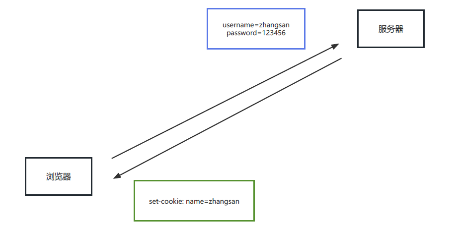

有了 cookie 之后，后续向服务器发送请求时，就会自动携带 cookie。

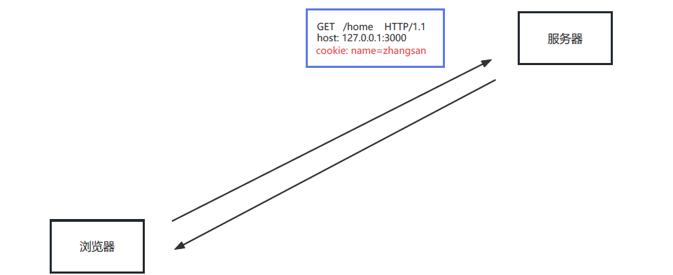

###### 手动操作

浏览器操作 cookie 的操作，使用相对较少，大家了解即可

1. 禁用所有 cookie
2. 删除 cookie
3. 查看 cookie

###### 代码操作

express 中可以使用 cookie-parser 进行处理，cookie.js代码如下：

```js
//导入 express
const express = require("express");
const cookieParser = require("cookie-parser");

//创建应用对象
const app = express();
app.use(cookieParser());

//创建路由规则
app.get("/set-cookie", (req, res) => {
  // res.cookie('name', 'zhangsan'); // 会在浏览器关闭的时候, 销毁
  res.cookie("name", "lisi", { maxAge: 60 * 1000 }); // max 最大  age 年龄
  res.cookie("theme", "blue");
  res.send("home");
});

//删除 cookie
app.get("/remove-cookie", (req, res) => {
  //调用方法
  res.clearCookie("name");
  res.send("删除成功~~");
});

//获取 cookie
app.get("/get-cookie", (req, res) => {
  //获取 cookie
  console.log(req.cookies);
  res.send(`欢迎您 ${req.cookies.name}`);
});

//启动服务
app.listen(3000);
```

> 不同浏览器中的 cookie 是相互独立的，不共享

##### session

###### 基本定义

session 是保存在服务器端的一块儿数据，保存当前访问用户的相关信息，属于cookie的一种。

###### 基本作用

实现会话控制，可以识别用户的身份，快速获取当前用户的相关信息

###### 运行流程

填写账号和密码校验身份，校验通过后创建 session 信息，然后将 session_id 的值通过响应头返回给浏览器浏览

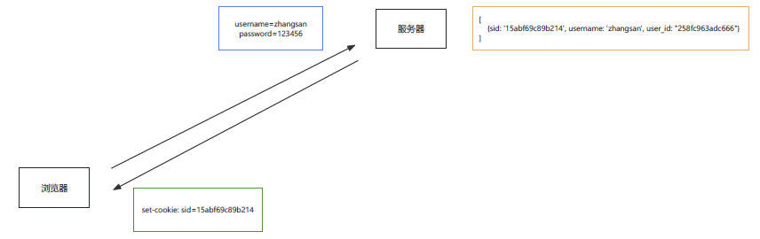

有了 cookie，下次发送请求时会自动携带 cookie，服务器通过 cookie 中的 session_id 的值确定用户的身份

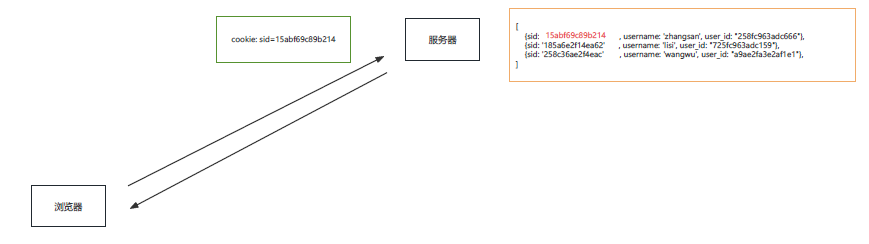

###### 代码操作

express 中可以使用 express-session 对 session 进行操作

```js
// 定义数据库连接地址
const MONGOURL = "mongodb://127.0.0.1:27017/expressTest4Demo";

// 1. 安装包 npm i express-session connect-mongo
// 2. 引入 依赖包
const express = require("express");
const session = require("express-session");
//V5/v6新版标准写法
const MongoStore = require("connect-mongo").create;

// 3. 创建app程序
const app = express();

// 4. 设置 session 的中间件
app.use(
  session({
    //设置cookie的name，默认值是：connect.sid
    name: "sid",
    //参与加密的字符串（又称签名），加盐
    secret: "atguigu",
    //是否为每次请求都设置一个cookie用来存储session的id
    saveUninitialized: false,
    //是否在每次请求时重新保存session，生命周期,生产环境建议改为 false，减少数据库频繁写入
    resave: true,
    //数据库的连接配置
    store: MongoStore({
      mongoUrl: MONGOURL
    }),
    cookie: {
      // 开启后前端无法通过 JS 操作
      httpOnly: true,
      // 这一条 是控制 sessionID 的过期时间的,1000 *300 = 300秒 =5min
      maxAge: 1000 * 300
    }
  })
);

// 5.1 创建 session
app.get("/login", (req, res) => {
  req.session.username = "zhangsan";
  req.session.email = "zhangsan@qq.com";
  res.send("登录成功");
});

// 5.2 获取 session
app.get("/home", (req, res) => {
  console.log("session的信息");
  console.log(req.session.username);
  if (req.session.username) {
    res.send(`你好 ${req.session.username}`);
  } else {
    res.send("登录 注册");
  }
});

// 5.3 销毁 session
app.get("/logout", (req, res) => {
  //销毁session
  // res.send('设置session');
  req.session.destroy(() => {
    if (err) return res.send("退出失败");
    res.clearCookie("sid"); // 手动清除浏览器sid cookie，彻底失效
    res.send("成功退出");
  });
});

// 6 创建监听窗口
app.listen(3000, () => {
  console.log("服务已经启动, 端口 " + 3000 + " 监听中...");
});
```

> PS F:\CodingMan\Code2Git\01-Stu\04-BackEnd\05-会话控制> npm i express-session connect-mongo
>
> added 32 packages in 3s
>
> 2 packages are looking for funding
> run `npm fund` for details
> PS F:\CodingMan\Code2Git\01-Stu\04-BackEnd\05-会话控制>
>
> express-session:用于管理session
>
> connect-mongo:用于连接mongo数据库

##### 两者区别

###### 存在位置

- cookie:浏览器端

- session:服务端+浏览器端

###### 安全性

- cookie是以明文的方式存放在客户端的，安全性相对较低；
- session存放于服务器中，所以安全性相对较好；

###### 网络传输

- cookie设置内容过多会增大报文体积，会影响传输效率

- session数据存储在服务器，只是通过cookie传递id,所以不影响传输效率

###### 存储限制

浏览器限制单个cookie保存的数据不能超过4K，且单个域名下的存储数量也有限制session数据存储在服务器中，所以没有这些限制。

##### token

###### 基本定义

token 是服务端生成并返回给 HTTP 客户端的一串加密字符串， token 中保存着用户信息。

###### 基本作用

实现会话控制，可以识别用户的身份，主要用于移动端 APP

###### 工作流程

填写账号和密码校验身份，校验通过后响应 token，token 一般是在响应体中返回给客户端的

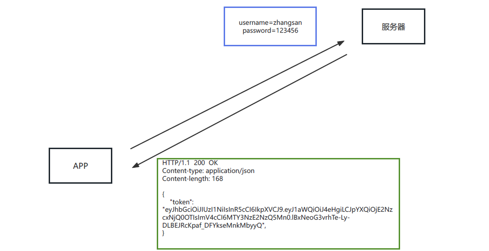

后续发送请求时，需要手动将 token 添加在请求报文中，一般是放在请求头中。

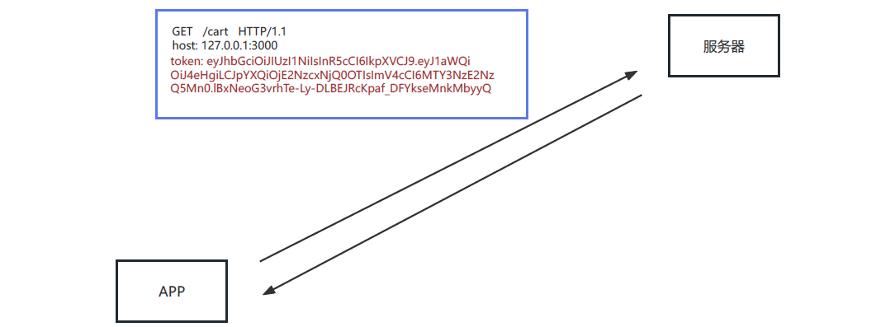

###### 基本特点

- 服务端压力更小
  - 数据存储在客户端
- 相对更安全
  - 数据加密
  - 可以避免 CSRF（跨站请求伪造）
- 扩展性更强
  - 服务间可以共享
  - 增加服务节点更简单

###### JWT认证

JWT（JSON Web Token ）是目前最流行的跨域认证解决方案，可用于基于 token 的身份验证，JWT 使 token 的生成与校验更规范，我们可以使用 jsonwebtoken 包来操作 token：

```js
//导入 jsonwebtokan
const jwt = require("jsonwebtoken");
//创建 token
// jwt.sign(数据, 加密字符串, 配置对象)
let token = jwt.sign(
  {
    username: "zhangsan"
  },
  "atguigu",
  {
    expiresIn: 60 //单位是 秒
  }
);
//解析 token
jwt.verify(token, "atguigu", (err, data) => {
  if (err) {
    console.log("校验失败~~");
    return;
  }
  console.log(data);
});
```

> 扩展阅读： https://www.ruanyifeng.com/blog/2018/07/json_web_token-tutorial.html

## 域名证书

### 本地域名

所谓本地域名就是只能在本机使用的域名，一般在开发阶段使用。

#### 操作流程

编辑文件 C:\Windows\System32\drivers\etc\hosts `127.0.0.1 www.baidu.com`

> 如果修改失败， 可以修改该文件的权限
>
> 实际访问：www.baidu.com:3000
>
> 若需要去掉3000端口号，可将端口号修改为80即可使用www.baidu.com访问

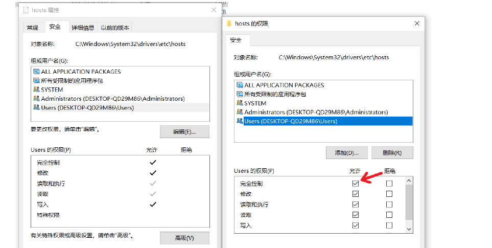

#### 基本原理

- 在地址栏输入域名之后，浏览器会先进行 DNS（Domain Name System） 查询，获取该域名对应的 IP 地址，请求会发送到 DNS 服务器，可以根据域名返回 IP 地址。

- 可以通过 ipconfig /all 查看本机的 DNS 服务器。

- hosts 文件也可以设置域名与 IP 的映射关系，在发送请求前，可以通过该文件获取域名的 IP 地址。

### 配置证书

https本意是http+SSL(Secure Sockets Layer安全套接层)，https可以加密HTTP报文，所以大家也可以理解为是安全的HTTP

工具官网：`https:/certbot.eff.org/`

操作流程：

1.下载工具https://d1.eff.org/certbot-beta-installer-win_amd64.exe

2.安装工具

3.管理员运行命令`certbot certonly--standalone`

4.代码配置如下:

```js
const https = require("https");
https
  .createServer(
    {
      key: fs.readFileSync("/etc/letsencrypt/path/to/key.pem"),
      cert: fs.readFileSync("/etc/letsencrypt/path/to/cert.pem"),
      ca: fs.readFileSync("/etc/letsencrypt/path/to/chain.pem")
    },
    app
  )
  .listen(443, () => {
    console.log("Listening.··");
  });
```

> 在www文件中修改如下：
>
> ```js
> const fs = require("fs");
> //https的默认端口为443端口
> var port = normalizePort(process.env.PORT || "443");
> //etc/letsencrypt/path/to/ 填写为实际路径，需要反斜线\\
> var server = https.createServer(
>   {
>     key: fs.readFileSync("/etc/letsencrypt/path/to/key.pem"),
>     cert: fs.readFileSync("/etc/letsencrypt/path/to/cert.pem"),
>     ca: fs.readFileSync("/etc/letsencrypt/path/to/chain.pem")
>   },
>   app
> );
> ```
>
> > 完成后即可启动服务器

5. 证书更新 证书有效期为三个月，可以通过下面的命令更新：

```本文
## 一般证书
certbot renew
##强制更新
certbot --force-renewal
```

> 截止到目前，您的前端项目就可以正式上线了。
