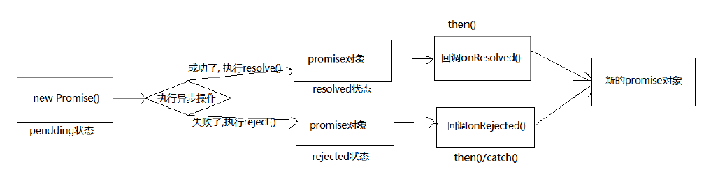
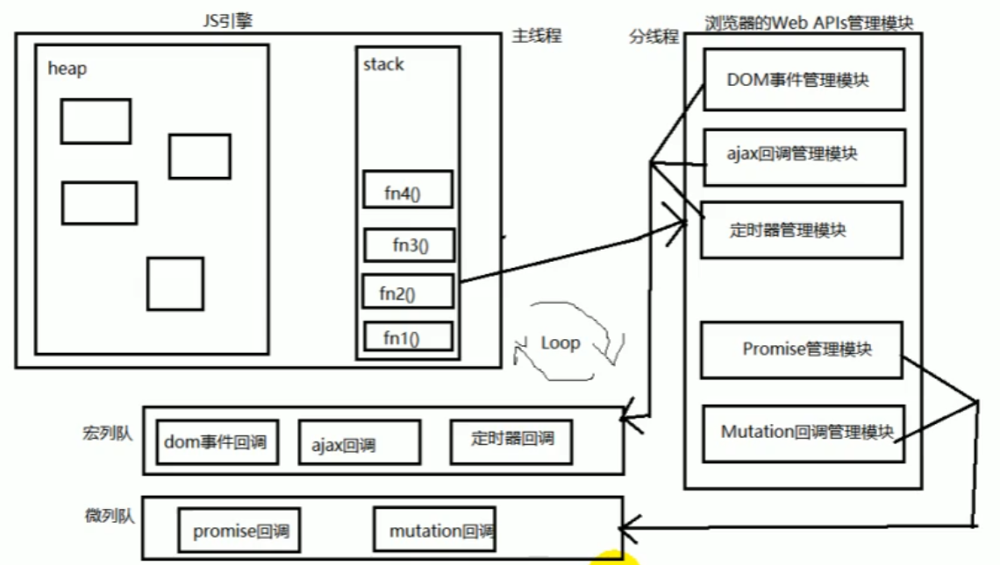
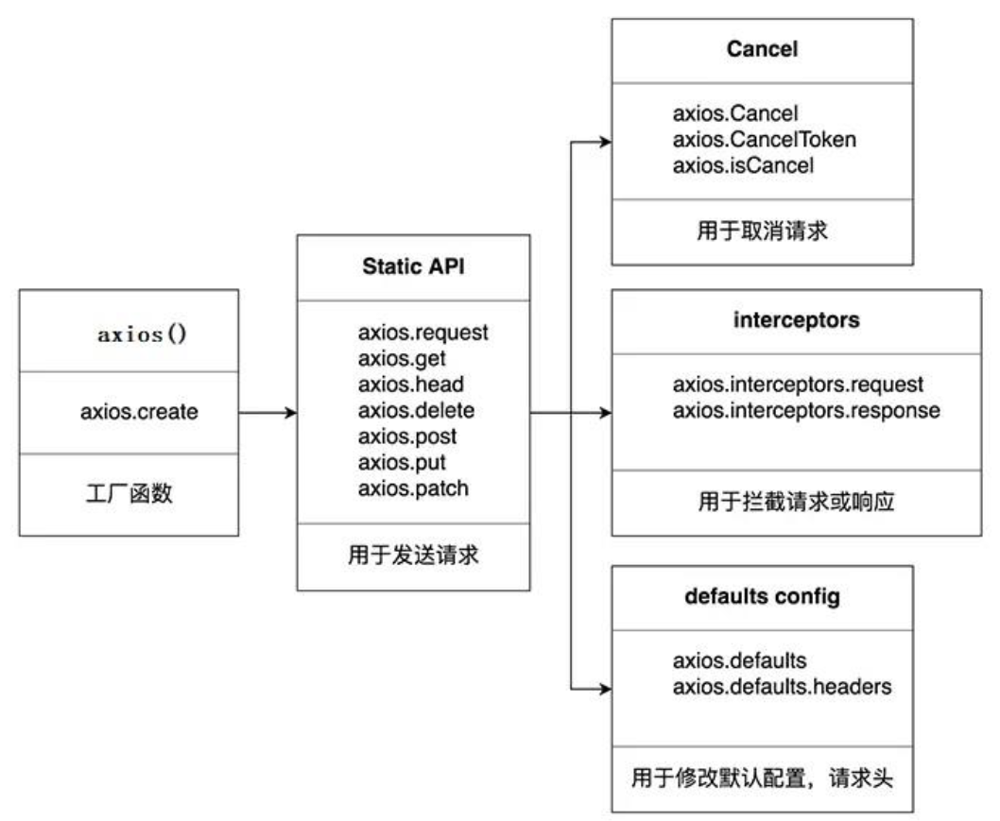
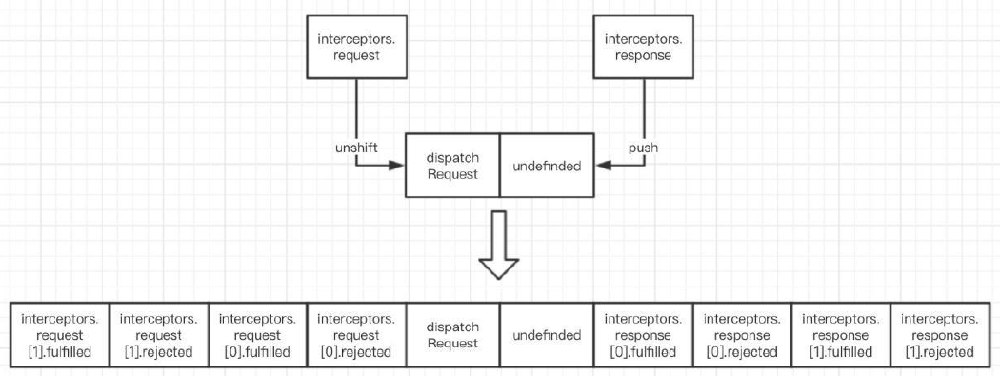

# 06-技术承接

## Promise

### 理解定义

#### 基本定义

##### 基本概念

###### 抽象表达

1. Promise是一门新的技术，是一门新的技术 (ES6规范 ) ；
2. Promise是 JS中进行异步编程的中进行异步编程的新解决方案，旧方案是单纯使用回调函数。

###### 具体表达

1. 从语法上来说 : Promise是一个构造函数
2. 从功能上来说 : promise对象用来封装一个异步操作并可以获取其成功/失败。

##### 状态改变

1. pending变为 resolved
2. pending变为 rejected

   说明 : 只有这 2种, 且promise对象只能改变一次，无论变为成功还是失败 , 都会有一个结果数据。成功的结果数据一般称为 value, 失败的结果数据一般称为reason。

##### 基本流程



##### 基本使用

###### 基本编码流程

```js
/**
 * Project Name(js):01-基本编码流程.js
 * Project Name(html):01-基本使用之准备.html
 */
// 1) 创建promise对象(pending状态), 指定执行器函数
const p = new Promise((resolve, reject) => {
  // 2) 在执行器函数中启动异步任务
  setTimeout(() => {
    const time = Date.now();
    // 3) 根据结果做不同处理
    // 3.1) 如果成功了, 调用resolve(), 指定成功的value, 变为resolved状态
    if (time % 2 === 1) {
      resolve("成功的值 " + time);
    } else {
      // 3.2) 如果失败了, 调用reject(), 指定失败的reason, 变为rejected状态
      reject("失败的值" + time);
    }
  }, 2000);
});
// 4) 能promise指定成功或失败的回调函数来获取成功的vlaue或失败的reason
p.then(
  (value) => {
    // 成功的回调函数onResolved, 得到成功的vlaue
    console.log("成功的value: ", value);
  },
  (reason) => {
    // 失败的回调函数onRejected, 得到失败的reason
    console.log("失败的reason: ", reason);
  },
);
```

###### promise封装

```js
/**
 * Project Name(js):02-promise封装.js
 * Project Name(html):01-基本使用之准备.html
 */
//使用 promise封装基于定时器的异步
function doDelay(time) {
  // 1. 创建promise对象
  return new Promise((resolve, reject) => {
    // 2. 启动异步任务
    console.log("02启动异步任务");
    setTimeout(() => {
      console.log("02延迟任务开始执行...");
      // 假设: 时间为奇数代表成功, 为偶数代表失败
      const time = Date.now();
      if (time % 2 === 1) {
        // 成功了
        // 3. 1. 如果成功了, 调用resolve()并传入成功的value
        resolve("02成功的数据 " + time);
      } else {
        // 失败了
        // 3.2. 如果失败了, 调用reject()并传入失败的reason
        reject("02失败的数据 " + time);
      }
    }, time);
  });
}
const promise = doDelay(2000);
promise.then(
  (value) => {
    console.log("02成功的value: ", value);
  },
  (reason) => {
    console.log("02失败的reason: ", reason);
  },
);
```

```js
/**
 * Project Name(js):03-使用promise封装axis.js
 * Project Name(html):01-基本使用之准备.html
 */
//使用 promise封装 ajax异步请求
/* 可复用的发ajax请求的函数: xhr + promise */
function promiseAjax(url) {
  return new Promise((resolve, reject) => {
    setTimeout(() => {
      const xhr = new XMLHttpRequest();
      xhr.onreadystatechange = () => {
        if (xhr.readyState !== 4) return;
        const { status, response } = xhr;
        // 请求成功, 调用resolve(value)
        if (status >= 200 && status < 300) {
          resolve(JSON.parse(response));
        } else {
          // 请求失败, 调用reject(reason)
          reject(new Error("请求失败: status: " + status));
        }
      };
      xhr.open("GET", url);
      xhr.send();
    }, 5000);
  });
}
promiseAjax("https://api.apiopen.top2/getJoke?page=1&count=2&type=video").then(
  (value) => {
    console.log("显示成功数据", value);
  },
  (reason) => {
    alert(reason.message);
  },
);
```

#### 使用优势

##### 更加灵活

1. 旧的 : 必须在启动异步任务前指定
2. promise: 启动异步 => 返回 promie对象 => 给 promise对象绑定回调函数(甚至可以在异步任务结束后指定一/多个 )

##### 链式调用

支持链式调用 , 可以解决回调地狱问题：

1. 什么是回调地狱 ?

   回调函数嵌套用 , 外部回调函数异步执行的结果是嵌套条件
2. 回调地狱的缺点 ?

   不便于阅读，不便于异常处理
3. 解决方案 ?

   promise链式调用，promise Object.then()...catch()
4. 终极解决方案 ?

   ```js
   //终极解决方案
   async/await:
   asynv function...(){
   
   ... await function...()
   ... await function...()
   ... await function...()
   }catch(error){
       ...
   }
   ```

```js
//以下是伪代码，为了展示Promise的优势及回调函数地狱的含义
// 成功的回调函数
function successCallback(result) {
  console.log("声音文件创建成功: " + result);
}
// 失败的回调函数
function failureCallback(error) {
  console.log("声音文件创建失败: " + error);
}
/* 1.1 使用纯回调函数 */
createAudioFileAsync(audioSettings, successCallback, failureCallback);

/* 1.2. 使用Promise */
const promise = createAudioFileAsync(audioSettings);

setTimeout(() => {
  promise.then(successCallback, failureCallback);
}, 3000);
/* 2.1. 回调地狱 */
doSomething(function (result) {
  doSomethingElse(
    result,
    function (newResult) {
      doThirdThing(
        newResult,
        function (finalResult) {
          console.log("Got the final result: " + finalResult);
        },
        failureCallback,
      );
    },
    failureCallback,
  );
}, failureCallback);
/* 2.2. 使用promise的链式调用解决回调地狱 */
doSomething()
  .then(function (result) {
    return doSomethingElse(result);
  })
  .then(function (newResult) {
    return doThirdThing(newResult);
  })
  .then(function (finalResult) {
    console.log("Got the final result: " + finalResult);
  })
  .catch(failureCallback);
/* 2.3. async/await: 回调地狱的终极解决方案 */
async function request() {
  try {
    const result = await doSomething();
    const newResult = await doSomethingElse(result);
    const finalResult = await doThirdThing(newResult);
    console.log("Got the final result: " + finalResult);
  } catch (error) {
    failureCallback(error);
  }
}
```

### 基本语法

#### API方法

```js
/** API方法 
1. Promise构造函数 : Promise (excutor) {}
    (1) executor函数 : 执行器 (resolve, reject) => {}
    (2) resolve函数 : 内部定义成功时我们调用的函数value => {}
    (3) reject函数 : 内部定义失败时我们调用的函数 reason => {}
    说明 : executor会在 Promise内部立即同步调用，异步操作在执行

2. Promise.prototype.then方法 : (onResolved, onRejected) => {}
    (1) onResolved函数 : 成功的回调函数(value) => {}
    (2) onRejected函数 : 失败的回调函数(reason) => {}
    说明 : 指定用于得到成功value的成功回调和用于得到失败reason的失败回调返回一个新的 promise对象

3. Promise.prototype.catch方法 : (onRejected) => {}
    (1) onRejected函数 : 失败的回调函数(reason) => {}
    说明 : then()的语法糖 的语法糖 的语法糖 , 相当于 相当于 : then(undefined, onRejected)

4. Promise.resolve方法 : (value) => {}
    (1) value: 成功的数据或promise对象
    说明 : 返回一个成功/失败的 promise对象

5. Promise.reject方法 : (reason) => {}
    reason: 失败的原因
    说明 : 返回一个失败的 返回一个失败的 返回一个失败的 返回一个失败的 promise对象

6. Promise.all方法 : (promises) => {}
    promises: 包含 n个 promise的数组 的数组
    说明 : 返回一个新的promise，只有所有的 promise都成功才都成功，只要有一个失败了就直接失败

7. Promise.race方法 : (promises) => {}
    promises: 包含 n个 promise的数组 的数组
    说明 : 返回一个新的promise, 第一个完成的promise的结果状态就是最终的结果状态
*/
```

##### 构造函数

```js
/**
 * 主要讲解如下内容：
 * 1. Promise构造函数 : Promise (excutor) {}
        (1) executor函数 : 执行器 (resolve, reject) => {}
        (2) resolve函数 : 内部定义成功时我们调用的函数value => {}
        (3) reject函数 : 内部定义失败时我们调用的函数 reason => {}
        说明 : executor会在 Promise内部立即同步调用，异步操作在执行
 */
new Promise((resolve, reject) => {
  setTimeout(() => {
    // resolve("成功的数据");
    reject("失败的数据");
  }, 1000);
})
  .then((value) => {
    console.log("onResolved()1", value);
  })
  .catch((reason) => {
    console.log("onRejected()1", reason);
  });

const p1 = new Promise((resolve, reject) => {
  resolve(1);
});
const p2 = Promise.resolve(2);

const p3 = Promise.reject(3);

p1.then((value) => {
  console.log(value);
});

p2.then((value) => {
  console.log(value);
});

p3.catch((reason) => {
  console.log(reason);
});
```

##### then方法

```js
/**
 * 主要讲解如下内容：
 * 2. Promise.prototype.then方法 : (onResolved, onRejected) => {}
    (1) onResolved函数 : 成功的回调函数(value) => {}
    (2) onRejected函数 : 失败的回调函数(reason) => {}
    说明 : 指定用于得到成功value的成功回调和用于得到失败reason的失败回调返回一个新的 promise对象
 */
new Promise((resolve, reject) => {
  setTimeout(() => {
    // resolve("成功的数据");
    reject("失败的数据");
  }, 1000);
})
  .then((value) => {
    console.log("onResolved()1", value);
  })
  .catch((reason) => {
    console.log("onRejected()1", reason);
  });

const p1 = new Promise((resolve, reject) => {
  resolve(1);
});
const p2 = Promise.resolve(2);

const p3 = Promise.reject(3);

p1.then((value) => {
  console.log(value);
});

p2.then((value) => {
  console.log(value);
});

p3.catch((reason) => {
  console.log(reason);
});
```

##### catch方法

```js
/**
 * 主要讲解如下内容：
 * 3. Promise.prototype.catch方法 : (onRejected) => {}
    (1) onRejected函数 : 失败的回调函数(reason) => {}
    说明 : then()的语法糖 的语法糖 的语法糖 , 相当于 相当于 : then(undefined, onRejected)
 */
new Promise((resolve, reject) => {
  setTimeout(() => {
    // resolve("成功的数据");
    reject("失败的数据");
  }, 1000);
})
  .then((value) => {
    console.log("onResolved()1", value);
  })
  .catch((reason) => {
    console.log("onRejected()1", reason);
  });

const p1 = new Promise((resolve, reject) => {
  resolve(1);
});
const p2 = Promise.resolve(2);

const p3 = Promise.reject(3);

p1.then((value) => {
  console.log(value);
});

p2.then((value) => {
  console.log(value);
});

p3.catch((reason) => {
  console.log(reason);
});
```

##### resolve方法

```js
/**
 * 主要讲解如下内容：
 * 4. Promise.resolve方法 : (value) => {}
        (1) value: 成功的数据或 成功的数据或 成功的数据或 promise对象
        说明 : 返回一个成功/失败的 promise对象
 */
new Promise((resolve, reject) => {
  setTimeout(() => {
    // resolve("成功的数据");
    reject("失败的数据");
  }, 1000);
})
  .then((value) => {
    console.log("onResolved()1", value);
  })
  .catch((reason) => {
    console.log("onRejected()1", reason);
  });

const p1 = new Promise((resolve, reject) => {
  resolve(1);
});
const p2 = Promise.resolve(2);

const p3 = Promise.reject(3);

p1.then((value) => {
  console.log(value);
});

p2.then((value) => {
  console.log(value);
});

p3.catch((reason) => {
  console.log(reason);
});
```

##### reject方法

```js
/**
 * 主要讲解如下内容：
 * 5. Promise.reject方法 : (reason) => {}
        reason: 失败的原因
        说明 : 返回一个失败的 返回一个失败的 返回一个失败的 返回一个失败的 promise对象
 */
new Promise((resolve, reject) => {
  setTimeout(() => {
    // resolve("成功的数据");
    reject("失败的数据");
  }, 1000);
})
  .then((value) => {
    console.log("onResolved()1", value);
  })
  .catch((reason) => {
    console.log("onRejected()1", reason);
  });

const p1 = new Promise((resolve, reject) => {
  resolve(1);
});
const p2 = Promise.resolve(2);

const p3 = Promise.reject(3);

p1.then((value) => {
  console.log(value);
});

p2.then((value) => {
  console.log(value);
});

p3.catch((reason) => {
  console.log(reason);
});
```

##### all方法

```js
/**API方法
 * 主要讲解如下内容：
 * 6. Promise.all方法 : (promises) => {}
    promises: 包含 n个 promise的数组 的数组
    说明 : 返回一个新的promise，只有所有的 promise都成功才都成功，只要有一个失败了就直接失败
 */

new Promise((resolve, reject) => {
  setTimeout(() => {
    // resolve("成功的数据");
    reject("失败的数据");
  }, 1000);
})
  .then((value) => {
    console.log("onResolved()1", value);
  })
  .catch((reason) => {
    console.log("onRejected()1", reason);
  });

const p1 = new Promise((resolve, reject) => {
  resolve(1);
});
const p2 = Promise.resolve(2);

const p3 = Promise.reject(3);

p1.then((value) => {
  console.log(value);
});

p2.then((value) => {
  console.log(value);
});

p3.catch((reason) => {
  console.log(reason);
});

//因为p3失败，所以pAll1为失败
const pAll1 = Promise.all([p1, p2, p3]);

//因为p1/p2成功，所以pAll2为成功
const pAll2 = Promise.all([p1, p2]);

//All：数组内，全部pass即为pass，一个fail，即为fail
//结果：all onRejected()3 3
pAll1.then(
  (value) => {
    console.log("all onResolve())3", value);
  },
  (reason) => {
    console.log("all onRejected()3", reason);
  },
);

//All：数组内，全部pass即为pass，一个fail，即为fail
//结果：all onResolve())4 (2) [1, 2]
pAll2.then(
  (value) => {
    console.log("all onResolve())4", value);
  },
  (reason) => {
    console.log("all onRejected()4", reason);
  },
);
```

##### Race方法

```js
/**API方法
 * 主要讲解如下内容：
 * 7. Promise.race方法 : (promises) => {}
        promises: 包含 n个 promise的数组 的数组
        说明 : 返回一个新的promise, 第一个完成的promise的结果状态就是最终的结果状态
 */
new Promise((resolve, reject) => {
  setTimeout(() => {
    // resolve("成功的数据");
    reject("失败的数据");
  }, 1000);
})
  .then((value) => {
    console.log("onResolved()1", value);
  })
  .catch((reason) => {
    console.log("onRejected()1", reason);
  });

const p1 = new Promise((resolve, reject) => {
  resolve(1);
});
const p2 = Promise.resolve(2);

const p3 = Promise.reject(3);

p1.then((value) => {
  console.log(value);
});

p2.then((value) => {
  console.log(value);
});

p3.catch((reason) => {
  console.log(reason);
});

//race:数组内第一个完成的结果就是pRace1的结果
//结果，all onResolve())5 1
const pRace1 = Promise.race([p1, p2, p3]);
pRace1.then(
  (value) => {
    console.log("all onResolve())5", value);
  },
  (reason) => {
    console.log("all onRejected()5", reason);
  },
);

//race:数组内第一个完成的结果就是pRace1的结果
//结果，all onResolve())5 1
const pRace2 = Promise.race([p3, p2, p1]);
pRace2.then(
  (value) => {
    console.log("all onResolve())6", value);
  },
  (reason) => {
    console.log("all onRejected()6", reason);
  },
);
```

#### 注意事项

##### 注意事项01

```js
/* 
1. 如何改变 promise的状态 的状态 ?

   (1) resolve(value): 如果当前是pending就会变为 resolved

   (2) reject(reason): 如果当前是pending就会变为rejected

   (3) 抛出异常: 如果当前是pending就会变为rejected

2. 一个 promise指定多个成功/失败回调函数 , 都会调用吗 ?

   当 promise改变为对应状态时都会调用

*/

const p1 = new Promise((resolve, reject) => {
  //Promise变为resolved成功状态
  //   resolve(1);

  //Promise变为rejected成功状态
  reject(2);

  //抛出异常，Promise变为rejected失败状态，异常err信息就是抛出的error
  throw new Error("出错了");

  /* //以下也是对的，可以抛出任何
  throw 3; */
});

p1.then(
  (value) => {
    console.log("value", value);
  },
  (reason) => {
    console.log("reason", reason);
  },
);

p1.then(
  (value) => {
    console.log("value2", value);
  },
  (reason) => {
    console.log("reason2", reason);
  },
);
```

##### 注意事项02

```js
/* 
3. 改变 promise状态和指定回调函数谁先后 ?

   (1) 都有可能, 正常情况下是先指定回调再改变状态, 但也可以先改状态再指定回调

   (2) 如何先改状态再指定回调?

   ① 在执行器中直接调用resolve()/reject()

   ② 延迟更长时间才调用then()

   (3) 什么时候才能得到数据?

   ① 如果先指定的回调,那当状态发生改变时,回调函数就会用, 得到数据

   ② 如果先改变的状态,那当指定回调时时,回调函数就会用,得到数据

*/
//先指定回调函数，保存当前指定的回调函数，后改变的状态（同时指定数据），异步执行回调函数
new Promise((resolve, reject) => {
  setTimeout(() => {
    resolve(1);
  }, 1000);
}).then(
  (value) => {},
  (reason) => {
    console.log("reason", reason);
  },
);

//a.先改变的状态（同时指定数据），后指定回调函数，异步执行回调函数
new Promise((resolve, reject) => {
  setTimeout(() => {
    resolve(1);
  }, 1000);
}).then(
  (value) => {},
  (reason) => {
    console.log("reason", reason);
  },
);

//b.将then做一个延时启动，这样就可以实现先改变的状态（同时指定数据），后指定回调函数，异步执行回调函数
const p4 = new Promise((resolve, reject) => {
  setTimeout(() => {
    resolve(1);
  }, 1000);
});

setTimeout(() => {
  p4.then(
    (value) => {},
    (reason) => {
      console.log("reason", reason);
    },
  );
}, 1100);
```

##### 注意事项03

```js
/* 
4. promise.then()返回的新promise的结果状态由什么决定的?

   (1) 简单表达: 由then()指定的回调函数执行结果决指定

   (2) 详细表达:

   ① 如果抛出异常,新promise变为rejected,reason为抛出的异常

   ② 如果返回的是非,promise的任意值, 新promise变为resolved,value为返回的值

   ③ 如果返回的是另一个新promise, 此promise的结果就会成为新promise的结果

*/
//输出：
// onRejected1() 1
// undifined
new Promise((resolve, reject) => {
  resolve(1);
})
  .then(
    (value) => {
      //因为下面这样成功被执行，所以在第二个then中需要看的就是这面这行的返回值决定，但是这行的返回值是undefined
      console.log("onResolved1()", value);
      //如果增加return 2,则最终输出的数据就是：onRejected1() 1 和2
      // return 2;
      //如果返回的是另一个新promise, 此promise的结果就会成为新promise的结果
      // return Promise.resolve(3);
      // return Promise.reject(4);

      //但是如果抛出异常,则就是失败，失败返回值为5
      throw 5;
    },
    (reason) => {
      console.log("onRejected1()", reason);
    },
  )
  .then(
    (value) => {
      console.log("onResolved2()", value);
    },
    (reason) => {
      console.log("onRejected2()", reason);
    },
  );
```

##### 注意事项04

```js
/* 
5. promise如何串连多个操作任务 如何串连多个操作任务 ?

   (1) promise的 then()返回一个新的promise, 可以看成 then()的链式调用

   (2) 通过 then的链式调用串连多个同步的链式调用串连多个同步 /异步任务

*/

//以下代码想实现如下打印效果：
/* 
执行异步任务1
任务1的结果：1
执行同步任务2
任务2的结果：2
执行异步任务3
任务3的结果：3
 */
new Promise((resolve, reject) => {
  setTimeout(() => {
    console.log("执行异步任务1");
    resolve(1);
  }, 1000);
})
  .then((value) => {
    console.log("任务1的结果：", value);
    console.log("执行同步任务2");
    return 2;
  })
  .then((value) => {
    console.log("任务2的结果：", value);

    //此处通过new一个promise的目的是为了后面.then，因为.then需要一个promise对象
    new Promise((resolve, reject) => {
      setTimeout(() => {
        console.log("执行异步任务3");
        resolve(3);
      }, 1000);
    });
  })
  .then((value) => {
    console.log("任务3的结果：", value);
  });
```

##### 注意事项05

```js
/* 
6. promise异常传透 ?

(1) 当使用promise的then链式调用时, 可以在最后指定失败的回调

(2) 前面任何操作出了异常，都会传到最后失败的回调中处理

7. 中断 promise链?

(1) 当使用promise的then链式调用时,在中间中断,不再调用后面的回调函数

(2) 办法 : 在回调函数中返一个pendding状态的promise

*/

//当then后没有写reason()=>{},相当于写了reason=>{throw reason}或者可以写为reason =>Promise.rejected(reason)
new Promise((resolve, reject) => {
  resolve(1);
  reject(1);
})
  .then((value) => {
    console.log("onResolved1()", value);
    return 2;
  })
  .then((value) => {
    console.log("onResolved2()", value);
    return 3;
  })
  .then((value) => {
    console.log("onResolved3()", value);
  })
  .catch((reason) => {
    console.log("onRejected()1", reason);

    //返回一个一直在pending的promise，导致后面的一直在等待结果，但是一直没有结果，所以，通过这种方式结束后面的链式反应
    return new Promise(() => {});
  })
  .then(
    (value) => {
      console.log("onResolved3()", value);
    },
    (reason) => {
      console.log("onRejected2()", reason); //catch成功了，所以调用此方法
    },
  );
```

### 定义封装

#### 整体结构

```js
/* 
自定义Promi函数模块：IIFE
*/

(function (window) {
  /* 
    promise构造函数
    executor:执行器函数（）
    */
  function Promise(executor) {
    function resolve(value) {}
    function reject(reason) {}

    //执行器函数定义
    executor(resolve, reject);
  }

  /* 
  Promise原型对象的then()方法
  指定成功与失败的回调函数
  返回值为新的Promise对象
  */
  Promise.prototype.then = function (onResolved, onRejected) {};

  /* 
  Promise原型对象的catch()方法
  指定失败的回调函数
  返回值为一个新的Promise对象
  */
  Promise.prototype.catch = function (onRejected) {};

  /* 
  Promise函数对象方法：resolve
  返回一个指定结果的成功的Promise
  */
  Promise.resolve = function (value) {};

  /* 
  Promise函数对象方法：reject
  返回一个指定reason失败的Promise
  */
  Promise.reject = function (season) {};

  /* 
  Promise函数对象方法：all
  返回一个Promise：只有当所有Promise都成功时，才成功；否则即失败
  */
  Promise.all = function (promises) {};

  /* 
  Promise函数对象方法：race
  返回一个Promise：结果由第一个完成的Promise的结果决定
  */
  Promise.race = function (promises) {};
})(window);

//向外暴露Promise函数
window.Promise = Promise;
```

#### 构造函数

html展示与调试代码：

```text
<!doctype html>
<html lang="en">
  <head>
    <meta charset="UTF-8" />
    <meta name="viewport" content="width=device-width, initial-scale=1.0" />
    <title>演示自定义的Promise</title>
  </head>
  <body></body>
  <script src="./lib/01-Promise_结构搭建.js"></script>

  <!-- 如下为研究构造函数时候使用的 -->
  <script>
    const p = new Promise((resolve, reject) => {
      setInterval(() => {
        // resolve(1);
        reject(2);
      }, 100);
    });
    p.then(
      (value) => {
        console.log("OnResolved()1", value);
      },
      (reason) => {
        console.log("OnRejected()1", reason);
      },
    );
    p.then(
      (value) => {
        console.log("OnResolved()2", value);
      },
      (reason) => {
        console.log("OnRejected()2", reason);
      },
    );
  </script>
</html>
```

如下为01-Promise_结构搭建.js代码-主要体现构造函数部分

```js
function Promise(executor) {
  //将当前promise对象保存起来
  const _this = this;
  //给Promie对象指定status属性，初始值为pending
  _this.status = "pending";

  //给Promise对象指定一个用于存储结果数据的属性
  _this.data = undefined;

  //每个元素的结构:{onResolved(){},onRejected(){}}
  _this.callbacks = [];

  function resolve(value) {
    //如果当前状态不是pending，直接结束
    if (_this.status !== "pending") {
      return;
    }
    // 1. 将状态修改为resolved
    _this.status = "resolved";
    // 2. 将数据保存到_this.data
    _this.data = value;
    //如果有待执行的callback函数，立即异步执行回调函数onResolved
    if (_this.callbacks.length > 0) {
      //采用定时器模拟队列执行方式
      setTimeout(() => {
        _this.callbacks.forEach((callbacksObj) => {
          callbacksObj.onResolved(value);
        });
      });
    }
  }
  function reject(reason) {
    //如果当前状态不是pending，直接结束
    if (_this.status !== "pending") {
      return;
    }
    // 1. 将状态修改为rejected
    _this.status = "rejected";
    // 2. 将数据保存到_this.data
    _this.data = value;
    //如果有待执行的callback函数，立即异步执行回调函数onrejected
    if (_this.callbacks.length > 0) {
      //采用定时器模拟队列执行方式
      setTimeout(() => {
        _this.callbacks.forEach((callbacksObj) => {
          callbacksObj.onRejected(reason);
        });
      });
    }
  }

  //执行器函数定义
  try {
    executor(resolve, reject);
  } catch (error) {
    //如果执行器抛出异常，将Promise的状态更改为rejected
    reject(error);
  }
}
```

#### 核心代码

##### then实现

html展示与调试代码：

```html
<!doctype html>
<html lang="en">
  <head>
    <meta charset="UTF-8" />
    <meta name="viewport" content="width=device-width, initial-scale=1.0" />
    <title>演示自定义的Promise</title>
  </head>
  <body></body>
  <script src="./lib/01-Promise_结构搭建.js"></script>
  <!-- 如下为研究.then函数时候使用的 -->
  <script>
    const p = new Promise((resolve, reject) => {
      setInterval(() => {
        resolve(1);
        // reject(2);
      }, 100);
    })
      .then(
        (value) => {
          console.log("OnResolved()1", value);
        },
        (reason) => {
          console.log("OnRejected()1", reason);
        },
      )
      .then(
        (value) => {
          console.log("OnResolved()2", value);
        },
        (reason) => {
          console.log("OnRejected()2", reason);
        },
      );
  </script>
</html>
```

以下为promise.then()的实现。

```js
/* 
  Promise原型对象的then()方法
  指定成功与失败的回调函数
  返回值为新的Promise对象
  */
Promise.prototype.then = function (onResolved, onRejected) {
  const _this = this;
  // 如果onResolved/onRejected不是函数, 可给它指定一个默认的函数(实现错误/异常穿透的关键点)

  // 指定返回的promise为一个成功状态, 结果值为 value
  onResolved = typeof onResolved === "function" ? onResolved : (value) => value;

  // 指定返回的promise为一个失败状态, 结果值为reason
  onRejected =
    typeof onRejected === "function"
      ? onRejected
      : (reason) => {
          throw reason;
        };

  // 返回一个新的promise对象
  return new Promise((resolve, reject) => {
    /* 
        专门抽取的用来处理promise成功/失败结果的函数 
        callback: 成功/失败的回调函数 
        */
    function handle(callback) {
      // 1. 抛出异常 ===> 返回的promise变为rejected
      try {
        const x = callback(_this.data);
        // 2. 返回一个新的promise ===> 得到新的promise的结果值作为返回的promise的结果值
        if (x instanceof Promise) {
          x.then(resolve, reject); // 一旦x成功了, resolve(value), 一旦x失败了: reject(reason)
        } else {
          // 3. 返回一个一般值(undefined) ===> 将这个值作为返回的promise的成功值
          resolve(x);
        }
      } catch (error) {
        reject(error);
      }
    }
    // 当前promise已经成功了
    if (_this.status === RESOLVED) {
      setTimeout(() => {
        handle(onResolved);
      });
    }
    // 当前promise已经失败了
    else if (_this.status === REJECTED) {
      setTimeout(() => {
        handle(onRejected);
      });
      // 当前promise还未确定 pending,将onResolved和onRejected保存起来
    } else {
      _this.callbacks.push({
        onResolved(value) {
          handle(onResolved);
        },
        onRejected(reason) {
          handle(onRejected);
        },
      });
    }
  });
};
```

##### catch实现

以下为promise.catch()的实现。

```js
/* 
    为promise指定失败的回调函数 是then(null, onRejected)的语法糖
 */
Promise.prototype.catch = function (onRejected) {
  return this.then(null, onRejected);
};
```

##### resolve实现

以下为Promise.resolve()的实现。

```js
/* 
  Promise函数对象方法：resolve
  返回一个指定结果的成功的Promise
  */
Promise.resolve = function (value) {
  return new Promise((resolve, reject) => {
    if (value instanceof Promise) {
      value.then(resolve, reject);
    } else {
      resolve(value);
    }
  });
};
```

##### reject实现

以下为Promise.reject()的实现。

```js
/* 
  Promise函数对象方法：reject
  返回一个指定reason失败的Promise
  */
Promise.reject = function (reason) {
  return new Promise((resolve, reject) => {
    reject(reason);
  });
};
```

##### all实现

以下为Promise.all的实现。

```js
/*
Promise函数对象方法：all
  返回一个Promise：只有当所有Promise都成功时，才成功；否则即失败
  */
Promise.all = function (promises) {
  // 返回一个新的promise
  return new Promise((resolve, reject) => {
    // 已成功的数量
    let resolvedCount = 0;
    // 待处理的promises数组的长度
    const promisesLength = promises.length;
    // 准备一个保存成功值的数组
    const values = new Array(promisesLength);
    // 遍历每个待处理的promise
    for (let i = 0; i < promisesLength; i++) {
      // promises中元素可能不是一个数组, 需要用resolve包装一下
      Promise.resolve(promises[i]).then(
        (value) => {
          // 成功当前promise成功的值到对应的下标
          values[i] = value;
          // 成功的数量加1
          resolvedCount++;
          // 一旦全部成功
          if (resolvedCount === promisesLength) {
            // 将所有成功值的数组作为返回promise对象的成功结果值
            resolve(values);
          }
        },
        (reason) => {
          // 一旦有一个promise产生了失败结果值, 将其作为返回promise对象的失败结果值
          reject(reason);
        },
      );
    }
  });
};
```

##### race实现

以下为Promise.race()的实现。

```js
/* 
  Promise函数对象方法：race
  返回一个Promise：结果由第一个完成的Promise的结果决定
  */
Promise.race = function (promises) {
  // 返回新的promise对象
  return new Promise((resolve, reject) => {
    // 遍历所有promise
    for (var i = 0; i < promises.length; i++) {
      Promise.resolve(promises[i]).then(
        (value) => {
          // 只要有一个成功了, 返回的promise就成功了
          resolve(value);
        },
        (reason) => {
          // 只要有一个失败了, 返回的结果就失败了
          reject(reason);
        },
      );
    }
  });
};
```

#### 新增功能

##### resolveDelay

自写rejectDelay功能模块，以下为Promise.resolveDelay()的实现。

```js
/* 
  Promise函数对象新增方法：resolveDelay
  返回一个延迟指定时间才确定结果的promise对象
  */
Promise.resolveDelay = function (value, time) {
  return new Promise((resolve, reject) => {
    setTimeout(() => {
      if (value instanceof Promise) {
        // 如果value 是一个promise, 取这个promise 的结果值作为返回的promise 的结果值
        value.then(resolve, reject); // 如果value 成功, 调用resolve(val), 如果value 失败了, 调用reject(reason)
      } else {
        resolve(value);
      }
    }, time);
  });
};
```

##### rejectDelay

自写rejectDelay功能模块，以下为Promise.rejectDelay()的实现。

```js
/*
  Promise函数对象新增方法：rejectDelay
  返回一个延迟指定时间才失败的Promise 对象。
  */
Promise.rejectDelay = function (reason, time) {
  return new Promise((resolve, reject) => {
    setTimeout(() => {
      reject(reason);
    }, time);
  });
};
```

#### 完整代码

##### ES5函数版本

文件名称：Promise_ES5.js

```js
/* 
自定义Promi函数模块：IIFE
*/

(function (window) {
  //将常用的字符串定义为常量
  const PENDING = "pending";
  const RESOLVED = "resolved";
  const REJECTED = "rejected";

  /* 
    promise构造函数
    executor:执行器函数（）
    */
  function Promise(executor) {
    //将当前promise对象保存起来
    const _this = this;
    //给Promie对象指定status属性，初始值为pending
    _this.status = PENDING;

    //给Promise对象指定一个用于存储结果数据的属性
    _this.data = undefined;

    //每个元素的结构:{onResolved(){},onRejected(){}}
    _this.callbacks = [];

    function resolve(value) {
      //如果当前状态不是pending，直接结束
      if (_this.status !== PENDING) {
        return;
      }
      // 1. 将状态修改为resolved
      _this.status = RESOLVED;
      // 2. 将数据保存到_this.data
      _this.data = value;
      //如果有待执行的callback函数，立即异步执行回调函数onResolved
      if (_this.callbacks.length > 0) {
        //采用定时器模拟队列执行方式
        setTimeout(() => {
          _this.callbacks.forEach((callbacksObj) => {
            callbacksObj.onResolved(value);
          });
        });
      }
    }
    function reject(reason) {
      //如果当前状态不是pending，直接结束
      if (_this.status !== PENDING) {
        return;
      }
      // 1. 将状态修改为rejected
      _this.status = REJECTED;
      // 2. 将数据保存到_this.data
      _this.data = value;
      //如果有待执行的callback函数，立即异步执行回调函数onrejected
      if (_this.callbacks.length > 0) {
        //采用定时器模拟队列执行方式
        setTimeout(() => {
          _this.callbacks.forEach((callbacksObj) => {
            callbacksObj.onRejected(reason);
          });
        });
      }
    }

    //执行器函数定义
    try {
      executor(resolve, reject);
    } catch (error) {
      //如果执行器抛出异常，将Promise的状态更改为rejected
      reject(error);
    }
  }

  /* 
  Promise原型对象的then()方法
  指定成功与失败的回调函数
  返回值为新的Promise对象
  */
  Promise.prototype.then = function (onResolved, onRejected) {
    const _this = this;
    // 如果onResolved/onRejected不是函数, 可给它指定一个默认的函数(实现错误/异常穿透的关键点)

    // 指定返回的promise为一个成功状态, 结果值为 value
    onResolved =
      typeof onResolved === "function" ? onResolved : (value) => value;

    // 指定返回的promise为一个失败状态, 结果值为reason
    onRejected =
      typeof onRejected === "function"
        ? onRejected
        : (reason) => {
            throw reason;
          };
    // 返回一个新的promise对象
    return new Promise((resolve, reject) => {
      /* 
        专门抽取的用来处理promise成功/失败结果的函数 
        callback: 成功/失败的回调函数 
        */
      function handle(callback) {
        // 1. 抛出异常 ===> 返回的promise变为rejected
        try {
          const x = callback(_this.data);
          // 2. 返回一个新的promise ===> 得到新的promise的结果值作为返回的promise的结果值
          if (x instanceof Promise) {
            x.then(resolve, reject); // 一旦x成功了, resolve(value), 一旦x失败了: reject(reason)
          } else {
            // 3. 返回一个一般值(undefined) ===> 将这个值作为返回的promise的成功值
            resolve(x);
          }
        } catch (error) {
          reject(error);
        }
      }
      // 当前promise已经成功了
      if (_this.status === RESOLVED) {
        setTimeout(() => {
          handle(onResolved);
        });
      }
      // 当前promise已经失败了
      else if (_this.status === REJECTED) {
        setTimeout(() => {
          handle(onRejected);
        });
        // 当前promise还未确定 pending,将onResolved和onRejected保存起来
      } else {
        _this.callbacks.push({
          onResolved(value) {
            handle(onResolved);
          },
          onRejected(reason) {
            handle(onRejected);
          },
        });
      }
    });
  };

  /* 
  Promise原型对象的catch()方法
  指定失败的回调函数
  返回值为一个新的Promise对象
  */
  Promise.prototype.catch = function (onRejected) {
    return this.then(null, onRejected);
  };

  /* 
  Promise函数对象方法：resolve
  返回一个指定结果的成功的Promise
  */
  Promise.resolve = function (value) {
    return new Promise((resolve, reject) => {
      if (value instanceof Promise) {
        value.then(resolve, reject);
      } else {
        resolve(value);
      }
    });
  };

  /* 
  Promise函数对象方法：reject
  返回一个指定reason失败的Promise
  */
  Promise.reject = function (reason) {
    return new Promise((resolve, reject) => {
      reject(reason);
    });
  };

  /* 
  Promise函数对象方法：all
  返回一个Promise：只有当所有Promise都成功时，才成功；否则即失败
  */
  Promise.all = function (promises) {
    // 返回一个新的promise
    return new Promise((resolve, reject) => {
      // 已成功的数量
      let resolvedCount = 0;
      // 待处理的promises数组的长度
      const promisesLength = promises.length;
      // 准备一个保存成功值的数组
      const values = new Array(promisesLength);
      // 遍历每个待处理的promise
      for (let i = 0; i < promisesLength; i++) {
        // promises中元素可能不是一个数组, 需要用resolve包装一下
        Promise.resolve(promises[i]).then(
          (value) => {
            // 成功当前promise成功的值到对应的下标
            values[i] = value;
            // 成功的数量加1
            resolvedCount++;
            // 一旦全部成功
            if (resolvedCount === promisesLength) {
              // 将所有成功值的数组作为返回promise对象的成功结果值
              resolve(values);
            }
          },
          (reason) => {
            // 一旦有一个promise产生了失败结果值, 将其作为返回promise对象的失败结果值
            reject(reason);
          },
        );
      }
    });
  };

  /* 
  Promise函数对象方法：race
  返回一个Promise：结果由第一个完成的Promise的结果决定
  */
  Promise.race = function (promises) {
    // 返回新的promise对象
    return new Promise((resolve, reject) => {
      // 遍历所有promise
      for (var i = 0; i < promises.length; i++) {
        Promise.resolve(promises[i]).then(
          (value) => {
            // 只要有一个成功了, 返回的promise就成功了
            resolve(value);
          },
          (reason) => {
            // 只要有一个失败了, 返回的结果就失败了
            reject(reason);
          },
        );
      }
    });
  };

  /* 
  Promise函数对象新增方法：resolveDelay
  返回一个延迟指定时间才确定结果的promise对象
  */
  Promise.resolveDelay = function (value, time) {
    return new Promise((resolve, reject) => {
      setTimeout(() => {
        if (value instanceof Promise) {
          // 如果value 是一个promise, 取这个promise 的结果值作为返回的promise 的结果值
          value.then(resolve, reject); // 如果value 成功, 调用resolve(val), 如果value 失败了, 调用reject(reason)
        } else {
          resolve(value);
        }
      }, time);
    });
  };

  /*
  Promise函数对象新增方法：rejectDelay
  返回一个延迟指定时间才失败的Promise 对象。
  */
  Promise.rejectDelay = function (reason, time) {
    return new Promise((resolve, reject) => {
      setTimeout(() => {
        reject(reason);
      }, time);
    });
  };
})(window);

//向外暴露Promise函数
window.Promise = Promise;
```

##### ES5 class版本

文件名称：Promise_ES5_class.js

```js
/* 
自定义Promi函数模块：class版本
  1) 创建class Promise
  2）将原型对象定义为then(...){}
  3) 将类内对象定义为static resolve = function (...){}
*/

(function (window) {
  //将常用的字符串定义为常量
  const PENDING = "pending";
  const RESOLVED = "resolved";
  const REJECTED = "rejected";

  class Promise {
    /* 
    executor:执行器函数（）
    */
    constructor(executor) {
      //将当前promise对象保存起来
      const _this = this;
      //给Promie对象指定status属性，初始值为pending
      _this.status = PENDING;

      //给Promise对象指定一个用于存储结果数据的属性
      _this.data = undefined;

      //每个元素的结构:{onResolved(){},onRejected(){}}
      _this.callbacks = [];

      function resolve(value) {
        //如果当前状态不是pending，直接结束
        if (_this.status !== PENDING) {
          return;
        }
        // 1. 将状态修改为resolved
        _this.status = RESOLVED;
        // 2. 将数据保存到_this.data
        _this.data = value;
        //如果有待执行的callback函数，立即异步执行回调函数onResolved
        if (_this.callbacks.length > 0) {
          //采用定时器模拟队列执行方式
          setTimeout(() => {
            _this.callbacks.forEach((callbacksObj) => {
              callbacksObj.onResolved(value);
            });
          });
        }
      }
      function reject(reason) {
        //如果当前状态不是pending，直接结束
        if (_this.status !== PENDING) {
          return;
        }
        // 1. 将状态修改为rejected
        _this.status = REJECTED;
        // 2. 将数据保存到_this.data
        _this.data = value;
        //如果有待执行的callback函数，立即异步执行回调函数onrejected
        if (_this.callbacks.length > 0) {
          //采用定时器模拟队列执行方式
          setTimeout(() => {
            _this.callbacks.forEach((callbacksObj) => {
              callbacksObj.onRejected(reason);
            });
          });
        }
      }

      //执行器函数定义
      try {
        executor(resolve, reject);
      } catch (error) {
        //如果执行器抛出异常，将Promise的状态更改为rejected
        reject(error);
      }
    }

    /* 
  Promise原型对象的then()方法
  指定成功与失败的回调函数
  返回值为新的Promise对象
  */
    then(onResolved, onRejected) {
      const _this = this;
      // 如果onResolved/onRejected不是函数, 可给它指定一个默认的函数(实现错误/异常穿透的关键点)

      // 指定返回的promise为一个成功状态, 结果值为 value
      onResolved =
        typeof onResolved === "function" ? onResolved : (value) => value;

      // 指定返回的promise为一个失败状态, 结果值为reason
      onRejected =
        typeof onRejected === "function"
          ? onRejected
          : (reason) => {
              throw reason;
            };
      // 返回一个新的promise对象
      return new Promise((resolve, reject) => {
        /* 
        专门抽取的用来处理promise成功/失败结果的函数 
        callback: 成功/失败的回调函数 
        */
        function handle(callback) {
          // 1. 抛出异常 ===> 返回的promise变为rejected
          try {
            const x = callback(_this.data);
            // 2. 返回一个新的promise ===> 得到新的promise的结果值作为返回的promise的结果值
            if (x instanceof Promise) {
              x.then(resolve, reject); // 一旦x成功了, resolve(value), 一旦x失败了: reject(reason)
            } else {
              // 3. 返回一个一般值(undefined) ===> 将这个值作为返回的promise的成功值
              resolve(x);
            }
          } catch (error) {
            reject(error);
          }
        }
        // 当前promise已经成功了
        if (_this.status === RESOLVED) {
          setTimeout(() => {
            handle(onResolved);
          });
        }
        // 当前promise已经失败了
        else if (_this.status === REJECTED) {
          setTimeout(() => {
            handle(onRejected);
          });
          // 当前promise还未确定 pending,将onResolved和onRejected保存起来
        } else {
          _this.callbacks.push({
            onResolved(value) {
              handle(onResolved);
            },
            onRejected(reason) {
              handle(onRejected);
            },
          });
        }
      });
    }

    /* 
  Promise原型对象的catch()方法
  指定失败的回调函数
  返回值为一个新的Promise对象
  */
    catch(onRejected) {
      return this.then(null, onRejected);
    }

    /* 
  Promise函数对象方法：resolve
  返回一个指定结果的成功的Promise
  */
    static resolve = function (value) {
      return new Promise((resolve, reject) => {
        if (value instanceof Promise) {
          value.then(resolve, reject);
        } else {
          resolve(value);
        }
      });
    };

    /* 
  Promise函数对象方法：reject
  返回一个指定reason失败的Promise
  */
    static reject = function (reason) {
      return new Promise((resolve, reject) => {
        reject(reason);
      });
    };

    /* 
  Promise函数对象方法：all
  返回一个Promise：只有当所有Promise都成功时，才成功；否则即失败
  */
    static all = function (promises) {
      // 返回一个新的promise
      return new Promise((resolve, reject) => {
        // 已成功的数量
        let resolvedCount = 0;
        // 待处理的promises数组的长度
        const promisesLength = promises.length;
        // 准备一个保存成功值的数组
        const values = new Array(promisesLength);
        // 遍历每个待处理的promise
        for (let i = 0; i < promisesLength; i++) {
          // promises中元素可能不是一个数组, 需要用resolve包装一下
          Promise.resolve(promises[i]).then(
            (value) => {
              // 成功当前promise成功的值到对应的下标
              values[i] = value;
              // 成功的数量加1
              resolvedCount++;
              // 一旦全部成功
              if (resolvedCount === promisesLength) {
                // 将所有成功值的数组作为返回promise对象的成功结果值
                resolve(values);
              }
            },
            (reason) => {
              // 一旦有一个promise产生了失败结果值, 将其作为返回promise对象的失败结果值
              reject(reason);
            },
          );
        }
      });
    };

    /* 
  Promise函数对象方法：race
  返回一个Promise：结果由第一个完成的Promise的结果决定
  */
    static race = function (promises) {
      // 返回新的promise对象
      return new Promise((resolve, reject) => {
        // 遍历所有promise
        for (var i = 0; i < promises.length; i++) {
          Promise.resolve(promises[i]).then(
            (value) => {
              // 只要有一个成功了, 返回的promise就成功了
              resolve(value);
            },
            (reason) => {
              // 只要有一个失败了, 返回的结果就失败了
              reject(reason);
            },
          );
        }
      });
    };

    /* 
  Promise函数对象新增方法：resolveDelay
  返回一个延迟指定时间才确定结果的promise对象
  */
    static resolveDelay = function (value, time) {
      return new Promise((resolve, reject) => {
        setTimeout(() => {
          if (value instanceof Promise) {
            // 如果value 是一个promise, 取这个promise 的结果值作为返回的promise 的结果值
            value.then(resolve, reject); // 如果value 成功, 调用resolve(val), 如果value 失败了, 调用reject(reason)
          } else {
            resolve(value);
          }
        }, time);
      });
    };

    /*
  Promise函数对象新增方法：rejectDelay
  返回一个延迟指定时间才失败的Promise 对象。
  */
    static rejectDelay = function (reason, time) {
      return new Promise((resolve, reject) => {
        setTimeout(() => {
          reject(reason);
        }, time);
      });
    };
  }
})(window);

//向外暴露Promise函数
window.Promise = Promise;
```

### async/await

#### 文档

https://developer.mozilla.org/zh-CN/docs/Web/JavaScript/Reference/Statements/async_function
https://developer.mozilla.org/zh-CN/docs/Web/JavaScript/Reference/Operators/await

#### async

1. async函数的**左边**返回值为promise 对象；
2. promise 对象的结果由async 函数执行的返回值决定；

#### await

1. await **右侧**的表达式一般为promise 对象, 但也可以是其它的值；
2. 如果表达式是promise 对象, await 返回的是promise 成功的值；
3. 如果表达式是其它值， 直接将此值作为await 的返回值；

#### 代码

1. await 必须写在async 函数中, 但async 函数中可以没有await
2. 如果await 的promise 失败了, 就会抛出异常, 需要通过try...catch 捕获处理

```js
// 以上为async的验证与学习
{
  /*   //async的返回值是一个Promise对象
  //async函数返回的Promise的结果由函数执行的结果决定
  async function fn1() {
    //   return 1;
    //   throw 2;
    //   return Promise.reject(2);
    //   return Promise.resolve(2);
    return new Promise((resolve, reject) => {
      setTimeout(() => {
        resolve(4);
      }, 1000);
    });
  }

  const result = fn1();
  //return 1时，result的值是一个Promise对象
  console.log("直接打印result的值：", result);

  result.then(
    (value) => {
      console.log("onResolved()1", value);
    },
    (reason) => {
      console.log("onRejected()1", reason);
    },
  ); */
}

// 以下为await的验证与学习
{
  //测试Promise为成功时候的值：直接用await就可以得到
  function fn2() {
    return new Promise((resolve, reject) => {
      setTimeout(() => {
        resolve(5);
      }, 1000);
    });
  }

  //测试await右边不是Promise表达式的结果
  function fn4() {
    return 6;
  }

  //测试Promise为失败时候的值，需要使用try..catch...得到
  function fn5() {
    return new Promise((resolve, reject) => {
      setTimeout(() => {
        reject(6);
      }, 1000);
    });
  }

  //测试async 右边一个函数，但是返回值是1（但是加上async之后，返回Promise），await得到什么
  async function fn6() {
    return 7;
  }

  //如果使用await，该函数必须是异步的（async）
  async function fn3() {
    //若value得到的是Promise成功的值：await右侧表达式为Promise，得到的结果是该Promise成功的value
    {
      /* const value1 = await fn2();
      console.log("value=", value1); */
    }

    //若value得到的是Promise成功的值：await右侧表达式不是Promise，得到的结果就是该表达式本身的结果
    {
      /* const value2 = await fn4();
      console.log("value=", value2); */
    }

    //若value得到的是Promise失败的值：await不能得到失败的值，只能通过try...catch...获得
    {
      /* try {
        const value3 = await fn5();
        console.log("value=", value3);
      } catch (err) {
        console.log("失败的值为：", err);
      } */
    }

    //若value1得到的是Promise失败的值：await不能得到失败的值，只能通过try...catch...获得
    {
      try {
        //fn6 左边是async 但是函数实际返回1，这个时候value是Promise对象？还是1？是对象，因为fn6前面有async
        const value4 = await fn6();
        console.log("value=", value4);
      } catch (err) {
        console.log("失败的值为：", err);
      }
    }
  }

  fn3();
}
```

### 宏与微队列

#### 原理图



#### 基本说明

1.JS中用来存储待执行回调函数的队列包含2个不同特定的列队

2.宏列队：用来保存待执行的宏任务（回调），比如：定时器回调/DOM事件回调/ajax回调

3.微列队：用来保存待执行的微任务（回调），比如：promise的回调/MutationObserver的回调

4.JS执行时会区别这2个队列：

(1)JS引擎首先必须先执行所有的初始化同步任务代码

(2)每次准备取出第一个宏任务执行前，都要将所有的微任务一个一个取出来执行

```js
//基于下面的运行结果可以得到：微队列早于宏队列
{
  /*   setTimeout(() => {
    //会立即放入到宏队列
    console.log("timeout callback1()");
  }, 0);

  setTimeout(() => {
    //会立即放入到宏队列
    console.log("timeout callback2()");
  }, 0);

  //为了快速验证，使用的不是Promise实例对象，而是Promise函数
  Promise.resolve(1).then(
    //会立即放入到微队列
    (value) => {
      console.log("Promise onResoled1()", value);
    },
  );

  Promise.resolve(2).then(
    //会立即放入到微队列
    (value) => {
      console.log("Promise onResoled2()", value);
    },
  ); */
}

{
  setTimeout(() => {
    //会立即放入到宏队列
    console.log("timeout callback1()");
  }, 0);

  setTimeout(() => {
    //会立即放入到宏队列
    console.log("timeout callback2()");
    Promise.resolve(3).then(
      //会立即放入到微队列
      (value) => {
        console.log("timeout interl Promise onResoled3()", value);
      },
    );
  }, 0);

  //为了快速验证，使用的不是Promise实例对象，而是Promise函数
  Promise.resolve(1).then(
    //会立即放入到微队列
    (value) => {
      console.log("Promise onResoled1()", value);
    },
  );

  Promise.resolve(2).then(
    //会立即放入到微队列
    (value) => {
      console.log("Promise onResoled2()", value);
    },
  );
}
```

### 案例场景

#### 图片懒加载

```js
function loadImage(src) {
  return new Promise((resolve, reject) => {
    const img = new Image();
    //以下只是进行注册，并不是执行
    img.onload = () => resolve(img);
    img.onerror = () => reject(new Error(`图片加载失败: ${src}`));
    img.src = src;
  });
}

// 使用
async function loadImages(imageUrls) {
  const loadingSpinner = showLoading();

  try {
    const images = await Promise.all(imageUrls.map((url) => loadImage(url)));

    // 所有图片加载完成后渲染
    renderImages(images);
  } catch (error) {
    console.error("图片加载失败:", error);
  } finally {
    hideLoading(loadingSpinner);
  }
}

// 调用
loadImages([
  "https://example.com/image1.jpg",
  "https://example.com/image2.jpg",
  "https://example.com/image3.jpg",
]);
```

#### 表单提交

```js
// 表单验证
function validateForm(formData) {
  return new Promise((resolve, reject) => {
    const errors = [];

    if (!formData.email || !formData.email.includes("@")) {
      errors.push("邮箱格式不正确");
    }

    if (!formData.password || formData.password.length < 6) {
      errors.push("密码至少6位");
    }

    if (errors.length > 0) {
      reject(errors);
    } else {
      resolve(formData);
    }
  });
}

// 提交表单
async function submitForm(formData) {
  try {
    // 1. 验证表单
    const validatedData = await validateForm(formData);

    // 2. 显示 loading
    showLoading();

    // 3. 提交到服务器
    const response = await fetch("/api/register", {
      method: "POST",
      headers: { "Content-Type": "application/json" },
      body: JSON.stringify(validatedData),
    });

    // 4. 处理响应
    if (!response.ok) {
      throw new Error("注册失败");
    }

    const result = await response.json();

    // 5. 成功处理
    showSuccess("注册成功！");
    return result;
  } catch (error) {
    if (Array.isArray(error)) {
      // 验证错误
      showError(error.join(", "));
    } else {
      // 网络或其他错误
      showError("提交失败，请重试");
    }
    throw error;
  } finally {
    hideLoading();
  }
}

// 使用
const formData = {
  email: "user@example.com",
  password: "123456",
};

submitForm(formData)
  .then((result) => console.log("注册成功:", result))
  .catch((error) => console.error("注册失败:", error));
```

#### 数据分页加载

```js
class DataPaginator {
  constructor(baseUrl, pageSize = 10) {
    this.baseUrl = baseUrl;
    this.pageSize = pageSize;
    this.currentPage = 1;
    this.isLoading = false;
    this.hasMore = true;
  }

  async loadPage(page) {
    if (this.isLoading || !this.hasMore) return null;

    this.isLoading = true;

    try {
      const response = await fetch(
        `${this.baseUrl}?page=${page}&size=${this.pageSize}`,
      );

      if (!response.ok) {
        throw new Error("加载失败");
      }

      const data = await response.json();

      // 判断是否还有更多数据
      this.hasMore = data.length === this.pageSize;
      this.currentPage = page;

      return data;
    } catch (error) {
      console.error("加载页面失败:", error);
      throw error;
    } finally {
      this.isLoading = false;
    }
  }

  async loadNextPage() {
    return this.loadPage(this.currentPage + 1);
  }

  reset() {
    this.currentPage = 1;
    this.hasMore = true;
  }
}

// 使用
const paginator = new DataPaginator("/api/posts");

// 首次加载
paginator
  .loadPage(1)
  .then((posts) => renderPosts(posts))
  .catch((error) => showError(error));

// 加载下一页（滚动到底部时触发）
window.addEventListener("scroll", async () => {
  if (isScrolledToBottom() && !paginator.isLoading) {
    const posts = await paginator.loadNextPage();
    if (posts) {
      appendPosts(posts);
    }
  }
});
```

#### 并发请求优化

```js
// 批量获取用户信息（避免多次请求）
async function getUsersByIds(userIds) {
  // 1. 去重
  const uniqueIds = [...new Set(userIds)];

  // 2. 分批请求（避免一次性请求太多）
  const batchSize = 10;
  const batches = [];

  for (let i = 0; i < uniqueIds.length; i += batchSize) {
    batches.push(uniqueIds.slice(i, i + batchSize));
  }

  // 3. 并发请求每一批
  const allUsers = [];

  for (const batch of batches) {
    try {
      const users = await Promise.all(batch.map((id) => fetchUserById(id)));
      allUsers.push(...users);
    } catch (error) {
      console.error("批量获取用户失败:", error);
    }
  }

  return allUsers;
}

// 使用
const userIds = [1, 2, 3, 4, 5, 6, 7, 8, 9, 10, 11, 12];
getUsersByIds(userIds)
  .then((users) => console.log("获取到用户:", users))
  .catch((error) => console.error(error));
```

## Ajax

### 基本简介

> AJAX是技术概念 - 异步 HTTP 通信，如何在不刷新页面的情况下与服务器交换数据。
>
> AJAX 简介 AJAX 全称为 Asynchronous JavaScript And XML，就是异步的 JS 和 XML。
>
> 通过 AJAX 可以在浏览器中向服务器发送异步请求，最大的优势：`无刷新获取数据`。
>
> AJAX 不是新的编程语言，而是一种将现有的标准组合在一起使用的新方式。

#### Ajax的特点

##### Ⅰ-AJAX 的优点

> 1. 可以无需刷新页面而与服务器端进行通信。
> 2. 允许你根据用户事件来更新部分页面内容。

##### Ⅱ-Ajax的缺点

> 1. 没有浏览历史，不能回退
> 2. 存在跨域问题(同源)
> 3. SEO 不友好

#### XML简介

> 1. XML 可扩展标记语言。
> 2. XML 被设计用来传输和存储数据。
> 3. XML 和 HTML 类似，不同的是 HTML 中都是预定义标签，而 XML 中没有预定义标签， 全都是自定义标签，用来表示一些数据。

> 比如说我有一个学生数据： name = "孙悟空" ; age = 18 ; gender = "男" ;

```xml
用 XML 表示：
<student>
<name>孙悟空</name>
<age>18</age>
<gender>男</gender>
</student>
```

> 现在已经被 JSON 取代了。

```json
{"name":"孙悟空","age":18,"gender":"男"}
```

#### HTTP简介

> HTTP（hypertext transport protocol）协议『超文本传输协议』，协议详细规定了浏览器和万维网服务器之间互相通信的规则、约定,、规则

##### Ⅰ-请求报文

> ```text
> 重点是格式与参数
> 行   POST /s?ie=utf-8 HTTP/1.1
> 
> 头   Host: atguigu.com
> 	Cookie: name=guigu
> 	Content-type: application/x-www-form-urlencoded
> 	User-Agent: chrome 83
> 空行
> 体   username=admin&password=admin
> ```

##### Ⅱ-响应报文

> ```js
> 行   HTTP/1.1 200 OK
> 
> 头   Content-Type: text/html;charset=utf-8
> 	Content-length: 2048
> 	Content-encoding: gzip
> 空行
> 体   <html>
> 		<head>
> 		</head>
> 		<body>
> 			<h1>尚硅谷</h1>
> 		</body>
> 	</html>
> ```

##### Ⅲ-Chrome网络控制台查看通信报文

> 1、Network --> Hearders 请求头
>
> 2、Network --> Response 响应体:通常返回的是html

#### Express服务器

> 使用Express搭建服务器用于测试和学习AJAX

##### 环境搭建

```js
//1. 终端中使用npm init --yes,对npm进行初始化操作
npm init --yes

//2. 安装express包
npm i express
```

##### 编写代码

```js
//将以下代码添加到server.js文件内
//1. 引入express
const express = require("express");

//2. 创建应用对象
const app = express();

//3. 创建路由规则
// request 是对请求报文的封装
// response 是对响应报文的封装
app.get("/server", (request, response) => {
  //设置响应头  设置允许跨域
  response.setHeader("Access-Control-Allow-Origin", "*");
  //设置响应体
  response.send("HELLO AJAX - 2");
});

//可以接收任意类型的请求 将post更改为all，可以发任何格式的请求，原则上属于post的请求设置
app.all("/server", (request, response) => {
  //设置响应头  设置允许跨域
  response.setHeader("Access-Control-Allow-Origin", "*");
  //响应头，允许自定义响应头
  response.setHeader("Access-Control-Allow-Headers", "*");
  //设置响应体
  response.send("HELLO AJAX POST");
});

//JSON 响应
app.all("/json-server", (request, response) => {
  //设置响应头  设置允许跨域
  response.setHeader("Access-Control-Allow-Origin", "*");
  //响应头
  response.setHeader("Access-Control-Allow-Headers", "*");
  //响应一个数据
  const data = {
    name: "atguigu",
  };
  //对 对象 进行字符串转换
  let str = JSON.stringify(data);
  //设置响应体
  response.send(str);
});

//针对 IE 缓存
app.get("/ie", (request, response) => {
  //设置响应头  设置允许跨域
  response.setHeader("Access-Control-Allow-Origin", "*");
  //设置响应体
  response.send("HELLO IE - 5");
});

//延时响应
app.all("/delay", (request, response) => {
  //设置响应头  设置允许跨域
  response.setHeader("Access-Control-Allow-Origin", "*");
  response.setHeader("Access-Control-Allow-Headers", "*");
  setTimeout(() => {
    //设置响应体
    response.send("延时响应");
  }, 1000);
});

//jQuery 服务，all可以支持get和post多种方式
app.all("/jquery-server", (request, response) => {
  //设置响应头  设置允许跨域
  response.setHeader("Access-Control-Allow-Origin", "*");
  response.setHeader("Access-Control-Allow-Headers", "*");
  // response.send('Hello jQuery AJAX');
  const data = { name: "尚硅谷" };
  response.send(JSON.stringify(data));
});

//axios 服务
app.all("/axios-server", (request, response) => {
  //设置响应头  设置允许跨域
  response.setHeader("Access-Control-Allow-Origin", "*");
  response.setHeader("Access-Control-Allow-Headers", "*");
  // response.send('Hello jQuery AJAX');
  const data = { name: "尚硅谷" };
  response.send(JSON.stringify(data));
});

//fetch 服务
app.all("/fetch-server", (request, response) => {
  //设置响应头  设置允许跨域
  response.setHeader("Access-Control-Allow-Origin", "*");
  response.setHeader("Access-Control-Allow-Headers", "*");
  // response.send('Hello jQuery AJAX');
  const data = { name: "尚硅谷" };
  response.send(JSON.stringify(data));
});

//jsonp服务
app.all("/jsonp-server", (request, response) => {
  // response.send('console.log("hello jsonp")');
  const data = {
    name: "尚硅谷atguigu",
  };
  //将数据转化为字符串
  let str = JSON.stringify(data);
  //返回结果
  response.end(`handle(${str})`);
});

//用户名检测是否存在
app.all("/check-username", (request, response) => {
  // response.send('console.log("hello jsonp")');
  const data = {
    exist: 1,
    msg: "用户名已经存在",
  };
  //将数据转化为字符串
  let str = JSON.stringify(data);
  //返回结果
  response.end(`handle(${str})`);
});

//
app.all("/jquery-jsonp-server", (request, response) => {
  // response.send('console.log("hello jsonp")');
  const data = {
    name: "尚硅谷",
    city: ["北京", "上海", "深圳"],
  };
  //将数据转化为字符串
  let str = JSON.stringify(data);
  //接收 callback 参数
  let cb = request.query.callback;

  //返回结果
  response.end(`${cb}(${str})`);
});

app.all("/cors-server", (request, response) => {
  //设置响应头
  response.setHeader("Access-Control-Allow-Origin", "*");
  response.setHeader("Access-Control-Allow-Headers", "*");
  response.setHeader("Access-Control-Allow-Method", "*");
  // response.setHeader("Access-Control-Allow-Origin", "http://127.0.0.1:5500");
  response.send("hello CORS");
});

//4. 监听端口启动服务
app.listen(8000, () => {
  console.log("服务已经启动, 8000 端口监听中....");
});
```

##### 启动服务

```js
//进入到express.js文件内启动终端
node express.js

//本地访问
http://127.0.0.1:8000/
```

### 原生Ajax

> 1、XMLHttpRequest，AJAX 的所有操作都是通过该对象进行的。
>
> 2、当你前端想设置自定义的请求头时,需要如此后端设置响应头
>
> ```js
> //表示接收任意类型的请求
> app.all('/server', (request, response) => { //响应头 允许跨域     运行自定义响应头
> response.setHeader('Access-Control-Allow-Origin', '*'); response.setHeader('Access-Control-Allow-Headers', '*');}
> ```
>
> 3、`ajax请求状态`:xhr.readyState 0：请求未初始化，还没有调用 open()。
>
> ```text
> 1：请求已经建立，但是还没有发送，还没有调用 send()。
> 
> 2：请求已发送，正在处理中（通常现在可以从响应中获取内容头）。
> 
> 3：请求在处理中；通常响应中已有部分数据可用了，没有全部完成。
> 
> 4：响应已完成；您可以获取并使用服务器的响应了
> ```

#### Ajax使用

> 1>案例需求：
>
> 将服务器端的数据发送给客户端。
>
> 2>服务器端的数据搭建：
>
> ```text
> //将以下代码添加到server.js文件内
> //1. 引入express
> const express = require('express');
> 
> //2. 创建应用对象
> const app = express();
> 
> //3. 创建路由规则
> // request 是对请求报文的封装
> // response 是对响应报文的封装
> app.get('/server', (request, response) => {
> //设置响应头  设置允许跨域
> response.setHeader('Access-Control-Allow-Origin', '*');
> //设置响应体
> response.send('HELLO AJAX - 2');
> });
> 
> //可以接收任意类型的请求 将post更改为all，可以发任何格式的请求，原则上属于post的请求设置
> app.all('/server', (request, response) => {
> //设置响应头  设置允许跨域
> response.setHeader('Access-Control-Allow-Origin', '*');
> //响应头，允许自定义响应头
> response.setHeader('Access-Control-Allow-Headers', '*');
> //设置响应体
> response.send('HELLO AJAX POST');
> });
> 
> //JSON 响应
> app.all('/json-server', (request, response) => {
> //设置响应头  设置允许跨域
> response.setHeader('Access-Control-Allow-Origin', '*');
> //响应头
> response.setHeader('Access-Control-Allow-Headers', '*');
> //响应一个数据
> const data = {
> name: 'atguigu'
> };
> //对 对象 进行字符串转换
> let str = JSON.stringify(data);
> //设置响应体
> response.send(str);
> });
> 
> //针对 IE 缓存
> app.get('/ie', (request, response) => {
> //设置响应头  设置允许跨域
> response.setHeader('Access-Control-Allow-Origin', '*');
> //设置响应体
> response.send('HELLO IE - 5');
> });
> 
> //延时响应
> app.all('/delay', (request, response) => {
> //设置响应头  设置允许跨域
> response.setHeader('Access-Control-Allow-Origin', '*');
> response.setHeader('Access-Control-Allow-Headers', '*');
> setTimeout(() => {
> //设置响应体
> response.send('延时响应');
> }, 1000)
> });
> 
> //jQuery 服务，all可以支持get和post多种方式
> app.all('/jquery-server', (request, response) => {
> //设置响应头  设置允许跨域
> response.setHeader('Access-Control-Allow-Origin', '*');
> response.setHeader('Access-Control-Allow-Headers', '*');
> // response.send('Hello jQuery AJAX');
> const data = { name: '尚硅谷' };
> response.send(JSON.stringify(data));
> });
> 
> //axios 服务
> app.all('/axios-server', (request, response) => {
> //设置响应头  设置允许跨域
> response.setHeader('Access-Control-Allow-Origin', '*');
> response.setHeader('Access-Control-Allow-Headers', '*');
> // response.send('Hello jQuery AJAX');
> const data = { name: '尚硅谷' };
> response.send(JSON.stringify(data));
> });
> 
> //fetch 服务
> app.all('/fetch-server', (request, response) => {
> //设置响应头  设置允许跨域
> response.setHeader('Access-Control-Allow-Origin', '*');
> response.setHeader('Access-Control-Allow-Headers', '*');
> // response.send('Hello jQuery AJAX');
> const data = { name: '尚硅谷' };
> response.send(JSON.stringify(data));
> });
> 
> //jsonp服务
> app.all('/jsonp-server', (request, response) => {
> // response.send('console.log("hello jsonp")');
> const data = {
> name: '尚硅谷atguigu'
> };
> //将数据转化为字符串
> let str = JSON.stringify(data);
> //返回结果
> response.end(`handle(${str})`);
> });
> 
> //用户名检测是否存在
> app.all('/check-username', (request, response) => {
> // response.send('console.log("hello jsonp")');
> const data = {
> exist: 1,
> msg: '用户名已经存在'
> };
> //将数据转化为字符串
> let str = JSON.stringify(data);
> //返回结果
> response.end(`handle(${str})`);
> });
> 
> //
> app.all('/jquery-jsonp-server', (request, response) => {
> // response.send('console.log("hello jsonp")');
> const data = {
> name: '尚硅谷',
> city: ['北京', '上海', '深圳']
> };
> //将数据转化为字符串
> let str = JSON.stringify(data);
> //接收 callback 参数
> let cb = request.query.callback;
> 
> //返回结果
> response.end(`${cb}(${str})`);
> });
> 
> app.all('/cors-server', (request, response) => {
> //设置响应头
> response.setHeader("Access-Control-Allow-Origin", "*");
> response.setHeader("Access-Control-Allow-Headers", '*');
> response.setHeader("Access-Control-Allow-Method", '*');
> // response.setHeader("Access-Control-Allow-Origin", "http://127.0.0.1:5500");
> response.send('hello CORS');
> });
> 
> //4. 监听端口启动服务
> app.listen(8000, () => {
> console.log("服务已经启动, 8000 端口监听中....");
> });
> ```
>
> 3>服务器启动：
>
> ```text
> //进入到express.js文件内启动终端
> node express.js
> 
> //本地访问
> http://127.0.0.1:8000/
> ```

#### Ⅰ-Get方式

```js
<!DOCTYPE html>
<html lang="en">

<head>
    <meta charset="UTF-8">
    <meta name="viewport" content="width=device-width, initial-scale=1.0">
    <link rel="shortcut icon" href="../favicon.png" type="image/x-icon">
    <title>02-原生AJAX-01_AJAX GET 请求</title>
    <style>
        #result {
            width: 200px;
            height: 100px;
            border: solid 1px #90b;
        }
    </style>
</head>

<body>
    <button>点击发送请求</button>
    <div id="result"></div>

    <script>
        //获取button元素
        const btn = document.getElementsByTagName('button')[0];
        const result = document.getElementById("result");
        //绑定事件
        btn.onclick = function () {
            //1. 创建对象
            const xhr = new XMLHttpRequest();
            //2. 初始化 设置请求方法和 url
            //?a=100&b=200&c=300表示传递参数：a=100,b=200,v=300
            xhr.open('GET', 'http://127.0.0.1:8000/server?a=100&b=200&c=300');
            //3. 发送
            xhr.send();
            //4. 事件绑定 处理服务端返回的结果
            // on  相当于when 当....时候
            // readystate 是 xhr 对象中的属性, 表示状态 0 1 2 3 4
            // change  改变
            xhr.onreadystatechange = function () {
                //判断 (服务端返回了所有的结果)
                if (xhr.readyState === 4) {
                    //判断响应状态码 200  404  403 401 500
                    // 2xx 成功
                    if (xhr.status >= 200 && xhr.status < 300) {
                        //处理结果  行 头 空行 体
                        //响应
                        // console.log(xhr.status);//状态码
                        // console.log(xhr.statusText);//状态字符串
                        // console.log(xhr.getAllResponseHeaders());//所有响应头
                        // console.log(xhr.response);//响应体
                        //设置 result 的文本
                        result.innerHTML = xhr.response;
                    } else {

                    }
                }
            }


        }
    </script>
</body>

</html>
```

#### Ⅱ-Post方式

```js
<!DOCTYPE html>
<html lang="en">

<head>
    <meta charset="UTF-8">
    <meta name="viewport" content="width=device-width, initial-scale=1.0">
    <link rel="shortcut icon" href="../favicon.png" type="image/x-icon">
    <title>02-原生AJAX-AJAX POST 请求</title>
    <style>
        #result {
            width: 200px;
            height: 100px;
            border: solid 1px #903;
        }
    </style>
</head>

<body>
    <div id="result"></div>
    <script>
        //一、获取元素对象
        const result = document.getElementById("result");
        //二、绑定事件
        result.addEventListener("mouseover", function () {
            //1. 创建对象
            const xhr = new XMLHttpRequest();
            //2. 初始化 设置类型与 URL
            xhr.open('POST', 'http://127.0.0.1:8000/server');
            //设置请求头
            xhr.setRequestHeader('Content-Type', 'application/x-www-form-urlencoded');
            //此为自定义请求头
            xhr.setRequestHeader('name', 'atguigu');
            //3. 发送
            xhr.send('a=100&b=200&c=300');
            // xhr.send('a:100&b:200&c:300');
            // xhr.send('1233211234567');

            //4. 事件绑定
            xhr.onreadystatechange = function () {
                //判断
                if (xhr.readyState === 4) {
                    if (xhr.status >= 200 && xhr.status < 300) {
                        //处理服务端返回的结果
                        result.innerHTML = xhr.response;
                    }
                }
            }
        });
    </script>
</body>

</html>
```

#### Ⅲ-JSON方式

```html
<!DOCTYPE html>
<html lang="en">
  <head>
    <meta charset="UTF-8" />
    <meta name="viewport" content="width=device-width, initial-scale=1.0" />
    <title>JSON响应</title>
    <style>
      #result {
        width: 200px;
        height: 100px;
        border: solid 1px #89b;
      }
    </style>
  </head>

  <body>
    <div id="result"></div>
    <script>
      const result = document.getElementById("result");
      //绑定键盘按下事件
      window.onkeydown = function () {
        //发送请求
        const xhr = new XMLHttpRequest();
        //设置响应体数据的类型
        xhr.responseType = "json";
        //初始化
        xhr.open("GET", "http://127.0.0.1:8000/json-server");
        //发送
        xhr.send();
        //事件绑定
        xhr.onreadystatechange = function () {
          if (xhr.readyState === 4) {
            if (xhr.status >= 200 && xhr.status < 300) {
              //
              // console.log(xhr.response);
              // result.innerHTML = xhr.response;
              // 1. 手动对数据转化
              // let data = JSON.parse(xhr.response);
              // console.log(data);
              // result.innerHTML = data.name;
              // 2. 自动转换
              console.log(xhr.response);
              result.innerHTML = xhr.response.name;
            }
          }
        };
      };
    </script>
  </body>
</html>
```

#### Ⅳ-nodemon

**作用：**可以自动检测程序代码编码并自动更新。

**安装：**使用npm进行安装

```cmd
//在安装有npm安装包的vs code环境下运行
npm install -g nodemon
```

**使用：****在此启动server.js服务器

```cmd
nodemon server.js
```

#### V-解决ie缓存问题

> 问题：在一些浏览器中(IE),由于`缓存机制`的存在，ajax 只会发送的第一次请求，剩余多次请求不会再发送给浏览器而是直接加载缓存中的数据。
>
> 解决方式：浏览器的缓存是根据 url地址来记录的，所以我们只需要修改 url 地址 即可避免缓存问题 `xhr.open("get","/testAJAX?t="+Date.now());`
>
> ```text
> ...
> xhr.open("GET", 'http://127.0.0.1:8000/ie?t=' + Date.now());
> ...
> ```

#### VI-请求超时与网络异常

> 当你的请求时间过长,或者无网络时,进行的相应处理

```js
<!DOCTYPE html>
<html lang="en">

<head>
    <meta charset="UTF-8">
    <meta name="viewport" content="width=device-width, initial-scale=1.0">
    <link rel="shortcut icon" href="../favicon.png" type="image/x-icon">
    <title>02-原生AJAX-请求超时与网络异常</title>
    <style>
        #result {
            width: 200px;
            height: 100px;
            border: solid 1px #90b;
        }
    </style>
</head>

<body>
    <button>点击发送请求</button>
    <div id="result"></div>
    <script>
        const btn = document.getElementsByTagName('button')[0];
        const result = document.querySelector('#result');

        btn.addEventListener('click', function () {
            const xhr = new XMLHttpRequest();
            //超时设置 2s 设置，2秒钟内没有响应就取消请求
            xhr.timeout = 2000;
            //超时回调，超时后进行回调使用
            xhr.ontimeout = function () {
                alert("网络异常, 请稍后重试!!");
            }
            //网络异常回调
            xhr.onerror = function () {
                alert("你的网络似乎出了一些问题!");
            }

            xhr.open("GET", 'http://127.0.0.1:8000/delay');
            xhr.send();
            xhr.onreadystatechange = function () {
                if (xhr.readyState === 4) {
                    if (xhr.status >= 200 && xhr.status < 300) {
                        result.innerHTML = xhr.response;
                    }
                }
            }
        })
    </script>
</body>

</html>
```

#### VII-取消请求

> 在请求发出去后`但是未响应完成`时可以进行取消请求操作

```js
const btns = document.querySelectorAll("button");
let x = null;
btns[0].onclick = function () {
  x = new XMLHttpRequest();
  x.open("GET", "http://127.0.0.1:8000/delay");
  x.send();
};
// abort
btns[1].onclick = function () {
  x.abort();
};
```

#### VIII-重复请求问题

> 利用之前Ⅴ中取消请求知识点,当我点击时判断之前请求是否在发送中,如果是,则停止请求

```js
btns[0].onclick = function () {
  //判断标识变量
  if (isSending) x.abort(); // 如果正在发送, 则取消该请求, 创建一个新的请求
  x = new XMLHttpRequest();
  //修改 标识变量的值
  isSending = true;
  x.open("GET", "http://127.0.0.1:8000/delay");
  x.send();
  x.onreadystatechange = function () {
    if (x.readyState === 4) {
      //修改标识变量
      isSending = false;
    }
  };
};
```

### 请求方式

#### jQuery

> jQuery有三种发送请求方法:
>
> 当你只是简单的请求数据,可以直接使用前两种方式请求,当你需要设置的东西较多的时候,可以使用`$.ajax()`方法

##### Ⅰ-$.get()

```js
$("button")
  .eq(0)
  .click(function () {
    //第一个参数是对象，第二个参数是回调函数
    $.get(
      "http://127.0.0.1:8000/jquery-server",
      { a: 100, b: 200 },
      function (data) {
        console.log(data);
      },
      "json",
    );
  });
```

##### Ⅱ-$.post()

```js
$("button")
  .eq(1)
  .click(function () {
    //第一个参数是对象，第二个参数是回调函数
    $.post(
      "http://127.0.0.1:8000/jquery-server",
      { a: 100, b: 200 },
      function (data) {
        console.log(data);
      },
    );
  });
```

##### Ⅲ-$.ajax

```js
$("button")
  .eq(2)
  .click(function () {
    $.ajax({
      //url
      url: "http://127.0.0.1:8000/jquery-server",
      //参数
      data: { a: 100, b: 200 },
      //请求类型
      type: "GET",
      //响应体结果
      dataType: "json",
      //成功的回调
      success: function (data) {
        console.log(data);
      },
      //超时时间
      timeout: 2000,
      //失败的回调
      error: function () {
        console.log("出错啦!!");
      },
      //头信息
      headers: {
        c: 300,
        d: 400,
      },
    });
  });
```

#### Axios

##### Ⅰ-axios.get()

> axios.get(url,data,params)

```js
//配置 baseURL
axios.defaults.baseURL = "http://127.0.0.1:8000";

btns[0].onclick = function () {
  //GET 请求
  axios
    .get("/axios-server", {
      //url 参数
      params: {
        id: 100,
        vip: 7,
      },
      //请求头信息
      headers: {
        name: "atguigu",
        age: 20,
      },
    })
    .then((value) => {
      console.log(value);
    });
};
```

##### Ⅱ-axios.post()

> axios.post(url,data,params)

```js
//配置 baseURL
axios.defaults.baseURL = "http://127.0.0.1:8000";
btns[1].onclick = function () {
  axios.post(
    "/axios-server",
    {
      username: "admin",
      password: "admin",
    },
    {
      //url
      params: {
        id: 200,
        vip: 9,
      },
      //请求头参数
      headers: {
        height: 180,
        weight: 180,
      },
    },
  );
};
```

##### Ⅲ-axios() `通用`

> axios({})

```js
//配置 baseURL
axios.defaults.baseURL = "http://127.0.0.1:8000";
btns[2].onclick = function () {
  axios({
    //请求方法
    method: "POST",
    //url
    url: "/axios-server",
    //url参数
    params: {
      vip: 10,
      level: 30,
    },
    //头信息
    headers: {
      a: 100,
      b: 200,
    },
    //请求体参数
    data: {
      username: "admin",
      password: "admin",
    },
  }).then((response) => {
    //响应状态码
    console.log(response.status);
    //响应状态字符串
    console.log(response.statusText);
    //响应头信息
    console.log(response.headers);
    //响应体
    console.log(response.data);
  });
};
```

#### Fetch

> 代码示例

```js
btn.onclick = function () {
  fetch("http://127.0.0.1:8000/fetch-server?vip=10", {
    //请求方法
    method: "POST",
    //请求头
    headers: {
      name: "atguigu",
    },
    //请求体
    body: "username=admin&password=admin",
  })
    .then((response) => {
      // return response.text();
      return response.json();
    })
    .then((response) => {
      console.log(response);
    });
};
```

### 解决跨域

> ##### 1、什么是跨越？
>
> - 一个网页向另一个不同域名/不同协议/不同端口的网页请求资源，这就是跨域。
> - 跨域原因产生：在当前域名请求网站中，默认不允许通过ajax请求发送其他域名。
>
> ##### 2、为什么会产生跨域请求？
>
> - 因为浏览器使用了同源策略
>
> ##### 3、什么是同源策略？
>
> - 同源策略是Netscape提出的一个著名的安全策略，现在所有支持JavaScript的浏览器都会使用这个策略。同源策略是浏览器最核心也最基本的安全功能，如果缺少同源策略，浏览器的正常功能可能受到影响。可以说web是构建在同源策略的基础之上的，浏览器只是针对同源策略的一种实现。
> - 同源： 协议、域名、端口号 必须完全相同。 `违背同源策略就是跨域`。
>
> ##### 4、为什么浏览器要使用同源策略？
>
> - 是为了保证用户的信息安全，防止恶意网站窃取数据，如果网页之间不满足同源要求，将不能:
> - 
>   - 1、共享Cookie、LocalStorage、IndexDB
> - 
>   - 2、获取DOM
> - 
>   - 3、AJAX请求不能发送
>
> ##### 5、跨域的五个解决方式:
>
> ```text
> 1、前端使用jsonp （不推荐使用）
> 
> 2、后台Http请求转发
> 
> 3、后台配置同源Cors （推荐）
> 
> 4、使用SpringCloud网关
> 
> 5、使用nginx做转发 (推荐)
> ```
>
> 本课程提到了其中的两种:

#### jsonP

> 1)JSONP 是什么?
>
> ```text
> JSONP(JSON with Padding)，是一个非官方的跨域解决方案，纯粹凭借程序员的聪明 才智开发出来，只支持 get 请求。
> ```
>
> 2)JSONP 怎么工作的？
>
> ```text
> 在网页有一些标签天生具有跨域能力，比如：img link iframe script。 JSONP 就是利用 script 标签的跨域能力来发送请求的。
> ```

##### Ⅰ-jsonP的使用

```js
// 1. 动态的创建一个 script 标签------------------------------------------------------------
var script = document.createElement("script");
//2. 设置 script 的 src， 设置回调函数
script.src = "http://localhost:3000/testAJAX?callback=abc";
function abc(data) {
  alert(data.name);
}
// 3. 将 script 添加到 body 中
document.body.appendChild(script);

// 4. 服务器中路由的处理------------------------------------------------------
router.get("/testAJAX", function (req, res) {
  console.log("收到请求");
  var callback = req.query.callback;
  var obj = {
    ame: "孙悟空",
    age: 18,
  };
  res.send(callback + "(" + JSON.stringify(obj) + ")");
});
```

##### Ⅱ-jQuery发送jsonP请求

```js
//前端代码-----------------------------------------------------------------------------------
$("button")
  .eq(0)
  .click(function () {
    $.getJSON(
      "http://127.0.0.1:8000/jquery-jsonp-server?callback=?",
      function (data) {
        $("#result").html(`
                名称: ${data.name}<br>
                校区: ${data.city}
            `);
      },
    );
  });

//服务端代码-----------------------------------------------------------
app.all("/jquery-jsonp-server", (request, response) => {
  // response.send('console.log("hello jsonp")');
  const data = {
    name: "尚硅谷",
    city: ["北京", "上海", "深圳"],
  };
  //将数据转化为字符串
  let str = JSON.stringify(data);
  //接收 callback 参数
  let cb = request.query.callback;

  //返回结果
  response.end(`${cb}(${str})`);
});
```

##### Ⅲ-我自己开发封装的jsonP插件

> 1、代价:需要前后端联动 2、精髓:自动的由插件生成方法名,并在当前的页面动态的生成函数,然后再生成的函数里头调用用户预留的回调函数 3、插件：自动化的去模拟基于script去实现跨域请求的过程（对用户来说是黑盒子） 4、参数拼接：url已经是带参的。和不带参的 5、id优化 额可以添加一个容器来管理id

> 1、前端调用测试封装好的jsonP代码

```js
//测试调用函数
let test = function () {
  jsonP.req({
    url: "http://localhost:3000/jsonpx",
    data: {
      a: "111",
    },
    callback: function (result) {
      alert("成功" + result);
    },
  });
};
```

> 2、服务端测试代码

```js
router.get("/jsonpx", async function (req, resp, next) {
  let callback = req.query.callback;
  let data = req.query.a;
  if (!data) {
    resp.send(`${callback}('洪jl:我是服务端代码')`);
  }
  resp.send(`${callback}('洪jl:我是服务端代码` + data + `')`);
});
```

> 3、封装原生代码

```js
<script>
    /**author:@hongjilin
     * 1.声明一个jsonP插件对象
     * 作用：隔开作用域
     */
    let jsonP = {};

    /**
     *2.在插件对象中创建两个名字备用符数组
     */
    jsonP.char = {
        Number: '0123456789',
        Letter: 'qwertyuiopasdfghjklzxcvbnmQWERTYUIOPASDFGHJKLZXCVBNM'
    }
    /**
     * 通过随机数抽取备用字符数组库拼凑函数id
     * @param charLen
     * @param numLen
     */
    jsonP.newFunId = function (charLen, numLen) {
        let id = '';
        for (let i = 0; i < charLen; i++) {
            id += this.char.Letter.charAt(Math.random() * 52)
        }
        for (let j = 0; j < numLen; j++) {
            id += Math.floor(Math.random() * 10);
        }
        return id;
    }
    /**
     * 拼接路径
     * @param url
     * @param key
     * @param value
     */
    jsonP.jointUrl = function (url, key, value) {
        if (url && key && value) {
            let sign = "&"
            //如果是第一次
            if (url.indexOf('?') == -1) {
                sign = '?'
            }

            url += sign + key + "=" + value
        }
        return url;
    }
    /**
     封装err属性方便
     */
    jsonP.err = function (msg) {
        console.error(msg)
    }

    /**
     * 发送请求函数
     * @param options
     */
    jsonP.req = function (options) {
        let jsonId={};
        //1.生成方法名
        jsonId.funId = this.newFunId(4,8);
        let Userurl = options.url;
        let Userdata = options.data;
        if (!options) {
            this.err("输入不能空")
            return;
        } else if (!Userurl) {
            this.err("url不能空")
            return;
        } else if (!Userdata) {
            //如果没有data,初始化
            Userdata = {};
        }
        //将函数名赋值给userdata的回调函数属性中
        Userdata.callback = jsonId.funId;
        for (let key in Userdata) {
            Userurl = this.jointUrl(Userurl, key, Userdata[key])
        }
        let script = document.createElement('script');
        script.setAttribute("id" , jsonId.funId);
        script.setAttribute("src" , Userurl);
        //动态生成函数
        let callback=function (result) {
            console.log("xxxxxxx")
            //业务逻辑回调
            if (options.callback){
                try {
                    options.callback(result)
                }catch (e) {
                    this.err(e.message)
                }
            }
            //善后
            let tmp=document.getElementById(jsonId.funId)
            tmp.parentNode.removeChild(tmp);
            eval(jsonId.funId+'=null')
        }
        eval("window."+jsonId.funId+"=function(result){ callback(result) }")
        document.head.appendChild(script)

    }
</script>
```

#### CORS

> 1、[CORS文档链接](https://developer.mozilla.org/zh-CN/docs/Web/HTTP/CORS)
>
> 2、CORS是什么?
>
> ```text
> CORS（Cross-Origin Resource Sharing），跨域资源共享。CORS 是官方的跨域解决方 案，它的特点是不需要在客户端做任何特殊的操作，完全在服务器中进行处理，支持 get 和 post 请求。跨域资源共享标准新增了一组 HTTP 首部字段，允许服务器声明哪些 源站通过浏览器有权限访问哪些资源
> ```
>
> 3、CORS是怎么工作的?
>
> ```text
> CORS 是通过设置一个响应头来告诉浏览器，该请求允许跨域，浏览器收到该响应 以后就会对响应放行。
> ```

##### Ⅰ-代码示例

```js
app.all("/cors-server", (request, response) => {
  //设置响应头
  //响应首部中可以携带一个 Access-Control-Allow-Origin 字段
  response.setHeader("Access-Control-Allow-Origin", "*");
  //Access-Control-Allow-Headers 首部字段用于预检请求的响应。其指明了实际请求中允许携带的首部字
  response.setHeader("Access-Control-Allow-Headers", "*");
  //Access-Control-Allow-Methods 首部字段用于预检请求的响应。其指明了实际请求所允许使用的 HTTP
  response.setHeader("Access-Control-Allow-Method", "*");
  // response.setHeader("Access-Control-Allow-Origin", "http://127.0.0.1:5500");
  response.send("hello CORS");
});
```

##### Ⅱ-[HTTP 响应首部字段](https://developer.mozilla.org/zh-CN/docs/Web/HTTP/CORS#http_响应首部字段)

> 本节列出了规范所定义的响应首部字段。上一小节中，我们已经看到了这些首部字段在实际场景中是如何工作的。

1、[Access-Control-Allow-Origin](https://developer.mozilla.org/zh-CN/docs/Web/HTTP/CORS#access-control-allow-origin)

> 响应首部中可以携带一个 `Access-Control-Allow-Origin` 字段，其语法如下:
>
> ```js
> Access-Control-Allow-Origin: <origin> | *
> ```
>
> 其中，origin 参数的值指定了允许访问该资源的外域 URI。对于不需要携带身份凭证的请求，服务器可以指定该字段的值为通配符，表示允许来自所有域的请求。
>
> 例如，下面的字段值将允许来自 [http://mozilla.com](http://mozilla.com/) 的请求：
>
> ```js
> Access-Control-Allow-Origin: http://mozilla.com
> ```
>
> 如果服务端指定了具体的域名而非“*”，那么响应首部中的 Vary 字段的值必须包含 Origin。这将告诉客户端：服务器对不同的源站返回不同的内容。

2、[Access-Control-Expose-Headers](https://developer.mozilla.org/zh-CN/docs/Web/HTTP/CORS#access-control-expose-headers)

> 译者注：在跨源访问时，XMLHttpRequest对象的getResponseHeader()方法只能拿到一些最基本的响应头，Cache-Control、Content-Language、Content-Type、Expires、Last-Modified、Pragma，如果要访问其他头，则需要服务器设置本响应头。
>
> `Access-Control-Expose-Headers` 头让服务器把允许浏览器访问的头放入白名单，例如：
>
> ```js
> Access-Control-Expose-Headers: X-My-Custom-Header, X-Another-Custom-Header
> ```
>
> 这样浏览器就能够通过getResponseHeader访问`X-My-Custom-Header`和 `X-Another-Custom-Header` 响应头了。

3、[Access-Control-Max-Age](https://developer.mozilla.org/zh-CN/docs/Web/HTTP/CORS#access-control-max-age)

> `Access-Control-Max-Age` 头指定了preflight请求的结果能够被缓存多久，请参考本文在前面提到的preflight例子。
>
> ```js
> Access-Control-Max-Age: <delta-seconds>
> ```
>
> `delta-seconds` 参数表示preflight请求的结果在多少秒内有效。

4、[Access-Control-Allow-Credentials](https://developer.mozilla.org/zh-CN/docs/Web/HTTP/CORS#access-control-allow-credentials)

> `Access-Control-Allow-Credentials` 头指定了当浏览器的`credentials`设置为true时是否允许浏览器读取response的内容。当用在对preflight预检测请求的响应中时，它指定了实际的请求是否可以使用`credentials`。请注意：简单 GET 请求不会被预检；如果对此类请求的响应中不包含该字段，这个响应将被忽略掉，并且浏览器也不会将相应内容返回给网页。
>
> ```js
> Access-Control-Allow-Credentials: true
> ```

5、[Access-Control-Allow-Methods](https://developer.mozilla.org/zh-CN/docs/Web/HTTP/CORS#access-control-allow-methods)

> `Access-Control-Allow-Methods` 首部字段用于预检请求的响应。其指明了实际请求所允许使用的 HTTP 方法。
>
> ```js
> Access-Control-Allow-Methods: <method>[, <method>]*
> ```

6、[Access-Control-Allow-Headers](https://developer.mozilla.org/zh-CN/docs/Web/HTTP/CORS#access-control-allow-headers)

> `Access-Control-Allow-Headers` 首部字段用于预检请求的响应。其指明了实际请求中允许携带的首部字段。
>
> ```js
> Access-Control-Allow-Headers: <field-name>[, <field-name>]*
> ```

##### Ⅲ-[HTTP 请求首部字段](https://developer.mozilla.org/zh-CN/docs/Web/HTTP/CORS#http_请求首部字段)

> 本节列出了可用于发起跨源请求的首部字段。请注意，这些首部字段无须手动设置。 当开发者使用 XMLHttpRequest 对象发起跨源请求时，它们已经被设置就绪。

1、[Origin](https://developer.mozilla.org/zh-CN/docs/Web/HTTP/CORS#origin)

> `Origin` 首部字段表明预检请求或实际请求的源站。
>
> ```js
> Origin: <origin>
> ```
>
> origin 参数的值为源站 URI。它不包含任何路径信息，只是服务器名称。
>
> **Note:** 有时候将该字段的值设置为空字符串是有用的，例如，当源站是一个 data URL 时。
>
> 注意，在所有访问控制请求（Access control request）中，`Origin` 首部字段**总是**被发送

2、[Access-Control-Request-Method](https://developer.mozilla.org/zh-CN/docs/Web/HTTP/CORS#access-control-request-method)

> `Access-Control-Request-Method` 首部字段用于预检请求。其作用是，将实际请求所使用的 HTTP 方法告诉服务器。
>
> ```js
> Access-Control-Request-Method: <method>
> ```

3、[Access-Control-Request-Headers](https://developer.mozilla.org/zh-CN/docs/Web/HTTP/CORS#access-control-request-headers)

> `Access-Control-Request-Headers` 首部字段用于预检请求。其作用是，将实际请求所携带的首部字段告诉服务器。
>
> ```js
> Access-Control-Request-Headers: <field-name>[, <field-name>]*
> ```

## Axios

### 理解使用

**AJAX 是技术概念，Axios 是实现 AJAX 的第三方工具库**，二者不是同级替代关系，是「概念」和「工具」的区别。

#### 基本定义

**Axios** 是一款基于 **Promise** 的 HTTP 客户端库，可同时运行在 **浏览器** 和 **Node.js** 环境。简单说：专门用来发网络请求（GET/POST/ 上传文件、接口调用），替代原生 `XMLHttpRequest` 和 Node 内置 http 模块。

1. 前端最流行的 ajax请求库；
2. react/vue官方都推荐使用 官方都推荐使用 axios发 ajax请求；
3. 文档 : https://github.com/axios/axios；

#### 核心特点

1. 基于 xhr + promise的异步ajax请求库；
2. 浏览器端 /node端都可以使用；
3. 支持请求／响应拦截器；
4. 支持请求取消；
5. 请求 /响应数据转换；
6. 批量发送多个请求；

#### 常用语法

1. axios(config): 通用/最本质的发任意类型请求的方式；
2. axios(url[, config]): 可以只指定 url 发 get 请求；
3. axios.request(config): 等同于 axios(config)；
4. axios.get(url[, config]): 发 get 请求；
5. axios.delete(url[, config]): 发 delete 请求；
6. axios.post(url[, data, config]): 发 post 请求；
7. axios.put(url[, data, config]): 发 put 请求；
8. axios.defaults.xxx: 请求的默认全局配置；
9. axios.interceptors.request.use(): 添加请求拦截器；
10. axios.interceptors.response.use(): 添加响应拦截器；
11. axios.create([config]): 创建一个新的 axios(它没有下面的功能)；
12. axios.Cancel(): 用于创建取消请求的错误对象；
13. axios.CancelToken(): 用于创建取消请求的 token 对象；
14. axios.isCancel(): 是否是一个取消请求的错误；
15. axios.all(promises): 用于批量执行多个异步请求；
16. axios.spread(): 用来指定接收所有成功数据的回调函数的方法；



#### 难点语法

##### 创建请求

创建请求：axios.create(config)

1. 根据指定配置创建一个新的 axios, 也就每个新 axios都有自己的配置；
2. 新 axios只是没有取消请求和批量发的方法 , 其它所有语法都是一致的；
3. 为什么要设计这个语法 ?

  (1) 需求 : 项目中有部分接口需要的配置与另一 不太项目中有部分接口需要的配置与另一 不太项目中有部分接口需要的配置与另一 不太样, 如何处理。

  (2) 解决 : 创建 2个新 axios, 每个都有自己特的配置 , 分别应用到不同要求的接口请求中；

> 拦截器函数  /ajax请求 /请求的回调函数调用顺序：
> 1. 说明 : 调用 axios()并不是立即发送ajax请求 , 而是需要经历一个较长的流程；
> 2. 流程 : 请求拦截器 2 => 请求拦截器 1 => 发 ajax请求 => 响应拦截器 1 => 响 应拦截器 2 => 请求的回调；
> 3. 注意 : 此流程是通过 promise串连起来的 , 请求拦截器传递的是 config, 响应拦截器传递的是 response；

##### 取消请求

1. 基本流程：
  * 配置 cancelToken对象
  * 缓存用于取消请求的 cancel函数
  * 在后面特定时机调用 cancel函数取消请求
  * 在错误回调中判断如果 error是 cancel, 做相应处理
2. 实现功能：
  * 点击按钮 ,取消某个正在请求中的请求；
  * 在请求一个接口前, 取消前面一个未完成的请求

### 安装引入

#### 项目使用

Using npm:

```
$ npm install axios
```

Using yarn:

```
$ yarn add axios
```

#### 日常学习

Using jsDelivr CDN (ES5 UMD browser module):

```
<script src="https://cdn.jsdelivr.net/npm/axios@1.13.2/dist/axios.min.js"></script>
或国产替代
<script src="https://cdn.bootcdn.net/ajax/libs/axios/0.21.1/axios.min.js"></script>
```

Using unpkg CDN:

```
<script src="https://unpkg.com/axios@1.13.2/dist/axios.min.js"></script>
```

#### 引入测试

```html
<!doctype html>
<html lang="en">
  <head>
    <meta charset="UTF-8" />
    <meta name="viewport" content="width=device-width, initial-scale=1.0" />
    <script src="https://cdn.jsdelivr.net/npm/axios@1.13.2/dist/axios.min.js"></script>
    <title>axios的基本使用</title>
  </head>
  <body>
    <script>
      console.log(axios);
    </script>
  </body>
</html>

```

> 浏览器控制台：ƒ (){return e.apply(t,arguments)}

### 常规使用

#### 函数使用

axios函数的使用基本语法如下：

```js
// Send a POST request
axios({
  method: 'post',
  url: '/user/12345',
  data: {
    firstName: 'Fred',
    lastName: 'Flintstone',
  },
});
```

```js
// GET request for remote image in node.js
const response = await axios({
  method: 'get',
  url: 'https://bit.ly/2mTM3nY',
  responseType: 'stream',
});
response.data.pipe(fs.createWriteStream('ada_lovelace.jpg'));
```

##### 获取全部

语法如下：

```js
GET    /posts
```

案例如下：

```html
<!doctype html>
<html lang="en">
  <head>
    <meta charset="UTF-8" />
    <meta
      name="viewport"
      content="width=device-width, user-scalable=no, initial-scale=1.0, maximum-scale=1.0, minimum-scale=1.0"
    />
    <meta http-equiv="X-UA-Compatible" content="ie=edge" />
    <title>axios基本使用</title>
    <link
      crossorigin="anonymous"
      href="https://cdn.bootcss.com/twitter-bootstrap/3.3.7/css/bootstrap.min.css"
      rel="stylesheet"
    />
    <script src="https://cdn.bootcdn.net/ajax/libs/axios/0.21.1/axios.min.js"></script>
  </head>
  <body>
    <div class="container">
      <h2 class="page-header">基本使用</h2>
      <button class="btn btn-primary">发送GET请求</button>
      <button class="btn btn-warning">发送POST请求</button>
      <button class="btn btn-success">发送 PUT 请求</button>
      <button class="btn btn-danger">发送 DELETE 请求</button>
    </div>
    <script>
      //获取按钮
      const btns = document.querySelectorAll("button");

      //第一个按钮
      btns[0].onclick = function () {
        //发送 AJAX 请求，返回结果是promise对象
        axios({
          //请求类型
          method: "GET",
          //URL
          url: "http://localhost:3000/posts"
        }).then((response) => {
          //浏览器控制台：{data: {…}, status: 200, statusText: 'OK', headers: {…}, config: {…}, …}
          console.log(response);
        });
      };
    </script>
  </body>
</html>
```

> 后续只展现核心script内部分

##### 获取单一

语法如下：

```js
GET    /posts/:id
```

案例如下：

```js
<script>
      //获取按钮
      const btns = document.querySelectorAll("button");

      //第一个按钮
      btns[0].onclick = function () {
        //发送 AJAX 请求，返回结果是promise对象
        axios({
          //请求类型
          method: "GET",
          //URL
          url: "http://localhost:3000/posts/2"
        }).then((response) => {
          //浏览器控制台：{data: {…}, status: 200, statusText: 'OK', headers: {…}, config: {…}, …}
          console.log(response);
        });
      };
    </script>
```

##### 创建数据

语法如下：

```js
POST   /posts
```

案例如下：

```js
<script>
      //获取按钮
      const btns = document.querySelectorAll("button");

     //第二个按钮，添加一篇新的文章
      btns[1].onclick = function () {
        //发送 AJAX 请求
        axios({
          //请求类型
          method: "POST",
          //URL
          url: "http://localhost:3000/posts",
          //设置请求体
          data: {
            title: "今天天气不错, 还挺风和日丽的",
            author: "张三"
          }
        }).then((response) => {
          console.log(response);
        });
      };

    </script>
```

##### 更新数据

语法如下：

```js
PUT    /posts/:id
或者
PATCH  /posts/:id
```

案例如下：

```js
<script>
      //获取按钮
      const btns = document.querySelectorAll("button");

     //第三个按钮，更新数据
      btns[2].onclick = function () {
        //发送 AJAX 请求
        axios({
          //请求类型 或者 method: "PATCH",
          method: "PUT",
          //URL id基于实际填写
          url: "http://localhost:3000/posts/GWhpvjpDkr4",
          //设置请求体
          data: {
            title: "今天天气不错, 还挺风和日丽的",
            author: "李四"
          }
        }).then((response) => {
          console.log(response);
        });
      };

    </script>
```

##### 删除数据

语法如下：

```js
DELETE /posts/:id
```

案例如下：

```js
<script>
      //获取按钮
      const btns = document.querySelectorAll("button");

     //第四个按钮，删除数据
      btns[3].onclick = function () {
        //发送 AJAX 请求
        axios({
          //请求类型
          method: "delete",
          //URL id基于实际填写
          url: "http://localhost:3000/posts/GWhpvjpDkr4"
        }).then((response) => {
          console.log(response);
        });
      };
    </script>
```

#### 方法使用

Axios各方法自身也可以直接使用，基本使用的语法如下：

```bash
axios.request(config)
axios.get(url[, config])
axios.delete(url[, config])
axios.head(url[, config])
axios.options(url[, config])
axios.post(url[, data[, config]])
axios.put(url[, data[, config]])
axios.patch(url[, data[, config]])
```

> 注意：当使用别名简写方式时，无需在配置对象中单独指定 `url`、`method`、`data` 这些属性，如：
>
> ```js
> // post 别名简写，不用写 method:"post"
> axios.post("/api/user/add", { username: "test" });
> 
> // get 别名简写
> axios.get("/api/user/list", { params: { status: 1 } });
> ```

##### request使用

```js
<script>
      //获取按钮
      const btns = document.querySelectorAll("button");
      //第1个按钮，axios.request() 发送 GET 请求
      btns[0].onclick = function () {
        // axios()
        axios
          .request({
            method: "GET",
            url: "http://localhost:3000/comments"
          })
          .then((response) => {
            console.log(response);
          });
      };
    </script>
```

##### post使用

```js
<script>
      //获取按钮
      const btns = document.querySelectorAll("button");
      //第2个按钮，axios.post() 发送 POST 请求
      btns[1].onclick = function () {
        // axios()
        axios
          .post("http://localhost:3000/comments", {
            body: "喜大普奔",
            postId: 2
          })
          .then((response) => {
            console.log(response);
          });
      };
    </script>
```

### 高级应用

#### 默认配置

Axios可以通过默认设置实现部分代码的共用：

```js
<script>
      //获取按钮
      const btns = document.querySelectorAll("button");

      //默认配置，设置默认的请求类型为 GET
      axios.defaults.method = "GET";
      //默认配置，设置基础 URL
      axios.defaults.baseURL = "http://localhost:3000";
      //默认配置，默认的id数据
      axios.defaults.params = { id: 100 };
      //默认配置，默认超时设置，就是请求超过3秒钟就停止请求
      axios.defaults.timeout = 3000;

      btns[0].onclick = function () {
        axios({
          url: "/posts"
        }).then((response) => {
          console.log(response);
        });
      };
    </script>
```

> 这样是比较简洁的，但是存在一个问题，就是如果有不同的服务器或者，不同的请求，如何设置不同的默认值？

#### 实例对象

如果需要不同的服务请求或者不同的服务器配置，可以通过创建实例对象，并对实例对象的配置应用:

```js
<script>
      //获取按钮
      const btns = document.querySelectorAll("button");

      //创建实例对象：可以对不同的实例对象的默认值进行设置
      const duanzi = axios.create({
        baseURL: "https://api.apiopen.top",
        timeout: 2000
      });

      const onather = axios.create({
        baseURL: "https://b.com",
        timeout: 2000
      });
      /* //这里  duanzi 与 axios 对象的功能几近是一样的
      duanzi({
        url: "/getJoke"
      }).then((response) => {
        console.log(response);
      }); */

      duanzi.get("/getJoke").then((response) => {
        console.log(response.data);
      });
    </script>
```

#### 数据拦截

##### 基本介绍

Axios可以配置请求拦截器和响应拦截器，其原理实际是使用了promise封装了回调函数，其基本功能如下：

* 在请求发送到服务器前，进行预处理或过滤处理，其代码格式如下:

  ```js
  axios.interceptors.request.use(
      function (config) {
        console.log("请求拦截器 成功 - 1号");
        //修改 config 中的参数
        config.params = { a: 100 };
  
        return config;
      },
      function (error) {
        console.log("请求拦截器 失败 - 1号");
        return Promise.reject(error);
      }
    );
  ```

  > 请求拦截器可以对请求配置进行修改后再发服务器

* 服务器发送响应到浏览器，在接收前可以对响应体进行截取或处理，其代码格式如下：

  ```js
  // 设置响应拦截器 响应拦截器可以对response进行修噶
  axios.interceptors.response.use(
  function (response) {
    console.log("响应拦截器 成功 1号");
    return response.data;
    // return response;
  },
  function (error) {
    console.log("响应拦截器 失败 1号");
    return Promise.reject(error);
  }
  );
  ```

* 请求拦截器处理顺序是**后执行代码先输出**，响应拦截器处理顺序是**先执行代码先输出**

##### 案例分析

```js
<!doctype html>
<html lang="en">
  <head>
    <meta charset="UTF-8" />
    <meta name="viewport" content="width=device-width, initial-scale=1.0" />
    <title>拦截器</title>
    <script src="https://cdn.bootcdn.net/ajax/libs/axios/0.21.1/axios.min.js"></script>
  </head>
  <body>
    <script>
      // Promise 成功 / 失败
      // 设置请求拦截器  config就是配置对象，在请求拦截器中可以对config进行修改
      axios.interceptors.request.use(
        function (config) {
          console.log("请求拦截器 成功 - 1号");
          //修改 config 中的参数
          config.params = { a: 100 };

          return config;
        },
        function (error) {
          console.log("请求拦截器 失败 - 1号");
          return Promise.reject(error);
        }
      );

      axios.interceptors.request.use(
        function (config) {
          console.log("请求拦截器 成功 - 2号");
          //修改 config 中的参数
          config.timeout = 2000;
          return config;
        },
        function (error) {
          console.log("请求拦截器 失败 - 2号");
          return Promise.reject(error);
        }
      );

      // 设置响应拦截器 响应拦截器可以对response进行修噶
      axios.interceptors.response.use(
        function (response) {
          console.log("响应拦截器 成功 1号");
          return response.data;
          // return response;
        },
        function (error) {
          console.log("响应拦截器 失败 1号");
          return Promise.reject(error);
        }
      );

      axios.interceptors.response.use(
        function (response) {
          console.log("响应拦截器 成功 2号");
          return response;
        },
        function (error) {
          console.log("响应拦截器 失败 2号");
          return Promise.reject(error);
        }
      );

      //发送请求
      axios({
        method: "GET",
        url: "http://localhost:3000/posts"
      })
        .then((response) => {
          //先请求拦截器回调=>响应拦截器回调=>自己写的
          console.log("自定义回调处理成功的结果_", response);
        })
        .catch((reason) => {
          console.log("自定义失败的的回调_", reason);
        });
    </script>
  </body>
</html>

```

#### 取消请求

当正在请求过程中，或者多次连续请求时，只需要请求一次即可，这样可以规避服务器压力：

```js
<!doctype html>
<html lang="en">
  <head>
    <meta charset="UTF-8" />
    <meta name="viewport" content="width=device-width, initial-scale=1.0" />
    <title>取消请求</title>
    <link
      crossorigin="anonymous"
      href="https://cdn.bootcss.com/twitter-bootstrap/3.3.7/css/bootstrap.min.css"
      rel="stylesheet"
    />
    <script src="https://cdn.bootcdn.net/ajax/libs/axios/0.21.1/axios.min.js"></script>
  </head>
  <body>
    <div class="container">
      <h2 class="page-header">axios取消请求</h2>
      <button class="btn btn-primary">发送请求</button>
      <button class="btn btn-warning">取消请求</button>
    </div>
    <script>
      // 获取按钮
      const btns = document.querySelectorAll("button");
      // 声明全局变量
      let cancel = null;
      // 第1个按钮，发送请求
      btns[0].onclick = function () {
        // 检测上一次的请求是否已经完成
        if (cancel !== null) {
          //取消上一次的请求
          cancel();
        }
        axios({
          method: "GET",
          url: "http://localhost:3000/posts",
          // 添加配置对象 属性
          cancelToken: new axios.CancelToken(function (c) {
            // 将 c 的值赋值给 cancel
            cancel = c;
          })
        }).then((response) => {
          console.log(response);
          //将 cancel 的值初始化
          cancel = null;
        });
      };

      //第2个按钮，取消请求
      btns[1].onclick = function () {
        cancel();
      };
    </script>
  </body>
</html>

```

> 服务器延时可以使用浏览器开发工具（Network 标签 > 限速），在json-server v1.0中已经取消延时的功能

### 源码分析

#### 源码目录

基本目录如下：

```text
├─ /dist/                                   # 打包后文件，项目输出录
│
├─ /lib/                                    # 核心目录，项目源码录
│
│ ├─ ├─ /adapters/                          # 定义请求的适配器xhr、http
│
│ │ ├─ ├─ http.js                           # 实现http适配器适配器(包装 http包)
│
│ │ └─ └─ xhr.js                            # 实现xhr适配器(包装 xhr对象 )
│
│ ├─ ├─ /cancel/                            # 定义取消功能
│
│ ├─ ├─ /core/                              # 一些核心功能
│
│ │ ├─ ├─ Axios.js                          # axios的核心主类
│
│ │ ├─ ├─ dispatchRequest.js                # 用来调http请求适配器方法发送的函数
│
│ │ ├─ ├─ InterceptorManager.js             # 拦截器的管理拦截器
│
│ │ └─ └─ settle.js                         # 根据http响应状态，改变响应状态，改变Promise的状态
│
│ ├─ ├─ /helpers/                           # 一些辅助方法
│
│ ├─ ─ axios.js                             # 对外暴露接口
│
│ ├─ ├─ defaults.js                         # axios的默认配置
│
│ └─ └─ utils.js                            # 公用工具
│
├─ package.json                             # 项目信息
│
├─ index.d.ts                               # 配置TypeScript的声明文件
│
└─ index.js                                 # 入口文件
```

#### 源码解析

##### 相互关系

axios与Axios直接的关系：

1. 从语法上来说 : axios不是 Axios的实例;
2. 从功能上来说 : axios是 Axios的实例;
3. axios是 Axios.prototype.request函数 bind()返回的函数;
4. axios作为对象有 Axios原型对象上的所有方法 , 有 Axios;

##### 相互区别

 instance与 axios的区别:
1. 相同 :

  (1) 都是一个能发任意请求的函数 : request(config)

  (2) 都有发特定请求的各种方法 : get()/post()/put()/delete()

  (3) 都有默认配置和拦截器的属性 : defaults/interceptors

2. 不同 :

  (1) 默认配置很可能不一样

  (2) instance没有 axios 后面添加的一些方法 : create()/CancelToken()/all()

##### 运行流程


1. 整体流程 :

  request(config) ==> dispatchRequest(config) ==> xhrAdapter(config)

2. request(config):

  将请求拦截器 / dispatchRequest() / 响应拦截器 通过 promise链串连起来 , 返回 promise

3. dispatchRequest(config):
    转换请求数据 ===> 调用 xhrAdapter()发请求 ===> 请求返回后转换响应数据，返回 promise

4. xhrAdapter(config):
    创建 XHR对象 , 根据 config进行相应设置 , 发送特定请求 发送特定请求 , 并接收响应数据 , 返回 promise

##### 数据拦截



1. 请求拦截器 :

  在真正发送请求前执行的回调函数

  可以对请求进行检查或配置特定处理

  成功的回调函数 , 传递的默认是 config(也必须是 )

  失败的回调函数 , 传递的默认是 error

2. 相应拦截器：

​	在请求得到响应后执行的回调函数

​	可以对响应数据进行特定处理

​	成功的回调函数 , 传递的默认是 response

​	失败的回调函数 , 传递的默认是 error

##### 数据转换

1. 请求转换器: 对请求头和请求体数据进行特定处理的函数
   ```js
   if (utils.isObject(data)) {
       setContentTypeIfUnset(headers, 'application/json;charset=utf-8');
       return JSON.stringify(data);
   }
   ```
2. 响应转换器: 将响应体 json 字符串解析为 js 对象或数组的函数
   ```js
   response.data = JSON.parse(response.data)
   ```

##### 响应结构

response的整体响应结构如下：

```js
{
    data,
    status,
    statusText,
    headers,
    config,
    request
}
```

##### 错误结构

error的整体结构如下：

```js
{
    message,
    response,
    request,
}
```

##### 取消请求

1. 当配置了 cancelToken对象时 , 保存 cancel函数

  (1) 创建一个用于将来中断请求的 cancelPromise

  (2) 并定义了一个用于取消请求的 cancel函数

  (3) 将 cancel函数传递出来

2. 调用 cancel()取消请求

  (1) 执行 cacel函数 , 传入错误信息 message

  (2) 内部会让 cancelPromise变为成功 , 且成功的值为一个 Cancel对象

  (3) 在 cancelPromise的成功回调中断请求 的成功回调中断请求 , 并让发请求的 proimse失败 , 失败的 reason为 Cancel对象


