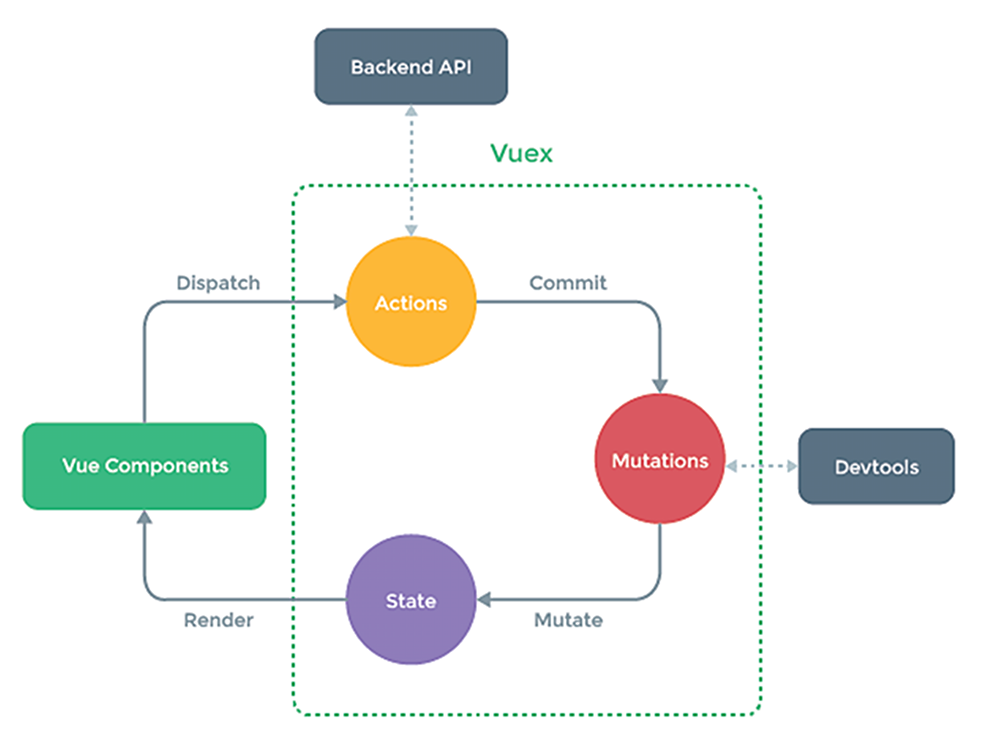

## 使用Vuex场景：
1.多个组件依赖于同一状态（共享数据）
2.来自不同组件的行为需要变更同一状态（共用数据）

## Vuex的原理：


Vuex通过store对State、Actions、Mutations进行管理（图中没有体现）

  1) State(美食本身):
      Vuex方法,数据类型为对象;
      本身是Object对象，内含非常多的数据;
      将数据传递和渲染各个Vue Components

  2) Vue Components(餐厅吃饭人员):
      非Vuex方法;
      通过dispatch实际动作传达单元;
      将需要执行的动作传递给Actions--('动作类型',参数);
      若需要执行的功能和数据都具备，那么Vue Components可以直接调用Commit，直接跳过Actions;

  3) Actions(服务员):
      Vuex方法,数据类型为对象;
      对应dispatch里面的'动作类型'函数和接收参数;
      自行调用commit('动作类型',参数)，将动作传递给Mutation;
      自身不对参数和动作类型做任何功能执行;
      核心作用是与Backend API进行数据和命令交互，此点是Actions的存在核心(如发送Axios请求与服务器进行交互);

  4) Mutations(后厨团队):
      Vuex方法,数据类型为对象;
      实际执行单元；
      内包含'动作类型'函数和接收参数

## 搭建和使用Vuex
  1）搭建环境
    vue2中，使用vuex的3版本
    vue3中，使用vuex的4版本
    当前项目使用的是vue2环境，所以，我们需要安装vuex的3版本
      > npm i vuex@3

  2）插件使用
    在main.js中引入插件并使用

    ```js
import Vue from 'vue'
import App from './App.vue'

//引入store
import store from './store/index'

Vue.config.productionTip = false

new Vue({
  render: h => h(App),
  //触发对象的间歇形式store:store
  store,
}).$mount('#app')

    ```

3）创建store

​	官方推荐：src文件夹下建立store文件夹，下建立index.js文件

```js
//该文件用于创建Vuex中最为核心的store
import Vue from 'vue'

//引入Vuex
import Vuex from 'vuex'

//应用Vuex插件,不可以放在main.js当中，必须放在index.js中
Vue.use(Vuex)

//准备actions——用于响应组件中的动作
const actions = {

}
//准备mutations——用于操作数据（state）
const mutations = {

}
//准备state——用于存储数据
const state = {

}

//准备getters——用于将state中的数据进行加工
const state = {
  xxx(state){
    return yyy;
  }
  ...
}

//创建并暴露store
export default new Vuex.Store({
  //触发对象的简写形式，实际为actions:actions
  actions,
  mutations,
  state,
  getters
})
```

4）数据分类

将需要共享的数据转移到state下

```js
//准备state——用于存储数据
const state = {
  sum: 0,//当前求和的值
}
```

5）Vue实例dispatch命令给action

在原vue程序中通过this.$store.dispatch('方法',数据)

```js
methods: {
    //将option数值进行+1
    numAdd(){
      console.log('n的数值：',this.n);
      //因没有其他逻辑判断和数据交互，直接vue实例通过commit调用mutations
      this.$store.commit('NUMADD',this.n)
    },
    //将option数值进行-1
    numSub(){
      console.log('n的数值：',this.n);
      //因没有其他逻辑判断和数据交互，直接vue实例通过commit调用mutations
      this.$store.commit('NUMSUB',this.n)
    },
    // 当sum为奇数时执行加法程序
    exeAfterEven(){
      this.$store.dispatch('exeAfterEven',this.n)
    },
    //延时3秒后执行加法程序
    exeAfterMin(){
      this.$store.dispatch('exeAfterMin',this.n)
    }
  },
```

6）Action进行分析commit命令

```js
//准备actions——用于响应组件中的动作
const actions = {
  //将option数值进行+1
  //context为缩小版的store，具有基本信息数据
  //value为传递进来的参数
  numAdd(context, value) {
    context.commit('NUMADD', value)
  },

  //将option数值进行-1
  numSub(context, value) {
    context.commit('NUMSUB', value)
  },

  // 当sum为奇数时执行加法程序
  exeAfterEven(context, value) {
    if (context.state.sum % 2) {
      context.commit('NUMADD', value)
    }
  },

  //延时3秒后执行加法程序
  exeAfterMin(context, value) {
    setTimeout(() => {
      context.commit('NUMADD', value)
    }, 1000);
  }

}
```

7）Mutations进行命令执行

```JS
//准备mutations——用于操作数据（state）
//为了区别mutations和actions,mutions中的方法采用大写方式
const mutations = {
  //将option数值进行+1
  NUMADD(state, value) {
    state.sum += value
  },
  //将option数值进行-1
  NUMSUB(state, value) {
    state.sum -= value
  }
}
```

8）Getters的用法

```
//在index.js中：

//准备getters——用于将state中的数据进行加工
const getters = {
  peopleNumTen(state) {
    return state.peopleNum * 10
  },
  wineTableTen(state) {
    return state.wineTable * 10
  }
}
//创建并暴露store
export default new Vuex.Store({
  //触发对象的简写形式，实际为actions:actions
  actions,
  mutations,
  state,
  getters
})

//在vue文件中直接使用
  <div>
    <button @click="Add01Btn">Num=2,Btn01-点我+Num</button>
    <button @click="OvenAdd01Btn">Num=2,Btn01-偶数+Num</button>
    <span>我是-Btn01-宴会人数：{{$store.state.peopleNum}}</span>
    <span>我是-Btn01-宴会人数的10倍：{{$store.getters.peopleNumTen}}</span>
    <span>我是-Btn01-酒桌数量：{{$store.state.wineTable}}</span>
    <span>我是-Btn01-酒桌数量的10倍：{{$store.getters.wineTableTen}}</span>
  </div>
```

9）MapState和MapGetters

```
//在Script标签下先引入
import { mapGetters, mapState } from 'vuex';
computed: {
      /* 
      使用mapState，将state中的数据映射到需求vue页面：
        1）方法一：使用对象方式：...mapState({peopleNum:'peopleNum',wineTable:'wineTable'})
          a.mapState返回的是对象映射函数
          b....是ES6高级语法，表示将mapState对象中的方法或属性添加进来
        2）方法二：使用数组方式；...mapState(['peopleNum','wineTable'])
      */

     /* //State对象实现方式
      ...mapState({peopleNum:'peopleNum',wineTable:'wineTable'}), */

    //State数组实现方式
    ...mapState(['peopleNum','wineTable']),

    /* 
      使用mapGetters，将Getters中的数据映射到需求vue页面：
        1）方法一：使用对象方式：...mapGetters({peopleNumTen:'peopleNumTen',wineTableTen:'wineTableTen'})
          a.mapGetters返回的是对象映射函数
          b....是ES6高级语法，表示将Getters对象中的方法或属性添加进来
        2）方法二：使用数组方式；...mapGetters(['peopleNumTen','wineTableTen'])
      */

    /* //Getters对象实现方式
    ...mapGetters({peopleNumTen:'peopleNumTen',wineTableTen:'wineTableTen'}), */

    //Getters数组实现方式
    ...mapGetters(['peopleNumTen','wineTableTen']),
    
    },
    
```

10）MapMutations和MapActions

```js
//在UserShow01.vue中更新
//在Script标签下先引入
import { mapGetters, mapMutations, mapActions,mapState } from 'vuex';
methods: {
      /* 下方为程序员亲自写的方法 */
      /* //点击+1按钮，将要求通过commit传递给mutations
      Add01Btn(){
        this.$store.commit('ADDBTN',this.btnNum)
      }, */

      /* 下方为mapMutations写的方法，分2种
            1）对象方法：...mapMutations({Add01Btn:'ADDBTN'}),
            2）数组方法：...mapMutations(['ADDBTN'])
            3）需要注意的是，如果需要传递参数，需要将参数放在vue单元调用内
      */

      //如下为对象写法
      ...mapMutations({Add01Btn:'ADDBTN'}),

      //如下为数组写法，需要将Add01Btn更改为ADDBTN
      // ...mapMutations(['ADDBTN']),
/* ---------------------------------------------------------------------------- */
      /* 下方为程序员亲自写的方法 */
      /* //点击偶数+1按钮，将要求传递给Action
      OvenAdd01Btn(){
        this.$store.dispatch('OvenAddBtn',this.btnNum)
      } */

       /* 下方为mapActions写的方法，分2种
            1）对象方法：...mapActions({OvenAdd01Btn:'OvenAddBtn'}),
            2）数组方法：...mapActions(['OvenAddBtn']),
            3）需要注意的是，如果需要传递参数，需要将参数放在vue单元调用内
      */

      //如下为对象写法
      ...mapActions({OvenAdd01Btn:'OvenAddBtn'}),

      //如下为数组写法，需要将OvenAdd01Btn更改为OvenAddBtn
      // ...mapActions(['OvenAddBtn']),
    },
```
--------------------------------------------------------
教学知识点：
## Vuex

### 1.概念

​		在Vue中实现集中式状态（数据）管理的一个Vue插件，对vue应用中多个组件的共享状态进行集中式的管理（读/写），也是一种组件间通信的方式，且适用于任意组件间通信。

### 2.何时使用？

​		多个组件需要共享数据时

### 3.搭建vuex环境

1. 创建文件：```src/store/index.js```

   ```js
   //引入Vue核心库
   import Vue from 'vue'
   //引入Vuex
   import Vuex from 'vuex'
   //应用Vuex插件
   Vue.use(Vuex)
   
   //准备actions对象——响应组件中用户的动作
   const actions = {}
   //准备mutations对象——修改state中的数据
   const mutations = {}
   //准备state对象——保存具体的数据
   const state = {}
   
   //创建并暴露store
   export default new Vuex.Store({
   	actions,
   	mutations,
   	state
   })
   ```

2. 在```main.js```中创建vm时传入```store```配置项

   ```js
   ......
   //引入store
   import store from './store'
   ......
   
   //创建vm
   new Vue({
   	el:'#app',
   	render: h => h(App),
   	store
   })
   ```

###    4.基本使用

1. 初始化数据、配置```actions```、配置```mutations```，操作文件```store.js```

   ```js
   //引入Vue核心库
   import Vue from 'vue'
   //引入Vuex
   import Vuex from 'vuex'
   //引用Vuex
   Vue.use(Vuex)
   
   const actions = {
       //响应组件中加的动作
   	jia(context,value){
   		// console.log('actions中的jia被调用了',miniStore,value)
   		context.commit('JIA',value)
   	},
   }
   
   const mutations = {
       //执行加
   	JIA(state,value){
   		// console.log('mutations中的JIA被调用了',state,value)
   		state.sum += value
   	}
   }
   
   //初始化数据
   const state = {
      sum:0
   }
   
   //创建并暴露store
   export default new Vuex.Store({
   	actions,
   	mutations,
   	state,
   })
   ```

2. 组件中读取vuex中的数据：```$store.state.sum```

3. 组件中修改vuex中的数据：```$store.dispatch('action中的方法名',数据)``` 或 ```$store.commit('mutations中的方法名',数据)```

   >  备注：若没有网络请求或其他业务逻辑，组件中也可以越过actions，即不写```dispatch```，直接编写```commit```

### 5.getters的使用

1. 概念：当state中的数据需要经过加工后再使用时，可以使用getters加工。

2. 在```store.js```中追加```getters```配置

   ```js
   ......
   
   const getters = {
   	bigSum(state){
   		return state.sum * 10
   	}
   }
   
   //创建并暴露store
   export default new Vuex.Store({
   	......
   	getters
   })
   ```

3. 组件中读取数据：```$store.getters.bigSum```

### 6.四个map方法的使用

1. <strong>mapState方法：</strong>用于帮助我们映射```state```中的数据为计算属性

   ```js
   computed: {
       //借助mapState生成计算属性：sum、school、subject（对象写法）
        ...mapState({sum:'sum',school:'school',subject:'subject'}),
            
       //借助mapState生成计算属性：sum、school、subject（数组写法）
       ...mapState(['sum','school','subject']),
   },
   ```

2. <strong>mapGetters方法：</strong>用于帮助我们映射```getters```中的数据为计算属性

   ```js
   computed: {
       //借助mapGetters生成计算属性：bigSum（对象写法）
       ...mapGetters({bigSum:'bigSum'}),
   
       //借助mapGetters生成计算属性：bigSum（数组写法）
       ...mapGetters(['bigSum'])
   },
   ```

3. <strong>mapActions方法：</strong>用于帮助我们生成与```actions```对话的方法，即：包含```$store.dispatch(xxx)```的函数

   ```js
   methods:{
       //靠mapActions生成：incrementOdd、incrementWait（对象形式）
       ...mapActions({incrementOdd:'jiaOdd',incrementWait:'jiaWait'})
   
       //靠mapActions生成：incrementOdd、incrementWait（数组形式）
       ...mapActions(['jiaOdd','jiaWait'])
   }
   ```

4. <strong>mapMutations方法：</strong>用于帮助我们生成与```mutations```对话的方法，即：包含```$store.commit(xxx)```的函数

   ```js
   methods:{
       //靠mapActions生成：increment、decrement（对象形式）
       ...mapMutations({increment:'JIA',decrement:'JIAN'}),
       
       //靠mapMutations生成：JIA、JIAN（对象形式）
       ...mapMutations(['JIA','JIAN']),
   }
   ```

> 备注：mapActions与mapMutations使用时，若需要传递参数需要：在模板中绑定事件时传递好参数，否则参数是事件对象。

### 7.模块化+命名空间

1. 目的：让代码更好维护，让多种数据分类更加明确。

2. 修改```store.js```

   ```javascript
   const countAbout = {
     namespaced:true,//开启命名空间
     state:{x:1},
     mutations: { ... },
     actions: { ... },
     getters: {
       bigSum(state){
          return state.sum * 10
       }
     }
   }
   
   const personAbout = {
     namespaced:true,//开启命名空间
     state:{ ... },
     mutations: { ... },
     actions: { ... }
   }
   
   const store = new Vuex.Store({
     modules: {
       countAbout,
       personAbout
     }
   })
   ```

3. 开启命名空间后，组件中读取state数据：

   ```js
   //方式一：自己直接读取
   this.$store.state.personAbout.list
   //方式二：借助mapState读取：
   ...mapState('countAbout',['sum','school','subject']),
   ```

4. 开启命名空间后，组件中读取getters数据：

   ```js
   //方式一：自己直接读取
   this.$store.getters['personAbout/firstPersonName']
   //方式二：借助mapGetters读取：
   ...mapGetters('countAbout',['bigSum'])
   ```

5. 开启命名空间后，组件中调用dispatch

   ```js
   //方式一：自己直接dispatch
   this.$store.dispatch('personAbout/addPersonWang',person)
   //方式二：借助mapActions：
   ...mapActions('countAbout',{incrementOdd:'jiaOdd',incrementWait:'jiaWait'})
   ```

6. 开启命名空间后，组件中调用commit

   ```js
   //方式一：自己直接commit
   this.$store.commit('personAbout/ADD_PERSON',person)
   //方式二：借助mapMutations：
   ...mapMutations('countAbout',{increment:'JIA',decrement:'JIAN'}),
   ```

 ## 


