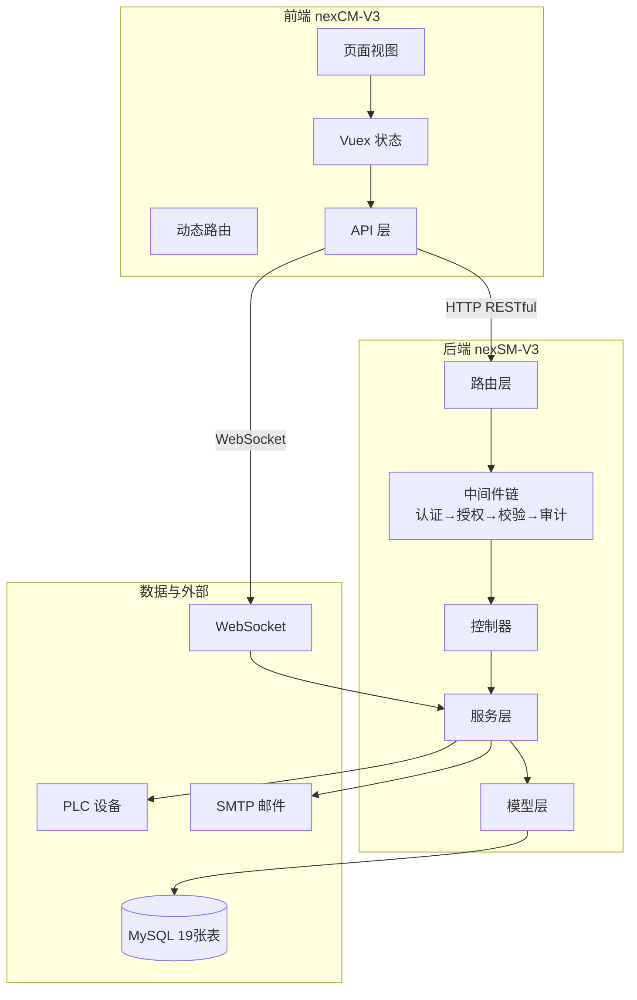

# nex 项目 — 移动式灌装加塞设备管理系统

> **项目版本**：v1.1.0 | **更新日期**：2026-09-08 | **作者**：GooHv

---

## 📖 项目简介

nex 是一套面向**医疗设备行业**的企业级前后端分离管理系统，专为**移动式灌装加塞设备**设计。系统提供设备监控、生产管理、部件寿命追踪、审计追踪、权限管理等核心功能，满足 **FDA 21 CFR Part 11**、**EU GMP Annex 11** 等合规要求。

系统包含两个子项目：

| 子项目 | 目录 | 技术栈 | 说明 |
|--------|------|--------|------|
| **nexCM-V3**（前端） | `02.01-nexCM/02.01.02-nexCM-V3/` | Vue 2.7 + Element UI + Vuex + Vue Router | 企业级后台管理界面 |
| **nexSM-V3**（后端） | `02.02-nexSM/02.02.02-nexSM-V3/` | Express + MySQL + MVC | RESTful API 服务 + PLC 通信 + WebSocket |

---

## ✨ 核心特性

- **🔐 细粒度权限控制**：菜单 / 按钮 / 参数三级权限，基于角色的访问控制（RBAC）
- **🌍 完整国际化**：中英文双语支持，可扩展多语言，内置角色/字典自动翻译
- **📊 实时设备监控**：PLC 双频轮询（200ms 快速 + 1000ms 慢速），WebSocket 实时推送
- **🔧 部件寿命管理**：模板化管理，自动寿命统计，阈值预警，更换记录追踪
- **📝 审计追踪**：操作自动记录，哈希链防篡改，电子签名支持
- **⚙️ 在线配置管理**：47 项系统参数在线修改，60 秒缓存自动刷新
- **🔔 通知中心**：可配置通知事件，支持系统通知 + 邮件通知
- **📜 授权管理**：Beehive 授权体系，时间守卫，机器码绑定
- **💾 数据管理**：超级面板支持数据库表管理、备份恢复、文件管理

---

## 🛠️ 技术栈

### 前端（nexCM-V3）

| 类别 | 技术 | 版本 | 用途 |
|------|------|------|------|
| 核心框架 | Vue | 2.7.16 | 渐进式 JavaScript 框架 |
| 路由 | Vue Router | 3.6.5 | 页面路由管理 |
| 状态管理 | Vuex | 3.6.2 | 全局状态管理 |
| UI 组件库 | Element UI | 2.15.14 | 桌面端组件库 |
| 国际化 | vue-i18n | 8.28.2 | 多语言支持 |
| HTTP 客户端 | Axios | 1.19.0 | API 请求封装 |
| 数据可视化 | ECharts | 6.1.0 | 图表渲染 |
| 日期处理 | Day.js | 1.11.21 | 轻量级日期库 |
| PDF 生成 | jsPDF | 4.2.1 | PDF 导出 |
| Excel 处理 | SheetJS (xlsx) | 0.18.5 | Excel 导出 |
| 构建工具 | Vue CLI | 5.0.0 | 项目构建 |

### 后端（nexSM-V3）

| 类别 | 技术 | 版本 | 用途 |
|------|------|------|------|
| Web 框架 | Express | 4.18.2 | 轻量级 Web 框架 |
| 数据库 | MySQL2 | 3.6.5 | MySQL 驱动（Promise） |
| 认证 | jsonwebtoken | 9.0.3 | JWT Token 生成验证 |
| 密码加密 | bcryptjs | 2.4.3 | 密码哈希 |
| 参数校验 | Joi | 18.2.3 | 请求参数校验 |
| PLC 通信 | modbus-serial | 8.0.25 | Modbus RTU/TCP |
| PLC 通信 | node-opcua | 2.177.0 | OPC UA 协议 |
| PLC 通信 | node-snap7 | 1.0.9 | Siemens S7 协议 |
| 实时通信 | ws | 8.21.3 | WebSocket 服务 |
| 邮件 | Nodemailer | 9.1.0 | 邮件发送 |
| 缓存 | Node Cache | 5.1.2 | 内存缓存 |
| 进程管理 | PM2 | - | 生产环境进程守护 |

---

## 🏗️ 架构概览



**详细架构文档** → [`docs/01-项目架构与模块依赖关系图.md`](./docs/01-项目架构与模块依赖关系图.md)

---

## 🚀 快速开始

### 环境要求

| 依赖 | 最低版本 | 推荐版本 |
|------|----------|----------|
| Node.js | 14.0.0 | 18.x LTS |
| npm | 6.0.0 | 9.x |
| MySQL | 5.7 | 8.0+ / 9.7 |
| PLC 设备 | - | 可选（开发时可用模拟数据） |

### 1. 克隆项目

```bash
git clone <仓库地址>
cd 02-nex
```

### 2. 启动后端服务

```bash
cd 02.02-nexSM/02.02.02-nexSM-V3

# 安装依赖
npm install

# 配置环境变量
cp .env.example .env
# 编辑 .env，修改数据库连接、JWT 密钥等配置

# 初始化数据库（系统启动时自动建表 + 初始化默认数据）
# 确保 MySQL 已启动，且数据库已创建：
# CREATE DATABASE nexsm_v2_dev CHARACTER SET utf8mb4;

# 启动开发服务器（自动重启）
npm run dev
```

后端服务启动后运行在 `http://localhost:3002`（端口可在 `.env` 中配置）。

> Swagger API 文档（开发环境）：`http://localhost:3002/api-docs`

### 3. 启动前端服务

```bash
cd 02.01-nexCM/02.01.02-nexCM-V3

# 安装依赖
npm install

# 配置环境变量
cp .env.example .env.development
# 编辑 .env.development，确认 VUE_APP_BASE_API 指向后端地址

# 启动开发服务器
npm run serve
```

前端服务启动后访问 `http://localhost:8082`。

### 4. 默认账号

| 角色 | 用户名 | 密码 | 说明 |
|------|--------|------|------|
| 超级管理员 | admin | admin123 | 系统初始化时创建，首次登录请修改密码 |

> ⚠️ 生产环境请务必修改默认密码。

---

## 📁 项目结构

```
02-nex/
├── 02.01-nexCM/                    # 前端项目
│   └── 02.01.02-nexCM-V3/
│       ├── src/
│       │   ├── api/                # API 接口层（22 个模块，统一连字符命名）
│       │   ├── assets/             # 静态资源
│       │   ├── components/         # 公共组件（统一 index.vue 命名）
│       │   ├── composables/        # 组合式函数（useXxx.js 命名）
│       │   ├── config/             # 前端配置
│       │   │   ├── data/           # JSON 配置文件
│       │   │   └── *.config.js     # JS 配置文件（统一 .config.js 后缀）
│       │   ├── directives/         # 自定义指令
│       │   ├── filters/            # 全局过滤器
│       │   ├── i18n/               # 国际化（多语言包，动态加载）
│       │   ├── layout/             # 布局组件（小写命名）
│       │   ├── plugins/            # 插件
│       │   ├── router/             # 路由配置（动态路由 + 权限控制）
│       │   ├── store/              # Vuex 状态管理
│       │   ├── utils/              # 工具函数（按功能分类到子目录）
│       │   │   ├── request/        # 请求相关（request.js, websocket.js）
│       │   │   ├── auth/           # 认证相关（auth.js, permission.js, roleMapper.js）
│       │   │   ├── ui/             # UI 相关（confirm.js, feedback.js, message.js, theme.js）
│       │   │   ├── data/           # 数据处理（cache.js, storage.js, date.js, validate.js 等）
│       │   │   ├── business/       # 业务相关（dict.js, export.js, translateManager.js 等）
│       │   │   └── config/         # 配置相关（config.js, constants.js）
│       │   └── views/              # 页面视图（子目录 + index.vue 规范）
│       ├── public/                 # 公共静态资源
│       ├── .env.development        # 开发环境变量
│       ├── .env.production         # 生产环境变量
│       ├── vue.config.js           # Vue CLI 配置
│       └── package.json
│
├── 02.02-nexSM/                    # 后端项目
│   └── 02.02.02-nexSM-V3/
│       ├── src/
│       │   ├── config/             # 配置文件
│       │   │   ├── data/           # JSON 配置文件
│       │   │   └── *.config.js     # JS 配置文件（统一 .config.js 后缀）
│       │   ├── constants/          # 常量定义（errorCode.js, statusCode.js）
│       │   ├── controllers/        # 基础控制器
│       │   ├── db/                 # 数据库连接池
│       │   ├── middleware/         # 中间件（认证/授权/审计/校验/错误/响应）
│       │   ├── modules/            # 业务模块（22 个，MVC 完整结构）
│       │   │   └── module-name/    # 每个模块使用连字符命名
│       │   │       ├── module-name.controller.js  # 控制器层
│       │   │       ├── module-name.service.js     # 服务层（业务逻辑）
│       │   │       ├── module-name.route.js       # 路由定义
│       │   │       ├── module-name.model.js       # 数据模型
│       │   │       └── index.js                   # 模块入口
│       │   ├── plc/                # PLC 通信层（多协议支持，类定义保留 PascalCase）
│       │   ├── services/           # 公共服务（邮件/通知/审计/缓存）
│       │   ├── socket/             # WebSocket 服务
│       │   └── utils/              # 工具函数
│       ├── scripts/                # 脚本与 SQL（迁移脚本、初始化脚本）
│       ├── test/                   # 测试文件
│       ├── backups/                # 数据库备份
│       ├── beehive/                # Beehive 授权相关
│       ├── uploads/                # 上传文件目录
│       ├── logs/                   # 日志目录
│       ├── .env                    # 环境变量（含敏感信息，不提交）
│       ├── app.js                  # 应用入口
│       └── package.json
│
└── docs/                           # 项目文档
    ├── 01-项目架构与模块依赖关系图.md
    ├── 02-配置项完整清单.md
    ├── 03-数据库表结构与字段说明.md
    ├── 04-接口调用链路与前后端对应关系.md
    ├── 05-代码审查报告与优化建议.md
    ├── 架构规范深度审计报告.md
    ├── 项目架构规范.md
    └── email-module.md             # email 模块文档
```

---

## ⚙️ 配置说明

项目采用**三层配置体系**：

| 层级 | 存储位置 | 生效方式 | 示例 |
|------|----------|----------|------|
| 环境变量 | `.env` / `.env.development` | 重启生效 | 数据库密码、端口、JWT 密钥 |
| 配置文件 | `src/config/*.js` | 重新构建生效 | 请求超时、UI 参数、主题色 |
| 数据库配置 | `nex_system_config` 表 | 立即生效（60秒缓存） | PLC 参数、会话超时、水印开关 |

**完整配置清单** → [`docs/02-配置项完整清单.md`](./docs/02-配置项完整清单.md)

### 关键环境变量

```env
# 后端 .env
PORT=3002
DB_HOST=127.0.0.1
DB_PORT=3306
DB_USER=root
DB_PASSWORD=your_password
DB_NAME=nexsm_v2_dev
JWT_SECRET=your_jwt_secret_key
JWT_EXPIRES_IN=24h

# 前端 .env.development
VUE_APP_TITLE=nexCM管理系统
VUE_APP_BASE_API=http://localhost:3002
VUE_APP_PORT=8082
```

---

## 📦 部署指南

### 生产环境部署

#### 1. 后端部署（PM2）

```bash
cd 02.02-nexSM/02.02.02-nexSM-V3
npm install --production

# 使用 PM2 启动
pm2 start app.js --name nexsm-backend
pm2 save
pm2 startup
```

#### 2. 前端部署

```bash
cd 02.01-nexCM/02.01.02-nexCM-V3
npm install
npm run build
# 构建产物在 dist/ 目录，部署到 Nginx
```

#### 3. Nginx 配置示例

```nginx
server {
    listen 80;
    server_name your-domain.com;

    # 前端静态资源
    location / {
        root /var/www/nexcm/dist;
        try_files $uri $uri/ /index.html;
    }

    # 后端 API 代理
    location /prod-api/ {
        proxy_pass http://127.0.0.1:3002;
        proxy_set_header Host $host;
        proxy_set_header X-Real-IP $remote_addr;
        proxy_set_header X-Forwarded-For $proxy_add_x_forwarded_for;

        # WebSocket 支持
        proxy_http_version 1.1;
        proxy_set_header Upgrade $http_upgrade;
        proxy_set_header Connection "upgrade";
    }
}
```

---

## 📚 文档索引

| 文档 | 说明 |
|------|------|
| [01-项目架构与模块依赖关系图](./docs/01-项目架构与模块依赖关系图.md) | 前后端架构、模块依赖、数据流、部署架构 |
| [02-配置项完整清单](./docs/02-配置项完整清单.md) | 环境变量、配置文件、47 项数据库配置全清单 |
| [03-数据库表结构与字段说明](./docs/03-数据库表结构与字段说明.md) | 19 张表的完整字段定义、索引、关系图 |
| [04-接口调用链路与前后端对应关系](./docs/04-接口调用链路与前后端对应关系.md) | ~181 个接口、核心业务时序图、WebSocket 消息 |
| [05-代码审查报告与优化建议](./docs/05-代码审查报告与优化建议.md) | 29 项问题（1 严重已修复）、优化优先级、实施计划 |
| [架构规范深度审计报告](./docs/架构规范深度审计报告.md) | 前后端命名规范、目录结构、文件存放深度审计（25 项问题） |
| [项目架构规范](./docs/项目架构规范.md) | 目录命名、文件命名、目录结构、命名一致性、导入导出规范 |
| [email-module](./docs/email-module.md) | email 模块详细文档 |

---

## 🔧 开发规范

### 代码规范

- **缩进**：2 空格
- **引号**：单引号
- **命名**：
  - 变量/函数：camelCase（小驼峰）
  - 类/组件：PascalCase（大驼峰）
  - 常量：UPPER_SNAKE_CASE（大写下划线）
  - 目录：kebab-case（小写连字符）
  - 文件：
    - Vue 组件：PascalCase 或 index.vue（推荐使用子目录 + index.vue）
    - 后端模块：kebab-case + 固定后缀（.controller.js / .service.js / .route.js / .model.js）
    - 配置文件：kebab-case + .config.js 后缀
    - 工具函数：kebab-case.js
- **异步**：使用 async/await，禁止回调地狱
- **错误**：必须处理，不能静默忽略
- **国际化**：所有用户可见文本必须使用 `$t()`，禁止硬编码
- **错误码**：使用字符串类型错误码（如 `'PARAM_INVALID'`），前端根据错误码做国际化，成功码为数字 `200`

**详细架构规范** → [`docs/项目架构规范.md`](./docs/项目架构规范.md)

### Git 提交规范

```
<type>(<scope>): <subject>

type: feat / fix / docs / style / refactor / perf / test / chore
```

### 分支模型

- `main` — 生产分支
- `develop` — 开发分支
- `feature/*` — 功能分支
- `hotfix/*` — 紧急修复分支

---

## 🐛 常见问题

### Q: 后端启动报数据库连接失败？
A: 确认 MySQL 已启动，检查 `.env` 中的数据库配置，确认数据库 `nexsm_v2_dev` 已创建。

### Q: 前端页面空白？
A: 清除浏览器缓存，检查 `VUE_APP_BASE_API` 是否正确指向后端，确认用户权限配置正确。

### Q: PLC 连接状态显示断开？
A: 检查 `.env` 中的 PLC 配置（协议、主机、端口），确认 PLC 设备已上电且网络可达。

### Q: 国际化切换后部分文本不变化？
A: 检查对应语言包中是否有该 key，检查是否使用了硬编码文本。

---

## 📄 许可证

本项目为**私有项目**，未经授权不得复制、修改、分发。

---

## 📞 联系方式

- **项目作者**：GooHv
- **问题反馈**：请提交 Issue

---

## 📅 更新日志

### v1.1.0 (2026-09-08)

**架构规范重构**：完成前后端架构规范深度审计与重构，提升项目命名规范度、目录结构清晰度和代码复用度。

**后端重构（9项）**：
- email 模块清理非核心文件（7个文件移动到 scripts/、test/、docs/、src/config/）
- config 目录格式统一（i18n-languages.json → data/ 子目录）
- swagger.js → swagger.config.js
- upload 模块：file.model.js → upload.model.js
- user 模块：userDevice.* → user-device.*（6个文件引用更新）
- notification 模块：notificationSetting.model.js → notification-setting.model.js
- plc 目录：类定义保留 PascalCase（已在规范中说明）
- license 模块重构：业务逻辑从 controller 抽取到独立 service
- 错误码定义修复：添加缺失的 MENU_NOT_MODIFIED 定义

**前端重构（9项）**：
- Layout 目录 → layout（小写命名）
- Breadcrumb 组件：HeadBreadcrumb.vue → index.vue
- API 文件命名统一（5个文件从驼峰改为连字符）
- 页面文件存放位置重构（license、permission-core、error 目录）
- utils 目录分类整理（28个文件 → 6个子目录，70个文件引用更新）
- config 目录格式统一（JSON → data/ 子目录，JS → .config.js 后缀）
- EmailConfig/EmailLog 组件抽取为全局组件（删除4个重复文件）
- 全局组件命名规范检查（删除3个空目录）
- API 接口命名一致性检查（修改3个驼峰命名路由路径）

**一致性优化**：
- 错误码类型统一：前后端统一为字符串类型错误码（成功码除外）
- 前端 constants.js 重构：删除数字类型错误码常量，统一为字符串类型
- 修复菜单未变更（缓存命中）错误码缺失导致的 bug

**文档更新**：
- 新增 `docs/架构规范深度审计报告.md`（25项问题，三阶段优先级）
- 新增 `docs/项目架构规范.md`（目录命名、文件命名、目录结构、命名一致性、导入导出规范）
- 新增 `docs/email-module.md`（email 模块详细文档）

### v1.0.0 (2026-09-06)

- 初始版本发布
- 实现用户认证、用户管理、角色管理、权限管理等核心功能
- 实现设备监控、部件寿命管理、PLC 通信等设备功能
- 实现审计追踪、通知中心、邮箱管理、授权管理等系统功能
- 实现超级面板（字典/部门/角色/配置/功能/数据库/项目配置管理）
- 完成中英文双语国际化
- 完成项目文档体系（架构、配置、数据库、接口、代码审查）
- 修复 request.js 中 PARAM_INVALID 处理块重复的严重 Bug

---

*Made with ❤️ by GooHv*
