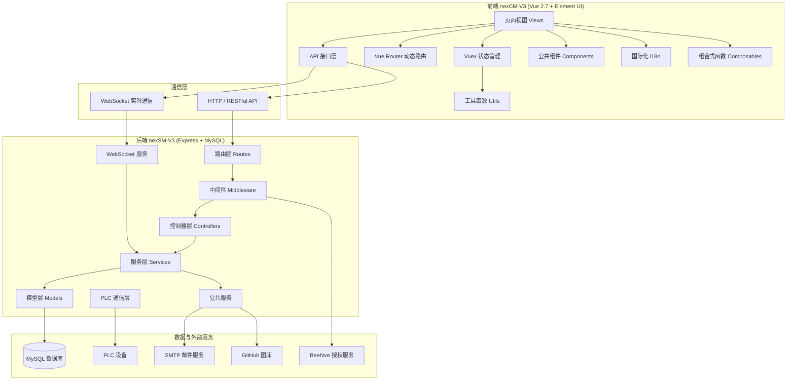
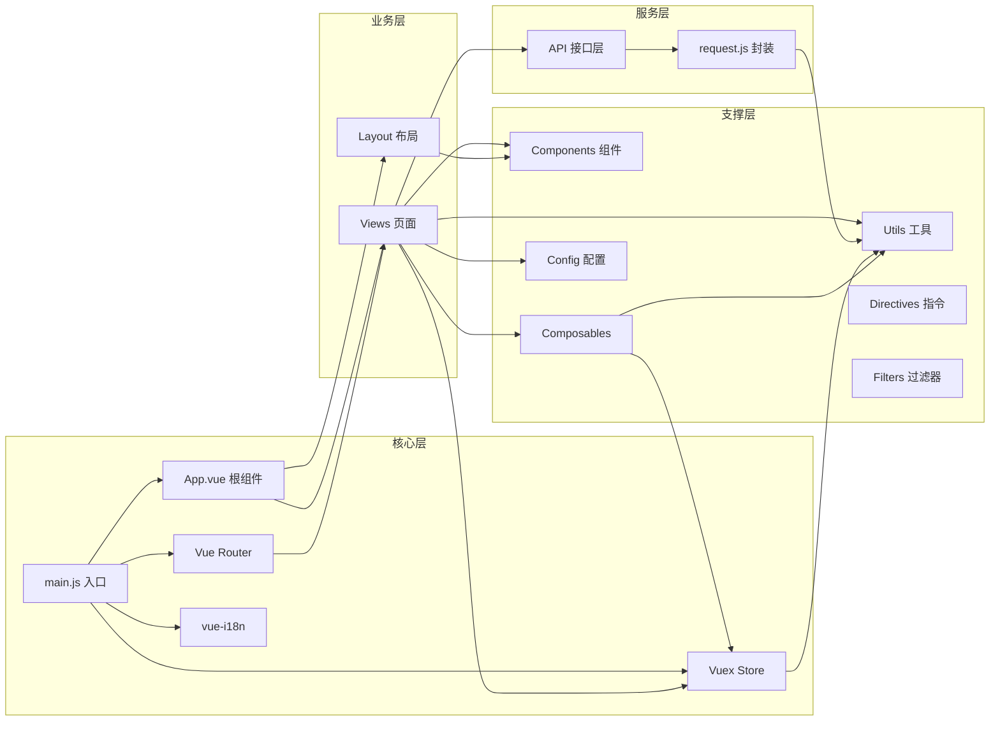
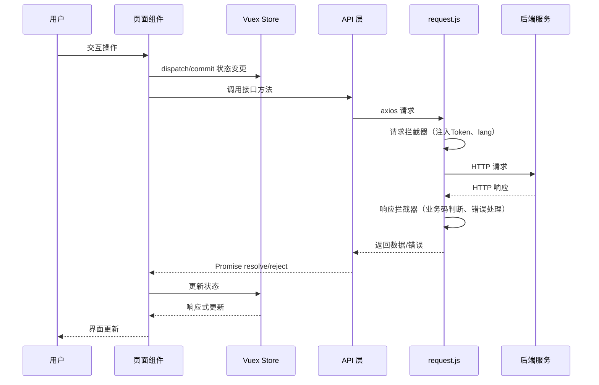
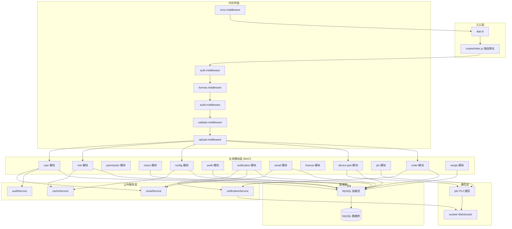
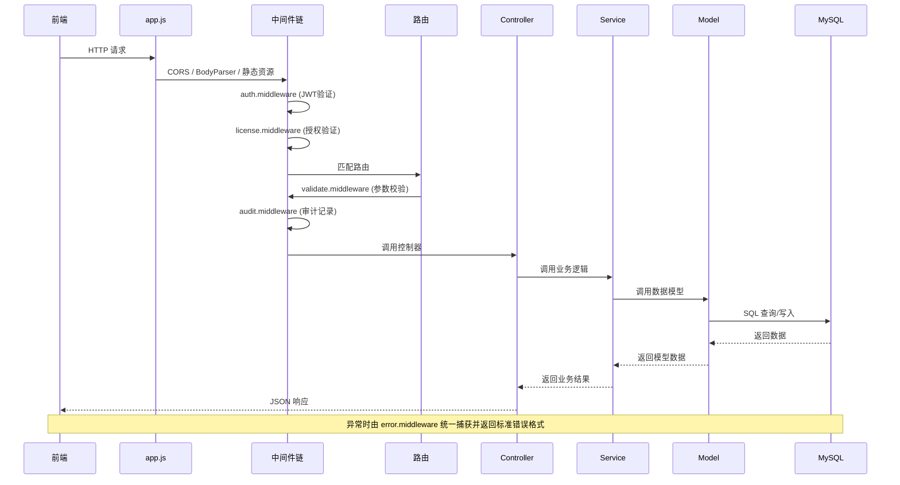
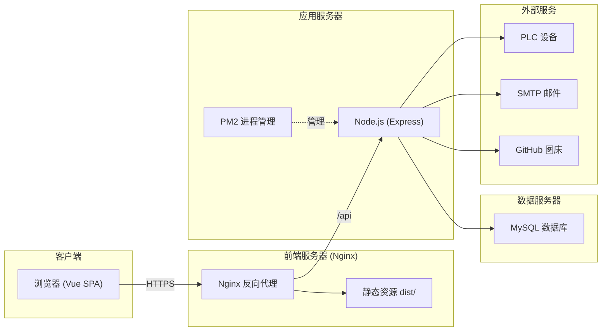

# 项目架构与模块依赖关系图

> 文档版本：v1.0 | 更新日期：2026-09-06 | 适用版本：nexCM-V3 / nexSM-V3

---

## 一、整体架构概览

项目采用**前后端分离**架构，前端基于 Vue 2 + Element UI，后端基于 Express + MySQL，通过 RESTful API 通信。



---

## 二、前端架构详解

### 2.1 前端目录结构

```
nexCM-V3/
├── src/
│   ├── api/                    # API 接口层（按业务模块拆分）
│   │   ├── user.js             # 用户管理接口
│   │   ├── role.js             # 角色管理接口
│   │   ├── permission.js       # 权限管理接口
│   │   ├── menu.js             # 菜单管理接口
│   │   ├── dept.js             # 部门管理接口
│   │   ├── dict.js             # 字典管理接口
│   │   ├── config.js           # 系统配置接口
│   │   ├── audit.js            # 审计日志接口
│   │   ├── notification.js     # 通知中心接口
│   │   ├── email.js            # 邮箱管理接口
│   │   ├── license.js          # 授权管理接口
│   │   ├── devicePart.js       # 部件寿命管理接口
│   │   ├── plc.js              # PLC 管理接口
│   │   ├── upload.js           # 文件上传接口
│   │   ├── customer.js         # 客户管理接口
│   │   ├── recipe.js           # 配方管理接口
│   │   ├── order.js            # 生产订单接口
│   │   ├── feature.js          # 功能配置接口
│   │   ├── projectConfig.js    # 项目配置接口
│   │   ├── database.js         # 数据库管理接口
│   │   ├── translation.js      # 翻译配置接口
│   │   └── i18nManage.js       # 国际化管理接口
│   ├── assets/                 # 静态资源（图片、图标、样式、字体）
│   ├── components/             # 全局公共组件
│   │   ├── Breadcrumb/         # 面包屑导航
│   │   ├── ExportDropdown/     # 导出下拉组件
│   │   ├── HeartbeatIndicator/ # 心跳状态指示器
│   │   ├── NotificationBell/   # 通知铃铛
│   │   ├── NotificationItem/   # 通知项组件
│   │   ├── Pagination/         # 分页组件
│   │   ├── SearchForm/         # 搜索表单组件
│   │   ├── SvgIcon/            # SVG 图标组件
│   │   ├── ThemePicker/        # 主题选择器
│   │   └── UploadImage/        # 图片上传组件
│   ├── composables/            # 组合式函数（Vue 2.7 Composition API）
│   │   ├── useCrud.js          # CRUD 通用组合函数 ⚠️未使用
│   │   ├── useDialog.js        # 弹窗通用组合函数 ⚠️未使用
│   │   ├── useDict.js          # 字典数据组合函数
│   │   ├── useForm.js          # 表单通用组合函数 ⚠️未使用
│   │   ├── useI18n.js          # 国际化组合函数
│   │   ├── useLicense.js       # 授权信息组合函数
│   │   ├── useNotification.js  # 通知组合函数
│   │   ├── useResize.js        # 窗口尺寸组合函数
│   │   ├── useSessionTimeout.js # 会话超时组合函数
│   │   └── useTable.js         # 表格通用组合函数
│   ├── config/                 # 前端配置文件
│   │   ├── index.js            # 配置聚合出口
│   │   ├── system.js           # 系统信息配置
│   │   ├── network.js          # 网络请求配置
│   │   ├── ui.js               # UI 配置（分页、侧边栏、主题等）
│   │   ├── messages.js         # 全局提示文案配置
│   │   ├── themeVariables.js   # 主题变量（与 Less 共享）
│   │   ├── database.config.js  # 数据库配置（超级面板用）
│   │   ├── license.config.js   # 授权配置（项目配置元数据用）
│   │   └── projectConfig.meta.js # 项目配置元数据
│   ├── directives/             # 自定义指令
│   │   ├── permission.js       # 权限指令 v-permission
│   │   └── hasRole.js          # 角色指令 v-hasRole
│   ├── filters/                # 全局过滤器
│   │   ├── index.js            # 过滤器注册
│   │   └── date.filter.js      # 日期格式化过滤器
│   ├── i18n/                   # 国际化配置
│   │   ├── index.js            # 国际化入口
│   │   └── langs/
│   │       ├── zh-CN.js        # 中文语言包（~2585行）
│   │       └── en-US.js        # 英文语言包（~2550行）
│   ├── Layout/                 # 布局组件
│   │   ├── index.vue           # 布局入口
│   │   └── components/
│   │       ├── Sidebar/        # 侧边栏
│   │       ├── Navbar/         # 顶部导航栏
│   │       ├── AppMain/        # 主内容区
│   │       └── TagsView/       # 标签页
│   ├── router/                 # 路由配置
│   │   ├── index.js            # 路由入口
│   │   └── constant/
│   │       └── pathConstants.js # 路由路径常量
│   ├── store/                  # Vuex 状态管理
│   │   ├── index.js            # Store 入口
│   │   ├── getters.js          # 全局 Getters
│   │   └── modules/
│   │       ├── app.js          # 应用状态（侧边栏、Loading）
│   │       ├── user.js         # 用户状态（Token、用户信息）
│   │       ├── permission.js   # 权限状态（动态路由、按钮权限）
│   │       ├── tagsView.js     # 标签页状态
│   │       ├── errorLog.js     # 错误日志状态
│   │       ├── websocket.js    # WebSocket 状态
│   │       ├── device.js       # 设备状态
│   │       └── notification.js # 通知状态
│   ├── utils/                  # 工具函数
│   │   ├── request.js          # Axios 请求封装（核心）
│   │   ├── auth.js             # 认证工具（Token 管理）
│   │   ├── storage.js          # 本地存储封装
│   │   ├── storageKey.js       # 存储 Key 常量
│   │   ├── message.js          # 消息提示封装
│   │   ├── confirm.js          # 确认对话框封装 ⚠️未使用
│   │   ├── date.js             # 日期工具
│   │   ├── validate.js         # 表单验证工具
│   │   ├── index.js            # 通用工具（防抖、节流等）⚠️未使用
│   │   ├── export.js           # 导出工具 ⚠️未使用
│   │   ├── exportTable.js      # 表格导出工具
│   │   ├── pdfGenerator.js     # PDF 生成工具
│   │   ├── orderReport.js      # 订单报告生成工具
│   │   ├── upload.js           # 上传验证工具
│   │   ├── cache.js            # 缓存工具
│   │   ├── config.js           # 配置工具（地区坐标）
│   │   ├── constants.js        # 全局常量（错误码、白名单）
│   │   ├── roleMapper.js       # 角色名称映射
│   │   ├── worldCities.js      # 世界城市数据
│   │   └── licenseHelper.js    # 授权辅助工具
│   ├── views/                  # 页面视图
│   │   ├── home/               # 首页（概况、看板、数据管理）
│   │   ├── device/             # 设备管理（状态、报警、部件寿命）
│   │   ├── production/         # 生产管理（配方、订单）
│   │   ├── system/             # 系统设置（用户、审计、配置）
│   │   ├── permission-core/    # 权限核心（权限配置）
│   │   ├── super-panel/        # 超级面板（字典、部门、角色、配置、功能、数据库、项目配置）
│   │   ├── notification/       # 通知中心
│   │   ├── license/            # 授权管理
│   │   ├── profile/            # 个人中心
│   │   ├── login/              # 登录页
│   │   └── error/              # 错误页面（404、错误日志）
│   ├── App.vue                 # 根组件
│   └── main.js                 # 入口文件
├── public/                     # 公共静态资源
├── .env.development            # 开发环境变量
├── .env.production             # 生产环境变量
├── vue.config.js               # Vue CLI 配置
├── jsconfig.json               # JS 配置（路径别名）
└── package.json                # 项目依赖
```

### 2.2 前端模块依赖关系



### 2.3 前端核心数据流



---

## 三、后端架构详解

### 3.1 后端目录结构

```
nexSM-V3/
├── src/
│   ├── app.js                  # 应用入口
│   ├── config/                 # 配置文件
│   │   ├── app.config.js       # 应用配置（端口、分页、上传）
│   │   └── db.config.js        # 数据库配置
│   ├── constants/              # 常量定义
│   │   ├── errorCode.js        # 错误码与错误消息
│   │   └── statusCode.js       # 状态码常量
│   ├── controllers/            # 公共控制器
│   │   └── baseController.js   # 基础控制器
│   ├── db/                     # 数据库层
│   │   └── index.js            # MySQL 连接池
│   ├── middleware/             # 中间件
│   │   ├── auth.middleware.js  # 认证中间件（JWT 验证）
│   │   ├── error.middleware.js # 全局错误处理
│   │   ├── audit.middleware.js # 审计日志中间件
│   │   ├── validate.middleware.js # 参数校验中间件
│   │   ├── license.middleware.js # 授权验证中间件
│   │   ├── upload.middleware.js # 文件上传中间件
│   │   └── dotenvInit.middleware.js # 环境变量初始化
│   ├── modules/                # 业务模块（MVC 完整结构）
│   │   ├── user/               # 用户管理
│   │   ├── role/               # 角色管理
│   │   ├── permission/         # 权限管理
│   │   ├── menu/               # 菜单管理
│   │   ├── dept/               # 部门管理
│   │   ├── dict/               # 字典管理
│   │   ├── config/             # 系统配置
│   │   ├── audit/              # 审计追踪
│   │   ├── notification/       # 通知中心
│   │   ├── email/              # 邮箱管理
│   │   ├── license/            # 授权管理
│   │   ├── device-part/        # 部件寿命管理
│   │   ├── plc/                # PLC 管理
│   │   ├── captcha/            # 验证码
│   │   ├── upload/             # 文件上传
│   │   ├── customer/           # 客户管理
│   │   ├── recipe/             # 配方管理
│   │   ├── order/              # 生产订单
│   │   ├── feature/            # 功能配置
│   │   ├── projectConfig/      # 项目配置
│   │   ├── database/           # 数据库管理
│   │   ├── translation/        # 翻译配置
│   │   └── i18nManage/        # 国际化管理
│   ├── plc/                    # PLC 通信层
│   │   ├── index.js            # PLC 管理器
│   │   ├── modbus.js           # Modbus 协议实现
│   │   ├── opcua.js            # OPC UA 协议实现
│   │   ├── s7.js               # S7 协议实现
│   │   ├── tagMap.js           # PLC 标签映射
│   │   └── tasks/
│   │       ├── PlcPollTask.js       # PLC 轮询任务
│   │       └── MaintenanceTaskManager.js # 维护任务管理器
│   ├── services/               # 公共服务层
│   │   ├── emailService.js     # 邮件服务
│   │   ├── notificationService.js # 通知服务
│   │   ├── auditService.js     # 审计服务
│   │   └── cacheService.js     # 缓存服务
│   ├── socket/                 # WebSocket 层
│   │   ├── index.js            # WebSocket 管理器
│   │   ├── deviceSocket.js     # 设备状态推送
│   │   └── notificationSocket.js # 通知推送
│   └── utils/                  # 工具函数
│       ├── logger.js           # 日志工具
│       ├── response.js         # 响应封装
│       ├── jwt.js              # JWT 工具
│       ├── password.js         # 密码工具
│       ├── date.js             # 日期工具
│       ├── file.js             # 文件工具
│       └── audit.js            # 审计工具
├── routes/                     # 路由配置
│   ├── index.js                # 路由聚合入口
│   └── testRouter.js           # 测试路由
├── scripts/                    # 脚本文件
│   ├── createFiles.sql         # 建表 SQL
│   └── generate.js             # 代码生成器
├── test/                       # 测试文件
├── backups/                    # 数据库备份
├── uploads/                    # 上传文件目录
├── logs/                       # 日志目录
├── beehive/                    # Beehive 授权相关
│   ├── license/                # 授权文件
│   ├── public/                 # RSA 公钥
│   └── time/                   # 时间守卫文件
├── .env                        # 环境变量（含敏感信息）
├── .env.example                # 环境变量示例
└── package.json                # 项目依赖
```

### 3.2 后端模块依赖关系



### 3.3 后端请求处理链路



---

## 四、前后端模块对应关系

| 前端模块 (views/) | 前端 API 文件 | 后端模块 (modules/) | 后端路由前缀 | 主要功能 |
|---|---|---|---|---|
| home/overview, home/dashboard | - | - | - | 首页概览、数据看板 |
| home/dataview | - | - | - | 数据管理（产能、稼动率、生产、报警） |
| device/state | plc.js | plc | /api/plc | 设备状态、PLC 数据 |
| device/alarm | - | - | - | 报警统计 |
| device/part | devicePart.js | device-part | /api/device-part | 部件寿命管理、模板管理 |
| production/recipe | recipe.js | recipe | /api/recipe | 配方管理、配方下载 |
| production/order | order.js | order | /api/order | 生产订单管理、报告导出 |
| system/user | user.js | user | /api/user | 用户管理 |
| system/audit | audit.js | audit | /api/audit | 审计日志 |
| system/config | config.js | config | /api/config | 参数配置 |
| permission-core | permission.js | permission | /api/permission | 权限配置 |
| super-panel/dict | dict.js | dict | /api/dict | 字典管理 |
| super-panel/dept | dept.js | dept | /api/dept | 部门管理 |
| super-panel/role | role.js | role | /api/role | 角色管理 |
| super-panel/config | config.js, email.js | config, email | /api/config, /api/email | 参数配置、邮箱配置 |
| super-panel/feature | feature.js | feature | /api/feature | 功能配置 |
| super-panel/database | database.js | database | /api/database | 数据库管理 |
| super-panel/project-config | projectConfig.js | projectConfig | /api/project-config | 项目配置管理 |
| notification | notification.js | notification | /api/notification | 通知中心 |
| license | license.js | license | /api/license | 授权管理 |
| profile | user.js | user | /api/user | 个人中心 |
| login | user.js | user, captcha | /api/user, /api/captcha | 登录、验证码 |

---

## 五、关键技术决策

### 5.1 认证与授权

- **JWT 无状态认证**：Token 存储在 localStorage，请求头 `Authorization: Bearer <token>`
- **三级权限控制**：菜单权限（路由级）、按钮权限（v-permission 指令）、参数权限（配置项级）
- **动态路由**：登录后根据用户角色从后端获取菜单树，动态生成路由
- **菜单版本缓存**：通过 `MAX(update_time)` 版本号机制，前端缓存菜单，未变更时返回 304 风格响应

### 5.2 国际化方案

- **vue-i18n**：中英文双语，语言包按模块分组（roles, dict, common, menu, login, audit, error 等）
- **后端多语言**：请求时携带 `lang` 参数，后端根据语言返回对应字段
- **内置角色/字典国际化**：内置角色和字典使用 i18n key，自定义角色/字典使用数据库值

### 5.3 配置管理

- **三层配置体系**：环境变量（.env）→ 配置文件（src/config/）→ 数据库配置表（nex_system_config）
- **数据库配置热更新**：配置变更后清空内存缓存，60秒 TTL 自动刷新
- **配置分类**：system / security / plc / export / connection / device / order

### 5.4 PLC 通信

- **多协议支持**：Modbus RTU/TCP、OPC UA、S7
- **双频轮询**：快速轮询（200ms，状态/报警）+ 慢速轮询（1000ms，工艺参数）
- **写入审计**：PLC 写操作记录审计日志（GMP 21CFR Part11 合规）
- **断线重连**：自动重连机制，可配置重连延迟

### 5.5 审计与合规

- **自动审计**：通过 audit.middleware 自动记录操作日志
- **哈希链校验**：审计日志支持哈希链校验，防止篡改
- **电子签名**：关键操作支持二次身份验证

---

## 六、部署架构



---

*文档结束*
