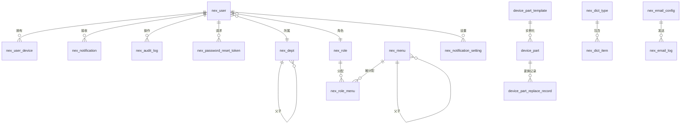

# 数据库表结构与字段说明

> 文档版本：v1.0 | 更新日期：2026-09-06 | 数据库：MySQL 9.7 | 字符集：utf8mb4

---

## 一、数据库概览

| 项目 | 值 |
|------|-----|
| 数据库名 | nexsm_v2_dev |
| 表数量 | 19 张 |
| 字符集 | utf8mb4 / utf8mb4_0900_ai_ci |
| 存储引擎 | InnoDB |
| 命名规范 | 业务表 `nex_` 前缀，部件相关表 `device_` 前缀 |

### 表分类

| 分类 | 表名 | 说明 |
|------|------|------|
| 用户与权限 | nex_user, nex_role, nex_menu, nex_role_menu, nex_dept | 用户、角色、菜单、部门、权限关联 |
| 系统配置 | nex_system_config, nex_feature_config, nex_dict_type, nex_dict_item | 系统参数、功能开关、数据字典 |
| 审计与通知 | nex_audit_log, nex_notification, nex_notification_setting | 操作审计、通知消息、通知设置 |
| 邮箱 | nex_email_config, nex_email_log | 邮箱配置、发送日志 |
| 认证安全 | nex_password_reset_token, nex_user_device | 密码重置Token、在线设备 |
| 部件寿命 | device_part, device_part_template, device_part_replace_record | 部件实例、部件模板、更换记录 |

---

## 二、用户与权限表

### 2.1 nex_user — 用户表

| 字段名 | 类型 | 约束 | 默认值 | 说明 |
|--------|------|------|--------|------|
| id | int | PK, AUTO_INCREMENT | - | 用户ID（接口对外映射为 userId） |
| username | varchar(50) | NOT NULL, UNIQUE | - | 登录账号（唯一） |
| password | varchar(100) | NOT NULL | - | bcrypt 加密后的密码 |
| role | varchar(50) | | Operator | 岗位类别：Super_Admin/Administrator/Engineer/Operator |
| real_name | varchar(50) | | operator | 用户真实姓名 |
| sex | tinyint | | 0 | 性别：1男 2女 0未知 |
| phone | varchar(20) | | '' | 联系手机号 |
| email | varchar(100) | | '' | 邮箱地址 |
| dept_id | int | | NULL | 所属部门ID，关联 nex_dept |
| avatar | varchar(255) | | '' | 头像地址 |
| status | tinyint | NOT NULL | 1 | 账号状态：1启用 0禁用 |
| is_delete | tinyint | NOT NULL | 0 | 软删除：0正常 1删除 |
| is_first_login | tinyint(1) | NOT NULL | 1 | 是否首次登录：1是 0否 |
| first_login_at | datetime | | NULL | 首次登录时间 |
| login_ip | varchar(50) | | '' | 最后登录IP |
| login_date | datetime | | NULL | 最后登录时间 |
| lock_until | datetime | | NULL | 锁定到期时间（NULL=未锁定） |
| failed_attempts | int | | 0 | 登录失败次数 |
| lock_reason | varchar(255) | | NULL | 锁定原因 |
| permission_version | int | | 0 | 权限版本号（权限变更时+1） |
| token_version | int | NOT NULL | 0 | Token版本号（每次登录+1，用于单点登录淘汰） |
| remark | varchar(500) | | '' | 备注信息 |
| create_time | datetime | NOT NULL | CURRENT_TIMESTAMP | 创建时间 |
| update_time | datetime | NOT NULL | CURRENT_TIMESTAMP ON UPDATE | 更新时间 |

**索引**：`uk_username`(username), `idx_dept`(dept_id), `idx_status_del`(status, is_delete)
**约束**：chk_is_delete(0,1), chk_sex(0,1,2), chk_status(0,1)

### 2.2 nex_role — 角色表

| 字段名 | 类型 | 约束 | 默认值 | 说明 |
|--------|------|------|--------|------|
| id | int | PK, AUTO_INCREMENT | - | 角色ID |
| role_code | varchar(50) | NOT NULL, UNIQUE | - | 角色编码（如 Super_Admin） |
| role_name | varchar(100) | NOT NULL | - | 角色名称 |
| description | varchar(500) | | NULL | 角色描述 |
| role_level | int | NOT NULL | 0 | 角色等级（数字越小等级越高） |
| is_super_admin | tinyint | NOT NULL | 0 | 是否超级管理员：1是 0否 |
| is_builtin | tinyint | NOT NULL | 0 | 是否内置角色（不可编辑删除）：1是 0否 |
| is_hidden | tinyint | NOT NULL | 0 | 是否隐藏：0正常 1隐藏 |
| visible_role_levels | json | | NULL | 在权限配置中可见的角色等级列表 |
| status | tinyint | | 1 | 状态：1启用 0禁用 |
| sort | int | | 0 | 排序号 |
| create_time | datetime | NOT NULL | CURRENT_TIMESTAMP | 创建时间 |
| update_time | datetime | NOT NULL | CURRENT_TIMESTAMP ON UPDATE | 更新时间 |

**索引**：`uk_role_code`(role_code)

### 2.3 nex_menu — 菜单/权限表

> 同时承载菜单、按钮、参数三级权限，通过 type 字段区分。

| 字段名 | 类型 | 约束 | 默认值 | 说明 |
|--------|------|------|--------|------|
| id | varchar(32) | PK | - | 菜单唯一标识（index值） |
| parent_id | varchar(32) | | '' | 父菜单ID（顶级为空） |
| name | varchar(50) | NOT NULL | - | 路由name（组件name） |
| path | varchar(100) | NOT NULL | - | 前端路由path |
| component | varchar(100) | | NULL | 前端组件名称（Layout / 业务组件路径） |
| redirect | varchar(100) | | noRedirect | 重定向路径 |
| title | varchar(100) | NOT NULL | - | 菜单标题（i18n key） |
| icon | varchar(50) | | NULL | 图标名称 |
| permission_code | varchar(100) | | NULL, UNIQUE | 统一权限码（如 device:state:view） |
| type | varchar(20) | | menu | 权限类型：menu菜单/button按钮/param参数 |
| super_only | tinyint | NOT NULL | 0 | 仅超级管理员可见：1是 0否 |
| hidden | tinyint | | 0 | 是否隐藏菜单：0显示 1隐藏 |
| always_show | tinyint | | 0 | 是否永远展示父菜单（有子菜单时生效） |
| no_cache | tinyint | | 0 | 是否不缓存页面 |
| sort | int | | 0 | 排序号 |
| api_path | varchar(200) | | NULL | 关联后端接口路径（button/param类型用） |
| api_method | varchar(10) | | NULL | 接口方法 GET/POST/PUT/DELETE（button/param类型用） |
| param_key | varchar(100) | | NULL | 参数标识（param类型用，如 fillVolume） |
| param_mode | varchar(20) | | NULL | 参数权限模式：view可见/edit可编辑/hidden隐藏（param类型用） |
| create_time | datetime | | CURRENT_TIMESTAMP | 创建时间 |
| update_time | timestamp | | CURRENT_TIMESTAMP ON UPDATE | 更新时间 |

**索引**：`uk_permission_code`(permission_code)

### 2.4 nex_role_menu — 角色菜单关联表

| 字段名 | 类型 | 约束 | 默认值 | 说明 |
|--------|------|------|--------|------|
| id | int | PK, AUTO_INCREMENT | - | 主键ID |
| role_id | int | NOT NULL | - | 角色ID |
| menu_id | varchar(32) | NOT NULL | - | 菜单ID |

**索引**：`idx_role`(role_id)

### 2.5 nex_dept — 部门表

| 字段名 | 类型 | 约束 | 默认值 | 说明 |
|--------|------|------|--------|------|
| id | int | PK, AUTO_INCREMENT | - | 部门ID |
| dept_name | varchar(100) | NOT NULL | - | 部门名称 |
| parent_id | int | | 0 | 父部门ID（顶级为0） |
| order_num | int | | 0 | 排序号 |
| leader | varchar(50) | | '' | 负责人 |
| phone | varchar(20) | | '' | 联系电话 |
| email | varchar(100) | | '' | 邮箱 |
| status | tinyint | | 1 | 状态：1启用 0禁用 |
| create_time | datetime | NOT NULL | CURRENT_TIMESTAMP | 创建时间 |
| update_time | datetime | NOT NULL | CURRENT_TIMESTAMP ON UPDATE | 更新时间 |

**索引**：`idx_parent`(parent_id)

---

## 三、系统配置表

### 3.1 nex_system_config — 系统配置表

| 字段名 | 类型 | 约束 | 默认值 | 说明 |
|--------|------|------|--------|------|
| id | int | PK, AUTO_INCREMENT | - | 主键 |
| config_key | varchar(100) | NOT NULL, UNIQUE | - | 配置键 |
| config_value | text | | NULL | 配置值 |
| config_type | varchar(20) | | string | 配置类型：string/number/boolean/json |
| description | varchar(200) | | '' | 配置描述 |
| category | varchar(50) | | system | 配置分类：system/security/plc/export/connection/device/order |
| sort | int | | 0 | 排序号 |
| create_time | datetime | NOT NULL | CURRENT_TIMESTAMP | 创建时间 |
| update_time | datetime | NOT NULL | CURRENT_TIMESTAMP ON UPDATE | 更新时间 |

**索引**：`uk_config_key`(config_key), `idx_category`(category)

> 共 47 个配置项，详见《配置项完整清单》第六章。

### 3.2 nex_feature_config — 功能配置表

| 字段名 | 类型 | 约束 | 默认值 | 说明 |
|--------|------|------|--------|------|
| id | int | PK, AUTO_INCREMENT | - | 主键 |
| feature_key | varchar(100) | NOT NULL, UNIQUE | - | 功能标识 |
| feature_name | varchar(100) | NOT NULL | - | 功能名称（国际化key） |
| description | varchar(255) | | NULL | 功能描述（国际化key） |
| category | varchar(50) | NOT NULL | - | 分类：notification/email/audit/auth/system |
| sub_category | varchar(50) | | NULL | 子分类 |
| value_type | varchar(20) | NOT NULL | boolean | 值类型：boolean/string/number/json |
| default_value | text | | NULL | 默认值 |
| current_value | text | | NULL | 当前值 |
| is_enabled | tinyint(1) | NOT NULL | 1 | 是否启用：1启用 0禁用 |
| sort | int | NOT NULL | 0 | 排序 |
| created_at | datetime | NOT NULL | CURRENT_TIMESTAMP | 创建时间 |
| updated_at | datetime | NOT NULL | CURRENT_TIMESTAMP ON UPDATE | 更新时间 |

**索引**：`feature_key`(feature_key), `idx_category`(category), `idx_sort`(sort)

### 3.3 nex_dict_type — 字典类型表

| 字段名 | 类型 | 约束 | 默认值 | 说明 |
|--------|------|------|--------|------|
| id | int | PK, AUTO_INCREMENT | - | 字典类型ID |
| dict_code | varchar(50) | NOT NULL, UNIQUE | - | 字典类型编码 |
| dict_name | varchar(100) | NOT NULL | - | 字典类型名称 |
| description | varchar(200) | | NULL | 描述 |
| status | tinyint | | 1 | 状态：1启用 0禁用 |
| sort | int | | 0 | 排序号 |
| create_time | datetime | NOT NULL | CURRENT_TIMESTAMP | 创建时间 |
| update_time | datetime | NOT NULL | CURRENT_TIMESTAMP ON UPDATE | 更新时间 |

**索引**：`uk_dict_code`(dict_code)

### 3.4 nex_dict_item — 字典项表

| 字段名 | 类型 | 约束 | 默认值 | 说明 |
|--------|------|------|--------|------|
| id | int | PK, AUTO_INCREMENT | - | 字典项ID |
| type_id | int | NOT NULL | - | 字典类型ID |
| value | varchar(100) | NOT NULL | - | 字典值 |
| label | varchar(100) | NOT NULL | - | 字典标签 |
| css_class | varchar(50) | | '' | CSS样式类 |
| list_class | varchar(50) | | '' | 列表样式类 |
| is_default | tinyint | | 0 | 是否默认：1是 0否 |
| status | tinyint | | 1 | 状态：1启用 0禁用 |
| sort | int | | 0 | 排序号 |
| remark | varchar(500) | | '' | 备注 |
| create_time | datetime | NOT NULL | CURRENT_TIMESTAMP | 创建时间 |
| update_time | datetime | NOT NULL | CURRENT_TIMESTAMP ON UPDATE | 更新时间 |

**索引**：`idx_type`(type_id)

---

## 四、审计与通知表

### 4.1 nex_audit_log — 审计日志表

| 字段名 | 类型 | 约束 | 默认值 | 说明 |
|--------|------|------|--------|------|
| id | int | PK, AUTO_INCREMENT | - | 主键 |
| user_id | int | NOT NULL | - | 操作人ID |
| user_name | varchar(50) | | '' | 操作人姓名 |
| action | varchar(100) | NOT NULL | - | 操作类型（如 user.login, config.update） |
| target | varchar(200) | | '' | 操作对象 |
| old_value | text | | NULL | 修改前值（JSON） |
| new_value | text | | NULL | 修改后值（JSON） |
| result | varchar(20) | | success | 操作结果：success/failed |
| reason | varchar(500) | | '' | 操作原因（GMP要求） |
| ip | varchar(50) | | '' | 操作IP |
| user_agent | varchar(500) | | '' | 浏览器UA |
| prev_hash | varchar(64) | | '' | 前一条哈希（哈希链防篡改） |
| current_hash | varchar(64) | | '' | 当前哈希 |
| created_at | datetime | NOT NULL | CURRENT_TIMESTAMP | 操作时间 |

**索引**：`idx_user`(user_id), `idx_action`(action), `idx_created`(created_at)

### 4.2 nex_notification — 通知消息表

| 字段名 | 类型 | 约束 | 默认值 | 说明 |
|--------|------|------|--------|------|
| id | int | PK, AUTO_INCREMENT | - | 通知ID |
| user_id | int | NOT NULL | - | 接收用户ID |
| title | varchar(255) | | NULL | 标题（直接文本，优先使用 title_key） |
| content | text | | NULL | 内容（直接文本，优先使用 content_key） |
| title_key | varchar(100) | | '' | 标题国际化key |
| title_params | text | | NULL | 标题国际化参数（JSON） |
| content_key | varchar(100) | | '' | 内容国际化key |
| content_params | text | | NULL | 内容国际化参数（JSON） |
| type | varchar(50) | | system | 通知类型：system/plc/user/audit/device/production/config/security/license |
| priority | varchar(20) | | normal | 优先级：high/normal/low |
| link | varchar(500) | | '' | 跳转链接 |
| is_read | tinyint | | 0 | 是否已读：1是 0否 |
| read_time | datetime | | NULL | 阅读时间 |
| is_archived | tinyint | | 0 | 是否已归档：1是 0否 |
| created_at | datetime | NOT NULL | CURRENT_TIMESTAMP | 创建时间 |

**索引**：`idx_user`(user_id), `idx_read`(is_read), `idx_created`(created_at)

### 4.3 nex_notification_setting — 通知设置表

| 字段名 | 类型 | 约束 | 默认值 | 说明 |
|--------|------|------|--------|------|
| id | int | PK, AUTO_INCREMENT | - | 主键ID |
| user_id | int | NOT NULL, UNIQUE | - | 用户ID |
| settings | text | | NULL | 通知设置（JSON格式） |
| created_at | datetime | | CURRENT_TIMESTAMP | 创建时间 |
| updated_at | datetime | | CURRENT_TIMESTAMP ON UPDATE | 更新时间 |

**索引**：`user_id`(user_id), `idx_user_id`(user_id)

---

## 五、邮箱表

### 5.1 nex_email_config — 邮箱配置表

| 字段名 | 类型 | 约束 | 默认值 | 说明 |
|--------|------|------|--------|------|
| id | int | PK, AUTO_INCREMENT | - | 主键ID |
| name | varchar(64) | NOT NULL | - | 配置名称 |
| provider | varchar(32) | NOT NULL | custom | 服务商：qq/163/126/gmail/outlook/custom |
| host | varchar(128) | NOT NULL | - | SMTP服务器地址 |
| port | int | NOT NULL | 465 | SMTP端口 |
| secure | tinyint | | 1 | 是否使用SSL：0否 1是 |
| username | varchar(128) | NOT NULL | - | 邮箱账号 |
| password | varchar(512) | NOT NULL | - | 邮箱授权码（AES加密存储） |
| from_name | varchar(64) | | '' | 发件人名称 |
| is_default | tinyint | | 0 | 是否默认配置：0否 1是 |
| is_system | tinyint | | 0 | 是否系统内置：0否 1是 |
| status | tinyint | | 1 | 状态：0禁用 1启用 |
| is_delete | tinyint | | 0 | 是否删除：0未删除 1已删除 |
| remark | varchar(255) | | '' | 备注 |
| create_by | varchar(64) | | '' | 创建人 |
| create_time | datetime | | CURRENT_TIMESTAMP | 创建时间 |
| update_time | datetime | | CURRENT_TIMESTAMP ON UPDATE | 更新时间 |

**索引**：`idx_provider`(provider), `idx_is_default`(is_default), `idx_status`(status)

### 5.2 nex_email_log — 邮件发送日志表

| 字段名 | 类型 | 约束 | 默认值 | 说明 |
|--------|------|------|--------|------|
| id | int | PK, AUTO_INCREMENT | - | 主键ID |
| config_id | int | | 0 | 使用的邮箱配置ID（0=系统默认） |
| config_name | varchar(64) | | '' | 使用的邮箱配置名称 |
| to_email | varchar(128) | NOT NULL | - | 收件人邮箱 |
| cc_email | varchar(500) | | '' | 抄送邮箱（多个用逗号分隔） |
| subject | varchar(255) | NOT NULL | - | 邮件主题 |
| template | varchar(64) | | '' | 使用的模板 |
| content | text | | NULL | 邮件内容（HTML） |
| status | tinyint | | 0 | 发送状态：0待发送 1成功 2失败 |
| error_msg | varchar(500) | | '' | 失败原因 |
| retry_count | int | | 0 | 重试次数 |
| send_duration | int | | 0 | 发送耗时（毫秒） |
| ip | varchar(64) | | '' | 请求IP |
| create_time | datetime | | CURRENT_TIMESTAMP | 创建时间 |
| send_time | datetime | | NULL | 发送时间 |

**索引**：`idx_to_email`(to_email), `idx_status`(status), `idx_config_id`(config_id), `idx_create_time`(create_time)

---

## 六、认证安全表

### 6.1 nex_password_reset_token — 密码重置Token表

| 字段名 | 类型 | 约束 | 默认值 | 说明 |
|--------|------|------|--------|------|
| id | int | PK, AUTO_INCREMENT | - | 主键ID |
| user_id | int | NOT NULL | - | 用户ID |
| username | varchar(64) | NOT NULL | - | 用户名 |
| email | varchar(128) | NOT NULL | - | 邮箱 |
| token | varchar(128) | NOT NULL | - | 重置Token |
| expires_at | datetime | NOT NULL | - | 过期时间 |
| used | tinyint | | 0 | 是否已使用：0未使用 1已使用 |
| used_at | datetime | | NULL | 使用时间 |
| ip | varchar(64) | | '' | 请求IP |
| user_agent | varchar(500) | | '' | 请求User-Agent |
| create_time | datetime | | CURRENT_TIMESTAMP | 创建时间 |

**索引**：`idx_token`(token), `idx_user_id`(user_id), `idx_email`(email), `idx_expires_at`(expires_at)

### 6.2 nex_user_device — 在线设备表

| 字段名 | 类型 | 约束 | 默认值 | 说明 |
|--------|------|------|--------|------|
| id | int | PK, AUTO_INCREMENT | - | 主键ID |
| user_id | int | NOT NULL | - | 用户ID |
| device_id | varchar(100) | NOT NULL | - | 设备唯一标识（前端生成，存储在localStorage） |
| device_name | varchar(255) | | '' | 设备名称（可自定义，默认从User-Agent解析） |
| ip | varchar(50) | | '' | 登录IP |
| user_agent | text | | NULL | 浏览器User-Agent |
| login_time | datetime | | NULL | 登录时间 |
| last_active_time | datetime | | NULL | 最后活跃时间（心跳更新） |
| status | tinyint | | 1 | 状态：1=在线 0=离线 |
| created_at | datetime | | CURRENT_TIMESTAMP | 创建时间 |
| updated_at | datetime | | CURRENT_TIMESTAMP ON UPDATE | 更新时间 |

**索引**：`uk_user_device`(user_id, device_id), `idx_user_id`(user_id), `idx_device_id`(device_id), `idx_status`(status)

---

## 七、部件寿命表

### 7.1 device_part_template — 部件模板表

| 字段名 | 类型 | 约束 | 默认值 | 说明 |
|--------|------|------|--------|------|
| id | int | PK, AUTO_INCREMENT | - | 模板ID |
| template_key | varchar(50) | NOT NULL, UNIQUE | - | 模板key（如 fill_needle） |
| template_name | varchar(100) | NOT NULL | - | 模板名称 |
| code_prefix | varchar(50) | | '' | 编码前缀（如 FILL-NEEDLE-） |
| default_spec | varchar(200) | | '' | 默认规格型号 |
| default_rated_life | decimal(12,2) | | 0.00 | 默认额定寿命 |
| stat_method | varchar(20) | | successCount | 统计方式：successCount/rotationCount/manual |
| stat_tag | varchar(100) | | '' | 统计标签（PLC计数器地址） |
| icon | varchar(50) | | '' | 图标 |
| is_builtin | tinyint | | 0 | 是否内置模板（不可编辑删除）：1是 0否 |
| status | tinyint | | 1 | 状态：1启用 0禁用 |
| sort | int | | 0 | 排序号 |
| remark | text | | NULL | 备注 |
| created_at | datetime | NOT NULL | CURRENT_TIMESTAMP | 创建时间 |
| updated_at | datetime | NOT NULL | CURRENT_TIMESTAMP ON UPDATE | 更新时间 |

**索引**：`uk_template_key`(template_key), `idx_status`(status)

### 7.2 device_part — 部件实例表

| 字段名 | 类型 | 约束 | 默认值 | 说明 |
|--------|------|------|--------|------|
| id | int | PK, AUTO_INCREMENT | - | 主键ID |
| template_id | int | NOT NULL | - | 关联模板ID |
| template_key | varchar(50) | NOT NULL | - | 模板key（冗余，方便查询） |
| part_code | varchar(100) | NOT NULL, UNIQUE | - | 部件编码（如 FILL-NEEDLE-001） |
| spec | varchar(200) | | '' | 规格型号（可修改） |
| rated_life | decimal(12,2) | NOT NULL | 0.00 | 额定寿命（人工录入，可修改） |
| used_life | decimal(12,2) | NOT NULL | 0.00 | 已使用寿命（系统统计或人工录入） |
| life_unit | varchar(20) | NOT NULL | times | 寿命单位（从模板继承） |
| install_date | date | | NULL | 安装日期 |
| last_replace_date | date | | NULL | 上次更换日期 |
| last_stat_value | decimal(12,2) | | 0.00 | 上次统计的PLC计数值（用于计算增量） |
| status | varchar(20) | NOT NULL | normal | 状态：normal/notice/warning/expired |
| remark | text | | NULL | 备注 |
| is_deleted | tinyint | NOT NULL | 0 | 是否删除：0未删除 1已删除 |
| created_at | datetime | NOT NULL | CURRENT_TIMESTAMP | 创建时间 |
| updated_at | datetime | NOT NULL | CURRENT_TIMESTAMP ON UPDATE | 更新时间 |

**索引**：`uk_part_code`(part_code), `idx_template_id`(template_id), `idx_template_key`(template_key), `idx_status`(status), `idx_is_deleted`(is_deleted)

### 7.3 device_part_replace_record — 部件更换记录表

| 字段名 | 类型 | 约束 | 默认值 | 说明 |
|--------|------|------|--------|------|
| id | int | PK, AUTO_INCREMENT | - | 主键ID |
| part_id | int | NOT NULL | - | 关联部件实例ID |
| template_key | varchar(50) | NOT NULL | - | 模板key |
| old_code | varchar(100) | NOT NULL | - | 旧部件编码 |
| new_code | varchar(100) | NOT NULL | - | 新部件编码 |
| old_used_life | decimal(12,2) | | 0.00 | 旧部件已使用寿命 |
| replace_reason | varchar(100) | | '' | 更换原因：life/damage/maintenance/changeover/other |
| operator_id | int | | NULL | 操作人ID |
| operator_name | varchar(50) | | '' | 操作人姓名（冗余） |
| remark | text | | NULL | 备注 |
| created_at | datetime | NOT NULL | CURRENT_TIMESTAMP | 更换时间 |

**索引**：`idx_part_id`(part_id), `idx_template_key`(template_key), `idx_created_at`(created_at)

---

## 八、表关系图

---

## 九、设计规范与注意事项

### 9.1 命名规范

- **表名**：系统表 `nex_` 前缀，业务表可使用业务前缀（如 `device_`）
- **字段名**：小写蛇形命名（snake_case），如 `user_name`, `create_time`
- **主键**：统一使用 `id`（自增 int），nex_menu 表使用 varchar(32) 业务标识
- **时间字段**：`create_time`/`update_time` 或 `created_at`/`updated_at`（⚠️两种命名混用，建议统一）
- **软删除**：`is_delete` 或 `is_deleted`（⚠️两种命名混用，建议统一）
- **状态字段**：tinyint（0/1）或 varchar（枚举值）

### 9.2 索引设计原则

- 主键自动建索引
- 外键关联字段建索引（如 dept_id, role_id, template_id）
- 常用查询条件建索引（如 status, create_time）
- 唯一约束建唯一索引（如 username, config_key, part_code）
- 联合索引遵循最左前缀原则

### 9.3 已知问题

1. **时间字段命名不统一**：部分表使用 `create_time`/`update_time`，部分使用 `created_at`/`updated_at`，建议统一为 `created_at`/`updated_at`。
2. **软删除字段命名不统一**：`is_delete`（nex_user, nex_email_config）与 `is_deleted`（device_part）混用，建议统一。
3. **nex_menu 主键类型特殊**：使用 varchar(32) 而非自增 int，与其他表不一致。
4. **缺少外键约束**：表间关联通过应用层维护，未使用数据库外键约束（适合高并发场景，但需注意数据一致性）。
5. **审计日志无更新时间**：nex_audit_log 只有 created_at，无 updated_at（审计日志不可修改，设计合理）。
6. **SQL备份文件中文注释乱码**：备份文件的 COMMENT 中文显示为乱码（编码问题），不影响数据。

---

*文档结束*
