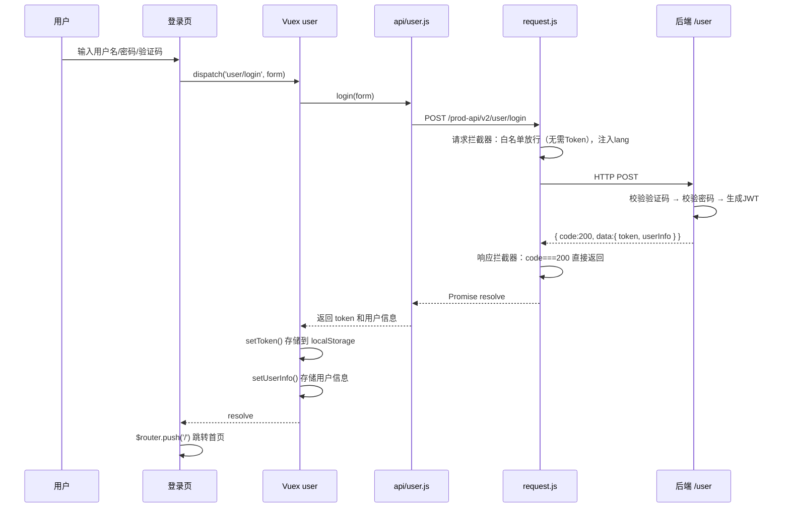
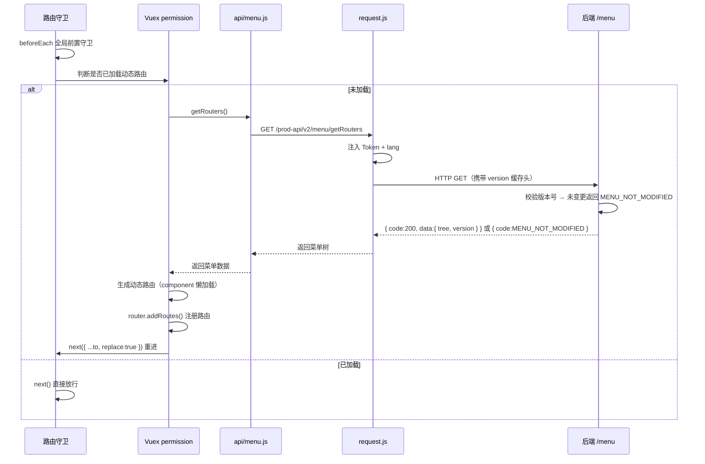
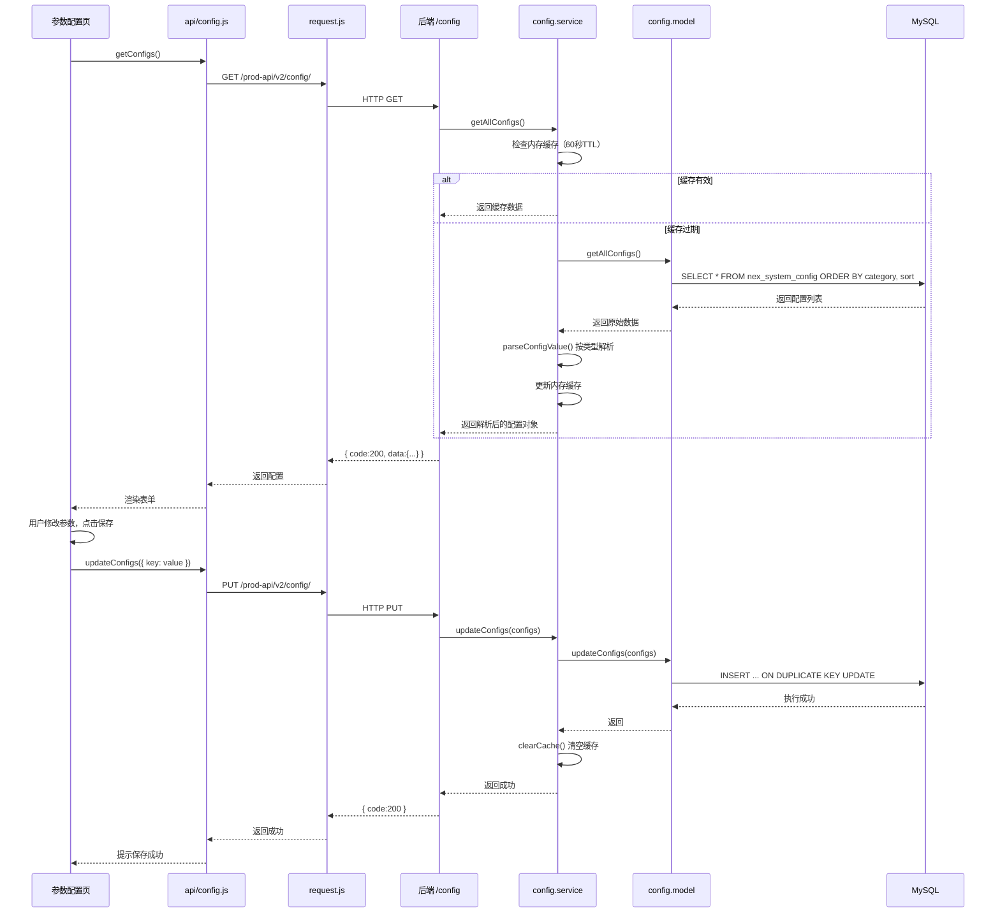
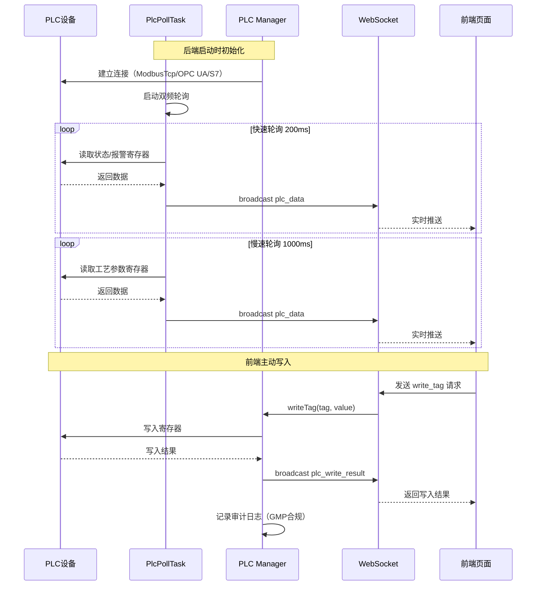
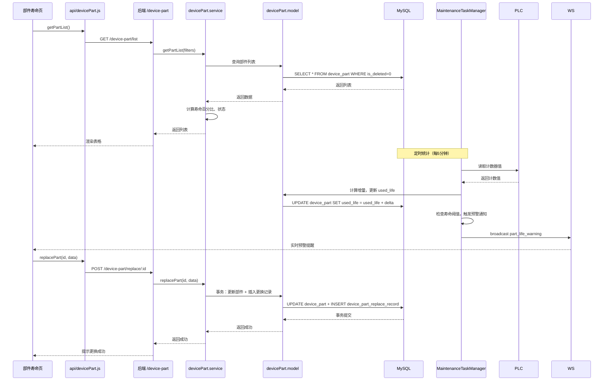
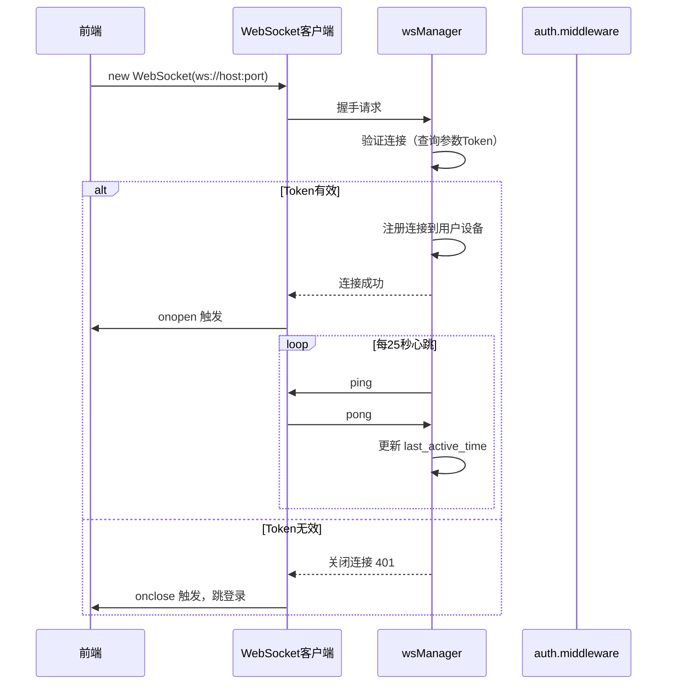
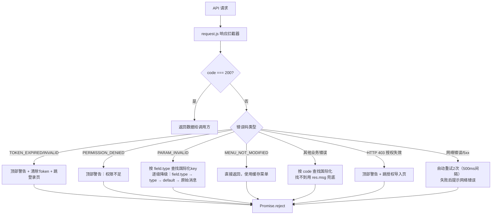
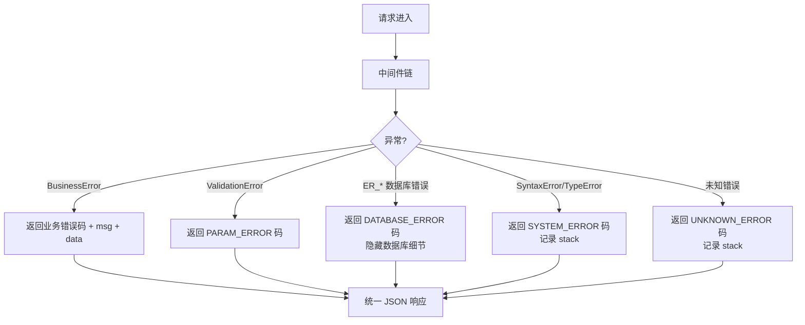

# 接口调用链路与前后端对应关系

> 文档版本：v1.0 | 更新日期：2026-09-06 | API 前缀：`/prod-api/v2/{module}`

---

## 一、接口体系总览

### 1.1 路由挂载机制

后端采用**自动扫描路由**机制，启动时遍历 `src/modules/` 目录，自动加载每个模块的 `*.route.js` 文件，并挂载到 `/prod-api/v2/{模块名}` 前缀下。新增模块无需手动注册。

```
前端请求 → http://localhost:3000/prod-api/v2/{module}/{path}
                ↑                    ↑          ↑
         VUE_APP_BASE_API     自动扫描前缀   模块内路由
```

### 1.2 接口统计

| 模块 | 接口数 | 认证要求 | 说明 |
|------|--------|----------|------|
| user | 22 | 部分公开 | 用户认证、用户管理、在线设备 |
| role | 6 | 需认证 | 角色管理 |
| permission | 4 | 需认证 | 权限配置 |
| menu | 2 | 需认证 | 菜单/动态路由 |
| dept | 5 | 需认证 | 部门管理 |
| dict | 13 | 需认证 | 字典管理 |
| config | 3 | 需认证 | 系统配置 |
| audit | 3 | 需认证 | 审计日志 |
| notification | 16 | 需认证 | 通知中心 |
| email | 16 | 需认证 | 邮箱配置与日志 |
| license | 5 | 白名单 | 授权管理 |
| device-part | 19 | 需认证 | 部件寿命管理 |
| plc | 5 | 需认证 | PLC 通信 |
| captcha | 1 | 公开 | 图形验证码 |
| upload | 6 | 需认证 | 文件上传 |
| customer | 7 | 需认证 | 客户管理 |
| feature-config | 9 | 需认证 | 功能开关配置 |
| db-manager | 11 | 超级管理员 | 数据库管理 |
| file-manager | 10 | 超级管理员 | 文件管理 |
| i18n-manager | 13 | 超级管理员 | 国际化管理 |
| project-config | 1 | 超级管理员 | 项目配置 |
| translation | 5 | 需认证 | 翻译服务 |
| **合计** | **~181** | - | - |

### 1.3 统一响应格式

```json
// 成功响应
{
  "code": 200,
  "msg": "操作成功",
  "data": { ... },
  "timestamp": 1693800000000
}

// 业务错误响应
{
  "code": "ERROR_CODE",
  "msg": "错误描述（中文，调试用）",
  "data": { "field": "xxx", "type": "string.min", "message": "..." },
  "timestamp": 1693800000000
}
```

> 前端根据 `code` 判断业务状态，`data` 中的动态参数用于国际化模板填充。

---

## 二、核心业务接口链路

### 2.1 登录认证链路



**接口详情**：

| 方法 | 路径 | 认证 | 说明 |
|------|------|------|------|
| GET | `/captcha/captchaImage` | 公开 | 获取图形验证码（SVG） |
| POST | `/user/login` | 公开 | 用户登录，返回 Token |
| POST | `/user/register` | 公开 | 用户注册 |
| POST | `/user/forgot-password/send-code` | 公开 | 忘记密码-发送验证码 |
| POST | `/user/forgot-password/reset` | 公开 | 忘记密码-重置密码 |
| GET | `/user/info` | 需认证 | 获取当前登录用户信息 |
| GET | `/user/tokenvalid` | 可选认证 | Token 有效性校验 |

### 2.2 动态路由/菜单加载链路



**接口详情**：

| 方法 | 路径 | 认证 | 说明 |
|------|------|------|------|
| GET | `/menu/version` | 需认证 | 获取菜单最新版本号 |
| GET | `/menu/getRouters` | 需认证 | 获取用户动态路由菜单树（带版本缓存） |

### 2.3 系统配置读写链路



**接口详情**：

| 方法 | 路径 | 认证 | 说明 |
|------|------|------|------|
| GET | `/config/` | 需认证 | 获取所有系统配置（带60秒内存缓存） |
| GET | `/config/category/:category` | 需认证 | 按分类获取配置 |
| PUT | `/config/` | 需认证 | 批量更新配置（自动清空缓存） |

### 2.4 PLC 数据采集与实时推送链路



**接口详情**：

| 方法 | 路径 | 认证 | 说明 |
|------|------|------|------|
| GET | `/plc/status` | 需认证 | 获取 PLC 连接状态 |
| GET | `/plc/read-tag` | 需认证 | 读取单个标签值 |
| GET | `/plc/read-all` | 需认证 | 读取所有标签值 |
| POST | `/plc/write-tag` | 需认证 | 写入标签值（记录审计日志） |
| POST | `/plc/reconnect` | 需认证 | 重新连接 PLC |

### 2.5 部件寿命管理链路



**接口详情**：

| 方法 | 路径 | 认证 | 说明 |
|------|------|------|------|
| GET | `/device-part/templates` | 需认证 | 获取部件模板列表 |
| GET | `/device-part/templates/admin` | 需认证 | 获取模板列表（管理用，含禁用） |
| GET | `/device-part/templates/base` | 需认证 | 获取基础模板列表 |
| GET | `/device-part/templates/:id` | 需认证 | 获取模板详情 |
| POST | `/device-part/templates/add` | 需认证 | 新增模板 |
| PUT | `/device-part/templates/update/:id` | 需认证 | 更新模板 |
| DELETE | `/device-part/templates/delete/:id` | 需认证 | 删除模板 |
| GET | `/device-part/list` | 需认证 | 获取部件列表 |
| GET | `/device-part/:id` | 需认证 | 获取部件详情 |
| POST | `/device-part/add` | 需认证 | 新增部件 |
| PUT | `/device-part/update/:id` | 需认证 | 更新部件 |
| DELETE | `/device-part/delete/:id` | 需认证 | 删除部件（软删除） |
| POST | `/device-part/replace/:id` | 需认证 | 录入部件更换 |
| POST | `/device-part/update-life/:id` | 需认证 | 更新单个部件已用寿命 |
| POST | `/device-part/batch-update-life` | 需认证 | 批量更新部件寿命 |
| GET | `/device-part/replace-records/list` | 需认证 | 获取更换记录列表 |
| GET | `/device-part/warning-parts/list` | 需认证 | 获取预警部件列表 |

---

## 三、前后端 API 文件对应关系

### 3.1 前端 API 层文件清单

| 前端 API 文件 | 对应后端模块 | 主要接口 |
|--------------|-------------|----------|
| `api/user.js` | user | 登录、注册、用户CRUD、重置密码、解锁、在线设备 |
| `api/role.js` | role | 角色CRUD、角色列表 |
| `api/permission.js` | permission | 权限树、角色权限、保存权限 |
| `api/menu.js` | menu | 菜单版本、动态路由 |
| `api/dept.js` | dept | 部门树、部门CRUD |
| `api/dict.js` | dict | 字典类型CRUD、字典项CRUD、按code获取 |
| `api/config.js` | config | 获取配置、更新配置 |
| `api/audit.js` | audit | 审计日志列表、我的日志、完整性校验 |
| `api/notification.js` | notification | 通知列表、未读数、标记已读、删除、设置 |
| `api/email.js` | email | 邮箱配置CRUD、测试邮件、邮件日志 |
| `api/license.js` | license | 授权导入、状态、机器码、时间同步、下载 |
| `api/devicePart.js` | device-part | 部件CRUD、模板CRUD、更换记录、寿命更新 |
| `api/plc.js` | plc | PLC状态、读写标签、重连 |
| `api/upload.js` | upload | 文件上传、删除 |
| `api/customer.js` | customer | 客户CRUD、批量删除、状态更新 |
| `api/feature.js` | feature-config | 功能开关CRUD、重置、批量更新 |
| `api/projectConfig.js` | project-config | 获取项目所有配置 |
| `api/database.js` | db-manager | 表列表、表结构、表数据、备份恢复 |
| `api/translation.js` | translation | 翻译配置、翻译、批量翻译 |
| `api/i18nManage.js` | i18n-manager | 国际化文件管理、备份恢复 |
| `api/recipe.js` | - | 配方管理（后端模块待确认） |
| `api/order.js` | - | 生产订单（后端模块待确认） |

### 3.2 前端页面与 API 调用关系

| 前端页面 (views/) | 调用的 API 文件 | 主要操作 |
|-------------------|----------------|----------|
| login/index.vue | user.js, captcha | 登录、获取验证码 |
| home/overview/ | user.js, notification.js | 概览统计、未读通知 |
| home/dashboard/ | plc.js, order.js | 实时数据、生产统计 |
| home/dataview/ | order.js, plc.js | 数据查询、导出 |
| device/state/ | plc.js | PLC状态、实时数据 |
| device/alarm/ | plc.js | 报警查询、处理 |
| device/part/ | devicePart.js | 部件CRUD、模板管理、更换录入 |
| production/recipe/ | recipe.js | 配方CRUD、下载 |
| production/order/ | order.js | 订单CRUD、状态变更、报告导出 |
| system/user/ | user.js | 用户CRUD、重置密码、解锁 |
| system/audit/ | audit.js | 审计日志查询、详情 |
| system/config/ | config.js | 参数配置读写 |
| permission-core/ | permission.js, role.js | 权限树配置、角色选择 |
| super-panel/dict/ | dict.js | 字典类型/项CRUD |
| super-panel/dept/ | dept.js | 部门树CRUD |
| super-panel/role/ | role.js, permission.js | 角色CRUD、权限配置 |
| super-panel/config/ | config.js, email.js | 参数配置、邮箱配置 |
| super-panel/feature/ | feature.js | 功能开关配置 |
| super-panel/database/ | database.js | 数据库表管理、备份 |
| super-panel/project-config/ | projectConfig.js | 项目配置查看 |
| notification/ | notification.js | 通知列表、已读、删除、设置 |
| license/ | license.js | 授权导入、状态查看 |
| profile/ | user.js | 个人信息、修改密码 |

---

## 四、WebSocket 实时通信链路

### 4.1 WebSocket 消息类型

| 消息类型 | 方向 | 说明 | 触发场景 |
|----------|------|------|----------|
| `plc_status` | 服务端→客户端 | PLC 连接状态变更 | 连接/断开、启动时推送 |
| `plc_data` | 服务端→客户端 | PLC 实时数据 | 轮询采集到新数据 |
| `plc_write_result` | 服务端→客户端 | PLC 写入结果 | 前端请求写入后 |
| `device_status` | 服务端→客户端 | 设备在线状态 | 心跳超时/恢复 |
| `notification` | 服务端→客户端 | 新通知消息 | 系统事件触发通知 |
| `part_life_warning` | 服务端→客户端 | 部件寿命预警 | 寿命达到阈值 |
| `heartbeat` | 双向 | 心跳保活 | 每25秒（可配置） |
| `auth` | 客户端→服务端 | 连接认证 | 连接建立后发送Token |

### 4.2 WebSocket 连接链路



---

## 五、错误处理链路

### 5.1 前端错误处理流程



### 5.2 后端错误处理流程



---

## 六、接口设计规范

### 6.1 RESTful 规范

| 操作 | HTTP 方法 | 路径示例 | 说明 |
|------|-----------|----------|------|
| 查询列表 | GET | `/user?page=1&pageSize=20` | 分页查询 |
| 查询单个 | GET | `/user/:id` | 按ID查询 |
| 新增 | POST | `/user` | 创建资源 |
| 更新 | PUT | `/user/:id` | 全量更新 |
| 部分更新 | PATCH | `/user/:id/status` | 状态变更等 |
| 删除 | DELETE | `/user/:id` | 删除资源 |
| 批量删除 | DELETE | `/user/batch` | body 传 ID 数组 |

### 6.2 分页参数

| 参数 | 类型 | 默认值 | 说明 |
|------|------|--------|------|
| page | number | 1 | 当前页码 |
| pageSize | number | 20 | 每页条数（最大100） |
| keyword | string | - | 搜索关键词 |
| sortField | string | - | 排序字段 |
| sortOrder | string | - | 排序方向 asc/desc |

### 6.3 分页响应

```json
{
  "code": 200,
  "data": {
    "list": [...],
    "total": 100,
    "page": 1,
    "pageSize": 20
  }
}
```

---

*文档结束*
